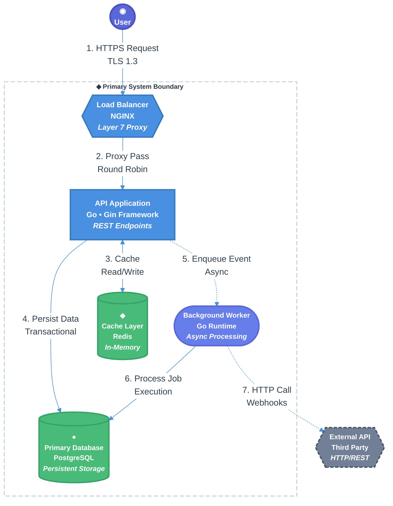

You are tasked with creating a spec for implementing a new feature or system change in the codebase by leveraging existing research in the **$ARGUMENTS** path. If no research path is specified, use the entire `research/` directory. IMPORTANT: Research documents are located in the `research/` directory — do NOT look in the `specs/` directory for research. Follow the template below to produce a comprehensive specification as output in the `specs/` folder using the findings from RELEVANT research documents found in `research/`. The spec file MUST be named using the format `YYYY-MM-DD-topic.md` (e.g., `specs/2026-03-26-my-feature.md`), where the date is the current date and the topic is a kebab-case summary. Tip: It's good practice to use the `codebase-research-locator` and `codebase-research-analyzer` agents to help you find and analyze the research documents in the `research/` directory. It is also HIGHLY recommended to cite relevant research throughout the spec for additional context.

<EXTREMELY_IMPORTANT>

- FORMALIZE the user's design intent using the intent-formalization framework BEFORE writing any spec content. Specs encode critical architectural decisions — getting the intent wrong wastes engineering effort and can lead to building the wrong thing entirely. See "Phase 0: Formalize Design Intent" below for the full process.
- Please DO NOT implement anything in this stage, just create the comprehensive spec as described below.
- When writing the spec, DO NOT include information about concrete dates/timelines (e.g. # minutes, hours, days, weeks, etc.) and favor explicit phases (e.g. Phase 1, Phase 2, etc.).
- Once the spec is generated, refer to the section, "## 9. Open Questions / Unresolved Issues", go through each question one by one, and use **contrastive clarification** (presenting 2-3 specific options with concrete tradeoffs) rather than open-ended questions. This means presenting interpretations like "(A) Option X — tradeoff Y" and "(B) Option Z — tradeoff W" instead of asking "what do you think about X?". Update the spec with the user's answers as you walk through the questions.
- Finally, once the spec is generated and after open questions are answered, provide an executive summary of the spec to the user including the path to the generated spec document in the `specs/` directory.
    - Encourage the user to review the spec for best results and provide feedback or ask any follow-up questions they may have.

</EXTREMELY_IMPORTANT>

## Phase 0: Formalize Design Intent

Before writing any spec content, apply the intent-formalization framework to ensure the spec captures the right design decisions. Specs are high-leverage documents — they guide implementation for potentially many engineers. Getting the intent wrong is far more costly than spending extra time upfront to formalize it.

<intent_formalization>

### 0a. Build a World Model (Rung 1 — Zero User Effort)

Silently gather context to resolve as much ambiguity as possible before asking the user anything:

1. **Read research documents.** Use the **codebase-research-locator** and **codebase-research-analyzer** agents to find and analyze relevant documents in the `research/` directory (or the path specified in `$ARGUMENTS`). Research docs reveal what was learned, what problems were found, and what tradeoffs were considered — all critical inputs for a spec.
2. **Check existing specs.** Scan `specs/` for related design documents. If a prior spec exists for the same system, this spec likely extends or modifies it — inherit the original spec's scope boundaries, constraints, and non-goals unless the user explicitly wants to change them.
3. **Understand the codebase.** Use the **codebase-locator** and **codebase-analyzer** agents to understand the current state of the system being specified. The spec's "Current State" section should reflect reality, not assumptions.
4. **Check recent changes.** Run `git --no-pager log --oneline -15` to understand recent development context. A spec requested right after a refactor likely extends that work.

### 0b. Assess Ambiguity and Risk

Apply the **ambiguity/risk matrix** from intent-formalization:

|                      | Low Risk (additive feature, isolated scope)  | High Risk (cross-cutting, breaking changes)        |
| -------------------- | -------------------------------------------- | -------------------------------------------------- |
| **Clear intent**     | Emit plan summary (Rung 2), then write spec  | Structured intent schema (Rung 4), then write spec |
| **Ambiguous intent** | Contrastive clarification (Rung 3)           | Full structured intent + change schema (Rung 4)    |

Specs are inherently high-leverage, so lean toward more formalization rather than less.

**Signals the design intent is ambiguous:**
- The user says "write a spec for X" but X could be scoped in multiple ways
- Multiple viable architectural approaches exist (e.g., event-driven vs. synchronous, monolith vs. microservice)
- The feature touches existing systems and it's unclear what should change vs. stay the same
- The user hasn't specified goals vs. non-goals
- Research documents present multiple alternatives without a clear recommendation

### 0c. Clarify Using the Appropriate Rung

**If >90% confident (Rung 2 — Plan Summary):** State your understanding and let the user correct:

> "I'll write a spec for adding Redis caching to the user lookup endpoint. Scope: the GET /users/:id handler and cache invalidation on user updates. I'll pull from the existing research in `research/docs/2026-03-20-caching-analysis.md`. Sound right?"

**If 2-3 viable approaches exist (Rung 3 — Contrastive Clarification):** Present specific design directions with tradeoffs — never ask open-ended "what approach do you prefer?":

> I see a couple of architectural approaches for this feature:
>
> **(A) Event-driven** — User updates publish events; a cache service subscribes and invalidates. More complex but decouples cache management from the API layer.
>
> **(B) Write-through cache** — The API handler updates cache on every write. Simpler but couples cache logic to the endpoint.
>
> Which direction should the spec take?

**If the feature is complex or modifies existing systems (Rung 4 — Structured Intent Schema):** Produce a full intent object, pre-populated from research and existing specs. Pre-populating reduces the user's validation effort — they're reviewing a mostly-complete plan rather than building one from scratch:

```yaml
Spec Goal: [What this spec proposes to build or change]
Scope:
  in_bounds:
    - [Systems, modules, or components this spec covers]
  out_of_bounds:
    - [What this spec explicitly does NOT cover]
Approach: [High-level architectural direction]
Constraints:
  must_change:
    - [What specifically needs to be different]
  must_preserve:
    - [Existing behaviors, APIs, or invariants that must not break]
  behavioral_delta:
    before: [Current behavior]
    after: [Desired behavior]
Success Criteria: [How we know the implementation is correct]
Risk Level: [Low / Medium / High — and why]
Prior Art:
  specs: [List of related existing specs]
  research: [List of relevant research documents]
```

Present this with: "I based this on the existing research at `research/docs/...` and the spec at `specs/...` — let me know if your intent differs from what I've captured."

The `must_preserve` section is critical for modification specs. Without it, an engineer might "add caching" by restructuring the entire endpoint — technically correct but violating the implicit expectation that everything else stays the same. Surface these constraints from:
- **From specs**: Non-goals, out-of-scope items, and explicitly preserved behaviors
- **From research**: Known edge cases, regression bugs, and behavioral invariants
- **From the decision trail**: When a spec chose approach A over B and research explains why, that reasoning is a constraint

### 0d. Carry Formalized Intent into the Spec

The formalized intent directly maps to spec sections — this mapping ensures every section traces back to a validated design decision rather than an assumption:

| Formalized Intent Field         | Spec Section                              |
| ------------------------------- | ----------------------------------------- |
| **Spec Goal**                   | § 1. Executive Summary                    |
| **must_change / behavioral_delta** | § 2. Context and Motivation            |
| **Scope (in/out_of_bounds)**    | § 3. Goals and Non-Goals                  |
| **Approach**                    | § 4. Proposed Solution                    |
| **Constraints (must_preserve)** | § 7. Cross-Cutting Concerns               |
| **Success Criteria**            | § 8.3. Test Plan                          |
| **Prior Art**                   | Citations throughout                      |

</intent_formalization>

# [Project Name] Technical Design Document / RFC

| Document Metadata      | Details                                                                        |
| ---------------------- | ------------------------------------------------------------------------------ |
| Author(s)              | !`git config user.name`                                                        |
| Status                 | Draft (WIP) / In Review (RFC) / Approved / Implemented / Deprecated / Rejected |
| Team / Owner           |                                                                                |
| Created / Last Updated |                                                                                |

## 1. Executive Summary

_Instruction: A "TL;DR" of the document. Assume the reader is a VP or an engineer from another team who has 2 minutes. Summarize the Context (Problem), the Solution (Proposal), and the Impact (Value). Keep it under 200 words._

> **Example:** This RFC proposes replacing our current nightly batch billing system with an event-driven architecture using Kafka and AWS Lambda. Currently, billing delays cause a 5% increase in customer support tickets. The proposed solution will enable real-time invoicing, reducing billing latency from 24 hours to <5 minutes.

## 2. Context and Motivation

_Instruction: Why are we doing this? Why now? Link to the Product Requirement Document (PRD)._

### 2.1 Current State

_Instruction: Describe the existing architecture. Use a "Context Diagram" if possible. Be honest about the flaws._

- **Architecture:** Currently, Service A communicates with Service B via a shared SQL database.
- **Limitations:** This creates a tight coupling; when Service A locks the table, Service B times out.

### 2.2 The Problem

_Instruction: What is the specific pain point?_

- **User Impact:** Customers cannot download receipts during the nightly batch window.
- **Business Impact:** We are losing $X/month in churn due to billing errors.
- **Technical Debt:** The current codebase is untestable and has 0% unit test coverage.

## 3. Goals and Non-Goals

_Instruction: This is the contract Definition of Success. Be precise._

### 3.1 Functional Goals

- [ ] Users must be able to export data in CSV format.
- [ ] System must support multi-tenant data isolation.

### 3.2 Non-Goals (Out of Scope)

_Instruction: Explicitly state what you are NOT doing. This prevents scope creep._

- [ ] We will NOT support PDF export in this version (CSV only).
- [ ] We will NOT migrate data older than 3 years.
- [ ] We will NOT build a custom UI (API only).

## 4. Proposed Solution (High-Level Design)

_Instruction: The "Big Picture." Diagrams are mandatory here._

### 4.1 System Architecture Diagram

_Instruction: Insert a C4 System Context or Container diagram. Show the "Black Boxes."_

- (Place Diagram Here - e.g., Mermaid diagram)

For example,



### 4.2 Architectural Pattern

_Instruction: Name the pattern (e.g., "Event Sourcing", "BFF - Backend for Frontend")._

- We are adopting a Publisher-Subscriber pattern where the Order Service publishes `OrderCreated` events, and the Billing Service consumes them asynchronously.

### 4.3 Key Components

| Component         | Responsibility              | Technology Stack  | Justification                                |
| ----------------- | --------------------------- | ----------------- | -------------------------------------------- |
| Ingestion Service | Validates incoming webhooks | Go, Gin Framework | High concurrency performance needed.         |
| Event Bus         | Decouples services          | Kafka             | Durable log, replay capability.              |
| Projections DB    | Read-optimized views        | MongoDB           | Flexible schema for diverse receipt formats. |

## 5. Detailed Design

_Instruction: The "Meat" of the document. Sufficient detail for an engineer to start coding._

### 5.1 API Interfaces

_Instruction: Define the contract. Use OpenAPI/Swagger snippets or Protocol Buffer definitions._

**Endpoint:** `POST /api/v1/invoices`

- **Auth:** Bearer Token (Scope: `invoice:write`)
- **Idempotency:** Required header `X-Idempotency-Key`
- **Request Body:**

```json
{ "user_id": "uuid", "amount": 100.0, "currency": "USD" }
```

### 5.2 Data Model / Schema

_Instruction: Provide ERDs (Entity Relationship Diagrams) or JSON schemas. Discuss normalization vs. denormalization._

**Table:** `invoices` (PostgreSQL)

| Column    | Type | Constraints       | Description           |
| --------- | ---- | ----------------- | --------------------- |
| `id`      | UUID | PK                |                       |
| `user_id` | UUID | FK -> Users       | Partition Key         |
| `status`  | ENUM | 'PENDING', 'PAID' | Indexed for filtering |

### 5.3 Algorithms and State Management

_Instruction: Describe complex logic, state machines, or consistency models._

- **State Machine:** An invoice moves from `DRAFT` -> `LOCKED` -> `PROCESSING` -> `PAID`.
- **Concurrency:** We use Optimistic Locking on the `version` column to prevent double-payments.

## 6. Alternatives Considered

_Instruction: Prove you thought about trade-offs. Why is your solution better than the others?_

| Option                           | Pros                               | Cons                                      | Reason for Rejection                                                          |
| -------------------------------- | ---------------------------------- | ----------------------------------------- | ----------------------------------------------------------------------------- |
| Option A: Synchronous HTTP Calls | Simple to implement, Easy to debug | Tight coupling, cascading failures        | Latency requirements (200ms) make blocking calls risky.                       |
| Option B: RabbitMQ               | Lightweight, Built-in routing      | Less durable than Kafka, harder to replay | We need message replay for auditing (Compliance requirement).                 |
| Option C: Kafka (Selected)       | High throughput, Replayability     | Operational complexity                    | **Selected:** The need for auditability/replay outweighs the complexity cost. |

## 7. Cross-Cutting Concerns

### 7.1 Security and Privacy

- **Authentication:** Services authenticate via mTLS.
- **Authorization:** Policy enforcement point at the API Gateway (OPA - Open Policy Agent).
- **Data Protection:** PII (Names, Emails) is encrypted at rest using AES-256.
- **Threat Model:** Primary threat is compromised API Key; remediation is rapid rotation and rate limiting.

### 7.2 Observability Strategy

- **Metrics:** We will track `invoice_creation_latency` (Histogram) and `payment_failure_count` (Counter).
- **Tracing:** All services propagate `X-Trace-ID` headers (OpenTelemetry).
- **Alerting:** PagerDuty triggers if `5xx` error rate > 1% for 5 minutes.

### 7.3 Scalability and Capacity Planning

- **Traffic Estimates:** 1M transactions/day = ~12 TPS avg / 100 TPS peak.
- **Storage Growth:** 1KB per record \* 1M = 1GB/day.
- **Bottleneck:** The PostgreSQL Write node is the bottleneck. We will implement Read Replicas to offload traffic.

## 8. Migration, Rollout, and Testing

### 8.1 Deployment Strategy

- [ ] Phase 1: Deploy services in "Shadow Mode" (process traffic but do not email users).
- [ ] Phase 2: Enable Feature Flag `new-billing-engine` for 1% of internal users.
- [ ] Phase 3: Ramp to 100%.

### 8.2 Data Migration Plan

- **Backfill:** We will run a script to migrate the last 90 days of invoices from the legacy SQL server.
- **Verification:** A "Reconciliation Job" will run nightly to compare Legacy vs. New totals.

### 8.3 Test Plan

- **Unit Tests:**
- **Integration Tests:**
- **End-to-End Tests:**

## 9. Open Questions / Unresolved Issues

_Instruction: List known unknowns. These must be resolved before the doc is marked "Approved"._

- [ ] Will the Legal team approve the 3rd party library for PDF generation?
- [ ] Does the current VPC peering allow connection to the legacy mainframe?
