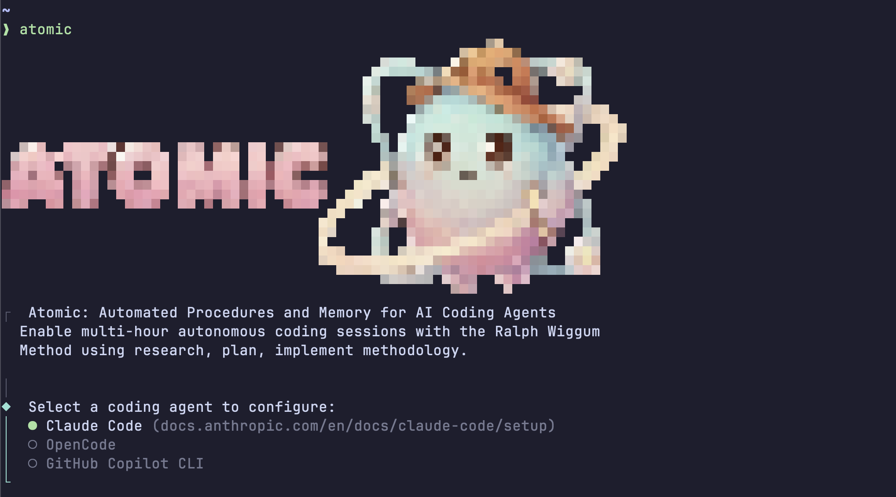

# Atomic

<p align="center">
  
</p>

AI coding agents are exceptionally powerful but have key gaps in principled software engineering, context, and memory. This makes them difficult to use in large codebases or generate higher quality code.

Engineers spend a lot of their time figuring out how to get tools to work for them rather than iterating on and shipping code with AI coding agents.

This project is named 'Atomic' for its approach of decomposing complex goals into discrete, manageable steps. By following core Software Development Lifecycle (SDLC) principles, it creates a foundation for effectively steering AI coding agents. This approach enables engineers to transition from vibe coding to true AI-assisted development.

This repo automates AI coding agents with an operating procedure and memory.

We provide the procedures that agents use to work on your project based on software engineering best practices, and specs that persist as memory of decisions made and lessons learned.

---

## Key Principle

**You own the decisions. Agents own the execution.**

- Review specs before implementation (architecture decisions)
- Review code after each feature (quality gate)
- The 40-60% rule: agents get you most of the way, you provide the polish
- Play around with the agents and use them as your swiss army knife

---

## Video Overview

[](https://www.youtube.com/watch?v=Lq8-qzGfoy4)

---

## The ROI

**1 minute of setup. Maximum output.**

- **Minimal set of curated sub-agents** for the most common workflows
- **Skills and commands** that enforce proven software engineering practices
- **Overnight autonomous execution** (Ralph) means waking up to completed features ready for review

This approach highlights the best of SDLC and gets you 40-60% of the way there so you can review, refactor, and continue in a flow state.

---

## Set up Atomic

> Install Atomic and start using it with your preferred AI coding agent.

### System requirements

- **Operating Systems**: macOS, Linux, or Windows (with PowerShell)
- **Hardware**: Minimal requirements
- **Network**: Internet connection required for installation
- **Coding agent installed** (at least one):
  - [Claude Code](https://code.claude.com/docs/en/quickstart)
  - [OpenCode](https://opencode.ai)
  - [GitHub Copilot CLI](https://github.com/features/copilot/cli)

#### Additional dependencies

- **Bun**: Only required for [bun installation](#bun-installation)

### Installation

To install Atomic, use one of the following methods:

#### Native install (Recommended)

**macOS, Linux:**

```bash
curl -fsSL https://raw.githubusercontent.com/flora131/atomic/main/install.sh | bash
```

**Windows PowerShell:**

```powershell
irm https://raw.githubusercontent.com/flora131/atomic/main/install.ps1 | iex
```

#### bun installation

```bash
# Using bun
bun add -g @bastani/atomic
```

**Without installation (one-time use):**

```bash
bunx @bastani/atomic
```

### Getting started

After installation, navigate to your project and run Atomic with your preferred agent:

```bash
cd your-awesome-project
atomic run claude
```

Select your agent. The CLI configures your project automatically.

### Install a specific version

**macOS, Linux:**

```bash
curl -fsSL https://raw.githubusercontent.com/flora131/atomic/main/install.sh | bash -s -- v1.0.0
```

**Windows PowerShell:**

```powershell
iex "& { $(irm https://raw.githubusercontent.com/flora131/atomic/main/install.ps1) } -Version v1.0.0"
```

### Custom install directory

**macOS, Linux:**

```bash
ATOMIC_INSTALL_DIR=/usr/local/bin curl -fsSL https://raw.githubusercontent.com/flora131/atomic/main/install.sh | bash
```

**Windows PowerShell:**

```powershell
$env:ATOMIC_INSTALL_DIR = "C:\tools"; irm https://raw.githubusercontent.com/flora131/atomic/main/install.ps1 | iex
```

---

## The Flywheel

```
Research → Specs → Execution → Outcomes → Specs (persistent memory)
                ↑                                    ↓
                └────────────────────────────────────┘
```

Every feature follows this cycle. Specs and research become memory for future sessions.

---

## How It Works

[](assets/architecture.svg)

---

## The Workflow

```
Research → Plan (Spec) → Implement (Ralph) → (Debug) → PR
```

### 1. Research the Codebase

```bash
# for claude-code
atomic run claude -- "/research-codebase [Describe your feature or question]"

# for opencode
atomic run opencode
# then type:
/research-codebase "Describe your feature or question"

# for copilot
atomic run copilot -- -i "/research-codebase Describe your feature or question"
```

```bash
# clear context window before next step
/clear
```

**You review:** Confirm the agent understood your codebase and requirements.

### 2. Create a Specification

```bash
# for claude-code
atomic run claude -- "/create-spec [research-path]"

# for opencode
atomic run opencode
# then type:
/create-spec [research-path]

# for copilot
atomic run copilot -- -i "/create-spec [research-path]"
```

```bash
# clear context window before next step
/clear
```

**You review (CRITICAL):** This is your main decision point. The spec becomes the contract.

### 3. Break Into Features

```bash
# for claude-code
atomic run claude -- "/create-feature-list [spec-path]"

# for opencode
atomic run opencode
# then type:
/create-feature-list [spec-path]

# for copilot
atomic run copilot -- -i "/create-feature-list [spec-path]"
```

```bash
# clear context window before next step
/clear
```

**What happens:** Creates `feature-list.json` and `progress.txt` with:

- Ordered list of features
- Dependencies between features
- Acceptance criteria for each

**You review:** Verify the breakdown makes sense. Reorder if needed.

### 4. Implement Features

```bash
# for claude-code
atomic run claude -- "/implement-feature"

# for opencode
atomic run opencode
# then type:
/implement-feature

# for copilot
atomic run copilot -- -i "/implement-feature"
```

```bash
# clear context window before next feature implementation
/clear
```

**What happens:** The agent:

1. Reads `feature-list.json` for the next highest priority unsolved task
2. References the spec/research for context
3. Generates a commit for the feature
4. Updates `progress.txt`

Repeat until all features pass.

Or, use `/ralph:ralph-loop` for autonomous mode to enable multi-hour autonomous coding sessions. More in [Ralph Section](#autonomous-execution-ralph):

```bash
# for claude-code
atomic run claude -- "/ralph:ralph-loop"

# for opencode
atomic run opencode
# then type:
/ralph:ralph-loop

# for copilot
atomic run copilot -- -i "/ralph:ralph-loop"
```

### 5. Debugging

Software engineering is highly non-linear. You are bound to need to debug along the way.

If something breaks during implementation that the agent did not catch, you can manually debug:

First, generate a debugging report:

```bash
# for claude-code
atomic run claude -- "Use the debugging agent to create a debugging report for [insert error message here]."

# for opencode
atomic run opencode
# then type:
"Use the debugging agent to create a debugging report for [insert error message here]."

# for copilot
atomic run copilot -- --agent debugger -i "Create a debugging report for [insert error message here]."
```

Then, use the debugging report to guide your agent in the CLI:

```txt
"Follow the debugging report above to resolve the issue."
```

### 6. Create Pull Request

```bash
# for claude-code
atomic run claude -- "/create-gh-pr"

# for opencode
atomic run opencode
# then type:
/create-gh-pr

# for copilot
atomic run copilot -- -i "/create-gh-pr"
```

---

## Commands, Agents, and Skills

### Commands

User-invocable slash commands that orchestrate workflows.

| Command                | Arguments         | Description                            |
| ---------------------- | ----------------- | -------------------------------------- |
| `/research-codebase`   | `[question]`      | Analyze codebase and document findings |
| `/create-spec`         | `[research-path]` | Generate technical specification       |
| `/create-feature-list` | `[spec-path]`     | Break spec into implementable tasks    |
| `/implement-feature`   | —                 | Implement next feature from list       |
| `/commit`              | `[message]`       | Create conventional commit             |
| `/create-gh-pr`        | —                 | Push and create pull request           |
| `/explain-code`        | `[path]`          | Explain code section in detail         |
| `/ralph:ralph-loop`    | —                 | Run autonomous implementation loop     |
| `/ralph:cancel-ralph`  | —                 | Stop autonomous loop                   |
| `/ralph:ralph-help`    | —                 | Show Ralph documentation               |

### Agents

Sub-agents that execute specialized tasks. These are invoked automatically by commands or can be requested directly.

| Agent                        | Purpose                                               |
| ---------------------------- | ----------------------------------------------------- |
| `codebase-analyzer`          | Analyze implementation details of specific components |
| `codebase-locator`           | Locate files, directories, and components for a task  |
| `codebase-pattern-finder`    | Find similar implementations and usage examples       |
| `codebase-online-researcher` | Research questions using web sources                  |
| `codebase-research-analyzer` | Deep dive on research topics                          |
| `codebase-research-locator`  | Discover relevant documents in `research/` directory  |
| `debugger`                   | Debug errors, test failures, and unexpected behavior  |

### Skills

Domain knowledge applied during work. These are automatically invoked when relevant.

| Skill                   | Purpose                                                       |
| ----------------------- | ------------------------------------------------------------- |
| `testing-anti-patterns` | Prevent common testing mistakes (mock misuse, test pollution) |
| `prompt-engineer`       | Apply best practices when creating or improving prompts       |

---

## Supported Coding Agents

| Agent              | CLI Command           | Folder       | Context File |
| ------------------ | --------------------- | ------------ | ------------ |
| Claude Code        | `atomic run claude`   | `.claude/`   | `CLAUDE.md`  |
| OpenCode           | `atomic run opencode` | `.opencode/` | `AGENTS.md`  |
| GitHub Copilot CLI | `atomic run copilot`  | `.github/`   | `AGENTS.md`  |

> **Note:** Use `--` to separate atomic flags from agent arguments. Everything after `--` is passed directly to the agent:
>
> ```bash
> atomic run claude -- "/research-codebase [question]"
> atomic run opencode
> ```

---

## Autonomous Execution (Ralph)

<p align="center">
  
</p>

The [Ralph Wiggum Method](https://ghuntley.com/ralph/) enables multi-hour autonomous coding sessions. After approving your spec and feature list, let Ralph work in the background while you focus on other tasks.

### How It Works

1. Create and approve your spec (`/create-spec`)
2. Generate feature list (`/create-feature-list`)
3. Start autonomous loop (`/ralph:ralph-loop`)
4. Ralph implements features one-by-one until complete

### Commands

| Command               | Description                          |
| --------------------- | ------------------------------------ |
| `/ralph:ralph-loop`   | Start autonomous implementation loop |
| `/ralph:cancel-ralph` | Stop the autonomous loop             |
| `/ralph:ralph-help`   | Show Ralph documentation             |

### Parameters

| Parameter                       | Default                      | Description                          |
| ------------------------------- | ---------------------------- | ------------------------------------ |
| `[PROMPT]`                      | `/implement-feature`         | Initial prompt to run each iteration |
| `--max-iterations <n>`          | `0` (unlimited)              | Maximum iterations before auto-stop  |
| `--completion-promise '<text>'` | `null`                       | Phrase that signals task completion  |
| `--feature-list <path>`         | `research/feature-list.json` | Path to feature list JSON            |

### Exit Conditions

The loop exits when **any** of these conditions are met:

1. `--max-iterations` limit reached
2. `--completion-promise` phrase detected in output (via `<promise>TEXT</promise>` tags)
3. All features in `--feature-list` are passing (when using `/implement-feature` with no iteration limit)

### Examples

```bash
# Default: implement features until all pass
/ralph:ralph-loop

# Limit iterations
/ralph:ralph-loop --max-iterations 20

# Custom prompt with completion promise
/ralph:ralph-loop "Build a todo API" --completion-promise "DONE" --max-iterations 20

# Custom feature list path
/ralph:ralph-loop --feature-list specs/my-features.json
```

---

## Updating Atomic

### Native installation (Recommended)

If you installed Atomic using the native install script, you can update using the built-in command:

```bash
# Update to the latest version
atomic update
```

### bun installation

Use your package manager to update:

```bash
# Using bun
bun upgrade @bastani/atomic
```

---

## Uninstalling Atomic

### Native installation (CLI command)

If you installed Atomic using the native install script, you can uninstall using the built-in command:

```bash
# Preview what will be removed (no changes made)
atomic uninstall --dry-run

# Uninstall Atomic
atomic uninstall

# Keep configuration data, only remove binary
atomic uninstall --keep-config

# Skip confirmation prompt
atomic uninstall --yes  # or -y
```

The uninstall command will:

- Remove the Atomic binary from `~/.local/bin/atomic` (or your custom install directory)
- Remove configuration data from `~/.local/share/atomic` (unless `--keep-config` is used)
- Display instructions for removing the PATH entry from your shell configuration

### Native installation (manual)

If the CLI command is not available, you can manually remove the files:

**macOS, Linux:**

```bash
rm -f ~/.local/bin/atomic
rm -rf ~/.local/share/atomic
```

If you installed to a custom directory, remove the binary from that location instead.

**Windows PowerShell:**

```powershell
Remove-Item "$env:USERPROFILE\.local\bin\atomic.exe" -Force
Remove-Item "$env:LOCALAPPDATA\atomic" -Recurse -Force
```

### bun installation

```bash
# Using bun
bun remove -g @bastani/atomic
```

### Clean up configuration files (optional)

> **Warning:** Removing configuration files will delete all your project-specific settings, skills, and agents configured by Atomic.

To remove Atomic configuration files from a project:

**macOS, Linux:**

```bash
# For Claude Code
rm -rf .claude/ CLAUDE.md

# For OpenCode
rm -rf .opencode/ AGENTS.md

# For GitHub Copilot
rm -f .github/copilot-instructions.md
```

**Windows PowerShell:**

```powershell
# For Claude Code
Remove-Item -Path ".claude" -Recurse -Force
Remove-Item -Path "CLAUDE.md" -Force

# For OpenCode
Remove-Item -Path ".opencode" -Recurse -Force
Remove-Item -Path "AGENTS.md" -Force

# For GitHub Copilot
Remove-Item -Path ".github\copilot-instructions.md" -Force
```

---

## Telemetry

Atomic collects anonymous usage telemetry to help improve the product. All data is anonymous and privacy-respecting.

### What We Collect

- Command names (init, help, config, etc.)
- Agent type (claude, opencode, copilot)
- Success/failure status

### What We NEVER Collect

- Your prompts or queries
- File paths or code content
- IP addresses or location data
- Personal identifiable information

### Privacy Features

- **Anonymous ID rotation**: Your anonymous ID is automatically rotated monthly for enhanced privacy
- **CI auto-disable**: Telemetry is automatically disabled in CI environments
- **First-run consent**: You're prompted to opt-in during your first use of `atomic init`

### Opt-Out Methods

You can disable telemetry at any time using any of these methods:

```bash
# Using the config command
atomic config set telemetry false

# Using environment variables
export ATOMIC_TELEMETRY=0
# or
export DO_NOT_TRACK=1
```

To re-enable telemetry:

```bash
atomic config set telemetry true
```

---

## Troubleshooting

**Git Identity Error:** Configure git identity:

```bash
git config --global user.name "Your Name"
git config --global user.email "you@example.com"
```

**Windows Command Resolution:** If agents fail to spawn on Windows, ensure the agent CLI is in your PATH. Atomic uses `Bun.which()` to resolve command paths, which handles Windows `.cmd`, `.exe`, and `.bat` extensions automatically.

**File Preservation:** When re-running `atomic init`, your custom `CLAUDE.md` and `AGENTS.md` files are preserved by default. Use `--force` to overwrite all files including `CLAUDE.md`/`AGENTS.md`.

---

## FAQ

### How Atomic Differs from Spec-Kit

[Spec Kit](https://github.com/github/spec-kit) is GitHub's toolkit for "Spec-Driven Development" where specifications become executable artifacts. While both projects aim to improve AI-assisted development, they solve different problems:

| Aspect                 | Spec-Kit                                                        | Atomic                                                                                                                      |
| ---------------------- | --------------------------------------------------------------- | --------------------------------------------------------------------------------------------------------------------------- |
| **Primary Focus**      | Greenfield projects - building new features from specifications | **Large existing codebases and greenfield** - understanding patterns before implementing                                    |
| **First Step**         | `/speckit.constitution` - define project principles             | `/research-codebase` - analyze existing architecture and patterns                                                           |
| **Memory Model**       | Per-feature specs in `.specify/specs/`                          | Flywheel of active, semantic, and procedural memory: `Research → Specs → Execution → Outcomes` with `progress.txt` tracking |
| **Agent Architecture** | Single agent executes slash commands via shell scripts          | **Specialized sub-agents**: `codebase-analyzer`, `codebase-locator`, `codebase-pattern-finder`                              |
| **Human Review**       | Implicit in workflow                                            | **Explicit checkpoints** with "You review (CRITICAL)" markers                                                               |
| **Debugging**          | Not addressed                                                   | Dedicated debugging agent workflow                                                                                          |
| **Autonomous Runs**    | Not available                                                   | **Ralph** for overnight feature implementation                                                                              |

**When to choose Atomic:**

- Working with an existing, large codebase where you need to discover patterns first and greenfield projects
- Need session continuity, context management, and built-in memory
- Want explicit human-in-the-loop checkpoints
- Need debugging workflows when implementations fail
- Want autonomous overnight execution (Ralph) for coding agents

---

## License

MIT

## Credits

- [Superpowers](https://github.com/obra/superpowers)
- [Anthropic Skills](https://github.com/anthropics/skills)
- [Ralph Wiggum Method](https://ghuntley.com/ralph/)
- [OpenAI Codex Cookbook](https://github.com/openai/openai-cookbook)
- [HumanLayer](https://github.com/humanlayer/humanlayer)
