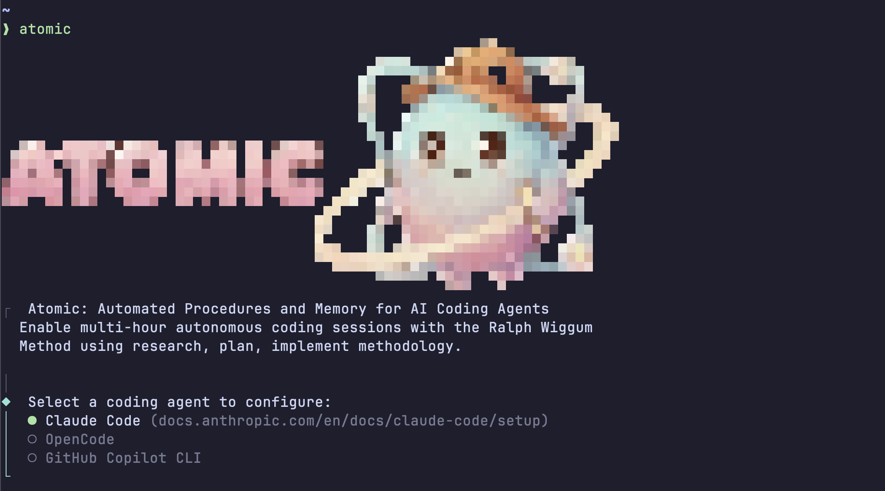
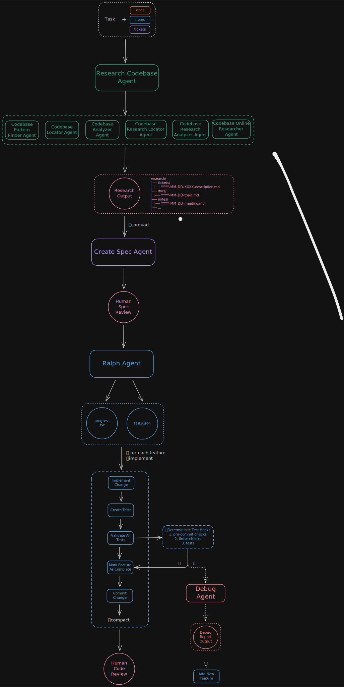

# Atomic

<p align="center">
  
</p>

[](https://deepwiki.com/flora131/atomic)

Ship complex features with AI agents that actually understand your codebase. Research, spec, implement — then wake up to completed code ready for review.

---

## Table of Contents

- [Quick Start](#quick-start)
- [How It Works](#how-it-works)
- [Key Workflows](#key-workflows)
- [Commands & Skills Reference](#commands--skills-reference)
- [Workflow SDK](#workflow-sdk)
- [Autonomous Execution (Ralph)](#autonomous-execution-ralph)
- [Supported Agents](#supported-agents)
- [TUI Features](#tui-features)
- [Configuration](#configuration)
- [Installation Options](#installation-options)
- [Updating & Uninstalling](#updating--uninstalling)
- [Telemetry](#telemetry)
- [Troubleshooting](#troubleshooting)
- [FAQ](#faq)
- [Contributing](#contributing)
- [License](#license)
- [Credits](#credits)

---

## Quick Start

### Prerequisites

- **macOS, Linux, or Windows** (PowerShell 7+ required on Windows — [install guide](https://learn.microsoft.com/en-us/powershell/scripting/install/installing-powershell-on-windows))
- **At least one coding agent installed and logged in:**
  - [Claude Code](https://code.claude.com/docs/en/quickstart) — run `claude` and complete authentication
  - [OpenCode](https://opencode.ai) — run `opencode` and complete authentication
  - [GitHub Copilot CLI](https://github.com/features/copilot/cli) — run `copilot` and complete authentication

### 1. Install

**Devcontainer (recommended):**

> [!TIP]
> Devcontainers isolate the coding agent from your host system, reducing the risk of destructive actions like unintended file deletions or misapplied shell commands. This makes them the safest way to run Atomic.
>
> Use the [Dev Containers extension](https://marketplace.visualstudio.com/items?itemName=ms-vscode-remote.remote-containers) for VS Code or [DevPod](https://devpod.sh) to spawn and manage your devcontainers.

Add a single feature to your `.devcontainer/devcontainer.json` — this installs Atomic, the coding agent, GitHub CLI, and all dependencies automatically.

```
your-project/
├── .devcontainer/
│   └── devcontainer.json   ← add the feature here
├── src/
└── ...
```

```jsonc
{
  "features": {
    "ghcr.io/flora131/atomic/claude:1": {}   // or /opencode:1 or /copilot:1
  }
}
```

| Feature | Reference | Agent |
|---------|-----------|-------|
| Atomic + Claude Code | `ghcr.io/flora131/atomic/claude:1` | [Claude Code](https://claude.ai) |
| Atomic + OpenCode | `ghcr.io/flora131/atomic/opencode:1` | [OpenCode](https://opencode.ai) |
| Atomic + Copilot CLI | `ghcr.io/flora131/atomic/copilot:1` | [Copilot CLI](https://github.com/github/copilot-cli) |

Each feature installs the Atomic CLI, all shared dependencies (bun, playwright-cli), agent-specific configurations (agents, skills), and the agent CLI itself. Features are versioned in sync with Atomic CLI releases.

**macOS / Linux (standalone):**

```bash
curl -fsSL https://raw.githubusercontent.com/flora131/atomic/main/install.sh | bash
# or with wget:
wget -qO- https://raw.githubusercontent.com/flora131/atomic/main/install.sh | bash
```

**Windows PowerShell (standalone):**

```powershell
irm https://raw.githubusercontent.com/flora131/atomic/main/install.ps1 | iex
```

### 2. Initialize Your Project

```bash
cd your-project
atomic init
```

Select your coding agent when prompted. The CLI configures your project automatically.

### 3. Generate Context Files

Start a chat session and run `/init` to generate `CLAUDE.md` and `AGENTS.md`:

```bash
atomic chat -a <claude|opencode|copilot>
```

```
/init
```

This explores your codebase using sub-agents and generates documentation that gives coding agents the context they need.

### 4. Ship Features

```
Research  →  Spec  →  Implement  →  PR
```

```bash
# Research the codebase
/research-codebase Describe your feature or question
/clear

# Create a specification (review carefully — it becomes the contract)
/create-spec research-path
/clear

# Implement
/ralph "<prompt-or-spec-path>"

# Commit and ship
/gh-commit
/gh-create-pr
```

If something breaks, use the debugging agent:

```
Use the debugging agent to create a debugging report for [error message]
```

---

## Video Overview

[](https://www.youtube.com/watch?v=Lq8-qzGfoy4)

---

## How It Works

**You own the decisions. Agents own the execution.**

```
Research → Specs → Execution → Outcomes → Specs (persistent memory)
                ↑                                    ↓
                └────────────────────────────────────┘
```

Every feature follows this cycle. Specs and research become memory for future sessions. You review at two critical points: after research (did the agent understand the codebase?) and after the spec (is the plan correct?).

[](assets/architecture.svg)

---

## Key Workflows

### Ship Complex Features End-to-End

Not just bug fixes — scoped, multi-file features that require architectural understanding:

- Database migrations across large codebases
- Entire new services (e.g., building a complete GraphRAG service from scratch)
- Features spanning dozens of files that need to understand existing patterns first
- Exploring different implementation approaches — spec it out, try one framework, revert, try another

### Deep Codebase Research & Root Cause Analysis

The `/research-codebase` command dispatches specialized sub-agents to:

- Understand how authentication flows work in an unfamiliar codebase
- Track down root causes by analyzing code paths across dozens of files
- Search through docs, READMEs, and inline documentation
- Get up to speed on a new project in minutes instead of hours

### Parallel Research Sessions

Run multiple research sessions simultaneously to evaluate different approaches:

```bash
# Terminal 1: Research LangChain approach
atomic chat -a claude "/research-codebase Research implementing GraphRAG using \
  LangChain's graph retrieval patterns. Look up langchain-ai/langchain for \
  graph store integrations."

# Terminal 2: Research Microsoft's GraphRAG
atomic chat -a claude "/research-codebase Research implementing GraphRAG using \
  Microsoft's GraphRAG library. Look up microsoft/graphrag for their \
  community detection pipeline."

# Terminal 3: Research LlamaIndex approach
atomic chat -a claude "/research-codebase Research implementing GraphRAG using \
  LlamaIndex's property graph index. Look up run-llama/llama_index."
```

Each agent spawns sub-agents that query DeepWiki, pull external documentation, and cross-reference with your codebase. Then run `/create-spec` on each research doc, spin up git worktrees, and run `/ralph` in each — wake up to three complete implementations on separate branches.

> Works identically with `atomic chat -a opencode` and `atomic chat -a copilot`.

---

## Commands & Skills Reference

### CLI Commands

| Command | Description |
| --- | --- |
| `atomic init` | Interactive project setup |
| `atomic chat` | Start TUI chat with a coding agent |
| `atomic config set <k> <v>` | Set configuration values |
| `atomic update` | Self-update (binary installs only) |
| `atomic uninstall` | Remove installation (binary installs only) |

#### `atomic chat` Flags

| Flag | Default | Description |
| --- | --- | --- |
| `-a, --agent <name>` | (required) | Agent: `claude`, `opencode`, `copilot` |
| `-t, --theme <name>` | `"dark"` | UI theme: `dark`, `light` |
| `-m, --model <name>` | (none) | Model override |
| `[prompt...]` | (none) | Initial prompt |

### Slash Commands

| Command | Arguments | Description |
| --- | --- | --- |
| `/help` | | Show available commands |
| `/clear` | | Clear messages and reset session |
| `/compact` | | Compact context to reduce token usage |
| `/model` | `[model\|list\|select]` | View/switch model |
| `/mcp` | `[enable\|disable]` | Toggle MCP servers |
| `/theme` | `[dark\|light]` | Toggle theme |
| `/agents` | | List discovered sub-agents |
| `/exit` | | Exit chat |
| `/init` | | Generate `CLAUDE.md` and `AGENTS.md` |
| `/research-codebase` | `"<question>"` | Analyze codebase and document findings |
| `/create-spec` | `"<research-path>"` | Generate technical specification |
| `/explain-code` | `"<path>"` | Explain code in detail |
| `/gh-commit` | | Create a Git commit |
| `/gh-create-pr` | | Commit, push, and open a PR |
| `/sl-commit` | | Create a Sapling commit |
| `/sl-submit-diff` | | Submit to Phabricator |
| `/ralph` | `"<prompt>"` | Run autonomous implementation |

### Sub-Agents

Invoked automatically by commands. Use `/agents` to see all available.

| Agent | Purpose |
| --- | --- |
| `codebase-analyzer` | Analyze implementation details of components |
| `codebase-locator` | Locate files, directories, and components |
| `codebase-pattern-finder` | Find similar implementations and examples |
| `codebase-online-researcher` | Research using web sources |
| `codebase-research-analyzer` | Deep dive on research topics |
| `codebase-research-locator` | Find documents in `research/` directory |
| `debugger` | Debug errors, test failures, unexpected behavior |

### Auto-Invoked Skills

| Skill | Purpose |
| --- | --- |
| `testing-anti-patterns` | Prevent common testing mistakes |
| `prompt-engineer` | Best practices for prompts |
| `frontend-design` | Production-grade frontend interfaces |

---

## Workflow SDK

The **Workflow SDK** (`@bastani/atomic-workflows`) lets you define custom multi-agent workflows using a type-safe, chainable DSL. Workflows orchestrate AI agents in structured pipelines with conditional branching, loops, and human-in-the-loop checkpoints.

### Getting Started

Place workflow files in either location to have them automatically discovered as slash commands in Atomic:

| Location | Scope |
| --- | --- |
| `.atomic/workflows/` | Project-local (checked into your repo) |
| `~/.atomic/workflows/` | Global (available in all projects) |

No installation required — Atomic discovers `.ts` workflow files in these directories at startup. The `@bastani/atomic-workflows` package is provided by the runtime.

> **Tip:** You can ask Atomic to create workflows for you:
> ```
> Use your workflow-creator skill to create a workflow that plans, implements, and reviews a feature.
> ```

### Quick Example

Create `.atomic/workflows/my-workflow.ts`:

```ts
import { defineWorkflow } from "@bastani/atomic-workflows";

export default defineWorkflow({
  name: "my-workflow",
  description: "Plan, implement, and review",
})
  .version("1.0.0")
  .stage({
    name: "plan",
    agent: "planner",
    description: "⌕ PLANNER",
    prompt: (ctx) => `Decompose this into tasks:\n${ctx.userPrompt}`,
    outputMapper: (response) => ({ tasks: JSON.parse(response) }),
  })
  .stage({
    name: "implement",
    agent: null,
    description: "⚡ EXECUTOR",
    prompt: (ctx) =>
      `Execute these tasks:\n${JSON.stringify(
        ctx.stageOutputs.get("plan")?.parsedOutput
      )}`,
    outputMapper: () => ({}),
  })
  .stage({
    name: "review",
    agent: "reviewer",
    description: "🔍 REVIEWER",
    prompt: (ctx) => `Review the implementation against: ${ctx.userPrompt}`,
    outputMapper: (response) => ({ reviewResult: JSON.parse(response) }),
  })
  .compile();
```

The workflow name becomes a slash command. Run it in any Atomic chat session:

```bash
atomic chat -a claude
# then type: /my-workflow "your prompt here"
```

### DSL Reference

#### Node Types

| Method | Purpose |
| --- | --- |
| `.stage({ ... })` | Run an agent session (LLM-powered) |
| `.tool({ ... })` | Run a deterministic function (no LLM) |
| `.askUserQuestion({ ... })` | Pause for user input |

#### Control Flow

| Method | Purpose |
| --- | --- |
| `.if(condition)` / `.elseIf()` / `.else()` / `.endIf()` | Conditional branching |
| `.loop({ maxCycles })` / `.endLoop()` | Bounded loops |
| `.break(condition)` | Early exit from a loop |

#### Metadata

| Method | Purpose |
| --- | --- |
| `.version("1.0.0")` | Set SemVer version |
| `.argumentHint("<file-path>")` | CLI usage hint |
| `.compile()` | **Required** — terminal method that produces the compiled workflow |

### Stage Configuration

```ts
.stage({
  name: "analyze",              // Unique identifier
  agent: "planner",             // Agent definition name (or null for defaults)
  description: "⌕ ANALYZE",    // Display label
  prompt: (ctx) => "...",       // Build the prompt from context
  outputMapper: (response) =>   // Extract structured data from response
    ({ key: JSON.parse(response) }),
  sessionConfig: {              // Optional: per-stage model overrides
    model: { claude: "claude-opus-4-20250514" },
    reasoningEffort: { claude: "high" },
  },
  disallowedTools: {            // Optional: per-provider tool exclusions
    claude: ["AskUserQuestion"],
    opencode: ["question"],
    copilot: ["ask_user"],
  },
})
```

### Custom State

Define shared state with built-in reducers that control how updates merge across stages:

```ts
export default defineWorkflow({
  name: "stateful-workflow",
  description: "Workflow with shared state",
  globalState: {
    findings: { default: () => [], reducer: "concat" },
    score: { default: 0, reducer: "max" },
    tasks: { default: () => [], reducer: "mergeById", key: "id" },
  },
})
  // ... stages ...
  .compile();
```

**Available reducers:** `replace` (default), `concat`, `merge`, `mergeById`, `max`, `min`, `sum`, `or`, `and`, or a custom `(current, update) => result` function.

### Common Patterns

<details>
<summary>Review loop with early exit</summary>

```ts
defineWorkflow({ name: "review-loop", description: "Iterative review" })
  .stage({ name: "implement", agent: null, description: "⚡ IMPLEMENT",
    prompt: (ctx) => ctx.userPrompt, outputMapper: () => ({}) })
  .loop({ maxCycles: 5 })
    .stage({ name: "review", agent: "reviewer", description: "🔍 REVIEW",
      prompt: (ctx) => `Review against: ${ctx.userPrompt}`,
      outputMapper: (r) => ({ reviewResult: JSON.parse(r) }) })
    .break(() => (state) => state.reviewResult?.allPassing === true)
    .stage({ name: "fix", agent: null, description: "🔧 FIX",
      prompt: (ctx) => `Fix issues from review`, outputMapper: () => ({}) })
  .endLoop()
  .compile();
```

</details>

<details>
<summary>Human-in-the-loop approval</summary>

```ts
.askUserQuestion({
  name: "approve",
  question: {
    question: "Approve this plan?",
    options: [{ label: "Yes" }, { label: "No" }],
  },
  outputMapper: (answer) => ({ approved: answer === "Yes" }),
})
.if((ctx) => ctx.state.approved)
  .stage({ name: "implement", agent: null, description: "⚡ IMPLEMENT",
    prompt: (ctx) => ctx.userPrompt, outputMapper: () => ({}) })
.else()
  .stage({ name: "re-plan", agent: "planner", description: "⌕ RE-PLAN",
    prompt: (ctx) => `Re-plan: ${ctx.userPrompt}`,
    outputMapper: (r) => ({ plan: JSON.parse(r) }) })
.endIf()
```

</details>

<details>
<summary>Conditional branching</summary>

```ts
defineWorkflow({ name: "triage", description: "Route by type" })
  .stage({ name: "classify", agent: "planner", description: "⌕ CLASSIFY",
    prompt: (ctx) => `Classify: ${ctx.userPrompt}`,
    outputMapper: (r) => ({ type: JSON.parse(r).type }) })
  .if((ctx) => ctx.stageOutputs.get("classify")?.parsedOutput?.type === "bug")
    .stage({ name: "fix-bug", agent: null, description: "🔧 FIX",
      prompt: (ctx) => `Fix the bug`, outputMapper: () => ({}) })
  .elseIf((ctx) => ctx.stageOutputs.get("classify")?.parsedOutput?.type === "feature")
    .stage({ name: "build", agent: null, description: "⚡ BUILD",
      prompt: (ctx) => `Build the feature`, outputMapper: () => ({}) })
  .else()
    .stage({ name: "research", agent: "researcher", description: "🔍 RESEARCH",
      prompt: (ctx) => `Research: ${ctx.userPrompt}`,
      outputMapper: (r) => ({ findings: r }) })
  .endIf()
  .compile();
```

</details>

### Context Available in Stages

| Property | Type | Description |
| --- | --- | --- |
| `ctx.userPrompt` | `string` | Original user input |
| `ctx.stageOutputs` | `ReadonlyMap<string, StageOutput>` | Prior stage outputs |
| `ctx.tasks` | `readonly TaskItem[]` | Current task list |
| `ctx.state` | `TState` | Typed workflow state |
| `ctx.abortSignal` | `AbortSignal` | Cancellation signal |

### Verification

Run `atomic workflow verify` to check your workflow for structural correctness:

- All nodes reachable from start
- All paths reach an end node
- No deadlocks
- All loops have bounded iterations
- State reads have preceding writes
- Models and agent names are valid

### Key Rules

1. Every workflow file must use `export default` with `.compile()` at the end
2. Node names must be unique across all node types
3. Every `.if()` needs `.endIf()`, every `.loop()` needs `.endLoop()`
4. `.break()` can only appear inside loops
5. Agents reference markdown definition files in your agent config directory

For complete documentation, see the [Workflow SDK package](packages/workflow-sdk/).

---

## Autonomous Execution (Ralph)

<p align="center">
  
</p>

The [Ralph Wiggum Method](https://ghuntley.com/ralph/) enables multi-hour autonomous coding sessions. After approving your spec, let Ralph work in the background while you focus on other tasks.

### How Ralph Works

1. **Task Decomposition** — A `planner` sub-agent breaks your spec into a structured task list with dependency tracking
2. **Worker Loop** — Dispatches `worker` sub-agents for ready tasks, executing up to 100 iterations
3. **Review & Fix** — A `reviewer` sub-agent audits the implementation; if issues are found, a `fixer` sub-agent generates corrective tasks that re-enter the worker loop

### Usage

```bash
atomic chat -a <claude|opencode|copilot>
```

```
# From a prompt
/ralph "Build a REST API for user management"

# From a spec file
/ralph "specs/YYYY-MM-DD-my-feature.md"
```

**Best practice:** Run Ralph in a separate [git worktree](https://git-scm.com/docs/git-worktree) to isolate autonomous execution:

```bash
git worktree add ../my-project-ralph feature-branch
cd ../my-project-ralph
atomic chat -a claude
# /ralph "Build the auth module"
```

---

## Supported Agents

| Agent | Command | Config Folder | Context File |
| --- | --- | --- | --- |
| Claude Code | `atomic chat -a claude` | `.claude/` | `CLAUDE.md` |
| OpenCode | `atomic chat -a opencode` | `.opencode/` | `AGENTS.md` |
| GitHub Copilot CLI | `atomic chat -a copilot` | `.github/` | `AGENTS.md` |

---

## TUI Features

### Keyboard Shortcuts

| Shortcut | Action |
| --- | --- |
| `Ctrl+O` | Open transcript view |
| `Ctrl+C` | Interrupt current operation |

### Themes

```bash
atomic chat -a claude --theme light   # via CLI flag
/theme dark                            # via slash command
```

### @Mentions

Reference files using `@` mentions with autocomplete.

### Verbose Mode

Toggle verbose output to see agent activity, tool calls, and token usage.

---

## Configuration

### `.atomic/settings.json`

Created automatically during `atomic init`. Resolution order:

1. Local: `.atomic/settings.json`
2. Global: `~/.atomic/settings.json`

```json
{
  "version": 1,
  "scm": "github",
  "model": {
    "claude": "sonnet",
    "copilot": "gpt-4o"
  },
  "reasoningEffort": {
    "claude": "high"
  },
  "lastUpdated": "2026-02-12T12:00:00.000Z"
}
```

| Field | Type | Description |
| --- | --- | --- |
| `version` | number | Config schema version (currently `1`) |
| `scm` | string | Source control: `github` or `sapling` |
| `model` | object | Default model per agent (e.g. `"claude": "opus"`) |
| `reasoningEffort` | object | Reasoning effort per agent (e.g. `"claude": "high"`) |
| `lastUpdated` | string | ISO 8601 timestamp |

You can also set the model per session via CLI flag or interactively during chat:

```bash
# CLI flag (single session only)
atomic chat -a claude -m opus

# Interactive selector (persists to global settings)
/model select
```

The `/model select` command opens an interactive picker that also lets you set reasoning effort for models that support it.

### Agent-Specific Files

| Agent | Folder | Skills | Context File |
| --- | --- | --- | --- |
| Claude Code | `.claude/` | `.claude/skills/` | `CLAUDE.md` |
| OpenCode | `.opencode/` | `.opencode/skills/` | `AGENTS.md` |
| GitHub Copilot | `.github/` | `.github/skills/` | `AGENTS.md` |

---

## Installation Options

<details>
<summary>Install a specific version</summary>

**macOS / Linux:**

```bash
curl -fsSL https://raw.githubusercontent.com/flora131/atomic/main/install.sh | bash -s -- v1.0.0
# or with VERSION env var:
VERSION=v1.0.0 curl -fsSL https://raw.githubusercontent.com/flora131/atomic/main/install.sh | bash
```

**Windows PowerShell:**

```powershell
iex "& { $(irm https://raw.githubusercontent.com/flora131/atomic/main/install.ps1) } -Version v1.0.0"
# or with VERSION env var:
$env:VERSION='v1.0.0'; irm https://raw.githubusercontent.com/flora131/atomic/main/install.ps1 | iex
```

</details>

<details>
<summary>Install a prerelease version</summary>

> **Warning:** Prerelease versions may contain breaking changes or bugs. Use for testing only.

**macOS / Linux:**

```bash
curl -fsSL https://raw.githubusercontent.com/flora131/atomic/main/install.sh | bash -s -- --prerelease
# or with VERSION env var:
VERSION=prerelease curl -fsSL https://raw.githubusercontent.com/flora131/atomic/main/install.sh | bash
```

**Windows PowerShell:**

```powershell
iex "& { $(irm https://raw.githubusercontent.com/flora131/atomic/main/install.ps1) } -Prerelease"
# or with VERSION env var:
$env:VERSION='prerelease'; irm https://raw.githubusercontent.com/flora131/atomic/main/install.ps1 | iex
```

</details>

<details>
<summary>Authenticated downloads (CI / enterprise)</summary>

Set `GITHUB_TOKEN` to use authenticated GitHub API requests, which avoids rate limits in CI/CD or enterprise environments:

**macOS / Linux:**

```bash
GITHUB_TOKEN=ghp_... curl -fsSL https://raw.githubusercontent.com/flora131/atomic/main/install.sh | bash
```

**Windows PowerShell:**

```powershell
$env:GITHUB_TOKEN='ghp_...'; irm https://raw.githubusercontent.com/flora131/atomic/main/install.ps1 | iex
```

</details>

<details>
<summary>Custom install directory</summary>

**macOS / Linux:**

```bash
ATOMIC_INSTALL_DIR=/usr/local/bin curl -fsSL https://raw.githubusercontent.com/flora131/atomic/main/install.sh | bash
```

**Windows PowerShell:**

```powershell
$env:ATOMIC_INSTALL_DIR = "C:\tools"; irm https://raw.githubusercontent.com/flora131/atomic/main/install.ps1 | iex
```

</details>

<details>
<summary>Devcontainer examples</summary>

**Atomic + Claude in a Rust project:**

```jsonc
{
  "image": "mcr.microsoft.com/devcontainers/rust:latest",
  "features": {
    "ghcr.io/flora131/atomic/claude:1": {}
  },
  "remoteEnv": {
    "ANTHROPIC_API_KEY": "${localEnv:ANTHROPIC_API_KEY}"
  }
}
```

**Atomic + Copilot in a Python project:**

```jsonc
{
  "image": "mcr.microsoft.com/devcontainers/python:3.12",
  "features": {
    "ghcr.io/flora131/atomic/copilot:1": {}
  },
  "remoteEnv": {
    "GH_TOKEN": "${localEnv:GH_TOKEN}"
  }
}
```

**Atomic + OpenCode in a Go project:**

```jsonc
{
  "image": "mcr.microsoft.com/devcontainers/go:1.22",
  "features": {
    "ghcr.io/flora131/atomic/opencode:1": {}
  }
}
```

</details>

<details>
<summary>Source control selection</summary>

During `atomic init`, you'll select your source control system:

| SCM Type | CLI Tool | Code Review | Use Case |
| --- | --- | --- | --- |
| GitHub / Git | `git` | Pull Requests | Most projects |
| Sapling + Phabricator | `sl` | Phabricator Diffs | Stacked workflows |

**Sapling + Phabricator:** Ensure `.arcconfig` exists in your repo root. Use `/sl-commit` and `/sl-submit-diff`.

**Windows note:** Sapling templates use the full path `& 'C:\Program Files\Sapling\sl.exe'` to avoid conflicts with PowerShell's `sl` alias.

</details>

---

## Updating & Uninstalling

### Update

```bash
atomic update
```

### Uninstall

```bash
atomic uninstall              # Interactive uninstall
atomic uninstall --dry-run    # Preview what will be removed
atomic uninstall --keep-config # Keep config, remove binary only
atomic uninstall --yes        # Skip confirmation
```

<details>
<summary>Manual uninstall</summary>

**macOS / Linux:**

```bash
rm -f ~/.local/bin/atomic
rm -rf ~/.local/share/atomic
rm -rf ~/.atomic/.claude ~/.atomic/.opencode ~/.atomic/.copilot
```

**Windows PowerShell:**

```powershell
Remove-Item "$env:USERPROFILE\.local\bin\atomic.exe" -Force
Remove-Item "$env:LOCALAPPDATA\atomic" -Recurse -Force
Remove-Item "$env:USERPROFILE\.atomic\.claude" -Recurse -Force
Remove-Item "$env:USERPROFILE\.atomic\.opencode" -Recurse -Force
Remove-Item "$env:USERPROFILE\.atomic\.copilot" -Recurse -Force
```

</details>

<details>
<summary>Clean up project config files</summary>

> **Warning:** This deletes all project-specific settings, skills, and agents configured by Atomic.

**macOS / Linux:**

```bash
rm -rf .claude/ CLAUDE.md        # Claude Code
rm -rf .opencode/ AGENTS.md      # OpenCode
rm -f .github/copilot-instructions.md  # Copilot
```

**Windows PowerShell:**

```powershell
Remove-Item -Path ".claude" -Recurse -Force; Remove-Item "CLAUDE.md" -Force
Remove-Item -Path ".opencode" -Recurse -Force; Remove-Item "AGENTS.md" -Force
Remove-Item -Path ".github\copilot-instructions.md" -Force
```

</details>

---

## Telemetry

Atomic collects anonymous usage telemetry to improve the product.

**Collected:** Command names, agent type, success/failure status, session metrics.
**Never collected:** Prompts, file paths, code, IP addresses, PII.

### Opt Out

```bash
atomic config set telemetry false
# or
export ATOMIC_DISABLE_TELEMETRY=1
```

<details>
<summary>More telemetry details</summary>

**Privacy features:**

- Anonymous machine-derived ID
- Local JSONL logging before any remote transmission
- Auto-disabled in CI environments (`CI=true`)
- First-run consent during `atomic init`

**Local log paths:**

| Platform | Path |
| --- | --- |
| Windows | `%APPDATA%\atomic\telemetry\` |
| macOS | `~/Library/Application Support/atomic/telemetry/` |
| Linux | `~/.local/share/atomic/telemetry/` |

**Re-enable:**

```bash
atomic config set telemetry true
unset ATOMIC_DISABLE_TELEMETRY
```

**Windows PowerShell opt-out:**

```powershell
$env:ATOMIC_DISABLE_TELEMETRY = "1"
# Or permanently:
[Environment]::SetEnvironmentVariable("ATOMIC_DISABLE_TELEMETRY", "1", "User")
```

**Programmatic:**

```typescript
import { loadTelemetryConfig, isTelemetryEnabled } from "@bastani/atomic";

if (isTelemetryEnabled()) {
  const config = loadTelemetryConfig();
  console.log(config.enabled, config.localLogPath);
}
```

</details>

---

## Troubleshooting

<details>
<summary>Git identity error</summary>

```bash
git config --global user.name "Your Name"
git config --global user.email "you@example.com"
```

</details>

<details>
<summary>Windows command resolution</summary>

If agents fail to spawn on Windows, ensure the agent CLI is in your PATH. Atomic uses `Bun.which()` which handles `.cmd`, `.exe`, and `.bat` extensions automatically.

</details>

<details>
<summary>Generating CLAUDE.md / AGENTS.md</summary>

`atomic init` does **not** create these files. Run `/init` inside a chat session to generate them.

</details>

<details>
<summary>Sub-agent tree stuck on "Initializing..."</summary>

1. Update to the latest release (`atomic update`) and retry
2. Check for terminal progress events in verbose mode
3. Press `Ctrl+F` twice to terminate stuck background agents, then resend your prompt
4. If the issue persists, capture reproduction steps and [open an issue](https://github.com/flora131/atomic/issues)

</details>

<details>
<summary>Shift+Enter not inserting newline</summary>

- **VS Code terminal:** Keep `terminal.integrated.enableKittyKeyboardProtocol` enabled
- **GNOME Terminal, xterm, Alacritty, WezTerm, iTerm2:** `modifyOtherKeys` mode is enabled automatically
- **Universal fallback:** Use `Ctrl+J` for newline
- **Last resort:** End line with `\` and press Enter

</details>

---

## FAQ

<details>
<summary>How does Atomic differ from Spec-Kit?</summary>

[Spec Kit](https://github.com/github/spec-kit) is GitHub's toolkit for "Spec-Driven Development." Both improve AI-assisted development, but solve different problems:

| Aspect | Spec-Kit | Atomic |
| --- | --- | --- |
| **Focus** | Greenfield projects | Large existing codebases + greenfield |
| **First Step** | Define project principles | Analyze existing architecture |
| **Memory** | Per-feature specs | Flywheel: Research → Specs → Execution → Outcomes |
| **Agents** | Single agent with shell scripts | Specialized sub-agents |
| **Human Review** | Implicit | Explicit checkpoints |
| **Debugging** | Not addressed | Dedicated debugging workflow |
| **Autonomous** | Not available | Ralph for overnight execution |

**Choose Atomic when you** need codebase discovery, session continuity, explicit review checkpoints, debugging workflows, or autonomous overnight execution.

</details>

---

## Contributing

See [DEV_SETUP.md](DEV_SETUP.md) for development setup, testing guidelines, and contribution workflow.

---

## License

MIT License — see [LICENSE](LICENSE) for details.

## Credits

- [Superpowers](https://github.com/obra/superpowers)
- [Anthropic Skills](https://github.com/anthropics/skills)
- [Ralph Wiggum Method](https://ghuntley.com/ralph/)
- [OpenAI Codex Cookbook](https://github.com/openai/openai-cookbook)
- [HumanLayer](https://github.com/humanlayer/humanlayer)
