# Atomic UI Server (JSON-RPC daemon)

`atomic --ui-server` is the per-user singleton daemon that backs every workflow in atomic 2.0. It owns the workflow registry, process supervisor, and live panel state. All control surfaces — workflow discovery, dispatch, inspection, process I/O, and panel subscription — are exposed as a single JSON-RPC 2.0 protocol over LSP `Content-Length`-framed TCP sockets on loopback.

The SDK (`@bastani/atomic-sdk`) auto-spawns and auto-connects to the daemon on the first `runWorkflow` call. IDE plugins, CI scripts, and custom tooling connect via the same wire protocol. There is no privileged client: the OpenTUI panel that the user sees is itself a JSON-RPC client of the daemon.

---

## Quick Start

Start the daemon manually:

```sh
atomic --ui-server
```

Daemon writes its endpoint to `~/.atomic/daemon.endpoint.json`. Inspect it:

```sh
cat ~/.atomic/daemon.endpoint.json
```

Logs:

```sh
tail -f ~/.atomic/daemon.log
```

Enable per-method param logging (secrets redacted):

```sh
ATOMIC_UI_SERVER_DEBUG=1 atomic --ui-server
```

Subsequent `atomic --ui-server` invocations on the same user detect the running daemon, print the endpoint info, and exit.

---

## Architecture

```mermaid
%%{init: {'theme':'base', 'themeVariables': { 'primaryColor':'#f8f9fa','primaryTextColor':'#2c3e50','primaryBorderColor':'#4a5568','lineColor':'#4a90e2','secondaryColor':'#ffffff','tertiaryColor':'#e9ecef','background':'#f5f7fa','mainBkg':'#f8f9fa','nodeBorder':'#4a5568','clusterBkg':'#ffffff','clusterBorder':'#cbd5e0','edgeLabelBackground':'#ffffff'}}}%%

flowchart TB
    classDef daemon fill:#4a90e2,stroke:#357abd,stroke-width:2.5px,color:#fff,font-weight:600
    classDef client fill:#5a67d8,stroke:#4c51bf,stroke-width:2.5px,color:#fff,font-weight:600
    classDef agent fill:#48bb78,stroke:#38a169,stroke-width:2.5px,color:#fff,font-weight:600
    classDef disk fill:#718096,stroke:#4a5568,stroke-width:2.5px,color:#fff,font-weight:600

    subgraph Daemon["atomic --ui-server (per-user singleton)"]
        direction TB
        Server["JSON-RPC server<br>net.Server + vscode-jsonrpc"]:::daemon
        Registry["Workflow registry<br>(in-memory)"]:::daemon
        Supervisor["Process supervisor<br>(bun-pty allocator)"]:::daemon
        StateCore["PanelStore × N runs<br>(daemon-resident)"]:::daemon
        DiskWriter["status.json<br>persistence"]:::daemon

        Server --> Registry
        Server --> Supervisor
        Server --> StateCore
        StateCore --> DiskWriter
    end

    subgraph Agents["Agent subprocess clients"]
        direction TB
        Claude["claude<br>(PTY)"]:::agent
        Copilot["copilot<br>(PTY)"]:::agent
        OpenCode["opencode<br>(PTY)"]:::agent
    end

    Supervisor -.->|"bun-pty<br>spawn + supervise"| Claude
    Supervisor -.->|"bun-pty<br>spawn + supervise"| Copilot
    Supervisor -.->|"bun-pty<br>spawn + supervise"| OpenCode

    subgraph Clients["JSON-RPC clients (any subset)"]
        direction TB
        TuiPanel["atomic workflow ...<br>OpenTUI panel client"]:::client
        SdkApp["SDK consumer<br>(bun run my-app.ts)"]:::client
        IDE["IDE plugin<br>(future)"]:::client
        CI["CI dashboard<br>(future)"]:::client
    end

    EndpointFile[("~/.atomic/<br>daemon.endpoint.json")]:::disk
    Server -.->|"discovery"| EndpointFile

    Server <-->|"TCP loopback<br>LSP frames"| TuiPanel
    Server <-->|"TCP loopback<br>LSP frames"| SdkApp
    Server <-->|"TCP loopback<br>LSP frames"| IDE
    Server <-->|"TCP loopback<br>LSP frames"| CI

    style Daemon fill:#ffffff,stroke:#cbd5e0,stroke-width:2px,stroke-dasharray:8 4
    style Agents fill:#ffffff,stroke:#cbd5e0,stroke-width:2px,stroke-dasharray:8 4
    style Clients fill:#ffffff,stroke:#cbd5e0,stroke-width:2px,stroke-dasharray:8 4
```



Daemon is single source of truth for all workflow state. Clients subscribe; daemon broadcasts. Agents are children of the daemon, not peers.

---

## Daemon Lifecycle

### Start

1. Read `~/.atomic/daemon.endpoint.json` if it exists.
2. If present, attempt `net.connect` on the listed `port`. If connect succeeds and `protocol/getVersion` returns sanely, exit with the existing endpoint info — another daemon is already running.
3. If connect fails (`ECONNREFUSED`, `EHOSTUNREACH`, parse error), the file is stale; unlink it and proceed.
4. Bind `net.createServer().listen(0, "127.0.0.1")` (kernel-assigned port).
5. Generate `connectionToken` if `ATOMIC_UI_SERVER_TOKEN` is unset, or use the env-supplied value.
6. Write `~/.atomic/daemon.endpoint.json` with mode `0o600`.
7. Trap `SIGTERM`, `SIGINT`, `SIGHUP`. On signal: emit `server/closing` to every client, drain (100ms), unlink the endpoint file, exit cleanly.
8. Trap unhandled exceptions; log to `~/.atomic/daemon.log`; emit `server/closing` with `reason: "fatal"`; exit 1.

### Singleton enforcement

Only one daemon per user. Subsequent `atomic --ui-server` invocations detect the running daemon via `~/.atomic/daemon.endpoint.json` and exit with the endpoint info. Stale endpoint files (daemon crashed without cleanup) are detected by failed `net.connect` and automatically unlinked.

### Signal handling

| Signal | Behavior |
| --- | --- |
| `SIGTERM` | Clean shutdown: `server/closing` → 100ms drain → endpoint unlink → exit 0 |
| `SIGINT` | Same as `SIGTERM` |
| `SIGHUP` | Same as `SIGTERM` |
| Unhandled exception | Log to `~/.atomic/daemon.log` → `server/closing { reason: "fatal" }` → exit 1 |

### Shutdown

Daemon shutdown sequence:
1. Emit `server/closing { reason: "shutdown" }` to every connected client.
2. Wait 100ms for buffered writes to drain.
3. Call `MessageConnection.dispose()` per connection.
4. Call `net.Server.close()`.
5. Unlink `~/.atomic/daemon.endpoint.json`.
6. Exit.

---

## Discovery

### Endpoint file

Daemon writes `~/.atomic/daemon.endpoint.json` at startup with mode `0o600`:

```jsonc
{
  "port": 53247,
  "host": "127.0.0.1",
  "pid": 4711,
  "startedAt": "2026-05-09T19:52:28.000Z",
  "atomicVersion": "2.0.0",
  "protocolVersion": "1.0.0"
}
```

Clients read this file to locate the daemon. The file is unlinked on clean daemon shutdown.

### `atomicBinaryPath` resolution

SDK resolves the atomic binary in this priority order:

1. `process.env.ATOMIC_BINARY` (override).
2. Workspace developer mode: when the current process is `packages/atomic/src/cli.ts` (for example `bun run dev`), spawn `bun packages/atomic/src/cli.ts --ui-server` so source checkouts do not accidentally launch a stale globally installed binary.
3. `require.resolve(\`@bastani/atomic-${platform}-${arch}/bin/atomic\`)` — bundled platform binary from `optionalDependencies`.
4. `Bun.which("atomic")` — globally-installed CLI on PATH.
5. Fail with `MissingDependencyError("@bastani/atomic")`.

### SDK auto-spawn

`runWorkflow({...})` resolution path:

1. Try to read `~/.atomic/daemon.endpoint.json`. If present, attempt connection.
2. If absent or unreachable: spawn `Bun.spawn([atomicBinaryPath, "--ui-server"], { stdio: ["ignore", "ignore", "ignore"], detached: true })`.
3. Poll `~/.atomic/daemon.endpoint.json` every 50ms for up to 5s; return `MissingDependencyError` after timeout.
4. Connect, send `connect({ token, clientName: "@bastani/atomic-sdk" })`, return the `MessageConnection`.

**Token sourcing for SDK.** SDK reads `process.env.ATOMIC_UI_SERVER_TOKEN`. If set, it is forwarded to the spawned daemon via `Bun.spawn({ env: process.env })`. If unset, the daemon spawns without auth (loopback-only — same trust model as a local dev server).

---

## Wire Protocol

Protocol: **JSON-RPC 2.0** with **LSP `Content-Length` framing**.

Transport: TCP loopback (`127.0.0.1`), kernel-assigned port.

Framing library: `vscode-jsonrpc/node` (`^8.2.1`).

Each accepted `net.Socket` is adapted via:

```ts
createMessageConnection(
  new StreamMessageReader(socket),
  new StreamMessageWriter(socket),
)
```

Both requests and notifications use standard JSON-RPC 2.0 envelope format. The `Content-Length` header is written/read by `vscode-jsonrpc` automatically — callers never see raw bytes.

### Method namespaces

| Namespace | Purpose |
| --- | --- |
| `protocol/*` | Server identity, capabilities, telemetry forwarding |
| `workflow/*` | Discovery and dispatch |
| `run/*` | Running workflow inspection and control |
| `pane/*` | Input forwarding to active agent panes |
| `panel/*` | Live state and pub/sub |
| `agent/*` | Direct agent subprocess management (advanced; mostly internal) |

---

## Authentication

Token is read from `ATOMIC_UI_SERVER_TOKEN`. If env var is unset at daemon start, the daemon logs a warning and accepts any value for `connect({ token })`. If set, the token is compared via `timingSafeEqual`.

Tokens are per-daemon-lifetime; daemon restart generates a fresh token. Tokens are not logged.

### Threat model

| Threat | Mitigation |
| --- | --- |
| Remote attackers | Blocked by `127.0.0.1` bind — no external interface exposed |
| Other local users on multi-user machine | Blocked by token if `ATOMIC_UI_SERVER_TOKEN` is set; operators requiring strong isolation always set this env var |
| Same-UID processes | Can read each other's `/proc/<pid>/environ`; same trust boundary as `0o600` files |
| Replay across daemon restarts | Tokens are per-daemon-lifetime; restart generates fresh token |

v1 has no per-client / per-method ACL. Every authenticated client has full method access.

---

## Methods

### Method table

| Method | Params | Result | Description |
| --- | --- | --- | --- |
| `protocol/getVersion` | `{}` | `{ protocolVersion: string, sdkVersion: string, atomicVersion: string }` | Server identity and version |
| `connect` | `{ token?: string, clientName: string }` | `{ ok: true }` | Authenticate; must be called before any other method |
| `protocol/sendTelemetry` | `{ event: string, payload?: object }` | `{ ok: true }` | Append a client event to the daemon's telemetry sink |
| `workflow/list` | `{}` | `WorkflowDescriptor[]` | List all registered workflows from the in-memory registry |
| `workflow/refresh` | `{}` | `{ count: number, broken: BrokenEntry[] }` | Re-import registered workflow files; return count and any broken entries |
| `workflow/start` | `{ source: string, workflowName: string, agent: AgentType, inputs: Record<string, unknown> }` | `{ runId: string, attachable: true }` | Dispatch a workflow; returns a `runId` immediately |
| `run/list` | `{ scope?: "active" \| "completed" \| "all" }` | `RunInfo[]` | List runs by scope |
| `run/get` | `{ runId: string }` | `RunInfo \| null` | Get a single run's metadata |
| `run/status` | `{ runId: string }` | `WorkflowStatusSnapshot \| null` | Get current status snapshot for a run |
| `run/transcript` | `{ runId: string, sessionName: string }` | `SavedMessage[]` | Get full message transcript for a stage |
| `run/stop` | `{ runId: string }` | `{ ok: true }` | Send SIGTERM to all PTYs for the run; transitions run to stopped |
| `run/getAttachInfo` | `{ runId: string }` | `{ subscriptionId: string, foregroundStage: string \| null }` | Get subscription ID and foreground stage for attach/reattach |
| `run/setForeground` | `{ runId: string, stageName?: string }` | `{ ok: true }` | Set the foreground stage for a run |
| `pane/sendInput` | `{ runId: string, stageName: string, data: string }` | `{ ok: true }` | Forward raw bytes to an agent PTY's stdin |
| `pane/getScrollback` | `{ runId: string, stageName: string, fromOffset?: number }` | `{ data: string, headOffset: number }` | Retrieve scrollback buffer from a stage's PTY |
| `panel/get` | `{ runId: string }` | `WorkflowStatusSnapshot` | Get current panel snapshot for a run |
| `panel/subscribe` | `{ runId?: string }` | `{ subscriptionId: string }` | Subscribe to `panel/update` notifications; omit `runId` for all runs |
| `panel/unsubscribe` | `{ subscriptionId: string }` | `{ ok: true }` | Cancel a subscription |
| `agent/spawn` | `{ runId: string, stageName: string, agent: AgentType, args: string[], env?: Record<string, string> }` | `{ pid: number, scrollbackBytes: 0 }` | Spawn an agent subprocess with a PTY (advanced / internal) |
| `agent/kill` | `{ pid: number, signal?: "SIGTERM" \| "SIGKILL" }` | `{ ok: true }` | Send signal to an agent subprocess |

---

### `protocol/getVersion`

Returns server identity. Available before `connect`.

**Request:**
```jsonc
{ "jsonrpc": "2.0", "id": 1, "method": "protocol/getVersion", "params": {} }
```

**Response:**
```jsonc
{
  "jsonrpc": "2.0", "id": 1,
  "result": {
    "protocolVersion": "1.0.0",
    "sdkVersion": "2.0.0",
    "atomicVersion": "2.0.0"
  }
}
```

---

### `connect`

Authenticate the connection. Must be called before any other method (except `protocol/getVersion`). `clientName` is mandatory.

**Request:**
```jsonc
{
  "jsonrpc": "2.0", "id": 2,
  "method": "connect",
  "params": { "token": "abc123", "clientName": "my-tool" }
}
```

**Response:**
```jsonc
{ "jsonrpc": "2.0", "id": 2, "result": { "ok": true } }
```

**Error:** `-32001 AUTHENTICATION_REQUIRED` if token mismatch.

---

### `protocol/sendTelemetry`

Client appends a named event to the daemon's telemetry JSONL sink. Daemon stamps `clientName` and `ts` automatically.

**Request:**
```jsonc
{
  "jsonrpc": "2.0", "id": 3,
  "method": "protocol/sendTelemetry",
  "params": { "event": "panel_opened", "payload": { "runId": "r-abc" } }
}
```

---

### `workflow/list`

Returns all workflows in the daemon's in-memory registry. O(N) over cache — no subprocess fork.

**Request:**
```jsonc
{ "jsonrpc": "2.0", "id": 4, "method": "workflow/list", "params": {} }
```

**Response:**
```jsonc
{
  "jsonrpc": "2.0", "id": 4,
  "result": [
    { "name": "deep-research", "source": "/home/user/.atomic/workflows/deep-research.ts", "agent": "claude" }
  ]
}
```

---

### `workflow/refresh`

Re-imports all registered workflow files. Returns updated count and any broken entries (import errors).

**Request:**
```jsonc
{ "jsonrpc": "2.0", "id": 5, "method": "workflow/refresh", "params": {} }
```

**Response:**
```jsonc
{
  "jsonrpc": "2.0", "id": 5,
  "result": { "count": 3, "broken": [] }
}
```

---

### `workflow/start`

Dispatches a workflow. Returns `runId` immediately, before any stage spawns.

**Request:**
```jsonc
{
  "jsonrpc": "2.0", "id": 6,
  "method": "workflow/start",
  "params": {
    "source": "/home/user/.atomic/workflows/deep-research.ts",
    "workflowName": "deep-research",
    "agent": "claude",
    "inputs": { "query": "how does bun-pty work?" }
  }
}
```

**Response:**
```jsonc
{ "jsonrpc": "2.0", "id": 6, "result": { "runId": "r-7f3a", "attachable": true } }
```

Errors: `-32003 WORKFLOW_NOT_FOUND`, `-32004 INVALID_WORKFLOW`, `-32005 WORKFLOW_NOT_COMPILED`, `-32006 INCOMPATIBLE_SDK`, `-32008 MISSING_DEPENDENCY`.

---

### `run/list`

Lists runs by scope. Default scope is `"active"`.

**Request:**
```jsonc
{ "jsonrpc": "2.0", "id": 7, "method": "run/list", "params": { "scope": "all" } }
```

---

### `run/get`

Returns metadata for a single run, or `null` if not found.

**Request:**
```jsonc
{ "jsonrpc": "2.0", "id": 8, "method": "run/get", "params": { "runId": "r-7f3a" } }
```

---

### `run/status`

Returns the current `WorkflowStatusSnapshot` for a run.

**Request:**
```jsonc
{ "jsonrpc": "2.0", "id": 9, "method": "run/status", "params": { "runId": "r-7f3a" } }
```

---

### `run/transcript`

Returns all saved messages for a stage session.

**Request:**
```jsonc
{
  "jsonrpc": "2.0", "id": 10,
  "method": "run/transcript",
  "params": { "runId": "r-7f3a", "sessionName": "research-stage" }
}
```

Errors: `-32002 RUN_NOT_FOUND`, `-32007 STAGE_NOT_FOUND`.

---

### `run/stop`

Sends SIGTERM to all PTYs for the run. Transitions run to stopped state.

**Request:**
```jsonc
{ "jsonrpc": "2.0", "id": 11, "method": "run/stop", "params": { "runId": "r-7f3a" } }
```

**Response:**
```jsonc
{ "jsonrpc": "2.0", "id": 11, "result": { "ok": true } }
```

---

### `run/getAttachInfo`

Non-blocking replacement for the former blocking `attachSession()`. Returns a subscription ID for `panel/update` and the current foreground stage.

**Request:**
```jsonc
{ "jsonrpc": "2.0", "id": 12, "method": "run/getAttachInfo", "params": { "runId": "r-7f3a" } }
```

**Response:**
```jsonc
{
  "jsonrpc": "2.0", "id": 12,
  "result": { "subscriptionId": "sub-001", "foregroundStage": "research-stage" }
}
```

---

### `run/setForeground`

Sets the foreground stage for a run. Emits `panel/foregroundChange` to all subscribers.

**Request:**
```jsonc
{
  "jsonrpc": "2.0", "id": 13,
  "method": "run/setForeground",
  "params": { "runId": "r-7f3a", "stageName": "write-stage" }
}
```

---

### `pane/sendInput`

Forwards raw bytes to an agent stage's PTY stdin. No daemon-side buffering — PTY kernel buffer handles backpressure.

**Request:**
```jsonc
{
  "jsonrpc": "2.0", "id": 14,
  "method": "pane/sendInput",
  "params": { "runId": "r-7f3a", "stageName": "research-stage", "data": "\r" }
}
```

---

### `pane/getScrollback`

Returns scrollback buffer content from a stage's PTY. `fromOffset` is a monotonically increasing byte offset; omit to get the full available buffer.

**Request:**
```jsonc
{
  "jsonrpc": "2.0", "id": 15,
  "method": "pane/getScrollback",
  "params": { "runId": "r-7f3a", "stageName": "research-stage", "fromOffset": 0 }
}
```

**Response:**
```jsonc
{
  "jsonrpc": "2.0", "id": 15,
  "result": { "data": "...PTY output...", "headOffset": 4096 }
}
```

---

### `panel/get`

Returns current `WorkflowStatusSnapshot` for a run. Use after (re)connecting to get initial state before subscribing.

**Request:**
```jsonc
{ "jsonrpc": "2.0", "id": 16, "method": "panel/get", "params": { "runId": "r-7f3a" } }
```

---

### `panel/subscribe`

Subscribe to `panel/update` notifications. Omit `runId` to subscribe to updates from all runs. Returns a `subscriptionId` for later unsubscription.

**Request:**
```jsonc
{ "jsonrpc": "2.0", "id": 17, "method": "panel/subscribe", "params": { "runId": "r-7f3a" } }
```

**Response:**
```jsonc
{ "jsonrpc": "2.0", "id": 17, "result": { "subscriptionId": "sub-001" } }
```

---

### `panel/unsubscribe`

Cancel a subscription. Safe to call after connection loss (daemon cleans up on disconnect).

**Request:**
```jsonc
{
  "jsonrpc": "2.0", "id": 18,
  "method": "panel/unsubscribe",
  "params": { "subscriptionId": "sub-001" }
}
```

---

### `agent/spawn`

Advanced / internal. Spawns an agent subprocess with a daemon-managed PTY for the given run and stage. Normally called by the daemon itself during `workflow/start` execution; exposed for custom integrations.

**Request:**
```jsonc
{
  "jsonrpc": "2.0", "id": 19,
  "method": "agent/spawn",
  "params": {
    "runId": "r-7f3a",
    "stageName": "research-stage",
    "agent": "claude",
    "args": ["--no-color"],
    "env": { "MY_VAR": "val" }
  }
}
```

**Response:**
```jsonc
{ "jsonrpc": "2.0", "id": 19, "result": { "pid": 12345, "scrollbackBytes": 0 } }
```

Errors: `-32009 PTY_FAILED`, `-32008 MISSING_DEPENDENCY`.

---

### `agent/kill`

Send a signal to a supervised agent subprocess.

**Request:**
```jsonc
{
  "jsonrpc": "2.0", "id": 20,
  "method": "agent/kill",
  "params": { "pid": 12345, "signal": "SIGTERM" }
}
```

---

## Notifications

Server-to-client notifications. Clients receive these after calling `panel/subscribe` or subscribing to pane output.

| Notification | Params | Trigger |
| --- | --- | --- |
| `panel/update` | `{ runId: string, snapshot: WorkflowStatusSnapshot }` | Every `PanelStore` mutation, debounced via `queueMicrotask` |
| `panel/foregroundChange` | `{ runId: string, stageName: string \| null }` | `run/setForeground` called |
| `pane/output` | `{ runId: string, stageName: string, data: string, offset: number }` | Each PTY read from a subscribed stage's subprocess |
| `pane/exit` | `{ runId: string, stageName: string, exitCode: number, signal?: string }` | Agent subprocess exits |
| `run/started` | `{ runId: string, workflowName: string, agent: AgentType }` | `workflow/start` acknowledgement, before any stage spawns |
| `run/ended` | `{ runId: string, overall: WorkflowOverallStatus, fatalError?: string }` | Last stage completes or fatal error |
| `server/closing` | `{ reason: "shutdown" \| "fatal" }` | Daemon shutdown sequence begins |

### `panel/update` example

```jsonc
{
  "jsonrpc": "2.0",
  "method": "panel/update",
  "params": {
    "runId": "r-7f3a",
    "snapshot": {
      "overall": "running",
      "stages": [
        { "name": "research-stage", "status": "running", "agent": "claude" }
      ]
    }
  }
}
```

### `pane/output` example

```jsonc
{
  "jsonrpc": "2.0",
  "method": "pane/output",
  "params": {
    "runId": "r-7f3a",
    "stageName": "research-stage",
    "data": "Thinking about your query...\r\n",
    "offset": 128
  }
}
```

### `server/closing` example

```jsonc
{
  "jsonrpc": "2.0",
  "method": "server/closing",
  "params": { "reason": "shutdown" }
}
```

---

## Error Codes

Standard JSON-RPC reserves `-32700`..`-32603`. Atomic-specific codes live in `-32000`..`-32099`:

| Code | Symbol | Cause |
| --- | --- | --- |
| `-32001` | `AUTHENTICATION_REQUIRED` | Request before successful `connect` (when token required) |
| `-32002` | `RUN_NOT_FOUND` | Unknown `runId` |
| `-32003` | `WORKFLOW_NOT_FOUND` | Unknown workflow alias in `workflow/start` |
| `-32004` | `INVALID_WORKFLOW` | Source file imports cleanly but exports nothing usable |
| `-32005` | `WORKFLOW_NOT_COMPILED` | `WorkflowDefinition` missing `.compile()` step |
| `-32006` | `INCOMPATIBLE_SDK` | Workflow's `minSDKVersion` exceeds daemon's SDK |
| `-32007` | `STAGE_NOT_FOUND` | `runId` exists but `stageName` doesn't |
| `-32008` | `MISSING_DEPENDENCY` | Required external dep (Claude CLI binary, Copilot CLI binary) isn't on PATH; `data: { dependency: string }` |
| `-32009` | `PTY_FAILED` | PTY allocation or spawn failure |
| `-32010` | `RATE_LIMITED` | Reserved for future use |

Standard JSON-RPC error codes also apply:

| Code | Meaning |
| --- | --- |
| `-32700` | Parse error |
| `-32600` | Invalid request |
| `-32601` | Method not found |
| `-32602` | Invalid params (schema validation failure) |
| `-32603` | Internal error |

---

## Connection Lifecycle

1. Client opens `net.connect({ host: "127.0.0.1", port })`.
2. Server's `net.createServer` accepts; attaches `MessageConnection` via `createMessageConnection(new StreamMessageReader(socket), new StreamMessageWriter(socket))`; calls `conn.listen()`.
3. Connection starts unauthenticated. Only `protocol/getVersion` and `connect` succeed.
4. Client calls `connect({ token, clientName })`. Token is compared against `process.env.ATOMIC_UI_SERVER_TOKEN` with `timingSafeEqual`. If env var unset, the daemon logged a warning at start and accepts any value. `clientName` is mandatory.
5. After `connect`, client calls any method.
6. Daemon shutdown: emits `server/closing` to every connection, waits 100ms for buffered writes, calls `MessageConnection.dispose()` per connection, then `net.Server.close()`.

### Detach and reattach

**Detach** = client closes connection. Daemon's `panel/subscribe` cleanup removes the subscriber from the broadcast set. The run continues.

**Reattach** = new client connects, subscribes, calls `panel/get` for current snapshot, calls `pane/getScrollback` for any stages needing history. Multiple simultaneous reattaches work: all subscribe, all receive notifications.

**Background runs:** `atomic workflow ... -d` calls `workflow/start` and returns without mounting a panel client. Run continues; user calls `atomic workflow attach <runId>` later.

---

## Process Supervisor

The supervisor owns every agent subprocess via `bun-pty`. No tmux.

### Per-stage state

```ts
interface SupervisedStage {
  runId: string;
  stageName: string;
  agent: AgentType;
  pty: import("bun-pty").IPty;        // PTY handle: write(), kill(), onData, onExit
  scrollback: RingBuffer;              // bounded byte buffer (default 4 MiB)
  scrollbackHead: number;              // monotonically increasing offset
  outputSubscribers: Set<MessageConnection>;  // clients receiving pane/output
  startedAt: number;
  endedAt: number | null;
  exitCode: number | null;
}
```

### PTY model

Each agent stage gets one PTY allocated via `bun-pty.spawn(...)`. The daemon reads from the PTY into a per-stage `RingBuffer` (default 4 MiB) and broadcasts each chunk to subscribed clients as `pane/output`. Input forwarding (`pane/sendInput`) calls `pty.write(data)` directly — no daemon-side buffering.

Default PTY dimensions: `cols: 120, rows: 40`. Resize is post-v2.0.

### Scrollback semantics

`scrollbackHead` is a monotonically increasing byte offset. Clients track their last-seen offset and pass it as `fromOffset` to `pane/getScrollback` on reconnect. `pane/output` notifications include `offset` (the head after writing) so clients can stay synchronized. Ring buffer evicts oldest bytes when full; clients that fall behind receive a gap in offset continuity.

### Death detection

`pty.onExit` is the sole source of truth. No timer-based liveness polling. On exit:
1. Daemon records `endedAt` and `exitCode`.
2. Broadcasts `pane/exit { runId, stageName, exitCode, signal }` to all subscribers.
3. Calls `panelStore.sessionEnded(stageName, status, errorMessage?)` where `status` is `"complete"` when `exitCode === 0`, `"error"` otherwise, and the optional `errorMessage` is only set when `status === "error"` (e.g. `exited with code ${exitCode}`).
4. If last stage, emits `run/ended`.

---

## Observability

### Logs

Daemon logs to `~/.atomic/daemon.log`. Events logged:

- Connection open / close (with `clientName`)
- Method names (not params, unless debug mode enabled)
- All errors with stack traces
- Daemon start / stop

### Telemetry events

Server emits structured telemetry events at lifecycle boundaries:

| Event | Fields |
| --- | --- |
| `daemon_started` | `{ pid, atomicVersion, protocolVersion }` |
| `daemon_stopped` | `{ uptimeMs, totalRuns, totalConnections, totalMethodCalls }` |
| `run_started` | `{ runId, workflowName, agent }` |
| `run_ended` | `{ runId, overall, durationMs }` |

Client-driven telemetry: `protocol/sendTelemetry({ event, payload })` lets clients append events. Daemon stamps `clientName` and `ts` before writing to the JSONL sink.

### Debug mode

`ATOMIC_UI_SERVER_DEBUG=1` enables per-method param logging with secrets redacted. Do not enable in production — transcripts and inputs may contain sensitive data.

```sh
ATOMIC_UI_SERVER_DEBUG=1 atomic --ui-server
```

---

## Reference Client

Minimal example using `vscode-jsonrpc/node` over TCP loopback: `examples/ui-server-client/`.

The reference client:
1. Reads `~/.atomic/daemon.endpoint.json` to get `port`.
2. Opens `net.connect({ host: "127.0.0.1", port })`.
3. Creates a `MessageConnection`.
4. Sends `connect({ token: process.env.ATOMIC_UI_SERVER_TOKEN, clientName: "example-client" })`.
5. Sends `panel/subscribe({})`.
6. Logs 5 `panel/update` notifications.
7. Sends `panel/unsubscribe`.
8. Disposes connection and exits.

See `examples/ui-server-client/README.md` for usage.
