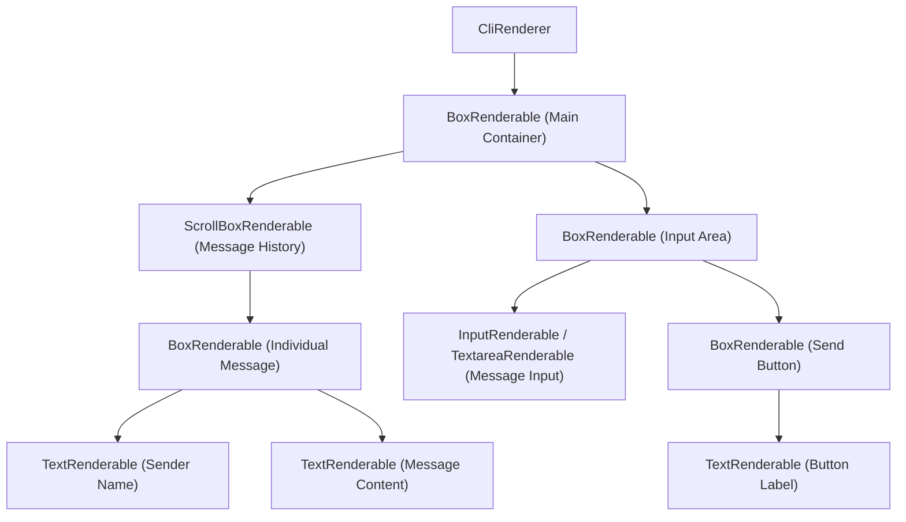

# OpenTUI Rendering Architecture Research
**Date:** 2026-02-16  
**Repository:** anomalyco/opentui  
**Research Method:** DeepWiki AI-powered repository analysis

---

## Table of Contents
1. [ScrollBox Component & Sticky Scrolling](#1-scrollbox-component--sticky-scrolling)
2. [Core Rendering Primitives](#2-core-rendering-primitives)
3. [Dynamic Content & Layout Reflow](#3-dynamic-content--layout-reflow)
4. [React Integration](#4-react-integration)
5. [Event System](#5-event-system)
6. [Rendering Performance & Delta Rendering](#6-rendering-performance--delta-rendering)
7. [Chat Application Patterns](#7-chat-application-patterns)

---

## 1. ScrollBox Component & Sticky Scrolling

### Overview
OpenTUI's `ScrollBoxRenderable` component provides a scrollable container with features like scrollbars, sticky scrolling, and viewport culling for performance optimization. It achieves scrolling by translating its `content` component within a clipped `viewport`.

### Sticky Scrolling Options
The `ScrollBoxRenderable` component offers sticky scrolling functionality through the `stickyScroll` and `stickyStart` options:

- **`stickyScroll`**: A boolean that enables or disables sticky scroll behavior. When `true`, the scroll position will automatically adjust to maintain a designated edge when content changes.
- **`stickyStart`**: Defines which edge the `ScrollBoxRenderable` should stick to. Possible values are `"top"`, `"bottom"`, `"left"`, or `"right"`. For example, setting `stickyStart: "bottom"` is useful for chat or log interfaces where new content should keep the view scrolled to the bottom.

### Manual Scroll Override
When a user manually scrolls away from the `stickyStart` position, the sticky behavior is paused, indicated by the `_hasManualScroll` flag being set to `true`. The sticky behavior resumes if the user scrolls back to the designated sticky edge.

### Auto-scroll to Bottom During Content Streaming
When `stickyScroll` is enabled and `stickyStart` is set to `"bottom"`, the `ScrollBoxRenderable` automatically scrolls to the bottom as new content is added. This is managed by the `recalculateBarProps()` method.

Specifically, when the content size changes (e.g., new items are added), `recalculateBarProps()` is called. Inside this method, if `stickyScroll` is `true` and there hasn't been a manual scroll (`_hasManualScroll` is `false`), the `applyStickyStart()` method is invoked with the configured `stickyStart` value. If `stickyStart` is `"bottom"`, `applyStickyStart()` sets the `verticalScrollBar.scrollPosition` to the maximum scrollable height, effectively scrolling to the bottom. This ensures that as content streams in, the view remains at the bottom, providing a continuous feed experience.

### Implementation Notes
The `ScrollBoxRenderable` component is a complex component that internally manages several `BoxRenderable` instances for its `wrapper`, `viewport`, and `content`, along with `ScrollBarRenderable` instances for vertical and horizontal scrolling. The `ContentRenderable` class, which extends `BoxRenderable`, is specifically designed to hold the user's children and handles viewport culling for performance.

**References:**
- Wiki page: [ScrollBox (anomalyco/opentui)](/wiki/anomalyco/opentui#4.1.2)
- DeepWiki search: https://deepwiki.com/search/how-does-opentuis-scrollbox-co_30dedf3a-2155-4104-b9d1-2684644c6c00

---

## 2. Core Rendering Primitives

### Overview
OpenTUI provides a set of core rendering primitives, known as `Renderable` classes, which are the fundamental building blocks for creating terminal user interfaces. These `Renderable`s can be composed together to create complex layouts and interactive elements, including chat-like interfaces.

### Primary Renderable Classes

- **`BoxRenderable`**: A container component that supports borders, background colors, and flexible layout using the Yoga layout engine. It's used for creating panels, frames, and organizing sections of the UI.
- **`TextRenderable`**: Used for displaying styled text content, supporting colors, attributes (like bold or underline), and text selection. Text modifiers like `<strong>`, `<em>`, and `<u>` can be used within a `<text>` component to apply specific styling.
- **`ScrollBoxRenderable`**: A scrollable container that supports horizontal and vertical scrolling, sticky scroll behavior, and viewport culling for performance.
- **`InputRenderable`**: A single-line text input field with cursor support, placeholder text, and focus states for user interaction.
- **`TextareaRenderable`**: A multi-line editable text component.
- **`SelectRenderable`**: Provides a dropdown or list selection mechanism.
- **`TabSelectRenderable`**: Used for horizontal tab selection.
- **`CodeRenderable`**: Displays syntax-highlighted code blocks.
- **`LineNumberRenderable`**: Provides line number gutters for code or text views.
- **`DiffRenderable`**: A viewer for unified or split diffs.
- **`ASCIIFontRenderable`**: For displaying ASCII art text.
- **`MarkdownRenderable`**: Renders markdown content.

These `Renderable` classes are exported from `packages/core/src/renderables/index.ts`.

### Building Chat-like Interfaces

To build chat-like interfaces, you would typically combine several of these primitives:

1. **`ScrollBoxRenderable`**: This is crucial for displaying a history of messages. Its `stickyScroll` property, particularly when set to `"bottom"`, ensures that new messages automatically keep the view scrolled to the latest content, which is ideal for chat applications.
2. **`BoxRenderable`**: Used for structuring the overall layout, such as containing the message history and the input area. You can use `flexDirection` and `gap` properties to arrange elements vertically or horizontally.
3. **`TextRenderable`**: Each message in the chat would likely be rendered using a `TextRenderable` to display the message content, potentially with different styles for sender names, timestamps, or message types.
4. **`InputRenderable`** or **`TextareaRenderable`**: For the user to type and send messages. An `InputRenderable` would suffice for single-line messages, while a `TextareaRenderable` would be used for multi-line input. These components support event handlers for input and submission.

### Example Composition (Conceptual)

A chat interface could be structured as follows:



In this conceptual diagram, the `CliRenderer` manages the entire terminal output. A main `BoxRenderable` acts as the root container, dividing the screen into a message history area (`ScrollBoxRenderable`) and an input area (`BoxRenderable`). Each message within the `ScrollBoxRenderable` would be a `BoxRenderable` containing `TextRenderable`s for the sender and content. The input area would feature an `InputRenderable` or `TextareaRenderable` for typing, and potentially another `BoxRenderable` with a `TextRenderable` for a "Send" button.

### Implementation Notes
While the examples provided are often in a React context, the underlying `Renderable` classes are part of the `@opentui/core` package and can be used imperatively as well.

**References:**
- Source: `packages/core/src/renderables/index.ts`
- Source: `packages/react/README.md`
- Wiki page: [Quick Start with React (anomalyco/opentui)](/wiki/anomalyco/opentui#2.2)
- DeepWiki search: https://deepwiki.com/search/what-are-the-core-rendering-pr_172e4eb4-bb45-43e8-9bcb-7840ef7d7f51

---

## 3. Dynamic Content & Layout Reflow

### Overview
OpenTUI handles dynamic content and layout reflow by integrating with the Yoga layout engine, which provides CSS Flexbox-like capabilities. When children are added, removed, or resized, the system triggers a layout recalculation and subsequent re-render to update the UI.

### Dynamic Content Handling Mechanism

The core of OpenTUI's dynamic content handling and layout reflow lies within the `Renderable` class and its interaction with the Yoga layout engine.

#### 1. Adding Children
When a child `Renderable` is added to a parent using the `add()` or `insertBefore()` methods, the parent's Yoga node is updated to include the new child's Yoga node. This marks the layout as dirty, and a re-render is requested. The newly added children receive their correct layout dimensions on the subsequent render cycle.

#### 2. Removing Children
When a child is removed using the `remove()` method, its Yoga node is detached from the parent's Yoga node. This also triggers a layout recalculation and re-render, causing the remaining elements to reflow and occupy the freed space.

#### 3. Resizing Children
Changes to layout properties like `width`, `height`, `flexGrow`, `flexDirection`, etc., on a `Renderable` directly update its corresponding Yoga node properties. Each setter for these properties calls `requestRender()`, ensuring that the layout is re-evaluated. This is evident in tests where changing the text content of a `TextareaRenderable` causes its height to change and subsequent elements to reflow.

### Layout Reflow Process

The layout reflow process in OpenTUI follows a three-pass rendering cycle managed by the `RootRenderable`:

1. **Lifecycle Pass**: Before layout calculation, `onLifecyclePass()` is called on registered renderables, allowing them to update their state.

2. **Layout Calculation**: The `RootRenderable` initiates a layout calculation on its Yoga node if it's marked as dirty. This step computes the positions and sizes of all renderables in the tree.

3. **Update Layout and Collect Render List**: After the Yoga layout calculation, the `updateLayout()` method is called recursively down the renderable tree.
   - Each `Renderable`'s `updateFromLayout()` method is called to read the computed `x`, `y`, `width`, and `height` values from its Yoga node.
   - If a renderable's dimensions have changed, `onLayoutResize()` is invoked, which then calls `onResize()`. This allows components to react to size changes, for example, by rebuilding internal buffers.
   - Children that were newly added are also updated during this phase to ensure their positions are current.
   - Render commands are collected into a list.

4. **Render Collected Renderables**: Finally, the collected render commands are executed to draw the UI to the `OptimizedBuffer`.

### React Integration
Frameworks like React integrate with this system by using a reconciler that translates JSX operations (adding, removing, updating components) into calls to the `Renderable`'s `add()`, `remove()`, and `insertBefore()` methods. After a commit, the `resetAfterCommit()` function on the host config calls `containerInfo.requestRender()` to trigger a re-render cycle.

### Implementation Notes
The `Renderable` class uses `_childrenInLayoutOrder` and `_childrenInZIndexOrder` to manage children, ensuring correct layout and rendering order. The `requestRender()` method is crucial for signaling that a re-render is needed, but it should be used judiciously to optimize performance.

**References:**
- Wiki page: [Custom Components (anomalyco/opentui)](/wiki/anomalyco/opentui#9.1)
- DeepWiki search: https://deepwiki.com/search/how-does-opentui-handle-dynami_ef254ee2-ede3-4f84-8384-101cf962a842

---

## 4. React Integration

### Overview
The OpenTUI React integration uses a custom React reconciler to render React components into terminal user interfaces. React components are mapped to OpenTUI `Renderable` instances through a component catalogue, and React hooks like `useEffect` and `useState` function within the standard React rendering lifecycle, with specific OpenTUI-provided hooks for terminal interactions.

### React Integration Architecture

OpenTUI integrates with React through a custom reconciler, which is responsible for translating React's virtual DOM operations into concrete operations on OpenTUI's `Renderable` tree. The core of this integration is the `hostConfig` object, which defines how React interacts with the OpenTUI environment.

The process begins when you call `createRoot` with a `CliRenderer` instance and then `render` your React component tree. The `createRoot` function creates a React reconciler container, which then uses the `hostConfig` to manage the lifecycle of OpenTUI `Renderable` instances.

### React Component to OpenTUI Renderable Mapping

React JSX elements are mapped to OpenTUI `Renderable` classes via a `componentCatalogue`. When React's reconciler needs to create an instance for a JSX element, it calls the `createInstance` method in `hostConfig`. This method looks up the corresponding `Renderable` constructor in the `componentCatalogue` based on the JSX element's type (e.g., `<box>` maps to `BoxRenderable`) and instantiates it.

**Example Mappings:**
- `<text>` → `TextRenderable`
- `<box>` → `BoxRenderable`
- `<input>` → `InputRenderable`
- `<span>` → `SpanRenderable` (child of `<text>`)
- `<strong>` → `BoldSpanRenderable` (child of `<text>`)
- `<em>` → `ItalicSpanRenderable` (child of `<text>`)

Text modifier elements like `<span>`, `<strong>`, and `<em>` are specifically designed to be children of `<text>` components. The `hostConfig` enforces this by checking `hostContext.isInsideText` when creating text node components.

Props passed to React components are translated into options for the `Renderable` instances. The `setInitialProperties` and `updateProperties` utilities handle applying these props to the `Renderable` instances.

### Integration of React Hooks

React's `useEffect` and `useState` hooks function as they would in any React application, managing component state and side effects.

#### Standard React Hooks
- **`useState`**: Used for managing component-specific state, such as the value of an input field or animation progress. Changes to state trigger re-renders, and the reconciler updates the corresponding `Renderable` instances.
- **`useEffect`**: Used for side effects, such as setting up timers, subscribing to events, or performing actions when a component mounts or updates. For example, `useEffect` can be used to show the console when a component mounts.

#### OpenTUI-Specific Hooks
- **`useRenderer()`**: Provides access to the `CliRenderer` instance, allowing direct interaction with the terminal, such as showing the console.
- **`useKeyboard()`**: Allows components to subscribe to keyboard events.
- **`useTerminalDimensions()`**: Provides the current terminal width and height and updates components when the terminal is resized. This hook internally uses `useEffect` to subscribe to resize events from the renderer.
- **`useTimeline()`**: Integrates with OpenTUI's animation engine, allowing React components to define and control animations.

### Rendering Lifecycle
The React reconciler's `resetAfterCommit` method ensures that after React has processed updates and committed changes to the `Renderable` tree, the `containerInfo.requestRender()` method is called to trigger a re-render of the terminal UI. This ensures that any state or prop changes reflected in the `Renderable` instances are visually updated in the terminal.

### Development Tools
The `packages/react/src/reconciler/reconciler.ts` file also shows how React DevTools can be integrated by setting the `DEV` environment variable. This allows for inspecting and modifying component props in real-time, which can be useful for debugging.

**References:**
- Source: `packages/react/src/reconciler/reconciler.ts`
- Wiki page: [Quick Start with React (anomalyco/opentui)](/wiki/anomalyco/opentui#2.2)
- DeepWiki search: https://deepwiki.com/search/how-does-the-opentui-react-int_f82f8103-f693-4020-8324-3ec97dec5eb7

---

## 5. Event System

### Overview
OpenTUI's event system manages user input and dispatches events to relevant components. It supports keyboard events, mouse events, and paste events, utilizing a priority-based dispatch mechanism.

### Event Flow Architecture

The event flow begins with input from `process.stdin`. This raw byte stream is processed by a `StdinBuffer`. The buffered input is then parsed by:
- `parseKeypress()` for keyboard events
- `parseKittyKeyboard()` for Kitty-specific keyboard events
- `parseMouse()` for mouse events
- A bracketed paste detector for paste events

These parsers generate `KeyEvent`, `MouseEvent`, or `PasteEvent` instances.

#### Event Dispatch Priority System
The `InternalKeyHandler` then dispatches these events through a two-tier priority system:

1. **Global Handlers**: Events are first sent to global handlers registered via `renderer.keyInput.on()`.
2. **Renderable Handlers**: If not stopped or prevented by global handlers, events proceed to handlers of the currently focused `Renderable`.

Event propagation can be controlled using:
- `preventDefault()` to stop default handling
- `stopPropagation()` to prevent further dispatch to subsequent handlers

### Keyboard Input

Keyboard input is handled by the `KeyHandler`. Raw terminal input is parsed into `KeyEvent` objects, which include properties like:
- `name`
- `ctrl`, `meta`, `shift`, `option`, `super`, `hyper`
- `eventType`
- `sequence`
- `raw`

OpenTUI supports:
- Standard keyboard sequences
- The Kitty keyboard protocol for enhanced key reporting

The `parseKeypress` function filters out non-keyboard sequences such as mouse events, terminal response sequences, and bracketed paste markers.

Renderables can register `onKeyDown` callbacks to handle keyboard events when focused.

**Reference:**
- Source: `packages/core/src/lib/parse.keypress.ts` (lines 200-211)
- Source: `packages/core/src/lib/KeyHandler.ts` (lines 64-88)

### Mouse Events

Mouse events are parsed by the `MouseParser` from SGR mouse protocol sequences. These events are encapsulated in `MouseEvent` objects, containing:
- Spatial coordinates (`x`, `y`)
- Button information
- Event type

#### Hit Grid System
Mouse events are routed to `Renderable` components using a **hit grid**. During rendering, each `Renderable` writes its unique ID (`num`) to the cells it occupies in the hit grid. When a mouse event occurs, the system performs a hit test at the event's coordinates to identify the target `Renderable`.

#### Mouse Event Handlers
`Renderable` components can define various mouse event handlers:
- `onMouseDown`
- `onMouseUp`
- `onMouseMove`
- `onMouseDrag`
- `onMouseScroll`
- `onMouseOver`
- `onMouseOut`

If `autoFocus` is enabled, a left-click on a `focusable` renderable will automatically focus it.

### Focus Management

Focus management determines which `Renderable` receives keyboard and paste events. Only one `Renderable` can be focused at a time.

#### Focus Mechanism
- A `Renderable` can be made focusable by setting its `_focusable` flag.
- When `focus()` is called on a `Renderable`, it registers its keyboard and paste handlers with the `InternalKeyHandler`.
- Conversely, calling `blur()` unregisters these handlers.
- The `CliRenderer` tracks the `_currentFocusedRenderable`.

#### Focus Events
Focus events (`\x1b[I]` for focus in, `\x1b[O]` for focus out) are detected and trigger `focus` and `blur` events on the `CliRenderer`. These focus events do not trigger `keypress` events.

### Resize Events

The `CliRenderer` handles terminal resize events. When the terminal dimensions change, the `CliRenderer` emits a `"resize"` event, providing the new `width` and `height`. This allows components to react to changes in the available screen space. The `RootRenderable` automatically adjusts its size to fill the entire terminal and updates its layout accordingly.

### Implementation Notes
The `CliRenderer` is the central orchestrator for input handling and event dispatch. It sets up input, manages the `_keyHandler`, `_stdinBuffer`, and `mouseParser`, and handles `focusRenderable()` calls. The `setupTerminal()` method in `CliRenderer` is responsible for enabling mouse and Kitty keyboard protocols, and querying terminal capabilities.

**References:**
- Wiki page: [High-Level Architecture (anomalyco/opentui)](/wiki/anomalyco/opentui#1.2)
- Wiki page: [Event System (anomalyco/opentui)](/wiki/anomalyco/opentui#3.4)
- DeepWiki search: https://deepwiki.com/search/what-is-opentuis-event-system_5edd7565-a50b-4f5d-9267-66e0741712d0

---

## 6. Rendering Performance & Delta Rendering

### Overview
OpenTUI optimizes rendering performance for rapidly updating content through a "delta rendering" system, which leverages double buffering and a native Zig rendering layer to minimize terminal I/O. This system only writes ANSI escape codes for cells that have changed between frames, significantly reducing the amount of data sent to the terminal. Additionally, OpenTUI employs a live request system, viewport culling, and a dedicated render thread to further enhance responsiveness and efficiency.

### Delta Rendering System

The delta rendering system in OpenTUI is designed to optimize terminal output by only sending updates for changed cells.

#### Double Buffering
OpenTUI utilizes two primary buffers: `currentRenderBuffer` and `nextRenderBuffer`.

1. **`nextRenderBuffer`**: Components render their output to this buffer during a frame.
2. **`currentRenderBuffer`**: This buffer holds the state of the previously rendered frame.

After rendering to `nextRenderBuffer`, the native Zig renderer compares `currentRenderBuffer` with `nextRenderBuffer` cell-by-cell. Once the comparison and output generation are complete, the buffers are swapped, making `nextRenderBuffer` the new `currentRenderBuffer` for the next frame. This ensures that queries for the current state always see a complete frame.

#### Delta Computation
The core of delta rendering happens in the native Zig layer, specifically within the `generateOutput()` function. This function performs the following optimizations:

- Tracks the cursor position to minimize cursor movement codes
- Groups consecutive cells with identical styling into single SGR (Select Graphic Rendition) sequences
- Entirely skips unchanged cells, meaning no output is generated for them

The comparison considers:
- Character
- Foreground color
- Background color
- Text attributes

#### Cell Encoding
Cells are encoded as compact structures in flat arrays, containing:
- Unicode codepoints or grapheme pool IDs
- RGBA foreground and background colors
- Text attributes

### Performance Optimizations for Rapid Updates

#### 1. Live Request System
The renderer's lifecycle is automatically managed based on whether any components require continuous updates. Components that need continuous updates, such as animations or streaming text, call `requestLive()` when mounted and `releaseLive()` when unmounted. The renderer then automatically starts or stops its loop based on an internal counter, preventing unnecessary render cycles when the UI is idle.

#### 2. Viewport Culling
For large amounts of content, like long chat histories, OpenTUI uses viewport culling. This optimization ensures that only children visible within a scrollable viewport are processed for rendering. The `ScrollBoxRenderable` class filters children based on their intersection with the viewport, using an efficient O(log n + k) algorithm for determining visible items.

#### 3. Render Thread
On supported platforms, OpenTUI can offload the writing of ANSI output to stdout to a dedicated render thread. This prevents the main thread from being blocked by potentially slow terminal I/O operations. The main thread prepares the `nextRenderBuffer`, then signals the render thread to generate and write the ANSI output. Synchronization is handled using a mutex and condition variable.

#### 4. Streaming Mode for CodeRenderable
For components like `CodeRenderable` that display content arriving incrementally (e.g., LLM output), a `streaming` mode can be enabled. This mode optimizes highlighting for incremental updates, making it suitable for rapidly updating text content.

### Implementation Notes
The `CliRenderer` in OpenTUI manages the terminal output and the rendering loop. It can operate in a "live" mode for continuous updates or re-render only when the renderable tree or layout changes. The `OptimizedBuffer` (also referred to as `FrameBuffer`) is a low-level rendering surface optimized for performance and memory usage, supporting transparent cells and alpha blending.

**References:**
- Wiki page: [Performance Optimization (anomalyco/opentui)](/wiki/anomalyco/opentui#9.2)
- DeepWiki search: https://deepwiki.com/search/how-does-opentui-handle-render_d84fb521-c60d-46cf-a96c-7382940ff85b

---

## 7. Chat Application Patterns

### Overview
OpenTUI provides components like `<box>`, `<text>`, `<input>`, and `<textarea>` that can be used to build a chat application. You can structure message lists using `<scrollbox>` or `<box>` components, input boxes with `<input>` or `<textarea>`, and status indicators with `<text>` components.

### Message Lists

For displaying a list of messages, you would typically use a `<box>` or `<scrollbox>` component as a container. Each message within the list can be represented by a `<box>` containing `<text>` components for the sender, timestamp, and message content.

**Key Properties:**
- Use `flexDirection="column"` on the parent `<box>` to arrange messages vertically
- The `packages/core/src/lib/objects-in-viewport.test.ts` file contains a test case for a "chat-like interface with variable height messages", demonstrating how objects (which would correspond to messages) can be managed within a viewport
- For scrollability of message history, use scrollable containers

### Input Boxes

For the message input area, you would use an `<input>` component for single-line input or a `<textarea>` component for multi-line input.

**Supported Features:**
- `placeholder` text
- `onInput` for handling value changes
- `onSubmit` for handling submission (e.g., pressing Enter)
- `focused` prop for managing focus state

**Example:**
The `packages/solid/tests/cursor-behavior.test.tsx` file shows an example of a `<textarea>` being used for user input, including setting initial value, placeholder, and handling keybindings.

### Status Indicators

Status indicators, such as "typing..." or "connected/disconnected", can be implemented using the `<text>` component. You can dynamically change the text content and styling (e.g., `fg` for foreground color) based on the application's state.

**Example:**
The login form example in `packages/react/README.md` demonstrates a status indicator that changes color based on "success" or "error" states.

### Overall Structure

A typical chat application structure would involve:

```
<box flexDirection="column">  <!-- Main Container -->
  <box>                        <!-- Message List -->
    <scrollbox>                <!-- Scrollable History -->
      <!-- Individual messages -->
    </scrollbox>
  </box>
  <box>                        <!-- Input Area -->
    <input|textarea />         <!-- Message Input -->
  </box>
  <text>                       <!-- Status Indicator -->
    Status: Connected
  </text>
</box>
```

**Component Breakdown:**
1. A main `<box>` container with `flexDirection="column"`
2. A `<box>` for the message list, potentially using `<scrollbox>` for scrollability
3. A `<box>` for the input area, containing an `<input>` or `<textarea>`
4. A `<text>` component for displaying status messages

### Global Key Event Handling

The `useKeyboard` hook can be used for global key event handling, such as:
- Submitting a message with `Enter`
- Navigating between components with `Tab`

### Implementation Notes
The examples provided in `packages/react/README.md`, such as the "Login Form", illustrate how to combine various components and hooks to create interactive UIs. The `packages/core/src/lib/objects-in-viewport.test.ts` file, while a test, provides a concrete example of how a chat-like interface's messages might be managed internally for rendering efficiency.

**References:**
- Source: `packages/core/src/lib/objects-in-viewport.test.ts`
- Source: `packages/solid/tests/cursor-behavior.test.tsx`
- Source: `packages/react/README.md`
- Wiki page: [Quick Start with React (anomalyco/opentui)](/wiki/anomalyco/opentui#2.2)
- DeepWiki search: https://deepwiki.com/search/what-are-example-patterns-for_a6cffb9c-fb9d-4266-af4d-1a10bd1d4a1e

---

## Summary of Key Insights

### For Building Chat Applications

1. **Use ScrollBox with Sticky Scrolling**: Enable `stickyScroll={true}` with `stickyStart="bottom"` for automatic scrolling as new messages arrive. Manual scrolling by the user temporarily disables auto-scroll until they scroll back to the bottom.

2. **Leverage Delta Rendering**: OpenTUI's delta rendering system automatically optimizes performance for rapidly updating content by only redrawing changed cells. This is crucial for streaming message content.

3. **Implement Viewport Culling**: For long message histories, use `ScrollBoxRenderable` which automatically culls off-screen content using an O(log n + k) algorithm, keeping rendering performant even with thousands of messages.

4. **Structure with React Components**: Use the React integration for declarative UI composition with standard hooks (`useState`, `useEffect`) combined with OpenTUI-specific hooks (`useKeyboard`, `useTerminalDimensions`) for terminal interactions.

5. **Handle Dynamic Content**: OpenTUI's integration with the Yoga layout engine ensures that adding, removing, or resizing messages automatically triggers layout reflow without manual intervention.

6. **Focus Management**: Use the built-in focus system for managing keyboard input between the message list (for scrolling/selection) and the input field (for typing).

7. **Event System**: Leverage the priority-based event system with global handlers for app-wide shortcuts and renderable-specific handlers for component behavior.

### Performance Considerations

- **Live Request System**: Components that need continuous updates (like streaming text) should call `requestLive()` on mount and `releaseLive()` on unmount
- **Render Thread**: On supported platforms, terminal output is offloaded to a dedicated thread to prevent blocking the main thread
- **Streaming Mode**: For components displaying incremental content (like LLM output), enable streaming mode for optimized performance

---

## Next Steps for Implementation

1. Set up a basic OpenTUI React application with `CliRenderer`
2. Create a `ScrollBox` component with sticky scrolling enabled for the message history
3. Implement message components using `Box` and `Text` renderables
4. Add an input component using `Input` or `Textarea` with submit handling
5. Integrate the event system for keyboard shortcuts and focus management
6. Test performance with rapidly updating (streaming) content
7. Add viewport culling optimization for long message histories

---

## Additional Resources

- [OpenTUI Repository](https://github.com/anomalyco/opentui)
- [Quick Start with React Wiki](https://deepwiki.com/wiki/anomalyco/opentui#2.2)
- [High-Level Architecture Wiki](https://deepwiki.com/wiki/anomalyco/opentui#1.2)
- [Event System Wiki](https://deepwiki.com/wiki/anomalyco/opentui#3.4)
- [Performance Optimization Wiki](https://deepwiki.com/wiki/anomalyco/opentui#9.2)
- [Custom Components Wiki](https://deepwiki.com/wiki/anomalyco/opentui#9.1)
- [ScrollBox Wiki](https://deepwiki.com/wiki/anomalyco/opentui#4.1.2)
