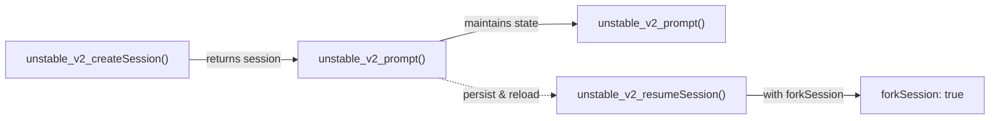

# External SDK Patterns for Workflow/Agent Orchestration

## Executive Summary

This research document analyzes external SDK patterns for workflow and agent orchestration to inform the design of a standardized workflow SDK. It examines five major systems across different domains:

1. **Claude Agent SDK** (Anthropic) - AI agent orchestration
2. **GitHub Copilot SDK** - Multi-language agentic framework
3. **OpenCode SDK** (Anomaly) - Code-centric agent platform
4. **LangGraph** (LangChain) - State-based graph workflows
5. **Temporal & Inngest** - Durable workflow-as-code platforms

---

## 1. Claude Agent SDK (TypeScript)

**Repository**: `anthropics/claude-agent-sdk-typescript`  
**Documentation**: Available via CHANGELOG.md and Overview wiki  
**DeepWiki Link**: https://deepwiki.com/search/how-does-the-sdk-define-agent_0de98ba3-593c-42ea-b229-9a4447fd09a1

### Core Abstractions

#### Agent
- Agents are configured programmatically using `agents: Record<string, AgentConfig>`
- Supports defining subagents inline without filesystem dependencies
- Configuration options include:
  - `skills`: Available skills for the agent
  - `maxTurns`: Maximum number of conversation turns
  - `tools`: Exact set of built-in tools available

```typescript
// Agent configuration
agents: {
  'my-agent': {
    skills: ['skill1', 'skill2'],
    maxTurns: 10,
    tools: ['Bash', 'Read', 'Edit']
  }
}
```

#### Session
- V2 Session APIs for multi-turn conversations:
  - `unstable_v2_createSession()`: Initiates a new session
  - `unstable_v2_resumeSession()`: Resumes or forks existing sessions
  - `unstable_v2_prompt()`: Sends prompts within a session
- Session state is maintained across prompts
- `forkSession: true` enables conversation branching



#### Tool
- Built-in tools: `Bash`, `Read`, `Edit`, `AskUserQuestion`
- Tool configuration patterns:
  - **Preset**: `tools: { type: 'preset', preset: 'claude_code' }`
  - **Allowlist**: `tools: ['Bash', 'Read', 'Edit']`
  - **Disable all**: `tools: []`
- Custom tools via MCP (Model Context Protocol)
- `tool()` helper supports annotations: `readOnlyHint`, `destructiveHint`, `openWorldHint`, `idempotentHint`

#### Message Types
- `SDKSystemMessage`: System messages with skills field
- `task_started`: Emitted when subagent tasks are registered
- `task_notification`: Includes `tool_use_id` for correlating task completions
- `SDKResultSuccess` / `SDKResultError`: Include `stop_reason` field

### Sub-Agent Patterns

- Subagents defined inline via `agents` option
- `task_started` system messages indicate subagent invocation
- `task_notification` events correlate task completion with tool calls
- Programmatic composition without filesystem dependencies

### Streaming API

- `Session.stream()`: Primary streaming method (renamed from `receive()`)
- Event types:
  - `task_started`: Subagent task registration
  - `task_notification`: Task completion with `tool_use_id`
  - `ConfigChange`: Configuration file changes
  - `TeammateIdle`: Subagent idle state
  - `TaskCompleted`: Subagent task completion
- Holds back intermediate results until all background subagents complete

### State Management

- Explicit session persistence via `unstable_v2_resumeSession()`
- State maintained for multi-turn conversations
- Optional forking for exploring different conversational paths

### Error Handling

- `NoRetryError`: Prevents retries at the tool level
- MCP tools have configurable timeouts via `MCP_TOOL_TIMEOUT`
- MCP channels have 60-second closure timeout
- `mcpServerStatus()`, `reconnectMcpServer()`, `toggleMcpServer()` for management

### API Style

**Imperative** - Explicit session management with programmatic configuration

---

## 2. GitHub Copilot SDK (Multi-Language)

**Repository**: `github/copilot-sdk`  
**Documentation**: Comprehensive guides in docs/ directory  
**DeepWiki Link**: https://deepwiki.com/search/how-does-the-sdk-define-agent_33c10dd5-87fa-47d9-bff5-50e79bbd227f

### Core Abstractions

#### Agent (Custom Agent Config)
```typescript
interface CustomAgentConfig {
  name: string;
  displayName?: string;
  description?: string;
  tools?: string[];
  prompt: string;
  mcpServers?: { [key: string]: any };
  infer?: boolean;
}
```

```go
type CustomAgentConfig struct {
    Name string `json:"name"`
    DisplayName string `json:"displayName,omitempty"`
    Description string `json:"description,omitempty"`
    Tools []string `json:"tools,omitempty"`
    Prompt string `json:"prompt"`
    MCPServers map[string]MCPServerConfig `json:"mcpServers,omitempty"`
    Infer *bool `json:"infer,omitempty"`
}
```

**Key Features**:
- Specialized AI personas with scoped tools
- Custom prompts for behavior guidance
- MCP server integration for external tools

#### Session (CopilotSession)

```typescript
export class CopilotSession {
  public readonly sessionId: string;
  // Methods: send, sendAndWait, on
}
```

**Session Management**:
- Create: `client.createSession(config)`
- Resume: `client.resumeSession(sessionId)`
- State persisted to `~/.copilot/session-state/{sessionId}/`
- 30-minute idle timeout with automatic cleanup

**Persisted Data**:
- Conversation history (full message thread)
- Tool call results (cached for context)
- Agent planning state (`plan.md` file)
- Session artifacts in `files/` subdirectory

**NOT Persisted**:
- Provider/API keys (security)
- In-memory tool state

**Session Configuration**:
```typescript
const session = await client.createSession({
  sessionId: "user-123-task-456",
  model: "gpt-5.2-codex",
  customAgents: [/* custom agents */],
  tools: [/* tool definitions */],
  systemMessage: "Custom system prompt",
  infiniteSessions: {
    enabled: true,
    backgroundCompactionThreshold: 0.80,
    bufferExhaustionThreshold: 0.95
  }
});
```

#### Message & Events

```typescript
type SessionEvent = 
  | { type: "assistant.message"; data: { content: string; ... } }
  | { type: "user.message"; data: { content: string; ... } }
  | { type: "tool.call"; ... }
  // ... other event types
```

**Sending Messages**:
```typescript
// Non-blocking send
await session.send({
  prompt: "Hello",
  attachments: [/* optional attachments */]
});

// Blocking send (waits for idle)
await session.sendAndWait({
  prompt: "Analyze this code",
  mode: "full"
});
```

### Tool Registration Patterns

**SDK-Defined Tools**:

```typescript
// Node.js/TypeScript
defineTool("lookup_issue", {
  description: "Fetch issue details from our tracker",
  parameters: z.object({
    id: z.string().describe("Issue identifier"),
  }),
  handler: async ({ id }) => {
    const issue = await fetchIssue(id);
    return issue;
  },
})
```

```python
# Python SDK
@define_tool
async def lookup_issue(invocation):
    issue_id = invocation["arguments"]["id"]
    issue = await fetch_issue(issue_id)
    return {
        "textResultForLlm": issue.summary,
        "resultType": "success",
        "sessionLog": f"Fetched issue {issue_id}",
    }
```

```csharp
// .NET SDK
AIFunctionFactory.Create(
    async ([Description("Issue identifier")] string id) => {
        var issue = await FetchIssueAsync(id);
        return issue;
    },
    "lookup_issue",
    "Fetch issue details from our tracker")
```

**MCP Server Tools**:
- Local servers: Spawned as subprocesses (stdin/stdout)
- Remote servers: Pre-existing HTTP services
- CLI discovers tools via `tools/list` request

**Skill Files**:
- Defined in `SKILL.md` files
- Discovered from `skillDirectories`
- Runtime discovery by agent

### Tool Execution Flow

1. CLI sends `tool.call` JSON-RPC notification
2. SDK receives and dispatches to handler
3. Handler executes with arguments
4. Result sent back via `tool.callResult` JSON-RPC response
5. Errors caught and returned without exposing details to LLM

### Session Hooks (Extension Points)

```typescript
const session = await client.createSession({
  model: "gpt-5",
  hooks: {
    onPreToolUse: async (input, invocation) => {
      console.log(`About to run tool: ${input.toolName}`);
      return {
        permissionDecision: "allow", // or "deny", "ask"
        modifiedArgs: input.toolArgs,
        additionalContext: "Extra context for the model",
      };
    },
    onPostToolUse: async (input, invocation) => {
      console.log(`Tool ${input.toolName} completed`);
      return {
        additionalContext: "Post-execution notes",
      };
    },
    onUserPromptSubmitted: async (input, invocation) => {
      return {
        modifiedPrompt: input.prompt,
      };
    },
    onSessionStart: async (input, invocation) => {
      return {
        additionalContext: "Session initialization context",
      };
    },
    onSessionEnd: async (input, invocation) => {
      console.log(`Session ended: ${input.reason}`);
    },
    onErrorOccurred: async (input, invocation) => {
      console.error(`Error in ${input.errorContext}`);
      return {
        errorHandling: "retry", // or "skip", "abort"
      };
    },
  },
});
```

### Custom Agent Example

```typescript
const session = await client.createSession({
  model: "claude-haiku-4.5",
  customAgents: [
    {
      name: "researcher",
      displayName: "Research Agent",
      description: "Read-only research assistant",
      tools: ["grep", "glob", "view"], // Tool scoping
      prompt: "You are a research assistant. You can search and read files but cannot modify anything.",
    },
  ],
});
```

### Infinite Sessions (Long-Running Workflows)

```typescript
const session = await client.createSession({
  sessionId: "long-workflow-123",
  infiniteSessions: {
    enabled: true,
    backgroundCompactionThreshold: 0.80,  // Compact at 80%
    bufferExhaustionThreshold: 0.95,      // Block at 95%
  },
});
```

- Automatic context window management
- Background compaction to stay within limits
- State persisted to workspace directory

### Deployment Patterns

1. **One CLI Server Per User** (Recommended)
   - Strong isolation for multi-tenant environments
   - Each user has their own server instance

2. **Shared CLI Server**
   - Resource-efficient for internal tools
   - Requires application-level access control
   - Unique session IDs per user essential

3. **Serverless/Container**
   - Mount `~/.copilot/session-state/` to persistent storage
   - Ensures sessions survive container restarts

### State Management

- **Explicit Persistence**: `sessionId` required for resumable sessions
- **Automatic Saving**: State written to disk after each interaction
- **Lifecycle Management**: `listSessions()`, `deleteSession()`, `session.destroy()`

### API Style

**Hybrid Declarative/Imperative**:
- Declarative: Configuration via `SessionConfig`
- Imperative: Event handling and hook functions
- Clear separation of configuration and runtime behavior

---

## 3. OpenCode SDK (Anomaly)

**Repository**: `anomalyco/opencode`  
**Documentation**: packages/web/src/content/docs/  
**DeepWiki Link**: https://deepwiki.com/search/what-is-the-agent-session-mode_27eb093b-465d-4ce3-a56c-24b7b1306598

### Core Abstractions

#### Agent

```typescript
// Agent.Info type (packages/opencode/src/agent/agent.ts)
interface Agent.Info {
  name: string;
  description?: string;
  mode: "subagent" | "primary" | "all";
  model: {
    modelID: string;
    providerID: string;
  };
  prompt: string;
  permission: {
    // Tool access ruleset
  };
}
```

**Configuration** (`opencode.json`):
```json
{
  "agents": {
    "build": {
      "mode": "subagent",
      "model": { "modelID": "claude-3-5-sonnet-20241022", "providerID": "anthropic" },
      "prompt": "You are a build specialist...",
      "permission": {
        "tools": ["bash", "read", "write"],
        "task": ["code-reviewer"]
      }
    },
    "plan": {
      "mode": "primary",
      "hidden": false
    }
  }
}
```

**Agent Types**:
- **Primary**: Handle direct user interaction
- **Subagent**: Invoked by primary agents or manually via `@mention`
- **All**: Can function as both

#### Session

```javascript
// Session operations
const session = await client.session.create({
  body: { title: "My session" },
})

const result = await client.session.prompt({
  path: { id: session.id },
  body: {
    model: { providerID: "anthropic", modelID: "claude-3-5-sonnet-20241022" },
    parts: [{ type: "text", text: "Hello!" }],
  },
})
```

**Session API**:
- `session.list()`: List all active sessions
- `session.get({ path })`: Fetch session details
- `session.create({ body })`: Create new session
- `session.prompt({ path, body })`: Send message to session

**Session Manager** (`ACPSessionManager` in `packages/opencode/src/acp/session.ts`):
- Handles session creation and loading
- Maps ACP sessions to OpenCode's internal model

#### Message & Parts

```typescript
// Auto-generated types (packages/sdk/js/src/v2/gen/types.gen.ts)
type Message = UserMessage | AssistantMessage;

interface UserMessage {
  role: "user";
  agent: string;
  model: ModelConfig;
  parts: Part[];
}

interface AssistantMessage {
  role: "assistant";
  cost: number;
  tokens: TokenUsage;
  finishReason: string;
  parts: Part[];
}

type Part = TextPart | ToolPart | FilePart | ...;
```

### Tool Registration Patterns

**File-Based Tools**:

```typescript
// .opencode/tools/database.ts (Single tool)
import { tool } from "@opencode-ai/plugin"

export default tool({
  description: "Query the project database",
  args: {
    query: tool.schema.string().describe("SQL query to execute"),
  },
  async execute(args) {
    return `Executed query: ${args.query}`
  },
})
```

```typescript
// .opencode/tools/math.ts (Multiple tools)
import { tool } from "@opencode-ai/plugin"

export const add = tool({
  description: "Add two numbers",
  args: {
    a: tool.schema.number().describe("First number"),
    b: tool.schema.number().describe("Second number"),
  },
  async execute(args) {
    return args.a + args.b;
  },
})

export const multiply = tool({
  description: "Multiply two numbers",
  args: {
    a: tool.schema.number(),
    b: tool.schema.number(),
  },
  async execute(args) {
    return args.a * args.b;
  },
})
```

**Tool Discovery**:
- **Local**: `.opencode/tools/` in project directory
- **Global**: `~/.config/opencode/tools/`
- **Naming**:
  - Single export: `<filename>` (e.g., `database`)
  - Multiple exports: `<filename>_<exportname>` (e.g., `math_add`)

**Plugin-Based Tools**:

```typescript
// .opencode/plugins/custom-tools.ts
import { type Plugin, tool } from "@opencode-ai/plugin"

export const CustomToolsPlugin: Plugin = async (ctx) => {
  return {
    tool: {
      mytool: tool({
        description: "This is a custom tool",
        args: {
          foo: tool.schema.string(),
        },
        async execute(args, context) {
          const { directory, worktree } = context
          return `Hello ${args.foo} from ${directory}`
        },
      }),
    },
  }
}
```

**Tool Interface** (`Tool.Info`):
```typescript
interface Tool.Info {
  id: string;
  init: () => {
    description: string;
    parameters: ZodSchema;
    execute: (args: any, context: Context) => Promise<any>;
  };
}
```

**Tool Execution Flow**:
1. `SessionPrompt.resolveTools()` prepares tool for execution
2. Retrieves tool schema
3. Transforms schema via `ProviderTransform.schema()` if needed
4. Wraps execute function with plugin hooks
5. Triggers `tool.execute.before` and `tool.execute.after` plugin hooks

### Sub-Agent Dispatch

**Automatic Invocation via Task Tool**:

```
assistant: Now let me use the code-reviewer agent to review the code
assistant: Uses the Task tool to launch the code-reviewer agent
```

```
user: "Hello"
<commentary>
Since the user is greeting, use the greeting-responder agent to respond
</commentary>
assistant: "I'm going to use the Task tool with the greeting-responder agent"
```

**Permission Control** (`opencode.json`):
```json
{
  "agents": {
    "build": {
      "permission": {
        "task": ["code-*", "test-runner"]  // Glob patterns
      }
    }
  }
}
```

**Manual Invocation**:
```
@general help me search for this function
```

**Hidden Subagents**:
```json
{
  "agents": {
    "internal-reviewer": {
      "mode": "subagent",
      "hidden": true  // Not shown in @ autocomplete
    }
  }
}
```

### Streaming Events

**Event Types** (`Event` union type):
- **Installation**: `EventInstallationUpdated`, `EventInstallationUpdateAvailable`
- **Server**: `EventServerInstanceDisposed`, `EventServerConnected`, `EventGlobalDisposed`
- **LSP**: `EventLspClientDiagnostics`, `EventLspUpdated`
- **File/VCS**: `EventFileEdited`, `EventFileWatcherUpdated`, `EventVcsBranchUpdated`
- **Message**: `EventMessageUpdated`, `EventMessageRemoved`, `EventMessagePartUpdated`, `EventMessagePartDelta`, `EventMessagePartRemoved`
- **Permission**: `EventPermissionAsked`, `EventPermissionReplied`
- **Session**: `EventSessionStatus`, `EventSessionIdle`, `EventSessionCompacted`, `EventSessionCreated`, `EventSessionUpdated`, `EventSessionDeleted`, `EventSessionDiff`, `EventSessionError`
- **TUI**: `EventTuiPromptAppend`, `EventTuiCommandExecute`, `EventTuiToastShow`, `EventTuiSessionSelect`
- **MCP**: `EventMcpToolsChanged`, `EventMcpBrowserOpenFailed`
- **Pty**: `EventPtyCreated`, `EventPtyUpdated`, `EventPtyExited`, `EventPtyDeleted`
- **Worktree**: `EventWorktreeReady`, `EventWorktreeFailed`

**Streaming API** (Server-Sent Events):

```javascript
// Listen to real-time events via SSE
const events = await client.event.subscribe()
for await (const event of events.stream) {
  console.log("Event:", event.type, event.properties)
}

// With directory filter
const events = await client.event.subscribe({ directory: "/path/to/project" })
```

**Event Publishing**:
- Backend publishes events to event bus
- `SessionPrompt.loop()` (core agentic loop) publishes:
  - `message.updated`: Agent response updates
  - `message.part.updated`: Tool output updates
- SSE connection with retry logic and `Last-Event-ID` headers
- `createSseClient` handles underlying SSE connection

### State Management

- **Backend-Managed**: Inngest Server-style state management
- **Event-Driven**: State changes propagated via event bus
- **Durable**: `SessionPrompt.loop()` coordinates LLM streaming, tool execution, and context

### Error Handling

- Plugin hooks for tool execution interception
- `tool.execute.before` and `tool.execute.after` hooks
- Error propagation through event system

### API Style

**Declarative + Event-Driven**:
- Declarative agent configuration in `opencode.json`
- Event-driven communication via SSE
- Plugin system for extensibility

---

## 4. LangGraph (Python)

**Repository**: `langchain-ai/langgraph`  
**Documentation**: Comprehensive wiki and test files  
**DeepWiki Link**: https://deepwiki.com/search/how-does-langgraph-define-stat_4a1fe292-ba37-4263-ab48-c12dce6c520e

### Core Abstractions

#### StateGraph

```python
from typing_extensions import Annotated, TypedDict
import operator

class AgentState(TypedDict, total=False):
    input: str
    output: str
    steps: Annotated[list[str], operator.add]

workflow = StateGraph(AgentState)
```

**Typed State with Reducers**:
- State defined using `TypedDict` or Pydantic `BaseModel`
- Keys can be annotated with reducer functions: `Annotated[type, reducer]`
- Reducers specify how values from multiple nodes are aggregated
- Default behavior: New value overwrites old value

#### Node

```python
def node_a(state: State) -> dict:
    return {"text": state["text"] + "a"}

workflow.add_node("node_a", node_a)
```

**Node Characteristics**:
- Functions or runnables that receive current state
- Return `dict` representing partial state update
- Can be regular functions, async functions, or LangChain Runnables

**Input Schema Support**:
```python
workflow.add_node("tools", execute_tools, input_schema=ToolState)
```

#### Edge

```python
# Direct edges
workflow.add_edge(START, "node_a")
workflow.add_edge("node_a", "node_b")
workflow.add_edge("node_b", END)

# Conditional edges
def should_continue(messages):
    if not messages[-1].tool_calls:
        return "end"
    else:
        return "continue"

workflow.add_conditional_edges(
    "agent",
    should_continue,
    {
        "continue": "tools",
        "end": END,
    },
)

# Conditional entry point
def should_start(data: AgentState) -> str:
    if len(data["input"]) > 10:
        return "go-right"
    else:
        return "go-left"

workflow.set_conditional_entry_point(
    should_start, 
    {"go-left": "left", "go-right": "right"}
)
```

**Special Nodes**:
- `START`: Entry point of the graph
- `END`: Finish point of the graph

### State Management

**Merging Updates**:
1. Node returns `Partial<State>` (dictionary)
2. If state key has reducer → Use reducer to combine values
3. Otherwise → New value overwrites old value

**Example**:
```python
class ChildState(TypedDict):
    my_key: str

def grandchild_1(state: ChildState):
    return {"my_key": state["my_key"] + " here"}

def grandchild_2(state: ChildState):
    return {"my_key": state["my_key"] + " and there"}
```

### Workflow Composition & Sub-Graphs

```python
# Create a subgraph
subgraph_builder = StateGraph(SubState)
subgraph_builder.add_node("sub_node_1", sub_node_1)
subgraph_builder.add_node("sub_node_2", sub_node_2)
subgraph = subgraph_builder.compile()

# Use subgraph as node in parent graph
builder = StateGraph(MainState)
builder.add_node("subgraph_node", subgraph)
builder.add_edge(START, "subgraph_node")
builder.add_edge("subgraph_node", END)

app = builder.compile()
```

### Error Handling & Retries

**Retry Policies** (Node Level):
```python
# RetryPolicy attached during compilation
workflow.add_node("api_call", api_call_node, retry_policy=RetryPolicy(...))
```

**ToolNode Error Handling**:
```python
from langgraph.prebuilt import ToolNode

# Default error message
tool_node = ToolNode([my_tool], handle_tool_errors=True)

# Custom error message
tool_node = ToolNode([my_tool], handle_tool_errors="Tool execution failed")

# Error handler function
def handle_errors(error: Exception) -> str:
    if isinstance(error, ValueError):
        return "Invalid value provided"
    return "Unknown error occurred"

tool_node = ToolNode([my_tool], handle_tool_errors=handle_errors)

# Propagate exceptions (no handling)
tool_node = ToolNode([my_tool], handle_tool_errors=False)
```

### Declarative vs Imperative Patterns

**Declarative (StateGraph)**:
```python
# Define a new graph
workflow = StateGraph(AgentState)

workflow.add_node("agent", agent)
workflow.add_node("tools", execute_tools, input_schema=ToolState)

workflow.set_entry_point("agent")

workflow.add_conditional_edges(
    "agent", 
    should_continue, 
    {"continue": "tools", "exit": END}
)

workflow.add_edge("tools", "agent")

app = workflow.compile()
```

**Imperative (Functional API)**:
```python
from langgraph.func import task, entrypoint

@task
def submapper(input: int) -> str:
    time.sleep(input / 100)
    return str(input)

@task()
def mapper(input: int) -> str:
    sub = submapper(input)
    time.sleep(input / 100)
    return sub.result() * 2

@entrypoint(checkpointer=sync_checkpointer)
def graph(input: list[int]) -> list[str]:
    futures = [mapper(i) for i in input]
    mapped = [f.result() for f in futures]
    answer = interrupt("question")  # Human-in-the-loop
    final = [m + answer for m in mapped]
    return add_a.invoke(final)
```

**Key Differences**:
- Declarative: Explicit graph structure, compiled to `Pregel`
- Imperative: Function calls and futures, implicit flow
- Imperative supports `interrupt()` for human-in-the-loop

### Streaming Implementation

```python
# Stream modes
app = workflow.compile()

# Values mode: All values after each step
for output in app.stream(input_data, stream_mode="values"):
    print(output)

# Updates mode: Only node/task updates
for output in app.stream(input_data, stream_mode="updates"):
    print(output)

# Custom mode: Custom data from nodes
for output in app.stream(input_data, stream_mode="custom"):
    print(output)

# Messages mode: LLM tokens + metadata
for output in app.stream(input_data, stream_mode="messages"):
    print(output)

# Multiple modes
for mode, data in app.stream(input_data, stream_mode=["values", "updates"]):
    print(f"{mode}: {data}")
```

**Stream Modes**:
- `"values"`: Emits all state values after each step
- `"updates"`: Emits only node/task updates
- `"custom"`: Emits custom data via `get_stream_writer()`
- `"messages"`: Emits LLM messages token-by-token
- `"checkpoints"`: Emits checkpoint creation events
- `"tasks"`: Emits task start/finish events with results/errors
- `"debug"`: Emits debug events with maximum information

**Custom Streaming from Nodes**:
```python
from langgraph.utils import get_stream_writer

def my_node(state: State):
    writer = get_stream_writer()
    writer("custom_event", {"data": "my custom data"})
    return {"key": "value"}
```

### Checkpointing & Persistence

**Checkpoint Structure**:
```python
class Checkpoint(TypedDict):
    channel_values: dict  # Current state of all channels
    channel_versions: dict  # Version numbers for tracking
    versions_seen: dict  # Map from node ID to processed versions
    pending_sends: list  # Intermediate writes not yet committed
    metadata: dict  # Source, step number, parent relationships
```

**Checkpoint Savers**:

```python
from langgraph.checkpoint.memory import InMemorySaver
from langgraph.checkpoint.sqlite import SqliteSaver, AsyncSqliteSaver
from langgraph.checkpoint.postgres import PostgresSaver, AsyncPostgresSaver

# In-memory (development/testing)
checkpointer = InMemorySaver()

# SQLite (development)
checkpointer = SqliteSaver.from_conn_string("checkpoints.db")

# PostgreSQL (production)
checkpointer = PostgresSaver(connection_string)
await checkpointer.setup()  # Create tables

# Compile with checkpointer
app = workflow.compile(checkpointer=checkpointer)

# Invoke with thread_id (primary key)
app.invoke(input_data, config={"configurable": {"thread_id": "user-123"}})
```

**Durability Modes**:
```python
# Sync: Persist before next step (maximum durability, slower)
app.invoke(input_data, config={"configurable": {"thread_id": "123"}}, durability="sync")

# Async: Persist while next step executes (default, balanced)
app.invoke(input_data, config={"configurable": {"thread_id": "123"}}, durability="async")

# Exit: Persist only on graph exit (best performance, less resilience)
app.invoke(input_data, config={"configurable": {"thread_id": "123"}}, durability="exit")
```

**Time-Travel Debugging**:
```python
# Get all checkpoints for a thread
checkpoints = checkpointer.list({"configurable": {"thread_id": "123"}})

# Resume from specific checkpoint
checkpoint_tuple = checkpointer.get_tuple({"configurable": {"thread_id": "123", "checkpoint_id": "abc"}})
app.invoke(input_data, config=checkpoint_tuple.config)
```

### Execution Model

**Pregel-Inspired**:
- Based on Google's Pregel framework
- Iterative execution model
- State maintained in "channels"
- Nodes execute in topological order
- Supports cycles for agent loops

**Execution Flow**:
1. Input state → Channels
2. Determine ready nodes (dependencies satisfied)
3. Execute ready nodes in parallel
4. Merge updates using reducers
5. Checkpoint state (based on durability mode)
6. Repeat until `END` reached

### API Style

**Primarily Declarative** with imperative option:
- Declarative: `StateGraph` API for explicit graph structure
- Imperative: `@task` and `@entrypoint` for functional workflows
- Clear separation between definition and execution

---

## 5. Temporal (TypeScript) & Inngest

### Temporal Workflow-as-Code

**Repository**: `temporalio/sdk-typescript`  
**Documentation**: Comprehensive type definitions and tests  
**DeepWiki Link**: https://deepwiki.com/search/how-does-temporal-define-workf_7c79e6eb-fc22-4b15-9b3f-992c2b825e0e

#### Core Abstractions

**Workflow**:
```typescript
export async function myWorkflow(param: string): Promise<string> {
  // Orchestrate activities, child workflows, timers
  await sleep(1000);
  const result = await activities.doSomething(param);
  return result;
}
```

**Activity**:
```typescript
// Activities perform single, well-defined actions
export async function doSomething(param: string): Promise<string> {
  // Can interact with external world
  // Not required to be deterministic
  const response = await fetch(`https://api.example.com/${param}`);
  return response.json();
}

// Proxy activities in workflow
const activities = proxyActivities({ 
  startToCloseTimeout: 2_000_000 
});
```

**Signal** (Async messaging):
```typescript
export const unblockSignal = defineSignal<[]>('unblock');

export async function myWorkflow(): Promise<void> {
  let unblocked = false;
  
  setHandler(unblockSignal, () => {
    unblocked = true;
  });
  
  await condition(() => unblocked);
}

// External client sends signal
await workflowHandle.signal(unblockSignal);
```

**Query** (Synchronous state retrieval):
```typescript
export const statusQuery = defineQuery<string>('status');

export async function myWorkflow(): Promise<void> {
  let status = "running";
  
  setHandler(statusQuery, () => status);
  
  // ... workflow logic updates status
}

// External client queries
const status = await workflowHandle.query(statusQuery);
```

**Update** (Safe state mutation):
```typescript
export const update = defineUpdate<string[], [string]>('update');

export async function workflowWithUpdates(): Promise<string[]> {
  const state: string[] = [];
  
  const updateHandler = async (arg: string): Promise<string[]> => {
    state.push(arg);
    return state;
  };
  
  setHandler(update, updateHandler);
  
  await condition(() => false); // Keep running
}

// External client sends update
const newState = await workflowHandle.executeUpdate(update, "new item");
```

#### Durable Execution Model

**Event Sourcing**:
- All state changes recorded as events in history log
- Failures trigger replay from last known good state
- Workflow code must be deterministic
- Avoid `Date.now()`, `Math.random()`, etc.
- Use Temporal-provided deterministic alternatives

**Deterministic APIs**:
```typescript
import * as wf from '@temporalio/workflow';

// Use workflow.sleep() not setTimeout()
await wf.sleep(1000);

// Use workflow.uuid4() not crypto.randomUUID()
const id = wf.uuid4();

// Use workflow.Date.now() not Date.now()
const now = wf.Date.now();
```

**Activator** (State Management):
- Central class managing workflow execution and state
- Processes activation jobs
- Generates workflow commands
- Registers completion promises

#### Child Workflows

```typescript
import { startChild, executeChild } from '@temporalio/workflow';

// Start and await separately
const childHandle = await startChild(childWorkflow, {
  args: [true, 2],
  workflowId: 'child-1',
  taskQueue: 'default',
  cancellationType: 'WAIT_CANCELLATION_COMPLETED',
  parentClosePolicy: 'TERMINATE',
});
await childHandle.result();

// Start and await in one call
const result = await executeChild(childWorkflow, {
  args: [true, 4],
});
```

**Child Workflow Options**:
- `workflowId`: Unique identifier
- `taskQueue`: Which workers process this workflow
- `cancellationType`: How cancellation is handled
  - `ABANDON`: Don't propagate cancellation
  - `TRY_CANCEL`: Request cancellation but don't wait
  - `WAIT_CANCELLATION_COMPLETED`: Wait for cancellation to complete
  - `WAIT_CANCELLATION_REQUESTED`: Wait for cancellation request only
- `parentClosePolicy`: Child behavior when parent closes
  - `TERMINATE`: Terminate child
  - `ABANDON`: Leave child running
  - `REQUEST_CANCEL`: Request cancellation

#### Error Handling Hierarchy

```typescript
import { 
  TemporalFailure, 
  ApplicationFailure, 
  ActivityFailure,
  ChildWorkflowFailure,
  TimeoutFailure,
  CancelledFailure
} from '@temporalio/workflow';

try {
  await activities.someActivity();
} catch (err) {
  if (err instanceof ActivityFailure) {
    const originalError = err.cause;
    if (originalError instanceof ApplicationFailure) {
      console.log(`Activity failed with type: ${originalError.type}`);
      if (originalError.nonRetryable) {
        // Special handling for non-retryable errors
      }
    } else if (originalError instanceof TimeoutFailure) {
      console.log(`Activity timed out: ${originalError.timeoutType}`);
    }
  }
}
```

**Failure Types**:
- `TemporalFailure`: Base class for all failures
- `ApplicationFailure`: User-defined application errors
- `ActivityFailure`: Wraps failures from activities
- `ChildWorkflowFailure`: Wraps failures from child workflows
- `TimeoutFailure`: Indicates a timeout occurred
- `CancelledFailure`: Indicates cancellation

**Creating Application Failures**:
```typescript
// Retryable failure
throw ApplicationFailure.create({
  message: "Something went wrong",
  type: "CustomError",
  nonRetryable: false,
  details: ["additional", "context"]
});

// Non-retryable failure
throw ApplicationFailure.nonRetryable("Fatal error", "FatalError");
```

#### Retry Policies

```typescript
// Workflow with retry policy
await client.workflow.start(myWorkflow, {
  taskQueue: 'default',
  workflowId: 'my-workflow-1',
  retry: {
    initialInterval: 1000,        // 1 second
    maximumInterval: 60000,        // 1 minute
    backoffCoefficient: 2,         // Exponential backoff
    maximumAttempts: 3,
    nonRetryableErrorTypes: ['FatalError'],
  },
});

// Activity with timeout
const activities = proxyActivities({
  startToCloseTimeout: '5 minutes',
  scheduleToStartTimeout: '1 minute',
  scheduleToCloseTimeout: '10 minutes',
  heartbeatTimeout: '30 seconds',
  retry: {
    initialInterval: 1000,
    maximumAttempts: 3,
  },
});
```

**Timeout Types**:
- `START_TO_CLOSE`: Max time from start to completion
- `SCHEDULE_TO_START`: Max time waiting to be picked up
- `SCHEDULE_TO_CLOSE`: Max time from scheduling to completion
- `HEARTBEAT`: Max time between heartbeats (long-running activities)

#### Compensation Logic (Sagas)

```typescript
import { CancellationScope, isCancellation } from '@temporalio/workflow';

export async function bookingWorkflow(booking: Booking): Promise<void> {
  let flightBooked = false;
  let hotelBooked = false;
  
  try {
    await CancellationScope.cancellable(async () => {
      // Book flight
      await activities.bookFlight(booking.flight);
      flightBooked = true;
      
      // Book hotel
      await activities.bookHotel(booking.hotel);
      hotelBooked = true;
      
      // Charge customer
      await activities.chargeCustomer(booking.total);
    });
  } catch (e) {
    if (isCancellation(e)) {
      // Compensate: Undo what we've done
      if (hotelBooked) {
        await activities.cancelHotel(booking.hotel);
      }
      if (flightBooked) {
        await activities.cancelFlight(booking.flight);
      }
    }
    throw e;
  }
}
```

#### Interceptor Architecture

```typescript
// Intercept and modify workflow behavior
interface WorkflowInterceptor {
  execute?: (input, next) => Promise<any>;
  handleSignal?: (input, next) => Promise<void>;
  handleQuery?: (input, next) => Promise<any>;
}

// Example: Logging interceptor
class LoggingInterceptor implements WorkflowInterceptor {
  async execute(input, next) {
    console.log(`Executing workflow: ${input.workflowType}`);
    const result = await next(input);
    console.log(`Workflow completed: ${input.workflowType}`);
    return result;
  }
}
```

### Inngest Workflow-as-Code

**Repository**: `inngest/inngest`  
**Documentation**: SDK_SPEC.md and comprehensive tests  
**DeepWiki Link**: https://deepwiki.com/search/how-does-inngest-define-workfl_c400b148-feb7-4014-a2ab-60d918294534

#### Function Definition

**CUE Schema**:
```cue
#Function: {
  id: string
  name: string
  triggers: [...#EventTrigger | #CronTrigger]
  steps: [string]: #Step
  concurrency?: #Concurrency
  throttle?: #Throttle
  idempotency?: string
  cancel?: [...#CancelEvent]
}

#EventTrigger: {
  event: string
  expression?: string  // CEL expression
}

#CronTrigger: {
  cron: string
}

#Step: {
  id: string
  name: string
  after?: [...string]  // Dependencies (DAG)
}
```

**Go Struct**:
```go
type Function struct {
    ID          string            `json:"id"`
    Name        string            `json:"name"`
    Triggers    []Trigger         `json:"triggers"`
    Steps       map[string]Step   `json:"steps,omitempty"`
    Concurrency *Concurrency      `json:"concurrency,omitempty"`
    Throttle    *Throttle         `json:"throttle,omitempty"`
    Idempotency string            `json:"idempotency,omitempty"`
    Cancel      []CancelEvent     `json:"cancel,omitempty"`
}
```

#### Step API Patterns

**step.Run** (Basic execution unit):
```go
_, err := step.Run(ctx, "1", func(ctx context.Context) (any, error) {
    atomic.AddInt32(&counter, 1)
    fmt.Println(time.Now().Format(time.StampMilli), "1", "-", input.InputCtx.RunID)
    return "hello 1", nil
})
```

```typescript
const s3Urls = await step.run("copy-images-to-s3", async () => {
  return copyAllImagesToS3(event.data.imageURLs);
});
```

**step.Sleep** (Durable delays):
```go
step.Sleep(ctx, "initial-delay", time.Second)
```

```typescript
await step.sleep("wait-24h", "24h");
```

**step.WaitForEvent** (Event-driven coordination):
```go
fn, err := step.WaitForEvent[FunctionCreatedEvent](
    ctx,
    "wait-for-activity",
    step.WaitForEventOpts{
        Name:    "Wait for a function to be created",
        Event:   "api/function.created",
        Timeout: time.Hour * 72,
        // Match with CEL expression
        If: inngestgo.StrPtr("event.data.user_id == async.data.user_id"),
    },
)
if errors.Is(err, step.ErrEventNotReceived) {
    // Handle timeout
}
```

**step.Invoke** (Function composition):
```go
_, err := step.Invoke[any](ctx, "invoke-step", step.InvokeOpts{
    FunctionId: fmt.Sprintf("%s-%s", appID, "invokee-fn"),
    Data:       map[string]any{},
})
```

#### Fan-out/Fan-in Pattern

```go
import "github.com/inngest/inngestgo/experimental/group"

res := group.Parallel(ctx,
    func(ctx context.Context) (any, error) {
        return step.Run(ctx, "p1", func(ctx context.Context) (any, error) {
            return doWork1(), nil
        })
    },
    func(ctx context.Context) (any, error) {
        return step.Run(ctx, "p2", func(ctx context.Context) (any, error) {
            return doWork2(), nil
        })
    },
    func(ctx context.Context) (any, error) {
        return step.Run(ctx, "p3", func(ctx context.Context) (any, error) {
            return doWork3(), nil
        })
    },
)

// res[0], res[1], res[2] contain results of p1, p2, p3
```

#### State Management (Memoization)

**Inngest Server Role**:
- Manages function execution state
- Stores completed step results
- Provides memoized data in subsequent calls

**SDK Role**:
- Receives "Call Requests" with `steps` object
- Uses memoized data to skip completed steps
- Reports new steps with `206 Partial Content`
- Function survives outages and restarts

**Flow**:
1. Function starts → Step 1 executes → Return `206` with Step 1 result
2. Server stores Step 1 result
3. Server calls function again with Step 1 memoized
4. Function skips Step 1 → Executes Step 2 → Return `206` with Step 2 result
5. Repeat until all steps complete → Return `200`

#### Retry & Error Handling

**Function-Level Retries**:
```go
inngestgo.FunctionOpts{
    ID:      "my-function",
    Name:    "My Function",
    Retries: inngestgo.IntPtr(3), // Retry up to 3 times
}
```

**Step-Level Retries**:
- Each `step.Run` is automatically retryable
- `executor` checks `i.resp.Retryable()`
- Increments attempt count and schedules retry

**No Retry Errors**:
```go
import "github.com/inngest/inngestgo"

// Function level
if shouldNotRetry {
    return nil, inngestgo.NoRetryError(fmt.Errorf("fatal error"))
}

// Step level
_, err := step.Run(ctx, "critical-step", func(ctx context.Context) (any, error) {
    if fatalCondition {
        return nil, inngestgo.NoRetryError(fmt.Errorf("cannot retry"))
    }
    return result, nil
})
```

**Retry at Specific Time**:
```go
import "github.com/inngest/inngestgo"

_, err := step.Run(ctx, "api-call", func(ctx context.Context) (any, error) {
    resp, err := callAPI()
    if err != nil && isRateLimited(err) {
        // Retry after rate limit reset
        return nil, inngestgo.RetryAtError(time.Now().Add(time.Hour))
    }
    return resp, err
})
```

**Max Attempts**:
- Configured per function
- `executor` tracks attempt count
- When `MaxAttempts` reached, opcode changes to `OpcodeStepFailed`

#### Durable Execution Components

**State Manager** (Redis-backed):
- Stores run status, timestamps, context
- Event batches for batch triggers
- Step outputs for memoization

**Executor** (`executor.Execute()`):
1. Load current state
2. Invoke function code via driver
3. Parse response (step results, opcodes)
4. Update state in State Manager
5. Schedule next steps or handle errors
6. Persist state for durability

**Opcodes**:
- `OpcodeStepRun`: Step needs execution
- `OpcodeStepError`: Step failed but may retry
- `OpcodeStepFailed`: Step failed permanently (non-retryable or max attempts)
- `OpcodeWaitForEvent`: Waiting for external event

#### Event-Driven Patterns

**Event Trigger**:
```go
inngestgo.EventTrigger("api/account.created", nil)
```

**Sending Events**:
```go
inngestClient.Send(ctx, inngestgo.Event{
    Name: "api/account.created",
    Data: map[string]any{
        "user_id": 123,
        "email": "user@example.com",
    },
})
```

**Event Matching with CEL**:
```go
step.WaitForEventOpts{
    Event: "api/payment.received",
    If: inngestgo.StrPtr("event.data.order_id == async.data.order_id && event.data.amount >= 100"),
}
```

#### Concurrency & Throttling

**Concurrency Control**:
```cue
concurrency: {
  limit: 10
  key: "event.data.user_id"  // Per-user concurrency
}
```

**Throttling**:
```cue
throttle: {
  limit: 100
  period: "1h"
  key: "event.data.tenant_id"
}
```

**Idempotency**:
```cue
idempotency: "event.data.request_id"  // Derive unique key from event
```

**Cancellation**:
```cue
cancel: [
  {
    event: "api/order.cancelled"
    if: "event.data.order_id == async.data.order_id"
  }
]
```

---

## Comparative Analysis

### Core Abstraction Patterns

| SDK | Agent/Workflow | Session/Execution | Tool/Activity | State Management |
|-----|---------------|-------------------|---------------|------------------|
| **Claude SDK** | `AgentConfig` with skills & tools | V2 Session APIs with fork support | Built-in + MCP tools with annotations | Explicit session persistence |
| **Copilot SDK** | `CustomAgentConfig` with scoped tools | `CopilotSession` with disk persistence | SDK-defined + MCP + Skills | Automatic state saving to disk |
| **OpenCode** | `Agent.Info` (primary/subagent) | REST API sessions with SSE events | File-based + Plugin tools with Zod | Backend-managed state |
| **LangGraph** | `StateGraph` with typed state | Compiled graph with checkpointers | Nodes as first-class functions | Reducer-based state merging |
| **Temporal** | Workflow functions | Event-sourced execution history | Activities (non-deterministic) | Replay-based determinism |
| **Inngest** | Function with triggers & steps | Server-managed execution | Step API (Run/Sleep/WaitForEvent) | Memoization of step results |

### Tool/Activity Registration

| SDK | Registration Pattern | Interface Definition | Execution Model |
|-----|---------------------|---------------------|-----------------|
| **Claude SDK** | Config-based allowlist or preset | MCP protocol with annotations | Tool timeout with MCP channels |
| **Copilot SDK** | `defineTool()` with Zod schemas | Multi-language with type inference | JSON-RPC via CLI server |
| **OpenCode** | File-based discovery with `tool()` | Zod schemas with execute function | Plugin hooks for interception |
| **LangGraph** | Nodes are tools (first-class) | Python functions with type hints | `ToolNode` with error handling |
| **Temporal** | `proxyActivities()` with options | TypeScript/Python async functions | Deterministic replay with timeouts |
| **Inngest** | `step.Run()` with closures | Go/TypeScript closures | Memoization with retries |

### Sub-Agent/Child Workflow Patterns

| SDK | Composition Pattern | Invocation Method | Isolation |
|-----|---------------------|-------------------|-----------|
| **Claude SDK** | Inline agent definitions | Automatic via `task_started` events | Shared session context |
| **Copilot SDK** | `customAgents` with tool scoping | Manual via agent selection | Separate agent personas |
| **OpenCode** | `Task` tool + `@mention` | Automatic (Task) or manual (@) | Permission-controlled |
| **LangGraph** | Compiled subgraph as node | `builder.add_node("sub", subgraph)` | Separate state schema |
| **Temporal** | `startChild()` / `executeChild()` | Explicit API calls | Separate workflow execution |
| **Inngest** | `step.Invoke()` | Explicit function invocation | Separate function run |

### State Management & Persistence

| SDK | State Model | Persistence Mechanism | Durability |
|-----|-------------|----------------------|------------|
| **Claude SDK** | Session-based | Implicit with resume support | Explicit fork for branching |
| **Copilot SDK** | Disk-persisted session state | `~/.copilot/session-state/` | Automatic with idle timeout |
| **OpenCode** | Backend-managed | Server-side state store | Event-driven updates |
| **LangGraph** | Channel-based with reducers | Checkpoint savers (Memory/SQLite/Postgres) | Configurable durability modes |
| **Temporal** | Event sourcing | Temporal Server history log | Replay-based recovery |
| **Inngest** | Step memoization | Redis-backed State Manager | Automatic step result storage |

### Streaming & Events

| SDK | Streaming API | Event Types | Use Case |
|-----|--------------|-------------|----------|
| **Claude SDK** | `Session.stream()` | task_started, task_notification, ConfigChange | Agent execution monitoring |
| **Copilot SDK** | `session.on(event)` | assistant.message, tool.call, session.idle | Real-time UI updates |
| **OpenCode** | SSE via `event.subscribe()` | 40+ event types (message, session, file, etc.) | Comprehensive system monitoring |
| **LangGraph** | `app.stream(mode=...)` | values, updates, custom, messages, tasks, debug | Debug and observability |
| **Temporal** | Native Temporal streaming | N/A (event sourcing) | Workflow history queries |
| **Inngest** | N/A (HTTP-based) | Function execution events | Webhook-based updates |

### Error Handling & Retries

| SDK | Retry Strategy | Error Types | Compensation |
|-----|---------------|-------------|--------------|
| **Claude SDK** | `NoRetryError` for tools | MCP timeout errors | Manual error handling |
| **Copilot SDK** | Hook-based (`onErrorOccurred`) | "retry", "skip", "abort" | Custom error handlers |
| **OpenCode** | Plugin hook interception | Tool execution errors | Event-driven error propagation |
| **LangGraph** | `RetryPolicy` per node | `ToolNode` error handling | Node-level error handlers |
| **Temporal** | `RetryPolicy` with backoff | TemporalFailure hierarchy | `CancellationScope` for sagas |
| **Inngest** | Function + step-level retries | NoRetryError, RetryAtError | Automatic with memoization |

### API Style

| SDK | Primary Style | Composition Pattern | Learning Curve |
|-----|--------------|---------------------|----------------|
| **Claude SDK** | Imperative | Programmatic configuration | Medium |
| **Copilot SDK** | Hybrid (Declarative config + Imperative hooks) | Multi-language SDKs | Low-Medium |
| **OpenCode** | Declarative (JSON config) + Event-driven | Plugin system | Medium |
| **LangGraph** | Declarative (StateGraph) | Graph compilation | Medium-High |
| **Temporal** | Imperative (Workflow-as-code) | Function composition | High |
| **Inngest** | Hybrid (CUE config + Step API) | Function invocation | Medium |

---

## Key Design Patterns Discovered

### 1. **Session Management Patterns**

**Explicit Session Lifecycle** (Claude SDK, Copilot SDK):
- Create → Resume → Fork
- Explicit session IDs for persistence
- Fork support for branching conversations

**Implicit State Management** (LangGraph, Temporal):
- Automatic state persistence via checkpointing or event sourcing
- `thread_id` or `workflow_id` as primary key
- Time-travel debugging support

**Backend-Managed State** (OpenCode, Inngest):
- Server-side state storage
- Client-side SDKs fetch and update state
- Event-driven synchronization

### 2. **Tool Registration Patterns**

**File-Based Discovery** (OpenCode):
```
.opencode/tools/
├── database.ts      → tool: "database"
├── math.ts          → tools: "math_add", "math_multiply"
└── apis/
    └── github.ts    → tool: "apis_github"
```

**Function-Based Registration** (Copilot SDK, Inngest):
```typescript
defineTool("name", { description, parameters, handler })
```

**Protocol-Based** (Claude SDK, Copilot SDK):
- MCP (Model Context Protocol) for external tools
- Standardized tool discovery and execution

**First-Class Nodes** (LangGraph):
- Tools are nodes in the graph
- No separate tool registration layer

### 3. **Sub-Agent/Child Workflow Patterns**

**Automatic Invocation with Permission System** (OpenCode):
```json
{
  "permission": {
    "task": ["code-*", "test-runner"]
  }
}
```

**Explicit Composition** (Temporal, Inngest):
```typescript
const result = await executeChild(childWorkflow, options);
```

**Graph-Based Composition** (LangGraph):
```python
subgraph = subgraph_builder.compile()
builder.add_node("subgraph_node", subgraph)
```

### 4. **State Merging Patterns**

**Reducer-Based** (LangGraph):
```python
steps: Annotated[list[str], operator.add]  # Append to list
count: Annotated[int, lambda a, b: a + b]  # Sum values
```

**Overwrite-Based** (Most SDKs):
```typescript
return { key: newValue }  // Overwrites previous value
```

**Memoization-Based** (Inngest):
- Server stores completed step results
- SDK receives memoized data
- Skip completed steps automatically

### 5. **Streaming Patterns**

**Mode-Based Streaming** (LangGraph):
- Multiple stream modes: values, updates, custom, messages, tasks, debug
- Client chooses granularity

**Event Bus Pattern** (OpenCode):
- Central event bus for all system events
- SSE for client subscriptions
- Comprehensive event types (40+)

**Session-Based Streaming** (Claude SDK, Copilot SDK):
- Stream tied to session lifecycle
- Events for agent and tool execution

### 6. **Error Handling Patterns**

**Failure Type Hierarchy** (Temporal):
```
TemporalFailure
├── ApplicationFailure
├── ActivityFailure
├── ChildWorkflowFailure
├── TimeoutFailure
└── CancelledFailure
```

**No-Retry Flag Pattern** (Temporal, Inngest):
```typescript
throw new NoRetryError("Fatal error");
```

**Hook-Based Error Handling** (Copilot SDK):
```typescript
onErrorOccurred: (input) => ({ errorHandling: "retry" | "skip" | "abort" })
```

### 7. **Workflow Composition Patterns**

**DAG with Conditional Edges** (LangGraph):
```python
workflow.add_conditional_edges(
    "agent",
    should_continue,
    {"continue": "tools", "end": END}
)
```

**Step Dependencies** (Inngest):
```cue
steps: {
  step1: { id: "step1" }
  step2: { id: "step2", after: ["step1"] }
  step3: { id: "step3", after: ["step1", "step2"] }
}
```

**Function Call Graph** (Temporal):
```typescript
const result1 = await activity1();
const result2 = await activity2(result1);
return await activity3(result2);
```

### 8. **Declarative vs Imperative API Design**

**Pure Declarative** (Inngest CUE config):
```cue
#Function: {
  id: "my-function"
  triggers: [{ event: "api/event" }]
  steps: { ... }
}
```

**Pure Imperative** (Temporal):
```typescript
export async function myWorkflow(params) {
  const result = await activities.doWork(params);
  return result;
}
```

**Hybrid** (Copilot SDK, LangGraph):
- Declarative configuration for structure
- Imperative hooks/handlers for behavior

---

## Recommendations for Standardized Workflow SDK

### 1. **Core Abstractions**

**Workflow/Agent**:
- Support both declarative (config-based) and imperative (code-based) definitions
- Allow inline sub-workflow/sub-agent definitions
- Clear separation between workflow definition and execution

**Session/Execution**:
- First-class session concept with explicit lifecycle
- Support for forking and branching
- Optional persistence with configurable backends

**Tool/Activity**:
- Unified tool interface with type-safe parameters (Zod/JSON Schema)
- Multiple registration patterns: file-based, function-based, protocol-based
- Built-in tool library + extensibility via plugins

**State**:
- Typed state with optional reducers for merging
- Support for both channel-based (LangGraph) and object-based state
- Automatic state persistence with checkpoint APIs

### 2. **Composition Patterns**

**Sub-Workflows**:
```typescript
// Inline sub-workflow
workflow.addSubWorkflow("analyze", {
  tools: ["read", "grep"],
  prompt: "Analyze codebase...",
})

// External sub-workflow
workflow.addNode("sub", compileWorkflow(subWorkflowDef))

// Dynamic invocation
await step.invoke("analyze", { data: ... })
```

**Conditional Branching**:
```typescript
workflow.addConditionalEdge(
  "agent",
  (state) => state.shouldContinue ? "continue" : "end",
  {
    continue: "tools",
    end: END
  }
)
```

### 3. **State Management API**

```typescript
// Define typed state with reducers
interface WorkflowState {
  input: string;
  output: string;
  steps: string[];  // Append reducer
  count: number;    // Sum reducer
}

const workflow = defineWorkflow<WorkflowState>({
  name: "my-workflow",
  initialState: {
    input: "",
    output: "",
    steps: [],
    count: 0,
  },
  reducers: {
    steps: (prev, next) => [...prev, ...next],
    count: (prev, next) => prev + next,
  },
})
```

### 4. **Tool Registration API**

```typescript
// Function-based
defineTool("search_code", {
  description: "Search codebase for pattern",
  parameters: z.object({
    pattern: z.string(),
    fileType: z.string().optional(),
  }),
  handler: async ({ pattern, fileType }) => {
    // Implementation
  },
})

// File-based discovery
// tools/my_tool.ts exports default tool(...)

// MCP protocol
mcpServer.register({
  command: ["uvx", "mcp-server-git"],
  env: { GIT_DIR: "/path/to/repo" },
})
```

### 5. **Streaming API**

```typescript
// Multiple stream modes
for await (const event of workflow.stream(input, {
  mode: ["values", "updates", "tasks"],
})) {
  const [mode, data] = event;
  console.log(`${mode}:`, data);
}

// Custom events from within nodes
function myNode(state: State) {
  const writer = getStreamWriter();
  writer.emit("custom", { progress: 50 });
  return { result: "done" };
}
```

### 6. **Error Handling & Retries**

```typescript
// Node-level retry policy
workflow.addNode("api_call", apiCallNode, {
  retry: {
    maxAttempts: 3,
    initialInterval: 1000,
    backoffCoefficient: 2,
    nonRetryableErrors: ["AuthError"],
  },
  timeout: 30000,
})

// Error handler hooks
workflow.onError("api_call", (error, state) => {
  if (error instanceof RateLimitError) {
    return { action: "retry_at", time: error.retryAfter };
  }
  return { action: "fail" };
})

// No-retry errors
throw new NoRetryError("Fatal error");
```

### 7. **Persistence API**

```typescript
// Compile with checkpointer
const app = workflow.compile({
  checkpointer: new PostgresCheckpointer(connString),
  durability: "async",  // sync | async | exit
})

// Execute with thread_id
await app.invoke(input, {
  sessionId: "user-123-task-456",
})

// Resume from checkpoint
const checkpoints = await checkpointer.list({ sessionId: "..." });
await app.invoke(input, { checkpoint: checkpoints[0] });
```

### 8. **Hooks & Extension Points**

```typescript
workflow.hooks({
  onNodeStart: async (node, state) => {
    console.log(`Starting node: ${node.id}`);
  },
  onNodeComplete: async (node, state, result) => {
    console.log(`Node ${node.id} completed`);
  },
  onToolExecute: async (tool, args) => {
    // Permission check, logging, etc.
    return { allow: true, modifiedArgs: args };
  },
  onError: async (error, context) => {
    // Custom error handling
    return { action: "retry" | "skip" | "abort" };
  },
})
```

### 9. **Session API**

```typescript
// Create session
const session = await client.createSession({
  sessionId: "user-123",
  workflow: "analyze_code",
  initialState: { ... },
  persistence: {
    enabled: true,
    backend: "postgres",
  },
})

// Send message
await session.send({ prompt: "Analyze this file" });

// Resume session
const session = await client.resumeSession("user-123");

// Fork session
const forked = await session.fork({
  forkId: "user-123-branch-1",
  state: session.getState(),
});
```

### 10. **API Style Recommendation**

**Hybrid Approach**:
1. **Declarative Core**: Workflow structure defined declaratively
2. **Imperative Handlers**: Node logic, error handlers, hooks are imperative
3. **Type Safety**: Strong TypeScript types throughout
4. **Multi-Paradigm**: Support both graph-based (LangGraph-style) and function-based (Temporal-style) workflows

```typescript
// Graph-based (declarative)
const workflow = new WorkflowGraph<State>()
  .addNode("agent", agentNode)
  .addNode("tools", toolsNode)
  .addConditionalEdge("agent", shouldContinue, {
    continue: "tools",
    end: END
  })
  .compile();

// Function-based (imperative)
const workflow = defineWorkflow({
  name: "analyze_code",
  async execute(input: Input, ctx: Context): Promise<Output> {
    const analysis = await ctx.step("analyze", async () => {
      return await analyzeCode(input.file);
    });
    
    await ctx.step("report", async () => {
      await generateReport(analysis);
    });
    
    return { status: "complete" };
  },
});
```

---

## Source References

### Claude Agent SDK
- **CHANGELOG.md**: https://deepwiki.com/wiki/anthropics/claude-agent-sdk-typescript
- **V2 Session APIs**: `unstable_v2_createSession`, `unstable_v2_resumeSession`, `unstable_v2_prompt`
- **Tool Configuration**: Built-in tools, MCP protocol, tool annotations

### GitHub Copilot SDK
- **Session Management**: `docs/guides/session-persistence.md`
- **Custom Agents**: Multi-language SDK documentation
- **Tool Execution**: JSON-RPC protocol via CLI server
- **Hooks**: `onPreToolUse`, `onPostToolUse`, `onErrorOccurred`

### OpenCode SDK
- **Agent Architecture**: `packages/opencode/src/agent/agent.ts`
- **Tool Registry**: `packages/opencode/src/tool/registry.ts`
- **Streaming Events**: `packages/sdk/js/src/v2/gen/types.gen.ts`
- **Session Management**: `packages/opencode/src/acp/session.ts`

### LangGraph
- **StateGraph**: `libs/langgraph/langgraph/graph/state.py`
- **Checkpointing**: `libs/checkpoint/langgraph/checkpoint/base.py`
- **Streaming**: `libs/langgraph/langgraph/pregel/__init__.py`
- **Test Files**: Comprehensive examples in `libs/langgraph/tests/`

### Temporal TypeScript SDK
- **Workflows**: `packages/test/src/workflows/`
- **Activities**: `packages/workflow/src/workflow.ts`
- **Error Handling**: `packages/common/src/errors.ts`
- **Interceptors**: `packages/workflow/src/interceptors.ts`

### Inngest
- **Function Definition**: `pkg/inngest/function.go`, `pkg/cuedefs/v1/function.cue`
- **Step API**: `vendor/github.com/inngest/inngestgo/step.go`
- **Executor**: `pkg/execution/executor/executor.go`
- **SDK Spec**: `docs/SDK_SPEC.md`

---

## Conclusion

This research reveals several converging patterns across workflow and agent orchestration SDKs:

1. **Session-First Design**: All modern SDKs treat sessions as first-class citizens with explicit lifecycle management.

2. **Typed State with Reducers**: LangGraph's reducer pattern for state merging is powerful and should be adopted.

3. **Tool/Activity Unification**: A standardized tool interface with multiple registration patterns (file-based, function-based, protocol-based) provides maximum flexibility.

4. **Hybrid Declarative/Imperative**: The best DX comes from declarative configuration for structure and imperative code for behavior.

5. **Comprehensive Streaming**: Support for multiple stream modes (values, updates, events, debug) enables rich observability.

6. **Hierarchical Error Handling**: Temporal's failure type hierarchy and Inngest's no-retry patterns should inform error handling design.

7. **Durable Execution Patterns**: Checkpointing (LangGraph), event sourcing (Temporal), and memoization (Inngest) all achieve durability but with different tradeoffs.

8. **Sub-Workflow Composition**: Support for both automatic invocation (OpenCode's Task tool) and explicit composition (LangGraph's subgraphs) provides flexibility.

The ideal workflow SDK should be **multi-paradigm**, supporting both:
- **Graph-based workflows** (LangGraph-style) for complex DAGs with conditional branching
- **Function-based workflows** (Temporal/Inngest-style) for sequential, imperative logic

With **first-class abstractions** for:
- Sessions (with fork/resume)
- Tools (with multiple registration patterns)
- State (with reducers)
- Sub-workflows (with composition patterns)
- Streaming (with multiple modes)
- Error handling (with retry policies and hooks)
- Persistence (with pluggable backends)

