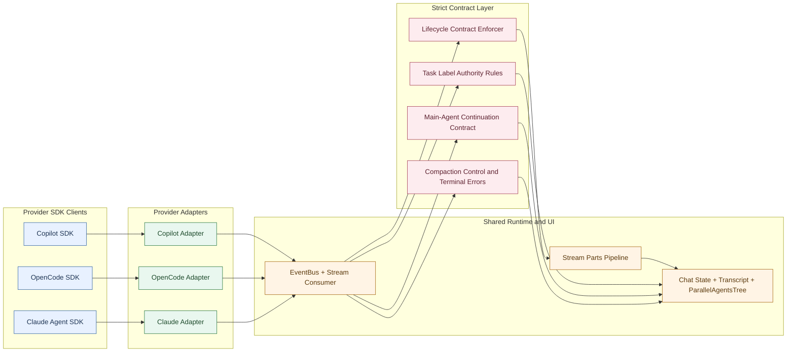

# Atomic CLI Cross-SDK UI Alignment Hardening - Technical Design Document / RFC

| Document Metadata      | Details            |
| ---------------------- | ------------------ |
| Author(s)              | lavaman131         |
| Status                 | Draft (WIP)        |
| Team / Owner           | Atomic CLI UI Team |
| Created / Last Updated | 2026-03-02         |

## 1. Executive Summary

Atomic CLI already has a strong shared UI architecture across Copilot, OpenCode, and Claude, but parity defects remain in sub-agent lifecycle rendering, `@agent` output propagation, task-label stability, and OpenCode compaction behavior. These defects are currently masked by permissive handling in several paths and lead to inconsistent UX, hidden root causes, and stuck turns.

This RFC removes those permissive paths and defines strict cross-SDK contracts: invalid lifecycle sequences become explicit contract violations, `@agent` results are always returned to the main agent for final user-facing output, descriptive task labels are authoritative, and compaction failures terminate the turn with explicit diagnostics instead of silent continuation.

The impact is deterministic behavior, lower debugging ambiguity, and reduced long-term tech debt by fixing error sources directly and prohibiting hidden compensating logic.

Research basis: `research/docs/2026-03-02-copilot-sdk-ui-alignment.md`

### 1.1 Normative Language

- `MUST`, `MUST NOT`, `REQUIRED`, and `SHALL` are strict requirements in this RFC.
- `SHOULD` is intentionally avoided in this document to prevent ambiguous implementation.

## 2. Context and Motivation

### 2.1 Current State

- Shared chat rendering is already provider-agnostic after adapter normalization (`parts` registry, transcript, model selector, task/status surfaces).
- Provider differences MUST remain limited to adapter ingress and command transport semantics.
- The architecture already standardizes around canonical `stream.*` bus contracts.

Research references:

- `research/docs/2026-03-02-copilot-sdk-ui-alignment.md:20`
- `research/docs/2026-03-02-copilot-sdk-ui-alignment.md:42`
- `research/docs/2026-03-02-copilot-sdk-ui-alignment.md:88`

### 2.2 The Problem

- **Lifecycle correctness gap:** OpenCode/Claude produce prolonged "Initializing" or missing rows when lifecycle sequencing is inconsistent.
- **Task-label integrity gap:** repeated starts and generic normalization overwrite meaningful task labels with low-value names.
- **`@agent` contract gap:** sub-agent output detaches from the main assistant response path.
- **Compaction control gap:** OpenCode compaction stalls active turns when summarize paths block lifecycle completion.

Research references:

- `research/docs/2026-03-02-copilot-sdk-ui-alignment.md:130`
- `research/docs/2026-03-02-copilot-sdk-ui-alignment.md:158`
- `research/docs/2026-03-02-copilot-sdk-ui-alignment.md:183`
- `research/docs/2026-03-02-copilot-sdk-ui-alignment.md:228`
- `research/docs/2026-03-02-copilot-sdk-ui-alignment.md:236`

## 3. Goals and Non-Goals

### 3.1 Functional Goals

- [ ] The system MUST enforce strict `stream.agent.start -> stream.agent.update* -> stream.agent.complete` ordering across all providers.
- [ ] The system MUST eliminate synthesized or compensating UI/runtime paths that hide lifecycle contract defects.
- [ ] The system MUST forward `@agent` results to the main-agent continuation path in all SDKs.
- [ ] The system MUST treat the first descriptive task label as authoritative and MUST reject generic overwrite regressions.
- [ ] OpenCode compaction MUST be bounded; timeout/error MUST terminate the turn with explicit diagnostics.
- [ ] The test suite MUST enforce parity regression coverage for strict contracts and failure semantics.

### 3.2 Non-Goals (Out of Scope)

- [ ] We MUST NOT redesign the shared event bus architecture.
- [ ] We MUST NOT create provider-specific UI forks to paper over correctness issues.
- [ ] We MUST NOT ship lenient mode, compatibility fallbacks, or silent compensating behavior.
- [ ] We MUST NOT change visual theme/language except where REQUIRED for explicit error states.
- [ ] We MUST NOT implement unrelated workflow/runtime features in this RFC.

## 4. Proposed Solution (High-Level Design)

### 4.1 System Architecture Diagram



### 4.2 Architectural Pattern

- The implementation MUST keep the shared adapter-normalization architecture.
- The implementation MUST replace permissive handling with strict contract enforcement and explicit error propagation.
- The implementation MUST fix root causes in SDK clients/adapters instead of compensating in UI state.
- The implementation MUST enforce a zero-compensation rule: invalid producer behavior fails loudly and is fixed at source.

Research references:

- `research/docs/2026-03-02-copilot-sdk-ui-alignment.md:42`
- `research/docs/2026-03-02-copilot-sdk-ui-alignment.md:89`
- `research/docs/2026-03-02-copilot-sdk-ui-alignment.md:236`

### 4.3 Key Components

| Component | Responsibility | Technology Stack | Justification |
| --- | --- | --- | --- |
| Lifecycle Contract Enforcer | Reject invalid agent lifecycle sequences and emit explicit contract violations | TypeScript, event consumer + chat state | Removes hidden error states and preserves invariant integrity |
| Task Label Authority Policy | Preserve first descriptive task text as canonical; only explicit user-command text MUST supersede | TypeScript normalization + reducer rules | Prevents silent regressions to generic labels |
| Main-Agent Continuation Contract | Always route completed sub-agent results back into main-agent continuation | TypeScript chat finalization + command dispatch | Matches Task-tool behavior and unifies provider UX |
| Compaction Control | Bound compaction operations and terminate turn on timeout/error with explicit diagnostic event | TypeScript SDK client + stream lifecycle | Stops indefinite stalls and exposes root failure directly |
| Parity Contract Test Matrix | Validate strict lifecycle, output propagation, label authority, and compaction termination semantics | Bun tests | Prevents reintroduction of compensating behavior |

## 5. Detailed Design

### 5.1 API Interfaces

**Canonical lifecycle events (contract strengthened):**

```ts
type StreamAgentStart = {
  type: "stream.agent.start";
  data: {
    agentId: string;
    parentAgentId?: string;
    task?: string;
    toolCallId: string;
    provider: "copilot" | "opencode" | "claude";
  };
};

type StreamAgentUpdate = {
  type: "stream.agent.update";
  data: {
    agentId: string;
    toolUses?: number;
    currentTool?: string;
    status?: "running" | "pending";
  };
};

type StreamAgentComplete = {
  type: "stream.agent.complete";
  data: {
    agentId: string;
    status: "completed" | "error" | "interrupted";
    result?: string;
  };
};
```

**New strict policy contracts:**

```ts
type AgentResultPropagationMode = "main-agent-continuation";

interface AgentResultPropagationPolicy {
  mode: AgentResultPropagationMode;
  apply(args: {
    isAgentInvocation: boolean;
    hasToolCalls: boolean;
    parallelAgents: Array<{ id: string; status: string; result?: string }>;
    messageContent: string;
  }): {
    continuationInput: string;
  };
}

interface AgentLifecycleContractPolicy {
  onMissingStart: "contract-violation-error";
  onOutOfOrderEvent: "contract-violation-error";
}

type StreamAgentContractViolation = {
  type: "stream.agent.contract_violation";
  data: {
    provider: "copilot" | "opencode" | "claude";
    sessionId: string;
    agentId?: string;
    code:
      | "MISSING_START"
      | "OUT_OF_ORDER_EVENT"
      | "MISSING_TOOL_CALL_ID"
      | "INVALID_TERMINAL_TRANSITION";
    message: string;
  };
};

interface CompactionFailurePolicy {
  maxCompactionWaitMs: number;
  onTimeout: "terminate-turn-with-error";
}
```

Research references:

- `research/docs/2026-03-02-copilot-sdk-ui-alignment.md:44`
- `research/docs/2026-03-02-copilot-sdk-ui-alignment.md:134`
- `research/docs/2026-03-02-copilot-sdk-ui-alignment.md:186`
- `research/docs/2026-03-02-copilot-sdk-ui-alignment.md:236`

### 5.2 Data Model / Schema

No external DB migration is REQUIRED.

| State Field | Type | Constraints | Description |
| --- | --- | --- | --- |
| `parallelAgents[].id` | `string` | Required | Stable row identity |
| `parallelAgents[].task` | `string` | Optional | Canonical descriptive task label |
| `parallelAgents[].toolUses` | `number` | `>= 0` | Execution progress |
| `parallelAgents[].currentTool` | `string` | Optional | Active tool indicator |
| `parallelAgents[].result` | `string` | Optional | Final result payload |
| `agentLifecycleLedger` | `Map<string, {started:boolean; completed:boolean; seq:number}>` | In-memory | Strict sequencing ledger |
| `toolCallToAgentMap` | `Map<string,string>` | In-memory | Deterministic completion attribution |
| `compactionControl` | `{state:string; startedAt:number}` | In-memory | Compaction operation state and timeout control |

**Task label authority rules:**

1. First descriptive non-generic label is canonical.
2. Generic labels (`sub-agent task`, `subagent task`, provider-type placeholders) cannot replace canonical labels.
3. Explicit user-command task text MUST replace inferred labels; inferred labels MUST NOT replace canonical descriptive labels.

Research references:

- `research/docs/2026-03-02-copilot-sdk-ui-alignment.md:159`
- `research/docs/2026-03-02-copilot-sdk-ui-alignment.md:161`
- `research/docs/2026-03-02-copilot-sdk-ui-alignment.md:162`

### 5.3 Algorithms and State Management

#### 5.3.1 Lifecycle Contract Enforcement

```text
On stream.agent.start:
  register agentId in lifecycle ledger with started=true

On stream.agent.update or stream.agent.complete:
  if agentId not started:
    emit stream.agent.contract_violation
    mark turn as terminal error
    stop processing this turn
  else:
    apply mutation

On stream.agent.complete:
  set completed=true in ledger
```

No synthesized rows are permitted. Missing starts are producer defects and MUST surface immediately as contract errors.

Research references:

- `research/docs/2026-03-02-copilot-sdk-ui-alignment.md:208`
- `research/docs/2026-03-02-copilot-sdk-ui-alignment.md:210`

#### 5.3.2 `@agent` Main-Agent Continuation Contract

```text
At completion of an @agent turn:
  collect completed sub-agent results in deterministic order
  build continuation input payload
  send payload to main agent continuation path
  main agent produces final detailed user-facing response
```

This requirement is mandatory across all SDKs and eliminates display-only behavior.

Research references:

- `research/docs/2026-03-02-copilot-sdk-ui-alignment.md:184`
- `research/docs/2026-03-02-copilot-sdk-ui-alignment.md:187`
- `research/docs/2026-03-02-copilot-sdk-ui-alignment.md:189`

#### 5.3.3 Compaction Control State Machine

State machine:

- `STREAMING` -> `COMPACTING` when compaction starts.
- `COMPACTING` -> `STREAMING` on successful summarize completion.
- `COMPACTING` -> `TERMINAL_ERROR` on timeout/error.
- `TERMINAL_ERROR` -> `ENDED` after explicit diagnostic emission and turn termination.

Failure contract:

- Compaction is bounded by timeout.
- On timeout/error, the turn ends with explicit error (`Compaction failed, please start a new chat.`).
- No retry, no hidden continuation, no silent handling, no automatic downgrade to warning.

Research references:

- `research/docs/2026-03-02-copilot-sdk-ui-alignment.md:229`
- `research/docs/2026-03-02-copilot-sdk-ui-alignment.md:231`
- `research/docs/2026-03-02-copilot-sdk-ui-alignment.md:233`

### 5.4 Invariant Matrix (Hard Requirements)

| Invariant ID | Invariant | Enforcement Point | Violation Outcome |
| --- | --- | --- | --- |
| `INV-AGENT-001` | Every `stream.agent.update` and `stream.agent.complete` MUST have a prior `stream.agent.start` for the same `agentId`. | Stream consumer lifecycle ledger | Emit `stream.agent.contract_violation` (`MISSING_START`), terminate turn |
| `INV-AGENT-002` | Every `stream.agent.start` MUST include `toolCallId`. | Provider adapter normalization | Emit `stream.agent.contract_violation` (`MISSING_TOOL_CALL_ID`), terminate turn |
| `INV-AGENT-003` | Terminal agent states MUST be monotonic (`completed/error/interrupted` cannot transition back to running). | Chat reducer transition guard | Emit `stream.agent.contract_violation` (`INVALID_TERMINAL_TRANSITION`), terminate turn |
| `INV-OUTPUT-001` | `@agent` turns MUST produce main-agent continuation input from completed sub-agent results. | Stream completion handler | Emit contract violation and terminate turn if continuation input is missing |
| `INV-COMPACT-001` | Compaction operation MUST complete before `maxCompactionWaitMs`. | SDK compaction controller | Emit terminal error with explicit message and end turn |

Prohibited behavior set:

- UI/runtime synthesis of missing lifecycle events is prohibited.
- Silent event drops are prohibited.
- Automatic retry loops for compaction timeout are prohibited.
- Warning-only handling for contract violations is prohibited.

## 6. Alternatives Considered

| Option | Pros | Cons | Reason for Rejection |
| --- | --- | --- | --- |
| Option A: Provider-by-provider UI patches | Fast local fixes | Behavior drifts and defects stay hidden | Rejected; does not remove root causes |
| Option B: Lifecycle synthesis and retries | Masks transient issues | Hides true contract defects and institutionalizes tech debt | Rejected by mandatory design rule (`MUST NOT hide producer defects`) |
| Option C: Strict contract enforcement (Selected) | Deterministic behavior, explicit failures, easier debugging | Requires adapter/client fixes where defects exist | Selected to remove debt and preserve integrity |
| Option D: Full rewrite | Potentially cleaner future architecture | High scope and risk | Rejected as unnecessary for current objectives |

## 7. Cross-Cutting Concerns

### 7.1 Security and Privacy

- No new authentication surfaces are introduced.
- Continuation payloads MUST obey existing redaction/safety constraints.
- Contract-violation telemetry MUST avoid leaking sensitive tool payloads.

Research references:

- `research/docs/2026-03-02-copilot-sdk-ui-alignment.md:47`
- `research/docs/2026-03-02-copilot-sdk-ui-alignment.md:193`

### 7.2 Observability Strategy

- Add strictness metrics:
  - `agent_lifecycle_contract_violation_total`
  - `agent_event_out_of_order_total`
  - `agent_result_main_continuation_total`
  - `compaction_timeout_terminated_total`
  - `turn_terminated_due_to_contract_error_total`
- Add structured diagnostics with provider/session/agent IDs for root-cause analysis.
- Every contract violation MUST emit structured diagnostics; violations MUST NEVER be downgraded to warnings.
- Keep existing user-facing status surfaces for operational transparency.

Research references:

- `research/docs/2026-03-02-copilot-sdk-ui-alignment.md:52`
- `research/docs/2026-03-02-copilot-sdk-ui-alignment.md:210`

### 7.3 Scalability and Capacity Planning

- Strict contract enforcement reduces hidden inconsistent state accumulation.
- Compaction timeout termination prevents indefinite resource locking on stuck turns.
- Added parity tests increase CI cost modestly but reduce production regressions.

Research references:

- `research/docs/2026-03-02-copilot-sdk-ui-alignment.md:233`
- `research/docs/2026-03-02-copilot-sdk-ui-alignment.md:234`

## 8. Migration, Rollout, and Testing

### 8.1 Deployment Strategy

- [ ] Phase 1: Implement adapter/client root-cause fixes so valid lifecycle ordering is guaranteed at source.
- [ ] Phase 2: Enable strict lifecycle contract enforcement and main-agent continuation contract for all providers.
- [ ] Phase 3: Enable bounded compaction control and terminal-error semantics; delete permissive legacy paths.

### 8.2 Data Migration Plan

- No persisted data migration required.
- Runtime additions: `agentLifecycleLedger`, `toolCallToAgentMap`, `compactionControl`.
- This is an intentional behavioral tightening; compatibility fallbacks are prohibited and MUST NOT be reintroduced.

### 8.3 Test Plan

- **Unit Tests:**
  - lifecycle updates/completions without prior start produce `contract_violation` terminal errors
  - first descriptive task label remains authoritative under repeated starts
  - `@agent` turns always generate main-agent continuation input
  - compaction timeout always terminates turn and emits explicit error

- **Integration Tests:**
  - provider matrix for valid lifecycle ordering and hard failure on invalid sequences
  - `@agent` prefix/autocomplete/natural-language paths all converge to main-agent continuation
  - OpenCode compaction timeout path emits deterministic terminal error and ends turn

- **End-to-End Tests:**
  - cross-provider delegated tasks show parity in lifecycle, labeling, and final user-facing responses
  - injected out-of-order lifecycle events are surfaced as explicit failures (not hidden)
  - compaction failure path shows clear message and requires new chat session

Research references:

- `research/docs/2026-03-02-copilot-sdk-ui-alignment.md:172`
- `research/docs/2026-03-02-copilot-sdk-ui-alignment.md:196`
- `research/docs/2026-03-02-copilot-sdk-ui-alignment.md:234`

### 8.4 Definition of Done (Release Gate)

The RFC is not implementation-complete until all gates pass:

- All invariants in Section 5.4 are enforced in runtime code paths.
- All invariant failures produce `stream.agent.contract_violation` diagnostics with provider/session context.
- No synthesized lifecycle rows remain in code or tests.
- `@agent` turns route through main-agent continuation in Copilot, OpenCode, and Claude integration tests.
- Compaction timeout path terminates turn deterministically and emits explicit user-facing error text.
- Existing tests that encoded permissive behavior are removed or rewritten to strict behavior.

## 9. Open Questions / Unresolved Issues

No unresolved questions remain for this draft.

- [x] **`@agent` output contract:** results are sent to main-agent continuation so the main agent returns final detailed output.
- [x] **Lifecycle handling:** no synthesized rows; missing/out-of-order lifecycle events are contract errors.
- [x] **Task label authority:** first descriptive label is canonical; generic replacements are rejected.
- [x] **Compaction timeout:** terminate turn with explicit error; no retry or compensating behavior.
