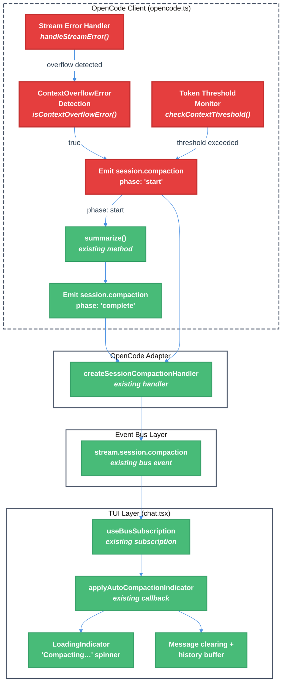

# OpenCode SDK Auto-Compaction Technical Design Document

| Document Metadata      | Details                              |
| ---------------------- | ------------------------------------ |
| Author(s)              | lavaman131                           |
| Status                 | Draft (WIP)                          |
| Team / Owner           | Atomic CLI                           |
| Created / Last Updated | 2026-03-01                           |

## 1. Executive Summary

The workflow-sdk's OpenCode integration lacks automatic context overflow detection and recovery. When a `ContextOverflowError` occurs during streaming, it is treated as a generic fatal error with no compaction recovery path. The Copilot SDK has full auto-compaction via `infiniteSessions` thresholds, and the Claude SDK has tool-name-based detection — but the OpenCode SDK only emits a `phase: "complete"` event after manual compaction, never a `phase: "start"`, and has zero overflow recovery logic.

This spec proposes implementing auto-compaction for the OpenCode SDK integration by: (1) adding `ContextOverflowError` detection and automatic `summarize()` recovery during streaming, (2) emitting synthetic `phase: "start"` events before compaction begins, (3) adding proactive token-threshold monitoring in direct chat mode (outside workflow graphs), and (4) wiring up the existing TUI auto-compaction indicator infrastructure that already handles spinner verbs, message clearing, and history buffer management.

The upstream OpenCode codebase already has a comprehensive auto-compaction system (`SessionCompaction.isOverflow()` → `SessionCompaction.create()` → `SessionCompaction.process()`), and the workflow-sdk's event bus and TUI layers already have full compaction UI support — the gap is entirely in the OpenCode client layer's error handling and event emission.

## 2. Context and Motivation

### 2.1 Current State

The workflow-sdk supports three coding agent backends: OpenCode, Claude Code, and Copilot CLI. Each has a different compaction story:

**Copilot SDK (Reference — Full Auto-Compaction):**
- Sessions are created with `infiniteSessions` config specifying `backgroundCompactionThreshold: 0.45` and `bufferExhaustionThreshold: 0.6` ([Ref: research §1, `copilot.ts:1116-1120`](../research/docs/2026-03-01-opencode-auto-compaction.md))
- SDK natively detects threshold breaches and emits both `session.compaction_start` and `session.compaction_complete` events
- Three-layer event translation: SDK events → unified `AgentEvent` → bus events → TUI indicator

**Claude SDK (Partial — Tool-Name Detection):**
- No SDK-native auto-compaction thresholds
- Compaction detected via tool-name pattern matching (`isAutoCompactionToolName()`) in the TUI layer
- Workflow graph uses `"recreate"` strategy (session recreation) rather than `"summarize"`

**OpenCode SDK (Gap — No Auto-Compaction):**
- `summarize()` method exists and calls `sdkClient.session.summarize()` ([Ref: research §3, `opencode.ts:2107-2145`](../research/docs/2026-03-01-opencode-auto-compaction.md))
- SSE `session.compacted` event mapped to `session.compaction` with `phase: "complete"` only ([Ref: research §3, `opencode.ts:987-996`](../research/docs/2026-03-01-opencode-auto-compaction.md))
- No `phase: "start"` emission anywhere in the OpenCode client
- No `ContextOverflowError` differentiation — all stream errors are generic fatal errors
- `contextMonitorNode` calls `summarize()` at 45% threshold, but **only in workflow mode** ([Ref: research §3, `nodes.ts:1263-1266`](../research/docs/2026-03-01-opencode-auto-compaction.md))

**Architecture Diagram — Current Event Flow:**

```
┌─────────────────────────────────────────────────────────────────┐
│                        SDK Layer                                │
│                                                                 │
│  Copilot SDK                Claude SDK              OpenCode SDK│
│  ├─ compaction_start ✅      ├─ tool detection ✅    ├─ SSE only │
│  └─ compaction_complete ✅   └─ (no SDK events)     │  ❌ start  │
│       │                           │                  │  ✅ complete│
│       ▼                           ▼                  ▼           │
│  ┌─────────┐               ┌─────────┐         ┌──────────┐    │
│  │copilot.ts│               │claude.ts │         │opencode.ts│   │
│  │ maps both│               │ no event │         │ maps only │   │
│  │ start +  │               │ emission │         │ "complete"│   │
│  │ complete │               │          │         │ hard-codes│   │
│  └────┬─────┘               └──────────┘         │ success=  │   │
│       │                                          │ true      │   │
│       │                                          └─────┬─────┘   │
└───────┼────────────────────────────────────────────────┼─────────┘
        │                                                │
        ▼                                                ▼
┌──────────────────────────────────────────────────────────────────┐
│                     Event Bus Layer                               │
│  BusEventType: "stream.session.compaction"                       │
│  Data: { phase: "start" | "complete", success?, error? }         │
│  ⚠️ OpenCode only ever emits phase: "complete"                   │
└──────────────────────────┬───────────────────────────────────────┘
                           │
                           ▼
┌──────────────────────────────────────────────────────────────────┐
│                        TUI Layer                                  │
│  useBusSubscription("stream.session.compaction")                  │
│  ├─ phase: "start"  → "Compacting" spinner  (never fires for OC) │
│  └─ phase: "complete" → clear messages, fresh state               │
│                                                                   │
│  Tool-name detection (handleToolStart/handleToolComplete)         │
│  └─ isAutoCompactionToolName() (never fires for OC tools)         │
└──────────────────────────────────────────────────────────────────┘
```

### 2.2 The Problem

- **User Impact:** When an OpenCode session hits the context window limit during direct chat (non-workflow mode), the user sees a cryptic `ContextOverflowError` and the session becomes unusable. No recovery is attempted, no compaction spinner is shown, and the user must manually restart.
- **Parity Gap:** Copilot sessions handle this transparently — the user sees a "Compacting…" spinner, messages are cleared, and the conversation continues seamlessly. OpenCode users get a fundamentally worse experience.
- **Technical Debt:** The TUI already has full auto-compaction UI support (`applyAutoCompactionIndicator()`, spinner verb overrides, message clearing, history buffer management). The event bus already defines `stream.session.compaction`. The adapter already subscribes to `session.compaction` events. The only missing piece is the OpenCode client's failure to detect overflow and emit the right events. ([Ref: research §5, `chat.tsx:2314-2361, 3181-3196`](../research/docs/2026-03-01-opencode-auto-compaction.md))
- **Workflow-Only Workaround:** The `contextMonitorNode` in the workflow graph layer calls `summarize()` for OpenCode at 45% threshold, but this only works when using workflow graphs — direct chat sessions have no compaction safety net. ([Ref: research §3, `nodes.ts:1263-1274`](../research/docs/2026-03-01-opencode-auto-compaction.md))

## 3. Goals and Non-Goals

### 3.1 Functional Goals

- [ ] **G1:** Detect `ContextOverflowError` during OpenCode streaming and automatically trigger `summarize()` recovery instead of treating it as a fatal error
- [ ] **G2:** Emit synthetic `session.compaction` events with `phase: "start"` before compaction begins and `phase: "complete"` after, so the existing TUI infrastructure displays the "Compacting…" spinner and clears messages on completion
- [ ] **G3:** Add proactive token-threshold monitoring in the OpenCode client for direct chat mode, triggering auto-compaction before the context window is exhausted (matching the 45% threshold used in workflow mode)
- [ ] **G4:** Wire up the TUI auto-compaction indicator for OpenCode sessions so users see the same "Compacting…" spinner, message clearing, and compaction summary as Copilot sessions
- [ ] **G5:** Ensure post-compaction token counts are refreshed and the session continues seamlessly with the compacted context
- [ ] **G6:** Wire `session.truncation` event emission in the OpenCode client by detecting token count changes during compaction, so the existing adapter subscription begins receiving truncation data

### 3.2 Non-Goals (Out of Scope)

- [ ] We will NOT implement tool output pruning (`SessionCompaction.prune()`) from the upstream OpenCode — the upstream server handles this natively
- [ ] We will NOT modify the Copilot or Claude compaction flows — they are working as designed
- [ ] We will NOT build custom compaction prompts — the upstream OpenCode SDK's `session.summarize()` API handles the LLM summarization internally
- [ ] We will NOT add `infiniteSessions`-style configuration to the OpenCode client — the upstream SDK does not support this API surface

## 4. Proposed Solution (High-Level Design)

### 4.1 System Architecture Diagram



**Legend:** 🟢 Green = existing code (no changes needed) | 🔴 Red = new code | 🟠 Orange = bridge/glue code

### 4.2 Architectural Pattern

We are adopting a **detect-emit-react** pattern where:
1. **Detect:** The OpenCode client detects context overflow (reactive: error parsing) and threshold breaches (proactive: token monitoring)
2. **Emit:** The client emits unified `session.compaction` events with both `phase: "start"` and `phase: "complete"`, matching the Copilot SDK's dual-phase lifecycle
3. **React:** The existing event bus → adapter → TUI pipeline handles visual feedback and session state management without any changes

This maximizes reuse of existing infrastructure — the only new code is in the OpenCode client layer.

### 4.3 Key Components

| Component | Responsibility | Location | Status |
| --- | --- | --- | --- |
| `isContextOverflowError()` | Parse stream errors for context overflow patterns | `src/sdk/clients/opencode.ts` | **New** |
| Overflow recovery in stream handler | Catch overflow errors, trigger compaction, retry | `src/sdk/clients/opencode.ts` | **New** |
| Synthetic `phase: "start"` emission | Emit start event before `summarize()` call | `src/sdk/clients/opencode.ts` | **New** |
| Token threshold monitor | Proactive check after each assistant message | `src/sdk/clients/opencode.ts` | **New** |
| `summarize()` | Call upstream SDK compaction API | `src/sdk/clients/opencode.ts` | **Existing** |
| `session.compaction` → bus event | Adapter subscription and bus publishing | `src/events/adapters/opencode-adapter.ts` | **Existing** |
| `stream.session.compaction` bus event | Event schema and Zod validation | `src/events/bus-events.ts` | **Existing** |
| `applyAutoCompactionIndicator()` | TUI spinner, message clearing, history buffer | `src/ui/chat.tsx` | **Existing** |
| `AutoCompactionIndicatorState` | State machine for compaction UI lifecycle | `src/ui/utils/auto-compaction-lifecycle.ts` | **Existing** |
| `session.truncation` emission | Emit truncation data from pre/post token comparison | `src/sdk/clients/opencode.ts` | **New** |

## 5. Detailed Design

### 5.1 Context Overflow Error Detection

**File:** `src/sdk/clients/opencode.ts`

Add a helper function to detect `ContextOverflowError` from stream error messages, modeled after the upstream OpenCode's `ProviderError.isOverflow()` which matches 14+ provider error patterns ([Ref: research §4, `error.ts:8-41`](../research/docs/2026-03-01-opencode-auto-compaction.md)).

```typescript
/**
 * Detects context overflow errors from OpenCode stream error messages.
 * Modeled after upstream OpenCode's ProviderError.isOverflow() patterns.
 */
function isContextOverflowError(error: Error | string): boolean {
  const message = typeof error === "string" ? error : error.message;
  const lowerMessage = message.toLowerCase();

  const overflowPatterns = [
    "context_length_exceeded",
    "contextoverflowerror",
    "context window",
    "maximum context length",
    "input is too long",
    "exceeds the model's maximum context",
    "token limit",
    "too many tokens",
    "request too large",
    "prompt is too long",
  ];

  return overflowPatterns.some((pattern) => lowerMessage.includes(pattern));
}
```

### 5.2 Stream Error Recovery with Auto-Compaction

**File:** `src/sdk/clients/opencode.ts`

Modify the stream error handling path (currently at lines ~1995-2001) to differentiate `ContextOverflowError` from other fatal errors:

```typescript
// In the streaming error handler (SSE session.error or stream catch block)
if (isContextOverflowError(error)) {
  // 1. Emit phase: "start" before compaction begins
  this.emitEvent("session.compaction", sessionID, { phase: "start" });

  try {
    // 2. Call the existing summarize() method
    await session.summarize();

    // 3. Emit phase: "complete" with success
    // Note: The SSE session.compacted event will also fire,
    // but we emit eagerly here for faster TUI feedback
    this.emitEvent("session.compaction", sessionID, {
      phase: "complete",
      success: true,
    });

    // 4. Resume the conversation by re-sending or signaling continuation
    // Emit idle with compaction reason so the session can continue
    this.emitEvent("session.idle", sessionID, {
      reason: "context_compacted",
    });
  } catch (compactionError) {
    // 5. Emit phase: "complete" with failure
    this.emitEvent("session.compaction", sessionID, {
      phase: "complete",
      success: false,
      error:
        compactionError instanceof Error
          ? compactionError.message
          : String(compactionError),
    });

    // 6. Fall through to original error handling — compaction failed
    throw error;
  }

  // 7. Auto-continue with synthetic "Continue" message
  // (matches upstream OpenCode behavior)
  await session.send("Continue");

  return; // Successfully compacted — don't propagate original overflow error
}

// Original error handling for non-overflow errors continues below
```

### 5.3 Proactive Token Threshold Monitoring

**File:** `src/sdk/clients/opencode.ts`

Add proactive threshold checking after each assistant message update. This mirrors the workflow graph's `contextMonitorNode` behavior (45% threshold) but works in direct chat mode.

```typescript
// Constants — match workflow graph thresholds
const AUTO_COMPACTION_THRESHOLD = 0.45; // 45% of context window
const MAX_AUTO_COMPACTION_RETRIES = 0;

/**
 * Check context usage after token count updates and trigger
 * auto-compaction if threshold is exceeded.
 * Called after processing assistant message token updates.
 */
async function checkAndTriggerAutoCompaction(
  sessionState: SessionState,
  session: Session,
  sessionID: string,
  emitEvent: EventEmitter,
): Promise<boolean> {
  try {
    const usage = await session.getContextUsage();

    if (usage.usagePercentage < AUTO_COMPACTION_THRESHOLD * 100) {
      return false; // Below threshold
    }

    // Emit start event
    emitEvent("session.compaction", sessionID, { phase: "start" });

    // Trigger compaction
    await session.summarize();

    // Emit complete event (SSE session.compacted will also fire)
    emitEvent("session.compaction", sessionID, {
      phase: "complete",
      success: true,
    });

    return true;
  } catch (error) {
    // Emit failure
    emitEvent("session.compaction", sessionID, {
      phase: "complete",
      success: false,
      error: error instanceof Error ? error.message : String(error),
    });
    return false;
  }
}
```

**Integration point:** Call `checkAndTriggerAutoCompaction()` in the SSE event handler after processing `message.updated` events that update token counts (around lines ~1007-1016 in the current code).

### 5.4 Synthetic `phase: "start"` Emission in `summarize()`

**File:** `src/sdk/clients/opencode.ts`

Modify the existing `summarize()` method to emit `phase: "start"` before calling the upstream SDK:

```typescript
summarize: async (): Promise<void> => {
  if (state.isClosed) throw new Error("Session is closed");

  // NEW: Emit phase: "start" before compaction begins
  client.emitEvent("session.compaction", sessionID, { phase: "start" });

  try {
    await client.sdkClient.session.summarize({
      sessionID,
      directory: client.directory,
    });

    // Existing: Post-compaction token refresh
    try {
      const messages = await client.sdkClient.session.messages({ sessionID });
      // ... existing token refresh logic ...
    } catch {
      // Silent catch — existing behavior
    }

    // Existing: Emit idle with compaction reason
    client.emitEvent("session.idle", sessionID, {
      reason: "context_compacted",
    });
  } catch (error) {
    // NEW: Emit phase: "complete" with failure on error
    client.emitEvent("session.compaction", sessionID, {
      phase: "complete",
      success: false,
      error: error instanceof Error ? error.message : String(error),
    });
    throw error;
  }
},
```

**Note:** The `phase: "complete"` with `success: true` is already handled by the SSE `session.compacted` event mapping at lines 987-996. The synthetic `phase: "start"` fills the gap so the TUI shows the "Compacting…" spinner immediately when compaction begins. ([Ref: research §3, gap #1](../research/docs/2026-03-01-opencode-auto-compaction.md))

### 5.6 `session.truncation` Event Wiring

**File:** `src/sdk/clients/opencode.ts`

The OpenCode adapter already subscribes to `session.truncation` events (`opencode-adapter.ts:286-291`), but the client never emits them. Add truncation event emission in the `summarize()` method by comparing pre/post-compaction token counts:

```typescript
// In summarize(), after the post-compaction token refresh:
const preCompactionTokens = sessionState.inputTokens + sessionState.outputTokens;

// ... existing token refresh from session.messages() ...

const postCompactionTokens = newInputTokens + newOutputTokens;
const tokensRemoved = preCompactionTokens - postCompactionTokens;

if (tokensRemoved > 0) {
  client.emitEvent("session.truncation", sessionID, {
    tokenLimit: sessionState.contextWindow ?? 0,
    tokensRemoved,
    messagesRemoved: 0, // Not precisely trackable from token counts alone
  });
}
```

This enables the existing adapter subscription to fire, and the `stream.session.truncation` bus event will be published with truncation details. The TUI can optionally display this information (e.g., "X tokens removed during compaction").

### 5.7 Deduplication of `phase: "complete"` Events

Since both the `summarize()` method's SSE handler and the auto-compaction recovery could emit `phase: "complete"`, the TUI's `applyAutoCompactionIndicator()` already handles this gracefully — transitioning from `"running"` to `"completed"` is idempotent in the state machine (`auto-compaction-lifecycle.ts`). No deduplication logic is needed.

However, to prevent double-emission from `summarize()` + SSE, the stream error recovery path (§5.2) should set a flag that prevents the SSE `session.compacted` handler from emitting a duplicate:

```typescript
// In the session state
let pendingCompactionComplete = false;

// In the recovery path (§5.2), after calling summarize():
pendingCompactionComplete = true;

// In handleSdkEvent, case "session.compacted":
if (!pendingCompactionComplete) {
  this.emitEvent("session.compaction", sessionID, {
    phase: "complete",
    success: true,
  });
} else {
  pendingCompactionComplete = false;
}
```

### 5.8 Data Flow — Complete Auto-Compaction Lifecycle

```
1. [Trigger] ContextOverflowError during streaming
       OR token threshold exceeded (45%) after assistant message
                │
2. [Detect]    isContextOverflowError(error) returns true
       OR      getContextUsage().usagePercentage >= 45
                │
3. [Emit]      emitEvent("session.compaction", sessionID, { phase: "start" })
                │
4. [Compact]   session.summarize()
                │  ├── sdkClient.session.summarize({ sessionID, directory })
                │  ├── Post-compaction: session.messages() → refresh token counts
                │  └── emitEvent("session.idle", { reason: "context_compacted" })
                │
5. [SSE]       OpenCode server emits "session.compacted" SSE event
                │
6. [Map]       handleSdkEvent() → emitEvent("session.compaction", { phase: "complete", success: true })
                │
7. [Adapt]     opencode-adapter.ts: createSessionCompactionHandler()
                │  → publishes BusEvent("stream.session.compaction", { phase, success })
                │
8. [Bus]       EventBus delivers "stream.session.compaction" to subscribers
                │
9. [TUI]       useBusSubscription("stream.session.compaction"):
                │  ├── phase: "start"  → applyAutoCompactionIndicator({ status: "running" })
                │  │    └── Spinner verb → "Compacting", isAutoCompacting = true
                │  └── phase: "complete" → applyAutoCompactionIndicator({ status: "completed" })
                │       ├── Clear history buffer
                │       ├── Append compaction summary
                │       ├── Replace all messages with fresh streaming message
                │       └── isAutoCompacting = false
                │
10. [Continue]  Client sends synthetic "Continue" message → session resumes with compacted context
```

## 6. Alternatives Considered

| Option | Pros | Cons | Reason for Rejection |
| --- | --- | --- | --- |
| **A: Client-side overflow detection only (reactive)** | Simple — just catch `ContextOverflowError` and call `summarize()` | No prevention — user experiences a brief error/interruption before recovery; compaction only triggers after failure | Insufficient — proactive monitoring is also needed for smooth UX |
| **B: Workflow graph only (current state for workflow mode)** | Already implemented via `contextMonitorNode` at 45% threshold | Only works in workflow mode; direct chat sessions have zero coverage | **Current gap** — this is the problem we're solving |
| **C: SDK-native `infiniteSessions` config (Copilot pattern)** | Cleanest — delegate entirely to upstream SDK | OpenCode SDK does not expose `infiniteSessions` API; would require upstream SDK changes | Not feasible without upstream SDK changes |
| **D: Client-side proactive + reactive (Selected)** | Full coverage: prevents overflow proactively, recovers from overflow reactively; reuses all existing TUI infrastructure | Adds complexity to OpenCode client; synthetic `phase: "start"` events are not from the SDK | **Selected:** Best UX with maximum infrastructure reuse; handles both prevention and recovery |

## 7. Cross-Cutting Concerns

### 7.1 Error Handling

- **Compaction failure:** If `summarize()` fails during auto-compaction recovery, emit `phase: "complete"` with `success: false` and fall through to the original error handling. The TUI will show the error state for `AUTO_COMPACTION_RESULT_VISIBILITY_MS` (4 seconds) and revert the spinner.
- **Token refresh failure:** Already handled — `summarize()` silently catches `session.messages()` errors (existing behavior at `opencode.ts:2137`).
- **Re-entrancy guard:** Prevent concurrent compaction attempts by checking `isAutoCompacting` state or a session-level `isCompacting` flag before triggering.

### 7.2 Observability

- **Event emission:** All compaction lifecycle events flow through the existing event bus, which provides built-in logging and tracing via the adapter layer.
- **Debug logging:** The existing `summarize()` method should add debug-level logging for auto-compaction triggers (threshold value, token counts, overflow error message).

### 7.3 Edge Cases

- **Rapid consecutive overflows:** If compaction doesn't reduce context enough and a second overflow occurs immediately, the error propagates as-is (`MAX_AUTO_COMPACTION_RETRIES = 0`). A session-level `hasAutoCompacted` flag prevents repeated compaction attempts within the same stream.
- **User abort during compaction:** The existing `stopSharedStreamState()` in `chat.tsx:2400-2405` already clears orphaned `"running"` compaction indicators back to `"idle"`.
- **Workflow mode interaction:** The proactive threshold monitor runs at the client level, applying to both direct chat and workflow modes. The existing `contextMonitorNode` in workflow mode should be updated to defer to the client-level monitor (e.g., by checking if auto-compaction already triggered) to avoid double-compaction.
- **Duplicate SSE events:** The deduplication flag (§5.5) prevents the SSE `session.compacted` handler from emitting a second `phase: "complete"` when the recovery path already emitted one.

## 8. Migration, Rollout, and Testing

### 8.1 Deployment Strategy

- [ ] **Phase 1:** Implement reactive overflow detection and recovery (§5.1, §5.2). This is the critical path — it turns fatal errors into recoverable compaction events.
- [ ] **Phase 2:** Add synthetic `phase: "start"` emission to `summarize()` (§5.4). This enables the "Compacting…" spinner for manual `/compact` commands in addition to auto-recovery.
- [ ] **Phase 3:** Implement proactive token threshold monitoring (§5.3). This prevents overflow errors from occurring in the first place.
- [ ] **Phase 4:** Add deduplication guard (§5.7) and edge case handling (re-entrancy, auto-continue with synthetic "Continue" message).
- [ ] **Phase 5:** Wire `session.truncation` event emission (§5.6) to provide truncation details during compaction.

### 8.2 Test Plan

- **Unit Tests:**
  - `isContextOverflowError()` — test against all pattern strings (positive and negative cases)
  - Deduplication flag behavior — verify SSE handler respects `pendingCompactionComplete`
  - Token threshold calculation — verify `checkAndTriggerAutoCompaction()` triggers at correct percentage

- **Integration Tests:**
  - Simulate `ContextOverflowError` during streaming → verify `summarize()` is called and `session.compaction` events are emitted in correct order (`start` → `complete`)
  - Verify TUI receives bus events and shows "Compacting…" spinner
  - Verify messages are cleared and history buffer updated after successful compaction
  - Verify failed compaction emits `success: false` and falls through to error display

- **End-to-End Tests:**
  - Run a long OpenCode conversation that exceeds context limits → verify auto-compaction triggers and conversation continues
  - Verify `/compact` command shows "Compacting…" spinner (currently it does not show `phase: "start"`)
  - Verify `Ctrl+O` history view shows compaction summary after auto-compaction

## 9. Resolved Questions

- [x] **Q1: Stream continuation after compaction** — **Decision: Auto-continue with synthetic "Continue" message**, matching upstream OpenCode behavior. After auto-compaction recovers from a `ContextOverflowError`, the client will automatically send a synthetic "Continue" user message to resume the conversation seamlessly. The user should not need to re-type their message or manually trigger continuation.

- [x] **Q2: Threshold monitoring scope** — **Decision: Implement compaction once at the client level, applying to both direct chat and workflow modes.** The proactive token threshold monitor will run in the OpenCode client itself, providing coverage for both direct chat and workflow modes from a single implementation. This avoids duplicating compaction logic between the client and workflow graph layers. The existing `contextMonitorNode` in workflow mode may need to be adjusted to defer to the client-level monitor to prevent double-compaction.

- [x] **Q3: Compaction retry limit** — **Decision: 0 retries — fail immediately if first compaction doesn't help.** If a `ContextOverflowError` occurs and auto-compaction is triggered but doesn't sufficiently reduce context, the error will propagate as-is on the next occurrence. This prevents infinite compaction loops and surfaces genuinely unrecoverable situations to the user. Set `MAX_AUTO_COMPACTION_RETRIES = 0`.

- [x] **Q4: Tool output pruning** — **Decision: No client-side pruning — upstream server handles it via `session.summarize()`.** The upstream OpenCode's `prune()` mechanism operates server-side as part of the compaction pipeline. The workflow-sdk will rely entirely on the upstream SDK's `session.summarize()` API, which internally handles tool output pruning.

- [x] **Q5: `session.truncation` wiring** — **Decision: Include in this spec.** The `session.truncation` event will be wired as part of this compaction work. The OpenCode client will emit `session.truncation` events when token counts indicate messages were truncated during compaction (detectable by comparing pre/post-compaction token counts from the `session.messages()` refresh). The existing adapter subscription at `opencode-adapter.ts:286-291` will begin receiving events, and the TUI can display truncation information.
