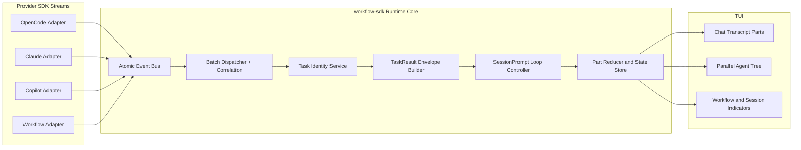

# Workflow-SDK OpenCode Task/Subtask Streaming Parity Technical Design Document / RFC

| Document Metadata      | Details         |
| ---------------------- | --------------- |
| Author(s)              | lavaman131      |
| Status                 | Draft (WIP)     |
| Team / Owner           | lavaman131/atomic |
| Created / Last Updated | 2026-03-01      |

## 1. Executive Summary

`workflow-sdk` already has a strong event-driven streaming pipeline, but child task output is still primarily reconciled in UI state instead of being represented as a canonical parent-loop contract. OpenCode treats `task`/subtask execution as a first-class runtime behavior (`task_id` + `<task_result>`), persists tool output into message parts, and continues generation based on explicit loop semantics; this gives it predictable behavior across long, nested tool/task chains. (Ref: `research/docs/2026-03-01-opencode-delegation-streaming-parity.md:20`, `/home/alilavaee/Documents/projects/opencode/packages/opencode/src/tool/task.ts:147`, `/home/alilavaee/Documents/projects/opencode/packages/opencode/src/session/prompt.ts:319`)

This RFC proposes an OpenCode-aligned Task/Subtask Runtime Contract for `workflow-sdk` that introduces a canonical `task_id` identity, `task`-tool-compatible input/output contracts, standardized task-result envelope, finish-reason-aware session loop continuation, and complete stream event mapping into renderable parts.

The impact is improved cross-provider parity (OpenCode/Claude/Copilot), fewer dropped task/workflow events, better determinism in continuation behavior, and cleaner boundaries between runtime semantics and UI rendering.

## 2. Context and Motivation

### 2.1 Current State

- `workflow-sdk` streaming currently flows as adapters -> event bus -> batch dispatcher -> correlation service -> stream part reducer -> UI rendering. (Ref: `research/docs/2026-03-01-opencode-delegation-streaming-parity.md:40`, `src/events/consumers/wire-consumers.ts:7`)
- Sub-agent execution is supported (including parallel/background orchestration), and adapter/client correlation maps child sessions in some provider paths. (Ref: `research/docs/2026-03-01-opencode-delegation-streaming-parity.md:42`, `src/sdk/clients/opencode.ts:484`, `src/ui/chat.tsx:4552`)
- Parent reconciliation currently aggregates child task outputs into UI message content/parts in `chat.tsx`, which works visually but is not the same as OpenCode's canonical parent-loop tool-result ingestion contract. (Ref: `research/docs/2026-03-01-opencode-delegation-streaming-parity.md:43`, `src/ui/chat.tsx:3906`)
- Event architecture includes broad typed events, but historical gap analysis documented emitted events that were not consumed or mapped to renderable parts, especially workflow/session lifecycle subsets. (Ref: `research/docs/2026-03-01-opencode-delegation-streaming-parity.md:70`, `research/docs/2026-02-28-workflow-gaps-architecture.md:343`)

### 2.2 The Problem

- **Parity gap in task/subtask contract:** No single provider-agnostic `task_id` equivalent exists across adapters, making resume/reconciliation behavior fragmented by provider-specific IDs. (Ref: `research/docs/2026-03-01-opencode-delegation-streaming-parity.md:51`)
- **Parity gap in parent-loop semantics:** Continuation is mostly guard/status-driven in UI logic, not explicitly finish-reason (`tool-calls`) driven with canonical tool-result rehydration semantics. (Ref: `research/docs/2026-03-01-opencode-delegation-streaming-parity.md:64`, `src/ui/utils/stream-continuation.ts:9`)
- **Event completeness gap:** Some emitted lifecycle/workflow events do not consistently map into part state, causing silent drops and inconsistent transcript fidelity. (Ref: `research/docs/2026-03-01-opencode-delegation-streaming-parity.md:68`, `research/docs/2026-02-28-workflow-gaps-architecture.md:320`)
- **Architectural coupling risk:** Task/subtask semantics are currently split between adapters and UI merge code, making behavior harder to test deterministically at runtime-core boundaries.

## 3. Goals and Non-Goals

### 3.1 Functional Goals

- [ ] Introduce a provider-agnostic canonical task/subtask identity (`task_id`) that maps provider IDs (`tool_use_id`, `toolCallId`, `subagentId`, child session IDs) into one runtime key.
- [ ] Define a canonical task-result envelope contract equivalent to OpenCode's `task_id` + `<task_result>` semantics for parent-loop ingestion.
- [ ] Mirror OpenCode `task` tool parameter/output contract (`description`, `prompt`, `subagent_type`, optional `task_id`, optional `command`, plus output metadata carrying child `sessionId` + model).
- [ ] Add finish-reason-aware parent continuation that consumes persisted tool/task results, not only UI-level stream status guards.
- [ ] Ensure all task/subtask-relevant stream events are either rendered or explicitly marked non-rendered by policy (no accidental drops).
- [ ] Preserve existing UX behaviors (parallel/background agent tree, inline tool streaming) while moving canonical semantics into runtime-core.
- [ ] Add comprehensive tests for identity mapping, envelope generation, continuation gates, and event completeness.

### 3.2 Non-Goals (Out of Scope)

- [ ] Will NOT re-architect transport to networked SSE for `workflow-sdk`; this RFC is runtime contract and reconciliation parity, not transport migration.
- [ ] Will NOT replace existing event-bus/batch-dispatcher foundations.
- [ ] Will NOT remove provider-specific IDs from adapters; they remain available as raw metadata and debugging context.
- [ ] Will NOT redesign the TUI visual language in this RFC.
- [ ] Will NOT change external CLI command surface for users in this phase.

## 4. Proposed Solution (High-Level Design)

### 4.1 System Architecture Diagram



### 4.2 Architectural Pattern

- **Pattern:** Event-driven runtime with canonical task/subtask contract + deterministic turn-loop continuation.
- **Core principle:** UI renders normalized runtime state; runtime state does not depend on ad-hoc UI merge logic for task/subtask semantics.

### 4.3 Key Components

| Component | Responsibility | Technology Stack | Justification |
| --- | --- | --- | --- |
| Task Identity Service | Resolve canonical `task_id` from provider-specific identifiers | TypeScript (`src/events/consumers` or new `src/runtime/task`) | Eliminates provider-fragmented correlation and enables resumable contract parity. |
| TaskResult Envelope Builder | Produce normalized task result payload (`task_id` + `<task_result>` equivalent) and attach to message/tool history | TypeScript + existing part model | Matches OpenCode parent ingestion semantics while preserving local architecture. |
| Session Loop Controller | Decide continuation based on finish reason + pending tool/task state | TypeScript runtime service invoked from chat/session orchestration | Replaces brittle UI-only continuation heuristics with explicit semantics and aligns to OpenCode `SessionPrompt` loop behavior. |
| Event Coverage Policy + Mapper | Map all relevant stream/workflow/session events to part events or explicit non-rendered policy | `stream-pipeline-consumer.ts`, `bus-events.ts`, reducer types | Prevents silent event loss and improves transcript fidelity and debuggability. |

### 4.4 OpenCode Compatibility Invariants

The following behaviors are treated as source-of-truth parity targets and should remain semantically compatible with OpenCode:

1. **Task tool contract parity**
   - Input shape: `description`, `prompt`, `subagent_type`, optional `task_id`, optional `command`.
   - Resume behavior: if `task_id` exists and resolves, continue existing child session; else create a new child session.
   - Reference: `/home/alilavaee/Documents/projects/opencode/packages/opencode/src/tool/task.ts:14`.

2. **Child session linkage parity**
   - New task sessions are created with explicit parent linkage (`parentID = parent session`).
   - Reference: `/home/alilavaee/Documents/projects/opencode/packages/opencode/src/tool/task.ts:73`.

3. **Task output envelope parity**
   - Canonical output format starts with `task_id: ...`, then wraps task output in `<task_result>...</task_result>`.
   - Reference: `/home/alilavaee/Documents/projects/opencode/packages/opencode/src/tool/task.ts:147`.

4. **Parent loop continuation parity**
   - Parent loop continues when finish reason is `tool-calls` or `unknown`; exits for other terminal reasons once assistant follows the last user turn.
   - Reference: `/home/alilavaee/Documents/projects/opencode/packages/opencode/src/session/prompt.ts:319`.

5. **Message-part reconciliation parity**
   - Runtime emits and consumes message-part lifecycle events (`message.part.updated`, `message.part.delta`) as first-class reconciliation signals.
   - Tool parts are persisted then transformed into model messages via `toModelMessages`/`convertToModelMessages`, not ad-hoc ephemeral-only UI state.
   - Reference: `/home/alilavaee/Documents/projects/opencode/packages/opencode/src/session/message-v2.ts:459`, `/home/alilavaee/Documents/projects/opencode/packages/opencode/src/session/message-v2.ts:491`.

6. **Event stream envelope parity**
   - Global bus envelopes include `{ directory, payload }` where payload keeps OpenCode shape `{ type, properties }`, and transport event updates are delivered as stream events.
   - Reference: `/home/alilavaee/Documents/projects/opencode/packages/opencode/src/bus/index.ts:59`, `/home/alilavaee/Documents/projects/opencode/packages/opencode/src/server/routes/global.ts:71`.

7. **Tool part state parity**
   - Task/subtask lifecycle reconciles through OpenCode-compatible tool states (`pending`, `running`, `completed`, `error`) and preserves the no-dangling-tool-result invariant when reconstructing model input.
   - Reference: `/home/alilavaee/Documents/projects/opencode/packages/opencode/src/session/message-v2.ts:617`.

## 5. Detailed Design

### 5.1 API Interfaces

This RFC introduces internal runtime contracts (TypeScript interfaces), not new public HTTP APIs.

```ts
export interface TaskSessionIdentity {
  task_id: string;                 // Canonical runtime key (OpenCode parity)
  provider: "opencode" | "claude" | "copilot";
  providerToolId?: string;         // tool_use_id, toolCallId, etc.
  providerSubagentId?: string;
  childSessionId?: string;
  parentSessionId: string;
}

export interface TaskResultEnvelope {
  task_id: string;                 // parity handle
  tool_name: string;               // usually task/subagent equivalent
  title: string;                   // OpenCode task result title/description
  metadata: {
    sessionId: string;
    model?: { providerID: string; modelID: string };
  };
  status: "completed" | "error";
  output_text: string;             // canonical task/subtask output text
  output_structured?: Record<string, unknown>;
  error?: string;
}

export interface TaskToolCompatibleInput {
  description: string;
  prompt: string;
  subagent_type: string;
  task_id?: string;
  command?: string;
}

export interface SessionLoopContinuationSignal {
  finishReason: "tool-calls" | "stop" | "length" | "error" | "unknown";
  pendingToolCalls: number;
  pendingTasks: number;
  shouldContinue: boolean;
}
```

Proposed canonical text envelope format in persisted history (OpenCode parity shape):

```xml
task_id: <task_id> (for resuming to continue this task if needed)

<task_result>
...normalized task output...
</task_result>
```

This format is intended for runtime/model-history compatibility and traceability, while UI can still render richer structured parts.

### 5.2 Data Model / Schema

#### Runtime state additions

```ts
interface TaskRuntimeState {
  byTaskId: Map<string, TaskSessionIdentity>;
  byProviderId: Map<string, string>; // providerId -> task_id
  pendingTasks: Set<string>;         // values are task_id
  toolCallIdToTaskId: Map<string, string>;
  completedEnvelopes: Map<string, TaskResultEnvelope>;
}
```

#### Message part additions

- Add `TaskResultPart` to `src/ui/parts/types.ts` to persist canonical task/subtask outcome in transcript state.
- Add `WorkflowStepPart` for `workflow.step.start/complete` parity where not currently represented in `Part` union.
- Register corresponding renderers in `src/ui/components/parts/registry.tsx` to avoid drop-on-render.

#### Event payload normalization

- Extend/normalize turn lifecycle payload to include finish-reason metadata needed by `Session Loop Controller`.
- Preserve raw adapter payload in metadata for debugging; normalized fields are runtime contract of record.

### 5.3 Algorithms and State Management

- **Task/subtask lifecycle state machine:** `detected -> started -> child_streaming -> child_completed|child_error -> envelope_persisted -> parent_resumed -> settled`.
- **Tool-part status state machine parity:** `pending -> running -> completed|error` for task tool results used in prompt reconstruction.
- **Identity resolution algorithm:**
  - Generate canonical `task_id` on first task invocation unless an explicit resumable `task_id` already exists.
  - Prefer explicit provider tool ID as correlation alias, not canonical identity.
  - Bind child session ID to canonical `task_id` on first confident correlation event.
  - Backfill unresolved edges when later events provide missing IDs.
  - Keep canonical `task_id` immutable after first assignment.
- **Parent continuation algorithm:**
  - On turn end event, compute `SessionLoopContinuationSignal` using finish reason + pending tool/task counters.
  - Continue only when `finishReason` is `tool-calls` or `unknown`, or unresolved task contract requires continuation.
  - Rebuild outbound prompt parts from persisted message parts that include task result envelopes.
  - Keep behavior equivalent to OpenCode session loop stop condition when the latest assistant turn is terminal and follows the latest user turn.
- **Event completeness policy:**
  - For each bus event type, define one of: `rendered`, `state-only`, `telemetry-only`, `ignored-by-design`.
  - Reject accidental default drops in mapping paths by test assertions.

### 5.4 OpenCode Parity Acceptance Criteria

The implementation is accepted only when all criteria below are met:

- A task/subtask run produces canonical envelope text compatible with OpenCode shape (`task_id` line + `<task_result>` block).
- A follow-up task invocation with `task_id` resumes the same child runtime session semantics.
- Parent continuation gates respect finish-reason parity (`tool-calls`/`unknown` continue; terminal reasons stop).
- Task input/output schema is compatible with OpenCode `task` tool contract, including metadata with child `sessionId`.
- Persisted tool/task parts are used for model-history reconstruction (no UI-only source of truth).
- Event mapping has no accidental default drops for the 12 documented unconsumed event types.
- Cross-provider adapters (OpenCode/Claude/Copilot) all emit enough normalized metadata to satisfy the same runtime contract.

### 5.5 Planned File-Level Changes

| File / Area | Planned Change |
| --- | --- |
| `src/events/consumers/correlation-service.ts` | Add canonical task identity registry and provider-ID mapping utilities. |
| `src/events/consumers/stream-pipeline-consumer.ts` | Add explicit mapping/policy handling for currently-unmapped task/workflow/session events. |
| `src/events/bus-events.ts` | Extend turn/task payload contracts where required for continuation semantics. |
| `src/ui/parts/types.ts` | Add task/workflow part types required for parity coverage. |
| `src/ui/components/parts/registry.tsx` | Register new part renderers to prevent silent render omission. |
| `src/ui/parts/stream-pipeline.ts` | Add reducer cases for new task/workflow part events. |
| `src/ui/chat.tsx` | Move task result finalization from ad-hoc UI merge path toward runtime envelope + session loop controller integration. |
| `src/ui/utils/stream-continuation.ts` | Integrate finish-reason-aware continuation gate. |
| `src/sdk/clients/opencode.ts`, `src/sdk/clients/claude.ts`, `src/sdk/clients/copilot.ts` | Normalize task and turn metadata emission into runtime contract fields. |
| model-history assembly path (new runtime module) | Ensure task tool parts remain the source-of-truth for model-message reconstruction (OpenCode `toModelMessages` parity). |

## 6. Alternatives Considered

| Option | Pros | Cons | Reason for Rejection / Selection |
| --- | --- | --- | --- |
| Option A: Keep UI-layer-only task reconciliation | Minimal code movement; preserves current behavior | No canonical parent-loop contract; parity gaps persist; hard to test deterministically | Rejected: does not satisfy core parity objective. |
| Option B: OpenCode parity only for OpenCode adapter | Faster parity for one provider | Cross-provider fragmentation remains for Claude/Copilot | Rejected: contradicts `workflow-sdk` unified abstraction goals. |
| Option C: Full runtime contract parity (Selected) | Deterministic continuation; provider-agnostic identity; better event completeness and testability | Higher up-front integration complexity | **Selected:** best alignment with research findings and long-term maintainability. |

## 7. Cross-Cutting Concerns

### 7.1 Security and Privacy

- Treat task result envelopes as tool output artifacts: apply existing output truncation/sanitization policies before persistence.
- Ensure sensitive data in task outputs is redacted consistently with current tool rendering conventions.
- Preserve access control boundaries: no new privilege escalation path is introduced by canonical IDs.

### 7.2 Observability Strategy

- Add parity metrics/counters:
  - `task_result_envelope_created_total`
  - `task_id_backfill_total`
  - `stream_event_unmapped_total`
  - `session_loop_continue_decision_total{reason=...}`
- Emit structured debug logs when fallback correlation is used (for postmortem debugging).
- Add invariant checks in tests for "no accidental event drops" in covered event families.

### 7.3 Scalability and Capacity Planning

- Canonical identity maps are bounded by active session/workflow scope and cleaned on reset.
- Envelope payloads should remain size-capped via existing truncation policy to avoid unbounded transcript growth.
- Batch-dispatch architecture remains unchanged; additional mapping logic should stay O(n) per event batch.

## 8. Migration, Rollout, and Testing

### 8.1 Deployment Strategy

- [ ] Phase 1: Introduce new runtime contracts (identity + envelope + continuation signal) behind a feature flag.
- [ ] Phase 2: Wire adapters and reducers to emit/consume canonical contracts while preserving legacy fallback paths.
- [ ] Phase 3: Enable canonical continuation path by default and retain fallback guardrails for rollback safety.
- [ ] Phase 4: Remove obsolete UI-only reconciliation paths once parity tests pass consistently.

### 8.2 Data Migration Plan

- No durable DB schema migration required.
- In-memory session state migration is lazy: legacy messages remain renderable; new turns persist canonical task result parts.
- Optional transcript compatibility shim can synthesize envelopes for legacy records during replay if needed.

### 8.3 Test Plan

- **Unit Tests:**
  - Identity resolution and canonical ID stability across mixed provider event orders.
  - Envelope builder formatting and truncation behavior.
  - Session loop continuation decisions for finish reasons and pending tool/task states.
  - Event policy classification (rendered/state-only/ignored-by-design).
- **Integration Tests:**
  - End-to-end adapter -> bus -> consumer -> reducer flow across OpenCode/Claude/Copilot task dispatches.
  - Workflow step/task events map into parts with no silent drops.
  - Cross-session child-parent correlation and resume consistency.
- **End-to-End Tests:**
  - Multi-turn task-driven workflow where parent continuation relies on canonical envelope.
  - Parallel/background sub-agents with final transcript parity checks.
  - Regression tests for queueing/interruption behavior with `ask_question` and mixed tool lifecycles.

## 9. Open Questions / Unresolved Issues

- [x] **Task/subtask representation boundary (Resolved):** Child task outputs will become a canonical parent-loop contract (OpenCode-equivalent) used for continuation decisions, not only UI-layer artifacts.  
  Decision: `Canonical Contract`.
- [x] **Event rendering policy scope (Resolved):** Treat all 12 documented emitted-but-unconsumed events as actionable in this RFC and classify each as rendered/state-only/ignored-by-design explicitly.  
  Decision: `Map All 12`.
- [x] **Canonical identity key strategy (Resolved):** Use a synthesized runtime `task_id` as canonical, with deterministic bindings to provider IDs (`tool_use_id`, `toolCallId`, `subagentId`, child session IDs).  
  Decision: `Synthesized Runtime ID`.

## Research References

- `research/docs/2026-03-01-opencode-delegation-streaming-parity.md`
- `research/docs/2026-02-28-workflow-gaps-architecture.md`
- `research/docs/2026-02-26-opencode-event-bus-patterns.md`
- `research/docs/2026-02-23-sdk-subagent-api-research.md`
- `research/workflow-gaps.md`
