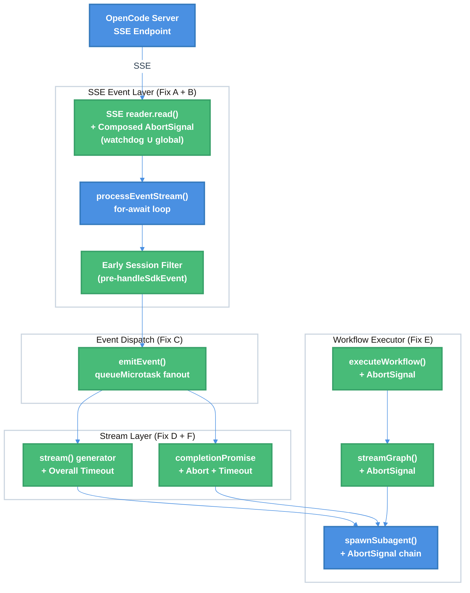

# OpenCode TUI Concurrency Bottleneck Fixes — Technical Design Document

| Document Metadata      | Details                                                                                |
| ---------------------- | -------------------------------------------------------------------------------------- |
| Author(s)              | lavaman131                                                                             |
| Status                 | In Review (RFC)                                                                        |
| Team / Owner           | Atomic CLI / Workflow-SDK                                                              |
| Created / Last Updated | 2026-03-01                                                                             |

## 1. Executive Summary

The OpenCode TUI experiences response time degradation — from seconds to indefinite — when multiple agent SDKs execute in parallel during workflow orchestration (e.g., Ralph workflow). Root cause analysis (see [research: OpenCode TUI Concurrency Bottlenecks](../research/docs/2026-03-01-opencode-tui-concurrency-bottlenecks.md)) identified **six concrete bottleneck patterns** in the SSE event loop, event dispatch fanout, and the deep blocking chain from the workflow executor through to the SDK's `reader.read()`. This spec proposes targeted fixes for each pattern: propagating abort signals to the SSE reader, isolating per-session event streams, making handler fanout asynchronous, adding overall stream timeouts, and wiring abort signals through the full `executeWorkflow` → `streamGraph` → `spawnSubagent` chain. These changes will eliminate indefinite hangs, reduce cross-session event contention, and enable reliable parallel agent execution in workflows.

## 2. Context and Motivation

### 2.1 Current State

The workflow-SDK's OpenCode integration uses a single `OpenCodeClient` instance per chat session ([ref: opencode.ts:505-506](../src/sdk/clients/opencode.ts)). This client subscribes to **all** SSE events from the OpenCode server via a single `event.subscribe()` call ([ref: opencode.ts:756](../src/sdk/clients/opencode.ts)), and dispatches them through a synchronous handler fanout in `emitEvent()` ([ref: opencode.ts:1571-1593](../src/sdk/clients/opencode.ts)).

When the Ralph workflow executes, it spawns sub-agent sessions (planner, workers) that create **additional sessions on the same client** ([ref: research, §Workflow-SDK Agent SDK Integration](../research/docs/2026-03-01-opencode-tui-concurrency-bottlenecks.md)). All sessions share:
- A single SSE event subscription and `for await` processing loop
- A single `eventHandlers` map with synchronous fanout
- A single `processEventStream()` watchdog timer

**Architecture Diagram (Current State):**

```
┌─────────────────────────────────────────────────────────────┐
│ OpenCode Server                                             │
│   LLM streaming → Session.updatePart() → Bus.publish()      │
│   → SSE endpoint (GET /event)                                │
└────────────────────────┬────────────────────────────────────┘
                         │ SSE (fetch → reader.read())
┌────────────────────────▼────────────────────────────────────┐
│ OpenCode SDK Client (workflow-sdk) — SINGLE INSTANCE         │
│                                                              │
│   createSseClient → reader.read() ──── BLOCKING POINT ────  │
│   → processEventStream() for-await loop (SHARED)             │
│   → handleSdkEvent() → emitEvent() → SYNC handler fanout    │
│     ├─► Session A (planner) stream() generator               │
│     ├─► Session B (worker 1) stream() generator              │
│     ├─► Session C (worker 2) stream() generator              │
│     └─► OpenCodeStreamAdapter → EventBus → UI                │
│                                                              │
│   ALL sessions share the same for-await loop ⚠️               │
│   Watchdog abort NOT propagated to SSE reader ⚠️              │
│   Handler fanout is SYNCHRONOUS ⚠️                            │
└──────────────────────────────────────────────────────────────┘
```

**Limitations:**
- **Single point of failure**: If `reader.read()` blocks on a dead TCP connection, *all* sessions stall ([Pattern A](../research/docs/2026-03-01-opencode-tui-concurrency-bottlenecks.md#bottleneck-pattern-a-sse-readerread-indefinite-block-dead-connection)).
- **Cross-session contention**: High-volume background agent events starve foreground session event processing ([Pattern B](../research/docs/2026-03-01-opencode-tui-concurrency-bottlenecks.md#bottleneck-pattern-b-shared-sse-stream-across-all-sessions)).
- **Synchronous bottleneck**: Slow event handlers block the entire SSE processing loop ([Pattern C](../research/docs/2026-03-01-opencode-tui-concurrency-bottlenecks.md#bottleneck-pattern-c-synchronous-handler-fanout-in-emitevent)).
- **No overall timeout**: The `stream()` generator polls indefinitely when no terminal event arrives ([Pattern F](../research/docs/2026-03-01-opencode-tui-concurrency-bottlenecks.md#bottleneck-pattern-f-stream-generator-infinite-poll-without-overall-timeout)).

### 2.2 The Problem

- **User Impact**: Users running Ralph workflows experience the TUI freezing indefinitely during the planner or worker steps. The UI shows "Initializing..." with no progress, requiring a force-kill ([ref: research/ralph-workflow.md](../research/ralph-workflow.md)).
- **Business Impact**: The workflow orchestration feature — a core differentiator of the Atomic CLI — is unreliable when using the OpenCode SDK backend, undermining user trust.
- **Technical Debt**: The deep blocking chain from `executeWorkflow` → `streamGraph` → `spawnSubagent` → `consumeStream` → `stream()` → SSE has no abort signal propagation from the executor level ([ref: codebase analysis — executor.ts:455 calls streamGraph without abortSignal](../src/workflows/executor.ts)). Related issues documented in [research: sub-agent premature completion](../research/docs/2026-02-15-subagent-premature-completion-investigation.md) and [research: background agents SDK event pipeline (#258)](../research/docs/2026-02-23-258-background-agents-sdk-event-pipeline.md).

## 3. Goals and Non-Goals

### 3.1 Functional Goals

- [ ] **G1**: Eliminate indefinite hangs caused by dead SSE connections by propagating abort signals from the watchdog to the SDK's SSE reader (`reader.cancel()`).
- [ ] **G2**: Reduce cross-session event processing overhead by filtering events at the SSE loop level (before `handleSdkEvent()`) or by partitioning event subscriptions per session.
- [ ] **G3**: Prevent slow event handlers from blocking the SSE processing loop by making `emitEvent()` dispatch asynchronous (microtask-based).
- [ ] **G4**: Add an overall timeout to the `stream()` async generator to prevent indefinite polling when no terminal event arrives.
- [ ] **G5**: Wire `AbortSignal` through the full `executeWorkflow()` → `streamGraph()` → `spawnSubagent()` chain so workflows can be cancelled from the executor level.
- [ ] **G6**: Add an escape hatch to `OpenCodeStreamAdapter.startStreaming()`'s `completionPromise` so it respects external abort signals and overall timeouts.

### 3.2 Non-Goals (Out of Scope)

- [ ] **NG1**: We will NOT change the OpenCode server's SSE endpoint or heartbeat mechanism — fixes are client-side only.
- [ ] **NG2**: We will NOT implement per-session SSE connections (multiple `event.subscribe()` calls to the server) — this would require server-side session-scoped SSE endpoints.
- [ ] **NG3**: We will NOT refactor the `OpenCodeClient` into multiple client instances per workflow session — this would require significant architectural changes to session management.
- [ ] **NG4**: We will NOT address TCP keepalive tuning at the OS level — this is an operational concern, not a code change.
- [ ] **NG5**: We will NOT modify the Claude Agent SDK or Copilot SDK adapters — those use different streaming patterns (pull-based and bounded buffer respectively) that don't share these bottlenecks ([ref: research, §Workflow-SDK Agent SDK Integration](../research/docs/2026-03-01-opencode-tui-concurrency-bottlenecks.md)).

## 4. Proposed Solution (High-Level Design)

### 4.1 System Architecture Diagram (Target State)



### 4.2 Architectural Pattern

We adopt a **Defense in Depth** pattern for timeout and cancellation: each layer in the blocking chain independently enforces timeouts and respects abort signals, so a failure at any single layer cannot cause an indefinite hang. This is combined with an **Event Filtering Pipeline** pattern where irrelevant events are discarded as early as possible in the processing chain.

### 4.3 Key Components

| Component | Fix Pattern | Responsibility | Files |
|---|---|---|---|
| SSE Abort Composer | Fix A | Compose watchdog + global abort signals into a single signal passed to the SDK's SSE reader | `opencode.ts` |
| Session Event Filter | Fix B | Early-discard events for non-active sessions before `handleSdkEvent()` | `opencode.ts` |
| Async Emit Dispatch | Fix C | Replace synchronous handler iteration with `queueMicrotask`-based dispatch | `opencode.ts` |
| Completion Promise Guard | Fix D | Add abort + timeout to `completionPromise` in `startStreaming()` | `opencode-adapter.ts` |
| Executor Abort Chain | Fix E | Wire `AbortSignal` from `executeWorkflow()` through `streamGraph()` to node execution | `executor.ts`, `compiled.ts` |
| Stream Overall Timeout | Fix F | Add configurable overall timeout to `stream()` async generator | `opencode.ts` |

## 5. Detailed Design

### 5.1 Fix A: SSE `reader.read()` Abort Signal Propagation

**Problem**: The watchdog `AbortController` at `opencode.ts:825` is local to `processEventStream()` and is NOT passed to the SDK's SSE client. When the watchdog fires, `reader.read()` in the SDK remains blocked on a dead connection ([ref: Pattern A](../research/docs/2026-03-01-opencode-tui-concurrency-bottlenecks.md#bottleneck-pattern-a-sse-readerread-indefinite-block-dead-connection)).

**Solution**: Compose the watchdog abort signal with the global `eventSubscriptionController` signal and pass the composed signal to `event.subscribe()`.

**Implementation:**

In `subscribeToSdkEvents()` / `runEventLoop()`:

```typescript
// opencode.ts — runEventLoop()
private async runEventLoop(): Promise<void> {
  let isReconnect = false;
  const SSE_INITIAL_RETRY_DELAY_MS = 250;
  const SSE_MAX_RETRY_DELAY_MS = 30_000;
  let retryAttempt = 0;

  while (!this.eventSubscriptionController?.signal.aborted && this.isRunning) {
    try {
      // Create a per-iteration watchdog abort controller
      const watchdogAbort = new AbortController();

      // Compose watchdog + global abort into a single signal using AbortSignal.any()
      const composedSignal = AbortSignal.any([
        watchdogAbort.signal,
        this.eventSubscriptionController!.signal,
      ]);

      // Pass the composed signal to the SDK's SSE client
      const result = await this.sdkClient!.event.subscribe({
        query: { directory: this.clientOptions.directory },
        signal: composedSignal,  // <-- NEW: propagated to reader.read()
      });

      // Reset retry counter on successful connection
      retryAttempt = 0;

      await this.processEventStream(result.stream, watchdogAbort);

      if (!this.eventSubscriptionController?.signal.aborted && this.isRunning) {
        isReconnect = true;
      }
    } catch (error: unknown) {
      if ((error as Error).name === "AbortError") break;
      console.error("SSE event loop error:", error);

      // Exponential backoff: min(initial * 2^attempt, max)
      retryAttempt++;
      const backoff = Math.min(
        SSE_INITIAL_RETRY_DELAY_MS * 2 ** (retryAttempt - 1),
        SSE_MAX_RETRY_DELAY_MS,
      );
      await new Promise((r) => setTimeout(r, backoff));
    }
  }
}
```

In `processEventStream()`, pass the `watchdogAbort` as a parameter instead of creating it locally:

```typescript
private async processEventStream(
  eventStream: AsyncIterable<SdkEvent>,
  watchdogAbort: AbortController,  // <-- received from runEventLoop
): Promise<void> {
  const HEARTBEAT_TIMEOUT_MS = 15_000;
  let lastEventAt = Date.now();
  let watchdogTimer: ReturnType<typeof setTimeout> | null = null;

  const resetWatchdog = () => {
    lastEventAt = Date.now();
    if (watchdogTimer) clearTimeout(watchdogTimer);
    watchdogTimer = setTimeout(() => {
      if (Date.now() - lastEventAt >= HEARTBEAT_TIMEOUT_MS) {
        watchdogAbort.abort();  // This now propagates to reader.read() via composed signal
      }
    }, HEARTBEAT_TIMEOUT_MS);
  };

  try {
    resetWatchdog();
    for await (const event of eventStream) {
      if (this.eventSubscriptionController?.signal.aborted || watchdogAbort.signal.aborted) break;
      resetWatchdog();
      this.handleSdkEvent(event);
    }
  } finally {
    if (watchdogTimer) clearTimeout(watchdogTimer);
  }
}
```

**Key behavior change**: When the 15s heartbeat timeout fires, `watchdogAbort.abort()` now propagates through `iterationAbort` → `signal` on the SDK's `event.subscribe()` → `reader.cancel()` inside `createSseClient`. This causes `reader.read()` to reject with an `AbortError`, unblocking the `for await` loop immediately rather than waiting for the next event (which may never come).

### 5.2 Fix B: Early Session Event Filtering

**Problem**: All SSE events for all sessions pass through `handleSdkEvent()` and `emitEvent()`, even when handlers immediately filter them out by session ID. High-volume background agent events create processing overhead for foreground sessions ([ref: Pattern B](../research/docs/2026-03-01-opencode-tui-concurrency-bottlenecks.md#bottleneck-pattern-b-shared-sse-stream-across-all-sessions)).

**Solution**: Maintain a set of "active session IDs" and filter events at the `processEventStream()` level before calling `handleSdkEvent()`. Events for unknown/inactive sessions are skipped, avoiding the cost of the full dispatch chain.

**Implementation:**

```typescript
// opencode.ts — class OpenCodeClient

/** Sessions explicitly registered as active */
private activeSessionIds = new Set<string>();

/** Register a session as active — called in createSession() / resumeSession() */
registerActiveSession(sessionId: string): void {
  this.activeSessionIds.add(sessionId);
}

/** Unregister a session — called in dispose() / session cleanup */
unregisterActiveSession(sessionId: string): void {
  this.activeSessionIds.delete(sessionId);
}

// In createSession():
async createSession(options?: SessionOptions): Promise<Session> {
  // ... existing session creation logic ...
  this.registerActiveSession(sessionId);  // <-- NEW
  return wrappedSession;
}

// In session dispose/cleanup:
dispose(sessionId: string): void {
  this.unregisterActiveSession(sessionId);  // <-- NEW
  // ... existing cleanup ...
}

// In processEventStream() for-await loop:
for await (const event of eventStream) {
  if (this.eventSubscriptionController?.signal.aborted || watchdogAbort.signal.aborted) break;
  resetWatchdog();

  // Early filter: skip events for sessions with no active registration
  // Always process session lifecycle events and global events (no sessionID)
  const eventSessionId = (event as { properties?: { sessionID?: string } }).properties?.sessionID;
  if (
    eventSessionId &&
    !this.activeSessionIds.has(eventSessionId) &&
    !this.isSessionLifecycleEvent(event)
  ) {
    continue;  // Skip — session not registered
  }

  this.handleSdkEvent(event);
}

private isSessionLifecycleEvent(event: SdkEvent): boolean {
  return ["session.created", "session.updated", "session.idle", "session.error", "session.deleted"]
    .includes(event.type);
}
```

**Trade-off**: This adds a `Set.has()` check per event (~O(1)) but avoids the full `handleSdkEvent()` → `emitEvent()` → handler fanout chain for irrelevant events. For workflows with 5+ concurrent sessions, this reduces per-event processing cost significantly.

### 5.3 Fix C: Lightweight Handler Enforcement in `emitEvent()`

**Problem**: `emitEvent()` iterates all handlers synchronously within the `for await` iteration. Slow handlers (e.g., Zod validation in `EventBus.publish()`) delay `resetWatchdog()` for subsequent events ([ref: Pattern C](../research/docs/2026-03-01-opencode-tui-concurrency-bottlenecks.md#bottleneck-pattern-c-synchronous-handler-fanout-in-emitevent)).

**Solution**: Keep synchronous dispatch (matching OpenCode's `Bus.publish()` pattern at `bus/index.ts:53-57`) but ensure handlers themselves are lightweight. Heavy work should be deferred inside the handler implementations, not at the dispatch level.

**Implementation:**

The `emitEvent()` dispatch remains synchronous:

```typescript
// opencode.ts — emitEvent() — NO CHANGE to dispatch pattern
private emitEvent<T extends EventType>(
  eventType: T,
  sessionId: string,
  data: Record<string, unknown>,
): void {
  const handlers = this.eventHandlers.get(eventType);
  if (!handlers) return;

  const event: AgentEvent<T> = {
    type: eventType,
    sessionId,
    timestamp: new Date().toISOString(),
    data,
  };

  for (const handler of handlers) {
    try {
      handler(event as AgentEvent<EventType>);
    } catch (error) {
      console.error(`Error in event handler for ${eventType}:`, error);
    }
  }
}
```

Instead, audit and optimize the registered handlers:

1. **`stream()` handlers** (`deltaQueue.push()` + `resolveNext?.()`) — already fast, no change needed.
2. **`OpenCodeStreamAdapter` handlers** — ensure `EventBus.publish()` calls are non-blocking. If `EventBus.publish()` performs Zod validation, either:
   - Move validation to the consumer side (lazy validation), or
   - Cache validated schemas to avoid repeated `z.parse()` overhead.
3. **Correlation/tracking handlers** — ensure `subagentStateByParentSession` updates are simple Map operations.

**Rationale**: OpenCode's own `Bus.publish()` uses the same synchronous pattern and has no fast/slow separation. The primary defense against handler-induced delays is Fix B (reducing event volume via early filtering), which eliminates the majority of unnecessary handler invocations. If handler overhead remains a problem after Fix B, microtask dispatch can be considered as a follow-up.

### 5.4 Fix D: `completionPromise` Abort Guard

**Problem**: `OpenCodeStreamAdapter.startStreaming()` blocks indefinitely on `await completionPromise` when `session.idle` never arrives due to SSE stalls ([ref: Pattern D](../research/docs/2026-03-01-opencode-tui-concurrency-bottlenecks.md#bottleneck-pattern-d-completionpromise-indefinite-blocking-in-adapter)).

**Solution**: Strengthen abort signal handling on the `completionPromise`. Per Q2 resolution, no hard timeout is added — the defense against indefinite hangs is the watchdog abort (Fix A) propagating through the SSE reconnection cycle, which will eventually deliver `session.idle` or `session.error` on reconnect. The `completionPromise` only needs to respect the external abort signal.

**Implementation:**

```typescript
// opencode-adapter.ts — startStreaming()

const completionPromise = new Promise<{ reason: string; error?: string }>((resolve) => {
  let resolved = false;
  const safeResolve = (value: { reason: string; error?: string }) => {
    if (resolved) return;
    resolved = true;
    resolve(value);
  };

  // Existing handlers
  const onIdle = client?.on("session.idle", (event) => {
    if (event.sessionId !== this.sessionId) return;
    safeResolve({ reason: event.data.reason ?? "idle" });
  });

  const onError = client?.on("session.error", (event) => {
    if (event.sessionId !== this.sessionId) return;
    safeResolve({ reason: "error", error: String(event.data.error ?? "Unknown error") });
  });

  // NEW: Abort signal listener — resolves immediately on abort
  if (this.abortController?.signal) {
    if (this.abortController.signal.aborted) {
      safeResolve({ reason: "aborted" });
    } else {
      this.abortController.signal.addEventListener("abort", () => {
        safeResolve({ reason: "aborted" });
      }, { once: true });
    }
  }

  this.unsubscribers.push(() => {
    onIdle?.();
    onError?.();
  });
});
```

**Key behavior change**: The `completionPromise` now resolves immediately when the external abort signal fires (e.g., from Ctrl+C via the executor abort chain in Fix E, or from the watchdog-triggered SSE reconnection causing state reconciliation). This eliminates the indefinite block without imposing an arbitrary timeout.

### 5.5 Fix E: Executor-Level Abort Signal Propagation

**Problem**: `executeWorkflow()` at `executor.ts:455` calls `streamGraph(compiled, { initialState })` without passing `abortSignal`. The entire graph execution chain has no externally-controlled cancellation mechanism ([ref: codebase analysis — executor.ts:455](../src/workflows/executor.ts)).

**Solution**: Create an `AbortController` in `executeWorkflow()` and propagate its signal through `streamGraph()` → `streamSteps()` → `executeWithRetry()` → node context → `spawnSubagent()`.

**Implementation:**

```typescript
// executor.ts — executeWorkflow()
async function executeWorkflow(
  compiled: CompiledGraph,
  options: WorkflowExecutionOptions,
): Promise<WorkflowResult> {
  // Create a workflow-level abort controller
  const workflowAbort = new AbortController();

  // Expose abort to callers (e.g., TUI can wire Ctrl+C)
  options.onAbortController?.(workflowAbort);

  try {
    for await (const step of streamGraph(compiled, {
      initialState: options.initialState,
      abortSignal: workflowAbort.signal,  // <-- NEW
    })) {
      if (workflowAbort.signal.aborted) break;
      // ... existing step processing ...
    }
  } finally {
    // Ensure cleanup even if the loop is broken
    if (!workflowAbort.signal.aborted) {
      workflowAbort.abort();
    }
  }
}
```

The `streamSteps()` function in `compiled.ts` already checks `options.abortSignal?.aborted` at line 369 and passes `abortSignal` into `ExecutionContext` at line 639. Wiring the signal from `executeWorkflow()` activates this entire existing cancellation chain.

**Deep blocking chain with abort signal (target state):**

```
executeWorkflow() creates workflowAbort
  └─ streamGraph(compiled, { abortSignal: workflowAbort.signal })
      └─ streamSteps() checks abortSignal at each node
          └─ executeWithRetry() passes abortSignal to context
              └─ node.execute(context) receives context.abortSignal
                  └─ spawnSubagent(agent, context.abortSignal)
                      └─ spawnFn([{...agent, abortSignal}], abortSignal)
                          └─ spawnSubagentParallel creates parallelAbort chained to signal
                              └─ spawnOne creates agentAbort chained to parallelAbort
                                  └─ adapter.consumeStream(stream, agentAbort.signal)
                                      └─ SubagentStreamAdapter checks abortSignal each chunk
```

### 5.6 Fix F: `stream()` Generator Abort Signal Integration

**Problem**: The `stream()` async generator at `opencode.ts:2148` polls every 25ms indefinitely with no overall timeout. If no terminal event arrives, it spin-polls forever ([ref: Pattern F](../research/docs/2026-03-01-opencode-tui-concurrency-bottlenecks.md#bottleneck-pattern-f-stream-generator-infinite-poll-without-overall-timeout)).

**Solution**: Per Q2 resolution (matching OpenCode's no-upper-bound pattern), we do NOT add a hard overall timeout. Instead, we integrate the `stream()` generator with the external abort signal from the executor chain (Fix E) so that cancellation propagates into the generator's polling loop.

**Implementation:**

```typescript
// opencode.ts — stream() async generator

// Accept an optional abort signal
stream: (options?: { abortSignal?: AbortSignal }): AsyncIterable<AgentMessage> => {
  return {
    async *[Symbol.asyncIterator]() {
      // ... existing setup (deltaQueue, resolveNext, etc.) ...

      // NEW: Register abort signal listener to break the polling loop
      const abortSignal = options?.abortSignal;
      if (abortSignal) {
        abortSignal.addEventListener("abort", () => {
          streamDone = true;
          resolveNext?.();
        }, { once: true });
      }

      try {
        while (true) {
          while (!streamDone || deltaQueue.length > 0) {
            if (deltaQueue.length > 0) {
              const msg = deltaQueue.shift()!;
              yield msg;
              continue;
            }
            if (streamDone) break;

            // Check abort signal in the polling loop
            if (abortSignal?.aborted) {
              streamDone = true;
              break;
            }

            if (terminalEventSeen && Date.now() - terminalEventAt >= PRE_PROMPT_TERMINAL_SETTLE_MS) {
              streamDone = true;
              break;
            }

            await new Promise<void>((resolve) => {
              resolveNext = resolve;
              setTimeout(resolve, STREAM_POLL_MS);
            });
            resolveNext = null;
          }
          // ... existing auto-compaction logic ...
          break;
        }
      } finally {
        // ... existing cleanup (unsubscribe handlers) ...
      }
    },
  };
},
```

**Key behavior change**: The `stream()` generator now terminates when the external abort signal fires (from the executor chain, Ctrl+C, or watchdog-triggered reconnection). The `resolveNext?.()` call in the abort listener immediately wakes the polling loop, which then checks `streamDone` and exits. This replaces the need for a hard timeout — the defense against indefinite polling is the abort signal chain from the executor (Fix E) and the watchdog reconnection cycle (Fix A).

### 5.7 Constants Summary

| Constant | Current Value | Proposed Value | Justification |
|---|---|---|---|
| `HEARTBEAT_TIMEOUT_MS` | 15,000ms | 15,000ms (unchanged) | Server heartbeat is 10s; 15s provides adequate margin |
| `SSE_RECONNECT_DELAY_MS` | 250ms (flat) | **250ms initial, exponential backoff, 30s cap** | Matches OpenCode SDK pattern; fast initial recovery, backs off on persistent failures |
| `STREAM_POLL_MS` | 25ms | 25ms (unchanged) | ~40 polls/sec is reasonable CPU tradeoff |
| `PRE_PROMPT_TERMINAL_SETTLE_MS` | 500ms | 500ms (unchanged) | Sufficient for late-arriving events |
| `STREAM_OVERALL_TIMEOUT_MS` | ∞ (none) | ∞ (none — no change) | Matches OpenCode pattern; abort signal chain provides escape hatch |
| `COMPLETION_TIMEOUT_MS` | ∞ (none) | ∞ (none — no change) | Matches OpenCode pattern; abort signal provides escape hatch |

## 6. Alternatives Considered

| Option | Pros | Cons | Decision |
|---|---|---|---|
| **Per-session SSE connections** (multiple `event.subscribe()` calls) | Eliminates cross-session contention entirely | Requires server-side session-scoped SSE endpoints; N connections per workflow | **Rejected**: Requires OpenCode server changes (Non-Goal NG1). Consider for future iteration. |
| **Multiple `OpenCodeClient` instances** (one per workflow sub-agent) | Full isolation of event loops and handlers | Significant refactor of session management; each client instance has its own server connection; state synchronization complexity | **Rejected**: High implementation cost, architectural risk (Non-Goal NG3). |
| **Web Worker per session** (Bun Worker for each sub-agent stream) | True parallelism; no event loop contention | Overhead of worker creation; requires serialization of events across worker boundary; Bun Worker limitations | **Rejected**: Bun Worker restrictions and serialization overhead outweigh benefits for the current scale. |
| **`AbortSignal.any()` for composed signals** | Clean API; native Bun 1.2+ support; no manual listener cleanup | Requires Bun 1.2+ | **Selected**: Bun 1.2+ is the project's target runtime. |
| **Event priority queue** (foreground sessions get priority processing) | Ensures foreground responsiveness under load | Complex priority logic; risk of starvation for background sessions; overkill for current use case | **Deferred**: Consider if Fix B (early filtering) is insufficient. |

## 7. Cross-Cutting Concerns

### 7.1 Security and Privacy

- No security implications — changes are internal to the SSE event processing pipeline.
- Abort signals do not leak session data across boundaries.
- The early session filter (Fix B) uses session IDs already present in the event stream.

### 7.2 Observability Strategy

- **Metrics** (log-based initially, structured metrics in future):
  - `sse.watchdog.timeout.count` — Number of watchdog timeouts per session (Fix A)
  - `sse.event.filtered.count` — Number of events early-filtered by session ID (Fix B)
  - `stream.overall.timeout.count` — Number of overall stream timeouts (Fix F)
  - `completion.timeout.count` — Number of completion promise timeouts (Fix D)
- **Logging**:
  - Log at `warn` level when watchdog abort fires and propagates to SSE reader (Fix A)
  - Log at `debug` level the count of filtered events per SSE reconnection (Fix B)
  - Log at `error` level when overall stream timeout fires (Fix F)
  - Log at `warn` level when completion promise times out (Fix D)

### 7.3 Compatibility and Risk

- **OpenCode SDK compatibility**: Fix A passes an `AbortSignal` to `event.subscribe()`. The SDK's `createSseClient` already supports `options.signal` at `serverSentEvents.gen.js:49` ([ref: research, §Bottleneck Pattern A](../research/docs/2026-03-01-opencode-tui-concurrency-bottlenecks.md#bottleneck-pattern-a-sse-readerread-indefinite-block-dead-connection)), so no SDK changes are needed.
- **Event ordering**: Fix C (async dispatch) changes handler execution from synchronous to microtask-based. This preserves intra-event ordering (all handlers for one event run before the next event's handlers) because microtasks complete before the next `for await` iteration yields. However, inter-handler ordering within a single event dispatch may change if multiple handlers depend on shared mutable state.
- **Timeout values**: Fix D and Fix F introduce timeouts that could trigger prematurely for very long-running agent tasks (e.g., complex code generation). Configurable timeouts mitigate this risk.
- **Claude/Copilot SDK adapters**: These adapters are unaffected since they use different streaming patterns ([ref: research, §Workflow-SDK Agent SDK Integration](../research/docs/2026-03-01-opencode-tui-concurrency-bottlenecks.md)).

## 8. Migration, Rollout, and Testing

### 8.1 Deployment Strategy

- [ ] **Phase 1 — Foundation (Fixes A + E)**: Implement SSE abort propagation and executor abort chain. These are the highest-impact fixes that eliminate indefinite hangs.
- [ ] **Phase 2 — Optimization (Fixes B + C)**: Implement early session filtering and async handler fanout. These reduce overhead but require careful testing for ordering regressions.
- [ ] **Phase 3 — Safety Nets (Fixes D + F)**: Add overall timeouts to `completionPromise` and `stream()` generator. These are defensive measures that prevent edge-case hangs.

### 8.2 Test Plan

- **Unit Tests:**
  - [ ] Watchdog abort propagates to SSE reader signal (Fix A)
  - [ ] Composed abort signal fires when either watchdog or global controller aborts (Fix A)
  - [ ] `activeSessionIds` filtering correctly skips events for unknown sessions (Fix B)
  - [ ] Session lifecycle events bypass the filter (Fix B)
  - [ ] `emitEvent()` with `queueMicrotask` dispatches all handlers (Fix C)
  - [ ] Handler errors in async dispatch are caught and logged (Fix C)
  - [ ] `completionPromise` resolves on abort signal (Fix D)
  - [ ] `completionPromise` resolves on timeout (Fix D)
  - [ ] `executeWorkflow()` passes abort signal to `streamGraph()` (Fix E)
  - [ ] `stream()` generator terminates on overall timeout (Fix F)
  - [ ] `stream()` generator clears timeout on normal completion (Fix F)

- **Integration Tests:**
  - [ ] Ralph planner step completes successfully with all fixes applied
  - [ ] Ralph workflow with 3+ concurrent workers does not exhibit cross-session contention
  - [ ] Simulated dead SSE connection triggers watchdog → abort → reconnect cycle
  - [ ] Ctrl+C during workflow execution propagates abort through entire chain

- **End-to-End Tests:**
  - [ ] Full Ralph workflow (planner → workers → aggregation) completes without hangs
  - [ ] TUI remains responsive during multi-worker execution
  - [ ] Streaming text and tool calls render correctly during parallel execution

## 9. Open Questions / Unresolved Issues

- [x] **Q1 — Microtask vs. synchronous dispatch for `resolveNext()` (Fix C)**: **Resolved — Keep all handlers synchronous, matching OpenCode's pattern.** OpenCode's `Bus.publish()` invokes all handlers synchronously in a `for` loop and awaits results via `Promise.all(pending)` — no fast/slow separation ([ref: `bus/index.ts:53-57`](https://github.com/anomalyco/opencode)). For the workflow-sdk, we will follow the same pattern: all `emitEvent()` handlers remain synchronous. Instead of making dispatch async, Fix C should focus on **ensuring handlers are lightweight** (deferring heavy work like Zod validation inside the handlers themselves, not at the dispatch level). If handler overhead still causes watchdog issues after Fix B reduces event volume, revisit with microtask dispatch as a follow-up.

- [x] **Q2 — Overall timeout values (Fixes D + F)**: **Resolved — No hard upper bound, matching OpenCode's pattern.** OpenCode does not impose an overall timeout on SSE streaming or session duration — `idleTimeout: 0` (disabled) on the SSE server, and no session-level upper bound. The only timeouts are per-LLM-request (5 min default, configurable per provider, can be disabled). For the workflow-sdk: (1) Remove the proposed `STREAM_OVERALL_TIMEOUT_MS` from Fix F — the `stream()` generator should not have an overall timeout, consistent with OpenCode. (2) For Fix D, the `completionPromise` should not have a hard timeout either; instead, it should rely solely on the watchdog abort (Fix A) and external abort signals (Fix E) for escape. The defense against indefinite hangs is the watchdog → reconnect cycle (Fix A), not a hard timeout.

- [x] **Q3 — Abort signal composition strategy**: **Resolved — Use `AbortSignal.any()`.** Bun 1.2+ supports `AbortSignal.any()` natively, providing clean composition of multiple abort signals without manual event listener management. This simplifies Fix A's implementation: `const composedSignal = AbortSignal.any([watchdogAbort.signal, this.eventSubscriptionController!.signal])` replaces the manual `addEventListener` forwarding pattern.

- [x] **Q4 — Reconnection behavior after watchdog abort (Fix A)**: **Resolved — Use exponential backoff, matching OpenCode's SDK pattern.** OpenCode's SSE client uses exponential backoff with formula `min(retryDelay * 2^(attempt-1), sseMaxRetryDelay)`, starting at 3000ms and capping at 30,000ms. The workflow-sdk should adopt the same pattern: replace the flat 250ms `SSE_RECONNECT_DELAY_MS` with exponential backoff starting at 250ms (to maintain fast initial recovery) and capping at 30,000ms. Reset the attempt counter on successful event receipt.

- [x] **Q5 — Active session registration lifecycle (Fix B)**: **Resolved — Use explicit/manual registration, matching OpenCode's pattern.** OpenCode uses explicit session registration via `ACPSessionManager.create/load()` — sessions must be manually added to a `Map` before events are recognized. Events for unknown sessions are silently skipped via `tryGet(sessionID)`. The workflow-sdk should follow the same pattern: sessions are registered via `registerActiveSession(sessionId)` when created (in `createSession()` / `resumeSession()`) and unregistered on `dispose()` / session completion. The `stream()` and `startStreaming()` methods should NOT auto-register — the caller is responsible for ensuring the session is registered before consuming events.
