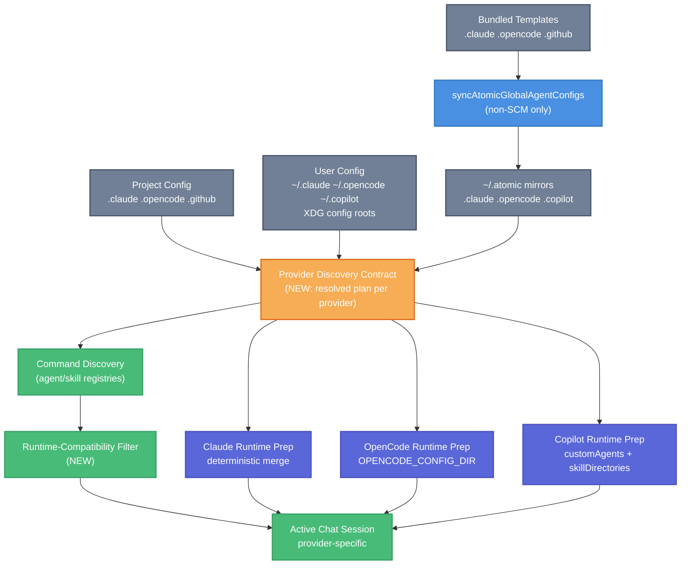

# Claude SDK Discovery and Atomic Config Sync Alignment Technical Design Document / RFC

| Document Metadata      | Details                                                                                                                                                                                                                                                                                                                                                                                        |
| ---------------------- | ---------------------------------------------------------------------------------------------------------------------------------------------------------------------------------------------------------------------------------------------------------------------------------------------------------------------------------------------------------------------------------------------- |
| Author(s)              | lavaman131                                                                                                                                                                                                                                                                                                                                                                                     |
| Status                 | Draft (WIP)                                                                                                                                                                                                                                                                                                                                                                                    |
| Team / Owner           | Atomic CLI                                                                                                                                                                                                                                                                                                                                                                                     |
| Created / Last Updated | Pending review                                                                                                                                                                                                                                                                                                                                                                                 |
| Research Inputs        | `research/docs/2026-03-04-claude-sdk-discovery-and-atomic-config-sync.md`, `research/docs/2026-02-25-global-config-sync-mechanism.md`, `research/docs/2026-02-25-install-postinstall-analysis.md`, `research/docs/2026-02-17-legacy-code-removal-skills-migration.md`, `research/docs/2026-02-08-skill-loading-from-configs-and-ui.md`, `research/docs/2026-03-02-copilot-sdk-ui-alignment.md` |

## 1. Executive Summary

Atomic currently has a discovery split: global templates are synchronized to `~/.atomic`, UI command discovery scans project/user/atomic locations, and provider runtimes discover assets differently. This is most visible for Claude, where sub-agents are injected programmatically but skills/commands remain tied to Claude-native `settingSources` while runtime intentionally avoids `CLAUDE_CONFIG_DIR` ([R1], [R2]). The result is user-visible inconsistency where skills/agents may appear available in UI but are not aligned with provider-native discovery behavior.

This RFC proposes a provider-aware discovery contract that explicitly defines what each SDK can discover, how Atomic prepares runtime configuration, and what the UI should surface as runtime-compatible. The design preserves intentional SCM behavior (`gh-*`, `sl-*` remain project-local via init/auto-init), keeps OpenCode and Copilot strengths, and enforces one deterministic path convention: always support `~/.atomic/*` baselines alongside user-global and project-local config roots without introducing user-facing discovery mode toggles ([R1], [R3]).

Impact: clearer UX, fewer false "not detected" reports, improved cross-provider parity, safer config-path behavior, and better observability for discovery mismatches without changing the SKILL.md ecosystem or removing existing slash-command workflows.

## 2. Context and Motivation

### 2.1 Current State

- **Global Sync Layer:** non-SCM templates are mirrored to `~/.atomic/.claude`, `~/.atomic/.opencode`, and `~/.atomic/.copilot`; SCM-prefixed skills (`gh-*`, `sl-*`) are intentionally excluded and pruned ([R1], [R2], [R3]).
- **SCM Provisioning Layer:** `atomic init` and chat auto-init copy/reconcile SCM variants into project-local config trees (`.claude`, `.opencode`, `.github`) ([R1]).
- **Provider Runtime Layer:**
    - Claude loads custom agents into `options.agents` and routes slash-agent dispatch through `options.agent`, but runtime setting sources remain Claude-native (`local/project/user`) and `CLAUDE_CONFIG_DIR` is not set ([R1]).
    - OpenCode builds merged runtime config and sets `OPENCODE_CONFIG_DIR` ([R1]).
    - Copilot manually injects `customAgents` and `skillDirectories` from project/home/atomic candidates ([R1], [R6]).
- **UI Discovery Layer:** slash command discovery scans broad project + user + atomic paths for both skills and agents, then often executes skills by injecting `SKILL.md` body with `<skill-loaded ...>` ([R1], [R5]).

### 2.2 The Problem

- **User Impact:** users see skills/agents listed in Atomic UI that do not always map 1:1 to provider-native runtime discovery, especially for Claude sessions ([R1]).
- **Behavior Ambiguity:** equivalent "global config" means different things across SDKs, producing confusion and support/debug overhead.
- **Documentation Drift:** project guidance references Copilot global config as `~/.config/.copilot`, while runtime/docs commonly use `~/.copilot` ([R1]).
- **Environment Drift:** source-install behavior differs from npm/binary install sync lifecycle, which can hide state issues during local development ([R1], [R3]).

## 3. Goals and Non-Goals

### 3.1 Functional Goals

- [ ] Define and implement a provider discovery contract that makes runtime discovery sources explicit for Claude, OpenCode, and Copilot.
- [ ] Align command discovery visibility with runtime-compatible paths per active provider, with clear fallback behavior.
- [ ] Preserve current intentional SCM exception design: `gh-*` / `sl-*` remain project-local and are not globally mirrored.
- [ ] Normalize Copilot global path handling and documentation to eliminate `~/.copilot` vs `~/.config/.copilot` ambiguity.
- [ ] Add discovery observability so mismatches are detectable via logs/metrics, not user reports.
- [ ] Avoid discovery-mode configuration bloat; use deterministic conventions instead of runtime mode flags.

### 3.2 Non-Goals (Out of Scope)

- [ ] We will NOT redesign SKILL.md format, frontmatter schema, or the Agent Skills standard.
- [ ] We will NOT remove Atomic's slash skill injection path in this iteration.
- [ ] We will NOT globally mirror SCM-managed skills (`gh-*`, `sl-*`) to `~/.atomic`.
- [ ] We will NOT rewrite provider SDK client architecture beyond discovery/runtime-prep boundaries.
- [ ] We will NOT introduce timeline-based rollout commitments in this document.

## 4. Proposed Solution (High-Level Design)

### 4.1 System Architecture Diagram



### 4.2 Architectural Pattern

**Capability-Normalized Discovery Contract**

Atomic will compute a provider-specific discovery plan before session start and command initialization. The plan acts as the source of truth for:

1. runtime-prep environment behavior (e.g., deterministic `CLAUDE_CONFIG_DIR` and `OPENCODE_CONFIG_DIR` binding),
2. command visibility/compatibility in UI, and
3. observability fields for mismatches.

This pattern keeps existing sync/discovery primitives but removes implicit assumptions that all providers interpret directories the same way ([R1], [R5], [R6]).

### 4.3 Key Components

| Component                                | Responsibility                                                                 | Technology Stack                           | Justification                                                                  |
| ---------------------------------------- | ------------------------------------------------------------------------------ | ------------------------------------------ | ------------------------------------------------------------------------------ |
| Provider Discovery Planner (new utility) | Resolve effective discovery sources per provider with deterministic precedence | TypeScript (`src/utils/*`)                 | Centralizes path precedence and removes duplicated heuristics ([R1])           |
| Claude Runtime Merger                    | Always build merged Claude runtime rooted in `~/.atomic/.claude`               | TypeScript + env prep in `chat` path       | Removes split discovery between UI and Claude runtime ([R1])                   |
| UI Compatibility Filter                  | Show runtime-compatible skills/agents for active provider by default           | Command registry integration               | Reduces "listed but unavailable" confusion ([R1], [R5])                        |
| Copilot Path Resolver                    | Normalize user-global path handling and fallback policy                        | TypeScript (`src/config/*`, `src/utils/*`) | Fixes path source-of-truth drift (`~/.copilot` vs `~/.config/.copilot`) ([R1]) |
| Discovery Telemetry Hooks                | Emit structured events for plan, mismatches, and startup errors                | Existing telemetry/event layer             | Makes discovery issues debuggable in production-like sessions ([R6])           |

## 5. Detailed Design

### 5.1 Internal Interfaces

Introduce a deterministic path planning contract (no user-facing discovery mode toggles):

```ts
type Provider = "claude" | "opencode" | "copilot";

interface ProviderPathSet {
    atomicBaseline: string[];
    userGlobal: string[];
    projectLocal: string[];
}

interface ProviderDiscoveryPlan {
    provider: Provider;
    paths: ProviderPathSet;
    mergedRuntimeDir?: string;
    runtimeEnv: Record<string, string>;
    runtimeCompatibility: {
        compatibleSkillNames: Set<string>;
        compatibleAgentNames: Set<string>;
    };
    notes: string[];
}
```

Implementation touchpoints:

- `src/commands/chat.ts` consumes `ProviderDiscoveryPlan` before client start.
- `src/ui/commands/skill-commands.ts` and `src/ui/commands/agent-commands.ts` consume compatibility hints to filter or annotate entries.
- `src/sdk/clients/claude.ts`, `src/sdk/clients/copilot.ts` consume plan-derived runtime env/path settings.

Research basis: runtime split and broad UI discovery are explicitly documented in [R1].

### 5.2 Deterministic Path Convention (No Mode Config)

Atomic will always support these config roots together, with later layers overriding earlier layers where merging applies.

| Provider | Atomic Baseline (required) | User Global (supported)                                                                                                                                  | Project Local (supported)                                                            | Runtime Binding                                                   |
| -------- | -------------------------- | -------------------------------------------------------------------------------------------------------------------------------------------------------- | ------------------------------------------------------------------------------------ | ----------------------------------------------------------------- |
| Claude   | `~/.atomic/.claude`        | `~/.claude`                                                                                                                                              | `<project>/.claude`                                                                  | `CLAUDE_CONFIG_DIR=<merged-claude-dir>`                           |
| OpenCode | `~/.atomic/.opencode`      | XDG-guided OpenCode root (`$XDG_CONFIG_HOME/.opencode`, default `~/.config/.opencode`), plus `~/.config/opencode` legacy compatibility and `~/.opencode` | `<project>/.opencode`                                                                | `OPENCODE_CONFIG_DIR=<merged-opencode-dir>`                       |
| Copilot  | `~/.atomic/.copilot`       | XDG-guided Copilot root + fallback (`~/.copilot` and `$XDG_CONFIG_HOME/.copilot`), plus `~/.claude`, `~/.opencode` compatibility inputs                  | `<project>/.github`, `<project>/.claude`, `<project>/.opencode` compatibility inputs | Manual `customAgents` + `skillDirectories` + instructions loading |

This explicitly satisfies the required convention: `~/.atomic/.opencode`, `~/.atomic/.copilot`, `~/.atomic/.claude` plus existing `~/.opencode`, `$XDG_CONFIG_HOME/.opencode`, `~/.copilot` / `$XDG_CONFIG_HOME/.copilot`, `~/.claude`, `.opencode`, `.github`, and `.claude`.

### 5.3 Runtime Preparation

#### 5.3.1 Claude (Deterministic merged runtime)

- Always construct merged Claude runtime from `~/.atomic/.claude`, then `~/.claude`, then `<project>/.claude`.
- Always set `CLAUDE_CONFIG_DIR` to that merged directory for Claude sessions.
- If merge cannot be prepared, fail session startup with an actionable error (do not silently continue with split discovery behavior).

#### 5.3.2 OpenCode (Deterministic merged runtime)

- Keep current merged layering but require it in all install types:
    1. `~/.atomic/.opencode`
    2. XDG-guided OpenCode root (`$XDG_CONFIG_HOME/.opencode`, default `~/.config/.opencode`)
    3. Remove Legacy compatibility root `~/.config/opencode` (covered by XDG-guided root)
    4. `~/.opencode`
    5. `<project>/.opencode`
- Always set `OPENCODE_CONFIG_DIR` to merged output before session start.

#### 5.3.3 Copilot (Manual injection with XDG-aware roots)

- Build `customAgents`, `skillDirectories`, and instructions candidates from:
    - `~/.atomic/.copilot` baseline,
    - XDG-guided canonical Copilot root plus fallback root,
    - compatibility roots in `~/.claude` and `~/.opencode`,
    - project roots in `.github`, `.claude`, and `.opencode`.
- De-duplicate by normalized path and preserve project-local precedence for conflicting names.

### 5.4 UI Discovery Compatibility Filtering

Current UI discovery scans broad directories and can surface entries that runtime may not natively see for a provider ([R1], [R5]).

Proposed behavior:

1. Discover all entries as today.
2. Validate definition integrity (required frontmatter fields, parseability, naming constraints).
3. Compute runtime compatibility set from `ProviderDiscoveryPlan`.
4. Register only compatible and well-formed entries; ignore incompatible or malformed definitions.
5. Emit diagnostic events for skipped entries (reason: malformed/incompatible) without polluting slash command registry.

Compatibility rules (initial):

- **Claude:** compatible if reachable through the deterministic merged roots (`~/.atomic/.claude`, `~/.claude`, `<project>/.claude`) or via Atomic skill-injection execution policy.
- **OpenCode:** compatible if in merged OpenCode discovery roots or accepted shared paths.
- **Copilot:** compatible if present in `skillDirectories`/`customAgents` plan.

This policy intentionally does not provide a "show incompatible" registration path.

### 5.5 Copilot Global Path Normalization

Resolve path ambiguity by introducing deterministic resolution with compatibility:

1. Resolve canonical root with XDG guidance:
    - if `XDG_CONFIG_HOME` is set: `$XDG_CONFIG_HOME/.copilot`
    - otherwise: `~/.copilot`
2. Read the non-canonical root as compatibility fallback.
3. Emit warning when canonical and fallback roots both exist and differ.
4. Align `AGENTS.md` and `CLAUDE.md` with this XDG-guided canonical policy.

Rationale and conflict are documented in [R1] and Copilot docs references used there.

### 5.6 Source-Install Sync Behavior

Atomic will always run global sync ensure for source, npm, and binary installs so `~/.atomic` baselines are deterministic everywhere.

No discovery sync policy setting is introduced.

### 5.7 File-Level Change Plan

| File                                   | Change Type | Planned Change                                                                       |
| -------------------------------------- | ----------- | ------------------------------------------------------------------------------------ |
| `src/commands/chat.ts`                 | update      | Consume deterministic discovery plan, always bind runtime env, emit discovery events |
| `src/utils/claude-config.ts`           | update      | Merge atomic+user+project Claude config into deterministic runtime directory         |
| `src/utils/opencode-config.ts`         | update      | Reuse contract-based plan input instead of local ad-hoc path assembly                |
| `src/config/copilot-manual.ts`         | update      | Route global path lookup through shared Copilot path resolver                        |
| `src/sdk/clients/copilot.ts`           | update      | Use normalized skill/agent directory plan                                            |
| `src/ui/commands/skill-commands.ts`    | update      | Add compatibility-aware registration/filtering                                       |
| `src/ui/commands/agent-commands.ts`    | update      | Add compatibility-aware registration/filtering                                       |
| `src/utils/provider-discovery-plan.ts` | new         | Compute provider discovery plan and compatibility sets                               |
| `src/utils/copilot-paths.ts`           | new         | Resolve canonical + fallback Copilot config roots                                    |
| `AGENTS.md` / `CLAUDE.md`              | update      | Align documented Copilot path and discovery contract notes                           |

## 6. Alternatives Considered

| Option                                                                         | Pros                                                                         | Cons                                                     | Reason for Rejection / Selection                  |
| ------------------------------------------------------------------------------ | ---------------------------------------------------------------------------- | -------------------------------------------------------- | ------------------------------------------------- |
| Option A: Keep current behavior                                                | No migration risk                                                            | Persistent confusion, hidden mismatch bugs               | Rejected: does not solve primary problem ([R1])   |
| Option B: Deterministic atomic+user+project convention (Selected)              | No mode/config bloat; aligns with required path support; predictable runtime | Requires careful merge ordering and migration validation | **Selected**: directly matches requested behavior |
| Option C: Provider-native-only discovery (drop `~/.atomic` baseline authority) | Simpler mental model per SDK                                                 | Fails required `~/.atomic/*` convention and parity goals | Rejected                                          |

## 7. Cross-Cutting Concerns

### 7.1 Security and Privacy

- Restrict discovery to approved directory roots; reject path traversal or symlink escapes outside configured roots.
- Avoid logging full skill contents or sensitive user config values in telemetry; log metadata only (path class, name, source).
- Maintain SCM skill locality policy to prevent globally leaking repo-specific automation assumptions ([R1], [R2]).

### 7.2 Observability Strategy

- Add structured events:
    - `discovery.plan.generated`
    - `discovery.compatibility.filtered`
    - `discovery.definition.skipped`
    - `discovery.runtime.startup_error`
    - `discovery.path.conflict`
- Attach provider, install type, and path-class tags for diagnostics.
- Add debug command output (or log dump) to print active discovery plan for support triage.

### 7.3 Scalability and Capacity Planning

- Directory scan costs are bounded by small config trees but still cached per startup/session.
- Reuse existing short-TTL caches where present (e.g., Copilot agent loader) and centralize invalidation strategy.
- Ensure compatibility filtering runs in-memory after discovery to avoid repeated filesystem traversal.

## 8. Migration, Rollout, and Testing

### 8.1 Deployment Strategy

- [ ] Phase 1: Implement deterministic provider path planner and remove install-type sync gating.
- [ ] Phase 2: Wire Claude/OpenCode/Copilot runtime preparation to the unified convention.
- [ ] Phase 3: Enforce strict registration rules (skip malformed/incompatible definitions).
- [ ] Phase 4: Align docs/config guidance and finalize migration validation.

### 8.2 Data Migration Plan

- Detect canonical-vs-fallback Copilot config roots under XDG-guided policy and generate a non-destructive reconciliation recommendation.
- If policy requires canonicalization, copy missing files from secondary root to primary root (no destructive delete).
- Keep SCM skill reconciliation unchanged: project-local `init`/auto-init remains authority.

### 8.3 Test Plan

- **Unit Tests:**
    - Discovery-plan precedence resolution for each provider convention.
    - Copilot dual-path conflict detection and deterministic root ordering.
    - Claude merged runtime binding and startup error behavior.
- **Integration Tests:**
    - `chatCommand` startup applies expected plan for `claude`, `opencode`, `copilot`.
    - Skill/agent command registries respect runtime compatibility filter.
    - Malformed slash command definitions are skipped and never registered.
    - SCM skill exclusion remains intact in global sync + project init paths.
- **End-to-End Tests:**
    - Run `bun run src/cli.ts chat -a claude`, `-a opencode`, and `-a copilot` with equivalent config fixtures.
    - Validate slash discovery and invocation parity for compatible skills/agents.
    - Validate behavior when both `~/.copilot` and `~/.config/.copilot` are present.
    - Validate OpenCode path precedence with `$XDG_CONFIG_HOME/.opencode`, `~/.config/opencode`, and `~/.opencode` present together.

## 9. Open Questions / Unresolved Issues

- [x] **Q1: Discovery mode config** - Decision: do not add discovery mode settings; use deterministic path conventions that always include `~/.atomic/*` + user + project configs.
- [x] **Q2: Copilot canonical global path** - Decision: follow XDG guidance (`~/.copilot` default; `$XDG_CONFIG_HOME/.copilot` when XDG override is set), with compatibility reads and non-destructive reconciliation across both roots.
- [x] **Q3: Source install sync behavior** - Decision: always ensure sync, including source installs, so `~/.atomic` baseline state is deterministic across development and packaged runtimes.
- [x] **Q4: UI visibility policy** - Decision: strictly ignore and do not register incompatible or malformed slash command definitions.

No remaining open questions.

## Appendix A: Research Citations

- **[R1]** `research/docs/2026-03-04-claude-sdk-discovery-and-atomic-config-sync.md`
- **[R2]** `research/docs/2026-02-25-global-config-sync-mechanism.md`
- **[R3]** `research/docs/2026-02-25-install-postinstall-analysis.md`
- **[R4]** `research/docs/2026-02-17-legacy-code-removal-skills-migration.md`
- **[R5]** `research/docs/2026-02-08-skill-loading-from-configs-and-ui.md`
- **[R6]** `research/docs/2026-03-02-copilot-sdk-ui-alignment.md`
