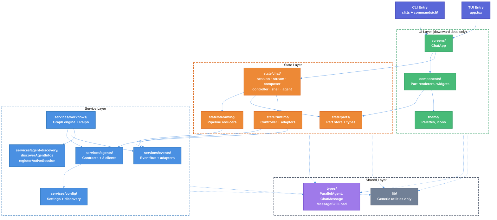

# Atomic CLI — Codebase Architecture & Modularity Refactor

| Document Metadata      | Details                                                              |
| ---------------------- | -------------------------------------------------------------------- |
| Author(s)              | Alex Lavaee                                                          |
| Status                 | In Review (RFC)                                                      |
| Team / Owner           | Atomic CLI                                                           |
| Created / Last Updated | 2026-03-13                                                           |
| Research Basis         | `research/docs/2026-03-13-codebase-architecture-modularity-analysis.md` |

## 1. Executive Summary

The Atomic CLI is a 576-file TypeScript TUI application with **9 bidirectional circular dependency pairs**, a hub-and-spoke coupling pattern centered on `services/agents/types.ts` (109 imports, 54 external), and the `state/` module as the most interconnected module (270 cross-module imports from 8 other modules). This RFC proposes a phased re-modularization to break circular dependencies, extract misplaced type definitions from UI components, relocate domain-specific business logic from the catch-all `lib/ui/` directory to consumer-local helpers, decompose the 55-hook `state/chat/` module, and remove or activate dead code paths (6 dead modules, `WorkflowSDK` runtime bypass). The goal is to enforce unidirectional dependency flow, reduce change propagation blast radius, and make the codebase testable at module boundaries.

## 2. Context and Motivation

### 2.1 Current State

The Atomic CLI follows a layered architecture with clear conceptual separation:

```
┌─────────────────────────────────────────────────────────┐
│                    CLI Layer (Commander.js)              │
│  cli.ts → commands/cli/{chat,init,update,uninstall}     │
└────────────────────────┬────────────────────────────────┘
                         │ startChatUI()
┌────────────────────────▼────────────────────────────────┐
│                    TUI Layer (React/OpenTUI)             │
│  app.tsx → screens/chat-screen.tsx → ChatShell          │
│  components/ → message-parts/ → tool-registry/          │
│  theme/ → hooks/                                        │
└───────┬──────────────────────────┬──────────────────────┘
        │                          │
┌───────▼──────────┐    ┌──────────▼─────────────────────┐
│   State Layer    │    │   Slash Commands Layer          │
│  state/chat/     │    │   commands/tui/ → core/registry │
│  state/parts/    │    │   commands/catalog/{agents,     │
│  state/runtime/  │    │                   skills}       │
│  state/streaming/│    └────────────────────────────────┘
└───────┬──────────┘
        │
┌───────▼──────────────────────────────────────────────────┐
│                   Services Layer                         │
│  agents/{contracts,clients,tools,provider-events}        │
│  events/{bus,adapters,consumers,batch-dispatcher}        │
│  workflows/{graph,ralph,runtime}                         │
│  config/{discovery,settings,provider-configs}            │
│  models/{operations,transform}                           │
│  telemetry/{tracking,upload,consent}                     │
│  system/{detect,copy,cleanup,download}                   │
│  terminal/{tree-sitter}                                  │
└──────────────────────────────────────────────────────────┘
        │
┌───────▼──────────────────────────────────────────────────┐
│                Cross-Cutting Utilities                    │
│  lib/{markdown,merge,path-root-guard,ui/*}               │
│  types/{chat,ui}                                         │
└──────────────────────────────────────────────────────────┘
```

**Key Architectural Patterns Already in Use:**
1. **Strategy Pattern** — `CodingAgentClient` interface with 3 SDK implementations
2. **Pub/Sub** — `EventBus` with 30 typed events + wildcard handlers + 16ms batched dispatch
3. **Builder Pattern** — `GraphBuilder` fluent API (LangGraph-inspired)
4. **Registry Pattern** — `ToolRegistry`, `PART_REGISTRY`, `CommandRegistry`, `ProviderRegistry`
5. **Adapter Pattern** — 3 SDK-specific stream adapters → unified `BusEvent`
6. **Reducer Pattern** — `applyStreamPartEvent` pure state reducer
7. **Double Buffering** — `BatchDispatcher` with frame-aligned flushing (~60fps)
8. **Factory Pattern** — `createChatUIController()`, `createStreamAdapter()`, `createCheckpointer()`
9. **Discriminated Union** — `Part` (10 types), `StreamPartEvent` (14 types), `BusEvent` (30 types)

> Ref: `research/docs/2026-03-13-codebase-architecture-modularity-analysis.md`, §"Design Patterns in Use"

### 2.2 The Problem

Despite sound high-level architecture, the codebase suffers from **structural coupling violations** that undermine the layered design:

**Circular Dependencies (9 bidirectional module pairs):**

| # | Pair | Forward | Reverse | Severity |
|---|------|---------|---------|----------|
| 1 | **commands ↔ services** | 87 | 9 | **High** — `services/workflows/` imports values from `commands/tui/` |
| 2 | **components ↔ state** | 20 | 44 | **High** — `state/` imports 44 times from `components/` (values + types) |
| 3 | **screens ↔ state** | 10 | 10 | **High** — `state/parts/types.ts` imports `MessageSkillLoad` FROM `screens/chat-screen.tsx` |
| 4 | **components ↔ lib** | 23 | 7 | Medium — `lib/` imports values and types from `components/` |
| 5 | **lib ↔ state** | 5 | 114 | Medium — `lib/ui/chat-helpers.ts` re-exports from `state/chat/` |
| 6 | **lib ↔ services** | 3 | 11 | Medium — mixed value/type imports both directions |
| 7 | **commands ↔ lib** | 8 | 1 | Low |
| 8 | **commands ↔ state** | 1 | 18 | Low — reverse is type-only |
| 9 | **services ↔ state** | 2 | 66 | Low — forward is type-only |

> Ref: `research/docs/2026-03-13-codebase-architecture-modularity-analysis.md`, §"Circular Dependencies"

**Coupling Hotspots:**

| File | External Imports | Issue |
|------|:---:|---|
| `services/agents/types.ts` | 54 | Hub of the entire dependency graph |
| `components/parallel-agents-tree.tsx` | 30 | UI component acting as type definition file |
| `screens/chat-screen.tsx` | 15 | Screen component doubles as type re-export barrel |
| `lib/ui/task-status.ts` | 22 | Utility consumed across 4+ modules |

> Ref: `research/docs/2026-03-13-codebase-architecture-modularity-analysis.md`, §"Coupling Hotspots"

**Additional Structural Debt:**

- **`lib/ui/` gravity well**: 35 files of domain-specific business logic (agent lifecycle ledgers, ordering contracts, background agent behavior, stream continuation, task management) consumed by 114 imports from `state/` alone — belongs closer to consumers
  - Ref: `research/docs/2026-03-13-codebase-architecture-modularity-analysis.md`, §"Key Structural Observations", #4
- **`state/chat/` monolith**: ~55 hooks in a single module with no principled decomposition strategy
  - Ref: `research/docs/2026-03-13-codebase-architecture-modularity-analysis.md`, §"Key Structural Observations", #1
- **`WorkflowSDK` dead code**: Bypassed at runtime by hardcoded `if (metadata.name === "ralph")` routing
  - Ref: `research/docs/2026-02-25-unified-workflow-execution-research.md`
- **6 dead modules + 6 unrendered UI components**: Built but never wired
  - Ref: `research/docs/2026-02-28-workflow-gaps-architecture.md`, §"Gap 5" and §"Gap 6"
- **12 of 28 event types have no consumers**: Silently discarded at `default: return null` in `mapToStreamPart()`
  - Ref: `research/docs/2026-02-28-workflow-gaps-architecture.md`, §"Gap 7"
- **Deep barrel re-export chains**: `screens/chat-screen.tsx` re-exports cross 3 module boundaries; `state/chat/types.ts` has depth-3 re-export chain
  - Ref: `research/docs/2026-03-13-codebase-architecture-modularity-analysis.md`, §"Barrel File Re-Export Chains"
- **Ralph-specific pollution of shared interfaces**: `CommandContext.setRalphSessionDir`, `CommandContext.setRalphSessionId`, etc.
  - Ref: `research/docs/2026-02-25-ui-workflow-coupling.md`

**Impact:**
- **Change Propagation**: Modifying `services/agents/contracts/` ripples to 54 external files across 7 modules
- **Testing**: Circular dependencies make isolated unit testing impossible for the `state/`, `components/`, and `screens/` modules
- **Onboarding**: New contributors cannot understand module boundaries when the dependency graph contradicts the directory structure
- **Refactoring Risk**: Any structural change risks cascading breakage due to hidden transitive dependencies through barrel chains

## 3. Goals and Non-Goals

### 3.1 Functional Goals

- [ ] **G1**: Break all 3 high-severity circular dependency pairs (commands↔services, components↔state, screens↔state)
- [ ] **G2**: Extract type definitions from UI components (`parallel-agents-tree.tsx`, `chat-screen.tsx`) into dedicated type modules
- [ ] **G3**: Relocate domain-specific business logic from `lib/ui/` closer to consumers, leaving only genuine shared utilities
- [ ] **G4**: Establish clear unidirectional dependency flow: `screens/ → components/ → state/ → services/ → lib/`
- [ ] **G5**: Decompose `state/chat/` into principled sub-modules with explicit internal contracts
- [ ] **G6**: Remove or activate dead code: `WorkflowSDK` runtime bypass, 6 dead modules, 6 unrendered components
- [ ] **G7**: Wire the 12 unconsumed event types into `StreamPipelineConsumer.mapToStreamPart()`
- [ ] **G8**: Flatten or eliminate deep barrel re-export chains (max depth: 1)
- [ ] **G9**: Remove Ralph-specific fields from shared interfaces (`CommandContext`, `CommandContextState`)
- [ ] **G10**: Zero regressions — all existing tests must pass, TUI behavior unchanged

### 3.2 Non-Goals (Out of Scope)

- [ ] We will NOT redesign the `EventBus` or `BatchDispatcher` architecture — it works well
- [ ] We will NOT refactor the 3 agent client implementations internally — their Strategy Pattern abstraction is sound
- [ ] We will NOT change the GraphBuilder/GraphExecutor APIs — they are architecturally clean
- [ ] We will NOT add new features or capabilities — this is a pure structural refactor
- [ ] We will NOT migrate from React/OpenTUI or change the rendering paradigm
- [ ] We will NOT change the config system's multi-tier resolution strategy

## 4. Proposed Solution (High-Level Design)

### 4.1 Target Architecture Diagram



### 4.2 Architectural Pattern

We adopt **Strict Layered Architecture with a Shared Types Layer**:

- Each layer may only depend on the layer directly below it and the shared types layer
- The shared types layer (`types/`) contains only pure type definitions — no runtime values
- Cross-cutting utilities (`lib/`) contain only genuinely reusable, domain-agnostic helpers
- Dependencies within a layer are unrestricted

### 4.3 Key Changes

| Change | Module(s) Affected | Pattern Applied | Justification |
|--------|-------------------|-----------------|---------------|
| Extract `ParallelAgent` types to `types/` | `components/`, `state/`, `lib/ui/` | **Type Extraction** | Breaks 30-import inverted dependency from `state/ → components/` |
| Extract `ChatMessage`, `MessageSkillLoad` from `screens/chat-screen.tsx` | `screens/`, `state/`, `components/` | **Type Extraction** | Breaks screen↔state circular dependency |
| Create `services/agent-discovery/` from `commands/tui/` functions | `services/workflows/`, `commands/tui/` | **Extract Service** | Breaks high-severity commands↔services cycle |
| Relocate `lib/ui/` domain logic to consumer modules | `lib/ui/`, `state/chat/`, `state/parts/` | **Move to Consumer** | Eliminates gravity well; enforces locality |
| Decompose `state/chat/` into explicit sub-modules | `state/chat/` | **Module Decomposition** | Principled split of 55 hooks into testable units |
| Remove Ralph fields from `CommandContext` | `commands/core/`, `services/workflows/ralph/` | **Interface Segregation** | Clean shared interface; Ralph state in workflow scope |
| Wire unconsumed events in `StreamPipelineConsumer` | `services/events/consumers/` | **Pipeline Completion** | Activate existing reducers for 12 dropped event types |
| Flatten barrel re-export chains | `types/`, `state/chat/`, `lib/ui/`, `screens/` | **Barrel Simplification** | Max depth 1; eliminate hidden cross-boundary chains |

## 5. Detailed Design

### 5.1 Phase 1 — Type Extraction (Break Circular Dependencies)

**Goal**: Break all 3 high-severity circular dependencies by extracting type definitions into the shared `types/` module.

#### 5.1.1 Extract `ParallelAgent` types from `components/parallel-agents-tree.tsx`

**Current state**: `ParallelAgent`, `AgentTreeNode`, and related tree types are defined in a React component file and imported 30 times externally (25 from `state/`).

**Action**:
1. Create `src/types/parallel-agent.ts` with all type definitions currently in `parallel-agents-tree.tsx`
2. Update `components/parallel-agents-tree.tsx` to import from `@/types/parallel-agent`
3. Update all 30 external consumers to import from `@/types/parallel-agent`

**Files affected**: `src/types/parallel-agent.ts` (new), `src/components/parallel-agents-tree.tsx`, ~30 consumer files in `state/`, `lib/ui/`

#### 5.1.2 Extract `ChatMessage` and `MessageSkillLoad` from `screens/chat-screen.tsx`

**Current state**: `chat-screen.tsx` re-exports types from `state/chat/exports.ts`, and `state/parts/types.ts` imports `MessageSkillLoad` FROM it — circular dependency.

**Action**:
1. Move type re-exports currently in `screens/chat-screen.tsx` to `src/types/chat.ts` (which already exists as a thin barrel)
2. Have `state/parts/types.ts` import `MessageSkillLoad` from `@/types/chat` instead of `@/screens/chat-screen`
3. Update all consumers of `screens/chat-screen.tsx` type exports to use `@/types/chat`

**Files affected**: `src/types/chat.ts`, `src/screens/chat-screen.tsx`, `src/state/parts/types.ts`, ~15 consumer files

#### 5.1.3 Extract `discoverAgentInfos` and `registerActiveSession` from `commands/tui/`

**Current state**: `services/workflows/` imports these functions from `commands/tui/`, creating a high-severity cycle where the service layer depends on the command layer.

**Action**:
1. Create `src/services/agent-discovery/` as a new service module
2. Move `discoverAgentInfos` and `registerActiveSession` from `commands/tui/` to `services/agent-discovery/`
3. Have both `commands/tui/` and `services/workflows/` import from `services/agent-discovery/`
4. Also move `globalRegistry` reference from `lib/ui/mention-parsing.ts` → use dependency injection or direct `commands/tui/` import (which is the correct dependency direction)

**Files affected**: `src/services/agent-discovery/` (new), `src/commands/tui/index.ts`, `src/services/workflows/runtime/`, `src/lib/ui/mention-parsing.ts`

### 5.2 Phase 2 — `lib/ui/` Relocation

**Goal**: Relocate domain-specific business logic from `lib/ui/` to consumer-local helper directories, leaving only genuinely shared utilities.

#### Classification of `lib/ui/` Files

**Move to `state/chat/helpers/`** (consumed primarily by chat state hooks):
- `agent-ordering-contract.ts` — agent ordering logic
- `agent-lifecycle-ledger.ts` — agent lifecycle tracking
- `background-agent-helpers.ts` — background agent dispatch
- `stream-continuation.ts` — stream continuation logic
- `conversation-history-buffer.ts` — history buffer management
- `chat-helpers.ts` — chat-specific helpers (already re-exports from `state/chat/`)

**Move to `state/parts/helpers/`** (consumed primarily by parts pipeline):
- `task-status.ts` — task state management
- `task-helpers.ts` — task-related utilities

**Move to `services/workflows/helpers/`** (consumed primarily by workflow engine):
- `workflow-input-resolution.ts` — workflow input resolution

**Keep in `lib/ui/`** (genuinely shared across 3+ modules):
- `clipboard.ts` — clipboard operations
- `formatting.ts` — text formatting
- `navigation.ts` — navigation utilities
- `mention-parsing.ts` — @-mention parsing (after fixing the `globalRegistry` import)

**Approach**: Move files one category at a time. After each batch, run `bun typecheck` to verify no broken imports. Update all consumers to use new import paths.

### 5.3 Phase 3 — `state/chat/` Decomposition

**Goal**: Decompose the 55-hook module into principled sub-modules with explicit internal contracts.

#### Proposed Sub-Module Structure

```
state/chat/
├── session/           # Session lifecycle (create, resume, destroy)
│   ├── use-chat-session.ts
│   └── types.ts
├── stream/            # Stream lifecycle (start, stop, finalize)
│   ├── use-chat-stream-lifecycle.ts
│   ├── use-chat-stream-startup.ts
│   ├── use-chat-stream-completion.ts
│   └── types.ts
├── composer/          # Input composition (submit, mention, attachment)
│   ├── use-chat-composer.ts
│   ├── use-chat-composer-submit.ts
│   └── types.ts
├── agent/             # Agent state (background agents, parallel trees)
│   ├── use-chat-agent-orchestration.ts
│   ├── use-chat-background-dispatch.ts
│   └── types.ts
├── controller/        # UI controller bridge
│   ├── use-chat-ui-controller-stack.ts
│   └── types.ts
├── shell/             # Shell UI state (scroll, layout, footer)
│   ├── use-chat-shell-state.ts
│   └── types.ts
├── keyboard/          # Keyboard shortcuts + input handling
│   ├── use-chat-keyboard.ts
│   └── types.ts
├── command/           # Slash command execution context
│   ├── use-chat-command-context.ts
│   └── types.ts
├── shared/            # Types and helpers shared across sub-modules
│   ├── types/
│   └── helpers/
├── ChatShell.tsx      # Main shell component (orchestrator)
├── exports.ts         # Public API barrel (max depth 1)
└── index.ts           # Internal barrel
```

**Key Design Decisions**:
- Each sub-module exposes a `types.ts` for its internal contracts
- `shared/` contains types consumed by 2+ sub-modules
- `ChatShell.tsx` composes hooks from sub-modules — it does NOT contain business logic
- `exports.ts` is the single public API surface for external consumers
- No sub-module may import from another sub-module's internal files — only from `shared/`

> Note: Much of this structure already exists. The key change is enforcing the boundary rules and moving misplaced hooks to their correct sub-modules.

### 5.4 Phase 4 — Dead Code Activation or Removal

**Goal**: Clean up dead code paths identified in research.

> Ref: `research/docs/2026-02-28-workflow-gaps-architecture.md`, §"Gap 5", §"Gap 6"

#### 5.4.1 `WorkflowSDK` Decision

The `WorkflowSDK` class exists but is bypassed at runtime. Ralph uses ad-hoc dependency construction.

**Options**:
- **Option A (Remove)**: Delete `WorkflowSDK` class and simplify to direct graph execution
- **Option B (Activate)**: Wire `WorkflowSDK` as the single execution path for all workflows, including Ralph

#### 5.4.2 Dead Module Triage

| Module | Location | Decision |
|--------|----------|----------|
| `debug-subscriber` | `services/events/` | **Activate** — useful for development |
| `tool-discovery` | `services/agents/tools/` | **Activate** — `registerCustomTools()` never called |
| `file-lock` | `services/system/` | **Evaluate** — may be needed for settings concurrency |
| `merge` | `lib/` | **Evaluate** — assess if config merging uses it |
| `pipeline-logger` | `state/streaming/` | **Activate** — useful for debugging |
| `tree-hints` | `services/terminal/` | **Evaluate** — may be unfinished feature |

#### 5.4.3 Unrendered Component Triage

| Component | Location | Decision |
|-----------|----------|----------|
| `WorkflowStepPartDisplay` | `components/message-parts/` | **Activate** — register in `PART_REGISTRY` |
| `UserQuestionInline` | `components/` | **Evaluate** — may duplicate `UserQuestionDialog` |
| `FooterStatus` | `components/` | **Evaluate** — may be superseded |
| `TimestampDisplay` | `components/` | **Evaluate** — assess usefulness |
| `StreamingBullet` | `components/` | **Evaluate** — assess usefulness |
| `CodeBlock` | `components/` | **Evaluate** — may be used by markdown renderer |

### 5.5 Phase 5 — Event Pipeline Completion

**Goal**: Wire the 12 unconsumed event types into `StreamPipelineConsumer.mapToStreamPart()`.

> Ref: `research/docs/2026-02-28-workflow-gaps-architecture.md`, §"Gap 7"

**Current state**: `StreamPipelineConsumer.mapToStreamPart()` handles only 5 of 28 event types. The remaining 12 unconsumed events include:
- Session info/warnings
- Turn lifecycle events
- Tool partial results
- Workflow step start/complete
- Task updates
- Skill invocations

**Action**:
1. For the 3 workflow events (`workflow.step.start`, `workflow.step.complete`, `workflow.task.update`) — the reducers already exist in `pipeline-workflow.ts`. Add `case` statements in `StreamPipelineConsumer`
2. For the remaining 9 events — evaluate which are rendering-relevant and wire those
3. Document the remaining events as intentionally unrendered (with `// Intentionally unhandled: <reason>` comments)

### 5.6 Phase 6 — Interface Segregation (Ralph Cleanup)

**Goal**: Remove Ralph-specific fields from shared interfaces.

> Ref: `research/docs/2026-02-25-ui-workflow-coupling.md`

**Current Ralph fields in `CommandContext`**:
- `setRalphSessionDir`
- `setRalphSessionId`
- `setRalphTaskIds`

**Current Ralph fields in `CommandContextState`**:
- `ralphConfig`

**Action**:
1. Create `services/workflows/ralph/types.ts` with a `RalphWorkflowContext` interface
2. Move Ralph-specific state to workflow-scoped context (passed through the graph execution engine, not through `CommandContext`)
3. Remove Ralph fields from `CommandContext` and `CommandContextState`
4. Update Ralph workflow nodes to use `RalphWorkflowContext` from graph state instead of `CommandContext`

### 5.7 Phase 7 — Barrel Simplification

**Goal**: Flatten re-export chains to max depth 1.

**Current problematic chains**:
1. `types/chat.ts` → `state/chat/shared/types/index.ts` → 4 leaf files (depth 2)
2. `state/chat/types.ts` → `state/chat/shared/types.ts` → `state/chat/shared/types/index.ts` → 4 leaf files (depth 3)
3. `lib/ui/chat-helpers.ts` → `state/chat/shared/helpers/index.ts` → 7 leaf files (depth 2, crosses module boundary)
4. `screens/chat-screen.tsx` re-exports from `state/chat/exports.ts` which aggregates from `lib/ui/`, `state/chat/`, and `components/` (crosses 3 module boundaries)

**Action**:
1. Each barrel file re-exports only from its immediate children — no transitive re-exports
2. Consumers import directly from the module that owns the symbol
3. `screens/chat-screen.tsx` stops being a type re-export hub (moved to `types/` in Phase 1)
4. `lib/ui/chat-helpers.ts` stops cross-module re-exporting (moved to `state/chat/helpers/` in Phase 2)

## 6. Alternatives Considered

| Option | Pros | Cons | Reason for Rejection |
|--------|------|------|---------------------|
| **Full module rewrite** | Clean slate, ideal architecture | Massive risk, months of work, feature freeze | Risk outweighs benefit; current architecture is fundamentally sound |
| **Monorepo split** (packages/) | Enforced boundaries via package.json | Bun workspace complexity, build config overhead, import path changes | Overkill — directory conventions + lint rules can enforce boundaries |
| **Leave as-is** | No risk, no effort | Coupling worsens, testing remains difficult | Technical debt compounds — each new feature adds to circular dep chains |
| **Automated dependency injection** (InversifyJS) | Runtime enforcement of dependency rules | Heavy runtime overhead, Bun compatibility concerns, paradigm shift | React hooks pattern makes DI container unnecessary |
| **Phased refactor (Selected)** | Incremental, testable, low risk | Requires discipline to maintain boundaries post-refactor | Best balance of improvement vs. risk; can stop at any phase |

## 7. Cross-Cutting Concerns

### 7.1 Testing Strategy

- **Before each phase**: Snapshot current test results as baseline
- **After each phase**: Run full test suite (`bun test`) + typecheck (`bun typecheck`) + lint (`bun lint`)
- **Import validation**: After Phase 1-3, run a custom script to verify no circular imports remain in the high-severity pairs
- **Smoke test**: After each phase, manually launch the TUI (`bun run src/cli.ts chat`) and verify basic chat functionality

### 7.2 Migration Safety

- **Branch strategy**: Each phase is a separate PR to minimize review burden and enable rollback
- **Feature flags**: Not needed — these are pure structural changes with no behavioral impact
- **Rollback**: Any phase can be reverted independently since they don't change runtime behavior

### 7.3 Dependency Rule Enforcement (Post-Refactor)

After the refactor, prevent regression with:
- **Lint rule**: Add an `oxlint` or custom rule to detect imports that violate the dependency direction (e.g., `services/ → commands/`)
- **CI check**: Script that counts circular dependency pairs; fail if count > 0 for high-severity pairs
- **Documentation**: Update `CLAUDE.md` / `AGENTS.md` with dependency rules

## 8. Migration, Rollout, and Testing

### 8.1 Deployment Strategy

- [ ] **Phase 1**: Type extraction + circular dependency breaks — lowest risk, highest impact
- [ ] **Phase 2**: `lib/ui/` relocation — medium risk, improves locality
- [ ] **Phase 3**: `state/chat/` decomposition — medium risk, requires careful hook dependency analysis
- [ ] **Phase 4**: Dead code triage — low risk, cleanup
- [ ] **Phase 5**: Event pipeline completion — low risk, enables workflow event rendering
- [ ] **Phase 6**: Interface segregation — medium risk, touches Ralph workflow
- [ ] **Phase 7**: Barrel simplification — low risk, import path cleanup

### 8.2 Verification Criteria Per Phase

| Phase | Verification |
|-------|-------------|
| Phase 1 | `bun typecheck` passes; high-severity circular dep count = 0; no `state/ → components/` type imports for extracted types |
| Phase 2 | `bun typecheck` passes; `lib/ui/` file count < 10 (from 35); no domain-specific logic in `lib/ui/` |
| Phase 3 | `bun typecheck` passes; each `state/chat/` sub-module has no imports from sibling internals |
| Phase 4 | `bun typecheck` passes; dead module count = 0; `WorkflowSDK` either removed or activated |
| Phase 5 | `bun typecheck` passes; all rendering-relevant events have `case` handlers in `mapToStreamPart()` |
| Phase 6 | `bun typecheck` passes; `CommandContext` has 0 Ralph-specific fields |
| Phase 7 | `bun typecheck` passes; no barrel chain deeper than depth 1 |

### 8.3 Test Plan

- **Unit Tests**: Existing tests must continue passing (zero regressions)
- **Integration Tests**: Existing integration tests must continue passing
- **End-to-End Tests**: Manual TUI smoke test after each phase (chat with all 3 agent types if available)
- **New Tests**: Consider adding module boundary tests that assert no circular imports for critical pairs

## 9. Resolved Questions

- [x] **Q1 — `lib/ui/` relocation granularity**: **Flat helpers directory** (e.g., `state/chat/helpers/*.ts`). Simpler structure, easier to navigate. No need to mirror current `lib/ui/` sub-grouping.

- [x] **Q2 — `WorkflowSDK` fate**: **Activate WorkflowSDK** — wire it as the single execution path for all workflows including Ralph. Remove the ad-hoc dependency construction and hardcoded `if (metadata.name === "ralph")` routing.

- [x] **Q3 — Dead module default action**: **Activate where clear integration points exist; remove the rest.** Specifically:
  - **Activate**: `debug-subscriber` (development tool), `tool-discovery`/`registerCustomTools()` (has a clear call site), `pipeline-logger` (debugging aid)
  - **Evaluate then remove if no clear integration point**: `file-lock`, `merge`, `tree-hints`

- [x] **Q4 — `state/chat/` sub-module boundary enforcement**: **Lint rules (no-restricted-imports)** — automated enforcement in CI. Add `oxlint` or ESLint-equivalent rules that prevent sub-modules from importing sibling internals.

- [x] **Q5 — Import path style post-refactor**: **Barrel imports (`@/types`)** — cleaner, fewer import statements. The `types/index.ts` barrel re-exports all shared type modules.

- [x] **Q6 — Phase ordering preference**: **Keep proposed order (1→7)** — circular dependency breaks first, then structural cleanup. No reordering needed.
