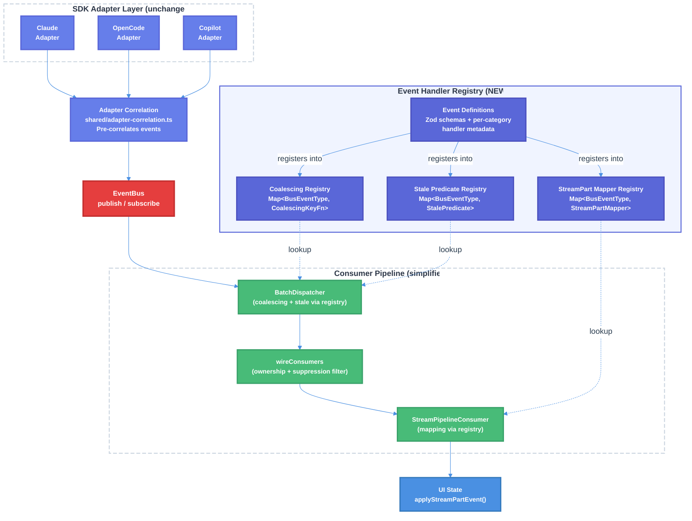

# EventBus Callback-Level Logic Elimination & SDK Event Type Catalog — Technical Design Document

| Document Metadata      | Details           |
| ---------------------- | ----------------- |
| Author(s)              | lavaman131        |
| Status                 | Draft (WIP)       |
| Team / Owner           | lavaman131/atomic |
| Created / Last Updated | 2026-03-14        |

## 1. Executive Summary

This RFC proposes restructuring the EventBus consumer pipeline to **eliminate 8 distinct manual callback patterns** spread across 10 files — most critically the 210-line `CorrelationService.enrich()` switch (11 cases with 8 duplicated sub-agent lookup blocks), the 240-line `StreamPipelineConsumer.mapToStreamPart()` switch, and the 63-line `coalescingKey()` switch — by replacing imperative switch/if-else routing with a **declarative handler registry pattern**. Each `BusEventType` will have co-located handler metadata (enrichment logic, stream-part mapping, coalescing key generation) registered at definition time, eliminating manual `as BusEventDataMap[...]` casts and the fragile requirement to update N switch statements when adding a new event type. The design preserves the existing 30-type `BusEventType` system, the Zod validation schemas, and the frame-aligned 16ms batching pipeline while making the system open for extension without modifying consumer internals.

**Research Reference:** [research/docs/2026-03-14-event-bus-callback-elimination-sdk-event-types.md](../research/docs/2026-03-14-event-bus-callback-elimination-sdk-event-types.md)

## 2. Context and Motivation

### 2.1 Current State

The Atomic TUI's EventBus consumer pipeline processes streaming events through a multi-stage pipeline ([Research, Section 4: Architecture Documentation](../research/docs/2026-03-14-event-bus-callback-elimination-sdk-event-types.md)):

```
SDK Stream (Claude/OpenCode/Copilot)
  -> Provider Adapter (switch on SDK event type)
    -> BusEvent normalization
      -> EventBus.publish() (Zod validation -> typed handlers -> wildcard handlers)
        -> BatchDispatcher.enqueue() (coalescing, stale-delta filtering)
          -> flush() every 16ms
            -> wireConsumers batch callback
              -> ownership filter (isOwnedEvent)
              -> CorrelationService.enrich() (210-line switch)
              -> suppression filter (!suppressFromMainChat)
              -> StreamPipelineConsumer.processBatch() (240-line switch)
                -> StreamPartEvent[] -> applyStreamPartEvent() reducer -> UI state
```

Three SDK backends (Claude Agent SDK with 20 message types, OpenCode SDK with 42+ events, Copilot SDK with 43 events) normalize into a unified 30-type `BusEventType` system through provider adapters, each containing their own switch-based routing ([Research, Section 3.1](../research/docs/2026-03-14-event-bus-callback-elimination-sdk-event-types.md)).

**Architecture:**
- `src/services/events/event-bus.ts` — EventBus class with typed publish/subscribe
- `src/services/events/bus-events/types.ts` — 30 BusEventType definitions + BusEventDataMap
- `src/services/events/bus-events/schemas.ts` — Zod validation schemas for all event types
- `src/services/events/batch-dispatcher.ts` — Frame-aligned batching with coalescing
- `src/services/events/consumers/` — CorrelationService, StreamPipelineConsumer, wireConsumers, echo-suppressor

### 2.2 The Problem

**8 distinct manual callback patterns** have accumulated across 10 files, creating maintenance burden and fragility ([Research, Section 1](../research/docs/2026-03-14-event-bus-callback-elimination-sdk-event-types.md)):

| Pattern                         | Location                              | Lines | Problem                                                                            |
| ------------------------------- | ------------------------------------- | ----- | ---------------------------------------------------------------------------------- |
| CorrelationService giant switch | `correlation-service.ts:124-346`      | ~210  | 11 cases with `as` casts; sub-agent registry lookup duplicated 8 times             |
| StreamPipelineConsumer switch   | `stream-pipeline-consumer.ts:179-421` | ~240  | Constructs StreamPartEvent per type; 10+ conditional spreads; 14 types return null |
| coalescingKey switch            | `coalescing.ts:8-71`                  | ~63   | Every case uses `as BusEventDataMap[...]` casts                                    |
| wireConsumers manual filtering  | `wire-consumers.ts:76-96`             | ~20   | Three-stage imperative pipeline with string checks                                 |
| BatchDispatcher stale-delta     | `batch-dispatcher.ts:228-239`         | ~12   | Manual `event.type` checks with `as` casts                                         |
| EventBus.publish dispatch       | `event-bus.ts:215-276`                | ~60   | Two separate handler loops with per-handler try/catch                              |
| Hooks ref-indirection           | `hooks.ts:114-294`                    | ~180  | Three hooks with ref-based callback stability and type cast wrappers               |
| EventBusProvider context        | `event-bus-provider.tsx:43-125`       | ~80   | Standard React Context with manual null-check                                      |

**Recurring anti-patterns** ([Research, Section 1](../research/docs/2026-03-14-event-bus-callback-elimination-sdk-event-types.md)):

| Anti-Pattern                                               | Files                                                                       | Occurrences   |
| ---------------------------------------------------------- | --------------------------------------------------------------------------- | ------------- |
| `switch (event.type)` with `as BusEventDataMap[...]` casts | correlation-service, stream-pipeline-consumer, coalescing, batch-dispatcher | 4 files       |
| Duplicated sub-agent registry lookup blocks                | correlation-service                                                         | 8 cases       |
| `if (event.type === "...")` string checks in callbacks     | wire-consumers, batch-dispatcher                                            | 2 files       |
| Conditional spread `...(x ? { y: x } : {})`                | stream-pipeline-consumer                                                    | 10+ instances |

**Impact:**
- Adding a new `BusEventType` requires updating **4+ switch statements** across separate files
- The `as` casts bypass TypeScript's type narrowing, hiding type errors at compile time
- Duplicated sub-agent registry lookup logic (8 copies) creates inconsistency risk when behavior changes
- The 240-line `mapToStreamPart()` switch conflates event routing with StreamPartEvent construction

### 2.3 Prior Art and Related Specs

This spec builds on decisions from prior work:
- [specs/2026-03-02-streaming-architecture-event-bus-migration.md](../specs/2026-03-02-streaming-architecture-event-bus-migration.md) — Foundational event bus design; established the BusEventType system (originally 26 types, now 30 with 4 workflow types), 16ms frame-aligned batching, and single event pathway
- [specs/2026-03-02-streaming-event-bus-spec-compliance-remediation.md](../specs/2026-03-02-streaming-event-bus-spec-compliance-remediation.md) — Spec compliance fixes for the event bus
- [specs/2026-03-18-codebase-architecture-modularity-refactor.md](../specs/2026-03-18-codebase-architecture-modularity-refactor.md) — Module boundary refactoring including EventBus coupling
- [specs/2026-02-20-sdk-v2-first-unified-layer.md](../specs/2026-02-20-sdk-v2-first-unified-layer.md) — SDK v2-first unified layer design

## 3. Goals and Non-Goals

### 3.1 Functional Goals

- [ ] Eliminate the 210-line `CorrelationService.enrich()` switch by moving correlation into provider adapters with a shared `adapter-correlation.ts` utility
- [ ] Replace the 240-line `StreamPipelineConsumer.mapToStreamPart()` switch with a registry that maps `BusEventType -> StreamPartMapper`
- [ ] Replace the 63-line `coalescingKey()` switch with co-located coalescing key functions registered per event type
- [ ] Migrate `BusEventDataMap` types to be inferred from Zod schemas (`z.infer<>`), making schemas the single source of truth
- [ ] Eliminate all `as BusEventDataMap[...]` casts in consumer code by leveraging TypeScript discriminated union narrowing through the registry pattern
- [ ] Consolidate the 8 duplicated sub-agent registry lookup blocks into a single shared adapter correlation utility
- [ ] Ensure adding a new `BusEventType` requires only a single registration site (schema + handler metadata in a category module) rather than updating 4+ switch files
- [ ] Maintain all existing pipeline behaviors: ownership filtering, echo suppression, stale-delta filtering, frame-aligned batching
- [ ] Preserve the existing `StreamPartEvent` reducer pipeline (`applyStreamPartEvent()`) as the downstream consumer
- [ ] Achieve compile-time exhaustiveness checking — missing handlers for a `BusEventType` produce TypeScript errors

### 3.2 Non-Goals (Out of Scope)

- [ ] We will NOT restructure the provider adapter handler class decomposition (e.g., `ClaudeToolHookHandlers`, `OpenCodeToolEventHandlers`, `CopilotMessageToolHandlers`) — those are well-organized by concern. However, we WILL add correlation logic to the adapter layer as a new responsibility and we document the full SDK-to-BusEvent normalization mappings in Section 5.8 as reference
- [ ] We will NOT change the 30-type `BusEventType` enum values — we restructure how types are defined (Zod-first) and how they're consumed (registry), but the event type identifiers remain the same
- [ ] We will NOT modify the `EventBus.publish()` dispatch mechanism itself — the typed + wildcard handler loop pattern is standard and not the source of the callback complexity
- [ ] We will NOT redesign the React hooks layer (`useBusSubscription`, `useBusWildcard`, `useStreamConsumer`) — ref-based stability is a React concern orthogonal to dispatch logic
- [ ] We will NOT change the Zod validation schemas — they remain for runtime validation at the publish boundary
- [ ] We will NOT introduce external dependencies for the registry pattern — it uses plain TypeScript `Map` and discriminated union patterns

## 4. Proposed Solution (High-Level Design)

### 4.1 System Architecture Diagram



### 4.2 Architectural Pattern

We adopt a **Handler Registry pattern** (a variant of the Strategy pattern applied to event dispatch) where each `BusEventType` registers its handler functions at definition time. The consumers become generic dispatchers that look up and invoke registered handlers rather than maintaining their own switch statements.

This is inspired by:
- OpenCode's `BusEvent.define()` pattern, which co-locates event schema with event identity ([Research, Section 4.1](../research/docs/2026-03-14-event-bus-callback-elimination-sdk-event-types.md))
- The existing `PART_REGISTRY` and `ToolRegistry` patterns already used in the codebase ([CLAUDE.md, Key Architectural Patterns](../CLAUDE.md))
- The `CommandRegistry` pattern for slash commands

### 4.3 Key Components

| Component                     | Responsibility                                                                                               | Location                                     | Justification                                                                     |
| ----------------------------- | ------------------------------------------------------------------------------------------------------------ | -------------------------------------------- | --------------------------------------------------------------------------------- |
| `EventHandlerRegistry`        | Central registry holding per-type handler metadata (coalescing, stream-part mapping, stale-delta predicates) | `src/services/events/registry/`              | Single source of truth for all per-event-type behavior; eliminates N-file updates |
| `CoalescingKeyFn<T>`          | Type-safe coalescing key function per BusEventType                                                           | `src/services/events/registry/` (co-located) | Eliminates 63-line switch and `as` casts                                          |
| `StreamPartMapper<T>`         | Type-safe BusEvent-to-StreamPartEvent mapper per BusEventType                                                | `src/services/events/registry/` (co-located) | Eliminates 240-line switch, conditional spreads, and `as` casts                   |
| `AdapterCorrelation`          | Shared correlation logic moved into provider adapters; adapters emit pre-correlated BusEvents                | `src/services/events/adapters/shared/`       | Eliminates CorrelationService entirely; deduplicates 8 sub-agent lookup blocks    |
| Zod-derived `BusEventDataMap` | Zod schemas as single source of truth; TypeScript types inferred via `z.infer<>`                             | `src/services/events/bus-events/schemas.ts`  | Follows OpenCode's `BusEvent.define()` pattern; eliminates schema/type redundancy |

## 5. Detailed Design

### 5.1 Zod-First Event Definitions

Event data types are derived from Zod schemas, following OpenCode's `BusEvent.define()` pattern. This eliminates the current redundancy between hand-written types and schemas (**Decision Q3**).

```typescript
// src/services/events/bus-events/schemas.ts (refactored — becomes source of truth)

import { z } from "zod";

export const StreamTextDeltaSchema = z.object({
  text: z.string(),
  agentId: z.string().nullable(),
  generation: z.number(),
});

export const StreamToolStartSchema = z.object({
  toolId: z.string(),
  toolName: z.string(),
  arguments: z.record(z.unknown()).optional(),
  agentId: z.string().nullable(),
});

// ... all 30 event schemas
```

```typescript
// src/services/events/bus-events/types.ts (refactored — types inferred from schemas)

import type { z } from "zod";
import type { StreamTextDeltaSchema, StreamToolStartSchema /* ... */ } from "./schemas";

/** Types are inferred from Zod schemas — single source of truth */
export type BusEventDataMap = {
  "stream.text.delta": z.infer<typeof StreamTextDeltaSchema>;
  "stream.tool.start": z.infer<typeof StreamToolStartSchema>;
  // ... all 30 types inferred from their schemas
};
```

### 5.2 Handler Registration Interface

Each `BusEventType` registers its handler metadata through a typed registration API. Handler metadata is **co-located by event category** (~10 modules), so adding a new event type is a single-module operation (**Decision Q1**).

Since correlation moves into adapters (**Decision Q2**), the registry handles only coalescing and stream-part mapping — no enrichment handlers.

```typescript
// src/services/events/registry/types.ts

/**
 * Handler metadata for a single BusEventType.
 * All fields are optional — events that don't need coalescing
 * or stream-part mapping simply omit those handlers.
 */
interface EventHandlerDescriptor<T extends BusEventType> {
  /** Coalescing key function — replaces a coalescingKey() switch case */
  coalescingKey?: CoalescingKeyFn<T>;
  /** StreamPart mapper — replaces a mapToStreamPart() switch case */
  toStreamPart?: StreamPartMapper<T>;
  /** Stale-delta predicate — replaces BatchDispatcher inline type checks */
  isStale?: StalePredicate<T>;
}

type CoalescingKeyFn<T extends BusEventType> = (
  event: BusEvent<T>,
) => string | undefined;

/** Returns single event, multiple events (e.g. workflow.task.update), or null (consumed by hooks) */
type StreamPartMapper<T extends BusEventType> = (
  event: BusEvent<T>,
  context: StreamPartContext,
) => StreamPartEvent | StreamPartEvent[] | null;

type StalePredicate<T extends BusEventType> = (
  event: BusEvent<T>,
  latest: BusEvent<T>,
) => boolean;
```

```typescript
// src/services/events/registry/registry.ts

/** Module-level singleton (Decision Q4) */
class EventHandlerRegistry {
  private handlers = new Map<BusEventType, EventHandlerDescriptor<BusEventType>>();

  register<T extends BusEventType>(
    eventType: T,
    descriptor: EventHandlerDescriptor<T>,
  ): void {
    this.handlers.set(eventType, descriptor);
  }

  getCoalescingKeyFn<T extends BusEventType>(
    eventType: T,
  ): CoalescingKeyFn<T> | undefined {
    return this.handlers.get(eventType)?.coalescingKey as CoalescingKeyFn<T> | undefined;
  }

  getStreamPartMapper<T extends BusEventType>(
    eventType: T,
  ): StreamPartMapper<T> | undefined {
    return this.handlers.get(eventType)?.toStreamPart as StreamPartMapper<T> | undefined;
  }

  getStalePredicate<T extends BusEventType>(
    eventType: T,
  ): StalePredicate<T> | undefined {
    return this.handlers.get(eventType)?.isStale as StalePredicate<T> | undefined;
  }

  /** Compile-time exhaustiveness: returns unregistered event types */
  getUnregisteredTypes(allTypes: readonly BusEventType[]): BusEventType[] {
    return allTypes.filter((t) => !this.handlers.has(t));
  }
}

export const registry = new EventHandlerRegistry();
```

### 5.3 Per-Category Handler Registration

Handler metadata is co-located in per-category registration modules (~10 modules). Each module registers coalescing and stream-part mapping for related event types (**Decision Q1**).

```typescript
// src/services/events/registry/handlers/stream-text.ts
// Example: handler registration for stream.text.* events (category grouping)

import { registry } from "../registry";

// stream.text.delta
registry.register("stream.text.delta", {
  coalescingKey: (event) => {
    const data = event.data;  // typed as z.infer<typeof StreamTextDeltaSchema>
    return `text-delta:${data.agentId ?? "main"}`;
  },

  toStreamPart: (event) => ({
    type: "text-delta",
    text: event.data.text,
    agentId: event.data.agentId,
  }),

  isStale: (event, latest) => event.data.generation < latest.data.generation,
});

// stream.text.complete
registry.register("stream.text.complete", {
  coalescingKey: (event) => `text-complete:${event.data.agentId ?? "main"}`,

  toStreamPart: (event) => ({
    type: "text-complete",
    text: event.data.text,
    agentId: event.data.agentId,
  }),
});
```

```typescript
// src/services/events/registry/handlers/stream-tool.ts
// Example: handler registration for stream.tool.* events (category grouping)

import { registry } from "../registry";

registry.register("stream.tool.start", {
  coalescingKey: (event) => `tool-start:${event.data.toolId}`,
  toStreamPart: (event) => ({
    type: "tool-start",
    toolId: event.data.toolId,
    toolName: event.data.toolName,
    arguments: event.data.arguments,
  }),
});

registry.register("stream.tool.complete", {
  coalescingKey: (event) => `tool-complete:${event.data.toolId}`,
  toStreamPart: (event) => ({
    type: "tool-complete",
    toolId: event.data.toolId,
    result: event.data.result,
    error: event.data.error,
  }),
});

registry.register("stream.tool.partial_result", {
  // No coalescing — partial results should not be collapsed
  toStreamPart: (event) => ({
    type: "tool-partial-result",
    toolId: event.data.toolId,
    partialResult: event.data.partialResult,
  }),
});
```

### 5.4 Adapter-Side Correlation (Replaces CorrelationService)

Correlation logic moves into the provider adapters so they emit pre-correlated BusEvents (**Decision Q2**). This eliminates the `CorrelationService` entirely. The duplicated sub-agent registry lookup (8 copies) is consolidated into a shared adapter utility.

```typescript
// src/services/events/adapters/shared/adapter-correlation.ts

/**
 * Shared correlation logic for all provider adapters.
 * Adapters call this before publishing BusEvents to the bus.
 * Replaces the 210-line CorrelationService.enrich() switch.
 */
export function correlate(
  event: BusEvent,
  context: AdapterCorrelationContext,
): BusEvent {
  const agentId = extractAgentId(event);
  if (!agentId) return event;

  const subagent = context.subagentRegistry.get(agentId);
  return {
    ...event,
    data: {
      ...event.data,
      resolvedAgentId: agentId,
      isSubagentTool: !!subagent,
      parentAgentId: subagent?.parentAgentId ?? null,
      suppressFromMainChat: subagent?.suppressFromMainChat ?? false,
    },
  };
}
```

This means the consumer pipeline simplifies from:
```
wireConsumers -> ownership filter -> CorrelationService.enrich() -> suppression filter -> StreamPipelineConsumer
```
To:
```
wireConsumers -> ownership filter -> suppression filter -> StreamPipelineConsumer
```

Events arrive from the bus already correlated — no downstream enrichment step needed.

### 5.5 Consumer Refactoring

#### 5.5.1 CorrelationService (210 lines -> eliminated)

The `CorrelationService` is **removed entirely** (**Decision Q2**). Its functionality is absorbed by the shared adapter-side correlation utility (Section 5.4). The `wireConsumers` pipeline removes the enrichment step.

#### 5.5.2 coalescingKey (63 lines -> ~10 lines)

```typescript
// src/services/events/coalescing.ts (refactored)

export function coalescingKey(event: BusEvent, registry: EventHandlerRegistry): string | undefined {
  const fn = registry.getCoalescingKeyFn(event.type);
  return fn ? fn(event) : undefined;
}
```

#### 5.5.3 StreamPipelineConsumer.mapToStreamPart (240 lines -> ~15 lines)

```typescript
// src/services/events/consumers/stream-pipeline-consumer.ts (refactored)

mapToStreamPart(event: BusEvent): StreamPartEvent[] | null {
  const mapper = registry.getStreamPartMapper(event.type);
  if (!mapper) return null;  // Events without a mapper are consumed by direct bus hooks
  const result = mapper(event, this.createContext());
  if (result === null) return null;
  return Array.isArray(result) ? result : [result];
}
```

Note: The `StreamPartContext` passed to mappers includes the `echoSuppressor` instance, so handlers like `stream.text.delta` can call `context.echoSuppressor.filterDelta()` as needed.

#### 5.5.4 BatchDispatcher Stale-Delta Filtering

The stale-delta check in `flush()` uses the registry's `isStale` predicate instead of inline type checks:

```typescript
// src/services/events/batch-dispatcher.ts (refactored)

private isStaleEvent(event: BusEvent, latest: BusEvent): boolean {
  const predicate = this.registry.getStalePredicate(event.type);
  return predicate ? predicate(event, latest) : false;
}
```

### 5.6 Type Safety and Exhaustiveness Checking

The registry uses a **compile-time exhaustiveness test** to ensure all `BusEventType` values have registered handlers:

```typescript
// src/services/events/registry/__tests__/exhaustiveness.test.ts

import { ALL_BUS_EVENT_TYPES } from "../../bus-events/types";
import { registry } from "../registry";

// Import all handler registration modules (side-effect imports)
import "../handlers";

test("all BusEventType values have registered handlers", () => {
  const unregistered = registry.getUnregisteredTypes(ALL_BUS_EVENT_TYPES);
  expect(unregistered).toEqual([]);
});
```

Additionally, the handler registration modules in `registry/handlers/` use an index barrel that imports all per-type modules. Adding a new `BusEventType` without a corresponding handler module will cause the exhaustiveness test to fail.

### 5.7 Directory Structure

```
src/services/events/
  bus-events/
    schemas.ts                        # Zod schemas (single source of truth)
    types.ts                          # Types inferred from schemas via z.infer<>
  registry/
    types.ts                          # Handler interfaces (EventHandlerDescriptor, etc.)
    registry.ts                       # EventHandlerRegistry singleton
    handlers/
      index.ts                        # Barrel import for all handler modules
      stream-text.ts                  # Handlers for stream.text.delta + stream.text.complete
      stream-thinking.ts              # Handlers for stream.thinking.delta + stream.thinking.complete
      stream-tool.ts                  # Handlers for stream.tool.start + complete + partial_result
      stream-agent.ts                 # Handlers for stream.agent.start + complete + update
      stream-session-lifecycle.ts     # Handlers for stream.session.start + idle + error
      stream-session-metadata.ts      # Handlers for stream.session.info + warning + title_changed + truncation + compaction
      stream-turn.ts                  # Handlers for stream.turn.start + stream.turn.end
      stream-interaction.ts           # Handlers for stream.permission.requested + human_input_required + skill.invoked
      stream-usage.ts                 # Handler for stream.usage
      workflow-task.ts                 # Handlers for workflow.task.update + workflow.task.statusChange
      workflow-step.ts                # Handlers for workflow.step.start + workflow.step.complete
    __tests__/
      exhaustiveness.test.ts          # Compile-time + runtime exhaustiveness check
      registry.test.ts                # Registry unit tests
  adapters/
    shared/
      adapter-correlation.ts          # Shared adapter-side correlation logic (replaces CorrelationService)
  consumers/
    wire-consumers.ts                 # Simplified pipeline (no enrichment step)
    stream-pipeline-consumer.ts       # Uses registry for mapToStreamPart()
    echo-suppressor.ts                # Unchanged
```

### 5.8 Provider Adapter SDK-to-BusEvent Normalization (Reference)

All three SDK backends normalize into the unified 30-type `BusEventType` system through provider adapters. Each adapter uses an intermediate **`ProviderStreamEventType`** vocabulary (25 types, defined in `services/agents/provider-events/contracts.ts:10-35`) as a shared normalization layer between raw SDK events and `BusEvent` values. The formal coverage invariant is enforced at startup by `assertAdapterEventCoveragePolicyInvariant()` in `event-coverage-policy.ts`.

#### 5.8.1 ProviderStreamEventType (Intermediate Layer)

The 25 `ProviderStreamEventType` values are the shared vocabulary all three adapters normalize into before publishing `BusEvent` values:

```
session.start | session.idle | session.error | session.retry
session.info | session.warning | session.title_changed | session.truncation | session.compaction
message.delta | message.complete | reasoning.delta | reasoning.complete
turn.start | turn.end
tool.start | tool.complete | tool.partial_result
subagent.start | subagent.complete | subagent.update
permission.requested | human_input_required | skill.invoked | usage
```

Each has a typed payload interface (e.g., `ProviderToolStartData`, `ProviderMessageDeltaData`) in `contracts.ts`. The `ProviderEventEnvelope` wraps these with provider name, session ID, timestamp, and native event metadata.

#### 5.8.2 ProviderStreamEventType → BusEventType Mapping

Most mappings are 1:1. The exceptions involve fan-out (one provider event → multiple BusEvents) or conditional routing:

| ProviderStreamEventType | BusEventType(s)                                                                                  | Mapping Type | Notes                                                                                                          |
| ----------------------- | ------------------------------------------------------------------------------------------------ | ------------ | -------------------------------------------------------------------------------------------------------------- |
| `message.delta`         | `stream.text.delta` OR `stream.thinking.delta`                                                   | conditional  | Routes on `contentType`: `"thinking"`/`"reasoning"` → thinking delta; else → text delta                        |
| `message.complete`      | `stream.text.complete` + `stream.thinking.complete` (0..N) + `stream.tool.start` (0..N)          | fan-out      | Finalizes accumulated text, closes all open thinking blocks, materializes `toolRequests` as inline tool starts |
| `reasoning.delta`       | `stream.thinking.delta`                                                                          | 1:1          |                                                                                                                |
| `reasoning.complete`    | `stream.thinking.complete`                                                                       | 1:1          |                                                                                                                |
| `tool.start`            | `stream.tool.start`                                                                              | 1:1          | Subject to deduplication and early-event queuing                                                               |
| `tool.complete`         | `stream.tool.complete`                                                                           | 1:1          | Subject to task-tool suppression (Copilot)                                                                     |
| `tool.partial_result`   | `stream.tool.partial_result`                                                                     | 1:1          |                                                                                                                |
| `subagent.start`        | `stream.agent.start` + replayed `stream.tool.start`/`stream.tool.complete` (0..N)                | fan-out      | Replays queued early tool events after agent registration                                                      |
| `subagent.complete`     | `stream.agent.complete` + synthetic `stream.tool.complete` (0..1) + `stream.session.idle` (0..1) | fan-out      | Copilot: synthesizes deferred task tool completion; background-only mode: session idle                         |
| `subagent.update`       | `stream.agent.update`                                                                            | 1:1          |                                                                                                                |
| `session.start`         | `stream.session.start`                                                                           | direct       | Published by runtime before subscriptions begin (not routed through handler factory)                           |
| `session.idle`          | `stream.session.idle` OR `stream.session.partial-idle`                                           | conditional  | Deferred to `finally` block; partial-idle when background agents remain                                        |
| `session.error`         | `stream.session.error` + `stream.agent.complete` (0..1)                                          | fan-out      | Copilot/Claude: completes synthetic foreground agent on error                                                  |
| `session.retry`         | `stream.session.retry`                                                                           | direct       | Published directly by retry loop, bypassing handler factory                                                    |
| `session.info`          | `stream.session.info`                                                                            | 1:1          | Copilot: suppresses bare file path messages                                                                    |
| `session.warning`       | `stream.session.warning`                                                                         | 1:1          | Copilot: explicit no-op (suppresses SDK diagnostics)                                                           |
| `session.title_changed` | `stream.session.title_changed`                                                                   | 1:1          |                                                                                                                |
| `session.truncation`    | `stream.session.truncation`                                                                      | 1:1          |                                                                                                                |
| `session.compaction`    | `stream.session.compaction`                                                                      | 1:1          |                                                                                                                |
| `turn.start`            | `stream.turn.start`                                                                              | 1:1          | Claude: synthetic only (SDK doesn't natively emit)                                                             |
| `turn.end`              | `stream.turn.end`                                                                                | 1:1          | Claude: synthetic only                                                                                         |
| `permission.requested`  | `stream.permission.requested`                                                                    | 1:1          |                                                                                                                |
| `human_input_required`  | `stream.human_input_required`                                                                    | 1:1          |                                                                                                                |
| `skill.invoked`         | `stream.skill.invoked`                                                                           | 1:1          |                                                                                                                |
| `usage`                 | `stream.usage`                                                                                   | 1:1          | Filtered: zero-token events dropped; output tokens accumulated                                                 |

Additionally, 4 `BusEventType` values are **not produced by any adapter** — they are workflow-internal events published by the graph engine:

| BusEventType                 | Source                           |
| ---------------------------- | -------------------------------- |
| `workflow.step.start`        | Graph engine node lifecycle      |
| `workflow.step.complete`     | Graph engine node lifecycle      |
| `workflow.task.update`       | Workflow task list state changes |
| `workflow.task.statusChange` | Workflow task status transitions |

#### 5.8.3 Claude Adapter Handler Factory

**Architecture:** Two ingestion paths converge on the same `EventBus.publish()` calls.
- **Path A (AsyncGenerator):** Raw `SDKMessage` chunks from `query()` → `session-stream.ts` yields `AgentMessage` → `ClaudeStreamChunkProcessor.process()` handles text, thinking, tool_use, tool_result
- **Path B (ProviderEvent/hook):** SDK hooks (PreToolUse, PostToolUse, SubagentStart/Stop) + stream-parsed events → `provider-bridge.ts` → handler factory switch

When the client supports provider events, `preferClientToolHooks = true` and the chunk processor **defers** tool_use/tool_result to Path B, preventing duplicate emission.

**Handler factory:** `createClaudeProviderEventHandlerFactory()` at `handler-factory.ts:86-169`

| ProviderStreamEventType | Handler Class                     | BusEventType(s)                                 | Raw Claude SDK Origin                                                                                                                                                               |
| ----------------------- | --------------------------------- | ----------------------------------------------- | ----------------------------------------------------------------------------------------------------------------------------------------------------------------------------------- |
| `message.delta`         | `ClaudeAuxEventHandlers`          | `stream.text.delta`                             | `stream_event` → `content_block_delta` (text_delta). **Subagent sessions only** — main session text deltas handled by chunk processor                                               |
| `message.complete`      | `ClaudeToolHookHandlers`          | `stream.tool.start` (fan-out per `toolRequest`) | `assistant` message → `createMessageCompleteEventData()` extracts `tool_use` content blocks                                                                                         |
| `reasoning.delta`       | `ClaudeAuxEventHandlers`          | `stream.thinking.delta`                         | `stream_event` → `content_block_delta` (thinking_delta). Lazily initializes `thinkingStartTimes`                                                                                    |
| `reasoning.complete`    | `ClaudeAuxEventHandlers`          | `stream.thinking.complete`                      | `stream_event` → `content_block_stop` when current block is thinking. Computes `durationMs`                                                                                         |
| `tool.start`            | `ClaudeToolHookHandlers`          | `stream.tool.start`                             | `PreToolUse` hook. Skips skill tools. Task tools record metadata but **do not publish**. 7-level parent agent resolution cascade. Deduplicates via `emittedToolStartCorrelationIds` |
| `tool.complete`         | `ClaudeToolHookHandlers`          | `stream.tool.complete`                          | `PostToolUse`/`PostToolUseFailure` hooks. Same task-tool suppression and parent resolution                                                                                          |
| `tool.partial_result`   | `ClaudeAuxEventHandlers`          | `stream.tool.partial_result`                    | Tool progress events via hook bridge                                                                                                                                                |
| `subagent.start`        | `ClaudeSubagentEventHandlers`     | `stream.agent.start`                            | `SubagentStart` hook + `system/task_started` messages. Completes synthetic foreground agent first if active. Replays queued early tool events                                       |
| `subagent.complete`     | `ClaudeSubagentEventHandlers`     | `stream.agent.complete`                         | `SubagentStop` hook + `system/task_notification` messages. Full state cleanup                                                                                                       |
| `subagent.update`       | `ClaudeSubagentEventHandlers`     | `stream.agent.update`                           | `system/task_progress` messages                                                                                                                                                     |
| `session.error`         | `ClaudeAuxEventHandlers`          | `stream.session.error`                          | `result` message with error subtypes (`error_during_execution`, `error_max_turns`, etc.)                                                                                            |
| `usage`                 | Inline `createClaudeUsageHandler` | `stream.usage`                                  | `stream_event/message_delta` (streaming usage) + `result` message (final usage). Accumulates output tokens                                                                          |
| `permission.requested`  | `ClaudeAuxEventHandlers`          | `stream.permission.requested`                   | `PreToolUse` hook when permission needed                                                                                                                                            |
| `human_input_required`  | `ClaudeAuxEventHandlers`          | `stream.human_input_required`                   | `handleClaudeAskUserQuestion()` in options-builder                                                                                                                                  |
| `skill.invoked`         | `ClaudeAuxEventHandlers`          | `stream.skill.invoked`                          | `PreToolUse` hook when tool name matches a skill                                                                                                                                    |
| `turn.start`            | `ClaudeAuxEventHandlers`          | `stream.turn.start`                             | Synthetic only — Claude SDK does not natively emit                                                                                                                                  |
| `turn.end`              | `ClaudeAuxEventHandlers`          | `stream.turn.end`                               | Synthetic only                                                                                                                                                                      |
| `session.info`          | `ClaudeAuxEventHandlers`          | `stream.session.info`                           | Hook started/progress/response messages                                                                                                                                             |
| `session.warning`       | `ClaudeAuxEventHandlers`          | `stream.session.warning`                        | `SDKAuthStatusMessage`, `SDKRateLimitEvent`                                                                                                                                         |
| `session.title_changed` | `ClaudeAuxEventHandlers`          | `stream.session.title_changed`                  | Synthetic only                                                                                                                                                                      |
| `session.truncation`    | `ClaudeAuxEventHandlers`          | `stream.session.truncation`                     | Synthetic only                                                                                                                                                                      |
| `session.compaction`    | `ClaudeAuxEventHandlers`          | `stream.session.compaction`                     | `system/status` (compacting) → phase "start"; `system/compact_boundary` → phase "complete"                                                                                          |

**Direct emissions (streaming-runtime.ts, not routed through factory):**

| BusEventType                        | Trigger                                                                                        |
| ----------------------------------- | ---------------------------------------------------------------------------------------------- |
| `stream.session.start`              | Before streaming begins (`publishSessionStart()`)                                              |
| `stream.agent.start` (synthetic)    | When `options.agent` provided, before real subagent arrives                                    |
| `stream.text.complete`              | After generator completes, if text accumulated                                                 |
| `stream.agent.complete` (synthetic) | On success/error/abort, if synthetic agent was started                                         |
| `stream.session.error`              | Unrecoverable error caught                                                                     |
| `stream.session.retry`              | Retryable error in retry loop                                                                  |
| `stream.session.partial-idle`       | Finally block when background agents remain                                                    |
| `stream.session.idle`               | Finally block when no background agents                                                        |
| `stream.tool.complete` (orphaned)   | Finally block: `cleanupOrphanedTools()` — each pending non-task tool gets `success: false`     |
| `stream.agent.complete` (orphaned)  | Finally block: `flushOrphanedAgentCompletions()` — each orphaned subagent gets `success: true` |

**Intentionally unhandled:** `session.start` (direct), `session.idle` (deferred to finally), `session.retry` (direct)

#### 5.8.4 OpenCode Adapter Handler Factory

**Architecture:** Two ingestion paths, similar to Claude.
- **Async mode** (`session.sendAsync`): Events arrive via `providerClient.onProviderEvent()` → handler factory switch in `subscribeOpenCodeProviderEvents()` at `handler-factory.ts:110-200`
- **Generator mode** (`session.stream`): `AgentMessage` chunks → `OpenCodeStreamChunkProcessor.process()` handles text, thinking, tool_use, tool_result

**Handler factory:** `createOpenCodeProviderEventHandlers()` at `handler-factory.ts:45-97` creates a named handler map, wired by `subscribeOpenCodeProviderEvents()` at `handler-factory.ts:110-200`

| ProviderStreamEventType | Handler Class                   | BusEventType(s)                                                   | Raw OpenCode SDK Origin                                                                                                                                                                                     |
| ----------------------- | ------------------------------- | ----------------------------------------------------------------- | ----------------------------------------------------------------------------------------------------------------------------------------------------------------------------------------------------------- |
| `message.delta`         | `OpenCodeStreamChunkProcessor`  | `stream.thinking.delta` OR `stream.text.delta`                    | `message.part.delta` with `contentType`. Thinking when `"thinking"`/`"reasoning"`; text otherwise. Skips empty deltas                                                                                       |
| `message.complete`      | `OpenCodeStreamChunkProcessor`  | `stream.thinking.complete` (0..N) + `stream.text.complete` (0..1) | `message.part.updated`. Iterates all open thinking blocks → one complete per block; publishes text complete only if accumulator non-empty                                                                   |
| `reasoning.delta`       | `OpenCodeStreamChunkProcessor`  | `stream.thinking.delta`                                           | Provider-native reasoning deltas. Uses `reasoningId` as `sourceKey`                                                                                                                                         |
| `reasoning.complete`    | `OpenCodeStreamChunkProcessor`  | `stream.thinking.complete`                                        | Computes `durationMs` from thinking block start time                                                                                                                                                        |
| `tool.start`            | `OpenCodeToolEventHandlers`     | `stream.tool.start`                                               | Complex dedup: signature-based deduplication via `buildToolStartSignature()`. Task tools without dispatch details record placeholder and defer publish. Early tool events queued for unregistered subagents |
| `tool.complete`         | `OpenCodeToolEventHandlers`     | `stream.tool.complete`                                            | Skips task-placeholder signatures. Async `hydrateCompletedTaskDispatch()` for successful task tools                                                                                                         |
| `tool.partial_result`   | `OpenCodeAuxEventHandlers`      | `stream.tool.partial_result`                                      | Resolves `toolCallId` via correlation. Includes `parentAgentId` for subagent tools                                                                                                                          |
| `subagent.start`        | `OpenCodeSubagentEventHandlers` | `stream.agent.start`                                              | Multi-path correlation ID resolution (explicit → pending task → known subagent). Registers subagent sessions as owned. Replays queued early tool events                                                     |
| `subagent.complete`     | `OpenCodeSubagentEventHandlers` | `stream.agent.complete`                                           | Full cleanup: SubagentToolTracker, session mappings, correlation IDs, early tool events                                                                                                                     |
| `subagent.update`       | `OpenCodeSubagentEventHandlers` | `stream.agent.update`                                             | Passthrough `currentTool` and `toolUses`                                                                                                                                                                    |
| `session.idle`          | `OpenCodeAuxEventHandlers`      | (none)                                                            | No-op handler. Consumed by `completionPromise` in streaming runtime                                                                                                                                         |
| `session.error`         | `OpenCodeAuxEventHandlers`      | `stream.session.error`                                            | Session ID match guard. Normalizes error to string                                                                                                                                                          |
| `usage`                 | `OpenCodeAuxEventHandlers`      | `stream.usage`                                                    | Rolling accumulation: when `outputTokens` drops below `lastSeenOutputTokens`, adds to accumulator (handles multi-turn resets)                                                                               |
| `permission.requested`  | `OpenCodeAuxEventHandlers`      | `stream.permission.requested`                                     | Guarded by `isOwnedSession` (includes subagent sessions)                                                                                                                                                    |
| `human_input_required`  | `OpenCodeAuxEventHandlers`      | `stream.human_input_required`                                     | Main session only                                                                                                                                                                                           |
| `skill.invoked`         | `OpenCodeAuxEventHandlers`      | `stream.skill.invoked`                                            | Session match or resolved `parentAgentId`                                                                                                                                                                   |
| `turn.start`            | `OpenCodeAuxEventHandlers`      | `stream.turn.start`                                               | Data via `buildTurnStartData()`                                                                                                                                                                             |
| `turn.end`              | `OpenCodeAuxEventHandlers`      | `stream.turn.end`                                                 | Data via `buildTurnEndData()`                                                                                                                                                                               |
| `session.info`          | `OpenCodeAuxEventHandlers`      | `stream.session.info`                                             | Defaults `infoType` to `"general"`                                                                                                                                                                          |
| `session.warning`       | `OpenCodeAuxEventHandlers`      | `stream.session.warning`                                          | Defaults `warningType` to `"general"`                                                                                                                                                                       |
| `session.title_changed` | `OpenCodeAuxEventHandlers`      | `stream.session.title_changed`                                    | Defaults `title` to `""`                                                                                                                                                                                    |
| `session.compaction`    | `OpenCodeAuxEventHandlers`      | `stream.session.compaction`                                       | Passthrough `phase`, `success`, `error`                                                                                                                                                                     |
| `session.truncation`    | `OpenCodeAuxEventHandlers`      | `stream.session.truncation`                                       | Defaults numeric fields to 0                                                                                                                                                                                |

**Generator-path chunk processing** (`OpenCodeStreamChunkProcessor.process()`):

| `AgentMessage.type` | BusEventType(s)                                             | Notes                                                           |
| ------------------- | ----------------------------------------------------------- | --------------------------------------------------------------- |
| `"text"`            | `stream.text.delta`                                         | Accumulates text; skips publish if empty delta                  |
| `"thinking"`        | `stream.thinking.delta` + `stream.thinking.complete` (0..1) | Complete only if `metadata.streamingStats.thinkingMs` present   |
| `"tool_use"`        | `stream.tool.start` (fan-out)                               | One per tool call in `content.toolCalls` array                  |
| `"tool_result"`     | `stream.tool.complete`                                      | Error detection from `metadata.error` or `error` key in content |

**Direct emissions (streaming-runtime.ts):**

| BusEventType                      | Trigger                                                            |
| --------------------------------- | ------------------------------------------------------------------ |
| `stream.session.start`            | Before streaming begins                                            |
| `stream.text.complete`            | Stream end, if text accumulated                                    |
| `stream.thinking.complete` (0..N) | `publishThinkingCompleteForScope()` at message.complete or cleanup |
| `stream.session.retry`            | Retryable error in retry loop                                      |
| `stream.session.error`            | Unrecoverable error                                                |
| `stream.session.idle`             | Streaming completed                                                |

**Intentionally unhandled:** `session.start` (direct), `session.retry` (direct)

#### 5.8.5 Copilot Adapter Handler Factory

**Architecture:** Three-stage pipeline.
1. **Raw SDK → ProviderStreamEventType:** `dispatchCopilotSdkEvent()` in `event-mapper.ts:177-476` maps ~48 raw `SessionEventType` values (25 mapped, 23 silently dropped)
2. **Routing:** `routeCopilotProviderEvent()` in `provider-router.ts:87-298` dispatches to handler functions. Background-only mode filter drops `message.delta`, `message.complete`, `reasoning.delta`, `reasoning.complete`
3. **Handlers → BusEvent:** Individual handler functions publish BusEvents through `publishCopilotBufferedEvent()` (in-order buffer with 1000-event overflow limit)

**Raw Copilot SDK → ProviderStreamEventType (stage 1):**

| Raw Copilot SDK Event                                                                                                                                                                                                                                                           | ProviderStreamEventType | Notes                                    |
| ------------------------------------------------------------------------------------------------------------------------------------------------------------------------------------------------------------------------------------------------------------------------------- | ----------------------- | ---------------------------------------- |
| `session.start`                                                                                                                                                                                                                                                                 | `session.start`         |                                          |
| `session.resume`                                                                                                                                                                                                                                                                | `session.start`         | Adds `source: "resume"`                  |
| `session.idle`                                                                                                                                                                                                                                                                  | `session.idle`          |                                          |
| `session.error`                                                                                                                                                                                                                                                                 | `session.error`         |                                          |
| `assistant.message_delta`                                                                                                                                                                                                                                                       | `message.delta`         | `contentType: "text"`                    |
| `assistant.message`                                                                                                                                                                                                                                                             | `message.complete`      | Maps `toolRequests` array                |
| `assistant.reasoning_delta`                                                                                                                                                                                                                                                     | `reasoning.delta`       |                                          |
| `assistant.reasoning`                                                                                                                                                                                                                                                           | `reasoning.complete`    |                                          |
| `assistant.turn_start`                                                                                                                                                                                                                                                          | `turn.start`            |                                          |
| `assistant.turn_end`                                                                                                                                                                                                                                                            | `turn.end`              |                                          |
| `assistant.usage`                                                                                                                                                                                                                                                               | `usage`                 |                                          |
| `tool.execution_start`                                                                                                                                                                                                                                                          | `tool.start`            |                                          |
| `tool.execution_complete`                                                                                                                                                                                                                                                       | `tool.complete`         | Normalizes `success` boolean             |
| `tool.execution_partial_result`                                                                                                                                                                                                                                                 | `tool.partial_result`   |                                          |
| `tool.execution_progress`                                                                                                                                                                                                                                                       | `tool.partial_result`   | Maps `progressMessage` → `partialOutput` |
| `subagent.started`                                                                                                                                                                                                                                                              | `subagent.start`        | Uses `toolCallId` as `subagentId`        |
| `subagent.completed`                                                                                                                                                                                                                                                            | `subagent.complete`     | `success: true`                          |
| `subagent.failed`                                                                                                                                                                                                                                                               | `subagent.complete`     | `success: false`                         |
| `skill.invoked`                                                                                                                                                                                                                                                                 | `skill.invoked`         |                                          |
| `session.info`                                                                                                                                                                                                                                                                  | `session.info`          |                                          |
| `session.warning`                                                                                                                                                                                                                                                               | `session.warning`       |                                          |
| `session.title_changed`                                                                                                                                                                                                                                                         | `session.title_changed` |                                          |
| `session.truncation`                                                                                                                                                                                                                                                            | `session.truncation`    |                                          |
| `session.compaction_start`                                                                                                                                                                                                                                                      | `session.compaction`    | `phase: "start"`                         |
| `session.compaction_complete`                                                                                                                                                                                                                                                   | `session.compaction`    | `phase: "complete"`                      |
| `session.usage_info`                                                                                                                                                                                                                                                            | (dropped)               | Updates internal usage state only        |
| `session.shutdown`, `session.context_changed`, `user.message`, `subagent.selected`, `subagent.deselected`, `permission.requested`, `permission.completed`, `user_input.requested`, `user_input.completed`, `elicitation.requested`, `elicitation.completed`, `abort`, + 11 more | (dropped)               | Not mapped to provider events            |

**Handler factory:** `routeCopilotProviderEvent()` at `provider-router.ts:87-298`

| ProviderStreamEventType | Handler Function                   | BusEventType(s)                                                                                  | Special Behavior                                                                                                                                                                                                                            |
| ----------------------- | ---------------------------------- | ------------------------------------------------------------------------------------------------ | ------------------------------------------------------------------------------------------------------------------------------------------------------------------------------------------------------------------------------------------- |
| `message.delta`         | `handleCopilotMessageDelta`        | `stream.thinking.delta` OR `stream.text.delta`                                                   | Thinking when `contentType === "thinking"` AND `thinkingSourceKey` present; text when delta non-empty. Resolves `parentToolCallId` → subagent `agentId` or synthetic foreground agent                                                       |
| `message.complete`      | `handleCopilotMessageComplete`     | `stream.thinking.complete` (0..N) + `stream.tool.start` (0..N) + `stream.text.complete` (0..1)   | Fan-out: one thinking.complete per matching open stream; one tool.start per `toolRequest`; text.complete only for root messages with no tool requests. Task tools stored but NOT published. Early tool events queued when parent unresolved |
| `tool.start`            | `handleCopilotToolStart`           | `stream.tool.start`                                                                              | Deduplicates against `emittedToolStartIds` (prevents double emission from both `assistant.message` and `tool.execution_start`). Task tools stored without publish. Queued if parent agent unresolved                                        |
| `tool.complete`         | `handleCopilotToolComplete`        | `stream.tool.complete`                                                                           | **Root task tools suppressed** — SDK fires `tool.execution_complete` BEFORE `subagent.completed`, so publish is deferred to `handleCopilotSubagentComplete`. Queued if parent unresolved                                                    |
| `tool.partial_result`   | `handleCopilotToolPartialResult`   | `stream.tool.partial_result`                                                                     | Includes `parentAgentId` from active subagent tool context                                                                                                                                                                                  |
| `reasoning.delta`       | `handleCopilotReasoningDelta`      | `stream.thinking.delta`                                                                          | Lazily initializes thinking stream tracking                                                                                                                                                                                                 |
| `reasoning.complete`    | `handleCopilotReasoningComplete`   | `stream.thinking.complete`                                                                       | Computes `durationMs` from thinking stream's `startTime`                                                                                                                                                                                    |
| `subagent.start`        | `handleCopilotSubagentStart`       | `stream.agent.start` + replayed `stream.tool.start`/`stream.tool.complete` (0..N)                | Nested agent suppression: if `toolCallId` already in `innerToolCallIds`, suppressed. `promoteSyntheticForegroundAgentIdentity()` transfers synthetic agent state to real agent                                                              |
| `subagent.complete`     | `handleCopilotSubagentComplete`    | synthetic `stream.tool.complete` (0..1) + `stream.agent.complete` + `stream.session.idle` (0..1) | Publishes deferred task tool complete via `publishSyntheticTaskToolComplete`. Background-only mode: session.idle when no remaining agents. Suppressed for nested agents                                                                     |
| `subagent.update`       | `handleCopilotSubagentUpdate`      | `stream.agent.update`                                                                            | Suppressed for nested agents                                                                                                                                                                                                                |
| `session.idle`          | `handleCopilotSessionIdle`         | `stream.agent.complete` (synthetic, 0..1)                                                        | Completes synthetic foreground agent if active. **Does NOT publish `stream.session.idle`** — stores pending reason; actual idle deferred to finally block                                                                                   |
| `session.error`         | `handleCopilotSessionError`        | `stream.agent.complete` (synthetic, 0..1) + `stream.session.error`                               | Completes synthetic foreground agent with `success: false` first                                                                                                                                                                            |
| `usage`                 | `handleCopilotUsage`               | `stream.usage`                                                                                   | Accumulates output tokens. Drops zero-token events                                                                                                                                                                                          |
| `permission.requested`  | `handleCopilotPermissionRequested` | `stream.permission.requested`                                                                    | Passes through `respond` callback                                                                                                                                                                                                           |
| `human_input_required`  | `handleCopilotHumanInputRequired`  | `stream.human_input_required`                                                                    | Passes through `respond` callback and `nodeId`                                                                                                                                                                                              |
| `skill.invoked`         | `handleCopilotSkillInvoked`        | `stream.skill.invoked`                                                                           | Resolves `parentToolCallId` from multiple field name variants                                                                                                                                                                               |
| `turn.start`            | `handleCopilotTurnStart`           | `stream.turn.start`                                                                              | Normalized via `normalizeTurnStartId()`                                                                                                                                                                                                     |
| `turn.end`              | `handleCopilotTurnEnd`             | `stream.turn.end`                                                                                | Normalized via `normalizeTurnEndMetadata()`                                                                                                                                                                                                 |
| `session.info`          | `handleCopilotSessionInfo`         | `stream.session.info`                                                                            | Suppresses bare file path messages                                                                                                                                                                                                          |
| `session.warning`       | `handleCopilotSessionWarning`      | (none)                                                                                           | **Explicit no-op** — Copilot SDK warnings are internal diagnostics                                                                                                                                                                          |
| `session.title_changed` | `handleCopilotSessionTitleChanged` | `stream.session.title_changed`                                                                   |                                                                                                                                                                                                                                             |
| `session.truncation`    | `handleCopilotSessionTruncation`   | `stream.session.truncation`                                                                      | Defaults numeric fields to 0                                                                                                                                                                                                                |
| `session.compaction`    | `handleCopilotSessionCompaction`   | `stream.session.compaction`                                                                      |                                                                                                                                                                                                                                             |

**Direct emissions (runtime.ts, buffer.ts):**

| BusEventType                                                | Trigger                                                                            |
| ----------------------------------------------------------- | ---------------------------------------------------------------------------------- |
| `stream.session.start`                                      | Before streaming begins (`runtime.ts:82-86`)                                       |
| `stream.agent.start` (synthetic)                            | When `options.agent` provided (`publishSyntheticForegroundAgentStart`)             |
| `stream.agent.complete` (synthetic)                         | On catch block error (`runtime.ts:121-130`)                                        |
| `stream.session.error`                                      | On catch block error (`runtime.ts:131-135`)                                        |
| `stream.tool.complete` (orphaned)                           | `cleanupCopilotOrphanedTools()` — each pending non-task tool gets `success: false` |
| `stream.tool.complete` + `stream.agent.complete` (orphaned) | `flushCopilotOrphanedAgentCompletions()` — each orphaned subagent                  |
| `stream.session.partial-idle`                               | Finally block when background agents remain                                        |
| `stream.session.idle`                                       | Finally block when no background agents                                            |

**Intentionally unhandled:** `session.start` (direct), `session.retry` (direct by retry loop)

#### 5.8.6 Cross-Provider Shared Patterns

All three adapters implement these shared patterns that must be preserved when correlation moves adapter-side (Phase 7):

| Pattern                        | Claude                                                                      | OpenCode                                                                    | Copilot                                                                               |
| ------------------------------ | --------------------------------------------------------------------------- | --------------------------------------------------------------------------- | ------------------------------------------------------------------------------------- |
| **Early tool event queuing**   | `earlyToolEvents` map, replayed in `subagent.start` handler                 | `earlyToolEvents` map, replayed in `subagent.start` handler                 | `queueCopilotEarlyToolEvent`, replayed in `handleCopilotSubagentStart`                |
| **Tool start deduplication**   | `emittedToolStartCorrelationIds` Set                                        | `buildToolStartSignature()` signature matching                              | `emittedToolStartIds` Set                                                             |
| **Synthetic foreground agent** | `publishSyntheticAgentStart/Complete` in `tool-state-events.ts`             | N/A                                                                         | `publishSyntheticForegroundAgentStart/Complete` in `support.ts`                       |
| **Task tool suppression**      | Task tools record metadata but skip publish; completed by subagent.complete | Task tools record placeholder signature; completed after dispatch hydration | Root task tool `tool.complete` suppressed; synthesized in `subagent.complete` handler |
| **Orphan cleanup**             | `cleanupOrphanedTools()` + `flushOrphanedAgentCompletions()`                | N/A (generator completes cleanly)                                           | `cleanupCopilotOrphanedTools()` + `flushCopilotOrphanedAgentCompletions()`            |
| **Session ownership**          | `isOwnedSession()` + subagent session registration                          | `isOwnedSession()` + `ownedSessionIds` set                                  | Session ID match filter in provider-router                                            |
| **Output token accumulation**  | Running total via `setAccumulatedOutputTokens()`                            | Rolling accumulation with multi-turn reset detection                        | Cumulative via `accumulatedOutputTokens` state                                        |

#### 5.8.7 Event Coverage Policy

The formal coverage invariant (`event-coverage-policy.ts:161-221`) validates at startup that every `ProviderStreamEventType` has a declared mapping rule for each provider. Rules have three dispositions:

| Disposition               | Meaning                                                  | Example                                                                           |
| ------------------------- | -------------------------------------------------------- | --------------------------------------------------------------------------------- |
| `mapped`                  | 1:1 mapping to one or more `BusEventType` values         | `tool.start` → `stream.tool.start`                                                |
| `mapped_with_constraints` | Conditional mapping with filtering or fan-out            | `message.delta` → `stream.text.delta` OR `stream.thinking.delta` (by contentType) |
| `no_op`                   | Intentionally not handled (published directly elsewhere) | `session.start` (published before subscriptions begin)                            |

**Per-provider overrides:**
- **Claude:** `message.complete` produces `stream.text.complete` + `stream.thinking.complete` + `stream.tool.start` (adds tool materialization vs base)
- **Copilot:** `message.delta` is `mapped_with_constraints` (parent-tool deltas mapped to agent-scoped); `message.complete` adds `stream.tool.start` materialization

## 6. Alternatives Considered

| Option                                     | Pros                                                                                                                                                                         | Cons                                                                                                                                                                             | Reason for Rejection/Selection                                                                                                                                       |
| ------------------------------------------ | ---------------------------------------------------------------------------------------------------------------------------------------------------------------------------- | -------------------------------------------------------------------------------------------------------------------------------------------------------------------------------- | -------------------------------------------------------------------------------------------------------------------------------------------------------------------- |
| **A: Handler Registry (Selected)**         | Type-safe; co-locates handler metadata with event definitions; open/closed principle; mirrors existing PART_REGISTRY, ToolRegistry, CommandRegistry patterns in the codebase | Requires one-time registration setup; slight indirection vs inline switch                                                                                                        | **Selected:** Consistent with existing codebase patterns; eliminates N-file updates; provides compile-time exhaustiveness                                            |
| **B: Middleware Pipeline**                 | Composable chain of transforms; flexible ordering; easy to add cross-cutting concerns                                                                                        | Over-engineers the problem (transforms are per-type, not cross-cutting); ordering dependencies become implicit; harder to reason about which middleware handles which event type | Middleware is better suited for cross-cutting concerns (logging, tracing) than per-type dispatch; the current problem is per-type routing, not composable transforms |
| **C: Visitor Pattern**                     | Eliminates switches via double dispatch; classic OOP solution for type-specific behavior                                                                                     | Requires each event type to accept a visitor (invasive change to BusEvent); verbose with 30 types; uncommon in TypeScript codebases                                              | Too heavyweight for the problem; visitor pattern is more natural in class-hierarchy languages                                                                        |
| **D: Keep Switches, Extract Helpers Only** | Minimal change; just deduplicates sub-agent lookup and extracts shared logic                                                                                                 | Doesn't solve the N-file update problem; switches still need `as` casts; adding new event types still requires editing 4 files                                                   | Doesn't address the root cause — the coupling between event types and consumer logic is the problem                                                                  |

## 7. Cross-Cutting Concerns

### 7.1 Type Safety

- **Elimination of `as` casts**: The registry pattern uses TypeScript generics (`EnrichmentHandler<T>`) where `T` is the specific `BusEventType`, so `event.data` is automatically narrowed to `BusEventDataMap[T]` within handler implementations
- **Exhaustiveness checking**: A unit test + the barrel import pattern ensures all 30 event types have registered handlers
- **No runtime type changes**: The `BusEvent`, `BusEventType`, `BusEventDataMap`, and `StreamPartEvent` types remain unchanged

### 7.2 Testing Strategy

- **Unit tests per handler**: Each handler module in `registry/handlers/` gets a co-located test file validating its enrichment, coalescing, and stream-part mapping logic in isolation
- **Exhaustiveness test**: Ensures all event types are registered
- **Integration tests**: The existing `wireConsumers` integration tests verify the full pipeline still produces correct `StreamPartEvent[]` sequences
- **Regression tests**: The existing stream consumer tests serve as regression tests — the refactoring should produce identical output for identical input

### 7.3 Performance

- **Registry lookup is O(1)**: `Map.get()` is constant-time, matching the performance of a switch statement
- **No additional allocations**: Handler functions are registered once at startup; no per-event allocation beyond what the current switch cases already produce
- **Batching unchanged**: The 16ms frame-aligned flush cycle and coalescing behavior are preserved

### 7.4 Observability

- **Handler miss logging**: If a `BusEventType` has no registered handler in a particular registry (e.g., no `toStreamPart` mapper), the consumer logs a debug-level message — this replaces the current pattern of 14 explicit `return null` cases with comments in `mapToStreamPart()`
- **Registry health check**: A startup validation ensures all expected handlers are registered, with a clear error message listing missing registrations

## 8. Migration, Rollout, and Testing

### 8.1 Deployment Strategy

- [ ] **Phase 1: Zod-First Type Migration** — Migrate `BusEventDataMap` to be inferred from Zod schemas via `z.infer<>`. Remove hand-written types. Verify `bun typecheck` passes.
- [ ] **Phase 2: Registry Infrastructure** — Create the `EventHandlerRegistry` singleton, handler interfaces (`EventHandlerDescriptor`, `CoalescingKeyFn`, `StreamPartMapper`, `StalePredicate`), and the `registry/handlers/` directory structure. No existing consumer changes.
- [ ] **Phase 3: Per-Category Handler Modules** — Create ~10 category-grouped handler modules in `registry/handlers/`, porting logic from existing switch cases. Each module is a direct translation — no behavioral changes. Add exhaustiveness test.
- [ ] **Phase 4: Coalescing Migration** — Replace `coalescingKey()` switch with registry lookup. Smallest consumer, lowest risk.
- [ ] **Phase 5: StreamPipelineConsumer Migration** — Replace `mapToStreamPart()` switch with registry lookup. Largest consumer, highest risk — validate with integration tests.
- [ ] **Phase 6: BatchDispatcher Stale-Delta Migration** — Replace inline type checks with registry-based `isStale` predicates.
- [ ] **Phase 7: Adapter-Side Correlation** — Create shared `adapter-correlation.ts` utility. Move correlation logic from `CorrelationService` into the three provider adapters. Remove `CorrelationService` and update `wireConsumers` pipeline.
- [ ] **Phase 8: Cleanup** — Remove dead switch code, remove deleted `CorrelationService` imports, update barrel exports, run full test suite (`bun test`, `bun typecheck`, `bun lint`).

### 8.2 Verification Plan

Each phase includes:
1. **Before**: Snapshot the output of the consumer for a representative set of event sequences
2. **After**: Run the same sequences through the refactored consumer and diff the output
3. **Test suite**: `bun test` must pass with no regressions
4. **Type check**: `bun typecheck` must pass with no new errors
5. **Lint**: `bun lint` must pass (including `lint:boundaries` for module boundary rules)

### 8.3 Test Plan

- **Unit Tests**: Each handler module tested in isolation with mock `EnrichmentContext` / `StreamPartContext`
- **Integration Tests**: End-to-end pipeline tests verifying `BusEvent[] -> StreamPartEvent[]` transformation
- **Exhaustiveness Tests**: Runtime + compile-time check that all `BusEventType` values have handlers
- **Regression Tests**: Existing streaming tests serve as behavioral regression suite

## 9. Resolved Design Decisions

- [x] **Q1: Handler registration granularity — per-category grouping.** Related events share handler modules grouped by category (e.g., `stream.tool.*` events in one module, `stream.agent.*` in another, session lifecycle in another). This yields ~11 handler modules instead of 30, keeping related behavior co-located while still using the registry pattern for dispatch.
- [x] **Q2: Correlation moves into adapters.** Adapters will emit pre-correlated BusEvents with agent IDs and suppression flags already set, eliminating the downstream `CorrelationService` entirely. This increases the adapter refactoring scope but produces a cleaner pipeline where events arrive fully enriched. The `EnrichmentHandler` registry concept is replaced by adapter-side correlation logic co-located with SDK event normalization.
- [x] **Q3: Zod schemas become the single source of truth.** `BusEventDataMap` types will be inferred from Zod schemas via `z.infer<>`, following OpenCode's `BusEvent.define()` pattern. The hand-written TypeScript types in `bus-events/types.ts` will be replaced by schema-derived types, eliminating the redundancy between schemas and types.
- [x] **Q4: Module-level singleton.** The `EventHandlerRegistry` will be a module-level singleton exported from `registry.ts`, consistent with existing patterns (`PART_REGISTRY`, `ToolRegistry`, `CommandRegistry`).
