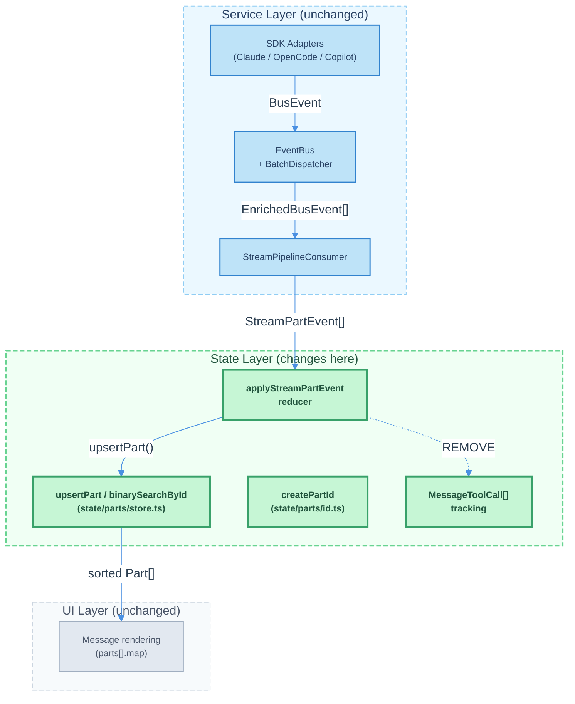

# OpenCode Streaming Order Architecture Alignment

| Document Metadata      | Details                                                             |
| ---------------------- | ------------------------------------------------------------------- |
| Author(s)              | lavaman131                                                          |
| Status                 | Draft (WIP)                                                         |
| Team / Owner           | Atomic CLI                                                          |
| Created / Last Updated | 2026-03-18                                                          |
| Research Reference     | `research/docs/2026-03-18-opencode-streaming-order-architecture.md` |

## 1. Executive Summary

This spec proposes aligning the Atomic CLI streaming pipeline's part ordering strategy with OpenCode's proven model: **monotonic ascending IDs + consistent sorted insertion**. Today, the Atomic CLI reducer uses a mixed strategy — some code paths use binary search insertion (`upsertPart`), while others use simple `push()`. This inconsistency risks ordering bugs when events arrive out of sequence or when multiple parts are created within the same millisecond. The proposal standardizes all part insertion through the existing `upsertPart()` binary search path, eliminates the legacy `MessageToolCall[]` parallel tracking, and hardens the part ID generator to match OpenCode's robustness guarantees. These changes are confined to the state and service layers and require no UI-layer modifications.

<EXTREMELY_IMPORTANT>
If you run into any ambiguities during implementation, refer to the OpenCode codebase (`~/Documents/opencode`) to see how they implemented the same patterns.
</EXTREMELY_IMPORTANT>

## 2. Context and Motivation

### 2.1 Current State

The streaming pipeline transforms SDK events into UI-renderable `ChatMessage` state through a multi-stage pipeline:

```
SDK Adapters → EventBus → BatchDispatcher (16ms coalescing) → StreamPipelineConsumer → applyStreamPartEvent reducer → ChatMessage.parts[]
```

**Research reference:** Sections 9-15 of the research document detail the existing Atomic CLI pipeline architecture, including the 30 typed `BusEvent` types, three SDK adapters (Claude, OpenCode, Copilot), double-buffer batching with two-level coalescing, and the `StreamPipelineConsumer` mapping layer.

Key components already in place:
- **`createPartId()`** (`state/parts/id.ts:20-24`): Generates monotonic IDs with format `part_<12-hex-timestamp>_<4-hex-counter>` — analogous to OpenCode's `PartID.ascending()` (research Section 1)
- **`upsertPart()`** (`state/parts/store.ts:42-53`): Binary search insertion via `binarySearchById()` — analogous to OpenCode's client-side `Binary.search()` (research Section 5)
- **`BatchDispatcher`** (`services/events/batch-dispatcher.ts:90`): 16ms double-buffer swap with coalescing — analogous to OpenCode's 16ms batching window (research Section 6)
- **Unified `ToolPart`** (`state/parts/types.ts:71-93`): State machine with `pending → running → completed | error | interrupted` — analogous to OpenCode's `ToolState` (research Section 3)

### 2.2 The Problem

Despite having the right building blocks, the `applyStreamPartEvent` reducer (`state/streaming/pipeline.ts:70-365`) uses **inconsistent insertion strategies** across event types:

| Code Path                            | Insertion Method                   | Risk              |
| ------------------------------------ | ---------------------------------- | ----------------- |
| `tool-start` (new tool)              | `upsertPart()` (binary search)     | Correct           |
| `tool-complete` (orphan)             | `upsertPart()` (binary search)     | Correct           |
| `tool-hitl-request` (new)            | `upsertPart()` (binary search)     | Correct           |
| `task-result-upsert` (new)           | `upsertPart()` (binary search)     | Correct           |
| `text-delta` (new text part)         | `parts.push()` (tail append)       | **Ordering risk** |
| `thinking-meta` (new reasoning part) | `parts.splice()` or `parts.push()` | **Ordering risk** |
| `task-list-update` (new)             | `parts.push()` (tail append)       | **Ordering risk** |

**Research reference:** Section 5 of the research document describes OpenCode's consistent approach — **all** part insertions go through `Binary.search()` for sorted placement. Section 16 explicitly identifies this as the actionable model for Atomic CLI: "Implement in part store or use existing `applyStreamPartEvent` reducer."

The `push()` paths work correctly *most of the time* because `createPartId()` generates monotonically increasing IDs, so a `push()` is equivalent to binary search insertion at the tail. However, they break when:

1. **Batched events arrive out of creation order**: The `BatchDispatcher` coalesces events within a 16ms window. If a `tool-start` event (which uses `upsertPart`) creates a part, and a subsequent `text-delta` (which uses `push`) creates a new `TextPart` in the same batch, the text part will be appended after any later-ID parts that were already inserted via binary search.

2. **Sub-agent events interleave**: When parallel agents produce events concurrently, the `push()` path appends in arrival order rather than creation order. The binary search path would insert at the correct chronological position.

3. **Session resume / history hydration**: When parts are loaded from persistence, they're sorted by ID. If the live ordering differs from the ID-based ordering (due to `push` during streaming), the UI will "jump" on session resume.

**Additional technical debt:**

- **Legacy `MessageToolCall[]`** (`ChatMessage.toolCalls`): A parallel array maintained by `upsertToolCallStart`/`upsertToolCallComplete` in `pipeline-tools/tool-calls.ts`. This duplicates the tool lifecycle already tracked by `ToolPart` in `parts[]`. The `syncToolCallsIntoParts()` function exists solely to reconcile these two representations for history-loaded messages.

- **Part ID counter width**: The current `globalPartCounter` in `createPartId()` is a monotonically increasing module-level variable that never resets (except in tests). With 4 hex digits (max 65,535), it theoretically overflows in long-running sessions. OpenCode uses 12 bits for the counter (max 4,096 per millisecond) but resets per-millisecond, which is a different trade-off.

## 3. Goals and Non-Goals

### 3.1 Functional Goals

- [ ] **G1**: All part insertions in `applyStreamPartEvent` use `upsertPart()` binary search — no direct `push()` or `splice()` for new parts
- [ ] **G2**: `ChatMessage.parts[]` is always sorted by `PartId` (lexicographic = chronological)
- [ ] **G3**: Remove the legacy `MessageToolCall[]` parallel tracking from the streaming pipeline
- [ ] **G4**: Harden `createPartId()` to prevent counter overflow in long-running sessions
- [ ] **G5**: Streaming order matches session-resume order — no visual "jumps" when reloading a conversation

### 3.2 Non-Goals (Out of Scope)

- [ ] We will NOT change the `BatchDispatcher` coalescing strategy or flush interval
- [ ] We will NOT change the `BusEvent` type system or adapter implementations
- [ ] We will NOT change the UI rendering layer (`<For>` loop over `parts[]`)
- [ ] We will NOT implement persistence (SQLite) for parts — this is a future concern
- [ ] We will NOT change the `StreamPipelineConsumer` mapping layer or `EventHandlerRegistry`
- [ ] We will NOT address the `tui-layout-streaming-content-ordering` spec's UI segment ordering (separate concern)

## 4. Proposed Solution (High-Level Design)

### 4.1 System Architecture Diagram

The changes are confined to the **state layer** (shaded region). The service layer (adapters, bus, dispatcher, consumer) and UI layer remain unchanged.



### 4.2 Architectural Pattern

We are adopting OpenCode's **"Ordering as Emergent Property"** pattern (research Section 16, Key Insight):

> Ordering is an emergent property of monotonic IDs + sorted insertion, not explicit sequence numbers.

This eliminates the need for any explicit sequence tracking, position hints, or creation-time sorting. The ID generation function and the binary search insertion function together guarantee that `parts[]` is always in chronological order.

### 4.3 Key Components

| Component                       | Change                                                                                         | Justification                                                                                       |
| ------------------------------- | ---------------------------------------------------------------------------------------------- | --------------------------------------------------------------------------------------------------- |
| `applyStreamPartEvent` reducer  | Route all new-part creation through `upsertPart()`                                             | Eliminates ordering inconsistency (research Section 5)                                              |
| `createPartId()`                | Adopt OpenCode's composite encoding (`timestamp * 0x1000 + counter`) with per-ms counter reset | Prevents counter overflow; matches OpenCode's `Identifier.ascending()` exactly (research Section 1) |
| `handleTextDelta()`             | Use `upsertPart()` instead of `push()` for new TextParts                                       | Consistent sorted insertion                                                                         |
| `upsertThinkingMeta()`          | Use `upsertPart()` instead of `splice()`/`push()` for new ReasoningParts                       | Consistent sorted insertion                                                                         |
| `pipeline.ts` task-list handler | Use `upsertPart()` instead of `push()` for new TaskListParts                                   | Consistent sorted insertion                                                                         |
| `MessageToolCall[]` tracking    | Remove entirely — field, functions, and `syncToolCallsIntoParts()`                             | Eliminates dual-tracking technical debt completely                                                  |

## 5. Detailed Design

### 5.1 Standardize Part Insertion via `upsertPart()`

**Affected files:**
- `src/state/parts/handlers.ts` — `handleTextDelta()`
- `src/state/streaming/pipeline-thinking.ts` — `upsertThinkingMeta()`
- `src/state/streaming/pipeline.ts` — `task-list-update` handler

**Change:** Replace all `parts.push(newPart)` and positional `parts.splice(index, 0, newPart)` calls with `upsertPart(parts, newPart)`.

#### 5.1.1 `handleTextDelta()` (`state/parts/handlers.ts:21-52`)

Current behavior (lines 42-51): When no streaming `TextPart` exists or a paragraph break requires a new part, a new `TextPart` is created with `createPartId()` and appended via `parts.push(newPart)`.

Proposed change:
```typescript
// Before:
parts.push(newPart);

// After:
upsertPart(parts, newPart);
```

Since `createPartId()` generates a monotonically increasing ID, `upsertPart()` will insert at the tail in the common case (O(log n) binary search confirms tail position). This has negligible performance impact while guaranteeing correct ordering when events arrive out of sequence.

#### 5.1.2 `upsertThinkingMeta()` (`state/streaming/pipeline-thinking.ts:193-277`)

Current behavior: For new reasoning parts, the function either:
- Splices before the first text part (line 259): `parts.splice(firstTextIndex, 0, reasoningPart)`
- Pushes at the end (line 264): `parts.push(reasoningPart)`

Proposed change: Replace both with `upsertPart(parts, reasoningPart)`. The monotonic ID ensures the reasoning part sorts to the correct position. Since reasoning events arrive *before* their associated text events (the AI SDK emits `reasoning-start` before `text-start`), the reasoning part's ID will be smaller than any subsequent text part's ID, naturally placing it before text parts without explicit positional logic.

Note: The current `splice(firstTextIndex, 0, ...)` logic is a heuristic that assumes reasoning should appear before text. With monotonic IDs and sorted insertion, this becomes unnecessary — the ID-based ordering achieves the same result naturally.

#### 5.1.3 `task-list-update` handler (`state/streaming/pipeline.ts:333-357`)

Current behavior (line 354): When no `TaskListPart` exists, `parts.push(taskListPart)` appends a new one.

Proposed change:
```typescript
// Before:
parts.push(taskListPart);

// After:
upsertPart(parts, taskListPart);
```

### 5.2 Harden Part ID Generation — Adopt OpenCode's Composite Encoding

**Affected file:** `src/state/parts/id.ts`

**Research reference:** Section 1 describes OpenCode's encoding: `BigInt(Date.now()) * 0x1000 + counter` where `counter` resets to 0 when the millisecond changes. The composite value is serialized as 12 hex characters (48 bits), encoding both timestamp and counter in a single number.

**Decision (Q3 resolved):** Adopt OpenCode's composite encoding strategy. Combine timestamp and counter into a single composite number rather than keeping the two-segment `timestamp_counter` format. This is more compact and directly mirrors the proven OpenCode model.

**Current implementation** (`id.ts:14-24`):
```typescript
let globalPartCounter = 0;

export function createPartId(): PartId {
  const timestamp = Date.now();
  const counter = globalPartCounter++;
  return `part_${timestamp.toString(16).padStart(12, "0")}_${counter.toString(16).padStart(4, "0")}`;
}
```

**Proposed change:**
```typescript
let lastPartTimestamp = 0;
let partCounter = 0;

export function createPartId(): PartId {
  const timestamp = Date.now();
  if (timestamp !== lastPartTimestamp) {
    lastPartTimestamp = timestamp;
    partCounter = 0;
  }
  const counter = partCounter++;
  // Encode timestamp + counter as a single composite: timestamp shifted left 12 bits + counter
  // This gives 12 bits (4096 IDs) per millisecond — matching OpenCode's Identifier.ascending()
  const composite = BigInt(timestamp) * BigInt(0x1000) + BigInt(counter);
  return `part_${composite.toString(16).padStart(12, "0")}` as PartId;
}
```

This change:
1. **Adopts OpenCode's composite encoding** — `timestamp * 0x1000 + counter` in a single 48-bit number (research Section 1)
2. **Resets the counter per millisecond** — eliminates the theoretical overflow; supports up to 4,096 parts per millisecond
3. **Simplifies the ID format** — single segment `part_<12-hex-composite>` instead of `part_<timestamp>_<counter>`
4. **Preserves lexicographic = chronological invariant** — the composite value increases monotonically
5. **Format change**: IDs change from `part_XXXXXXXXXXXX_YYYY` to `part_XXXXXXXXXXXX`. The `binarySearchById()` function compares by string, so the new shorter format is compatible. Existing parts with the old format will sort correctly relative to new parts since the old format's timestamp segment is the same length.

**Note:** The `_resetPartCounter()` test utility must be updated to reset `lastPartTimestamp` as well.

### 5.3 Remove Legacy `MessageToolCall[]` Entirely

**Affected files:**
- `src/state/streaming/pipeline-tools/tool-calls.ts` — `upsertToolCallStart()`, `upsertToolCallComplete()`, `syncToolCallsIntoParts()` (all removed)
- `src/state/streaming/pipeline.ts` — calls to tool-call functions in `tool-start` and `tool-complete` handlers
- `ChatMessage` type definition — remove `toolCalls` field entirely

**Research reference:** Section 3 describes OpenCode's unified model: "OpenCode does NOT use separate 'tool call' and 'tool result' entities. A single `ToolPart` transitions through states." The Atomic CLI's `ToolPart` already follows this pattern, making the parallel `MessageToolCall[]` redundant.

**Decision (Q1 resolved):** Remove the `toolCalls` field from `ChatMessage` entirely, not just deprecate it. This eliminates the dual-tracking debt completely.

**Decision (Q4 resolved):** Remove `syncToolCallsIntoParts()` without a data migration. History is treated as ephemeral — old messages that only had `toolCalls[]` without `parts[]` will lose tool display. This is acceptable given the current persistence model.

**Change:**
1. Remove calls to `upsertToolCallStart()` and `upsertToolCallComplete()` from the `tool-start` and `tool-complete` handlers in `pipeline.ts`
2. Delete the `toolCalls` field from the `ChatMessage` type
3. Delete `syncToolCallsIntoParts()` — no longer needed since history is ephemeral
4. Delete `upsertToolCallStart()` and `upsertToolCallComplete()` functions
5. Audit and update all consumers that read `message.toolCalls` to use `message.parts.filter(p => p.type === "tool")` instead

### 5.4 Thinking Part Ordering Invariant

**Affected file:** `src/state/streaming/pipeline-thinking.ts`

The current `upsertThinkingMeta()` contains logic to position reasoning parts before text parts using manual `splice()`. After standardizing on `upsertPart()`, this positional logic can be removed. However, we must verify the invariant holds:

**Invariant:** For a given stream, reasoning events always arrive before their associated text events. The AI SDK emits:
```
reasoning-start → reasoning-delta(s) → reasoning-end → text-start → text-delta(s) → text-end
```
(Research Section 2, Event-to-Part Mapping table)

Since `createPartId()` is called at reasoning-start time (before text-start), the reasoning part's ID is always smaller than the subsequent text part's ID. `upsertPart()` binary search insertion naturally places the reasoning part before the text part.

**Change:** Remove the `firstTextIndex` scan and conditional `splice()` logic in `upsertThinkingMeta()`. Replace with `upsertPart(parts, reasoningPart)`.

### 5.5 Agent-Scoped Part Insertion

**Affected file:** `src/state/streaming/pipeline.ts` — agent-scoped `text-delta` handler (lines 76-116)

Agent-scoped parts are stored in `AgentPart.inlineParts[]`, routed via `routeToAgentInlineParts()`.

**Decision (Q2 resolved):** Keep `push()` for agent-scoped `inlineParts[]`. Agent-scoped events are already filtered by `agentId`, so ordering issues from cross-agent interleaving do not apply. The simpler `push()` is sufficient for single-agent event streams.

**No change needed:** Agent-scoped `inlineParts[]` will continue to use `push()` for new part creation.

### 5.6 `finalizeLastStreamingTextPart` Boundary Preservation

**Affected file:** `src/state/streaming/pipeline-thinking.ts:13-26`

The `finalizeLastStreamingTextPart()` function sets `isStreaming: false` on the last streaming `TextPart`, creating a boundary so that subsequent text deltas after a tool completes create a new `TextPart`. This function uses `findLastPartIndex()` which performs a reverse linear scan.

**No change needed:** This function does not insert parts — it only mutates an existing part's `isStreaming` flag. The linear scan is appropriate since we need the *last* streaming text part regardless of ID ordering (and in a correctly ordered array, the last streaming text part is always near the tail).

## 6. Alternatives Considered

| Option                                              | Pros                                                                                 | Cons                                                                                                | Reason for Rejection                                                                                        |
| --------------------------------------------------- | ------------------------------------------------------------------------------------ | --------------------------------------------------------------------------------------------------- | ----------------------------------------------------------------------------------------------------------- |
| **A: Explicit sequence numbers**                    | Clear ordering intent, no ID-encoding dependency                                     | Additional field on every part, must be tracked and incremented, sync issues across parallel agents | OpenCode's research (Section 16) demonstrates that explicit sequences are unnecessary when IDs encode order |
| **B: Keep `push()` with post-sort**                 | Minimal code change, sort once after batch                                           | O(n log n) per batch instead of O(log n) per insert, visible reordering during streaming            | Causes UI flicker as parts shift position during sort                                                       |
| **C: Keep current mixed strategy**                  | No code change                                                                       | Ordering bugs in edge cases (batched out-of-order events, parallel agents, session resume mismatch) | Actively causes known bugs (Section 2.2)                                                                    |
| **D: Adopt `upsertPart()` consistently (Selected)** | O(log n) insertion, always-sorted array, matches OpenCode model, minimal code change | Slightly more function call overhead than `push()`                                                  | **Selected:** Correctness guarantee outweighs negligible overhead                                           |

## 7. Cross-Cutting Concerns

### 7.1 Performance

- **Binary search insertion** is O(log n) per part, where n is the number of parts in a message. For a typical message with 10-50 parts, this is negligible (< 0.01ms).
- **Array splice** (triggered by binary search insertion at a non-tail position) is O(n) due to element shifting. This is acceptable for arrays of < 100 elements and occurs only when events arrive out of order.
- **Net impact**: The `push()` → `upsertPart()` change adds ~1-2 microseconds per part creation. The BatchDispatcher's 16ms flush interval makes this invisible.

### 7.2 Testing Strategy

- **Unit tests for `createPartId()`**: Verify per-millisecond counter reset, lexicographic ordering invariant, ID format
- **Unit tests for `upsertPart()`**: Already exist in `state/parts/store.ts` — extend with edge cases for out-of-order insertion
- **Unit tests for `applyStreamPartEvent`**: Verify that all event types produce correctly ordered `parts[]` — including scenarios with interleaved tool and text events, concurrent agent events, and orphan completions
- **Regression test**: Simulate a batch of events where `text-delta` (new part) and `tool-start` (new part) arrive in the same 16ms window — verify parts are ordered by ID, not arrival order
- **Property test**: Generate random sequences of `StreamPartEvent` objects and verify that `parts[]` is always sorted by `PartId` after reduction

### 7.3 Backward Compatibility

IMPORTANT: There should be NO backward compatibility considered. This is a fast-paced project so REMOVE and AVOID ADDING any backwards compat code along the way.

- **Session history**: History is treated as ephemeral. Old messages with only `toolCalls[]` (no `parts[]`) will lose tool display after the `toolCalls` field is removed. This is acceptable given the current non-persistent model.
- **Part ID format**: The ID format changes from `part_<timestamp>_<counter>` to `part_<composite>`. Old and new IDs are lexicographically compatible — old IDs sort correctly relative to new IDs because the timestamp portion is the most significant segment in both formats.
- **UI layer**: No changes — the `<For>` loop iterates `parts[]` in array order, which is now guaranteed to be ID order.
- **Telemetry/logging**: No changes — event types and payload shapes are unchanged.

## 8. Migration, Rollout, and Testing

### 8.1 Deployment Strategy

- [ ] **Phase 1**: Harden `createPartId()` with per-millisecond counter reset — pure internal change, no behavior difference in normal operation
- [ ] **Phase 2**: Standardize all part insertion through `upsertPart()` — replaces `push()`/`splice()` in `handleTextDelta`, `upsertThinkingMeta`, and `task-list-update` handler
- [ ] **Phase 3**: Remove `MessageToolCall[]` entirely — delete `toolCalls` field, `syncToolCallsIntoParts()`, `upsertToolCallStart/Complete`, audit and migrate all consumers
- [ ] **Phase 4**: Remove positional heuristics in `upsertThinkingMeta()` — simplifies thinking part insertion logic

### 8.2 Test Plan

- **Unit Tests:**
  - `createPartId()` counter reset behavior
  - `upsertPart()` with out-of-order IDs
  - `applyStreamPartEvent()` ordering invariants for all 13 event types
  - `handleTextDelta()` creates correctly-positioned parts via `upsertPart()`
  - `upsertThinkingMeta()` creates correctly-positioned reasoning parts via `upsertPart()`
  - Verify `MessageToolCall[]` is not populated during streaming after Phase 3
- **Integration Tests:**
  - Full pipeline: simulated BusEvent batch → StreamPipelineConsumer → reducer → verify `parts[]` ordering
  - Multi-agent scenario: interleaved events from two parallel agents → verify ordering
  - Session resume: compare live ordering with hydrated ordering
- **E2E Tests:**
  - Stream a multi-tool conversation → verify parts render in chronological order
  - Abort mid-stream → verify orphaned tools are finalized and parts remain ordered

## 9. Open Questions / Unresolved Issues

- [x] **Q1 (Resolved)**: Remove `toolCalls` field from `ChatMessage` entirely. Eliminates dual-tracking debt completely.
- [x] **Q2 (Resolved)**: Keep `push()` for agent-scoped `inlineParts[]`. Agent events are filtered by `agentId`, making ordering issues from cross-agent interleaving inapplicable.
- [x] **Q3 (Resolved)**: Adopt OpenCode's composite encoding (`timestamp * 0x1000 + counter` as a single 48-bit number). More compact and directly mirrors the proven model.
- [x] **Q4 (Resolved)**: Remove `syncToolCallsIntoParts()` without data migration. History is ephemeral — old messages without `parts[]` will lose tool display, which is acceptable.
