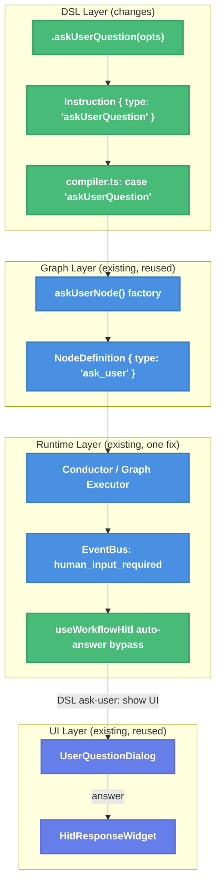

# askUserQuestion() DSL Node Type — Technical Design Document

| Document Metadata      | Details      |
| ---------------------- | ------------ |
| Author(s)              | lavaman131   |
| Status                 | Draft (WIP)  |
| Team / Owner           | Workflow DSL |
| Created / Last Updated | 2026-03-23   |

## 1. Executive Summary

This spec proposes adding an `askUserQuestion()` node type to the workflow DSL, enabling workflow authors to pause execution and present interactive questions to users via the existing HITL (Human-in-the-Loop) UI. The DSL currently supports two node types — `stage` (agent sessions) and `tool` (deterministic functions) — but has no built-in way to request user input mid-workflow. A graph-level `askUserNode()` factory and full HITL UI system (`UserQuestionDialog`, `HitlResponseWidget`) already exist but are not exposed through the DSL. This spec covers the new `AskUserQuestionOptions` type, `Instruction` union variant, builder method, compiler support, auto-answer bypass fix, and test plan.

## 2. Context and Motivation

### 2.1 Current State

The workflow DSL (`src/services/workflows/dsl/`) provides a chainable builder API for defining multi-stage workflows. The builder records an ordered list of `Instruction` values that the compiler transforms into a `CompiledGraph` for the conductor to execute.

**Current DSL node types:**
- **`stage`**: Agent sessions with prompt/outputMapper — produces `StageDefinition` entries and `"agent"` graph nodes
- **`tool`**: Deterministic functions — produces `"tool"` graph nodes only (no `StageDefinition`)

**Existing graph-level infrastructure** (not DSL-exposed):
- `askUserNode()` factory in `src/services/workflows/graph/nodes/control.ts:179-225` — creates `"ask_user"` type `NodeDefinition` with question/answer semantics
- `"ask_user"` is already a valid `NodeType` in the union at `contracts/core.ts:10`
- Full HITL UI pipeline: `UserQuestionDialog` (interactive question dialog), `HitlResponseWidget` (post-answer display), event bus wiring via `stream.human_input_required`

**Architecture flow (from research doc):**
```
defineWorkflow(options)
  → WorkflowBuilder
    → .stage(StageOptions)   → Instruction { type: "stage", id, config }
    → .tool(ToolOptions)     → Instruction { type: "tool", id, config }
    → .compile()
      → compileWorkflow(builder)
        → validateInstructions()
        → generateStageDefinitions()  // only "stage" → StageDefinition[]
        → generateGraph()             // "stage" → agent node, "tool" → tool node
        → createStateFactory()
        → WorkflowDefinition { conductorStages, createConductorGraph, ... }
```

### 2.2 The Problem

- **No DSL-level user interaction**: Workflow authors cannot request structured user input mid-execution. The only option is writing custom graph definitions using the low-level `askUserNode()` factory, which defeats the purpose of the simplified DSL.
- **Workflow auto-answer bypass**: The current `useWorkflowHitl` hook (lines 321-329) auto-answers all HITL questions when `workflowActive` is true, using the first option's label or `"continue"`. This makes the graph-level `askUserNode` useless within workflows — questions never reach the UI.
- **Guard gap**: The `isNodeType()` runtime guard at `contracts/guards.ts:12-17` omits `"ask_user"` from its includes array, which could cause issues if the conductor uses this guard for node type validation.

**Reference:** [Research: askUserQuestion() DSL Node Type](../research/docs/2026-03-23-ask-user-question-dsl-node-type.md)

## 3. Goals and Non-Goals

### 3.1 Functional Goals

- [ ] Expose a `.askUserQuestion(options)` builder method on `WorkflowBuilderInterface` that records an `askUserQuestion` instruction
- [ ] Define an `AskUserQuestionOptions` type with question, header, options, multi-select, and answer-to-state mapping
- [ ] Support both static and dynamic question options (function of current workflow state)
- [ ] Compile `askUserQuestion` instructions into `"ask_user"` graph nodes that reuse the existing `askUserNode()` factory
- [ ] Bypass the workflow auto-answer logic for DSL-level ask-user nodes so questions reach the `UserQuestionDialog` UI
- [ ] Map the user's answer back into workflow state via a configurable `onAnswer` callback
- [ ] Fix the `isNodeType()` guard to include `"ask_user"`
- [ ] Allow `askUserQuestion()` inside conditional blocks (`.if()` / `.else()`)
- [ ] Allow `askUserQuestion()` inside loop blocks (`.loop()` / `.endLoop()`)
- [ ] Validate `askUserQuestion` nodes with the same uniqueness rules as `stage` and `tool` nodes
- [ ] Render question text as markdown in `UserQuestionDialog` and `HitlResponseWidget`, consistent with the rest of the TUI

### 3.2 Non-Goals (Out of Scope)

- [ ] We will NOT build new HITL UI components — the existing `UserQuestionDialog` and `HitlResponseWidget` are reused with a targeted rendering upgrade (markdown)
- [ ] We will NOT add "chat about this" custom handling at the DSL level — the existing dialog already supports it
- [ ] We will NOT change the graph-level `askUserNode()` factory — the DSL compiler will call it directly
- [ ] We will NOT modify the conductor's execution logic — `"ask_user"` nodes are already handled as non-agent nodes executed through the graph executor

## 4. Proposed Solution (High-Level Design)

### 4.1 System Architecture Diagram



### 4.2 Architectural Pattern

The design follows the existing **Instruction Recording + Compiler Transformation** pattern established by `stage` and `tool` nodes. The DSL builder records an instruction, the compiler transforms it into a graph node using the existing factory, and the runtime executes it through the existing pipeline.

### 4.3 Key Components

| Component                           | Responsibility                             | Location                                     | Change Type  |
| ----------------------------------- | ------------------------------------------ | -------------------------------------------- | ------------ |
| `AskUserQuestionOptions`            | DSL-level config type for ask-user nodes   | `dsl/types.ts`                               | **New**      |
| `Instruction` union                 | New `"askUserQuestion"` variant            | `dsl/types.ts`                               | **Modified** |
| `WorkflowBuilderInterface`          | New `.askUserQuestion()` method            | `dsl/types.ts`                               | **Modified** |
| `WorkflowBuilder`                   | Records `askUserQuestion` instructions     | `dsl/define-workflow.ts`                     | **Modified** |
| `compileWorkflow` / `generateGraph` | New `case "askUserQuestion"` handler       | `dsl/compiler.ts`                            | **Modified** |
| `validateInstructions`              | Include `"askUserQuestion"` in node checks | `dsl/compiler.ts`                            | **Modified** |
| `isNodeType()` guard                | Add `"ask_user"` to includes array         | `graph/contracts/guards.ts`                  | **Modified** |
| `useWorkflowHitl`                   | Bypass auto-answer for DSL ask-user nodes  | `state/chat/controller/use-workflow-hitl.ts` | **Modified** |
| `UserQuestionDialog`                | Render question text as markdown           | `components/user-question-dialog.tsx`        | **Modified** |
| `HitlResponseWidget`               | Render question text as markdown           | `components/hitl-response-widget.tsx`        | **Modified** |

## 5. Detailed Design

### 5.1 Type Definitions (`dsl/types.ts`)

#### 5.1.1 `AskUserQuestionOptions`

```ts
/**
 * Configuration for an ask-user-question node — pauses workflow execution
 * and presents an interactive question dialog to the user.
 *
 * Reuses the existing HITL UI (UserQuestionDialog) and event pipeline.
 */
export interface AskUserQuestionOptions {
  /** Unique name for this ask-user node within the workflow. */
  readonly name: string;

  /**
   * The question configuration, or a function that builds it from
   * current workflow state for dynamic questions.
   */
  readonly question:
    | AskUserQuestionConfig
    | ((state: BaseState) => AskUserQuestionConfig);

  /** Brief description of the node's purpose (used in logging). */
  readonly description?: string;

  /**
   * Maps the user's answer into structured state updates.
   * Receives the raw answer string (or array for multi-select)
   * and returns a record merged into workflow state.
   *
   * If omitted, the answer is stored in `state.outputs[nodeId]`.
   */
  readonly onAnswer?: (answer: string | string[]) => Record<string, unknown>;

  /**
   * State field names that this node reads from.
   * Used for documentation and future dependency analysis.
   */
  readonly reads?: string[];

  /**
   * State field names that this node writes to.
   * Used for documentation and future dependency analysis.
   */
  readonly outputs?: string[];
}

/**
 * Question configuration for the UserQuestionDialog.
 * Maps directly to the existing AskUserOptions from the graph layer.
 */
export interface AskUserQuestionConfig {
  /** The question text displayed to the user. */
  readonly question: string;

  /** Optional header badge text (e.g., "Review Required"). */
  readonly header?: string;

  /** Predefined answer options. If omitted, only free-text input is available. */
  readonly options?: ReadonlyArray<{
    readonly label: string;
    readonly description?: string;
  }>;

  /**
   * Whether the user can select multiple options.
   * When true, the dialog shows checkboxes and the answer is a string[].
   * @default false
   */
  readonly multiSelect?: boolean;
}
```

#### 5.1.2 `Instruction` Union Extension

```ts
export type Instruction =
  | { readonly type: "stage"; readonly id: string; readonly config: StageOptions }
  | { readonly type: "tool"; readonly id: string; readonly config: ToolOptions }
  | { readonly type: "askUserQuestion"; readonly id: string; readonly config: AskUserQuestionOptions }
  | { readonly type: "if"; readonly condition: (ctx: StageContext) => boolean }
  | { readonly type: "elseIf"; readonly condition: (ctx: StageContext) => boolean }
  | { readonly type: "else" }
  | { readonly type: "endIf" }
  | { readonly type: "loop"; readonly config: LoopOptions }
  | { readonly type: "endLoop" }
  | { readonly type: "break"; readonly condition?: () => (state: BaseState) => boolean };
```

#### 5.1.3 `WorkflowBuilderInterface` Extension

```ts
export interface WorkflowBuilderInterface {
  // ... existing methods ...

  /**
   * Add a human-in-the-loop question node to the workflow.
   * Pauses execution and presents an interactive question dialog.
   * The user's answer is mapped into workflow state via `onAnswer`.
   *
   * @param options - Question configuration (name, question, options, onAnswer, etc.).
   * @throws Error if `options.name` duplicates an existing node name.
   */
  askUserQuestion(options: AskUserQuestionOptions): this;

  // ... rest of interface ...
}
```

### 5.2 Builder Method (`dsl/define-workflow.ts`)

```ts
/**
 * Add a human-in-the-loop question node to the workflow.
 * @param options - Question configuration.
 * @throws Error if `options.name` duplicates an existing node name.
 */
askUserQuestion(options: AskUserQuestionOptions): this {
  if (this.nodeNames.has(options.name)) {
    throw new Error(
      `Duplicate node name: "${options.name}". Each node must have a unique name within the workflow.`,
    );
  }
  this.nodeNames.add(options.name);
  this.instructions.push({ type: "askUserQuestion", id: options.name, config: options });
  return this;
}
```

### 5.3 Compiler Changes (`dsl/compiler.ts`)

#### 5.3.1 Validation

Update `validateInstructions` to include `"askUserQuestion"` as a valid node type:

```ts
// In the hasNode check:
const hasNode = instructions.some(
  (i) => i.type === "stage" || i.type === "tool" || i.type === "askUserQuestion",
);

// In the switch statement for duplicate ID checking:
case "stage":
case "tool":
case "askUserQuestion":
  if (nodeIds.has(instruction.id)) {
    throw new Error(`Duplicate node ID: "${instruction.id}"`);
  }
  nodeIds.add(instruction.id);
  break;
```

Also update `validateBranchesNotEmpty` to count `askUserQuestion` as a valid node in conditional branches:

```ts
case "stage":
case "tool":
case "askUserQuestion":
  if (currentDepth > 0) {
    branchHasNode[currentDepth] = true;
  }
  break;
```

#### 5.3.2 Graph Generation

Add a new case in `generateGraph()` that delegates to the existing `askUserNode()` factory:

```ts
import { askUserNode } from "@/services/workflows/graph/nodes/control.ts";
import type { AskUserQuestionOptions } from "@/services/workflows/dsl/types.ts";

// Inside generateGraph() switch:
case "askUserQuestion": {
  const config = instruction.config as AskUserQuestionOptions;
  const questionOptions = config.question;
  const onAnswer = config.onAnswer;

  // Create an ask_user node using the existing factory
  const askNode = askUserNode({
    id: instruction.id,
    options: typeof questionOptions === "function"
      ? (state) => {
          const resolved = questionOptions(state);
          return {
            question: resolved.question,
            header: resolved.header,
            options: resolved.options ? [...resolved.options] : undefined,
          };
        }
      : {
          question: questionOptions.question,
          header: questionOptions.header,
          options: questionOptions.options ? [...questionOptions.options] : undefined,
        },
    name: config.name,
    description: config.description,
  });

  // Wrap the execute function to apply onAnswer state mapping
  if (onAnswer) {
    const originalExecute = askNode.execute;
    askNode.execute = async (ctx) => {
      const result = await originalExecute(ctx);
      // The onAnswer mapping will be applied when the answer is received
      // Store the mapper reference in the node result data for the conductor
      return {
        ...result,
        metadata: { onAnswer },
      };
    };
  }

  nodes.set(instruction.id, askNode);
  connectPrevious(instruction.id);
  previousNodeId = instruction.id;
  break;
}
```

#### 5.3.3 Stage Definition Generation

Like tool nodes, `askUserQuestion` nodes are **skipped** in `generateStageDefinitions()` — they execute through the graph executor directly, not through the conductor's session-based stage pipeline. No change needed since the existing filter (`instruction.type !== "stage"`) already excludes them.

### 5.4 Auto-Answer Bypass (`use-workflow-hitl.ts`)

The critical behavior change: when a workflow's `askUserQuestion` DSL node emits `human_input_required`, the auto-answer logic must be bypassed so the question reaches the `UserQuestionDialog` UI.

**Approach:** The `AskUserQuestionEventData` emitted by `askUserNode.execute()` includes a `nodeId` field. The compiler can mark DSL-level ask-user nodes by adding a `dslAskUser: true` flag to the event data. The auto-answer handler checks this flag:

```ts
// In use-workflow-hitl.ts, ask-user auto-answer section:
if (workflowStateRef.current.workflowActive) {
  // DSL-level askUserQuestion nodes explicitly request user interaction —
  // do NOT auto-answer them.
  if (eventData.dslAskUser) {
    // Fall through to normal HITL question handling (enqueue for UI)
  } else {
    const autoAnswer = eventData.options?.[0]?.label ?? "continue";
    if (eventData.respond) {
      eventData.respond(autoAnswer);
    } else if (onWorkflowResumeWithAnswer && eventData.requestId) {
      onWorkflowResumeWithAnswer(eventData.requestId, autoAnswer);
    }
    return;
  }
}
```

The compiler sets `dslAskUser: true` on the event data by extending the `askUserNode` execute function to include this flag in the emitted event.

### 5.5 `isNodeType()` Guard Fix (`contracts/guards.ts`)

```ts
export function isNodeType(value: unknown): value is NodeType {
  return (
    typeof value === "string" &&
    ["agent", "tool", "decision", "wait", "ask_user", "subgraph", "parallel"].includes(value)
  );
}
```

### 5.6 `multiSelect` Support

The graph-level `AskUserOptions` interface in `control.ts` will be extended with a `multiSelect` field:

```ts
// In src/services/workflows/graph/nodes/control.ts:
export interface AskUserOptions {
  question: string;
  header?: string;
  options?: AskUserOption[];
  multiSelect?: boolean; // NEW — enables checkbox mode in UserQuestionDialog
}
```

This flows naturally through the existing pipeline: `askUserNode()` factory resolves options → emits via `ctx.emit("human_input_required", eventData)` → `UserQuestionDialog` reads `multiSelect` from the event data to enable checkbox mode. No extra type gymnastics needed.

### 5.7 Answer Routing into State

When the user answers, the `onAnswer` callback maps the answer into state updates:

- **With `onAnswer`**: The callback receives `answer: string | string[]` and returns `Record<string, unknown>` which is merged into workflow state as a `stateUpdate`.
- **Without `onAnswer`**: The raw answer is stored as `state.outputs[nodeId] = answer` (default behavior of the graph executor).

The `onAnswer` callback is invoked in the answer-handling path. The `respond()` callback on `AskUserQuestionEventData` is wrapped to intercept the answer, call `onAnswer`, and apply the resulting state update before resuming execution.

### 5.8 Markdown Rendering in HITL UI

#### Problem

The `UserQuestionDialog` and `HitlResponseWidget` currently render question text as plain `<text>` elements:

```tsx
// UserQuestionDialog (user-question-dialog.tsx:309-311) — CURRENT
<text fg={colors.foreground} attributes={1} wrapMode="word">
  {question.question}
</text>

// HitlResponseWidget (hitl-response-widget.tsx:69-72) — CURRENT
<text wrapMode="word" fg={colors.muted}>
  {"  "}{context.question}
</text>
```

This is inconsistent with the rest of the TUI, where agent output is rendered using OpenTUI's `<markdown>` element with `createMarkdownSyntaxStyle` (see `text-part-display.tsx`, `reasoning-part-display.tsx`). Questions containing code blocks, bold text, links, or lists appear as raw text instead of formatted markdown.

#### Solution

Replace the plain `<text>` question rendering with `<markdown>` in both components, following the same pattern used in `TextPartDisplay`.

**`UserQuestionDialog` change** (`components/user-question-dialog.tsx`):

```tsx
import { useMemo, useEffect } from "react";
import { createMarkdownSyntaxStyle, useTheme, useThemeColors } from "@/theme/index.tsx";
import { normalizeMarkdownNewlines } from "@/lib/ui/format.ts";

// Inside the component:
const { isDark } = useTheme();

const markdownSyntaxStyle = useMemo(
  () => createMarkdownSyntaxStyle(colors, isDark),
  [colors, isDark],
);
useEffect(() => () => { markdownSyntaxStyle.destroy(); }, [markdownSyntaxStyle]);

const normalizedQuestion = useMemo(
  () => normalizeMarkdownNewlines(question.question),
  [question.question],
);

// Replace the plain <text> question rendering with:
<markdown
  content={normalizedQuestion}
  syntaxStyle={markdownSyntaxStyle}
  conceal={true}
/>
```

**`HitlResponseWidget` change** (`components/hitl-response-widget.tsx`):

```tsx
import { useMemo, useEffect } from "react";
import { createMarkdownSyntaxStyle, useTheme, useThemeColors } from "@/theme/index.tsx";
import { normalizeMarkdownNewlines } from "@/lib/ui/format.ts";

// Inside the component:
const { isDark } = useTheme();

const markdownSyntaxStyle = useMemo(
  () => createMarkdownSyntaxStyle(colors, isDark),
  [colors, isDark],
);
useEffect(() => () => { markdownSyntaxStyle.destroy(); }, [markdownSyntaxStyle]);

const normalizedQuestion = useMemo(
  () => normalizeMarkdownNewlines(context.question),
  [context.question],
);

// Replace the plain <text> question rendering with:
{context.question.length > 0 && (
  <box marginLeft={2}>
    <markdown
      content={normalizedQuestion}
      syntaxStyle={markdownSyntaxStyle}
      conceal={true}
    />
  </box>
)}
```

#### Key details

- **`SyntaxStyle` lifecycle**: `createMarkdownSyntaxStyle` returns a native `SyntaxStyle` resource that must be `.destroy()`ed. Following the confirmed codebase pattern (see MEMORY.md), we use `useMemo` for creation + `useEffect` cleanup: `useEffect(() => () => { style.destroy(); }, [style])`.
- **`normalizeMarkdownNewlines`**: Standard preprocessing used by `TextPartDisplay` and `ReasoningPartDisplay` — normalizes line endings for consistent rendering.
- **`conceal: true`**: Hides markdown syntax characters (e.g., `**`, `` ` ``) and shows only the rendered output, matching the rest of the TUI.
- **No `streaming` prop**: Unlike `TextPartDisplay`, HITL questions are static (not streamed), so the `streaming` prop is omitted.
- **Option descriptions remain plain text**: The option labels and descriptions in the scrollable list remain as `<text>` elements — they are short, single-line strings where markdown rendering would add unnecessary overhead.

## 6. Alternatives Considered

| Option                                                      | Pros                                                                                                              | Cons                                                                                                                                      | Reason for Rejection                                                                                |
| ----------------------------------------------------------- | ----------------------------------------------------------------------------------------------------------------- | ----------------------------------------------------------------------------------------------------------------------------------------- | --------------------------------------------------------------------------------------------------- |
| **A: Wrap as a special `.tool()` variant**                  | Minimal type changes, reuses existing tool infrastructure                                                         | Semantically wrong (tools are deterministic), no type safety for question config, requires awkward `execute` function to emit HITL events | Tool nodes are for deterministic computation, not user interaction. Would confuse the mental model. |
| **B: Expose `askUserNode()` factory directly to DSL users** | Zero DSL changes needed                                                                                           | Breaks DSL abstraction — users must understand graph-level `NodeDefinition`, `ExecutionContext`, and signal semantics                     | Defeats the purpose of the simplified DSL. The DSL exists to hide graph internals.                  |
| **C: New `askUserQuestion` instruction type (Selected)**    | Clean separation of concerns, type-safe DSL API, reuses existing graph factory internally, natural builder method | Requires adding a new instruction variant, builder method, and compiler case                                                              | **Selected:** Best balance of type safety, user experience, and internal reuse.                     |

## 7. Cross-Cutting Concerns

### 7.1 State Management

The `AskUserWaitState` fields (`__waitingForInput`, `__waitNodeId`, `__askUserRequestId`) are internal to the `askUserNode` factory and are automatically managed. They do **not** need to be declared in the workflow's `globalState` schema — the graph executor handles them transparently.

### 7.2 Workflow Step Part Display

Ask-user nodes will appear in the workflow step part display (`workflow-step-part-display.tsx`) with their node name, just like stage and tool nodes. The existing `WorkflowStepPart` type already supports any `nodeId` and renders status banners accordingly.

### 7.3 Inline HITL Rendering

The existing `ToolPartDisplay` inline HITL rendering (lines 165-213) uses `isHitlToolName()` to detect HITL tool calls. Ask-user nodes emitted by the DSL will flow through the same event pipeline and be rendered identically.

## 8. Migration, Rollout, and Testing

### 8.1 Deployment Strategy

- [ ] Phase 1: Implement types, builder method, and compiler support. All existing workflows continue to work unchanged.
- [ ] Phase 2: Fix the auto-answer bypass and `isNodeType` guard. No behavioral change for existing workflows that don't use `askUserQuestion`.
- [ ] Phase 3: Add `multiSelect` passthrough and `onAnswer` state mapping. End-to-end integration.

### 8.2 Test Plan

#### Unit Tests (`tests/services/workflows/dsl/types.test.ts`)

- [ ] `AskUserQuestionOptions` accepts minimal config (name + question)
- [ ] `AskUserQuestionOptions` accepts optional fields (header, options, multiSelect, onAnswer, description, reads, outputs)
- [ ] `AskUserQuestionOptions` accepts dynamic question function `(state) => AskUserQuestionConfig`
- [ ] `Instruction` union includes `"askUserQuestion"` variant
- [ ] Exhaustive switch covers all instruction types including `"askUserQuestion"`

#### Unit Tests (`tests/services/workflows/dsl/define-workflow.test.ts`)

- [ ] `.askUserQuestion()` records an instruction with `type: "askUserQuestion"`
- [ ] `.askUserQuestion()` uses `options.name` as instruction ID
- [ ] `.askUserQuestion()` returns `this` for chaining
- [ ] `.askUserQuestion()` throws on duplicate name
- [ ] `.askUserQuestion()` throws when name duplicates a stage or tool name
- [ ] `.askUserQuestion()` config reference is preserved (not cloned)
- [ ] Fluent chaining: stage → askUserQuestion → tool produces correct instruction tape
- [ ] `WorkflowBuilderInterface` includes `askUserQuestion` method

#### Unit Tests (`tests/services/workflows/dsl/compiler.test.ts`)

- [ ] `validateInstructions` accepts `askUserQuestion` as a valid node
- [ ] `validateInstructions` detects duplicate `askUserQuestion` IDs
- [ ] `askUserQuestion` instruction produces an `"ask_user"` type node in the graph
- [ ] `askUserQuestion` node is connected to previous and next nodes
- [ ] `askUserQuestion` inside a conditional block is valid and wired correctly
- [ ] `askUserQuestion` inside a loop block is valid and wired correctly
- [ ] `askUserQuestion` does NOT produce a `StageDefinition`
- [ ] `askUserQuestion` with static question options compiles correctly
- [ ] `askUserQuestion` with dynamic question function compiles correctly
- [ ] Graph with only an `askUserQuestion` node compiles (satisfies "at least one node" check)

#### Guard Fix Tests

- [ ] `isNodeType("ask_user")` returns `true`

#### UI Markdown Rendering Tests

- [ ] `UserQuestionDialog` renders question text using `<markdown>` element (not plain `<text>`)
- [ ] `UserQuestionDialog` creates and destroys `SyntaxStyle` correctly (no resource leak)
- [ ] `HitlResponseWidget` renders question text using `<markdown>` element (not plain `<text>`)
- [ ] `HitlResponseWidget` creates and destroys `SyntaxStyle` correctly (no resource leak)
- [ ] Markdown formatting (bold, code, lists) renders correctly in question text
- [ ] Option labels and descriptions remain as plain text (not markdown-rendered)

#### Integration Tests (Future Phase)

- [ ] End-to-end: workflow with `askUserQuestion` pauses and shows `UserQuestionDialog`
- [ ] End-to-end: user answer is routed back into workflow state via `onAnswer`
- [ ] End-to-end: auto-answer bypass is correctly skipped for DSL ask-user nodes
- [ ] End-to-end: question text with markdown renders formatted in the dialog and response widget

## 9. Open Questions — Resolved

- [x] **Auto-answer signaling mechanism**: **Resolved: `dslAskUser` flag.** The compiler will set `dslAskUser: true` on the `AskUserQuestionEventData` emitted by DSL-compiled ask-user nodes. The `useWorkflowHitl` auto-answer handler checks this flag and falls through to normal HITL question handling when it is present. This is the simplest approach — one boolean check with no new event types or conductor access required.

- [x] **Answer type for `onAnswer`**: **Resolved: Raw `string | string[]`.** The `onAnswer` callback receives the user's selected answer as a simple `string` (single-select) or `string[]` (multi-select). This covers the vast majority of use cases. Cancellation is handled separately (see below) and does not flow through `onAnswer`.

- [x] **Cancellation behavior**: **Resolved: Continue with empty answer.** When the user presses Escape / cancels the question dialog, the workflow treats it as declining — `onAnswer` is called with an empty string `""` and workflow execution continues. This is non-destructive and lets workflow authors handle the "no answer" case in their `onAnswer` callback or downstream logic.

- [x] **`multiSelect` at the graph layer**: **Resolved: Extend `AskUserOptions`.** A `multiSelect?: boolean` field will be added to the graph-level `AskUserOptions` interface so it flows naturally through the existing pipeline (`askUserNode` factory → event data → `UserQuestionDialog`). This is a small, clean change that keeps the type system intact.
