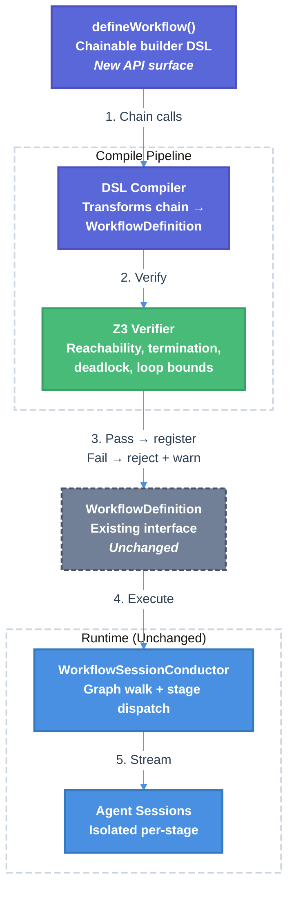

# Workflow SDK Simplification & Z3 Formal Verification

| Document Metadata      | Details     |
| ---------------------- | ----------- |
| Author(s)              | lavaman131  |
| Status                 | Draft (WIP) |
| Team / Owner           | Atomic CLI  |
| Created / Last Updated | 2026-03-21  |

## 1. Executive Summary

This RFC proposes replacing the current multi-file, imperative workflow SDK (~65 files across `services/workflows/`) with a **single-file chainable DSL** and **mandatory Z3 formal verification** at compile-time to guarantee workflow graph correctness. Today, creating a new workflow requires authoring 5-7 files (~1,470 lines for Ralph) spanning state definitions, prompts, stage objects, graph construction, and registration — a significant learning curve. The proposed DSL uses a fluent builder pattern (`defineWorkflow().stage().tool().loop().stage().endLoop().compile()`) where the chain of method calls **is** the graph — reading top-to-bottom reveals the execution flow immediately. `.stage()` creates agent session nodes (LLM reasoning), `.tool()` creates deterministic function nodes (validation, I/O, transforms), and `.if()/.loop()` provide Z3-verifiable control flow. Z3 verification statically proves reachability, termination, deadlock-freedom, and loop bounds before execution. **There is no backward compatibility** — all workflows must use `defineWorkflow()` and pass Z3 verification. Workflows that fail to verify are rejected at load time and displayed as a startup warning (`● Warning: Failed to load workflow: {workflowId}`). This reduces the authoring surface by ~80%, eliminates an entire class of runtime graph errors, and ensures every registered workflow is structurally correct.

**Research basis:** [research/docs/2026-03-21-workflow-sdk-simplification-z3-verification.md](../research/docs/2026-03-21-workflow-sdk-simplification-z3-verification.md)

## 2. Context and Motivation

### 2.1 Current State

The workflow SDK follows a layered architecture with four subsystems in `src/services/workflows/`:

```
services/workflows/
├── graph/           # Graph authoring & compilation (~30 files)
│   ├── authoring/   # Builder DSL (GraphBuilder, conditional-dsl, iteration-dsl)
│   ├── contracts/   # Type contracts (BaseState, CompiledGraph, NodeDefinition)
│   ├── nodes/       # Node type factories (agent, tool, control, parallel, subgraph)
│   ├── runtime/     # Execution state, model resolution
│   └── persistence/ # Checkpointing (4 implementations)
├── conductor/       # Conductor execution engine (~8 files)
├── runtime/executor # Runtime executor layer (~4 files)
└── ralph/           # Ralph workflow definition (~7 files)
```

The `GraphBuilder` class provides a fluent API (`graph<S>().start(a).then(b).if(cond).then(c).endif().end().compile()`) producing a `CompiledGraph<TState>` with `Map<NodeId, NodeDefinition>`, `Edge[]`, `startNode`, and `endNodes`. The conductor walks this graph, dispatching agent nodes to isolated sessions via `StageDefinition` objects and deterministic nodes via their `execute()` functions.

**Key interfaces** (from [research](../research/docs/2026-03-21-workflow-sdk-simplification-z3-verification.md), Section 6):
- `WorkflowDefinition` — Top-level registration shape with `name`, `description`, `conductorStages`, `createConductorGraph()`, `createState()`
- `StageDefinition` — Per-stage contract: `id`, `name`, `indicator`, `buildPrompt(ctx)`, `parseOutput?(response)`, `shouldRun?(ctx)`
- `CompiledGraph<TState>` — Compiled topology: `nodes`, `edges`, `startNode`, `endNodes`, `config`
- `BaseState` — Minimum state: `executionId`, `lastUpdated`, `outputs`

### 2.2 The Problem

**Developer experience:** Creating a new workflow requires understanding the `GraphBuilder` API, conductor system, annotation/reducer pattern, provider registry, and spreading a single workflow across 5-7 files. The Ralph workflow alone spans ~1,470 lines across 7 files for what is fundamentally a 4-stage linear pipeline ([research](../research/docs/2026-03-21-workflow-sdk-simplification-z3-verification.md), Section 2).

**No structural correctness guarantees:** Invalid graph topologies (unreachable nodes, missing terminal paths, deadlocked branching) are only discovered at runtime when the conductor encounters a stuck state or the user observes incomplete execution. The `CompiledGraph` type system ensures shape correctness but not topological validity.

**No-op boilerplate:** Conductor-based workflows require agent nodes with dummy `execute` functions (`agentNoopExecute`) because the conductor bypasses `node.execute()` and dispatches to `StageDefinition` methods instead — a confusing indirection layer.

**Historical precedent:** Multiple prior specs have addressed workflow SDK complexity from different angles:
- [specs/2026-03-02-workflow-sdk-standardization.md](../specs/2026-03-02-workflow-sdk-standardization.md) — Unified `WorkflowSDK` entry point
- [specs/2026-02-05-pluggable-workflows-sdk.md](../specs/2026-02-05-pluggable-workflows-sdk.md) — Entity registry normalization
- [specs/2026-03-18-atomic-v2-rebuild.md](../specs/2026-03-18-atomic-v2-rebuild.md) — Ground-up rebuild reducing graph engine from 8.7K to ~1K lines
- [specs/2026-03-23-ralph-workflow-redesign.md](../specs/2026-03-23-ralph-workflow-redesign.md) — Conductor model replacing compiled-graph engine
- [specs/2026-03-02-unified-workflow-execution.md](../specs/2026-03-02-unified-workflow-execution.md) — Generic workflow execution replacing hardcoded dispatch

This spec builds on these foundations — particularly the conductor model from `ralph-workflow-redesign` and the simplification goals from `atomic-v2-rebuild` — while adding formal verification as a new capability.

## 3. Goals and Non-Goals

### 3.1 Functional Goals

- [ ] **Single-file workflow authoring:** A developer can define a complete workflow (metadata, stages, prompts, state, graph topology) in one `.ts` file using a chainable `defineWorkflow()` builder
- [ ] **Intuitive flow declaration:** The chain of `.stage()`, `.tool()`, `.if()`, `.elseIf()`, `.else()`, `.loop()` calls reads top-to-bottom as the execution graph — no separate `flow` configuration
- [ ] **Deterministic tool nodes:** `.tool()` allows executing arbitrary async functions (validation, I/O, data transforms) as first-class graph nodes without spawning an agent session
- [ ] **Z3 compile-time verification:** At workflow compile/load time, automatically verify: (a) all nodes reachable from START, (b) all paths reach END, (c) loops have bounded iterations, (d) no deadlocked states
- [ ] **Ralph migration:** Rewrite the Ralph workflow using the new DSL without behavioral changes
- [ ] **Custom workflow support:** `.atomic/workflows/*.ts` files using `defineWorkflow()` are discovered, verified, and registered
- [ ] **Diagnostic error messages:** Z3 verification failures produce actionable error messages identifying the specific offending node/edge/condition
- [ ] **Mandatory verification:** All workflows (built-in and custom) must pass Z3 verification to be registered. Unverifiable workflows are rejected at load time with a startup warning

### 3.2 Non-Goals (Out of Scope)

- [ ] **Parallel branch support in DSL:** The new DSL will not provide syntax for parallel fan-out/fan-in constructs
- [ ] **Runtime state verification:** Z3 will not verify runtime state values or edge condition predicates — only structural graph properties
- [ ] **Visual workflow editor:** No GUI or visual graph editor; the DSL is code-only
- [ ] **V2 rebuild:** This spec is compatible with but does not depend on the V2 rebuild plan

## 4. Proposed Solution (High-Level Design)

### 4.1 System Architecture Diagram



### 4.2 Architectural Pattern

**Chainable builder with mandatory static analysis.** The `defineWorkflow()` DSL uses a fluent builder pattern where control flow methods (`.stage()`, `.if()`, `.loop()`) record graph structure as they are called. The `.compile()` terminal method triggers Z3 verification and produces the final `WorkflowDefinition`. Workflows that fail verification are rejected and never registered. The runtime (conductor, session management, event bus) remains unchanged.

### 4.3 Key Components

| Component                  | Responsibility                                                                              | Technology         | Justification                                          |
| -------------------------- | ------------------------------------------------------------------------------------------- | ------------------ | ------------------------------------------------------ |
| `defineWorkflow()` builder | Chainable workflow definition in a single file                                              | TypeScript         | Type-safe fluent API; graph flow is the code flow      |
| DSL Compiler               | Transforms recorded chain → `WorkflowDefinition` with `CompiledGraph` + `StageDefinition[]` | TypeScript         | Produces the exact types the conductor already expects |
| Z3 Verifier                | Encodes graph topology as SMT constraints and checks structural properties                  | `z3-solver` (WASM) | Proven theorem prover; TypeScript bindings via npm     |
| Verification Reporter      | Translates Z3 `unsat`/`sat` results into human-readable diagnostics                         | TypeScript         | Actionable error messages for workflow authors         |

## 5. Detailed Design

### 5.1 Chainable `defineWorkflow()` DSL

The primary authoring surface. The chain of method calls **is** the graph — reading top-to-bottom shows the execution flow:

#### 5.1.1 Linear Workflow (simplest case)

```typescript
// .atomic/workflows/my-workflow.ts
import { defineWorkflow } from "@atomic/workflows";

export default defineWorkflow("my-workflow", "A three-stage pipeline")
  .version("1.0.0")
  .state({
    tasks: { default: [], reducer: "mergeById", key: "id" },
    reviewResult: { default: null },
    fixesApplied: { default: false },
  })
  .stage("planner", {
    name: "Planner",
    description: "PLANNER",
    outputs: ["tasks"],
    prompt: (ctx) => `Decompose this into tasks:\n${ctx.userPrompt}`,
    outputMapper: (response) => ({ tasks: JSON.parse(response) }),
  })
  .stage("executor", {
    name: "Executor",
    description: "EXECUTOR",
    reads: ["tasks"],
    prompt: (ctx) => {
      const tasks = ctx.state.tasks;
      return `Execute these tasks:\n${JSON.stringify(tasks)}`;
    },
    outputMapper: () => ({}),
  })
  .stage("reviewer", {
    name: "Reviewer",
    description: "REVIEWER",
    reads: ["tasks"],
    outputs: ["reviewResult"],
    prompt: (ctx) => `Review the implementation against: ${ctx.userPrompt}`,
    outputMapper: (response) => ({ reviewResult: JSON.parse(response) }),
  })
  .compile();
```

Reading this top-to-bottom: `planner → executor → reviewer`. No separate flow config needed.

#### 5.1.2 Conditional Branching

```typescript
export default defineWorkflow("conditional-pipeline", "Branch based on analysis")
  .stage("analyzer", {
    name: "Analyzer",
    description: "ANALYZER",
    outputs: ["analysisResult"],
    prompt: (ctx) => `Analyze: ${ctx.userPrompt}`,
    outputMapper: (r) => ({ analysisResult: JSON.parse(r) }),
  })
  .if((ctx) => ctx.state.analysisResult?.needsFix)
    .stage("fixer", {
      name: "Fixer",
      description: "FIXER",
      reads: ["analysisResult"],
      prompt: (ctx) => `Fix the issues found by analyzer`,
      outputMapper: () => ({}),
    })
  .elseIf((ctx) => ctx.state.analysisResult?.needsReview)
    .stage("reviewer", {
      name: "Reviewer",
      description: "REVIEWER",
      prompt: (ctx) => `Review the implementation`,
      outputMapper: () => ({}),
    })
  .else()
    .stage("reporter", {
      name: "Reporter",
      description: "REPORTER",
      prompt: (ctx) => `Generate a summary report`,
      outputMapper: () => ({}),
    })
  .endIf()
  .stage("finalizer", {
    name: "Finalizer",
    description: "FINALIZER",
    prompt: (ctx) => `Finalize the workflow`,
    outputMapper: () => ({}),
  })
  .compile();
```

Reading top-to-bottom: `analyzer → (if needsFix: fixer | elif needsReview: reviewer | else: reporter) → finalizer`. The branching structure is visually obvious from the indentation.

#### 5.1.3 Loops

```typescript
export default defineWorkflow("iterative-review", "Review loop with bounded iterations")
  .stage("planner", {
    name: "Planner",
    description: "PLANNER",
    outputs: ["tasks"],
    prompt: (ctx) => `Plan tasks for: ${ctx.userPrompt}`,
    outputMapper: (response) => ({ tasks: parseTasks(response) }),
  })
  .stage("executor", {
    name: "Executor",
    description: "EXECUTOR",
    reads: ["tasks"],
    prompt: (ctx) => `Execute the planned tasks`,
    outputMapper: () => ({}),
  })
  .loop({ until: (ctx) => ctx.state.reviewResult?.allPassing, maxIterations: 5 })
    .stage("reviewer", {
      name: "Reviewer",
      description: "REVIEWER",
      outputs: ["reviewResult"],
      prompt: (ctx) => `Review the implementation`,
      outputMapper: (response) => ({ reviewResult: parseReviewResult(response) }),
    })
    .stage("fixer", {
      name: "Fixer",
      description: "FIXER",
      reads: ["reviewResult"],
      prompt: (ctx) => `Fix issues found in review`,
      outputMapper: () => ({}),
    })
  .endLoop()
  .stage("deployer", {
    name: "Deployer",
    description: "DEPLOYER",
    prompt: (ctx) => `Deploy the verified implementation`,
    outputMapper: () => ({}),
  })
  .compile();
```

Reading top-to-bottom: `planner → executor → [reviewer → fixer] (repeat up to 5x until allPassing) → deployer`. The loop body is visually contained between `.loop()` and `.endLoop()`.

#### 5.1.4 Tool Nodes (deterministic functions)

`.tool()` inserts a **deterministic node** that executes an arbitrary function directly — no agent session, no prompt. The conductor calls `node.execute(ctx)` synchronously for tool nodes, unlike `.stage()` which dispatches to an isolated agent session.

```typescript
export default defineWorkflow("etl-pipeline", "Extract, transform, load")
  .stage("planner", {
    name: "Planner",
    description: "PLANNER",
    outputs: ["tasks"],
    prompt: (ctx) => `Plan the ETL pipeline for: ${ctx.userPrompt}`,
    outputMapper: (response) => ({ tasks: parseTasks(response) }),
  })
  .tool("validate-schema", {
    name: "Schema Validator",
    reads: ["tasks"],
    outputs: ["schemaValid"],
    execute: async (ctx) => {
      const tasks = ctx.state.tasks as TaskItem[];
      const valid = tasks.every((t) => t.id && t.description);
      return { schemaValid: valid };
    },
  })
  .if((ctx) => ctx.state.schemaValid)
    .stage("executor", {
      name: "Executor",
      description: "EXECUTOR",
      reads: ["tasks", "schemaValid"],
      prompt: (ctx) => `Execute validated tasks`,
      outputMapper: () => ({}),
    })
  .else()
    .stage("fixer", {
      name: "Fixer",
      description: "FIXER",
      reads: ["tasks"],
      outputs: ["tasks"],
      prompt: (ctx) => `Fix the invalid task schema`,
      outputMapper: (response) => ({ tasks: parseTasks(response) }),
    })
  .endIf()
  .tool("notify", {
    name: "Notifier",
    execute: async (ctx) => {
      await sendSlackNotification("Pipeline complete");
      return {};
    },
  })
  .compile();
```

Reading top-to-bottom: `planner → [validate-schema] → (if valid: executor | else: fixer) → [notify]`. Tool nodes appear inline in the chain just like stages — the flow is still visually obvious.

**Key differences between `.stage()` and `.tool()`:**

|                        | `.stage()`                                              | `.tool()`                                                |
| ---------------------- | ------------------------------------------------------- | -------------------------------------------------------- |
| **Execution**          | Isolated agent session with prompt                      | Direct function call                                     |
| **Node type**          | `"agent"`                                               | `"tool"`                                                 |
| **Conductor dispatch** | `executeAgentStage()` → `StageDefinition.buildPrompt()` | `executeDeterministicNode()` → `node.execute()`          |
| **Context window**     | Fresh session per stage                                 | No session — runs in the conductor process               |
| **Use cases**          | LLM reasoning, code generation, review                  | Validation, parsing, I/O, notifications, data transforms |

#### 5.1.5 Data Flow Model

Two things flow between nodes:

1. **Global state** — The workflow's `BaseState` extended with custom fields from `.state()`. Each node produces named outputs that are merged into state. The conductor applies reducers (from `.state()` config) when merging. State persists across the entire workflow execution and is the sole data channel between nodes.

2. **Raw response text** — For agent nodes, the raw assistant response is captured and passed to the `outputMapper` function, which extracts named outputs. The raw text is also retained in `StageOutput.rawResponse` for debugging. Tool nodes skip this — they return outputs directly from `execute`.

Every node declares which state fields it **reads** and which it **outputs**. This makes inter-node data contracts explicit and enables Z3 to verify data-flow correctness (see §5.3.3, Property 5):

```typescript
.stage("planner", {
  name: "Planner",
  description: "PLANNER",
  outputs: ["tasks"],                   // planner produces tasks via outputMapper
  prompt: (ctx) => `Plan: ${ctx.userPrompt}`,
  outputMapper: (response) => ({ tasks: parseTasks(response) }),
})
.tool("validate-schema", {
  name: "Schema Validator",
  reads: ["tasks"],                     // reads tasks produced by planner
  outputs: ["schemaValid"],             // produces a new field
  execute: async (ctx) => {
    const tasks = ctx.state.tasks as TaskItem[];
    const valid = tasks.every((t) => t.id && t.description);
    return { schemaValid: valid };
  },
})
.stage("executor", {
  name: "Executor",
  description: "EXECUTOR",
  reads: ["tasks", "schemaValid"],      // reads from two preceding nodes
  outputs: ["progress"],
  prompt: (ctx) => `Execute validated tasks: ${JSON.stringify(ctx.state.tasks)}`,
  outputMapper: (response) => ({ progress: parseProgress(response) }),
})
```

**Declaration rules:**
- `reads` — State fields this node depends on. If omitted, defaults to `[]` (no dependencies — node only uses `ctx.userPrompt`).
- `outputs` — State fields this node produces. For stages, the `outputMapper` function must return a record keyed by these names. For tools, the `execute` function must return a record keyed by these names. If omitted, defaults to `[]` (node produces no state — e.g., a notification tool with side effects only).
- `outputMapper` (stages, required) — `(response: string) => Record<string, unknown>` — extracts structured outputs from the raw agent response. Keys must match `outputs`. Every stage must declare an `outputMapper` to make the data contract explicit and Z3-verifiable. Stages with no `outputs` return `{}` (empty record).
- Declarations are **contracts** — the compiler uses them for Z3 verification but does not enforce them at runtime (the execute/prompt functions are still free to access any state). This is analogous to TypeScript's type annotations: they enable static analysis without runtime overhead.

#### 5.1.5 Builder Type Definitions

```typescript
// Entry point
function defineWorkflow(name: string, description: string): WorkflowBuilder;

// Builder (chainable — all methods return `this`)
interface WorkflowBuilder {
  // Metadata
  version(v: string): this;
  argumentHint(hint: string): this;
  state(schema: Record<string, StateFieldConfig>): this;

  // Linear flow — appends a node as the next step in the chain
  stage(id: string, config: StageConfig): this;
  tool(id: string, config: ToolConfig): this;

  // Conditional branching
  if(condition: (ctx: StageContext) => boolean): this;
  elseIf(condition: (ctx: StageContext) => boolean): this;
  else(): this;
  endIf(): this;

  // Bounded loops
  loop(config: LoopConfig): this;
  endLoop(): this;

  // Terminal — triggers Z3 verification and produces the final output
  compile(): CompiledWorkflow;
}

interface StageConfig {
  name: string;
  description: string;
  prompt: (context: StageContext) => string;
  outputMapper: (response: string) => Record<string, unknown>;  // Must return keys matching `outputs`
  sessionConfig?: Partial<SessionConfig>;
  maxOutputBytes?: number;
  reads?: string[];    // State fields / node output keys this stage depends on
  outputs?: string[];  // State fields this stage produces (extracted via `outputMapper`)
}

interface ToolConfig {
  name: string;
  execute: (context: ExecutionContext<BaseState>) => Promise<Record<string, unknown>>;  // Must return keys matching `outputs`
  description?: string;
  reads?: string[];    // State fields / node output keys this tool depends on
  outputs?: string[];  // State fields this tool produces (returned by `execute`)
}

interface LoopConfig {
  until: (context: StageContext) => boolean;
  maxIterations: number;  // Required — Z3 uses this for loop bound proof
}

interface StateFieldConfig<T = unknown> {
  default: T | (() => T);
  reducer?: "replace" | "concat" | "merge" | "mergeById" | "max" | "min" | "sum" | "or" | "and" | Reducer<T>;
  key?: string;  // Required when reducer is "mergeById"
}

// Opaque branded type returned by .compile()
interface CompiledWorkflow {
  readonly __compiledWorkflow: WorkflowDefinition;
}
```

#### 5.1.6 Builder Internal Mechanics

The builder records an ordered list of **instructions** as methods are called:

```typescript
type Instruction =
  | { type: "stage"; id: string; config: StageConfig }
  | { type: "tool"; id: string; config: ToolConfig }
  | { type: "if"; condition: (ctx: StageContext) => boolean }
  | { type: "elseIf"; condition: (ctx: StageContext) => boolean }
  | { type: "else" }
  | { type: "endIf" }
  | { type: "loop"; config: LoopConfig }
  | { type: "endLoop" };
```

When `.compile()` is called, the compiler walks this instruction list to:
1. **Emit nodes** — `"stage"` instructions create `"agent"` nodes (with `agentNoopExecute`) + `StageDefinition`. `"tool"` instructions create `"tool"` nodes with the provided `execute` function directly.
2. **Emit edges** — Sequential nodes (both stages and tools) get unconditional edges. `if`/`elseIf`/`else` create conditional edges with decision/merge nodes. `loop` creates loop-start/loop-check decision nodes.
3. **Validate structure** — Balanced `if`/`endIf` and `loop`/`endLoop` pairs, no empty branches, unique node IDs across both stages and tools
4. **Validate state declarations** — All `reads`/`outputs` fields reference `.state()` schema keys or node IDs; multi-output fields have reducers
5. **Produce `CompiledGraph`** — Standard `nodes`, `edges`, `startNode`, `endNodes` as the conductor expects
6. **Run Z3 verification** — Reachability, termination, deadlock-freedom, loop bounds, state data-flow correctness
7. **Return `CompiledWorkflow`** — Branded object wrapping the `WorkflowDefinition`

### 5.2 DSL Compiler

The compiler transforms the builder's recorded instruction list into a `WorkflowDefinition` consumable by the existing conductor. Located at `src/services/workflows/dsl/compiler.ts`.

#### 5.2.1 Compilation Steps

1. **Validate instruction sequence**: Balanced `if`/`endIf` and `loop`/`endLoop` pairs, no empty branches, unique node IDs (across both stages and tools), at least one node
2. **Validate state declarations**: All `reads`/`outputs` fields reference keys declared in `.state()` schema or valid node IDs. Fields appearing in multiple nodes' `outputs` must have a reducer in `.state()`. Warn on orphan state fields (declared but never output by any node).
3. **Generate `StageDefinition[]`**: Extract all `"stage"` instructions and map each `StageConfig` to a `StageDefinition`. The compiler wraps `StageConfig.outputMapper` into a `StageDefinition.parseOutput` adapter that calls `outputMapper(response)` and merges the keyed record into state. Tool nodes are not included in `conductorStages` — they are executed directly by the conductor via `node.execute()`.
4. **Generate `CompiledGraph<BaseState>`**: Walk the instruction list to build the graph topology:
   - `"stage"` instructions → `"agent"` node with `agentNoopExecute` + unconditional edge from previous
   - `"tool"` instructions → `"tool"` node with the provided `execute` function + unconditional edge from previous
   - `"if"` → decision node with conditional edge to the first node in the true branch
   - `"elseIf"` → chained conditional edge from the decision node
   - `"else"` → unconditional fallback edge from the decision node
   - `"endIf"` → merge node collecting all branch endpoints
   - `"loop"` → loop-start decision node with loop-body entry edge
   - `"endLoop"` → loop-check decision node with continue (back to loop-start) and exit edges
5. **Generate `createState()`**: Build a state factory from `state` field configs, mapping `reducer` string keys to `Reducers.*` functions
6. **Assemble `WorkflowDefinition`**: Combine metadata, `conductorStages`, `createConductorGraph()`, `createState()`, and auto-generated `nodeDescriptions`

#### 5.2.2 State Compilation

The `state` config maps string reducer names to the existing `Reducers` object from `graph/annotation.ts`:

| `reducer` value          | Maps to                                 |
| ------------------------ | --------------------------------------- |
| `"replace"` (default)    | `Reducers.replace`                      |
| `"concat"`               | `Reducers.concat`                       |
| `"merge"`                | `Reducers.merge`                        |
| `"mergeById"`            | `Reducers.mergeById(config.key)`        |
| `"max"`                  | `Reducers.max`                          |
| `"min"`                  | `Reducers.min`                          |
| `"sum"`                  | `Reducers.sum`                          |
| `"or"`                   | `Reducers.or`                           |
| `"and"`                  | `Reducers.and`                          |
| `(current, update) => T` | Custom function passed through directly |

### 5.3 Z3 Verification Engine

Located at `src/services/workflows/verification/`. Uses the `z3-solver` npm package (Z3 compiled to WebAssembly).

#### 5.3.1 Initialization

```typescript
import { init } from "z3-solver";

let z3Instance: Awaited<ReturnType<typeof init>> | null = null;

async function getZ3() {
  if (!z3Instance) {
    z3Instance = await init();
  }
  return z3Instance;
}
```

Z3 is initialized lazily on first verification call. The WASM module loads once and is reused across verifications.

#### 5.3.2 Graph Encoding

The verifier translates a `CompiledGraph` into Z3 constraints:

```typescript
interface VerificationResult {
  valid: boolean;
  properties: {
    reachability: PropertyResult;
    termination: PropertyResult;
    deadlockFreedom: PropertyResult;
    loopBounds: PropertyResult;
    stateDataFlow: PropertyResult;
  };
}

interface PropertyResult {
  verified: boolean;
  counterexample?: string;  // Human-readable description of the violation
  details?: Record<string, unknown>;  // e.g., unreachable node IDs
}
```

#### 5.3.3 Verified Properties

**Property 1: Reachability** — Every node is reachable from `startNode`.

Encoding: Boolean variable `reach[i]` per node. `reach[start] = true`. For each node `j`, `reach[j] <=> OR(reach[pred] for pred in predecessors(j))`. Assert `NOT(reach[j])` for some `j` and check `unsat` ([research](../research/docs/2026-03-21-workflow-sdk-simplification-z3-verification.md), Section 5a).

**Property 2: Termination** — All paths reach an end node.

Encoding: Integer variable `dist[i]` per node representing distance to nearest end node. `dist[end] = 0`. For each non-end node `i` with successors, `dist[i] > 0` and `dist[i] = dist[succ] + 1` for at least one successor. Check `sat` ([research](../research/docs/2026-03-21-workflow-sdk-simplification-z3-verification.md), Section 5b).

**Property 3: Deadlock-Freedom** — Every reachable non-end node has at least one enabled outgoing edge.

Encoding: For each reachable non-end node, `OR(edgeEnabled[e] for e in outgoing(node))` is satisfiable. For conditional edges, boolean variables model the conditions with mutual exclusion constraints ([research](../research/docs/2026-03-21-workflow-sdk-simplification-z3-verification.md), Sections 5d, 5e).

**Property 4: Loop Bounds** — Every loop terminates within its declared `maxIterations`.

Encoding: Ranking function `ranking = maxIter - iterCount`. Assert `ranking >= 0 AND iterCount < maxIter AND ranking <= 0`. `unsat` proves the loop always terminates ([research](../research/docs/2026-03-21-workflow-sdk-simplification-z3-verification.md), Section 5c).

**Property 5: State Data-Flow Correctness** — Every state field a node reads has been written by a preceding node on all execution paths.

This property uses the `reads` and `outputs` declarations from `StageConfig` and `ToolConfig` to build a data-flow model:

Encoding: For each node `n` with `reads: ["x"]`, the verifier asserts that on every path from `startNode` to `n`, at least one preceding node has `"x"` in its `outputs` declaration. Formally:
- Boolean variable `produced[field][node]` — true if field `field` has been output by node `node` or any predecessor
- `produced[field][start] = (field in start.outputs)`
- For each successor `s` of node `n`: `produced[field][s] = produced[field][n] OR (field in s.outputs)`
- For each node `n` with `reads: ["field"]`: assert `produced[field][n] = true`
- Check `sat` — `unsat` means some read has no preceding output on at least one path

Additional checks (non-Z3, validated by the compiler):
- **Schema consistency**: Every field in `reads` and `outputs` must exist in the `.state()` schema
- **No orphan state fields**: Every field in `.state()` appears in at least one node's `outputs` (warning, not error — fields may be written by agent sessions dynamically)
- **Reducer requirement**: State fields appearing in multiple nodes' `outputs` must have a reducer declared in `.state()` (otherwise sequential writes would silently overwrite)

**Soundness note:** Like edge conditions, the verifier trusts the `reads`/`outputs` declarations without inspecting the closure bodies. A node that reads a field not declared in `reads` bypasses the check. This is a deliberate trade-off — declarations serve as verifiable documentation of the intended data flow, not a runtime sandbox.

#### 5.3.4 Conditional Edge Encoding Strategy

Edge conditions are arbitrary `(ctx: StageContext) => boolean` predicates, which are not directly encodable in Z3. The verifier uses **abstract boolean modeling**:

- Each unique edge condition is assigned a boolean Z3 variable (`cond_0`, `cond_1`, ...)
- For `.if()/.else()` branches, Z3 is told `cond_true XOR cond_false` (exactly one is taken)
- For `.if()/.elseIf()/.else()` chains, Z3 is told exactly one branch is taken (mutual exclusion + exhaustiveness)
- For `.if()` without `.else()`, the verifier injects an implicit pass-through else branch to guarantee deadlock-freedom
- The verifier does NOT evaluate the predicates — it proves structural properties hold regardless of which branch is taken

This is sound but conservative: it may report false negatives for impossible-in-practice paths but will never miss genuine structural errors.

#### 5.3.5 Integration Points

Verification is **mandatory** and runs at two points:

1. **`.compile()` time** — When the builder's `.compile()` method is called, the compiler produces a `CompiledGraph` and immediately invokes the Z3 verifier. Failures throw a `WorkflowVerificationError`, preventing the workflow from being registered. The loader catches this and emits a startup warning (`● Warning: Failed to load workflow: {workflowId}`).

2. **`bun run verify:workflows` CLI command** — Standalone verification of all discoverable workflows (built-in + custom). Useful for CI pipelines. Returns exit code 1 if any workflow fails.

### 5.4 Ralph Migration

Ralph rewritten as a single file using the chainable DSL. The behavioral contract remains identical — same prompts, same parsers, same conditional logic. The debugger's `shouldRun` guard becomes an explicit `.if()/.endIf()`:

```typescript
// src/services/workflows/ralph/definition.ts
import { defineWorkflow } from "@atomic/workflows";
import {
  buildSpecToTasksPrompt,
  buildOrchestratorPrompt,
  buildReviewPrompt,
  parseReviewResult,
  parseTasks,
  hasActionableFindings,
  buildDebuggerPrompt,
  parseDebuggerReports,
  parseFixesApplied,
} from "./prompts";

export default defineWorkflow("ralph", "Start autonomous implementation workflow")
  .version("1.0.0")
  .argumentHint('"<prompt-or-spec-path>"')
  .state({
    tasks: { default: [], reducer: "mergeById", key: "id" },
    currentTasks: { default: [], reducer: "replace" },
    reviewResult: { default: null },
    fixesApplied: { default: false },
    debugReports: { default: [], reducer: "concat" },
    // ... remaining fields
  })
  .stage("planner", {
    name: "Planner",
    description: "PLANNER",
    outputs: ["tasks", "currentTasks"],
    prompt: (ctx) => buildSpecToTasksPrompt(ctx.userPrompt),
    outputMapper: (response) => {
      const tasks = parseTasks(response);
      return { tasks, currentTasks: tasks };
    },
  })
  .stage("orchestrator", {
    name: "Orchestrator",
    description: "ORCHESTRATOR",
    reads: ["tasks"],
    prompt: (ctx) => buildOrchestratorPrompt([...ctx.state.tasks]),
    outputMapper: () => ({}),
  })
  .stage("reviewer", {
    name: "Reviewer",
    description: "REVIEWER",
    reads: ["tasks"],
    outputs: ["reviewResult"],
    prompt: (ctx) => {
      const progress = ctx.stageOutputs.get("orchestrator")?.rawResponse ?? "";
      return buildReviewPrompt([...ctx.state.tasks], ctx.userPrompt, progress);
    },
    outputMapper: (response) => ({ reviewResult: parseReviewResult(response) }),
  })
  .if((ctx) => hasActionableFindings(ctx.state.reviewResult))
    .stage("debugger", {
      name: "Debugger",
      description: "DEBUGGER",
      reads: ["reviewResult"],
      outputs: ["debugReports", "fixesApplied"],
      prompt: (ctx) => buildDebuggerPrompt(ctx),
      outputMapper: (response) => ({
        debugReports: parseDebuggerReports(response),
        fixesApplied: parseFixesApplied(response),
      }),
    })
  .endIf()
  .compile();
```

Reading top-to-bottom: `planner → orchestrator → reviewer → (if actionable findings: debugger)`. The conditional execution is visible in the chain, not hidden inside a node config. This replaces **7 files / ~1,470 lines** with **1 file / ~60 lines** (excluding prompt functions, which remain as a shared module).

### 5.5 Conductor & Runtime Compatibility

The chainable DSL compiles to the **exact interfaces** the existing conductor and runtime already consume. No changes are required to the conductor, runtime executor, or graph traversal code.

#### 5.5.1 Conductor Dispatch Compatibility

The `WorkflowSessionConductor.execute()` main loop (conductor.ts:159-183) dispatches nodes by type:

```typescript
if (node.type === "agent") {
  // → executeAgentStage() — creates session, streams, captures output
} else {
  // → executeDeterministicNode() — calls node.execute(context) directly
}
```

- **`.stage()` nodes** → `type: "agent"` → dispatched to `executeAgentStage()` which looks up the matching `StageDefinition` by node ID, creates an isolated session, builds the prompt via `buildPrompt(ctx)`, and streams the response.
- **`.tool()` nodes** → `type: "tool"` → dispatched to `executeDeterministicNode()` which calls `node.execute(context)` directly. No session is created.
- **Decision/merge nodes** (generated by `.if()`, `.loop()`) → `type: "tool"` with a pass-through execute function → handled by `executeDeterministicNode()`.

The `validateStagesCoverAgentNodes()` method (conductor.ts:663-671) only warns about `"agent"` nodes without a matching `StageDefinition` — it ignores `"tool"` nodes entirely. Mixed agent+tool graphs work as-is.

#### 5.5.2 Graph Traversal Compatibility

`getNextExecutableNodes()` (graph-traversal.ts:23-46) evaluates outgoing edge conditions via `edge.condition(state)` with no node type assumptions. It handles both `goto`-based routing (from `NodeResult.goto`) and condition-based routing. The DSL's compiled edges use the same `Edge<TState>` interface with `from`, `to`, and optional `condition` function.

#### 5.5.3 `executeConductorWorkflow()` Integration

The runtime executor (conductor-executor.ts:92-109) tries three graph compilation paths in order:

1. `definition.createConductorGraph()` ← **DSL compiler sets this**
2. `definition.createGraph()` ← fallback (not needed)
3. `compileGraphConfig(definition.graphConfig)` ← fallback (not needed)

The DSL compiler sets `createConductorGraph()` which returns the compiled graph directly. The other two fallback paths are legacy and can be removed after migration.

#### 5.5.4 Type Compatibility Matrix

| Existing Interface                        | DSL Compiler Output                                                            | Status                         |
| ----------------------------------------- | ------------------------------------------------------------------------------ | ------------------------------ |
| `WorkflowDefinition.name`                 | Set from `defineWorkflow(name, ...)`                                           | Direct mapping                 |
| `WorkflowDefinition.description`          | Set from `defineWorkflow(..., description)`                                    | Direct mapping                 |
| `WorkflowDefinition.conductorStages`      | Generated from `.stage()` instructions only                                    | Direct mapping                 |
| `WorkflowDefinition.createConductorGraph` | Returns compiled `CompiledGraph<BaseState>`                                    | Direct mapping                 |
| `WorkflowDefinition.createState`          | Generated from `.state()` config                                               | Direct mapping                 |
| `WorkflowDefinition.nodeDescriptions`     | Auto-generated from stage/tool names                                           | Direct mapping                 |
| `WorkflowDefinition.version`              | Set from `.version()`                                                          | Direct mapping                 |
| `WorkflowDefinition.argumentHint`         | Set from `.argumentHint()`                                                     | Direct mapping                 |
| `WorkflowDefinition.graphConfig`          | N/A — field excluded from new `types/` module                                  | Deprecated (see §5.5.5)        |
| `WorkflowDefinition.createGraph`          | N/A — field excluded from new `types/` module                                  | Deprecated (see §5.5.5)        |
| `WorkflowDefinition.aliases`              | N/A — field excluded from new `types/` module                                  | Deprecated (see §5.5.5)        |
| `StageDefinition.id/name/indicator`       | `id` and `name` direct; `indicator` from `StageConfig.description`             | Direct mapping (renamed)       |
| `StageDefinition.buildPrompt`             | From `StageConfig.prompt`                                                      | Direct mapping                 |
| `StageDefinition.parseOutput`             | Adapter wrapping `StageConfig.outputMapper` (maps keyed record → single value) | Compiled mapping               |
| `StageDefinition.shouldRun`               | Not used — conditional execution via `.if()/.endIf()` in the chain             | Superseded by DSL control flow |
| `StageDefinition.sessionConfig`           | From `StageConfig.sessionConfig`                                               | Direct mapping                 |
| `StageDefinition.maxOutputBytes`          | From `StageConfig.maxOutputBytes`                                              | Direct mapping                 |
| `CompiledGraph.nodes`                     | `Map<NodeId, NodeDefinition>` with agent + tool nodes                          | Direct mapping                 |
| `CompiledGraph.edges`                     | `Edge[]` with optional condition functions                                     | Direct mapping                 |
| `CompiledGraph.startNode`                 | First instruction's node ID                                                    | Direct mapping                 |
| `CompiledGraph.endNodes`                  | Last instruction's node ID (+ branch endpoints)                                | Direct mapping                 |
| `NodeDefinition.execute`                  | `agentNoopExecute` for stages, user function for tools                         | Direct mapping                 |
| `NodeType`                                | `"agent"` for stages, `"tool"` for tools + decision nodes                      | Subset of existing enum        |
| `ExecutionContext<BaseState>`             | Provided by conductor to `.tool()` execute functions                           | Direct mapping                 |
| `StageContext`                            | Provided by conductor to `.if()/.loop()` conditions                            | Direct mapping                 |

#### 5.5.5 Deprecated Fields (Excluded from `types/` Module)

The following legacy fields exist on the current `WorkflowDefinition` / `WorkflowMetadata` but are **not carried into** the new `types/definition.ts` — they are simply omitted since the DSL does not produce or consume them:

| Field                               | Current Purpose                                            | Why Excluded                                                  |
| ----------------------------------- | ---------------------------------------------------------- | ------------------------------------------------------------- |
| `WorkflowMetadata.aliases`          | Alternative names for workflow lookup                      | DSL uses primary name only                                    |
| `WorkflowDefinition.graphConfig`    | Declarative graph config for legacy `compileGraphConfig()` | DSL uses `createConductorGraph()` exclusively                 |
| `WorkflowDefinition.createGraph`    | Factory for generic compiled graphs                        | Replaced by `createConductorGraph()`                          |
| `WorkflowMetadata.stateVersion`     | State migration versioning                                 | DSL workflows define state inline; no cross-version migration |
| `WorkflowMetadata.migrateState`     | State migration function                                   | Same as above                                                 |
| `WorkflowGraphConfig` (entire type) | Shape for declarative graph config                         | Only consumer was `compileGraphConfig()`, which is removed    |

### 5.6 File Structure

```
src/services/workflows/
├── types/                            # NEW — replaces workflow-types.ts
│   ├── index.ts                      # Barrel re-export
│   ├── definition.ts                 # WorkflowDefinition, WorkflowMetadata, WorkflowStateParams
│   └── command-state.ts              # WorkflowCommandState, WorkflowCommandArgs, WorkflowProgressState
├── dsl/                              # NEW — sole workflow authoring API
│   ├── define-workflow.ts            # defineWorkflow() entry point + WorkflowBuilder class
│   ├── compiler.ts                   # Instruction list → WorkflowDefinition
│   ├── state-compiler.ts             # State schema → annotation factory
│   └── types.ts                      # WorkflowBuilder, StageConfig, LoopConfig, Instruction, etc.
├── verification/                     # NEW — mandatory Z3 verification gate
│   ├── verifier.ts                   # Z3 initialization + orchestration
│   ├── reachability.ts               # Reachability constraint encoding
│   ├── termination.ts                # Termination constraint encoding
│   ├── deadlock-freedom.ts           # Deadlock-freedom constraint encoding
│   ├── loop-bounds.ts                # Loop bound constraint encoding
│   ├── graph-encoder.ts              # CompiledGraph → Z3 model translation
│   ├── reporter.ts                   # VerificationResult → diagnostic messages
│   └── types.ts                      # VerificationResult, PropertyResult, etc.
├── graph/                            # RETAINED — internal types used by DSL compiler
├── conductor/                        # UNCHANGED
├── runtime/                          # UNCHANGED
└── ralph/                            # MIGRATED (7 files → 2 files: definition + prompts)
```

The `types/` submodule replaces the monolithic `workflow-types.ts`. Deprecated fields identified in §5.5.5 (`aliases`, `graphConfig`, `createGraph`, `stateVersion`, `migrateState`) are **not** carried into the new module — they are simply omitted from `definition.ts` since the DSL is the only authoring path and does not use them. The `WorkflowGraphConfig` type is also dropped entirely (it was only used by the legacy `compileGraphConfig()` path).

Import path migration: `@/services/workflows/workflow-types.ts` → `@/services/workflows/types/index.ts` (mechanical find-and-replace; ~12 import sites in `src/` + ~4 in `tests/`).

### 5.7 Discovery & Loading Integration

The workflow loading path in `workflow-files.ts` (`loadWorkflowsFromDisk()`) is replaced with a verification-gated pipeline. All workflows — built-in and custom — must use `defineWorkflow()` and pass Z3 verification:

```typescript
// In loadWorkflowsFromDisk(), after dynamic import():
const mod = await import(path);

if (mod.default && typeof mod.default === "object" && "__compiledWorkflow" in mod.default) {
  // defineWorkflow().compile() already compiled + verified — register it
  workflows.push(mod.default.__compiledWorkflow);
} else {
  // Not a defineWorkflow() export — reject with warning
  startupWarnings.push(deriveWorkflowId(path));
}
```

The `.compile()` method returns a `CompiledWorkflow` object with a `__compiledWorkflow` brand property. Only branded exports are accepted.

#### 5.7.1 Startup Warning for Rejected Workflows

When a workflow file fails to load (not using `defineWorkflow()`, fails Z3 verification, or throws during compilation), the loader collects the workflow ID and displays a yellow warning at startup:

```
● Warning: Failed to load workflow: my-broken-workflow
● Warning: Failed to load workflow: legacy-workflow
```

Implementation:
- The loader accumulates `startupWarnings: string[]` during `loadWorkflowsFromDisk()`
- After loading completes, each warning is rendered via the existing startup banner using yellow ANSI color (`\x1b[33m● Warning: Failed to load workflow: ${workflowId}\x1b[0m`)
- Warnings are also logged to the telemetry system with the `workflow.load.failed` event type, including the workflow ID and failure reason
- The application continues to start normally with the remaining valid workflows

### 5.8 Error Reporting

#### Startup Warning (user-facing)

When a workflow fails to load for any reason (not using `defineWorkflow()`, Z3 verification failure, compilation error), the user sees a yellow warning at startup:

```
● Warning: Failed to load workflow: my-workflow
```

This uses yellow ANSI text (`\x1b[33m`) matching the existing warning style. The application continues normally with all valid workflows.

#### Detailed Diagnostics (logged)

The full `WorkflowVerificationError` is logged to the telemetry/debug log with structured diagnostics:

```
WorkflowVerificationError: Workflow "my-workflow" failed verification

  FAIL  Reachability: Node "reviewer" is unreachable from start node "planner"
        → No edge leads to "reviewer". Did you mean to add it after "executor"?

  FAIL  Deadlock-Freedom: Node "brancher" may deadlock
        → Both outgoing edges have conditions, but they are not exhaustive.
          Add an unconditional fallback edge or ensure conditions cover all cases.

  FAIL  State Data-Flow: Node "fixer" reads "reviewResult" which may not be written on all paths
        → "reviewResult" is written by "reviewer", but the path through the else
          branch bypasses "reviewer". Add "reviewResult" to a preceding node's outputs
          or wrap "fixer" in an .if()/.endIf() guard.

  PASS  Termination: All paths reach end node "debugger"
  PASS  Loop Bounds: Loop ["worker", "checker"] bounded by maxIterations=10
```

The `bun run verify:workflows` CLI command outputs these full diagnostics to stdout for developer use.

## 6. Alternatives Considered

| Option                                   | Pros                                | Cons                                                                                                                                     | Reason for Rejection                                                                           |
| ---------------------------------------- | ----------------------------------- | ---------------------------------------------------------------------------------------------------------------------------------------- | ---------------------------------------------------------------------------------------------- |
| **A: `stages[]` + `flow` config object** | Declarative, all data in one object | Flow is disconnected from stages — you define stages in one place and topology in another. Hard to read the execution order at a glance. | The chainable API makes the graph flow visually identical to the code flow                     |
| **B: YAML/JSON workflow files**          | Language-agnostic, simple parsing   | No type safety, cannot express `prompt` functions or conditional predicates                                                              | Workflows need TypeScript functions for prompt construction and output parsing                 |
| **C: Zod-based schema validation only**  | Lightweight, no WASM dependency     | Can only validate shape, not topological properties (reachability, termination)                                                          | Structural graph correctness requires a constraint solver                                      |
| **D: Custom graph analysis (no Z3)**     | No external dependency              | Reimplementing reachability/termination analysis is error-prone; no formal soundness guarantees                                          | Z3 provides proven, well-tested algorithms; the `z3-solver` npm package handles WASM packaging |
| **E: Full V2 rebuild first**             | Clean slate                         | Blocks this improvement behind a much larger effort; V2 timeline uncertain                                                               | This spec is compatible with V2 and can be incrementally adopted                               |

## 7. Cross-Cutting Concerns

### 7.1 Security and Privacy

- **Z3 WASM module:** The `z3-solver` package loads Z3 as WebAssembly. No network calls; all verification runs locally. The WASM binary is included in the npm package.
- **Custom workflow sandboxing:** Custom workflow `.ts` files are loaded via `import()` as today — no change to the trust model. Z3 verification does not execute workflow code; it only analyzes the graph structure.

### 7.2 Observability Strategy

- **Verification timing:** Log verification duration to telemetry. Z3 checks on small graphs (~10 nodes) should complete in <100ms.
- **Verification results:** Emit a `workflow.verification.complete` bus event with property results for debugging and CLI reporting.

### 7.3 Scalability and Capacity Planning

- **Z3 WASM memory:** The `z3-solver` WASM module uses ~50MB of memory. This is acceptable for a CLI tool but should be lazy-loaded (not imported at startup).
- **Verification complexity:** SMT solving is NP-hard in general, but bounded graph properties with ~10-50 nodes are trivially fast. `solver.check()` returns in milliseconds for these sizes.
- **Z3 not thread-safe:** Only one Z3 operation runs at a time. Verification is serialized per workflow but this is negligible given the expected <100ms per check.

## 8. Migration, Rollout, and Testing

### 8.1 Deployment Strategy

- [ ] **Phase 1 — Chainable DSL + Z3 Verification:** Implement `WorkflowBuilder`, `compiler.ts`, `state-compiler.ts`, and the full Z3 verification engine. Verification is mandatory from day one — unverifiable workflows are rejected with a startup warning (`● Warning: Failed to load workflow: {workflowId}`).
- [ ] **Phase 2 — Ralph Migration + Legacy Removal:** Migrate Ralph to the chainable DSL. Remove the legacy `WorkflowDefinition` loading path from `loadWorkflowsFromDisk()` — only `__compiledWorkflow` branded exports are accepted.
- [ ] **Phase 3 — CLI Command:** Add `bun run verify:workflows` for CI integration and developer tooling. Returns exit code 1 if any workflow fails verification.

### 8.2 Data Migration Plan

- **Ralph migration:** Rewrite `ralph/definition.ts`, `ralph/stages.ts`, `ralph/state.ts`, `ralph/conductor-graph.ts`, and `ralph/graph.ts` as a single `defineWorkflow().stage().stage().stage().stage().compile()` chain. Delete the original 5 files. Prompt functions in `ralph/prompts.ts` and task helpers in `ralph/graph/task-helpers.ts` remain as shared modules.
- **Custom workflow migration (breaking change):** Existing custom workflows using the legacy `graphConfig`/`createGraph` export format will no longer load. They will be rejected at startup with `● Warning: Failed to load workflow: {workflowId}`. Users must rewrite them using the chainable `defineWorkflow()` API. This is an intentional breaking change — only Z3-verified workflows are accepted.

### 8.3 Test Plan

- **Unit Tests:**
  - Builder: verify `.stage()`, `.tool()`, `.if()/.elseIf()/.else()/.endIf()`, `.loop()/.endLoop()` produce correct instruction sequences
  - Tool nodes: verify `.tool()` creates `"tool"` type nodes with real `execute` functions, and the conductor dispatches them via `executeDeterministicNode()`
  - Compiler: verify instruction list → `WorkflowDefinition` produces correct `StageDefinition[]`, `CompiledGraph`, and state factories
  - Z3 verifier: verify that valid graphs pass and invalid graphs fail for each property (reachability, termination, deadlock-freedom, loop bounds, state data-flow)
  - State data-flow: verify that reads without preceding outputs on all paths fail; verify that declared reads/outputs matching the graph topology pass; verify branching paths where only one branch outputs a field that a later node reads
  - State compiler: verify string reducer names map to correct `Reducers.*` functions; verify multi-writer fields without reducers are rejected
  - Error reporter: verify diagnostic messages contain the offending node/edge/field identifiers
  - Structure validation: unbalanced `if`/`endIf`, empty branches, duplicate stage IDs, invalid reads/outputs references throw at `.compile()` time
- **Integration Tests:**
  - End-to-end: `defineWorkflow()...compile()` → verify → register → execute via conductor → correct stage outputs
  - Ralph parity: compare stage outputs between legacy Ralph and chainable-DSL Ralph given identical prompts
  - Custom workflow loading: `.atomic/workflows/*.ts` files using `defineWorkflow()` are discovered and registered
  - Rejection: legacy-format workflows produce `● Warning: Failed to load workflow: {id}` at startup
- **End-to-End Tests:**
  - Ralph regression: full workflow execution with mocked agent sessions, verifying all 4 stages run with correct prompts and the debugger stage is conditionally skipped via `.if()` when no actionable findings

## 9. Open Questions / Unresolved Issues

- [x] **Q1: Bun compatibility with `z3-solver`** — **Resolved:** Bun provides full support for `ArrayBuffer` and `SharedArrayBuffer` as standard JavaScript APIs. Proceed with `z3-solver` directly; no fallback analyzer needed.

- [x] **Q2: Verification enforcement mode** — **Resolved:** Hard block. Workflows that fail Z3 verification will be refused registration entirely. This enforces that all running workflows have verified structural correctness.

- [x] **Q3: Prompt functions co-location** — **Resolved:** Support both patterns. Simple workflows can inline prompts directly in `.stage()` calls. Complex workflows (like Ralph with ~580 lines of prompt logic) can import from a sibling module. The DSL is agnostic to where prompt functions are defined.

- [x] **Q4: `flow` DSL expressiveness** — **Resolved:** Structured control flow only (`.if()/.elseIf()/.else()/.endIf()` and `.loop()/.endLoop()`). This keeps the entire DSL Z3-verifiable. `goto`-style dynamic transitions are not supported.

- [x] **Q5: Reducer string literals vs. imports** — **Resolved:** String literals for built-in reducers (`"mergeById"`, `"concat"`, etc.) plus inline custom functions (`reducer: (cur, upd) => ...`). Built-in reducers use strings for ergonomics; custom reducers are passed as functions directly.

- [x] **Q6: `defineWorkflow()` return type** — **Resolved:** `.compile()` returns a branded `CompiledWorkflow` object wrapping the `WorkflowDefinition`. The loader detects the `__compiledWorkflow` brand; the wrapped definition is otherwise a standard `WorkflowDefinition`, making it debuggable and inspectable.
