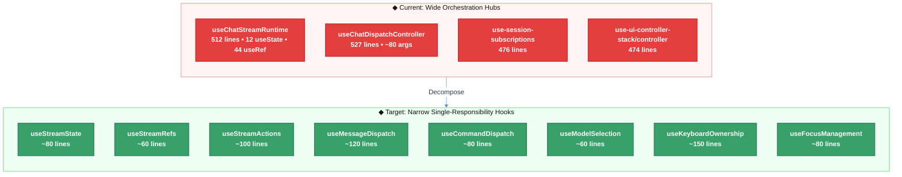

# OpenTUI React Anti-Pattern Audit — Technical Design Document

| Document Metadata      | Details     |
| ---------------------- | ----------- |
| Author(s)              | Alex Lavaee |
| Status                 | Draft (WIP) |
| Team / Owner           | Atomic UI   |
| Created / Last Updated | 2026-03-25  |

---

## 1. Executive Summary

The Atomic TUI's React/OpenTUI layer suffers from **complexity concentration**, not from OpenTUI misuse. A systematic audit ([research/docs/2026-03-25-opentui-react-antipattern-audit.md](../research/docs/2026-03-25-opentui-react-antipattern-audit.md)) identified 7 anti-pattern categories across the UI codebase, with the highest-severity issue being **"god-hooks"** — orchestration hubs exceeding 500 lines that bundle stream lifecycle, message mutation, keyboard logic, and shell prop assembly into single modules. The `state/` directory has 270 cross-module imports and 9 bidirectional circular dependencies ([research/docs/2026-03-13-codebase-architecture-modularity-analysis.md](../research/docs/2026-03-13-codebase-architecture-modularity-analysis.md)). This spec proposes a phased refactoring plan to decompose oversized hooks, consolidate keyboard/focus ownership, replace effect-heavy synchronization with render-time derivation, and harden list identity and type safety. The changes will reduce maintainability cost, improve testability, and prevent UI regressions caused by implicit state coordination chains.

---

## 2. Context and Motivation

### 2.1 Current State

The Atomic TUI renders a chat-based coding agent interface using `@opentui/react` (v0.1.90) on top of `@opentui/core`. The architecture follows a layered composition:

```
App entry (src/app.tsx)
  └─ ChatApp (src/screens/chat-screen.tsx)
       ├─ useChatStreamRuntime (src/state/chat/stream/use-runtime.ts)
       │    ├─ useChatBackgroundDispatch
       │    ├─ useChatRunTracking
       │    ├─ useChatRuntimeControls
       │    ├─ useChatStreamConsumer
       │    └─ useChatStreamLifecycle
       ├─ useChatUiControllerStack (src/state/chat/controller/)
       │    ├─ useChatDispatchController
       │    ├─ useChatShellState
       │    ├─ useChatWorkflowHitl
       │    └─ useChatAppOrchestration
       └─ ChatShell (src/state/chat/shell/ChatShell.tsx)
            └─ ~50 props → renders scrollbox, input, message list, dialogs
```

**OpenTUI usage is structurally sound.** The renderer lifecycle, cleanup discipline (`renderer.destroy()`), shared animation provider (`AnimationTickProvider`), `exitOnCtrlC: false` ownership, `SyntaxStyle` cleanup, and `@opentui/react/test-utils` integration are all healthy patterns that should be preserved.

**The problems are architectural, not cosmetic.** Complexity has concentrated in a few orchestration hooks rather than being distributed across focused, single-responsibility modules.

### 2.2 The Problem

**Maintainability:** Changes in one concern (e.g., keyboard handling) leak into unrelated UI behavior because responsibilities are co-located in monolithic hooks. `useChatDispatchController` accepts ~80 arguments (ref: [research/docs/2026-03-25-opentui-react-antipattern-audit.md §3.1](../research/docs/2026-03-25-opentui-react-antipattern-audit.md)).

**Testability:** The hook composition chain threads refs through 5+ levels, making unit testing of individual behaviors nearly impossible without mocking the entire state tree. Mock-heavy lifecycle tests (e.g., `tests/app/app.protocol-ordering.test.ts`) assert mock choreography rather than end-user behavior ([research/docs/2026-03-24-test-suite-design.md](../research/docs/2026-03-24-test-suite-design.md)).

**Fragility:** 12 effect-synchronization sites create implicit coordination chains where state → ref → effect → state cascades are hard to reason about. A zero-delay post-key sync at `use-keyboard.ts:221-226` indicates timing-sensitive state reconciliation ([research/docs/2026-03-25-opentui-react-antipattern-audit.md §3.4](../research/docs/2026-03-25-opentui-react-antipattern-audit.md)).

**Upstream drivers:** The 210-line `CorrelationService.enrich()` and 240-line `StreamPipelineConsumer.mapToStreamPart()` push complexity upward into the UI layer, forcing hooks to manage ref-based synchronization for stale-closure avoidance ([research/docs/2026-03-14-event-bus-callback-elimination-sdk-event-types.md](../research/docs/2026-03-14-event-bus-callback-elimination-sdk-event-types.md)).

---

## 3. Goals and Non-Goals

### 3.1 Functional Goals

- [ ] Decompose the 5 identified "god-hooks" into narrower, single-responsibility hooks with ≤200 lines each
- [ ] Consolidate keyboard/focus handling from 8+ files into a unified ownership model with one clear boundary
- [ ] Convert effect-derive-ref-effect chains to render-time derivation at the 12 identified sites, following the `autocomplete.tsx:213-223` counterexample pattern
- [ ] Audit and fix unstable list keys at 10 identified sites, distinguishing static rendering from stateful/reorderable lists
- [ ] Eliminate `as any` type escapes at rendering boundaries and in test files
- [ ] Reduce the prop surface of `ChatShellProps` from ~50 properties to a composition of focused interfaces
- [ ] Add `React.memo` to frequently re-rendered list-item components (`SuggestionRow`, `AgentSummaryBlock`, `TaskListBox`, `MessageBubble`)
- [ ] Ensure all existing tests continue to pass after refactoring
- [ ] Maintain all healthy patterns identified in the audit (cleanup discipline, `AnimationTickProvider`, `SyntaxStyle` lifecycle, OpenTUI test-utils usage)

### 3.2 Non-Goals (Out of Scope)

- [ ] We will NOT introduce a global state management library (Redux, Zustand, Jotai). The hook-composition architecture is appropriate for this codebase.
- [ ] We will NOT restructure the event bus or streaming pipeline. Those are separate efforts tracked in [specs/2026-03-18-event-bus-callback-elimination-sdk-event-types.md](2026-03-18-event-bus-callback-elimination-sdk-event-types.md) and [specs/2026-03-02-streaming-architecture-event-bus-migration.md](2026-03-02-streaming-architecture-event-bus-migration.md).
- [ ] We will NOT rewrite the test suite. Test improvements are tracked in [specs/2026-03-25-test-suite-design-85-percent-coverage.md](2026-03-25-test-suite-design-85-percent-coverage.md).
- [ ] We will NOT modify the OpenTUI core/react packages themselves.
- [ ] We will NOT change the visual appearance or user-facing behavior of the TUI.

---

## 4. Proposed Solution (High-Level Design)

### 4.1 System Architecture Diagram



### 4.2 Architectural Pattern

We are adopting a **Façade + Strategy decomposition** pattern:

- **Façade:** Each current god-hook becomes a thin façade that composes narrower sub-hooks, preserving the existing public API to minimize blast radius.
- **Strategy:** Keyboard/focus handling adopts a strategy pattern where a single `useKeyboardOwnership` hook delegates to focused handlers (navigation, input, dialog, interrupt) based on the current UI mode.
- **Render-time derivation:** Effect-heavy synchronization chains are replaced with the React-recommended "adjust state during render" pattern, following the existing `autocomplete.tsx:213-223` counterexample.

### 4.3 Key Components

| Component                   | Current Problem                                               | Proposed Change                                                                                    | Justification                                                                           |
| --------------------------- | ------------------------------------------------------------- | -------------------------------------------------------------------------------------------------- | --------------------------------------------------------------------------------------- |
| `useChatStreamRuntime`      | 512 lines, 12 `useState`, 44 `useRef`, returns 80+ fields     | Split into `useStreamState`, `useStreamRefs`, `useStreamActions` façade                            | SRP: state declaration, ref management, and action definitions are independent concerns |
| `useChatDispatchController` | 527 lines, ~80 args                                           | Split into `useMessageDispatch`, `useCommandDispatch`, `useModelSelection`                         | SRP: message sending, command execution, and model selection are independent            |
| `use-keyboard.ts` + 7 files | Keyboard logic scattered across 8+ files with zero-delay sync | `useKeyboardOwnership` façade with mode-based delegation                                           | Consolidates fragmented input handling into single ownership boundary                   |
| 12 effect-sync sites        | State → ref → effect → state chains                           | Render-time derivation following `autocomplete.tsx:213-223` pattern                                | Eliminates implicit coordination; follows React best practices                          |
| `ChatShellProps`            | ~50 flat properties                                           | Composed interfaces: `ShellLayoutProps`, `ShellInputProps`, `ShellDialogProps`, `ShellScrollProps` | Reduces cognitive load; enables focused memoization                                     |

---

## 5. Detailed Design

### 5.1 Phase 1: Decompose Orchestration Hubs

#### 5.1.1 `useChatStreamRuntime` Decomposition

**Current:** Single 512-line hook in `src/state/chat/stream/use-runtime.ts` containing:
- 12 `useState` declarations (lines 53–64)
- 44 `useRef` declarations (lines 66–122)
- 8 `useCallback` definitions (lines 123–226)
- 5 sub-hook compositions (lines 228–370)
- Return object with `.state`, `.setters`, `.refs`, `.actions` totaling 80+ fields

**Proposed decomposition:**

```
src/state/chat/stream/
├── use-runtime.ts              ← Thin façade (≤80 lines), composes below
├── use-stream-state.ts         ← 12 useState + derived state (≤80 lines)
├── use-stream-refs.ts          ← 44 useRef declarations (≤60 lines)
├── use-stream-actions.ts       ← 8 useCallback definitions (≤100 lines)
├── use-background-dispatch.ts  ← (existing, unchanged)
├── use-run-tracking.ts         ← (existing, unchanged)
├── use-runtime-controls.ts     ← (existing, unchanged)
├── use-stream-consumer.ts      ← (existing, unchanged)
└── use-stream-lifecycle.ts     ← (existing, unchanged)
```

The façade's return type remains identical to preserve downstream compatibility. Internal composition changes are invisible to consumers.

#### 5.1.2 `useChatDispatchController` Decomposition

**Current:** 527 lines in `src/state/chat/controller/use-dispatch-controller.ts`, accepts ~80 arguments.

**Proposed decomposition:**

```
src/state/chat/controller/
├── use-dispatch-controller.ts  ← Thin façade (≤80 lines)
├── use-message-dispatch.ts     ← sendMessage, addMessage, fullyFinalizeStreamingMessage
├── use-command-dispatch.ts     ← executeCommand, dispatchDeferredCommandMessage
├── use-model-selection.ts      ← handleModelSelect, handleModelSelectorCancel
├── use-queue-dispatch.ts       ← dispatchQueuedMessage, setStreamingWithFinalize
└── use-initial-prompt.ts       ← Initial prompt useEffect (lines 482–518)
```

Each sub-hook receives only the dependencies it actually uses, reducing the ~80 argument signature to 10-15 per sub-hook.

#### 5.1.3 `use-session-subscriptions` Decomposition

**Current:** 476 lines in `src/state/chat/stream/use-session-subscriptions.ts`.

**Proposed:** Split by event category:
- `use-message-event-handlers.ts` — message creation/update/deletion handlers
- `use-agent-event-handlers.ts` — parallel agent lifecycle handlers
- `use-workflow-event-handlers.ts` — workflow/HITL event handlers
- `use-session-subscriptions.ts` — thin façade composing the above

#### 5.1.4 `use-ui-controller-stack/controller` Decomposition

**Current:** 474 lines in `src/state/chat/controller/use-ui-controller-stack/controller.ts`.

**Proposed:** Extract focused sub-hooks:
- `use-orchestration-state.ts` — top-level UI mode state management
- `use-transcript-controller.ts` — transcript mode logic
- `use-dialog-controller.ts` — model selector and user question dialog coordination

### 5.2 Phase 2: Consolidate Keyboard/Focus Ownership

#### 5.2.1 Current Fragmentation

Keyboard/focus logic is distributed across 8+ files (ref: [research/docs/2026-03-25-opentui-react-antipattern-audit.md §3.4](../research/docs/2026-03-25-opentui-react-antipattern-audit.md)):

| File                        | Responsibility                                            |
| --------------------------- | --------------------------------------------------------- |
| `use-keyboard.ts`           | Global keyboard + zero-delay post-key sync (line 221–226) |
| `navigation.ts`             | 14–372 lines of navigation helpers                        |
| `use-input-state.ts`        | Input composition (109–172, 196–214)                      |
| `submit.ts`                 | Submit handling (36–93)                                   |
| `user-question-dialog.tsx`  | Dialog keyboard (182–299)                                 |
| `model-selector-dialog.tsx` | Model selector keyboard (168–250)                         |
| `ChatShell.tsx`             | Shell-level key bindings (274–291)                        |
| `use-interrupt-controls.ts` | Interrupt key handling                                    |

#### 5.2.2 Proposed Ownership Model

```
src/state/chat/keyboard/
├── use-keyboard-ownership.ts   ← Single entry point; delegates by UI mode
├── handlers/
│   ├── chat-input-handler.ts   ← Normal chat input (from use-input-state.ts)
│   ├── navigation-handler.ts   ← Scroll/navigation (from navigation.ts)
│   ├── dialog-handler.ts       ← Dialog keyboard (from user-question-dialog + model-selector)
│   ├── submit-handler.ts       ← Submit handling (from submit.ts)
│   └── interrupt-handler.ts    ← Interrupt/ctrl-c (from use-interrupt-controls.ts)
├── types.ts                    ← Shared keyboard types
└── focus-manager.ts            ← Focus state tracking
```

**Key design principle:** `useKeyboardOwnership` uses a strategy pattern. It reads the current UI mode (chat, dialog, model-selector, transcript) and delegates `KeyEvent` to the appropriate handler. The zero-delay post-key sync at `use-keyboard.ts:221-226` is absorbed into the ownership hook's post-dispatch reconciliation, making the timing dependency explicit rather than implicit.

### 5.3 Phase 3: Replace Effect-Heavy Synchronization

#### 5.3.1 Identified Sites

12 effect-synchronization sites need review (ref: [research/docs/2026-03-25-opentui-react-antipattern-audit.md §3.2](../research/docs/2026-03-25-opentui-react-antipattern-audit.md)):

| File                            | Lines  | Current Pattern                       | Proposed Fix                                                      |
| ------------------------------- | ------ | ------------------------------------- | ----------------------------------------------------------------- |
| `task-list-panel.tsx`           | varies | Effect syncs task state               | Keep — external file watcher is a genuine side effect             |
| `parallel-agents-tree.tsx`      | varies | Effect computes completion markers    | Move to render-time derivation                                    |
| `user-question-dialog.tsx`      | varies | Effect syncs dialog state             | Move to render-time with `prevRef` pattern                        |
| `model-selector-dialog.tsx`     | varies | Effect syncs selector state           | Move to render-time with `prevRef` pattern                        |
| `autocomplete.tsx`              | varies | Already uses render-time derivation ✓ | No change — this is the reference pattern                         |
| `use-input-state.ts` (×2)       | varies | Effect syncs input state              | Evaluate: keep if external side effect, derive if internal        |
| `use-runtime-effects.ts`        | varies | Effect syncs refs                     | Keep — ref synchronization for event bus callbacks is intentional |
| `services/events/hooks.ts` (×4) | varies | Effect manages subscriptions          | Keep — event bus subscriptions are genuine side effects           |

#### 5.3.2 Reference Pattern (Render-Time Derivation)

From `src/components/autocomplete.tsx:213-223` — the existing counterexample to follow:

```typescript
// During render, adjust state rather than using an effect
const clampedIndex = Math.min(selectedIndex, items.length - 1);
if (clampedIndex !== selectedIndex) {
  // Notify parent during render, not in an effect
  if (prevNotifiedRef.current !== clampedIndex) {
    prevNotifiedRef.current = clampedIndex;
    onSelectionChange?.(clampedIndex);
  }
}
```

#### 5.3.3 Ref-Mirroring Strategy

The 44-ref pattern in `use-runtime.ts` exists because event bus callbacks need fresh values without stale closures. This is an intentional design choice documented in the codebase. Rather than eliminating it:

1. **Encapsulate:** Move ref-mirroring into `useStreamRefs` where it is co-located with ref declarations
2. **Document:** Add JSDoc explaining the pattern and why it exists
3. **Consider future:** If the event bus callback elimination spec ([specs/2026-03-18-event-bus-callback-elimination-sdk-event-types.md](2026-03-18-event-bus-callback-elimination-sdk-event-types.md)) is implemented, many of these refs will become unnecessary

### 5.4 Phase 4: Harden List Identity

#### 5.4.1 Sites Requiring Audit

10 sites using index-based keys (ref: [research/docs/2026-03-25-opentui-react-antipattern-audit.md §3.5](../research/docs/2026-03-25-opentui-react-antipattern-audit.md)):

| File                            | Key Pattern          | Risk Level                           | Action                                  |
| ------------------------------- | -------------------- | ------------------------------------ | --------------------------------------- |
| `tool-result.tsx` (×2)          | `key={index}`        | Low — static display lines           | Accept with inline comment              |
| `error-exit-screen.tsx`         | `key={i}`            | Low — static error stack             | Accept with inline comment              |
| `chat-header.tsx` (×2)          | `key={index}`        | Low — static header segments         | Accept with inline comment              |
| `autocomplete.tsx`              | `key={command.name}` | ✓ Already stable                     | No change                               |
| `parallel-agents-tree.tsx` (×2) | Mixed                | Medium — agents can reorder/complete | Use `agent.id` / `part.id` consistently |
| `user-question-dialog.tsx`      | `key={option.value}` | ✓ Already stable                     | No change                               |
| `transcript-view.tsx`           | `key={idx}`          | Low — append-only transcript         | Accept with inline comment              |

### 5.5 Phase 5: Type Safety and Component Memoization

#### 5.5.1 Eliminate Type Escapes

| File                                       | Lines   | `as any` Usage      | Fix                                                 |
| ------------------------------------------ | ------- | ------------------- | --------------------------------------------------- |
| `tool-registry/registry/renderers/read.ts` | 41–45   | Renderer type cast  | Introduce proper generic type for renderer registry |
| `tool-registry/registry/renderers/bash.ts` | 17–34   | Renderer type cast  | Same generic type fix                               |
| `message-parts/tool-part-display.tsx`      | 33–34   | Component prop cast | Add proper discriminated union type                 |
| `chat-message-bubble.tsx`                  | 67–72   | Message type cast   | Narrow with type guard                              |
| Test files                                 | Various | Mock type casts     | Create typed mock factories                         |

#### 5.5.2 Component Memoization

Currently only `MemoizedAgentPartDisplay` uses `React.memo`. Add memoization to:

| Component            | File                           | Justification                                                       |
| -------------------- | ------------------------------ | ------------------------------------------------------------------- |
| `SuggestionRow`      | `autocomplete.tsx:87`          | Rendered in `.map()` loop; parent re-renders on every keystroke     |
| `AgentSummaryBlock`  | `parallel-agents-tree.tsx:233` | Rendered in `.map()` loop; parent re-renders on agent state changes |
| `TaskListBox`        | `task-list-panel.tsx:74`       | Re-renders on every file watcher tick                               |
| `StatusIndicator`    | `tool-result.tsx:76`           | Rendered inside each tool result                                    |
| `CollapsibleContent` | `tool-result.tsx:113`          | Rendered inside each tool result                                    |
| `FooterStatus`       | `footer-status.tsx:33`         | Re-renders on any parent state change                               |

#### 5.5.3 Inline Object Stabilization

| File                  | Lines   | Current                             | Fix                                     |
| --------------------- | ------- | ----------------------------------- | --------------------------------------- |
| `ChatShell.tsx`       | 200–201 | Inline `{ visible: false }` objects | Extract to module-level constants       |
| `transcript-view.tsx` | 99–100  | Inline scrollbar options            | Extract to module-level constants       |
| `chat-screen.tsx`     | 151–190 | Inline `app` object in hook call    | Wrap in `useMemo` with appropriate deps |

#### 5.5.4 ChatShellProps Decomposition

**Current:** ~50 flat properties in `ChatShellProps` interface.

**Proposed:** Compose from focused interfaces:

```typescript
interface ShellLayoutProps {
  width: number;
  height: number;
  // ... layout-related props
}

interface ShellInputProps {
  inputValue: string;
  onSubmit: (value: string) => void;
  // ... input-related props
}

interface ShellDialogProps {
  activeQuestion: UserQuestion | null;
  modelSelectorVisible: boolean;
  // ... dialog-related props
}

interface ShellScrollProps {
  scrollRef: RefObject<ScrollBoxRenderable>;
  // ... scroll-related props
}

interface ChatShellProps extends ShellLayoutProps, ShellInputProps, ShellDialogProps, ShellScrollProps {
  // Shell-specific props only
}
```

---

## 6. Alternatives Considered

| Option                                                  | Pros                                                       | Cons                                                                                                                  | Reason for Rejection                                                                                                                                                                     |
| ------------------------------------------------------- | ---------------------------------------------------------- | --------------------------------------------------------------------------------------------------------------------- | ---------------------------------------------------------------------------------------------------------------------------------------------------------------------------------------- |
| **A: Full rewrite using Zustand/Jotai**                 | Clean state model, eliminates ref-mirroring                | Massive blast radius, would break all tests, introduces new dependency                                                | The hook-composition architecture is fundamentally sound; the issue is granularity, not paradigm                                                                                         |
| **B: Scattershot lint-fix pass**                        | Quick wins, easy to review                                 | Does not address root cause (complexity concentration), low ROI                                                       | Research explicitly concluded this would be low-value ([research/docs/2026-03-25-opentui-react-antipattern-audit.md §3](../research/docs/2026-03-25-opentui-react-antipattern-audit.md)) |
| **C: Targeted architectural simplification (Selected)** | Preserves API surfaces, incremental, testable at each step | Requires careful façade construction to avoid breaking consumers                                                      | **Selected:** Highest ROI — addresses root cause while minimizing blast radius                                                                                                           |
| **D: Context-based state distribution**                 | Reduces prop drilling                                      | Would require significant restructuring; OpenTUI's reconciler may have context performance differences from React DOM | Premature optimization; prop drilling is a symptom, not the cause                                                                                                                        |

---

## 7. Cross-Cutting Concerns

### 7.1 Testing Strategy

- **Regression safety:** All existing E2E tests (13 screen tests using `@opentui/react/test-utils`) must pass at every phase boundary
- **New hook tests:** Each extracted sub-hook gets focused unit tests using `renderHook` from `@opentui/react/test-utils`
- **Mock reduction:** Replace mock-choreography tests in `app.protocol-ordering.test.ts` with behavior-oriented tests that assert user-visible outcomes
- **Type safety:** Replace `as any` casts in tests with typed mock factories (ref: [research/docs/2026-03-24-test-suite-design.md](../research/docs/2026-03-24-test-suite-design.md))

### 7.2 Migration Safety

- **Façade preservation:** Each decomposition phase wraps sub-hooks in a façade that preserves the existing return type signature. Consumers are not modified until all sub-hooks are stable.
- **Feature flag:** Not required — changes are internal refactors with identical external behavior.
- **Incremental PRs:** Each phase is independently shippable and reviewable.

### 7.3 Performance Considerations

- **Memoization:** `React.memo` additions will reduce unnecessary re-renders during streaming (every text delta currently re-renders the full message list)
- **Render-time derivation:** Replacing effect chains with render-time computation eliminates unnecessary render cycles (effect → setState → re-render)
- **Inline object stabilization:** Extracting constants and using `useMemo` prevents unnecessary child re-renders caused by referential inequality
- **Version-counter state:** `toolCompletionVersion` and `agentAnchorSyncVersion` (used solely as re-render triggers) should be reviewed for elimination during Phase 1 decomposition

---

## 8. Migration, Rollout, and Testing

### 8.1 Deployment Strategy

- [ ] **Phase 1:** Decompose orchestration hubs — Split `useChatStreamRuntime`, `useChatDispatchController`, `use-session-subscriptions`, and `use-ui-controller-stack/controller` into narrower hooks behind thin façades
- [ ] **Phase 2:** Consolidate keyboard/focus ownership — Introduce `useKeyboardOwnership` with strategy-based delegation, absorbing the zero-delay post-key sync
- [ ] **Phase 3:** Review effect/ref synchronization — Convert 5-7 of the 12 identified sites to render-time derivation (keeping genuine side effects as-is)
- [ ] **Phase 4:** Audit unstable keys — Fix medium-risk sites in `parallel-agents-tree.tsx`; document low-risk sites with inline comments
- [ ] **Phase 5:** Type safety and memoization — Eliminate `as any` escapes, add `React.memo` to list-item components, stabilize inline objects, decompose `ChatShellProps`

### 8.2 Verification Plan

Each phase must pass:
1. `bun typecheck` — zero type errors
2. `bun lint` — zero new lint violations
3. `bun test` — all existing tests pass
4. Manual smoke test — chat, streaming, model selection, HITL dialogs, parallel agents, keyboard navigation all function identically

### 8.3 Test Plan

- **Unit Tests:** New tests for each extracted sub-hook (`useStreamState`, `useMessageDispatch`, `useKeyboardOwnership`, etc.) using `renderHook`
- **Integration Tests:** Existing E2E screen tests serve as integration coverage
- **Regression Tests:** Snapshot comparison of rendered output before/after each phase to catch visual regressions

---

## 9. Open Questions — Resolved

- [x] **Q1 (Ref Grouping):** **Group related refs into objects.** The 44 individual refs in `useStreamRefs` will be consolidated into semantically grouped objects (e.g., `streamingRefs: { messageId, runId, turnId }`) to reduce cognitive load and improve co-location of related state.
- [x] **Q2 (Keyboard Handler Location):** **Move to centralized keyboard module.** Dialog-specific keyboard handlers (user-question-dialog, model-selector-dialog) will move entirely into the centralized `useKeyboardOwnership` module, establishing a single ownership boundary that makes key conflicts easier to reason about.
- [x] **Q3 (useStableCallback):** **Introduce `useStableCallback` now.** A lightweight utility (similar to the React `useEvent` RFC) will be introduced to immediately reduce ref-mirroring boilerplate. It can coexist with future event bus callback elimination changes.
- [x] **Q4 (ChatShellProps):** **Physically separate prop objects.** `ChatShell` will accept separate prop groups (e.g., `layout={layoutProps} input={inputProps} dialog={dialogProps} scroll={scrollProps}`), requiring updates to all ChatShell consumers but delivering a cleaner API.
- [x] **Q5 (Version Counters):** **Eliminate entirely by restructuring data flow.** `toolCompletionVersion` and `agentAnchorSyncVersion` will be removed by restructuring the data flow so that the components consuming this state observe the underlying data changes directly rather than relying on artificial re-render triggers.

---

## 10. References

### Primary Research
- [research/docs/2026-03-25-opentui-react-antipattern-audit.md](../research/docs/2026-03-25-opentui-react-antipattern-audit.md) — Primary audit document
- [research/docs/2026-03-24-test-suite-design.md](../research/docs/2026-03-24-test-suite-design.md) — Test suite design and OpenTUI-native test patterns
- [research/docs/2026-03-13-codebase-architecture-modularity-analysis.md](../research/docs/2026-03-13-codebase-architecture-modularity-analysis.md) — 270 cross-module imports, 9 circular dependency pairs

### Supporting Research
- [research/docs/2026-03-14-event-bus-callback-elimination-sdk-event-types.md](../research/docs/2026-03-14-event-bus-callback-elimination-sdk-event-types.md) — Upstream driver: callback/ref/effect coordination pressure
- [research/docs/v1/2026-03-15-spec-05-ui-rendering.md](../research/docs/v1/2026-03-15-spec-05-ui-rendering.md) — Original UI decomposition blueprint
- [research/docs/v1/2026-03-15-spec-03-state-management.md](../research/docs/v1/2026-03-15-spec-03-state-management.md) — Intended state flow model
- [research/docs/2026-02-26-streaming-architecture-event-bus-migration.md](../research/docs/2026-02-26-streaming-architecture-event-bus-migration.md) — Callback→event-bus migration history
- [research/docs/2026-02-25-ui-workflow-coupling.md](../research/docs/2026-02-25-ui-workflow-coupling.md) — 6,100-line `chat.tsx` monolith precursor
- [research/docs/2026-02-22-opentui-key-handling.md](../research/docs/2026-02-22-opentui-key-handling.md) — OpenTUI keyboard protocol (Kitty/ANSI)
- [research/docs/2026-02-16-opentui-rendering-architecture.md](../research/docs/2026-02-16-opentui-rendering-architecture.md) — OpenTUI cleanup patterns
- [research/docs/2026-02-15-ui-inline-streaming-vs-pinned-elements.md](../research/docs/2026-02-15-ui-inline-streaming-vs-pinned-elements.md) — Dual rendering path coordination
- [research/docs/2026-03-01-opencode-tui-concurrency-bottlenecks.md](../research/docs/2026-03-01-opencode-tui-concurrency-bottlenecks.md) — SSE event loop bottlenecks

### Related Specs
- [specs/2026-03-18-codebase-architecture-modularity-refactor.md](2026-03-18-codebase-architecture-modularity-refactor.md) — Broader modularity refactor
- [specs/2026-03-18-event-bus-callback-elimination-sdk-event-types.md](2026-03-18-event-bus-callback-elimination-sdk-event-types.md) — Event bus callback elimination
- [specs/2026-03-02-streaming-architecture-event-bus-migration.md](2026-03-02-streaming-architecture-event-bus-migration.md) — Streaming event bus migration
- [specs/2026-03-25-test-suite-design-85-percent-coverage.md](2026-03-25-test-suite-design-85-percent-coverage.md) — Test suite design
