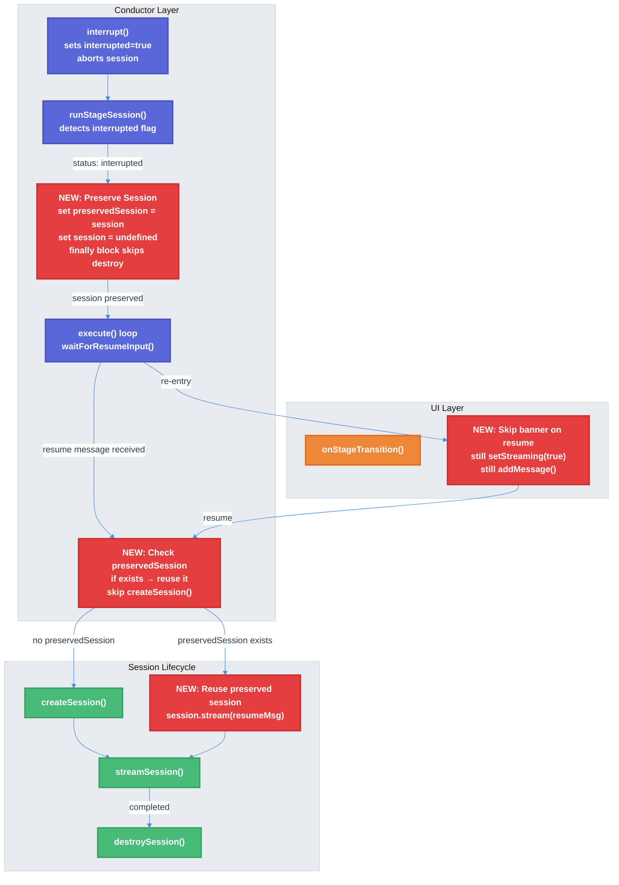

# Workflow Interrupt/Resume Session Preservation — Technical Design Document

| Document Metadata      | Details                         |
| ---------------------- | ------------------------------- |
| Author(s)              | lavaman131                      |
| Status                 | Draft (WIP)                     |
| Team / Owner           | Atomic CLI                      |
| Created / Last Updated | 2026-03-25                      |

## 1. Executive Summary

After the initial interrupt/resume mechanism was implemented (see [workflow-interrupt-stage-advancement-fix](./2026-03-25-workflow-interrupt-stage-advancement-fix.md)), three residual bugs remain in the conductor's interrupt/resume cycle. All three stem from the same root cause: **the `finally` block in `runStageSession()` always destroys the session, even when the stage is interrupted and will be resumed**. The `preserveSessionForResume` flag is set too late — after the session is already destroyed — and only controls which prompt text is used, not whether the actual session object is preserved. This causes: (1) resume creates a new session with zero conversation history, (2) the stage banner re-shows on resume entry, and (3) queued messages delivered on resume go to an empty session losing all prior context.

This spec proposes preserving the actual `Session` object on interrupt, reusing it on resume instead of creating a new one, and suppressing the stage banner on resume re-entries.

> **Research reference:** [research/docs/2026-03-25-workflow-interrupt-resume-bugs.md](../research/docs/2026-03-25-workflow-interrupt-resume-bugs.md)
> **Prior spec:** [specs/2026-03-25-workflow-interrupt-stage-advancement-fix.md](./2026-03-25-workflow-interrupt-stage-advancement-fix.md)
> **Prior research:** [research/docs/2026-03-24-workflow-interrupt-stage-advancement-bug.md](../research/docs/2026-03-24-workflow-interrupt-stage-advancement-bug.md)

## 2. Context and Motivation

### 2.1 Current State

The `WorkflowSessionConductor` at `src/services/workflows/conductor/conductor.ts` now has the interrupt/resume mechanism from the prior spec implemented:

- `interrupt()` sets `this.interrupted = true` and aborts the current session (line 101–104)
- `resume()` resolves the pause promise (lines 111–116)
- `execute()` detects `status === "interrupted"`, calls `waitForResumeInput()`, and re-queues the node (lines 212–225)
- `runStageSession()` checks `this.interrupted` after streaming and returns `status: "interrupted"` (lines 402–412)
- `waitForResumeInput()` checks queued messages first, then delegates to config callback (lines 122–131)

However, the **session lifecycle** was not addressed in the prior spec. The critical flow:

```
runStageSession()
├── try {
│   ├── if (preserveSessionForResume) → use resume msg as prompt  // line 375-379
│   ├── session = createSession(...)                              // line 381: ALWAYS creates new
│   ├── streamSession(session, prompt, ...)                       // line 387-400
│   ├── if (this.interrupted) → return "interrupted"              // line 403-412
│   ├── drain queued messages to active session                   // line 478-512
│   └── return "completed"                                        // line 524
│   }
└── finally {
    ├── this.currentSession = null                                // line 552: ALWAYS clears
    └── destroySession(session)                                   // line 554: ALWAYS destroys
    }
```

> **Research reference:** [research/docs/2026-03-25-workflow-interrupt-resume-bugs.md §1](../research/docs/2026-03-25-workflow-interrupt-resume-bugs.md), "Session Lifecycle During Interrupt+Resume"

### 2.2 The Problem

**Bug 1 — Session destroyed before resume flag is set:**
When a stage is interrupted at line 403, `runStageSession()` returns `{ status: "interrupted" }`. The `finally` block then executes at line 551–558, destroying the session. Control returns to `execute()` at line 213, which calls `waitForResumeInput()`. If a resume message is provided, `preserveSessionForResume = true` is set at line 221. But the session is already destroyed.

On re-execution, `runStageSession()` at line 375–379 detects `preserveSessionForResume` and uses the resume message as the prompt, but at line 381, **creates a brand-new session** via `config.createSession()`. This new session has zero conversation history — the agent has no context about what was discussed before the interrupt.

> **Evidence:** Event log shows `turnId: "0"` on resume (fresh session). Agent responds: "The user said 'Continue' but there's no prior context..." ([research §1, Log 1](../research/docs/2026-03-25-workflow-interrupt-resume-bugs.md))

**Bug 2 — Stage banner re-shows on resume:**
When the conductor re-executes a stage after interrupt+resume, `executeAgentStage()` at line 294 calls `this.config.onStageTransition(previousStageId, nodeId)`. This fires unconditionally for every stage entry, including resume re-entries. The callback at `conductor-executor.ts:135–166` updates the workflow state with a new stage indicator (e.g., "Stage 1/4: ⌕ PLANNER"), re-enables streaming, and creates a new empty assistant message. On resume, this incorrectly re-displays the stage banner as if it were a fresh stage transition.

> **Evidence:** Event log shows `workflow.step.start: planner (⌕ PLANNER)` appearing twice — once at initial entry and again on resume ([research §2, Log 2](../research/docs/2026-03-25-workflow-interrupt-resume-bugs.md))

**Bug 3 — Queued messages lose context:**
When a message is queued during streaming and the user interrupts, `waitForResumeInput()` at line 122–131 dequeues it via `config.checkQueuedMessage()`. The message becomes the `resumeInput`, triggering re-execution. But because the session was destroyed (Bug 1), the queued message is sent to a new empty session with no conversation history. The planner/orchestrator responds generically, producing an empty task list, which causes the orchestrator to see `[]` and the workflow effectively fails silently.

> **Research reference:** [research/docs/2026-03-25-workflow-interrupt-resume-bugs.md §3](../research/docs/2026-03-25-workflow-interrupt-resume-bugs.md), "Queued Message Interaction with Interrupt"

### 2.3 What Works Correctly

The **non-interrupt queued message drain** path (`conductor.ts:478–512`) works correctly. After the main stream completes normally, queued messages are drained to the **same active session**, preserving conversation history. No fix is needed for this path.

> **Research reference:** [research/docs/2026-03-25-workflow-interrupt-resume-bugs.md §5](../research/docs/2026-03-25-workflow-interrupt-resume-bugs.md), "Queued Message Drain Without Interruption"

## 3. Goals and Non-Goals

### 3.1 Functional Goals

- [ ] **G1:** When a stage is interrupted and will be resumed, the conductor must preserve the actual `Session` object and reuse it on resume — not create a new session.
- [ ] **G2:** On resume re-entry, the stage banner must NOT be re-displayed. Streaming must be re-enabled and a new assistant message created (for the spinner), but the stage indicator UI must not change.
- [ ] **G3:** Queued messages delivered on resume must go to the preserved session with full conversation history, not a new empty session.
- [ ] **G4:** The `finally` block must only destroy the session when it is NOT being preserved for resume.
- [ ] **G5:** If the user never resumes (e.g., workflow is cancelled), the preserved session must still be cleaned up to prevent session leaks.
- [ ] **G6:** The `onStageTransition` callback signature must support a resume option so the executor can differentiate initial entry from resume re-entry.

### 3.2 Non-Goals (Out of Scope)

- [ ] We will NOT change the Tier 2 interrupt behavior (double Ctrl+C = full workflow cancellation).
- [ ] We will NOT modify the non-interrupt queued message drain path — it already works correctly.
- [ ] We will NOT add context pressure re-evaluation after resume (preserved sessions may be near context limits, but this is a separate concern).
- [ ] We will NOT add a TTL/timeout for preserved sessions — cleanup is handled by the conductor's lifecycle (workflow exit or next stage destroy).
- [ ] We will NOT change the `WorkflowStepPart` to show "resumed" status on re-entry.

## 4. Proposed Solution (High-Level Design)

### 4.1 System Architecture Diagram



### 4.2 Architectural Pattern

The fix introduces a **session preservation** pattern within the conductor's interrupt/resume cycle. Instead of always destroying the session in the `finally` block, the conductor conditionally preserves the `Session` object when a stage is interrupted and will be resumed. On resume, the preserved session is reused for the follow-up message, maintaining full conversation context.

This complements the existing **pause-and-resume** pattern from the prior spec by adding session continuity to the execution model.

### 4.3 Key Components

| Component                  | Responsibility                                                                          | Location                         | Change Type |
| -------------------------- | --------------------------------------------------------------------------------------- | -------------------------------- | ----------- |
| `WorkflowSessionConductor` | Preserve session on interrupt, reuse on resume, conditional destroy in `finally`        | `conductor/conductor.ts`         | Modified    |
| `ConductorConfig`          | Updated `onStageTransition` signature with resume options                               | `conductor/types.ts`             | Modified    |
| `conductorExecutor`        | Skip stage banner on resume in `onStageTransition` callback                             | `conductor-executor.ts`          | Modified    |
| Existing interrupt tests   | Extend to validate session preservation, banner suppression, and queued message context | `conductor-stage-interrupt.test.ts` | Modified |

## 5. Detailed Design

### 5.1 Conductor State Changes (`conductor.ts`)

#### 5.1.1 New Instance Field

```typescript
private preservedSession: Session | null = null;
```

Holds the session object when a stage is interrupted and will be resumed. Set in the interrupt return path; consumed in `runStageSession()` on the next invocation.

#### 5.1.2 New Instance Field for Resume Tracking

```typescript
private isResuming = false;
```

Set to `true` in `execute()` before re-queuing the interrupted node. Consumed by `executeAgentStage()` to signal that `onStageTransition` should behave differently on resume re-entry.

#### 5.1.3 Modified Interrupt Return Path in `runStageSession()`

Currently at lines 402–412, when `this.interrupted` is detected, the function returns early. The `finally` block then destroys the session. The fix intercepts this path:

```typescript
// After streaming, check interrupt flag (existing code at line 402)
if (this.interrupted) {
  this.interrupted = false;

  // NEW: Preserve the session for resume instead of letting finally destroy it
  this.preservedSession = session;
  session = undefined; // Prevent finally block from destroying it

  return {
    stageId: stage.id,
    rawResponse: accumulatedResponse + rawResponse,
    status: "interrupted",
    continuations: continuations.length > 0 ? continuations : undefined,
  };
}
```

By setting `session = undefined` before the return, the `finally` block's `if (session)` guard (line 553) prevents destruction. The preserved session remains alive for resume.

#### 5.1.4 Modified `finally` Block in `runStageSession()`

The existing `finally` block at lines 551–558 requires a small update to also clean up a preserved session if it was NOT consumed (e.g., workflow was cancelled before resume):

```typescript
} finally {
  this.currentSession = null;
  if (session) {
    await this.config.destroySession(session).catch(() => {
      // Swallow destroy errors — session cleanup is best-effort
    });
  }
}
```

No change to the `finally` block itself — the `session = undefined` trick in §5.1.3 handles the preservation. However, a cleanup mechanism for orphaned preserved sessions is needed (see §5.1.7).

#### 5.1.5 Modified Session Creation in `runStageSession()`

Currently at line 381, a new session is always created. The fix checks for a preserved session first:

```typescript
// When resuming an interrupted stage, reuse the preserved session
if (this.preserveSessionForResume && this.preservedSession) {
  session = this.preservedSession;
  this.preservedSession = null;
  currentPrompt = this.pendingResumeMessage!;
  this.pendingResumeMessage = null;
  this.preserveSessionForResume = false;
} else if (this.preserveSessionForResume && this.pendingResumeMessage !== null) {
  // Fallback: preserveSessionForResume is set but no preserved session
  // (should not happen, but handle gracefully — create new session with resume msg)
  currentPrompt = this.pendingResumeMessage;
  this.pendingResumeMessage = null;
  this.preserveSessionForResume = false;
  session = await this.config.createSession(stage.sessionConfig);
} else {
  session = await this.config.createSession(stage.sessionConfig);
}
this.currentSession = session;
```

When a preserved session exists, it is reused directly. The resume message is streamed as a follow-up user turn in the existing conversation, preserving full context.

#### 5.1.6 Modified `execute()` — Set Resume Flag

At lines 212–225, after detecting `status === "interrupted"` and receiving a resume message, add the `isResuming` flag:

```typescript
if (stageResult.output.status === "interrupted") {
  const resumeInput = await this.waitForResumeInput();

  if (resumeInput !== null) {
    nodeQueue.unshift(nodeId);
    visited.delete(nodeId);
    this.pendingResumeMessage = resumeInput;
    this.preserveSessionForResume = true;
    this.isResuming = true; // NEW: signal resume re-entry to skip banner
    continue;
  }
}
```

#### 5.1.7 Preserved Session Cleanup

The preserved session must be destroyed if the conductor exits without resuming (e.g., workflow cancellation, error, or `null` resume). Add cleanup at three points:

**Point 1 — When resume is `null` (user chose not to continue):**

```typescript
if (resumeInput !== null) {
  // ... re-queue logic ...
} else {
  // No follow-up — destroy the preserved session
  if (this.preservedSession) {
    await this.config.destroySession(this.preservedSession).catch(() => {});
    this.preservedSession = null;
  }
}
```

**Point 2 — In the `execute()` method's completion/error path:**

After the main loop exits (around line 240), add:

```typescript
// Clean up any orphaned preserved session
if (this.preservedSession) {
  await this.config.destroySession(this.preservedSession).catch(() => {});
  this.preservedSession = null;
}
```

**Point 3 — On workflow cancellation:**

When `waitForResumeInput()` rejects with `"Workflow cancelled"`, the error propagates to `executeConductorWorkflow()`'s catch block. The preserved session cleanup at Point 2 handles this since it runs in all exit paths.

#### 5.1.8 Modified `executeAgentStage()` — Resume-Aware Stage Transition

At line 294, the `onStageTransition` call currently fires unconditionally. Add resume awareness:

```typescript
// Notify UI of stage transition (skip banner on resume re-entry)
this.config.onStageTransition(previousStageId, nodeId, {
  isResume: this.isResuming,
});
this.isResuming = false; // Reset after consumption
```

### 5.2 Config Changes (`conductor/types.ts`)

Update the `onStageTransition` signature to accept an options parameter:

```typescript
/**
 * Called when the conductor transitions from one stage to another.
 * @param from - The previous stage ID (null on first stage)
 * @param to - The next stage ID
 * @param options - Optional transition metadata
 * @param options.isResume - When true, this is a resume re-entry, not a fresh stage transition
 */
readonly onStageTransition: (
  from: string | null,
  to: string,
  options?: { isResume?: boolean },
) => void;
```

### 5.3 Executor Changes (`conductor-executor.ts`)

Update the `onStageTransition` callback at lines 135–166 to respect the `isResume` option:

```typescript
onStageTransition: (from, to, options) => {
  // On resume re-entry, skip the stage banner update but still
  // re-enable streaming and create a new assistant message (for spinner)
  if (!options?.isResume) {
    const stage = stages.find((s) => s.id === to);
    const indicator = stage?.indicator ?? to;
    const stageIndex = stages.findIndex((s) => s.id === to);
    const stageIndicator = stageIndex >= 0
      ? `Stage ${stageIndex + 1}/${stages.length}: ${indicator}`
      : indicator;

    context.updateWorkflowState({
      currentStage: to,
      stageIndicator,
      workflowConfig: {
        userPrompt: prompt,
        sessionId,
        workflowName: definition.name,
      },
    });
  }

  // Always re-enable streaming and create a new message target —
  // needed for both initial entry and resume so the spinner shows
  context.setStreaming(true);
  context.addMessage("assistant", "");

  pipelineLog("Workflow", "stage_transition", {
    workflow: definition.name,
    from: from ?? "start",
    to,
    indicator: options?.isResume ? "(resume)" : undefined,
  });
},
```

On resume, `updateWorkflowState` (which re-renders the stage banner) is skipped. The streaming state and assistant message are still created so the composing spinner appears while the agent processes the follow-up.

### 5.4 State Machine Update

The prior spec's state machine is extended to show session preservation:

```
                                    ┌─────────────┐
                                    │   RUNNING    │
                                    │  (stage N)   │
                                    │  session S   │
                                    └──────┬───────┘
                                           │
                              ┌────────────┼────────────┐
                              │            │            │
                         interrupt    completed      error
                              │            │            │
                              ▼            ▼            ▼
                      ┌───────────┐  ┌──────────┐  ┌──────┐
                      │  PAUSED   │  │  CHECK   │  │ STOP │
                      │ session S │  │  QUEUE   │  │      │
                      │ preserved │  │          │  └──────┘
                      └─────┬─────┘  └────┬─────┘
                            │             │
                  ┌─────────┼──────────┐  ┌──┴──┐
                  │         │          │  │     │
               msg recv    null    2x Ctrl+C  queued  empty
                  │         │          │  │     │
                  ▼         ▼          ▼  ▼     ▼
             ┌────────┐  ┌──────┐ ┌──────────┐ ┌────────┐ ┌───────────┐
             │CONTINUE│  │CLEAN │ │ WORKFLOW │ │CONTINUE│ │  ADVANCE  │
             │stage N │  │  UP  │ │ CANCEL   │ │stage N │ │  to N+1   │
             │REUSE S │  │del S │ │(del S +  │ │w/ msg  │ └───────────┘
             │skip ban│  │adv   │ │full exit)│ └────────┘
             └────────┘  └──────┘ └──────────┘
```

Key changes from prior state machine:
- **PAUSED state** now explicitly preserves session S
- **CONTINUE stage N** on resume reuses session S (no new session creation)
- **CLEAN UP** path destroys preserved session S when resume is `null`
- **WORKFLOW CANCEL** path destroys preserved session S during cleanup
- **skip ban** = stage banner is suppressed on resume re-entry

## 6. Alternatives Considered

| Option | Pros | Cons | Reason for Rejection |
|--------|------|------|----------------------|
| **A: Serialize session history and replay on new session** | No session object management; works even if SDK doesn't support session reuse | High latency (replay all messages); may exceed context limits; SDK-dependent serialization format | Too complex and fragile. |
| **B: Delay `finally` block execution until after resume decision** | Simple — just restructure the `try/finally` | Requires major refactoring of `runStageSession()` control flow; the function is already deeply nested | High blast radius for a targeted fix. |
| **C: Session object preservation via `preservedSession` field (Selected)** | Minimal changes to existing flow; `session = undefined` trick is clean; reuses SDK's native session continuation | Requires careful cleanup to avoid session leaks | **Selected:** Smallest blast radius, correct semantics, preserves full conversation context. |
| **D: Remove `finally` block and use explicit cleanup calls** | More explicit control over session lifecycle | Easy to miss cleanup paths (error, cancel, normal exit); violates the safety pattern `finally` provides | Too error-prone. |

## 7. Cross-Cutting Concerns

### 7.1 Session Leak Prevention

The preserved session must be destroyed in all exit paths:
- **Normal resume:** Consumed by `runStageSession()` on re-entry (§5.1.5), then destroyed normally in the subsequent `finally` block when the resumed stage completes.
- **Null resume (no follow-up):** Destroyed explicitly in `execute()` (§5.1.7, Point 1).
- **Workflow cancellation (double Ctrl+C):** Destroyed in the post-loop cleanup (§5.1.7, Point 2).
- **Unexpected errors:** Post-loop cleanup catches all exit paths (§5.1.7, Point 2).

### 7.2 Race Conditions

- **Interrupt during session preservation:** The `preservedSession` field is set synchronously in the interrupt return path before the `return` statement. The `finally` block runs after `return`, and `session` is already `undefined` at that point. No race.
- **Double Ctrl+C during PAUSED state:** `waitForResumeInput()` rejects, propagating through `execute()`. The post-loop cleanup destroys the preserved session. The rejection is caught by `executeConductorWorkflow()` as a `"Workflow cancelled"` silent exit.

### 7.3 Backward Compatibility

- The `onStageTransition` signature change adds an optional third parameter. Existing callers that don't pass `options` will continue to work — `options?.isResume` evaluates to `undefined`/`false`, preserving current behavior.
- The `preservedSession` field is internal to the conductor. No external API surface changes.

### 7.4 Observability

- The `workflow.step.start` event on resume re-entry will still fire (via `emitStepStart`), but the stage banner will not re-render in the TUI. The event log will show `start → interrupted → start → completed` for a stage that was interrupted and resumed — same pattern as before, but now the second `start` leads to a session with context rather than an empty one.
- The `pipelineLog` in `onStageTransition` will log `indicator: "(resume)"` for resume transitions, aiding debugging.

## 8. Migration, Rollout, and Testing

### 8.1 Deployment Strategy

- [ ] **Phase 1:** Add `preservedSession` and `isResuming` fields to conductor. Modify the interrupt return path to preserve the session. Modify `finally` block guard. Unit test with mock sessions.
- [ ] **Phase 2:** Modify session creation logic to check for preserved session. Add cleanup in all exit paths. Integration test session reuse.
- [ ] **Phase 3:** Update `onStageTransition` signature in types and executor callback. Unit test banner suppression.
- [ ] **Phase 4:** End-to-end test with Ralph workflow: interrupt planner → resume with "Continue" → verify conversation context is preserved and stage banner is not re-shown.

### 8.2 Test Plan

#### Unit Tests (conductor layer)

- [ ] When `this.interrupted` is true after streaming, `preservedSession` is set to the current session and `session` is set to `undefined`
- [ ] The `finally` block does NOT call `destroySession` when `session` is `undefined`
- [ ] On resume re-entry with `preserveSessionForResume=true` and `preservedSession` set, `createSession()` is NOT called — the preserved session is reused
- [ ] On resume re-entry, the resume message is streamed to the preserved session via `streamSession(preservedSession, resumeMsg)`
- [ ] `preservedSession` is set to `null` after being consumed
- [ ] When resume input is `null`, `preservedSession` is destroyed explicitly
- [ ] On workflow exit (loop completes), any orphaned `preservedSession` is destroyed
- [ ] `isResuming` is set to `true` before re-queuing the interrupted node
- [ ] `isResuming` is reset to `false` after `onStageTransition` consumes it
- [ ] `onStageTransition` receives `{ isResume: true }` on resume re-entry
- [ ] `onStageTransition` receives `undefined` or `{ isResume: false }` on initial stage entry

#### Integration Tests (conductor executor + TUI)

- [ ] After interrupt + resume, the agent's response references prior conversation context (not "no prior context")
- [ ] After interrupt + resume with queued message, the queued message is processed in the same conversation context
- [ ] The stage banner UI element is NOT re-rendered on resume re-entry
- [ ] The composing spinner IS shown on resume re-entry
- [ ] Double Ctrl+C during PAUSED state cancels the workflow and destroys the preserved session (no session leak)
- [ ] Multiple sequential interrupt+resume cycles on the same stage work correctly (session is preserved and reused each time)

#### Regression Tests

- [ ] Normal stage completion (no interrupt) behavior is unchanged — session is created and destroyed normally
- [ ] Non-interrupt queued message drain path is unchanged — messages go to the same active session
- [ ] The prior spec's interrupt/resume flow (interrupted flag, pause promise, resume method) still works correctly with the session preservation additions

## 9. Open Questions / Unresolved Issues

- [x] **Q1 — Preserved session TTL:** **RESOLVED: No TTL needed.** The existing cleanup in all exit paths (null resume, workflow cancel, post-loop cleanup) is sufficient. The conductor's lifecycle guarantees that preserved sessions are destroyed when the workflow exits, regardless of how long the user takes to resume.

- [x] **Q2 — Stage banner "resumed" indicator:** **RESOLVED: Completely invisible.** The resume should be invisible in the stage banner — no "(resumed)" suffix or icon change. The stage banner remains unchanged from its initial display. This is the least surprising behavior for users.

- [x] **Q3 — Context pressure on resume:** **RESOLVED: No re-evaluation needed.** Context pressure management is a separate concern and should not be coupled to the interrupt/resume mechanism. If context limits become an issue, it will be addressed in a dedicated context pressure spec.

- [x] **Q4 — Multiple interrupt+resume cycles:** **RESOLVED: Unlimited.** No cap on interrupt+resume cycles per stage. Users should be free to interrupt and resume as many times as needed. If context growth becomes a problem, it falls under context pressure management (Q3).
