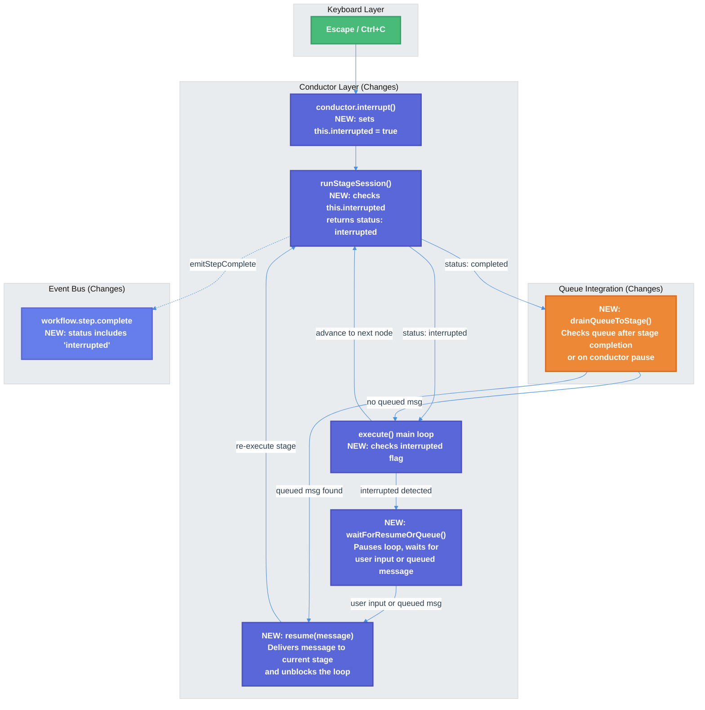

# Workflow Interrupt Stage Advancement Fix — Technical Design Document

| Document Metadata      | Details     |
| ---------------------- | ----------- |
| Author(s)              | lavaman131  |
| Status                 | Draft (WIP) |
| Team / Owner           | Atomic CLI  |
| Created / Last Updated | 2026-03-24  |

## 1. Executive Summary

When a user interrupts a workflow stage (Escape or first Ctrl+C), the current stage is cancelled and the workflow incorrectly advances to the next stage instead of pausing. This happens because `conductor.interrupt()` only aborts the per-stage session — it does not signal the conductor's execution loop to pause. Additionally, queued messages submitted during a workflow stage are never delivered to the current stage, neither after interruption nor after normal stage completion. This spec proposes adding an `interrupted` flag to the conductor, pausing the execution loop on interruption to wait for user input, and implementing a queue-drain mechanism that delivers queued messages to the current stage.

> **Research reference:** [research/docs/2026-03-24-workflow-interrupt-stage-advancement-bug.md](../research/docs/2026-03-24-workflow-interrupt-stage-advancement-bug.md)

## 2. Context and Motivation

### 2.1 Current State

The `WorkflowSessionConductor` at `src/services/workflows/conductor/conductor.ts` drives workflow execution via a BFS graph-walking loop. Each agent node creates an isolated SDK session, streams a prompt, captures the response, emits step events, and advances to the next node. The system supports a tiered interrupt model:

- **Tier 1** (single Escape or first Ctrl+C): Aborts only the current stage session via `conductor.interrupt()` → `this.currentSession?.abort?.()`
- **Tier 2** (second Ctrl+C within 1s): Full workflow cancellation via `cancelWorkflow()`

The queued message system (`use-message-queue.ts`) stores messages submitted while streaming is active. During workflow stages, `suppressQueueContinuation` (driven by `awaitedStreamRunIdsRef`) prevents queue draining between stages so the conductor maintains control of stage sequencing.

```
State Layer (React hooks)          Runtime Layer (AbortController)
─────────────────────────          ─────────────────────────────
interruptStreaming()                handleInterrupt()
  ├─ finalizes message               ├─ streamAbortController.abort()
  ├─ stops shared stream state        └─ session.abort()
  ├─ resolves tracked run                   │
  └─ (suppressed) queue drain               └─ SDK adapter stops
                                                  │
          Conductor Layer                         │
          ────────────────                        │
          conductor.interrupt()  ←────────────────┘
            └─ currentSession?.abort?.()
                 └─ (missing) no state flag set
                 └─ (missing) no abort signal propagation
```

> **Architecture reference:** [research/docs/2026-03-24-workflow-interrupt-stage-advancement-bug.md §6](../research/docs/2026-03-24-workflow-interrupt-stage-advancement-bug.md), "The Interrupt Signal Chain"

### 2.2 The Problem

**Bug 1 — Stage advancement on interrupt:** When `conductor.interrupt()` is called, it aborts the per-stage session but does NOT:
- Set any flag on the conductor (e.g., `this.interrupted = true`)
- Signal `this.config.abortSignal` (the workflow-level abort)
- Communicate back to the execution loop that the stage was interrupted

Consequently, `runStageSession()` checks `context.abortSignal.aborted` (which is `false`), falls through to the normal completion path, and returns `status: "completed"`. The main execution loop only breaks on `status === "error"`, so it advances to the next node.

> **Code reference:** `conductor.ts:97-99` (interrupt method), `conductor.ts:344` (abort check), `conductor.ts:171` (error-only break)

**Bug 2 — Queued messages not delivered to current stage:** The system intentionally suppresses queue draining during workflow stages via `suppressQueueContinuation`, but there is no mechanism to drain the queue into the **current** stage — either after interruption or after normal stage completion.

- **On interrupt:** `interruptStreaming()` computes `shouldContinueAfterInterrupt: !workflowState.workflowActive` → `false`, so `continueQueuedConversation()` is never called.
- **On normal completion:** `suppressQueueContinuation` is `true` (because the run ID is in `awaitedStreamRunIdsRef`), so `continueQueuedConversation()` is blocked. The conductor immediately advances to the next node.

> **Code reference:** `use-interrupt-controls.ts:319`, `interrupt-execution.ts:169`, `use-finalized-completion.ts:126-128`

**Bug 3 — Event bus status mismatch:** The internal `StageOutputStatus` at `conductor/types.ts:29` defines `"interrupted"`, but the bus event schema at `schemas.ts:175` only allows `["completed", "error", "skipped"]`. The `emitStepComplete` call at `conductor.ts:267-272` uses a binary mapping: `output.status === "completed" ? "completed" : "error"`, collapsing `"interrupted"` to `"error"`.

## 3. Goals and Non-Goals

### 3.1 Functional Goals

- [ ] **G1:** A single Escape or first Ctrl+C during a workflow stage must pause the conductor, stop the current stage, and wait for user input before continuing.
- [ ] **G2:** If a message is queued during a workflow stage and the user interrupts, the queued message must be delivered to the current (interrupted) stage.
- [ ] **G3:** If a message is queued during a workflow stage and the stage completes normally (no interrupt), the queued message must be delivered to the active session before the stage is finalized and the conductor advances to the next node.
- [ ] **G4:** The bus event schema must support `"interrupted"` as a valid `workflow.step.complete` status.
- [ ] **G5:** The conductor execution loop must recognize `status === "interrupted"` and pause instead of advancing.
- [ ] **G6:** After the user provides follow-up input (or the queued message is delivered and completes), the conductor must resume from the current stage and continue to the next node.

### 3.2 Non-Goals (Out of Scope)

- [ ] We will NOT change the Tier 2 interrupt behavior (second Ctrl+C within 1s = full workflow cancellation).
- [ ] We will NOT implement a HITL-style input prompt UI for the interrupt pause — the normal chat input flow will be used.
- [ ] We will NOT add support for delivering multiple queued messages sequentially to the same stage — only the first queued message will be delivered (remaining messages stay queued for subsequent stages).
- [ ] We will NOT change the behavior of deterministic (non-agent) nodes — only agent stages are affected.
- [ ] We will NOT modify the `askUserQuestion` DSL node type behavior — this spec focuses on the conductor's interrupt/resume and queue-drain mechanisms.

## 4. Proposed Solution (High-Level Design)

### 4.1 System Architecture Diagram



### 4.2 Architectural Pattern

The fix introduces a **pause-and-resume** pattern within the conductor's BFS execution loop. When a stage is interrupted or completes with queued messages pending, the conductor creates a `Promise` that blocks the loop and is resolved either by:
1. A user follow-up message delivered through the normal chat input flow
2. A queued message drained from the message queue

This reuses the existing `waitForUserInput` pattern already present in the conductor executor for `askUserQuestion` nodes, extending it to handle interrupts and queued messages.

### 4.3 Key Components

| Component                  | Responsibility                                                                            | Location                            | Change Type             |
| -------------------------- | ----------------------------------------------------------------------------------------- | ----------------------------------- | ----------------------- |
| `WorkflowSessionConductor` | Manage `interrupted` flag, pause loop on interrupt, re-execute stage with follow-up input | `conductor/conductor.ts`            | Modified                |
| `ConductorConfig`          | New `waitForResumeInput` and `checkQueuedMessage` callbacks                               | `conductor/types.ts`                | Modified                |
| `emitStepComplete`         | Support `"interrupted"` status mapping                                                    | `conductor/conductor.ts`            | Modified                |
| Bus event schema           | Add `"interrupted"` to `workflow.step.complete` status enum                               | `bus-events/schemas.ts`             | Modified                |
| `conductorExecutor`        | Wire new callbacks, integrate queue drain after stage completion                          | `conductor-executor.ts`             | Modified                |
| `stream-workflow-step.ts`  | Pass through `"interrupted"` status to `StreamPartEvent`                                  | `stream-workflow-step.ts`           | No change (passthrough) |
| Existing interrupt tests   | Extend to validate pause behavior and queue delivery                                      | `conductor-stage-interrupt.test.ts` | Modified                |

## 5. Detailed Design

### 5.1 Conductor State Changes (`conductor.ts`)

#### 5.1.1 New Instance Fields

```typescript
private interrupted = false;
private resumeResolver: ((message: string | null) => void) | null = null;
private pendingResumeMessage: string | null = null;
private preserveSessionForResume = false;
```

- `interrupted`: Set to `true` by `interrupt()`, checked by `runStageSession()` and the execution loop.
- `resumeResolver`: Holds the resolve function for the pause promise. When called with a message, the loop resumes and continues the current stage's session with the provided message (or proceeds to the next node if `null`).
- `pendingResumeMessage`: Holds the user/queued message to deliver to the stage on resume.
- `preserveSessionForResume`: When `true`, `runStageSession()` skips session creation and reuses `this.currentSession` for session continuation.

#### 5.1.2 Modified `interrupt()` Method

```typescript
interrupt(): void {
  this.interrupted = true;
  this.currentSession?.abort?.();
}
```

The only addition is `this.interrupted = true` before the session abort.

#### 5.1.3 New `resume(message: string | null)` Method

```typescript
resume(message: string | null): void {
  if (this.resumeResolver) {
    this.resumeResolver(message);
    this.resumeResolver = null;
  }
}
```

Called by the conductor executor when user input arrives (via the keyboard/queue integration layer). Passing `null` means "no follow-up message; continue to next node."

#### 5.1.4 Modified `runStageSession()` — Interrupt Check

After streaming completes (post line 341, before the existing `context.abortSignal.aborted` check at line 344), add:

```typescript
if (this.interrupted) {
  this.interrupted = false; // reset for next invocation
  return {
    stageId: stage.id,
    rawResponse: accumulatedResponse + rawResponse,
    status: "interrupted",
  };
}
```

This ensures a single interrupt (which does NOT set the workflow-level `abortSignal`) still produces `status: "interrupted"`.

#### 5.1.5 Modified `execute()` Loop — Interrupt Handling

After `executeAgentStage()` returns (around line 166), add handling for the `"interrupted"` status:

```typescript
const { output, result, skipped } = await this.executeAgentStage(
  nodeId, userPrompt, state, previousStageId,
);

if (!skipped) previousStageId = nodeId;

if (output.status === "error") {
  encounteredError = true;
  if (result.stateUpdate) mergeState(state, result.stateUpdate);
  break;
}

// NEW: Handle interrupted status
if (output.status === "interrupted") {
  // Emit step complete with "interrupted" status
  // Wait for resume input (user message or queued message)
  // NOTE: This await can throw "Workflow cancelled" on double Ctrl+C.
  // That rejection propagates up to executeConductorWorkflow()'s catch block,
  // which handles it as a silent workflow exit.
  const resumeInput = await this.waitForResumeInput();

  if (resumeInput !== null) {
    // Continue the same stage's session with the follow-up message
    // Push current node back to front of queue so it re-executes
    nodeQueue.unshift(nodeId);
    visited.delete(nodeId); // Allow re-visit
    // Store the resume message for session continuation
    this.pendingResumeMessage = resumeInput;
    // Preserve the session reference so runStageSession can reuse it
    this.preserveSessionForResume = true;
    continue;
  }
  // If null (no follow-up), fall through to advance to next node
}
```

> **Design decision (Q1):** The conductor continues the existing SDK session (`session.stream(message)`) rather than creating a new one. This preserves in-session conversation context. The `preserveSessionForResume` flag tells `runStageSession()` to skip session creation and reuse `this.currentSession`.

#### 5.1.6 New `waitForResumeInput()` Method

```typescript
private async waitForResumeInput(): Promise<string | null> {
  // First, check if there's a queued message available
  const queuedMessage = this.config.checkQueuedMessage?.();
  if (queuedMessage) return queuedMessage;

  // Otherwise, wait for user input or timeout
  if (this.config.waitForResumeInput) {
    return this.config.waitForResumeInput();
  }

  return null;
}
```

This method first checks for an immediately available queued message. If none, it delegates to the config callback which creates a promise that blocks until the user provides input.

#### 5.1.7 Queue Drain Inside `runStageSession()` (Normal Completion Path)

After the initial stream finishes inside `runStageSession()` but before returning `status: "completed"`, check for queued messages and deliver them to the active session:

```typescript
// After stream iteration completes, before returning...

// Check for queued messages to deliver to the active session
while (true) {
  const queuedMessage = this.config.checkQueuedMessage?.();
  if (!queuedMessage) break;

  // Deliver the queued message to the still-active session
  const stream = session.stream(queuedMessage);
  for await (const event of stream) {
    rawResponse += /* process event */;
  }

  // Check for interrupt during the follow-up stream
  if (this.interrupted) {
    this.interrupted = false;
    return {
      stageId: stage.id,
      rawResponse: accumulatedResponse + rawResponse,
      status: "interrupted",
    };
  }
}

// Only now return status: "completed" with the combined response
```

> **Design decision (Q2):** The queue drain happens within `runStageSession()` while the session is still alive, not after stage completion in the execution loop. This keeps the SDK session open for follow-up exchanges and produces a single combined stage output. The stage is not marked "complete" until all queued messages have been delivered and processed.

### 5.2 Config Changes (`conductor/types.ts`)

Add two new optional callbacks to `ConductorConfig`:

```typescript
interface ConductorConfig {
  // ... existing fields ...

  /** Called by the conductor to check if a queued message is available.
   *  Returns the message content if available, null otherwise.
   *  The implementation should dequeue the message (consume it). */
  checkQueuedMessage?: () => string | null;

  /** Called by the conductor when a stage is interrupted and no queued message
   *  is available. Returns a promise that resolves with the user's follow-up
   *  message, or null to skip the stage and advance. */
  waitForResumeInput?: () => Promise<string | null>;
}
```

### 5.3 Message Delivery (Session Continuation)

Resume and queued messages are delivered by calling `session.stream(message)` directly on the existing SDK session. No `buildPrompt` call or `StageContext` changes are needed — the SDK treats the message as a follow-up user turn in the ongoing conversation context.

> **Design decision (Q4):** Direct `session.stream(message)` was chosen over prompt-builder integration for simplicity and consistency with the session-continuation model.

### 5.4 Bus Event Schema Change (`schemas.ts`)

Update the `workflow.step.complete` status enum:

```typescript
// Before:
status: z.enum(["completed", "error", "skipped"]),

// After:
status: z.enum(["completed", "error", "skipped", "interrupted"]),
```

### 5.5 `emitStepComplete` Status Mapping (`conductor.ts`)

Update the call at `executeAgentStage()` lines 267-272:

```typescript
// Before:
output.status === "completed" ? "completed" : "error"

// After:
output.status === "completed"
  ? "completed"
  : output.status === "interrupted"
    ? "interrupted"
    : "error"
```

And update the method signature:

```typescript
private emitStepComplete(
  stage: StageDefinition,
  durationMs: number,
  status: "completed" | "error" | "skipped" | "interrupted",
  error?: string,
): void
```

### 5.6 Conductor Executor Wiring (`conductor-executor.ts`)

#### 5.6.1 `checkQueuedMessage` Callback

Wire the conductor to the message queue:

```typescript
checkQueuedMessage: () => {
  const queuedMessage = context.messageQueue?.dequeue();
  return queuedMessage?.content ?? null;
},
```

The `context` here is the `CommandContext`. The `messageQueue` needs to be accessible from the executor — this requires threading the `dequeue` function through the context factory.

#### 5.6.2 `waitForResumeInput` Callback

Create a promise-based wait mechanism:

```typescript
waitForResumeInput: () => {
  return new Promise<string | null>((resolve, reject) => {
    // Store the resolver/rejector so that:
    // 1. A user chat submission resolves it with the message → session continuation
    // 2. A queued message arriving resolves it with the message → session continuation
    // 3. A double Ctrl+C rejects with "Workflow cancelled" → full workflow exit
    context.registerResumeInputResolver?.({ resolve, reject });
  });
},
```

This integrates with the existing `waitForUserInputResolverRef` pattern used by `askUserQuestion` nodes. The critical path is **double Ctrl+C during the PAUSED state**: `cancelWorkflow()` at `use-interrupt-controls.ts:118-124` calls `waitForUserInputResolverRef.current.reject(new Error("Workflow cancelled"))`, which rejects the `waitForResumeInput` promise. This rejection propagates up through `conductor.execute()` and is caught by the conductor executor's catch block at `conductor-executor.ts:295-335`, which treats `"Workflow cancelled"` errors as a silent exit (`success: true` with `workflowActive: false`).

#### 5.6.3 `registerConductorInterrupt` Extension

The existing `registerConductorInterrupt` call registers `conductor.interrupt()`. Extend it to also register `conductor.resume()`:

```typescript
context.registerConductorInterrupt?.(conductor.interrupt.bind(conductor));
context.registerConductorResume?.(conductor.resume.bind(conductor));
```

### 5.7 Keyboard Layer Changes (`use-interrupt-controls.ts`)

No changes needed to the existing interrupt handlers. The Escape and Ctrl+C handlers already call `conductorInterruptRef.current?.()` during workflow stages. The fix is entirely within the conductor layer — `conductor.interrupt()` now sets the `interrupted` flag, and `runStageSession()` checks it.

**Double Ctrl+C (full workflow cancellation)** works unchanged via the existing `cancelWorkflow()` at `use-interrupt-controls.ts:118-124`:
1. During active streaming: first Ctrl+C calls `conductor.interrupt()` and starts the 1s confirmation window. Second Ctrl+C within that window calls `cancelWorkflow()`, which rejects `waitForUserInputResolverRef` → the conductor executor's catch block handles it as a silent exit.
2. During the PAUSED state (conductor awaiting `waitForResumeInput`): first Ctrl+C is already consumed (it triggered the interrupt that led to the pause). Second Ctrl+C calls `cancelWorkflow()`, which rejects the resolver stored by `waitForResumeInput` → promise rejection propagates through `conductor.execute()` → caught by the executor as `"Workflow cancelled"`.

For the resume path, when the user submits a message while the conductor is paused:
- `handleComposerSubmit()` already checks `waitForUserInputResolverRef.current` and routes to `consumeWorkflowInputSubmission()`. The `waitForResumeInput` callback should use this same ref so that user submissions during the pause are routed to the conductor's `resume()`.

### 5.8 Data Model / State

No persistent state changes. All new state (`interrupted`, `resumeResolver`, `pendingResumeMessage`) is ephemeral within the `WorkflowSessionConductor` instance lifetime.

### 5.9 State Machine

```
                                    ┌─────────────┐
                                    │   RUNNING    │
                                    │  (stage N)   │
                                    └──────┬───────┘
                                           │
                              ┌────────────┼────────────┐
                              │            │            │
                         interrupt    completed      error
                              │            │            │
                              ▼            ▼            ▼
                      ┌───────────┐  ┌──────────┐  ┌──────┐
                      │  PAUSED   │  │  CHECK   │  │ STOP │
                      │(waiting   │  │  QUEUE   │  │      │
                      │ for input)│  │          │  └──────┘
                      └─────┬─────┘  └────┬─────┘
                            │             │
                  ┌─────────┼──────────┐  ┌──┴──┐
                  │         │          │  │     │
               msg recv    null    2x Ctrl+C  queued  empty
                  │         │          │  │     │
                  ▼         ▼          ▼  ▼     ▼
             ┌────────┐     │   ┌──────────┐ ┌────────┐ ┌───────────┐
             │CONTINUE│     │   │ WORKFLOW │ │CONTINUE│ │  ADVANCE  │
             │stage N │     │   │ CANCEL   │ │stage N │ │  to N+1   │
             │w/ msg  │     │   │(full exit)│ │w/ msg  │ └───────────┘
             └────────┘     │   └──────────┘ └────────┘
                            │
                     ┌──────▼──────┐
                     │  ADVANCE    │
                     │  to N+1     │
                     └─────────────┘
```

**Double Ctrl+C always cancels the entire workflow**, regardless of whether the conductor is actively streaming a stage or paused waiting for input. When the conductor is in the PAUSED state, a double Ctrl+C rejects the `waitForResumeInput` promise via `cancelWorkflow()`, which propagates as a `"Workflow cancelled"` error caught by the conductor executor's catch block (silent exit).

## 6. Alternatives Considered

| Option                                                                  | Pros                                                                                          | Cons                                                                                                                                                          | Reason for Rejection                                        |
| ----------------------------------------------------------------------- | --------------------------------------------------------------------------------------------- | ------------------------------------------------------------------------------------------------------------------------------------------------------------- | ----------------------------------------------------------- |
| **A: Signal workflow-level `abortSignal` on single interrupt**          | Simple — reuses existing abort check at `conductor.ts:344`                                    | Kills the entire workflow, not just the current stage. No way to resume.                                                                                      | Violates the tiered interrupt model.                        |
| **B: Add `"interrupted"` handling to `getNextExecutableNodes()`**       | Localized to graph traversal logic                                                            | `getNextExecutableNodes` has no access to stage output status; would require threading status through `NodeResult`. Also doesn't solve the pause/resume need. | Architecturally wrong layer.                                |
| **C: Use `askUserQuestion` HITL UI for interrupt pause**                | Reuses existing HITL infrastructure                                                           | Requires rendering a HITL prompt component, which feels unnatural for an interrupt. User expectation is to type in the normal chat input.                     | Over-engineered for the use case.                           |
| **D: Conductor-internal `interrupted` flag + pause promise (Selected)** | Minimal changes, reuses existing `waitForUserInput` pattern, preserves tiered interrupt model | Requires new config callbacks and prompt builder changes                                                                                                      | **Selected:** Smallest blast radius with correct semantics. |

## 7. Cross-Cutting Concerns

### 7.1 Backward Compatibility

- The bus event schema change (`"interrupted"` added to status enum) is additive. Consumers that don't handle `"interrupted"` will still work — the `StreamPartEvent` mapper passes through the status field.
- The new `ConductorConfig` fields are optional. Existing callers that don't provide `checkQueuedMessage` or `waitForResumeInput` will see the same behavior as today (advance on interrupt, no queue drain).

### 7.2 Race Conditions

- **Interrupt during session cleanup:** The `interrupted` flag is checked after streaming completes but before the `finally` block clears `this.currentSession`. The flag is set synchronously in `interrupt()` before `session.abort()`, so the race is safe.
- **Queue drain timing:** The `checkQueuedMessage` callback must be synchronous (returns immediately). The conductor calls it within the execution loop, not in a microtask, so there's no risk of concurrent queue mutations from other consumers.
- **Resume message delivery:** The `waitForResumeInput` promise is resolved by the keyboard/queue layer on the same event loop tick as the user submission. The conductor is `await`-ing the promise, so it resumes on the next microtask.

### 7.3 Observability

- The `workflow.step.complete` event with `status: "interrupted"` provides visibility into stage interruptions.
- When a stage is re-executed with a resume message, a new `workflow.step.start` event is emitted. This creates a visible pattern in the event stream: `start → interrupted → start → completed`.

## 8. Migration, Rollout, and Testing

### 8.1 Deployment Strategy

- [ ] Phase 1: Implement conductor-internal changes (interrupted flag, pause promise, resume method). Unit test with mock sessions.
- [ ] Phase 2: Wire conductor executor callbacks (checkQueuedMessage, waitForResumeInput). Integration test with message queue.
- [ ] Phase 3: Update bus event schema and emitStepComplete mapping. Verify event consumers handle "interrupted" gracefully.
- [ ] Phase 4: End-to-end test with actual workflow execution (Ralph workflow), verifying interrupt-pause-resume cycle and queued message delivery.

### 8.2 Test Plan

#### Unit Tests (conductor layer)

- [ ] `conductor.interrupt()` sets `this.interrupted = true` and calls `session.abort()`
- [ ] `runStageSession()` returns `status: "interrupted"` when `this.interrupted` is true after streaming
- [ ] `execute()` loop pauses on `status === "interrupted"` and calls `waitForResumeInput()`
- [ ] `resume(message)` resolves the pause promise with the provided message
- [ ] `resume(null)` causes the loop to advance to the next node
- [ ] After interrupt + resume with message, `session.stream(resumeMessage)` is called on the existing session
- [ ] `checkQueuedMessage()` is called inside `runStageSession()` after the initial stream completes; if a message is returned, it is delivered via `session.stream()` before returning `"completed"`
- [ ] `checkQueuedMessage()` is called before `waitForResumeInput()` on interrupt; if a message is available, `waitForResumeInput()` is not called
- [ ] The `interrupted` flag is reset to `false` after being consumed by `runStageSession()`
- [ ] Multiple sequential interrupts (interrupt stage A, resume, interrupt stage B, resume) work correctly

#### Integration Tests (conductor executor + queue)

- [ ] A queued message submitted during a workflow stage is delivered to the same stage after interruption
- [ ] A queued message submitted during a workflow stage is delivered to the same stage after normal completion
- [ ] After queue drain + re-execution, the conductor advances to the next node normally
- [ ] Double Ctrl+C during active stage streaming cancels the workflow entirely (no stage advancement, no pause)
- [ ] Double Ctrl+C during the PAUSED state (conductor awaiting `waitForResumeInput`) rejects the promise and cancels the workflow entirely
- [ ] After double Ctrl+C cancellation, `workflowActive` is set to `false` and no further stages execute

#### Event Bus Tests

- [ ] `workflow.step.complete` event with `status: "interrupted"` passes schema validation
- [ ] `StreamPartEvent` mapper passes through `"interrupted"` status correctly

## 9. Open Questions / Unresolved Issues

- [x] **Q1 — Queue drain target semantics:** **RESOLVED: Continue existing session.** When a queued message or resume message is delivered to the current stage, the conductor will attempt to continue the existing SDK session by calling `session.stream(message)` on it. This preserves conversation context within the session. The `runStageSession()` method must be adapted to support re-streaming on the same session after an interrupt, rather than creating a new session.

- [x] **Q2 — Normal completion + queue interaction:** **RESOLVED: Deliver queued message to the active session before marking the stage complete.** A stage cannot be considered "complete" if there is a queued message pending. Instead of checking the queue post-completion and re-executing, the conductor must deliver the queued message to the still-active session via `session.stream(queuedMessage)` before the stage's output is finalized. This means the queue drain happens within `runStageSession()` — after the initial stream finishes but before returning `status: "completed"` — keeping the session alive for the follow-up exchange. The stage output includes the combined response from both the original prompt and the queued message follow-up.

- [x] **Q3 — Loop stage behavior:** **RESOLVED: Same iteration.** The session continuation (delivering the queued/resume message) is part of the same loop iteration. The iteration counter does not increment. This is consistent with the session-continuation model — it's the same session, same iteration, just with a follow-up message. The `visited` set clearing logic for loop nodes remains unchanged.

- [x] **Q4 — Prompt construction for resume/queued message:** **RESOLVED: Direct `session.stream(message)`.** The resume or queued message is delivered by calling `session.stream(resumeMessage)` directly on the existing SDK session. The SDK treats it as a follow-up user turn in the ongoing conversation — no prompt construction or `buildPrompt` call is needed. This aligns with the session-continuation model from Q1 and keeps the implementation simple.
