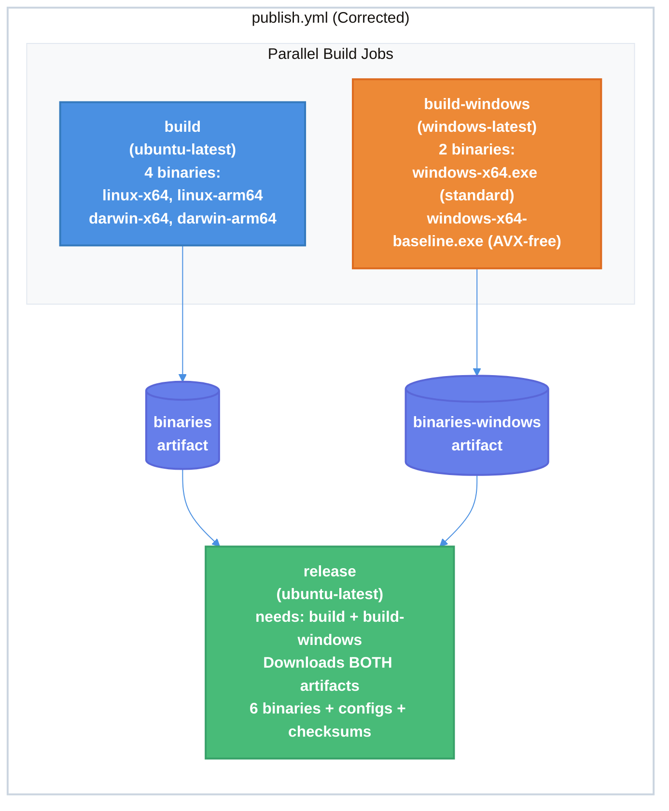

# Windows ARM64 CI Pipeline Corrections and Validation Technical Design Document

| Document Metadata      | Details                                                                        |
| ---------------------- | ------------------------------------------------------------------------------ |
| Author(s)              | flora131                                                                       |
| Status                 | Draft (WIP)                                                                    |
| Team / Owner           | Atomic CLI                                                                     |
| Created / Last Updated | 2026-03-29                                                                     |

## 1. Executive Summary

The Windows ARM64 feature branch (`flora131/feature/windows-arm64`) diverged from the `main` branch's CI pattern by cross-compiling Windows binaries on `ubuntu-latest` instead of building them natively on `windows-latest`. This caused the `build-windows` job's `binaries-windows` artifact to be orphaned — built but never consumed by the `release` job. This spec corrects the CI pipeline to restore the two-job build pattern from `main`, where Linux/macOS binaries are cross-compiled on Ubuntu and Windows binaries (standard x64 + x64-baseline) are built natively on a Windows runner. It also addresses Prism compatibility validation (confirmed: baseline works on ARM64 Windows), Bun version strategy (`latest` for static AVX verifier guarantee), and two deferred cleanup items (`inferTargetArch()` guard and `win32-arm64` binding removal). This builds on the existing spec at `specs/windows-arm64-support.md` ([research: windows-arm64-bun-ci-research](../research/docs/2026-03-29-windows-arm64-bun-ci-research.md), Section 3.3).

## 2. Context and Motivation

### 2.1 Current State

The Windows ARM64 feature branch has all 5 MVP-scope files implemented ([research: windows-arm64-bun-ci-research](../research/docs/2026-03-29-windows-arm64-bun-ci-research.md), Section 5):

| File | Change | Status |
|------|--------|--------|
| `install.ps1` | ARM64 remaps to `windows-x64-baseline.exe` with info message | Done |
| `.github/workflows/publish.yml` | Dual Windows builds (standard + baseline) | Done (corrected) |
| `src/scripts/build-binary.ts` | `isBaseline` derived from `--target`; `__ATOMIC_BASELINE__` injected via `define` | Done |
| `src/services/system/download.ts` | `getBinaryFilename()` checks `__ATOMIC_BASELINE__` for self-update | Done |
| `install.sh` | Windows delegation passes version/prerelease args; uses `pwsh` | Done |

The existing spec (`specs/windows-arm64-support.md`) documents the overall dual-binary approach, the `__ATOMIC_BASELINE__` build-time discriminator pattern, and the MVP file changes. **This document addresses the CI pipeline structure specifically**, which diverged from `main` and needed correction.

**Architecture (before correction):**

```
publish.yml (feature branch — DIVERGED)
+-------------------------------------------------------+
|  build (ubuntu-latest)                                 |
|  Cross-compiles 6 binaries (Linux + macOS + Windows)   |  <-- WRONG: Windows here
|  Uploads as "binaries" artifact                        |
+-------------------------------------------------------+
|  build-windows (windows-latest)                        |
|  Builds 1 Windows binary natively                      |  <-- ORPHANED: output unused
|  Uploads as "binaries-windows" artifact                |
+-------------------------------------------------------+
|  release (ubuntu-latest)                               |
|  needs: [build, build-windows]                         |
|  Downloads: "binaries" ONLY                            |  <-- MISSING: "binaries-windows"
|  Waits for build-windows but ignores its output        |
+-------------------------------------------------------+
```

### 2.2 The Problem

**CI Pattern Divergence:** The feature branch moved both Windows build commands (`bun-windows-x64` and `bun-windows-x64-baseline`) into the `build` job on `ubuntu-latest`, cross-compiling them from Linux. The `build-windows` job still existed and produced a `binaries-windows` artifact, but the `release` job never downloaded it. This meant:

1. Windows binaries were cross-compiled from Linux instead of built natively on Windows — diverging from the `main` branch pattern
2. The `release` job declared `needs: [build, build-windows]` but only consumed the `binaries` artifact — wasting CI minutes on `build-windows` whose output was discarded
3. Native Windows builds avoid cross-compilation edge cases and match the environment users actually run the binary on

**Prism Compatibility Risk:** The existing research documents assumed PR #27801's static AVX verifier fully resolved the Prism crash issue (#21869). However, deeper analysis revealed two interpretations of the original crash ([research: windows-arm64-bun-ci-research](../research/docs/2026-03-29-windows-arm64-bun-ci-research.md), Section 1.4):

- **Interpretation A (AVX leak):** AVX instructions leaked into baseline builds through `highway.zig`. PR #27801 closes the leak. **Confirmed correct.**
- **Interpretation B (fallback bug):** The SSE4.2 fallback path itself had a bug under Prism. The static verifier would not fix this. **Ruled out by empirical validation.**

**Resolution:** Bun issue #21869 has been confirmed fixed — the baseline binary works on ARM64 Windows ([research: 388-389-windows-arm64-support](../research/docs/2026-03-20-388-389-windows-arm64-support.md), UPDATE 3).

## 3. Goals and Non-Goals

### 3.1 Functional Goals

- [ ] Restore the `main` branch two-job CI pattern: `build` on `ubuntu-latest` (Linux/macOS, 4 binaries) and `build-windows` on `windows-latest` (standard + baseline, 2 binaries)
- [ ] The `release` job downloads both `binaries` and `binaries-windows` artifacts
- [ ] Windows binaries are built natively on `windows-latest`, not cross-compiled from Linux
- [ ] Both standard (`atomic-windows-x64.exe`) and baseline (`atomic-windows-x64-baseline.exe`) binaries appear in the release
- [ ] Bun version set to `latest` across all CI jobs for static AVX verifier guarantee (v1.3.11+)
- [ ] `build-windows` job includes `prepare:opentui-bindings` step to ensure all platform bindings are available for native builds

### 3.2 Non-Goals (Out of Scope)

- [ ] Implementing `inferTargetArch()` + ARM64 guard in `build-binary.ts` (deferred to follow-up PR per existing spec)
- [ ] Removing `win32-arm64` from `DEFAULT_PLATFORMS` in `prepare-opentui-bindings.ts` (deferred to follow-up PR)
- [ ] Adding `windows-11-arm` CI runner for ARM64 integration testing (public preview, costs money, adds no value for x64 targets)
- [ ] Supporting native `atomic-windows-arm64.exe` (blocked by TinyCC/`bun:ffi` — [Bun #28055](https://github.com/oven-sh/bun/issues/28055))
- [ ] Pinning Bun to a specific version (decided: `latest` is preferred)

## 4. Proposed Solution (High-Level Design)

### 4.1 System Architecture Diagram



### 4.2 Architectural Pattern

The CI follows a **two-job parallel build** pattern matching `main`:

- **`build` on `ubuntu-latest`:** Cross-compiles Linux and macOS binaries (4 total). Runs tests and typecheck. Free for public repos.
- **`build-windows` on `windows-latest`:** Builds Windows binaries **natively** (2 total: standard + baseline). Free for public repos.
- **`release` on `ubuntu-latest`:** Downloads both `binaries` and `binaries-windows` artifacts, merges into a single release.

This pattern avoids cross-compilation edge cases for Windows and matches the environment users actually run the binary on ([research: windows-arm64-bun-ci-research](../research/docs/2026-03-29-windows-arm64-bun-ci-research.md), Section 3.2).

### 4.3 Key Components

| Component | Change | Justification |
|-----------|--------|---------------|
| `publish.yml` `build` job | Remove Windows build lines (keep only Linux + macOS) | Restores `main` pattern; Windows builds belong in `build-windows` |
| `publish.yml` `build-windows` job | Build both `atomic-windows-x64.exe` (native, no `--target`) and `atomic-windows-x64-baseline.exe` (`--target=bun-windows-x64-baseline`); add `prepare:opentui-bindings`, tests, and typecheck steps | Native builds avoid cross-compilation edge cases; bindings needed for embedded OpenTUI; tests catch Windows-specific regressions |
| `publish.yml` `release` job | Download both `binaries` and `binaries-windows` artifacts | Consumes output from both build jobs instead of orphaning `binaries-windows` |
| Bun version (`oven-sh/setup-bun@v2`) | Set to `latest` in all jobs | Guarantees static AVX verifier (v1.3.11+); avoids manual version bumps |

## 5. Detailed Design

### 5.1 `build` Job — Linux/macOS Only

**File:** `.github/workflows/publish.yml` — `build` job

The `build` job on `ubuntu-latest` cross-compiles **only** Linux and macOS binaries (4 total). All Windows build lines are removed from this job.

```yaml
- name: Build binaries for all platforms
  run: |
    mkdir -p dist

    # Linux x64
    bun run src/scripts/build-binary.ts --minify --target=bun-linux-x64 --outfile dist/atomic-linux-x64

    # Linux arm64
    bun run src/scripts/build-binary.ts --minify --target=bun-linux-arm64 --outfile dist/atomic-linux-arm64

    # macOS x64
    bun run src/scripts/build-binary.ts --minify --target=bun-darwin-x64 --outfile dist/atomic-darwin-x64

    # macOS arm64 (Apple Silicon)
    bun run src/scripts/build-binary.ts --minify --target=bun-darwin-arm64 --outfile dist/atomic-darwin-arm64
```

**Upload artifact:** `binaries` (contains 4 binaries + config archives).

### 5.2 `build-windows` Job — Native Windows Builds

**File:** `.github/workflows/publish.yml` — `build-windows` job

The `build-windows` job on `windows-latest` builds both Windows binaries natively:

```yaml
build-windows:
  name: Build Windows Binaries
  runs-on: windows-latest
  # ... same conditional as build job ...

  steps:
    - name: Checkout repository
      uses: actions/checkout@v6

    - name: Setup Bun
      uses: oven-sh/setup-bun@v2
      with:
        bun-version: latest

    - name: Install dependencies
      run: bun ci

    - name: Install all platform-specific opentui native bindings
      run: bun run prepare:opentui-bindings

    - name: Run tests
      run: bun test 2>&1 | cat

    - name: Run typecheck
      run: bun run typecheck

    - name: Build Windows binaries natively
      run: |
        mkdir dist

        # Windows x64 (standard, with AVX for native x64 users)
        bun run src/scripts/build-binary.ts --minify --outfile dist/atomic-windows-x64.exe

        # Windows x64-baseline (AVX-free for ARM64 Prism compatibility)
        bun run src/scripts/build-binary.ts --minify --target=bun-windows-x64-baseline --outfile dist/atomic-windows-x64-baseline.exe

    - name: Upload Windows artifacts
      uses: actions/upload-artifact@v7
      with:
        name: binaries-windows
        path: dist/
```

**Key details:**
- **Standard binary** (no `--target` flag): Built natively on the Windows runner. Uses the host Bun, which includes AVX/AVX2 optimizations. Produces `atomic-windows-x64.exe`.
- **Baseline binary** (`--target=bun-windows-x64-baseline`): Uses Bun's cross-target compilation to produce an AVX-free variant from the same Windows runner. Produces `atomic-windows-x64-baseline.exe` with `__ATOMIC_BASELINE__` build-time flag injected.
- **`prepare:opentui-bindings`:** Required because the Windows runner's `bun ci` only installs `@opentui/core-win32-x64` (the host binding). The script fetches the other platform bindings needed for cross-compilation targets embedded in the binary.
- **Upload artifact:** `binaries-windows` (separate from `binaries`).

### 5.3 `release` Job — Download Both Artifacts

**File:** `.github/workflows/publish.yml` — `release` job

The `release` job must download both artifacts into the same `dist/` directory:

```yaml
release:
  name: Create Release
  runs-on: ubuntu-latest
  needs: [build, build-windows]
  # ...

  steps:
    - name: Checkout repository
      uses: actions/checkout@v6

    - name: Download artifacts
      uses: actions/download-artifact@v8
      with:
        name: binaries
        path: dist/

    - name: Download Windows artifacts
      uses: actions/download-artifact@v8
      with:
        name: binaries-windows
        path: dist/

    # ... version, checksums, release creation ...
```

**Release files (9 total):**

```yaml
files: |
  dist/atomic-linux-x64
  dist/atomic-linux-arm64
  dist/atomic-darwin-x64
  dist/atomic-darwin-arm64
  dist/atomic-windows-x64.exe
  dist/atomic-windows-x64-baseline.exe
  dist/atomic-config.tar.gz
  dist/atomic-config.zip
  dist/checksums.txt
```

Checksums auto-include both Windows binaries via `sha256sum *` in the `dist/` directory.

### 5.4 Bun Version Strategy

**Decision: Use `bun-version: latest` across all CI jobs.**

| Factor | `latest` | Pinned (e.g., `>= 1.3.11`) |
|--------|----------|---------------------------|
| AVX verifier guarantee | Always present (v1.3.11+) | Guaranteed if pin >= 1.3.11 |
| Bug fixes | Automatic | Requires manual bumps |
| Regression risk | Possible but mitigated by test suite | Lower |
| Maintenance burden | None | Version bump PRs |

The static AVX verifier (PR #27801) was introduced in Bun v1.3.11 and is present in all subsequent versions. Using `latest` ensures we always have it while benefiting from ongoing Bun improvements. The CI test suite (`bun test`) provides a safety net against potential breaking changes ([research: windows-arm64-bun-ci-research](../research/docs/2026-03-29-windows-arm64-bun-ci-research.md), Section 5, Open Question 5).

### 5.5 Binary Names and Targets

| Binary | Build Job | `--target` Flag | AVX | Use Case |
|--------|-----------|----------------|-----|----------|
| `atomic-linux-x64` | `build` (ubuntu) | `bun-linux-x64` | N/A | Linux x64 |
| `atomic-linux-arm64` | `build` (ubuntu) | `bun-linux-arm64` | N/A | Linux ARM64 |
| `atomic-darwin-x64` | `build` (ubuntu) | `bun-darwin-x64` | N/A | macOS Intel |
| `atomic-darwin-arm64` | `build` (ubuntu) | `bun-darwin-arm64` | N/A | macOS Apple Silicon |
| `atomic-windows-x64.exe` | `build-windows` (windows) | None (native) | Yes | Windows x64 (native) |
| `atomic-windows-x64-baseline.exe` | `build-windows` (windows) | `bun-windows-x64-baseline` | No | Windows ARM64 (via Prism) |

### 5.6 Prism Compatibility Validation

The critical compatibility question — whether `bun-windows-x64-baseline` compiled binaries run under Prism — has been resolved:

**Confirmed:** Bun issue #21869 is fixed. The baseline binary works on ARM64 Windows ([research: 388-389-windows-arm64-support](../research/docs/2026-03-20-388-389-windows-arm64-support.md), UPDATE 3). The crash was caused by AVX instructions leaking into baseline builds through `highway.zig` (Interpretation A), and PR #27801's static verifier eliminates this leak.

**What this means for CI:**
- No `windows-11-arm` runner needed for validation (public preview, always billed, adds no value)
- The static AVX verifier in Bun >= v1.3.11 is a CI-level hard gate — if AVX leaks into baseline, the Bun build itself fails
- Native build on `windows-latest` (x64) + `--target=bun-windows-x64-baseline` produces a verified AVX-free binary

## 6. Alternatives Considered

| Option | Pros | Cons | Reason for Rejection |
|--------|------|------|---------------------|
| **A: Cross-compile all 6 from Ubuntu (branch's original approach)** | Single build job, simpler YAML | Diverges from `main`; orphans `build-windows`; cross-compilation edge cases for Windows | Introduced unnecessary divergence and wasted CI time on unused `build-windows` output |
| **B: Cross-compile all 6 from Ubuntu, remove `build-windows` entirely** | Truly single-job; no wasted CI time | Diverges from `main`; loses native Windows build assurance; cross-compilation may miss Windows-specific issues | Native builds catch issues cross-compilation misses (e.g., path handling, PE format edge cases) |
| **C: Use `windows-11-arm` runner for ARM64 validation** | Direct ARM64 testing in CI | Public preview (not GA); always billed ($0.008-$0.014/min); both binaries are x64 targets anyway | Unnecessary cost for x64 builds; ARM64 validation confirmed manually |
| **D: Restore `main` pattern with native `build-windows` (Selected)** | Matches `main`; native Windows builds; both artifacts consumed by `release` | Two build jobs instead of one | **Selected:** Consistency with `main`, native build quality, minimal CI cost (free for public repos) |

## 7. Cross-Cutting Concerns

### 7.1 CI Cost

Both `ubuntu-latest` and `windows-latest` runners are **free for public repositories** on GitHub Actions. The `build-windows` job adds parallel build time but does not increase total wall-clock time (it runs concurrently with `build`). The additional baseline binary build step takes ~30 seconds on the Windows runner.

### 7.2 Artifact Naming

The two-artifact pattern (`binaries` and `binaries-windows`) must use distinct names. The `release` job downloads both into the same `dist/` directory. File name collisions are impossible because Linux/macOS binaries have no `.exe` extension and Windows binaries do.

### 7.3 OpenTUI Bindings in `build-windows`

The `build-windows` job must run `prepare:opentui-bindings` before building. Without this step, the Windows runner only has `@opentui/core-win32-x64` (the host binding). The baseline binary still needs all platform bindings available at bundle time because `Bun.build()` resolves imports statically — even though the baseline binary only loads `win32-x64` at runtime, the bundler must see all referenced bindings.

### 7.4 `install.sh` Windows Delegation

The feature branch changed `install.sh` to use `pwsh` (PowerShell 7+) instead of `powershell` (Windows PowerShell 5.1). `pwsh` is available on modern Windows installations and is the recommended PowerShell for new scripts. This diverges from the original spec's `powershell` reference but is the correct choice for forward compatibility ([research: windows-arm64-bun-ci-research](../research/docs/2026-03-29-windows-arm64-bun-ci-research.md), Section 5).

### 7.5 Compatibility with Future Native ARM64

When TinyCC gains ARM64 Windows support ([Bun #28055](https://github.com/oven-sh/bun/issues/28055)), the CI pattern extends naturally:
- `build-windows` adds a third build step: `--target=bun-windows-arm64 --outfile dist/atomic-windows-arm64.exe`
- `release` files list adds `dist/atomic-windows-arm64.exe`
- `install.ps1` ARM64 case maps to `windows-arm64.exe` instead of `windows-x64-baseline.exe`
- No structural changes to the two-job pattern

## 8. Migration, Rollout, and Testing

### 8.1 Deployment Strategy

- [ ] **Phase 1 — CI Correction:** Restore the two-job build pattern. Remove Windows build lines from `build` job. Extend `build-windows` to build both standard and baseline binaries natively. Restore `binaries-windows` download in `release` job.
- [ ] **Phase 2 — Validation:** Verify CI produces all 6 binaries correctly. Confirm both `binaries` and `binaries-windows` artifacts are uploaded. Verify release includes all expected files and checksums.
- [ ] **Phase 3 — Merge and Release:** Merge to `main`. Next release includes both Windows binaries. ARM64 Windows installs now work via Prism emulation.
- [ ] **Phase 4 — Deferred Cleanup (follow-up PR):** Add `inferTargetArch()` + ARM64 guard to `build-binary.ts`. Remove `win32-arm64` from `prepare-opentui-bindings.ts` `DEFAULT_PLATFORMS`.

### 8.2 Test Plan

**CI Pipeline Tests:**
- [ ] `build` job on `ubuntu-latest` produces exactly 4 binaries (Linux x64, Linux arm64, macOS x64, macOS arm64) + config archives
- [ ] `build` job does NOT produce any Windows binaries
- [ ] `build-windows` job on `windows-latest` runs tests and typecheck successfully
- [ ] `build-windows` job on `windows-latest` produces exactly 2 binaries (`atomic-windows-x64.exe`, `atomic-windows-x64-baseline.exe`)
- [ ] `release` job downloads both `binaries` and `binaries-windows` artifacts
- [ ] `release` job produces 9 files in the GitHub Release (6 binaries + 2 config archives + checksums)
- [ ] `checksums.txt` contains SHA-256 entries for all 6 binaries and both config archives

**Binary Correctness Tests:**
- [ ] `atomic-windows-x64.exe` (standard) runs on native x64 Windows without errors
- [ ] `atomic-windows-x64-baseline.exe` (baseline) runs on ARM64 Windows via Prism without AVX-related crashes
- [ ] Baseline binary's `getBinaryFilename()` returns `"atomic-windows-x64-baseline.exe"` (self-update stays on baseline track)
- [ ] Standard binary's `getBinaryFilename()` returns `"atomic-windows-x64.exe"` (self-update stays on standard track)

**Existing Unit Tests (already on branch):**
- [ ] `tests/scripts/build-binary-baseline.test.ts` — verifies `__ATOMIC_BASELINE__` injection logic
- [ ] `tests/scripts/install-sh-windows-delegation.test.ts` — verifies `install.sh` passes version/prerelease args
- [ ] `tests/services/system/download.test.ts` — verifies `getBinaryFilename()` baseline suffix logic

## 9. Open Questions / Unresolved Issues

- [x] **Q1: Should the `build-windows` job also run tests and typecheck, or only build?**

  **Resolved: (B) Full test suite and typecheck on Windows.** Run tests and typecheck in the `build-windows` job in addition to building. This catches Windows-specific runtime regressions (path handling, line endings, FFI loading) that the Ubuntu test run would miss. The additional CI time (~2-3 min) is acceptable given both runners are free for public repos and run in parallel.

- [x] **Q2: Should `install.sh` use `pwsh` or `powershell` for Windows delegation?**

  **Resolved: (A) Use `pwsh` (PowerShell 7+).** `pwsh` is the actively developed PowerShell and the forward-looking choice. Users who encounter `install.sh` on Windows are running in MSYS2/Cygwin/Git Bash — a developer environment where `pwsh` availability is a reasonable assumption. The feature branch already uses `pwsh`, so no change needed.

- [x] **Q3: What is the validation approach for Prism compatibility on future Bun versions?**

  **Resolved: (A) Trust Bun's CI (current approach).** The `main` branch already uses `bun-version: latest` across all CI jobs. Bun's static AVX verifier (PR #27801) is a hard CI gate in Bun's own pipeline — if baseline builds pass Bun's CI, they are guaranteed AVX-free. No additional validation tooling is needed in Atomic CLI's CI. This is consistent with the existing `main` branch strategy.

## Appendix A: Research References

| Document | Path | Relevance |
|----------|------|-----------|
| Windows ARM64 Bun CI Research | `research/docs/2026-03-29-windows-arm64-bun-ci-research.md` | **Primary research for this spec.** CI structure analysis, Prism validation, runner strategy, OpenTUI binding compatibility |
| Windows ARM64 Support Research | `research/docs/2026-03-20-388-389-windows-arm64-support.md` | Foundational ARM64 research for issues #388/#389; confirms baseline fix in UPDATE 3 |
| Dual-Binary Windows Approach | `research/docs/2026-03-23-dual-binary-windows-approach.md` | `__ATOMIC_BASELINE__` build-time discriminator mechanics |
| Original Windows ARM64 Spec | `specs/windows-arm64-support.md` | Existing spec covering overall approach; this spec extends it with CI corrections |
| Binary Distribution & Installers | `research/docs/2026-01-21-binary-distribution-installers.md` | Original installer architecture; `install.sh`/`install.ps1` design |
| OpenTUI Distribution CI Fix | `research/docs/2026-02-12-opentui-distribution-ci-fix.md` | `prepare-opentui-bindings` script and `optionalDependencies` pattern |

## Appendix B: Files Modified

| File | Change Type | Description |
|------|-------------|-------------|
| `.github/workflows/publish.yml` | Edit | Remove Windows builds from `build` job; extend `build-windows` with dual builds + opentui bindings; restore `binaries-windows` download in `release` |

## Appendix C: External References

| Reference | Link | Relevance |
|-----------|------|-----------|
| Bun PR #27801 | [Static baseline CPU instruction verifier](https://github.com/oven-sh/bun/pull/27801) | Guarantees baseline builds are AVX-free; critical for Prism safety |
| Bun #21869 | [x64 Bun crashes under Prism (AVX)](https://github.com/oven-sh/bun/issues/21869) | Confirmed fixed — baseline works on ARM64 Windows |
| Bun #28055 | [Support bun:ffi on Windows ARM64](https://github.com/oven-sh/bun/issues/28055) | Blocks native ARM64; future trigger for CI pattern extension |
| GitHub Actions Runners | windows-latest (x64, free), windows-11-arm (ARM64, public preview, billed) | Runner selection rationale |
