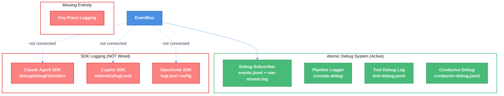
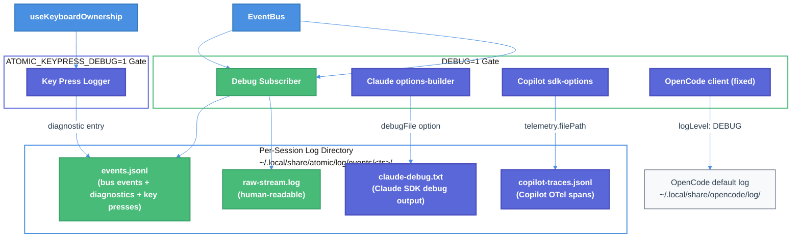

# Enhanced Debug Logging & SDK Integration Technical Design Document

| Document Metadata      | Details                          |
| ---------------------- | -------------------------------- |
| Author(s)              | lavaman131                       |
| Status                 | Draft (WIP)                      |
| Team / Owner           | Atomic CLI                       |
| Created / Last Updated | 2026-04-02                       |

## 1. Executive Summary

Atomic TUI has a rich internal debug logging system (`events.jsonl`, `raw-stream.log`, pipeline loggers) but the three SDK backends (Copilot, Claude Agent SDK, OpenCode) have their logging capabilities **completely unwired** — none emit debug output through Atomic's debug subscriber when `DEBUG=1`. Additionally, keyboard input events are silently discarded at the `useKeyboardOwnership` hook despite full key metadata being available. This spec proposes: (1) fixing the `DEBUG === "1"` exact-match bug in `opencode.ts`, (2) wiring all three SDK loggers into Atomic's per-session debug output, (3) adding privacy-safe key press diagnostic logging, and (4) removing the AppInsights/OTel telemetry upload pipeline to simplify the codebase and focus on local debugging. The result is a unified local debugging experience where `DEBUG=1` surfaces the full observability picture across all layers.

> **Research basis:** [research/docs/2026-04-02-logging-debugging-traces-unified-research.md](../research/docs/2026-04-02-logging-debugging-traces-unified-research.md)

## 2. Context and Motivation

### 2.1 Current State

Atomic TUI's debug system is activated via `DEBUG=1` and writes structured JSONL event logs and human-readable stream logs to per-session directories under `~/.local/share/atomic/log/events/<timestamp>/`. The system captures all EventBus traffic, process errors, and lifecycle markers through the debug subscriber (`src/services/events/debug-subscriber/`).

**Architecture:**



**Limitations** (per [research](../research/docs/2026-04-02-logging-debugging-traces-unified-research.md)):
- **Copilot SDK:** `logLevel` and `telemetry` config fields exist in `CopilotClientOptions` but are never set at client creation (`src/services/agents/clients/copilot.ts:586`). OTel file traces with three-level span hierarchy (`invoke_agent` -> `chat` -> `execute_tool`) and 7 metrics are available but unused.
- **Claude Agent SDK:** `debug`, `debugFile`, and `stderr` options in `buildClaudeSdkOptions()` are unused (`src/services/agents/clients/claude.ts:127`). The SDK has 1,682+ distinct log calls in the subprocess covering API calls, tool execution, MCP, permissions, sandbox, and auth.
- **OpenCode SDK:** No `logLevel` passed to `createSdkClient`; the module-level `debugLog` uses `DEBUG === "1"` exact string match instead of normalized truthy check (`src/services/agents/clients/opencode.ts:31`).
- **Key presses:** The `KeyEvent` object with full metadata (`name`, `ctrl`, `shift`, `meta`, `raw`, `source`, `eventType`) is consumed and discarded at `src/state/chat/keyboard/use-keyboard-ownership.ts:162` without any diagnostic trace.
- **AppInsights:** `handleTelemetryUpload()` and the entire OTel/Azure Monitor pipeline are being removed in this work. The telemetry upload system will be rewritten in a future phase with a cleaner design.

### 2.2 The Problem

- **Debugging SDK issues is blind:** When an agent session fails or behaves unexpectedly, engineers cannot see what the underlying SDK was doing — API calls, tool executions, retries, errors — because none of that output is captured.
- **Key press debugging is impossible:** Issues like stuck states, unresponsive shortcuts, or unexpected ESC/Ctrl+C behavior cannot be diagnosed because key events leave no trace.
- **Inconsistent debug gating:** The `opencode.ts` exact-match `DEBUG === "1"` bug means setting `DEBUG=true` or `DEBUG=on` silently leaves OpenCode client debug disabled while all other subsystems activate.
- **Fragmented log landscape:** Even when manually enabled, each SDK writes to its own default location (Claude: `~/.claude/debug/`, OpenCode: `~/.local/share/opencode/log/`, Copilot: not activated). No single directory gives a unified view.

## 3. Goals and Non-Goals

### 3.1 Functional Goals

- [ ] **G1:** Fix `DEBUG === "1"` exact-match bug in `opencode.ts` to use normalized truthy check consistent with all other debug gates.
- [ ] **G2:** Wire Claude Agent SDK debug output into Atomic's per-session log directory when `DEBUG=1`.
- [ ] **G3:** Wire Copilot SDK file-based OTel traces and debug log level into Atomic's per-session log directory when `DEBUG=1`.
- [ ] **G4:** Wire OpenCode SDK log level (`"DEBUG"`) when `DEBUG=1`.
- [ ] **G5:** Add privacy-safe key press diagnostic logging gated on `DEBUG=1`, emitting to `events.jsonl`.
- [ ] **G6:** Remove the AppInsights/OTel telemetry upload pipeline (`telemetry-upload.ts`, `@azure/monitor-opentelemetry` dependency, `--upload-telemetry` CLI flag, and related wiring). Local telemetry event buffering (`telemetry-file-io.ts`, `telemetry-tui.ts`) may be retained or removed depending on whether local-only analytics are still useful.
- [ ] **G7:** Ensure all new logging respects the existing session directory lifecycle (10-session rotation, cleanup on startup).

### 3.2 Non-Goals (Out of Scope)

- [ ] We will NOT build a unified log viewer/aggregator UI in this phase.
- [ ] We will NOT enable Copilot `captureContent: true` (full prompt/response capture) due to privacy implications.
- [ ] We will NOT forward SDK logs into the EventBus — they remain file-based debug artifacts alongside `events.jsonl`.
- [ ] We will NOT add real-time log streaming to the TUI display.

## 4. Proposed Solution (High-Level Design)

### 4.1 System Architecture Diagram



### 4.2 Architectural Pattern

We follow the existing **file-based debug logging** pattern already established by the debug subscriber. SDK debug outputs are co-located as additional files in the same per-session directory, maintaining the convention that `DEBUG=1` activates everything and the session directory is the single place to look.

Key press logging follows the existing **diagnostic entry** pattern used by `startup`, `bus_error`, and `process_error` entries in `events.jsonl`.

### 4.3 Key Components

| Component | Responsibility | File(s) | Change Type |
| --- | --- | --- | --- |
| OpenCode debug fix | Normalize `DEBUG` check from `=== "1"` to truthy | `src/services/agents/clients/opencode.ts:31` | Bug fix |
| Claude debug wiring | Pass `debug: true` and `debugFile` to SDK options | `src/services/agents/clients/claude/options-builder.ts` | Enhancement |
| Copilot debug wiring | Pass `telemetry` and `logLevel` to SDK options | `src/services/agents/clients/copilot/sdk-options.ts` | Enhancement |
| OpenCode log level wiring | Pass `logLevel: "DEBUG"` to SDK client config | `src/services/agents/clients/opencode.ts` | Enhancement |
| Key press logger | Log significant key events as diagnostic entries | `src/state/chat/keyboard/use-keyboard-ownership.ts` | New feature |
| Debug subscriber config | Export session log dir path for SDK consumers | `src/services/events/debug-subscriber/config.ts` | Minor enhancement |
| AppInsights removal | Remove OTel/Azure Monitor upload pipeline | `src/services/telemetry/telemetry-upload.ts`, `--upload-telemetry` CLI flag, `@azure/monitor-opentelemetry` dep | Deletion |

## 5. Detailed Design

### 5.1 Phase 1: Fix OpenCode Debug Gate (Bug Fix)

**File:** `src/services/agents/clients/opencode.ts:31-33`

**Current (broken):**
```typescript
const debugLog = process.env.DEBUG === "1"
  ? (label: string, data?: unknown) => console.debug(`[opencode:${label}]`, data)
  : (_label: string, _data?: unknown) => {};
```

**Proposed:**
```typescript
import { isPipelineDebug } from "../../events/pipeline-logger";

const debugLog = isPipelineDebug()
  ? (label: string, data?: unknown) => console.debug(`[opencode:${label}]`, data)
  : (_label: string, _data?: unknown) => {};
```

This aligns with all other debug checks in the codebase that use `isPipelineDebug()` which accepts `"1"`, `"true"`, and `"on"` (case-insensitive). See [research: Section "OpenCode Client Inline Debug"](../research/docs/2026-04-02-logging-debugging-traces-unified-research.md).

### 5.2 Phase 2: Wire Claude Agent SDK Debug Logging

**File:** `src/services/agents/clients/claude/options-builder.ts`

**Integration point:** `buildClaudeSdkOptions()` — the function that constructs the `Options` object passed to each Claude session.

**Changes:**
1. Import `isPipelineDebug` and the session log directory resolver.
2. When `isPipelineDebug()` is true, set:
   - `debug: true` — enables the SDK's built-in debug logging
   - `debugFile: "<session-log-dir>/claude-debug.txt"` — directs output to the Atomic session directory instead of the default `~/.claude/debug/<sessionId>.txt`

**Design notes:**
- The `debugFile` option implicitly enables `debug`, so setting both is belt-and-suspenders but explicit.
- Claude's debug format is plain text (`<ISO8601> [LEVEL] message`), not JSONL. It will be written as a separate file in the session directory rather than merged into `events.jsonl`, keeping the format intact for readability.
- The `stderr` callback is NOT used — it would require a format bridge to emit into `events.jsonl` and the plain-text file is sufficient for debugging.

**Pseudocode:**
```typescript
function buildClaudeSdkOptions(/* existing params */) {
  const options = { /* existing option building */ };

  if (isPipelineDebug()) {
    const sessionLogDir = getActiveSessionLogDir();
    if (sessionLogDir) {
      options.debug = true;
      options.debugFile = path.join(sessionLogDir, "claude-debug.txt");
    }
  }

  return options;
}
```

### 5.3 Phase 3: Wire Copilot SDK Telemetry & Log Level

**File:** `src/services/agents/clients/copilot/sdk-options.ts:44-56`

**Integration point:** `buildCopilotSdkOptions()` — constructs the options object for `CopilotClient`.

**Changes:**
1. When `isPipelineDebug()` is true, set:
   - `logLevel: "debug"` — enables verbose SDK console logging
   - `telemetry: { filePath: "<session-log-dir>/copilot-traces.jsonl", exporterType: "file" }` — enables file-based OTel trace export

**Design notes:**
- Copilot OTel is off by default with zero overhead until `TelemetryConfig` is set (per [research](../research/docs/2026-04-02-logging-debugging-traces-unified-research.md)).
- `captureContent: false` (the default) is preserved — we do NOT capture full prompts/responses.
- The trace file will contain the three-level span hierarchy: `invoke_agent` -> `chat` -> `execute_tool`, plus 7 OTel metrics including `gen_ai.client.token.usage` and `github.copilot.tool.call.duration`.

**Pseudocode:**
```typescript
function buildCopilotSdkOptions(/* existing params */) {
  const options = { /* existing option building */ };

  if (isPipelineDebug()) {
    options.logLevel = "debug";
    const sessionLogDir = getActiveSessionLogDir();
    if (sessionLogDir) {
      options.telemetry = {
        filePath: path.join(sessionLogDir, "copilot-traces.jsonl"),
        exporterType: "file",
      };
    }
  }

  return options;
}
```

### 5.4 Phase 4: Wire OpenCode SDK Log Level

**File:** `src/services/agents/clients/opencode.ts`

**Integration point:** The `createSdkClient` / `createOpencodeServer` call site.

**Changes:**
- When `isPipelineDebug()` is true, pass `logLevel: "DEBUG"` to the SDK configuration.

**Design notes:**
- OpenCode logs to its own default location: `~/.local/share/opencode/log/<YYYY-MM-DDTHHMMSS>.log`. The SDK does not support redirecting the log path via config.
- **Co-location strategy:** On TUI session end (during the debug subscriber's teardown/flush), copy the most recent OpenCode log file from `~/.local/share/opencode/log/` into the Atomic session directory as `opencode-debug.log`. This ensures all debug artifacts are co-located. If the session crashes before teardown, the copy won't happen, but the original remains at the default OpenCode path.
- Format: `INFO  2025-01-09T12:34:56 +42ms service=llm key=value message` — structured key-value plain text.

### 5.5 Phase 5: Key Press Diagnostic Logging

**File:** `src/state/chat/keyboard/use-keyboard-ownership.ts:162`

**Integration point:** The single `useKeyboard` callback — the sole entry point for all key events.

**Gate:** `DEBUG=1` — key press logging activates alongside all other debug output. No separate environment variable is introduced; this keeps the debug experience unified under a single flag. The privacy-filtering (only named keys, no printable characters) keeps volume manageable.

**Privacy rules:**
- Only log **named keys**: `escape`, `return`, `tab`, `backspace`, `delete`, `pageup`, `pagedown`, `up`, `down`, `left`, `right`, `home`, `end`, `f1`-`f12`, and modifier combos (Ctrl+key, Meta+key).
- **Redact printable character key names** (single-char `name` like `"a"`, `"1"`) — never log what the user types.
- Never log the `raw` field.

**Output:** Emit as a diagnostic entry to `events.jsonl` via `writeDiagnostic()`, following the existing pattern for `startup`/`bus_error`/`process_error` diagnostics.

**JSONL schema for key press diagnostic entry:**
```typescript
interface KeyPressDiagnosticEntry {
  seq: number;
  ts: string;             // ISO 8601
  category: "key_press";
  keyName: string;        // e.g., "escape", "return", "ctrl+c"
  modifiers: {
    ctrl: boolean;
    shift: boolean;
    meta: boolean;
  };
  eventType: string;      // from KeyEvent.eventType
  owner: string;          // current keyboard owner ID
}
```

**Important constraint:** `Ctrl+C` at the OS level triggers `process.on("SIGINT")` at `chat-ui-controller.ts:483`, bypassing the `useKeyboardOwnership` flow entirely. Key logging at this hook level will NOT capture OS-level signals. The existing `process_error` diagnostic handler already captures process-level interrupts, so this is acceptable.

### 5.6 Session Log Directory Access Pattern

**File:** `src/services/events/debug-subscriber/config.ts`

To enable SDK option builders to resolve the current session log directory, we need to expose the active session path. The debug subscriber already creates this directory during `attachDebugSubscriber()`.

**Approach:** Add a module-level getter `getActiveSessionLogDir(): string | undefined` in the debug subscriber config that returns the path of the current session's log directory (set during `initEventLog()`). SDK option builders call this to determine where to write their debug files. If the debug subscriber is not active (no `DEBUG=1`), returns `undefined`.

### 5.7 Phase 7: Remove AppInsights / OTel Telemetry Upload Pipeline

The entire Azure Application Insights upload pipeline is removed to simplify the codebase and focus on local debugging. The telemetry system will be redesigned in a future phase.

**Files to delete:**
- `src/services/telemetry/telemetry-upload.ts` — Core upload pipeline (`handleTelemetryUpload`, `initializeOpenTelemetry`, `emitEventsToAppInsights`, `flushAndShutdown`)
- `src/services/telemetry/telemetry-consent.ts` — First-run consent prompt (no upload destination to consent to)
- `tests/services/telemetry/telemetry-upload.test.ts` — Associated tests
- `tests/cli.telemetry-detach.test.ts` — Integration test for detached upload spawn

**Files to modify:**
- `src/cli.ts` — Remove the hidden `upload-telemetry` Commander subcommand (line ~234) and the `spawnTelemetryUpload()` background spawn function
- `src/services/telemetry/index.ts` — Remove re-export of `UploadResult` and any `telemetry-upload` references
- `package.json` — Remove `@azure/monitor-opentelemetry` dependency

**Files to retain (local telemetry buffering):**
- `src/services/telemetry/telemetry.ts` — Telemetry state management (anonymous ID, consent) — retain for now; may be useful for future telemetry redesign
- `src/services/telemetry/telemetry-file-io.ts` — Local JSONL event buffering — retain; provides local analytics capability
- `src/services/telemetry/telemetry-tui.ts` — TUI session tracker — retain; useful for local session analytics
- `src/services/telemetry/telemetry-cli.ts` — CLI command tracking — retain
- `src/services/telemetry/telemetry-session.ts` — Agent session tracking — retain
- `src/services/telemetry/telemetry-consent.ts` — Consent prompt — **remove** (no upload destination to consent to)
- `src/services/telemetry/telemetry-errors.ts` — Error handling — retain
- `src/services/telemetry/graph-integration.ts` — Workflow telemetry — retain
- `src/services/telemetry/types.ts` — Type definitions — retain
- `src/services/telemetry/constants.ts` — Constants — retain

**Design notes:**
- The `@azure/monitor-opentelemetry` dependency was intentionally lazy-loaded (NOT re-exported from `index.ts`) to avoid a 244ms startup penalty. Removing it entirely eliminates this concern.
- Local event buffering to JSONL files is retained because it provides useful local analytics without the upload infrastructure.
- The consent prompt (`telemetry-consent.ts`) may need adjustment since there is no longer an upload destination — this should be evaluated during implementation.

## 6. Alternatives Considered

| Option | Pros | Cons | Reason for Rejection |
| --- | --- | --- | --- |
| **A: Merge all SDK logs into `events.jsonl`** | Single file to inspect; unified timeline | Requires format bridges for each SDK (Claude=plain text, Copilot=OTel JSONL, OpenCode=key-value); high implementation complexity; pollutes the bus event timeline | Format incompatibility makes merging lossy or complex. Separate files preserve native format. |
| **B: Forward SDK logs through EventBus** | Full bus integration; lifecycle markers; gap tracking | SDK loggers are high-volume and not event-shaped; would overwhelm the bus and distort gap metrics | SDK debug output is too noisy for the EventBus; it's diagnostic, not event-driven. |
| **C: Separate `ATOMIC_KEYPRESS_DEBUG` flag** | Avoids noise during normal debug sessions | Adds yet another env var; user must remember to set it; fragmenting debug activation | **Rejected:** User preference is unified `DEBUG=1` gate. Privacy filtering (named keys only) keeps volume acceptable. |
| **D: Use Claude `stderr` callback for real-time bridging** | Could inject Claude debug lines into `events.jsonl` in real-time | Requires parsing plain-text format and converting to JSONL; fragile coupling to Claude's internal format | The `debugFile` approach is simpler and keeps native format intact. |
| **E: Redirect OpenCode logs to session dir** | Co-located with other session logs | SDK doesn't expose a log path config option | Not feasible without SDK changes. **Resolved:** Copy on session end instead. |

## 7. Cross-Cutting Concerns

### 7.1 Security and Privacy

- **Key press logging:** Printable characters are redacted by design. Only named keys and modifier combos are logged. The `raw` field (which contains the actual byte sequence) is never written.
- **Copilot `captureContent`:** Explicitly NOT enabled. The default `captureContent: false` prevents full prompt/response content from appearing in OTel traces.
- **Claude `debugFile`:** The debug output may contain API request/response metadata. These files reside in the user's local log directory (same permissions as existing `events.jsonl`) and are never uploaded to AppInsights.
- **Log directory permissions:** Inherit from the existing session directory creation logic which uses default user permissions.

### 7.2 Observability Strategy

After implementation, `DEBUG=1` produces the following unified per-session view:

| File | Source | Format | Content |
| --- | --- | --- | --- |
| `events.jsonl` | Debug subscriber + key press diagnostics | JSONL | Bus events, lifecycle markers, process errors, key presses |
| `raw-stream.log` | Debug subscriber | Plain text | Human-readable conversation flow |
| `claude-debug.txt` | Claude Agent SDK | Plain text | API calls, tool execution, MCP, permissions, auth |
| `copilot-traces.jsonl` | Copilot SDK OTel | JSONL (OTel) | Spans: invoke_agent, chat, execute_tool; metrics |
| `opencode-debug.log` | OpenCode SDK (copied on session end) | Plain text (key-value) | Service logs, LLM calls, tool execution |

OpenCode logs are copied from `~/.local/share/opencode/log/` into the session directory as `opencode-debug.log` on session end.

### 7.3 Performance

- **Zero overhead when disabled:** All new logging is gated behind `isPipelineDebug()`. The gating function caches its result after first call — no repeated env var reads.
- **Copilot OTel overhead:** Per SDK documentation, OTel is off by default with zero overhead until `TelemetryConfig` is set. File-based export is lightweight (append-only writes).
- **Claude debug overhead:** The `debugFile` option writes asynchronously within the SDK subprocess. No Atomic main thread impact.
- **Key press volume:** Only named keys are logged (not printable characters). Privacy filtering naturally limits volume to ~10-50 significant key events per minute in typical debugging scenarios.

## 8. Migration, Rollout, and Testing

### 8.1 Deployment Strategy

- [ ] **Phase 1:** Fix OpenCode `DEBUG === "1"` bug. Standalone bug fix with no dependencies.
- [ ] **Phase 2:** Add `getActiveSessionLogDir()` accessor to debug subscriber config. Required by Phases 3-4.
- [ ] **Phase 3:** Wire Claude Agent SDK debug output (`debugFile` in session dir).
- [ ] **Phase 4:** Wire Copilot SDK telemetry and log level.
- [ ] **Phase 5:** Wire OpenCode SDK log level + copy-on-session-end to session dir.
- [ ] **Phase 6:** Add key press diagnostic logging gated on `DEBUG=1`.
- [ ] **Phase 7:** Remove AppInsights/OTel upload pipeline (`telemetry-upload.ts`, `--upload-telemetry` CLI flag, `@azure/monitor-opentelemetry` dependency).

Phases 1, 6, and 7 are independent of each other and can be implemented in parallel. Phases 3-5 depend on Phase 2 but are independent of each other.

### 8.2 Test Plan

- **Unit Tests:**
  - Verify `opencode.ts` debug gate activates for `DEBUG=true`, `DEBUG=on`, `DEBUG=1` and does NOT activate for `DEBUG=0`, `DEBUG=false`, `DEBUG=off`.
  - Verify `buildClaudeSdkOptions()` sets `debug` and `debugFile` when `DEBUG=1` and does NOT set them when disabled.
  - Verify `buildCopilotSdkOptions()` sets `telemetry` and `logLevel` when `DEBUG=1` and does NOT set them when disabled.
  - Verify key press logger redacts single-character key names and never includes the `raw` field.
  - Verify key press logger activates when `DEBUG=1` and does NOT activate when debug is disabled.

- **Integration Tests:**
  - Start a debug session with `DEBUG=1` and verify `claude-debug.txt` appears in the session log directory.
  - Start a debug session with `DEBUG=1` and verify `copilot-traces.jsonl` appears in the session log directory.
  - Verify session directory cleanup still enforces `MAX_LOG_SESSIONS = 10` with new files present.

- **End-to-End Tests:**
  - Run a full TUI session with `DEBUG=1 ATOMIC_KEYPRESS_DEBUG=1`, interact with all three agents, and verify the session directory contains `events.jsonl`, `raw-stream.log`, `claude-debug.txt`, `copilot-traces.jsonl`, and key press diagnostic entries in `events.jsonl`.

## 9. Open Questions / Unresolved Issues

- [x] **Q1: OpenCode log co-location** — **Resolved:** Copy the most recent OpenCode log file into the Atomic session directory on TUI session end.
- [x] **Q2: Claude `stderr` callback** — **Resolved:** Use `debugFile` only. No `stderr` callback wiring. Keeps native plain-text format intact.
- [x] **Q3: Key press debug gating** — **Resolved:** `DEBUG=1` enables key press logging directly. No separate `ATOMIC_KEYPRESS_DEBUG` environment variable.
- [x] **Q4: AppInsights / OTel future** — **Resolved:** Remove the entire AppInsights/OTel upload pipeline. Local telemetry buffering retained. Telemetry upload will be redesigned in a future phase.
- [x] **Q5: Telemetry consent prompt** — **Resolved:** Remove `telemetry-consent.ts` along with the upload pipeline. With no upload destination, there's nothing to consent to. Will be re-implemented when telemetry is redesigned.
