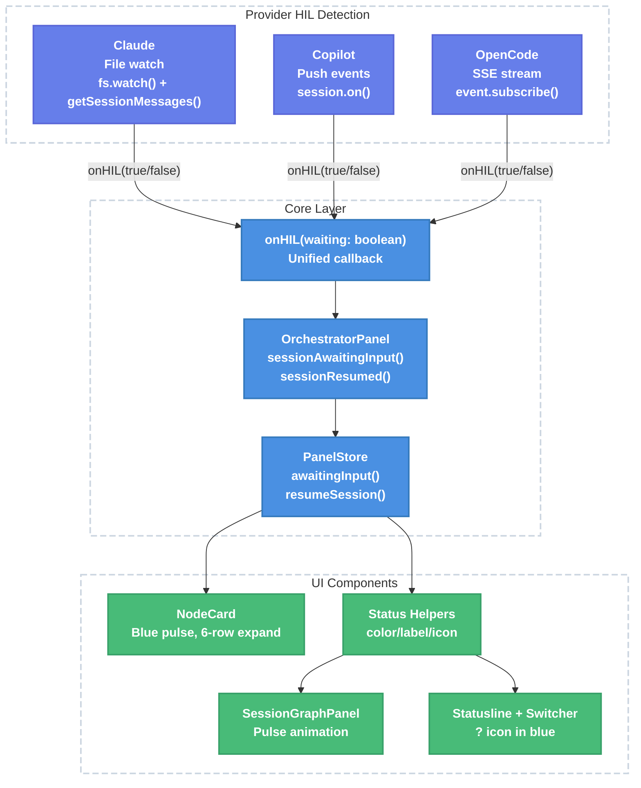

# HIL Detection & UI Surfacing — Technical Design Document

| Document Metadata      | Details                              |
| ---------------------- | ------------------------------------ |
| Author(s)              | flora131                             |
| Status                 | Draft (WIP)                          |
| Team / Owner           | SDK / TUI                            |
| Created / Last Updated | 2026-04-14                           |

## 1. Executive Summary

This spec proposes adding an `awaiting_input` session status to the Atomic TUI, enabling the session graph panel to visually distinguish when an SDK agent is waiting for human input (HIL state) versus actively working. Currently, all three SDK providers (Claude Agent SDK, Copilot SDK, OpenCode SDK) surface HIL events through their native APIs, but Atomic shows them as `running` — making multi-stage workflows appear frozen with no user action indicated. The implementation spans 5 layers: types, store, panel API, executor/providers, and UI components. Each provider uses its native detection mechanism (OS-level file watching of the JSONL transcript for Claude, push events for Copilot and OpenCode), feeding into a unified `onHIL` callback that drives a blue-pulsing node card with "waiting for response" text and a `?` status icon.

**Reference:** [Research: HIL Detection & UI Surfacing](../research/docs/2026-04-14-hil-detection-implementation-research.md)

## 2. Context and Motivation

### 2.1 Current State

The session graph panel renders a DAG of workflow stages, each with one of four statuses: `pending`, `running`, `complete`, `error`. Status drives border color, icon, label, and pulse animation. The state machine is:

```
pending ──→ running ──→ complete
                   └──→ error
```

**Limitations:**
- When an agent invokes `AskUserQuestion` (Claude), `ask_user` (Copilot), or a question request (OpenCode), the UI continues showing `running` (yellow pulse) with no indication that user action is required
- In multi-stage workflows, this makes it impossible to distinguish a working stage from a blocked stage — the user sees multiple yellow-pulsing nodes with no way to know which one needs attention
- All three SDKs have native HIL detection capabilities that Atomic does not consume

**Reference:** [Research §1–3](../research/docs/2026-04-14-hil-detection-implementation-research.md) — Current session status system, PanelStore, OrchestratorPanel API

### 2.2 The Problem

- **User Impact:** Users cannot tell when a workflow stage needs their input, leading to workflows that appear stuck. They must manually check each tmux pane to find the one waiting for input.
- **Workflow Impact:** Multi-stage workflows with HIL steps (e.g., confirmation before deployment) provide no visual cue to act, increasing latency between the agent asking and the user responding.
- **Technical Gap:** The SDK integration layer (`executor.ts`, provider files) has no HIL detection hooks despite all three SDKs supporting it natively.

## 3. Goals and Non-Goals

### 3.1 Functional Goals

- [ ] Extend `SessionStatus` type with `"awaiting_input"` variant
- [ ] Add `awaitingInput(name)` and `resumeSession(name)` transition methods to `PanelStore`
- [ ] Add `sessionAwaitingInput(name)` and `sessionResumed(name)` methods to `OrchestratorPanel` public API
- [ ] Add `awaiting_input` entries to `statusColor` (blue/`theme.info`), `statusLabel` (`"input needed"`), and `statusIcon` (`"?"`)
- [ ] Implement Claude HIL detection via `fs.watch()` on the JSONL transcript file in `claudeQuery()`, running as a parallel file watcher alongside the existing `waitForIdle()` loop (zero changes to `waitForIdle()`)
- [ ] Implement Copilot HIL detection via `session.on("user_input.requested"/"user_input.completed")` passive events in the `send()` wrapper
- [ ] Implement OpenCode HIL detection via `client.event.subscribe()` stream filtering for `question.asked`/`question.replied`/`question.rejected` events
- [ ] Render `awaiting_input` nodes with blue pulsing border, expanded height (6 rows), "waiting for response" label, and "↵ enter to respond" hint
- [ ] Pulse animation fires for both `running` and `awaiting_input` statuses
- [ ] Statusline and compact switcher auto-render `?` icon in blue via updated helpers

### 3.2 Non-Goals (Out of Scope)

- [ ] We will NOT build interactive question/answer UI within the graph panel — users respond via the existing tmux pane
- [ ] We will NOT surface the question text inside the node card (only a "waiting for response" indicator)
- [ ] We will NOT implement new pane-attach behavior — Enter already attaches to the focused node's pane; the "↵ enter to respond" text is purely a UX hint
- [ ] We will NOT add a new DSL node type — that is covered by the existing [askUserQuestion() DSL spec](../specs/2026-03-23-ask-user-question-dsl-node-type.md)
- [ ] We will NOT modify the existing `onUserInputRequest` RPC handler or `canUseTool` callback behavior — HIL detection is purely observational

## 4. Proposed Solution (High-Level Design)

### 4.1 System Architecture Diagram



### 4.2 Architectural Pattern

**Observer / Callback pattern**: Each provider independently detects HIL state through its native mechanism and fires a unified `onHIL(waiting: boolean)` callback. The callback bridges to the panel API, which updates the store, which triggers React re-renders. This decouples provider-specific detection from the UI layer entirely.

### 4.3 Key Components

| Component | Responsibility | Technology | Justification |
|-----------|---------------|------------|---------------|
| `hasUnresolvedHILTool()` | Scan Claude transcript for unresolved `AskUserQuestion` | Pure function, `@anthropic-ai/claude-agent-sdk` | Deterministic, testable, uses transcript as source of truth |
| `watchTranscriptForHIL()` | Watch JSONL file for changes, run `hasUnresolvedHILTool()` on each write | `fs/promises` `watch()`, `AbortController` | OS-native (inotify/kqueue), reuses `waitForSessionFile()` pattern, ~50-200ms latency |
| Copilot event listeners | Observe `user_input.requested/completed` events | `@github/copilot-sdk` `session.on()` | Native push events, instant detection, passive (no RPC interference) |
| OpenCode event stream | Filter `question.asked/replied/rejected` from SSE | `@opencode-ai/sdk/v2` `event.subscribe()` | Native push events with `sessionID` filtering |
| `onHIL` callback | Bridge provider signals to panel API | TypeScript closure | Single interface for all providers |
| Status helpers | Map `awaiting_input` to visual properties | Pure functions | Automatic propagation to all UI consumers |

### 4.4 Proposed State Machine

```
pending ──→ running ──→ complete
               ↕
         awaiting_input
               │
               └──→ error
```

**Transitions:**
- `running → awaiting_input`: SDK detects HIL (unresolved tool_use, event fires)
- `awaiting_input → running`: User responds (tool_result appears, completion event fires)
- `running → complete`: SDK idle detection confirms agent finished
- `running → error` / `awaiting_input → error`: Agent errors during or after HIL

**Key invariant:** `awaiting_input → running` on user response, NOT `awaiting_input → complete`. The agent continues working after receiving the answer.

## 5. Detailed Design

### 5.1 Types (`src/sdk/components/orchestrator-panel-types.ts`)

Extend the `SessionStatus` union at line 3:

```typescript
export type SessionStatus = "pending" | "running" | "complete" | "error" | "awaiting_input";
```

No changes to `SessionData` interface — the status field already carries the new variant.

### 5.2 Status Helpers (`src/sdk/components/status-helpers.ts`)

Add `awaiting_input` entries to all three helper functions:

| Helper | `awaiting_input` Value | Reference |
|--------|----------------------|-----------|
| `statusColor(status, theme)` | `theme.info` (blue: `#89b4fa` Mocha / `#1e66f5` Latte) | `graph-theme.ts:18` |
| `statusLabel(status)` | `"input needed"` | Design spec |
| `statusIcon(status)` | `"?"` | Design spec |

**Note:** The status helper functions accept `status: string` and use `??` fallback defaults, so they are forward-compatible without the explicit entries. However, adding explicit entries ensures correct visual treatment rather than falling back to dim/generic defaults.

### 5.2a Header Status Counter (`src/sdk/components/header.tsx`)

The header component uses a `Record<SessionStatus, number>` object literal to count sessions by status:

```typescript
const c: Record<SessionStatus, number> = { complete: 0, running: 0, pending: 0, error: 0 };
for (const s of store.sessions) c[s.status]++;
```

This is the **only exhaustive consumer** of `SessionStatus` in the codebase. Adding `awaiting_input` to the union without updating this object literal will produce a **TypeScript compile error**. Add the new key:

```typescript
const c: Record<SessionStatus, number> = { complete: 0, running: 0, pending: 0, error: 0, awaiting_input: 0 };
for (const s of store.sessions) c[s.status]++;
```

`awaiting_input` sessions should be counted separately from `running` sessions in the header summary.

### 5.3 PanelStore (`src/sdk/components/orchestrator-panel-store.ts`)

Add two new transition methods after the existing `failSession()` at line 91:

```typescript
awaitingInput(name: string): void {
  const session = this.sessions.find((s) => s.name === name);
  if (session && session.status === "running") {
    session.status = "awaiting_input";
    this.emit();
  }
}

resumeSession(name: string): void {
  const session = this.sessions.find((s) => s.name === name);
  if (session && session.status === "awaiting_input") {
    session.status = "running";
    this.emit();
  }
}
```

**Guard conditions:** `awaitingInput` only transitions from `running`; `resumeSession` only transitions from `awaiting_input`. This prevents invalid state transitions.

### 5.4 OrchestratorPanel API (`src/sdk/components/orchestrator-panel.tsx`)

Add two public methods after `sessionError()` at line 110:

```typescript
sessionAwaitingInput(name: string): void {
  this.store.awaitingInput(name);
}

sessionResumed(name: string): void {
  this.store.resumeSession(name);
}
```

### 5.5 Provider Integration — Claude Agent SDK

**File:** `src/sdk/providers/claude.ts` — new `watchTranscriptForHIL()` function + wiring in `claudeQuery()` (lines 381–495)

**Detection mechanism:** OS-native file watching (`fs/promises` `watch()`) on the JSONL transcript file, with `getSessionMessages()` reads triggered only when the file is written to. This runs as a **parallel watcher** alongside the existing `waitForIdle()` loop — `waitForIdle()` is not modified.

**Why file-watch instead of polling:** The Claude Agent SDK's push-based APIs (`canUseTool`, `PreToolUse` hook, `Notification` hook, `includePartialMessages` streaming) are only available in headless (SDK-controlled) sessions. Interactive tmux-pane sessions — which are what this provider uses — can only be observed externally via the JSONL transcript. Rather than polling the transcript on a fixed 2s interval (adding unconditional disk reads to the `waitForIdle()` hot loop), we use `fs.watch()` to get OS-level file-change notifications (inotify on Linux, kqueue on macOS), which fires only when Claude actually writes to the file. This is the same pattern already used by `waitForSessionFile()` (lines 179–231).

**Algorithm — `hasUnresolvedHILTool(messages)`:**

```typescript
function hasUnresolvedHILTool(messages: SessionMessage[]): boolean {
  const resolvedIds = new Set<string>();

  for (const msg of messages) {
    if (msg.type !== "user") continue;
    const content = (msg.message as { content: unknown })?.content;
    if (!Array.isArray(content)) continue;
    for (const block of content) {
      if (block.type === "tool_result" && block.tool_use_id) {
        resolvedIds.add(block.tool_use_id);
      }
    }
  }

  for (const msg of [...messages].reverse()) {
    if (msg.type !== "assistant") continue;
    const content = (msg.message as { content: unknown })?.content;
    if (!Array.isArray(content)) continue;
    for (const block of content) {
      if (
        block.type === "tool_use" &&
        block.name === "AskUserQuestion" &&
        block.id &&
        !resolvedIds.has(block.id)
      ) {
        return true;
      }
    }
    break; // Only check the most recent assistant message
  }

  return false;
}
```

**File watcher — `watchTranscriptForHIL()`:**

```typescript
async function watchTranscriptForHIL(
  sessionId: string,
  signal: AbortSignal,
  onHIL: (waiting: boolean) => void,
): Promise<void> {
  const jsonlPath = `${resolveSessionDir(process.cwd())}/${sessionId}.jsonl`;
  let wasHIL = false;

  for await (const _event of watch(jsonlPath, { signal })) {
    try {
      const msgs = await getSessionMessages(sessionId, {
        dir: process.cwd(),
        includeSystemMessages: true,
      });
      const isHIL = hasUnresolvedHILTool(msgs);
      if (isHIL !== wasHIL) {
        onHIL(isHIL);
        wasHIL = isHIL;
      }
    } catch {
      // Transcript read failed — skip this event, try again on next write
    }
  }
}
```

**Integration in `claudeQuery()`:**

After the session ID is resolved (~line 481), start the watcher. Abort it when `waitForIdle()` returns:

```typescript
const hilAc = new AbortController();
if (claudeSessionId) {
  watchTranscriptForHIL(claudeSessionId, hilAc.signal, onHIL).catch(() => {});
}
try {
  return await waitForIdle(paneId, claudeSessionId, transcriptBeforeCount, beforeContent, pollIntervalMs);
} finally {
  hilAc.abort();
}
```

**Key design decisions:**
- **Zero changes to `waitForIdle()`** — idle detection (pane-based) and HIL detection (transcript-based) are fully separated concerns. `waitForIdle()` continues doing exactly what it does today.
- **No post-HIL cooldown needed** — the watcher sees the `tool_result` block written to the JSONL and fires `onHIL(false)` naturally when the user answers. There is no timing gap to paper over.
- **Only fires `onHIL` on state transitions** — the `wasHIL !== isHIL` guard prevents redundant callbacks on every file write (Claude writes frequently during normal operation).
- **Graceful degradation** — if `watch()` throws (e.g., file deleted), the `.catch(() => {})` swallows it. The session continues as `running` with no HIL detection — same fallback as the other providers.

**Caveats:**
- `getSessionMessages()` reads from on-disk JSONL — triggered by OS file notification (~50-200ms after Claude writes), not on a fixed interval
- `SessionMessage.message` is typed as `unknown` — requires runtime casting (see [Claude SDK transcript research](../research/web/2026-04-14-claude-agent-sdk-hil-transcript.md) §2)
- Only checks the most recent assistant message for unresolved `AskUserQuestion` (optimization — avoids scanning entire history)
- `fs.watch()` on a single file is well-supported on macOS (kqueue) and Linux (inotify) via Bun's native implementation — same mechanism used by `waitForSessionFile()` (but watching a file rather than a directory)

**Reference:** [Research §5](../research/docs/2026-04-14-hil-detection-implementation-research.md), [Claude SDK HIL Transcript Research](../research/web/2026-04-14-claude-agent-sdk-hil-transcript.md)

### 5.6 Provider Integration — Copilot SDK

**File:** `src/sdk/runtime/executor.ts` — Copilot `send()` wrapper (lines 915–941)

**Detection mechanism:** Native push events via `session.on()`.

**Integration in the `send()` wrapper:**

1. Before `nativeSend()`, register passive event listeners:
   - `session.on("user_input.requested", ...)` → set `hilPending = true`, call `onHIL(true)`
   - `session.on("user_input.completed", ...)` → set `hilPending = false`, call `onHIL(false)`

2. Modify the `session.idle` resolution logic:
   - When `session.idle` fires, check `hilPending` flag
   - If `hilPending === true`, do NOT resolve the send promise — the agent is about to continue after the user answers
   - Only resolve when `session.idle` fires with `hilPending === false`

3. Clean up listeners (unsubscribe) when the wrapper resolves or errors

**Critical distinction:** `session.on("user_input.requested")` is **passive observation** — it does not interfere with the `onUserInputRequest` RPC handler that the tmux pane uses to provide the actual answer. See [Copilot SDK HIL Events Research](../research/web/2026-04-14-copilot-sdk-hil-events.md) §9.

**Reference:** [Research §6](../research/docs/2026-04-14-hil-detection-implementation-research.md), [Copilot SDK HIL Events Research](../research/web/2026-04-14-copilot-sdk-hil-events.md)

### 5.7 Provider Integration — OpenCode SDK

**File:** `src/sdk/runtime/executor.ts` — `createSessionRunner()` (lines 700–1045)

**Detection mechanism:** SSE event stream via `client.event.subscribe()`.

**Integration:** After `initProviderClientAndSession()` for OpenCode, start a background async task:

```typescript
if (shared.agent === "opencode") {
  const ocClient = providerClient as ProviderClient<"opencode">;
  (async () => {
    const { stream } = await ocClient.event.subscribe();
    for await (const event of stream) {
      if (event.type === "question.asked" && event.properties.sessionID === sessionId) {
        onHIL(true);
      }
      if (
        (event.type === "question.replied" || event.type === "question.rejected") &&
        event.properties.sessionID === sessionId
      ) {
        onHIL(false);
      }
    }
  })().catch((err) => { /* log and degrade gracefully */ });
}
```

**Key details:**
- Question events are **v2-only** (`@opencode-ai/sdk/v2`) — the v1 import does not include these types
- `sessionID` filtering ensures only events for the current session trigger UI updates
- `question.rejected` also clears HIL state — the user dismissed the question

**Reference:** [Research §7](../research/docs/2026-04-14-hil-detection-implementation-research.md), [OpenCode SDK HIL Events Research](../research/web/2026-04-14-opencode-sdk-hil-events.md)

### 5.8 Unified Callback Interface

All three providers feed into a single callback wired in `createSessionRunner()`:

```typescript
const onHIL = (waiting: boolean) => {
  if (waiting) shared.panel.sessionAwaitingInput(name);
  else shared.panel.sessionResumed(name);
};
```

This closure captures `shared.panel` and `name` from the session runner scope.

### 5.9 UI Components

#### 5.9a NodeCard (`src/sdk/components/node-card.tsx`)

**Changes:**

1. **Pulse color branching** (line 27–36): Currently pulses between `theme.border` and `theme.warning` (yellow) for `running`. Add branch:
   - `running` → lerp `theme.border ↔ theme.warning` (yellow)
   - `awaiting_input` → lerp `theme.border ↔ theme.info` (blue)

2. **Expanded height**: When `status === "awaiting_input"`, render 6 rows instead of 4:
   - Row 1: top border with name
   - Row 2: blank
   - Row 3: duration
   - Row 4: `"waiting for response"` (in `theme.info` / blue)
   - Row 5: `"↵ enter to respond"` (in `theme.textDim` / gray)
   - Row 6: bottom border

3. **Additional content block:**
```tsx
{status === "awaiting_input" && (
  <>
    <box alignItems="center">
      <text fg={theme.info}>waiting for response</text>
    </box>
    <box alignItems="center">
      <text fg={theme.textDim}>↵ enter to respond</text>
    </box>
  </>
)}
```

#### 5.9b Layout (`src/sdk/components/layout.ts`)

**Change:** In `computeLayout()`, when computing `rowH` per depth level, use height 6 for `awaiting_input` nodes:

```typescript
const nodeHeight = n.status === "awaiting_input" ? 6 : NODE_H;
rowH[n.depth] = Math.max(rowH[n.depth] ?? 0, nodeHeight);
```

The existing `Math.max` logic means all nodes at the same depth expand to 6 if any sibling is `awaiting_input`.

#### 5.9c SessionGraphPanel (`src/sdk/components/session-graph-panel.tsx`)

**Change:** Expand the pulse trigger (lines 102–105) to include `awaiting_input`:

```typescript
const hasAnimating = useMemo(
  () => store.sessions.some((s) => s.status === "running" || s.status === "awaiting_input"),
  [storeVersion],
);
```

#### 5.9d Statusline & Compact Switcher

No code changes needed — both components consume `statusIcon()` and `statusColor()` from status helpers, which are updated in §5.2. The `?` icon in blue will render automatically.

### 5.10 Provider Detection Matrix

| Provider | Detection Mechanism | Signal Type | Latency | Integration Point |
|----------|-------------------|-------------|---------|------------------|
| Claude | `fs.watch()` on JSONL + `getSessionMessages()` transcript scan | File-watch (OS-native) | ~50-200ms | `watchTranscriptForHIL()` in `claude.ts`, wired in `claudeQuery()` |
| Copilot | `session.on("user_input.requested/completed")` | Push (native events) | Instant | `send()` wrapper in `executor.ts` |
| OpenCode | `client.event.subscribe()` SSE stream | Push (server events) | Instant | `createSessionRunner()` in `executor.ts` |

### 5.11 UI Visual Signals Summary

| Signal | Location | Behavior | Detection Latency |
|--------|----------|----------|-------------------|
| Blue pulsing border | Node card | Sine wave lerp between `#585b70` ↔ `#89b4fa` | Claude: ~50-200ms, Copilot/OpenCode: instant |
| 6-row expanded card | Node card | "waiting for response" + "↵ enter to respond" | Same as above |
| Blue `?` icon | Statusline | Next to focused node name | Same as above |
| Blue `?` icon | Compact switcher | In agent list | Same as above |

## 6. Alternatives Considered

| Option | Pros | Cons | Reason for Rejection |
|--------|------|------|---------------------|
| **A: Poll tmux pane content** for HIL indicators | No SDK dependency, works for any agent | Fragile regex parsing, high CPU, provider-dependent prompt formats | Unreliable — prompt text varies across providers and versions |
| **B: Add `awaiting_input` as a separate node type** in the graph | Clean separation of concerns | Over-engineers a status change as a structural graph change | HIL is a transient status, not a permanent node type |
| **C: Use a single polling mechanism** (transcript scan) for all providers | Simple, uniform implementation | Copilot/OpenCode have no transcript API; would require tmux scraping | Throws away native push capabilities of Copilot and OpenCode SDKs |
| **D: Unified `onHIL` callback with provider-native detection (Selected)** | Uses each SDK's best mechanism, event-driven for all three, clean abstraction | Claude uses file-watch (OS-native) rather than SDK push events | **Selected:** Best fidelity per provider, clean unified interface |
| **E: Poll-based transcript scanning for Claude** (in `waitForIdle()` loop) | Simple — adds HIL check to existing poll loop | Unconditional disk reads every 2s, tangles HIL and idle detection in one loop, requires post-HIL cooldown hack | Rejected in favor of file-watch: higher latency (~2s vs ~50-200ms), worse separation of concerns, unnecessary coupling to `waitForIdle()` |

## 7. Cross-Cutting Concerns

### 7.1 Premature Completion Prevention

The Copilot `send()` wrapper currently resolves on `session.idle`. If `user_input.requested` fires and the user answers, `session.idle` fires briefly before the agent resumes. The `hilPending` flag prevents the wrapper from resolving during this window. This avoids a class of bugs documented in [Subagent Premature Completion Research](../research/docs/2026-02-15-subagent-premature-completion-SUMMARY.md).

### 7.2 Performance

- Claude file-watch: `watchTranscriptForHIL()` uses OS-native `fs.watch()` (inotify/kqueue) — zero CPU when idle, disk reads only on actual JSONL writes. `hasUnresolvedHILTool()` only checks the last assistant message (O(1) effective). No overhead added to the `waitForIdle()` loop (which remains unmodified).
- Copilot/OpenCode: Push-based, zero polling overhead.
- UI: One additional status variant in `useMemo` checks — negligible.

### 7.3 Error Handling

- If the OpenCode event stream disconnects (after the SDK's built-in SSE retries are exhausted), log a debug warning and stop HIL detection for that session. The session remains `running` (safe fallback, no false positives).
- If Claude's `watchTranscriptForHIL()` encounters a `getSessionMessages()` error, the `try/catch` inside the watcher loop skips that event and retries on the next file write. If `fs.watch()` itself throws (e.g., file deleted), the `.catch(() => {})` on the detached promise swallows it — HIL detection stops for that session, which falls back to `running` (safe, no false positives). `waitForIdle()` is unaffected in all error cases.
- If Copilot event listeners throw, the `try/catch` in the SDK's `_dispatchEvent` swallows it — no crash risk.

## 8. Migration, Rollout, and Testing

### 8.1 Deployment Strategy

- [ ] Phase 1: Types, store, panel API, and status helpers — pure additions, no behavioral change until providers fire callbacks
- [ ] Phase 2: UI components (node card, layout, pulse) — renders `awaiting_input` correctly when status is set
- [ ] Phase 3: Provider integrations (Claude, Copilot, OpenCode) — wires HIL detection, activates the full feature

### 8.2 Test Plan

- **Unit Tests:**
  - [ ] `hasUnresolvedHILTool()` — test with resolved, unresolved, empty, and multi-tool transcripts
  - [ ] `PanelStore.awaitingInput()` / `resumeSession()` — test guard conditions (only from `running` / `awaiting_input`)
  - [ ] `statusColor` / `statusLabel` / `statusIcon` — test `awaiting_input` returns correct values
  - [ ] Layout `computeLayout()` — test that `awaiting_input` nodes produce height 6, siblings expand

- **Integration Tests:**
  - [ ] Claude: Mock `fs.watch()` to emit a file-change event, mock `getSessionMessages()` to return transcript with unresolved `AskUserQuestion` → verify `watchTranscriptForHIL()` fires `onHIL(true)`. Verify that a subsequent file-change event with a resolved `tool_result` fires `onHIL(false)`. Verify that repeated writes with unchanged HIL state do not fire redundant callbacks (the `wasHIL` guard).
  - [ ] Copilot: Mock `session.on()` to emit `user_input.requested` → verify `onHIL(true)` and `hilPending` flag blocks `session.idle` resolution
  - [ ] OpenCode: Mock `event.subscribe()` stream with `question.asked` event → verify `onHIL(true)` fires with correct sessionID filter

- **End-to-End Tests:**
  - [ ] Run a workflow with a Claude stage that triggers `AskUserQuestion` → verify node card shows blue pulse and "waiting for response"
  - [ ] Run a workflow with a Copilot stage that triggers `ask_user` → verify same visual behavior
  - [ ] Verify that answering the question transitions the node back to `running` (yellow pulse)

## 9. Open Questions — Resolved

- [x] **Q1 — Post-HIL cooldown timing for Claude:** **Decision: No cooldown needed.** The file-watch approach (`watchTranscriptForHIL()`) detects the `tool_result` block written to the JSONL when the user answers, and fires `onHIL(false)` naturally on the OS file-change notification. There is no timing gap between `waitForIdle()` and HIL detection because they run as independent parallel concerns — `waitForIdle()` is not modified and has no awareness of HIL state. *(Previous approach required a fixed 3-second cooldown to prevent premature idle detection in a shared poll loop — eliminated by architectural separation.)*

- [x] **Q2 — Copilot `hilPending` timeout:** **Decision: No timeout — rely on executor's existing session timeout.** Adding a second timeout creates competing mechanisms. If the agent crashes, the executor's session-level timeout already handles it.

- [x] **Q3 — OpenCode event stream error handling:** **Decision: Log warning + degrade gracefully.** Log a debug warning when the SSE stream disconnects (after built-in retries are exhausted), then stop HIL detection for that session. The node stays `running` — safe fallback with no false positives. If the OpenCode server is permanently gone, the executor catches the real error through normal channels.

- [x] **Q4 — Automatic pane attach on Enter:** **Decision: No new feature needed — pure UX copy.** Pressing Enter on a focused node already attaches to that session's pane (existing behavior). The "↵ enter to respond" text is simply a UX reminder to help the user understand what to do when a node is awaiting input. No code changes beyond adding the text to the node card.

- [x] **Q5 — Multiple concurrent HIL:** **Decision: No priority — both pulse blue equally.** The user can focus either node and press Enter to attach. The graph layout already provides spatial context. No ordering badges or auto-focus needed.

- [x] **Q6 — Headless stages and HIL:** **Decision: Not applicable — prevented by architecture.** Code analysis confirms headless stages cannot trigger HIL in any provider:
  - **Copilot**: `onUserInputRequest` is never configured → the `ask_user` tool is never enabled on the CLI side
  - **OpenCode**: No question-handling configuration → questions cannot be asked
  - **Claude**: No `canUseTool` callback → if `AskUserQuestion` were somehow invoked, the SDK query would hang and eventually hit the executor's session timeout
  
  No guard is needed because the architecture already prevents the scenario. This is documented as a known constraint, not an open issue.
