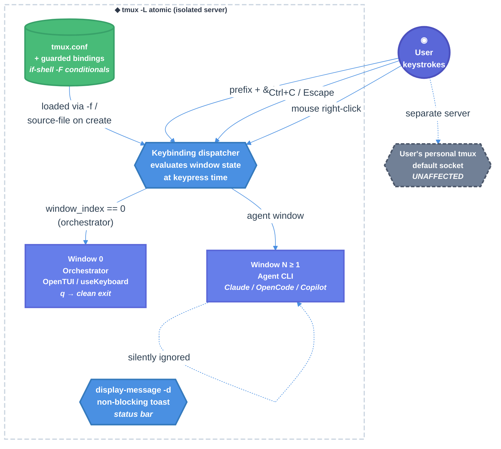

# Tmux Window Close / Rename Suppression + Workflow-Stage Ctrl+C/ESC Blocking — Technical Design Document

| Document Metadata      | Details     |
| ---------------------- | ----------- |
| Author(s)              | lavaman131  |
| Status                 | Draft (WIP) |
| Team / Owner           | Atomic CLI  |
| Created / Last Updated | 2026-04-15  |

## 1. Executive Summary

Atomic CLI embeds agent CLIs (Claude Code, OpenCode, Copilot CLI) inside tmux windows on a dedicated `-L atomic` socket. Today, tmux's default bindings for window close (`prefix + &`), pane close (`prefix + x`), window rename (`prefix + ,`), session rename (`prefix + $`), and the arbitrary command prompt (`prefix + :`) are all still live — any one of them lets a user destroy or corrupt an active agent session with no safeguards. Double-Ctrl+C inside any agent CLI also exits the CLI, orphaning the orchestrator. This spec proposes **unsetting the tmux prefix entirely** (`set -g prefix None`) on the isolated `-L atomic` server — eliminating every prefix-gated destructive command in one stroke — plus overriding the two root-table mouse right-click menus and adding conditional `Ctrl+C` / `Escape` blocks. Suppressed actions are **silently ignored** (no toast, no menu, no feedback — the user simply cannot take the action). The only exit path from an active workflow is `q` in the orchestrator window (unchanged from today). Because all bindings are scoped to the isolated `-L atomic` server, the user's personal tmux is untouched. This work is a prerequisite for the paused-state objective (ticket #003) in chat sessions, where a clean resume target requires the tmux window to survive.

> **Design stance (per user direction during open-question resolution):** tmux is an *invisible environment* for the Atomic UI. Users should not need — nor be able — to run any tmux commands directly. The prefix key is disabled, destructive mouse menus are blocked, and Ctrl+C/ESC are suppressed in every agent-window context. The only recognized user-facing keys are the Atomic-defined prefix-free bindings (`C-g`, `C-\\`) and the orchestrator's `q`.

> **Research reference:** [research/docs/2026-04-15-tmux-window-close-rename-suppression.md](../research/docs/2026-04-15-tmux-window-close-rename-suppression.md) (authoritative codebase survey + SDK deep-dive)
> **Web reference:** [research/web/2026-04-15-tmux-keybind-suppression.md](../research/web/2026-04-15-tmux-keybind-suppression.md) (tmux/psmux default binding tables, `if-shell -F` semantics)

## 2. Context and Motivation

### 2.1 Current State

All tmux operations channel through `tmuxRun()` at `src/sdk/runtime/tmux.ts:138-153`, which injects `-f <tmux.conf> -L atomic` on every invocation. The bundled config at `src/sdk/runtime/tmux.conf` already ships sane defaults, prefix-free navigation (`C-g` to graph, `C-\\` next-window), vi-mode copy semantics, and `allow-rename off` to block **programmatic** renames. The `-L atomic` socket gives complete server-level isolation from the user's personal tmux.

```
┌──────────────── tmux -L atomic (isolated Atomic server) ─────────────────┐
│ Workflow session: atomic-wf-<agent>-<name>-<id>                          │
│   ┌────────────┐  ┌────────────┐  ┌────────────┐                         │
│   │ Window 0   │  │ Window 1   │  │ Window 2   │                         │
│   │ orches-    │  │ agent CLI  │  │ agent CLI  │                         │
│   │ trator     │  │ (Claude)   │  │ (Copilot)  │                         │
│   │ OpenTUI    │  │ terminal   │  │ terminal   │                         │
│   └────────────┘  └────────────┘  └────────────┘                         │
│                                                                           │
│ Chat session: atomic-chat-<agent>-<id>                                    │
│   ┌────────────┐                                                          │
│   │ Window 0   │ ← single agent window, no orchestrator                  │
│   │ agent CLI  │                                                          │
│   └────────────┘                                                          │
└──────────────────────────────────────────────────────────────────────────┘
```

- **Session taxonomy** is unambiguous via `parseSessionName()` at `src/sdk/runtime/tmux.ts:466-492`:
  - Workflow: `atomic-wf-<agent>-<name>-<id>` — window 0 is the orchestrator (OpenTUI React TUI), windows 1+ are agent CLIs.
  - Chat: `atomic-chat-<agent>-<id>` — exactly one window running the agent CLI (no orchestrator).
- **Exit/abort plumbing** (`src/sdk/runtime/executor.ts:1090-1193`, `src/sdk/components/orchestrator-panel-store.ts:159-165`): `q` or `Ctrl+C` captured by the OpenTUI `useKeyboard` in window 0 routes to `store.requestQuit()` → `resolveAbort()` → `WorkflowAbortError` → `shutdown(0)` → `panel.destroy()` + `tmux.killSession()`.
- **Inside agent windows**: no tmux-level interception of any key. Ctrl+C, ESC, `q`, `prefix + &`, `prefix + ,`, and the mouse right-click Kill menus all reach the embedded CLI or the tmux server unchanged.

### 2.2 The Problem

- **Unrecoverable session destruction.** A user who accidentally presses `prefix + &` or chooses "Kill" from the right-click menu kills their agent window mid-workflow. The SDK session is lost; there is no checkpoint to resume from (§FF.5 of the research). `prefix + x` closes the pane with the same effect.
- **Unrecoverable rename.** `prefix + ,` opens a tmux command-prompt that calls `rename-window` directly, bypassing `allow-rename off` (which only blocks process-initiated renames). A renamed window breaks session-to-agent routing logic that keys off `window_name` (e.g., `session-graph-panel.tsx:373-394` polls `display-message -p "#{window_index} #{window_name}"` to sync attached-mode state).
- **Unintended CLI exit.** Inside a Claude / OpenCode / Copilot CLI, the standard "interrupt-then-quit" pattern is double-Ctrl+C. When the CLI exits, the tmux pane dies with it (no `remain-on-exit`), closing the window and leaving the orchestrator with an orphaned graph node. This path has no safeguard today.
- **Workflow stages cannot be safely interrupted today.** The current interrupt handler (`src/services/workflows/conductor/conductor.ts` → `currentSession?.abort?.()`) aborts the stage's SDK session but the panel-side `Ctrl+C`/ESC path currently terminates the whole workflow. Per the user's added requirement, workflows should run to a natural completion point and not allow users to pause/resume mid-stage via keyboard — the only clean exit must be `q` on the orchestrator window.
- **No user feedback** when tmux defaults are about to do something destructive. Currently, `prefix + &` shows `confirm-before -p "kill-window #W? (y/n)"` — the user's `y` immediately kills the window. There is no signal that this action is invalid during an agent session.

### 2.3 Why Now

- The paused-state objective (ticket #003; see research §FF.1–FF'.8) depends on the tmux window surviving as a resume target for Claude's interactive/pane-capture path. Without window-close suppression, the paused-state spec cannot land.
- Users have started reporting accidental kills during workflow runs (anecdotal; confirmed by the need to add the `allow-rename off` in the original tmux UX ticket [research/web/2026-04-10-tmux-ux-improvements.md](../research/web/2026-04-10-tmux-ux-improvements.md)).
- The config infrastructure (single `tmux.conf` + `source-file` reload inside `createSession()` at `tmux.ts:226-228`) is already in place — this change is additive and low-risk.

## 3. Goals and Non-Goals

### 3.1 Functional Goals

- [ ] **G1.** **All tmux prefix bindings are disabled** server-wide on the `-L atomic` socket via `set -g prefix None`. This single change eliminates `prefix + &`, `x`, `,`, `$`, `:`, `d`, `D`, and every other prefix binding — including the Atomic-defined pane-split (`-`, `|`) and resize (`h/j/k/l`) bindings, which are not needed since workflows use windows (not panes within a window). The user can no longer issue any tmux command through the prefix sequence.
- [ ] **G2.** Mouse right-click context menus (`MouseDown3Status`, `MouseDown3Pane`) are silently suppressed on agent windows (workflow `window_index ≥ 1`, plus every chat-session window). Right-click simply does nothing; no menu, no toast.
- [ ] **G3.** `Ctrl+C` and `Escape` are silently swallowed on:
    - **Chat-session windows (always)** — chat sessions are agent-interactive and users will have a dedicated paused-state flow in ticket #003; until that lands, these keys are non-functional in chat.
    - **Workflow-session agent windows (index ≥ 1) while a stage is active** — indicated by the session env var `ATOMIC_STAGE_ACTIVE` being non-empty. Between stages (stage-idle), these keys pass through to the CLI natively.
    Suppressed keys are silently ignored — no toast, no message, no visible feedback. The action simply does nothing.
- [ ] **G4.** `q` in the orchestrator window continues to route through the existing `store.requestQuit()` → `resolveAbort()`/`resolveExit()` path (unchanged) and remains the sole exit from an active workflow.
- [ ] **G5.** The user's personal tmux on the default socket (separate server) is unaffected: all bindings there remain at tmux defaults.
- [ ] **G6.** The orchestrator window (workflow window 0) is subject to the same prefix-None rule as agent windows. `&`, `,`, and every other prefix binding are inert there too — `q` is the only exit path. (This reflects Q2's resolution: suppress `&` entirely on window 0.)
- [ ] **G7.** `ATOMIC_STAGE_ACTIVE` is cleared at `runOrchestrator()` startup (to recover from any crashed prior run) and managed via a `finally` clause around stage bodies.
- [ ] **G8.** Suppression rules cover windows created after initial config load, because all bindings are evaluated at keypress time against current window/session state.
- [ ] **G9.** The tmux status bar is **hidden** whenever the orchestrator window (window 0 of a workflow session) is active. The OpenTUI `Statusline` component (`src/sdk/components/statusline.tsx`) already renders navigation hints (`↑↓←→ navigate · ↵ attach · / stages · q quit`) at the bottom of window 0, and the tmux status row beneath it is redundant visual noise. When the user switches to an agent window (index ≥ 1), the tmux status bar returns (showing the agent list / mode hints that are today managed by `session-graph-panel.tsx:400-421`). Chat sessions retain the tmux status bar at all times (they have no OpenTUI Statusline to replace it).

### 3.2 Non-Goals (Out of Scope)

- [ ] We will **not** implement the paused-state semantics in this spec; that is ticket #003 and lives in `specs/2026-03-25-workflow-interrupt-stage-advancement-fix.md` + its follow-up. This spec only reserves the integration surface (`ATOMIC_STAGE_ACTIVE` env var) and cross-references the handoff point.
- [ ] We will **not** modify the user's personal tmux configuration or default socket. All changes live in `src/sdk/runtime/tmux.conf` which is injected only for the `-L atomic` server.
- [ ] We will **not** change the existing `q`/`Ctrl+C` handling in `src/sdk/components/session-graph-panel.tsx:241-244` (OpenTUI React layer in orchestrator window). `q` remains the clean-exit key there.
- [ ] We will **not** preserve any prefix binding. The `set -g prefix None` rule is absolute — pane split (`-`, `|`), pane resize (`h/j/k/l`), and detach (`prefix + d`) are all made inaccessible. Atomic workflows use windows (not panes); split/resize are vestigial. Detach via shell (`tmux -L atomic detach-client`) is still possible for extreme recovery but not via the in-session prefix.
- [ ] We will **not** add toast messages for suppressed actions. Per user direction (Q6), suppression is silent. This is a deliberate divergence from the original acceptance criterion "Suppressed actions show a non-blocking status message" — see §9.1 for the rationale.
- [ ] We will **not** introduce a new server-side state machine in `tmux.conf`. All state checks are done via tmux format variables (`#{window_index}`, `#{session_name}`, per-session env vars) evaluated at keypress time.
- [ ] We will **not** touch the SDK adapter layers (`src/sdk/providers/*.ts`). SDK-side interrupt wiring is the subject of ticket #003.
- [ ] We will **not** add `after-kill-window` or `after-rename-window` reversal hooks. With `prefix = None`, the primary bypass paths (`prefix + :` command-prompt, prefix-bound destructive bindings) are all inaccessible. An external shell running `tmux -L atomic kill-window …` is outside the user-inside-tmux threat model.

## 4. Proposed Solution (High-Level Design)

### 4.1 System Architecture Diagram



### 4.2 Architectural Pattern

**Config-as-Policy with a Prefix Lockout.** The dominant mechanism is a single line: `set -g prefix None`. This server-wide setting disables the entire prefix key, eliminating every prefix-gated tmux command in one stroke — without needing a per-key `unbind` + conditional rebind. Three additional surgical overrides in the root table handle the remaining non-prefix paths: the two mouse context menus (`MouseDown3Status`, `MouseDown3Pane`) and the two blocked keys (`C-c`, `Escape`).

Why this pattern fits:
- **Simplicity:** One config line replaces ~30 lines of per-binding suppression logic. Easier to review, easier to maintain, and impossible to get wrong because there is no branching on prefix keys.
- **Completeness:** The prefix lockout closes `prefix + :` — the largest known bypass path (documented in research §FF.1) — by construction. Any future tmux default binding added upstream is automatically covered without further config changes.
- **Performance:** `if-shell -F` on the remaining bindings evaluates format expressions without spawning a shell, so every keypress is O(μs) (see [research/web/2026-04-15-tmux-keybind-suppression.md §2](../research/web/2026-04-15-tmux-keybind-suppression.md)).
- **Cross-platform:** The same pattern works identically on tmux (macOS/Linux) and psmux (Windows); format-only conditionals avoid the `/bin/sh` vs PowerShell divergence of `run-shell`.
- **Isolation:** Because bindings live on the `-L atomic` server, they cannot leak into the user's personal tmux — criterion G5 is structural, not enforced by code.

### 4.3 Key Components

| Component                        | Responsibility                                                          | Technology / Location                                                                                    | Justification                                                                                                                                                             |
| -------------------------------- | ----------------------------------------------------------------------- | -------------------------------------------------------------------------------------------------------- | ------------------------------------------------------------------------------------------------------------------------------------------------------------------------- |
| Prefix lockout                   | Disable the entire tmux prefix key                                      | `src/sdk/runtime/tmux.conf` — `set -g prefix None`                                                       | One line; covers every prefix-bound destructive command including `:kill-window`.                                                                                         |
| Mouse menu override              | Silently suppress right-click context menus on agent windows            | `bind -n MouseDown3Status` / `MouseDown3Pane` bound to no-op with agent-window guard                     | Two root-table bindings handle the only remaining non-prefix destructive UI                                                                                               |
| Agent-window detector expression | Format expression distinguishing agent from orchestrator windows        | Inline in tmux.conf (`#{\|\|:#{!=:#{window_index},0},#{m/r:^atomic-chat-,#{session_name}}}`)             | No new code; pure format evaluation                                                                                                                                       |
| Workflow-active env flag         | Per-session env var signalling a workflow stage is in flight            | `tmux set-environment -t <session> ATOMIC_STAGE_ACTIVE 1` (set by executor at stage start; unset at end) | Uses existing `setSessionEnv()` at `src/sdk/runtime/tmux.ts:437-439` and `getSessionEnv()` at `tmux.ts:445-451`                                                           |
| Stage-active lifecycle hook      | Set/unset `ATOMIC_STAGE_ACTIVE` at the right moments                    | `src/sdk/runtime/executor.ts` createSessionRunner                                                        | Minimal delta — counter increment/decrement around the SDK query call                                                                                                     |
| Startup sweep                    | Clear any stale `ATOMIC_STAGE_ACTIVE` on orchestrator startup           | `src/sdk/runtime/executor.ts:runOrchestrator` (near panel init)                                          | Single-line defense against crashed prior runs (Q3 resolution)                                                                                                            |
| Ctrl+C / ESC guards              | Silently swallow these keys on agent windows under the right conditions | Two `bind -n` lines in `tmux.conf`                                                                       | Chat sessions: always block. Workflow sessions: block when `ATOMIC_STAGE_ACTIVE` set                                                                                      |
| Orchestrator status-bar hiding   | Toggle tmux `status` on/off based on the active window                  | `set-hook` on `after-select-window` / `client-attached` / `session-created` in `tmux.conf`               | Fires immediately on window transitions (no polling lag); coexists with the existing React `useEffect` at `session-graph-panel.tsx:400-421` that manages status *content* |

## 5. Detailed Design

### 5.1 API Interfaces

This feature is a config-file change plus two executor-side env writes. There is no new TypeScript API. The internal contracts are:

**Executor → tmux (env write):**

```ts
// At the start of a workflow stage (just before the first send to the pane)
tmux.setSessionEnv(tmuxSessionName, "ATOMIC_STAGE_ACTIVE", windowName);

// At stage completion / failure / abort
tmux.setSessionEnv(tmuxSessionName, "ATOMIC_STAGE_ACTIVE", "");
```

We store the **window name** (not just `"1"`) so a multi-stage workflow where different windows are active at different times still scopes correctly. The empty string is treated as "no stage active" (tmux has no native "unset" via set-environment; an empty value is the canonical sentinel — see `src/sdk/runtime/tmux.ts:437-439`).

**tmux.conf → user (keypress evaluation):**

A set of new bindings, each with the shape:

```tmux
bind <key> if-shell -F "<condition>" \
    "<allowed action>" \
    "display-message -d 2500 '<reason>'"
```

The condition for "is this an agent window?" (primary gate):

```
#{||:#{!=:#{window_index},0},#{m/r:^atomic-chat-,#{session_name}}}
```

Reads: "window_index is not 0, OR the session name starts with `atomic-chat-`." A window satisfying this expression is an agent window. The orchestrator (window 0 of a workflow session) is the only case that fails both clauses.

The condition for "is a workflow stage currently running?" (secondary gate, only for Ctrl+C/ESC):

```
#{!=:#{S:ATOMIC_STAGE_ACTIVE},}
```

Reads: "the session env var `ATOMIC_STAGE_ACTIVE` is not empty." The `#{S:NAME}` format pulls a session environment variable at evaluation time.

### 5.2 Data Model / Schema

**Session environment variable (new):**

| Variable              | Set by                                            | Unset by                           | Values                                    | Purpose                                                               |
| --------------------- | ------------------------------------------------- | ---------------------------------- | ----------------------------------------- | --------------------------------------------------------------------- |
| `ATOMIC_STAGE_ACTIVE` | `executor.ts::createSessionRunner` at stage start | Same function, in `finally` clause | Window name of the active stage, or empty | Signals to the tmux keybinding evaluator that Ctrl+C/ESC should block |

No other schema changes. The existing `ATOMIC_AGENT` session env var set at `src/commands/cli/chat/index.ts:222` and consumed in `listSessions()` at `tmux.ts:537` is not touched.

### 5.3 Algorithms and State Management

#### 5.3.1 Agent-window detection

Evaluated fresh at every keypress by tmux. No state to manage; the expression is pure function of:
- `#{window_index}` — integer, stable per window
- `#{session_name}` — string, stable per session

```
is_agent_window(window_index, session_name) =
    window_index != 0                               // any non-orchestrator window in a workflow session
    OR
    session_name matches /^atomic-chat-/            // every window in a chat session
```

#### 5.3.2 Workflow-stage-active state machine

State lives in tmux session env (`ATOMIC_STAGE_ACTIVE`). Transitions are driven by the executor.

```
      ┌────────────────┐        stage starts         ┌────────────────────┐
      │  STAGE_IDLE    │  ──────────────────────►   │  STAGE_ACTIVE      │
      │  env=""        │                            │  env=<windowName>  │
      └────────────────┘   ◄──────────────────────  └────────────────────┘
              ▲              stage completes / errors         │
              │                                               │
              │                 stage aborted                 │
              └───────────────────────────────────────────────┘
```

The transitions happen in `src/sdk/runtime/executor.ts` inside `createSessionRunner()` where `s.session.query()` is invoked:

```ts
// Pseudocode — actual integration in §5.4.2
async function runStage(s: SessionHandle, /* ... */) {
  tmux.setSessionEnv(tmuxSessionName, "ATOMIC_STAGE_ACTIVE", s.name);
  try {
    // existing stage body — send prompt, wait for idle, capture transcript
    await s.session.query(/* ... */);
  } finally {
    tmux.setSessionEnv(tmuxSessionName, "ATOMIC_STAGE_ACTIVE", "");
  }
}
```

**Concurrency note:** Two stages in the same session do not run concurrently in the current design (stages are either sequential via `await` or parallel via `Promise.all`, but parallel stages are in *separate windows* of the same session — see `src/sdk/workflows/builtin/deep-research-codebase/claude/index.ts`). For parallel stages, the env var holds only the most-recently-set window name. This is acceptable because the suppression logic doesn't care *which* stage is active — it only checks whether the env var is non-empty. When the last parallel stage completes, its `finally` clause clears the var.

If the final `finally` runs while another parallel stage is still active, `ATOMIC_STAGE_ACTIVE` will be prematurely cleared. To prevent this, we track a counter:

```ts
// Shared state on `shared: SharedRunnerState`
shared.activeStageCount = 0;

// At stage start
shared.activeStageCount++;
tmux.setSessionEnv(tmuxSessionName, "ATOMIC_STAGE_ACTIVE", "1");

// At stage end
shared.activeStageCount--;
if (shared.activeStageCount === 0) {
  tmux.setSessionEnv(tmuxSessionName, "ATOMIC_STAGE_ACTIVE", "");
}
```

Since the env var's *value* doesn't matter (only presence), we simplify to `"1"` as a boolean sentinel. The counter lives in the in-memory `SharedRunnerState` at `executor.ts:1112-1121`.

#### 5.3.3 Binding overrides in `tmux.conf`

The complete set of changes (full text in §5.4.1):

| Mechanism                  | Effect                                                                                                                                                                                                           |
| -------------------------- | ---------------------------------------------------------------------------------------------------------------------------------------------------------------------------------------------------------------- |
| `set -g prefix None`       | Disables the prefix key. Every prefix-bound command becomes unreachable (including all destructive defaults and the `:` command-prompt bypass). Existing Atomic prefix bindings (`-`, `                          | `, `h/j/k/l`) also become inert — they are acceptable collateral per the non-goals. |
| `bind -n MouseDown3Status` | Root-table override. If agent window → no-op (silently absorb click). Else (orchestrator) → no-op anyway, because the orchestrator window is the OpenTUI React surface and there is nothing useful to menu over. |
| `bind -n MouseDown3Pane`   | Same as above for pane-level right-click.                                                                                                                                                                        |
| `bind -n C-c`              | Root-table override. If chat session OR (workflow session AND `ATOMIC_STAGE_ACTIVE`) → no-op. Else → `send-keys C-c` (passthrough).                                                                              |
| `bind -n Escape`           | Same as `C-c`.                                                                                                                                                                                                   |

#### 5.3.4 Key suppression decision tree

```
Keypress event in a window on the atomic socket
  ↓
Is it a prefix-gated key (post-prefix)?
  └── YES → prefix is None → never entered, never fires → silently dropped
  └── NO  → continue ↓

Is it Ctrl+C or Escape?
  └── Is the session name `atomic-chat-*`?
  │     └── YES → silently swallow (no-op)
  │     └── NO  → continue ↓
  └── Is the session env `ATOMIC_STAGE_ACTIVE` non-empty?
  │     └── YES AND window_index ≥ 1 → silently swallow
  │     └── NO  → pass through to the embedded CLI

Is it right-click on window/pane status?
  └── Is the window an agent window?
        └── YES → silently swallow
        └── NO  (orchestrator window 0 in a workflow session)
              → no-op (orchestrator renders OpenTUI; right-click is meaningless there too)

All other keys → pass through to the embedded CLI or OpenTUI process
```

#### 5.3.5 Why env-var-based stage detection (not window-name pattern)

An earlier draft tried to distinguish "workflow stage running" from "chat session" purely by session name prefix. But the suppression semantics differ:

- **Workflow stage (active):** Ctrl+C/ESC must be fully blocked (this spec's added requirement; Q8).
- **Workflow stage (idle between stages):** Ctrl+C/ESC should pass through so the user's agent CLI gets the signal normally.
- **Chat session:** Ctrl+C/ESC are always blocked (Q4).

The env-var approach lets the executor explicitly declare "we are currently running a stage" at the tmux level for workflow sessions, without coupling to session-name conventions. Chat sessions are handled via the session-name regex directly (no env var; always blocked).

### 5.4 Concrete Changes

#### 5.4.1 `src/sdk/runtime/tmux.conf` — Appended Section

Add at the end of the file (after line 73):

```tmux
# ── Atomic lockdown (criteria G1–G3, G5, G6, G8) ────────────────────
# tmux is treated as an invisible environment for the Atomic UI.
# The user should not — and cannot — issue tmux commands directly.
# Suppressed actions are silently ignored (no toast, no menu).

# G1 + G6: Disable the entire tmux prefix key on the atomic server.
# Eliminates every prefix-gated command in one stroke:
#   - & (kill-window), x (kill-pane)
#   - , (rename-window), $ (rename-session)
#   - : (arbitrary command-prompt — the `:kill-window` bypass)
#   - d (detach-client), D (choose-client)
#   - All pre-existing Atomic prefix bindings ( - | h j k l )
# Collateral: pane-split and pane-resize bindings from lines 33–40
# above become inert. This is intentional — workflows use windows,
# not sub-panes, so these bindings are vestigial.
set -g prefix None

# G2: Silently suppress mouse right-click context menus on agent windows.
# Non-agent (orchestrator, index 0) also receives the no-op branch because
# the orchestrator is an OpenTUI render surface — a tmux menu over it is
# semantically meaningless.
bind -n MouseDown3Status \
    if-shell -F "#{||:#{!=:#{window_index},0},#{m/r:^atomic-chat-,#{session_name}}}" \
        "" ""
bind -n MouseDown3Pane \
    if-shell -F "#{||:#{!=:#{window_index},0},#{m/r:^atomic-chat-,#{session_name}}}" \
        "" ""

# G3: Ctrl+C — silently swallow on agent windows when either
#   (a) session name matches ^atomic-chat-   (chat session, always)
#   (b) ATOMIC_STAGE_ACTIVE is non-empty and window_index ≥ 1
#         (workflow session, stage running on agent window)
# Otherwise pass through to the embedded CLI or the OpenTUI orchestrator
# (which has its own React-level Ctrl+C handler at
#  src/sdk/components/session-graph-panel.tsx:241-244).
bind -n C-c \
    if-shell -F "#{||:#{m/r:^atomic-chat-,#{session_name}},#{&&:#{!=:#{S:ATOMIC_STAGE_ACTIVE},},#{!=:#{window_index},0}}}" \
        "" \
        "send-keys C-c"

# G3: Escape — same predicate as C-c.
bind -n Escape \
    if-shell -F "#{||:#{m/r:^atomic-chat-,#{session_name}},#{&&:#{!=:#{S:ATOMIC_STAGE_ACTIVE},},#{!=:#{window_index},0}}}" \
        "" \
        "send-keys Escape"

# G9: Hide the tmux status bar on the orchestrator window.
# The OpenTUI Statusline component (src/sdk/components/statusline.tsx) already
# renders navigation hints at the bottom of window 0 — the tmux status row
# beneath it is redundant visual noise. We toggle `status on/off` reactively
# via tmux hooks so the switch is instantaneous on window transitions
# (no 500ms poll lag).
#
# Predicate: true when the active window is window 0 AND the session is a
# workflow session (atomic-wf-*). Chat sessions always keep status on
# because they have no OpenTUI Statusline to replace it.
set-hook -g after-select-window \
    'if-shell -F "#{&&:#{==:#{window_index},0},#{m/r:^atomic-wf-,#{session_name}}}" \
        "set status off" \
        "set status on"'

set-hook -g client-attached \
    'if-shell -F "#{&&:#{==:#{window_index},0},#{m/r:^atomic-wf-,#{session_name}}}" \
        "set status off" \
        "set status on"'

set-hook -g session-created \
    'if-shell -F "#{&&:#{==:#{window_index},0},#{m/r:^atomic-wf-,#{session_name}}}" \
        "set status off" \
        "set status on"'
```

**Why `set -g prefix None` over per-key `unbind`/`bind` conditionals:**
Per-key suppression would require ~30 lines — one `unbind` + one
`bind … if-shell …` pair per destructive key — and every upstream
tmux release that adds new default bindings would require a
corresponding config update. `prefix None` is a single server-wide
setting that structurally eliminates the prefix sequence, so no
prefix-bound key (existing or future) can fire. It is also robust
against `prefix + :` — the largest known bypass (arbitrary command
input) — because that binding simply never triggers.

**Why silently suppress instead of toasting:**
Per Q6 (user direction), suppressed actions are silently ignored.
Rationale: (a) toasts require the user to already understand *why*
the action was blocked, so they add noise without teaching;
(b) a user who sees no response will naturally look for the
documented alternative (`q` in the orchestrator) rather than
repeatedly spamming the key; (c) the orchestrator status bar already
advertises `q` as the exit key (`src/sdk/components/statusline.tsx`),
which is the canonical discovery path.

**Why mouse menus go to `""` (empty command) rather than being `unbind`ed:**
A bare `unbind` on `MouseDown3Status` would fall through to a
terminal emulator's native right-click menu in some setups (e.g.,
iTerm2 extends mouse events). Binding to an empty command explicitly
consumes the event at the tmux layer. The `if-shell -F` with two
empty branches is the canonical "do nothing in all cases" idiom
documented in the tmux man page.

**Why three hooks for the status bar toggle (G9):**
Each hook fires on a different transition:
- `after-select-window` — fires when the user switches between
  windows (the primary case: user presses `C-g` to return to the
  orchestrator from an agent window, or `C-\\` to cycle forward).
- `client-attached` — fires when the user first attaches to the
  session (so the initial status state is correct immediately
  without waiting for a window switch).
- `session-created` — fires at session creation time, before any
  client attaches (ensures the server-level `status` option is in
  the right state even if the orchestrator window 0 is what the
  client attaches to).
All three use the same predicate and the same body, so the behavior
is consistent across every entry path. No polling, no flicker.

**Interaction with the existing React status-content manager:**
`src/sdk/components/session-graph-panel.tsx:400-421` manages the
*content* of the status bar (status-left, status-right,
window-status-format) when `store.viewMode` changes. The hooks added
here manage the *visibility* (status on/off). They are orthogonal:
when the orchestrator hides the status bar via the hook, the React
code continues to write content (to no visible effect); when the
user switches to an agent window and the hook turns status back on,
the content is already correct. The two layers never fight each
other because they modify disjoint option sets.

#### 5.4.2 `src/sdk/runtime/executor.ts` — Stage Lifecycle Hook + Startup Sweep

Add the stage-active counter to `SharedRunnerState` (at `executor.ts:1112-1121`):

```ts
interface SharedRunnerState {
  // ... existing fields ...
  activeStageCount: number;  // new
}
```

Initialize in `runOrchestrator()` (near existing `shared` init at `executor.ts:1112`):

```ts
const shared: SharedRunnerState = {
  // ... existing fields ...
  activeStageCount: 0,
};
```

**G7 Startup sweep.** Immediately after session creation in `runOrchestrator()` (after `tmux.createSession(...)` at `executor.ts:311` and before the workflow's `run()` is invoked), clear any stale value:

```ts
// Defensive clear: a previous crashed run could have left the var
// set. With the prefix disabled, the user can't clear it themselves.
tmux.setSessionEnv(tmuxSessionName, "ATOMIC_STAGE_ACTIVE", "");
```

**Stage lifecycle wrap.** Wrap the stage execution in `createSessionRunner()` (where `s.session.query()` is called). This is the single "stage is running" boundary:

```ts
// Before the send-prompt-to-pane / SDK query call
shared.activeStageCount++;
if (shared.activeStageCount === 1) {
  tmux.setSessionEnv(tmuxSessionName, "ATOMIC_STAGE_ACTIVE", "1");
}

try {
  // existing body — send prompt, wait for idle, capture transcript
} finally {
  shared.activeStageCount--;
  if (shared.activeStageCount === 0) {
    tmux.setSessionEnv(tmuxSessionName, "ATOMIC_STAGE_ACTIVE", "");
  }
}
```

**Exact insertion point** depends on the current `createSessionRunner` implementation; the wrap must surround all provider dispatch paths (Claude headless, Claude interactive, OpenCode, Copilot) — essentially the body of the user-provided callback `(s) => { ... }` in `ctx.stage(…)`.

#### 5.4.3 Chat sessions — no executor changes

Chat sessions (`src/commands/cli/chat/index.ts`) do **not** set `ATOMIC_STAGE_ACTIVE`. Their Ctrl+C and Escape bindings therefore fall through to the default `send-keys` passthrough (the false-branch of the `if-shell`). This is intentional and matches the non-goal "Chat sessions … retain native CLI behavior, subject to separate ticket #003."

Window close/rename suppression still applies to chat sessions because the agent-window detector catches them via `#{m/r:^atomic-chat-,#{session_name}}`.

### 5.5 Behavior Matrix

Complete truth table after `set -g prefix None` + the four `bind -n` overrides + the three status-bar hooks:

| Context                                                 | `prefix + <anything>`         | `Ctrl+C`                                            | `Escape`            | Mouse right-click | tmux status bar                             |
| ------------------------------------------------------- | ----------------------------- | --------------------------------------------------- | ------------------- | ----------------- | ------------------------------------------- |
| Orchestrator window (workflow, index 0)                 | **nothing** (prefix disabled) | passthrough→OpenTUI (React handler → `requestQuit`) | passthrough→OpenTUI | silent no-op      | **hidden** (OpenTUI Statusline replaces it) |
| Agent window, stage running (workflow, index ≥ 1)       | **nothing**                   | **silent no-op**                                    | **silent no-op**    | silent no-op      | visible                                     |
| Agent window, stage idle (workflow, index ≥ 1)          | **nothing**                   | passthrough→CLI                                     | passthrough→CLI     | silent no-op      | visible                                     |
| Chat session window (atomic-chat-*, any index)          | **nothing**                   | **silent no-op**                                    | **silent no-op**    | silent no-op      | visible                                     |
| User's personal tmux (default socket — separate server) | unchanged                     | unchanged                                           | unchanged           | unchanged         | unchanged                                   |

Legend:
- **"nothing"**: The prefix sequence does not open — tmux never enters the prefix state because `prefix` is `None`. Any key typed after what the user thinks is the prefix goes to the embedded CLI verbatim.
- **"silent no-op"**: tmux absorbs the keypress without visible effect; CLI never sees it.
- **"passthrough→CLI"**: tmux forwards the keypress verbatim to the embedded CLI process.
- **"passthrough→OpenTUI"**: tmux forwards to the OpenTUI process running in window 0; OpenTUI's `useKeyboard` at `session-graph-panel.tsx:241-244` handles `Ctrl+C` as `requestQuit` and `Escape` (unbound there) as a no-op.
- **"unchanged"**: User's personal tmux is on a separate socket; Atomic's config does not apply.

Note: Chat-session Ctrl+C is blocked in this spec. Ticket #003 will replace the silent no-op with a paused-state transition that preserves the chat session for resume. The specific code point in `tmux.conf` to modify is the predicate of the `bind -n C-c` / `bind -n Escape` lines added in §5.4.1.

## 6. Alternatives Considered

| Option                                                                                            | Pros                                                                                                                                                                                                                     | Cons                                                                                                                                                                                                                                              | Reason for Rejection                                                                                                            |
| ------------------------------------------------------------------------------------------------- | ------------------------------------------------------------------------------------------------------------------------------------------------------------------------------------------------------------------------ | ------------------------------------------------------------------------------------------------------------------------------------------------------------------------------------------------------------------------------------------------- | ------------------------------------------------------------------------------------------------------------------------------- |
| **A. Per-key `unbind` + conditional `bind` for each destructive default** (original draft)        | Surgical; preserves non-destructive prefix commands (pane split, detach)                                                                                                                                                 | ~30 lines of config; each new upstream tmux default binding needs a config update; does not close `prefix + :`                                                                                                                                    | Replaced by the prefix-lockout approach per Q1 resolution. Prefix-lockout is one line and closes every known and future bypass. |
| **B. Server-level hooks** (`after-kill-window`, `after-rename-window`) to *revert* after-the-fact | Catches every destructive path including external `tmux -L atomic kill-window …` shelling                                                                                                                                | Reversal is lossy — a killed window cannot be recreated with the same SDK session ID; rename revert is possible but leaves a flicker                                                                                                              | External-shell threat is outside the user-inside-tmux threat model. Prefix-lockout is sufficient.                               |
| **C. Per-window `key-table` with `switch-client -T atomic-agent`**                                | Strongly typed — entering an agent window could switch to a restricted key table                                                                                                                                         | Requires user-visible modality (tmux key-tables interact awkwardly with the user's prefix key); complicates the copy-mode flow already configured in `tmux.conf:43-46, 65, 71-73`                                                                 | Adds accidental complexity. The prefix-lockout approach gives equivalent effect without modality.                               |
| **D. Wrap the agent CLI in a shell that traps Ctrl+C** (e.g., `trap '' INT`)                      | Blocks Ctrl+C at the process level, not the tmux level                                                                                                                                                                   | Requires per-CLI wrapper scripts for each of Claude/OpenCode/Copilot; breaks the `paneLooksReady()` detection that expects the CLI's prompt; does not address window close/rename (those happen at the tmux server layer, not the pane's process) | Solves only part of the problem and breaks existing idle detection.                                                             |
| **E. React-level key blocking via OpenTUI `useKeyboard`**                                         | Matches existing `q`/`Ctrl+C` handling pattern                                                                                                                                                                           | OpenTUI only renders in window 0. In agent windows (1+), there is no React layer — the CLI owns the terminal directly.                                                                                                                            | Fundamentally cannot work: OpenTUI has no visibility into agent-window keypresses.                                              |
| **F. Selected: Prefix-lockout + four root-table overrides**                                       | One-line policy: `set -g prefix None` disables all prefix commands server-wide. Four `bind -n` lines handle the non-prefix paths (mouse menus, `C-c`, `Escape`). Cross-platform (tmux + psmux). Scoped to atomic socket. | Kills pane split (`-`, `                                                                                                                                                                                                                          | `) and resize (`h/j/k/l`) bindings as collateral. Accepted per non-goals (workflows use windows, not sub-panes).                | **Selected.** Smallest policy surface area; structurally prevents every known and future prefix-bound bypass. |

## 7. Cross-Cutting Concerns

### 7.1 Security and Privacy

- **No new surface area.** All changes are to declarative tmux config and a single env-var write. No network calls, no filesystem writes outside the existing tmux server state.
- **Env var scope.** `ATOMIC_STAGE_ACTIVE` is session-scoped (`tmux set-environment -t <session>`), not server-global and not inherited by spawned processes — verified by `setSessionEnv()` behavior at `src/sdk/runtime/tmux.ts:437-439`.
- **No bypass mechanism intended.** Users who know tmux can still use `prefix + :` to type `kill-window` or `rename-window` directly (this is an explicit non-goal). This is an intentional escape hatch for power users and is not treated as a security issue — the threat model is accidental destruction, not malicious sabotage of one's own workflow.

### 7.2 Observability Strategy

- **Metrics:** No new custom metrics; the existing workflow lifecycle telemetry is unaffected. If desired, a low-cardinality counter `tmux_suppression_hit_total` could be added later (out of scope here).
- **Logs:** The `display-message -d` toasts are user-visible but not persisted. If a user files a bug report saying "my window disappeared," absence of the expected toast in their report (combined with knowledge of which binding was suppressed) is the first diagnostic.
- **Tracing:** Not applicable — tmux bindings have no distributed-tracing hooks.
- **Fallback detection:** The `after-kill-window` hook (tmux-native) can be set to write a log line if a kill *does* succeed on an agent window, which would indicate a bypass path we missed. This is an optional hardening.

### 7.3 Scalability and Capacity Planning

- **Keypress throughput:** `if-shell -F` evaluates format expressions in O(μs) per keypress. The most complex expression (`C-c`) requires two env-var lookups plus a regex match — still well under 1 ms per evaluation. No throughput concern.
- **Session counts:** No new per-session allocations. Each session has one additional env-var entry (`ATOMIC_STAGE_ACTIVE`), ~30 bytes.
- **Server restart:** On tmux-server restart (e.g., if a user manually `kill-server`s the atomic server), the env var is lost. The executor re-populates it on the next `createSession` → `setSessionEnv` call. Not a concern because server restart during a live workflow would destroy all windows anyway.

### 7.4 Accessibility / UX

- **Silent suppression is intentional.** Per Q6 resolution, suppressed actions produce no visible feedback (no toast, no menu, no sound). This avoids cluttering the status area with repetitive reminders. Reviewers who prefer a toast can re-enable it by replacing the empty-string branches in §5.4.1 with `display-message -d 2500 "…"`.
- **Discovery of `q`.** The orchestrator status bar already shows `"↑↓←→ navigate · ↵ attach · / stages · q quit"` (`src/sdk/components/statusline.tsx`). This is the canonical discovery path — a user who tries and fails to close an agent window will naturally look to the orchestrator for the exit action.
- **Psmux (Windows) parity.** Per [research/web/2026-04-15-tmux-keybind-suppression.md §4](../research/web/2026-04-15-tmux-keybind-suppression.md), psmux supports `set -g prefix None`, `bind -n`, `if-shell -F`, `#{m/r:…}` regex match, and all format conditionals used here. `#{S:NAME}` support is unconfirmed; see §9.3 residual item.
- **No modality surprises.** Because suppression is silent and `q` remains the only exit, the UX is predictable: users who know `q` exit cleanly; users who don't eventually look at the orchestrator status bar.

### 7.5 Compatibility with Existing Features

- **Existing prefix bindings (`-`, `|`, `h/j/k/l`) at `tmux.conf:33-40`** become inert — the prefix is disabled. Accepted per non-goals; workflows don't use sub-panes.
- **Existing prefix-free bindings (`C-g`, `C-\\`) at `tmux.conf:58-62`** are **unaffected** — they bypass the prefix (defined with `-n` in the root table).
- **Copy-mode bindings at `tmux.conf:44-46, 65, 71-73`** are unaffected — copy-mode is entered via mouse wheel scroll (root-table `WheelUpPane → copy-mode -e`), not via a prefix sequence. The bindings themselves live in the `copy-mode-vi` key table, which is orthogonal to the prefix.
- **React `useKeyboard` at `src/sdk/components/session-graph-panel.tsx:216-310`** only fires in window 0. `C-c`/`Escape` on window 0 still reach the React layer (because the `bind -n` with the agent-window condition false-branches to `send-keys`, which passes through to the OpenTUI process running in that window).
- **500 ms window-state poll at `session-graph-panel.tsx:373-394`** uses `display-message -p` (read-only query). Unaffected by the hook-based status toggle — the poll reads window state, it does not write the `status` option.
- **Status-bar *content* manager at `session-graph-panel.tsx:400-421`** continues to write `status-left`, `status-right`, `window-status-format`, etc. The G9 hook manages only the `status` on/off option, which is a disjoint option. When the orchestrator window hides the status bar, the content writes become invisible but keep the correct value ready for when the user switches to an agent window and the hook flips `status on`.
- **Restore-on-unmount at `session-graph-panel.tsx:424-437`** resets content options to defaults when the panel unmounts. It does not currently toggle `status on`. This is safe because `shutdown()` kills the tmux session immediately after unmount — the persisted `status off` state dies with the session. (If we later want to attach back to a residual atomic session post-unmount — e.g., for post-workflow review — the unmount handler should also run `tmuxRun(["set", "-g", "status", "on"])`.)

## 8. Migration, Rollout, and Testing

### 8.1 Deployment Strategy

The change is a single-commit config update + executor hook. No data migration, no feature flag, no schema change.

- **Phase 1 (prefix + mouse lockdown + status-bar hooks).** Add to `src/sdk/runtime/tmux.conf`: (a) `set -g prefix None`, (b) the two `bind -n MouseDown3Status` / `MouseDown3Pane` no-op guards, (c) the three G9 `set-hook` lines for status-bar visibility. Verify by running a workflow and (i) attempting every prefix-bound destructive key — expect all inert, (ii) right-clicking on windows and panes — expect no menu, (iii) confirming the tmux status bar hides when the orchestrator window is active and reappears on agent windows.
- **Phase 2 (stage-active wiring + Ctrl+C/ESC guards).** Add the `SharedRunnerState.activeStageCount` counter, the `setSessionEnv` calls in `createSessionRunner()`, and the startup sweep in `runOrchestrator()`. Add the two `bind -n C-c` and `bind -n Escape` lines to `tmux.conf`. Verify G3 by pressing Ctrl+C and Escape during an active workflow stage in an agent window (expect silent no-op), then after the stage completes (expect passthrough to the CLI). Verify G3 also for chat sessions (expect silent no-op always).
- **Phase 3 (hardening + regression tests).** Run through the behavior matrix in §5.5 manually for each row. Add regression tests (see §8.3). Verify `#{S:NAME}` support on psmux (§9.3). Document the new behavior in `README.md` or the `docs/` directory.

Rollback: revert the `tmux.conf` and `executor.ts` changes. Because all changes are additive, the rollback is a straight file revert — no state migration needed. Existing running sessions survive rollback (they read the config on next `source-file` reload, which happens on `createSession`).

### 8.2 Data Migration Plan

None. There is no persisted state to migrate. The `ATOMIC_STAGE_ACTIVE` env var is session-local and ephemeral.

### 8.3 Test Plan

**Unit tests:**
- `tests/sdk/runtime/tmux.test.ts` — add cases for `setSessionEnv("ATOMIC_STAGE_ACTIVE", …)` / `getSessionEnv(…)` round-trip. Already partially covered; extend with a sentinel-empty case.

**Integration tests:**
- `tests/sdk/runtime/tmux-keybind-suppression.test.ts` (new). For each scenario in the §5.5 matrix:
  1. Create a tmux session using `createSession()` (with the updated config).
  2. Create an agent window via `createWindow()`.
  3. Send the relevant keybinding sequence via `send-keys`.
  4. Assert that the appropriate action occurred (window/pane survived or was killed; rename rejected or accepted) and the `display-message` output (via `display-message -p`) contains the expected toast text.
- `tests/sdk/runtime/stage-active-lifecycle.test.ts` (new). Simulate `activeStageCount++` / `--` patterns, verify `getSessionEnv("ATOMIC_STAGE_ACTIVE")` transitions correctly across sequential and parallel stages.

**End-to-end tests:**
- Manual exploratory testing per §5.5 behavior matrix on both tmux (macOS/Linux) and psmux (Windows). Document results in an issues.md during the rollout, delete on completion.
- Confirm the user's personal tmux on the default socket is unaffected: open a session on the default socket, run `prefix + &`, verify normal confirm-before prompt appears.

**Psmux-specific tests:**
- Verify the `#{S:NAME}` format variable works on psmux (empirically; local docs do not enumerate support — see [research/web/2026-04-10-psmux-tmux-compatibility.md](../research/web/2026-04-10-psmux-tmux-compatibility.md)).
- Verify the emoji toast renders correctly in Windows Terminal; fall back to ASCII if not.

**Regression tests:**
- Existing copy-mode tests (`tmux.conf:44-73`) should remain green.
- Existing `session-graph-panel.test.tsx:243` (`"q triggers abort before completion"`) should remain green — window 0 `q` handling is untouched.
- Existing interrupt tests: `specs/2026-03-25-workflow-interrupt-stage-advancement-fix.md` test suite should remain green; that spec's interrupt pipeline is orthogonal to the tmux-level blocks added here.

### 8.4 Manual QA Checklist (drawn directly from Acceptance Criteria)

- [ ] **AC "Window close keybind suppressed" / G1:** In a running workflow, navigate to an agent window, type the tmux prefix (`Ctrl-b`) then `&`. Expect: window survives; `&` is typed verbatim into the CLI (because the prefix never triggered).
- [ ] **AC "Window close keybind suppressed" / G2:** Right-click on the window-status bar. Expect: no menu appears.
- [ ] **AC "Window rename keybind suppressed" / G1:** In an agent window, type `Ctrl-b` then `,`. Expect: window name unchanged; `,` typed verbatim into CLI.
- [ ] **AC "Window rename keybind suppressed" / G1:** `Ctrl-b` then `$`. Expect: session name unchanged.
- [ ] **AC "Window rename keybind suppressed" / G1:** `Ctrl-b` then `:`. Expect: no command-prompt opens.
- [ ] **AC "Suppressed actions show a non-blocking status message":** *Divergence from original AC — per Q6 resolution, suppressed actions are silently ignored.* Verify there is no visible toast on suppressed actions.
- [ ] **AC "Ctrl+C transitions to paused state (see #003)":** *Scoped to ticket #003.* This spec blocks Ctrl+C on workflow-stage-active agent windows and on chat sessions unconditionally. Verify: Ctrl+C during a workflow stage is silently absorbed. Ctrl+C in a chat session is silently absorbed (the paused-state transition will be wired in #003 — the adapter point is the `bind -n C-c` predicate in `tmux.conf`).
- [ ] **AC "Ctrl+C blocking":** In an agent window while a stage is active (`ATOMIC_STAGE_ACTIVE` non-empty), press `Ctrl+C`. Expect: CLI does not receive the key.
- [ ] **AC "Ctrl+C blocking":** After stage completes (idle), press `Ctrl+C` in the same window. Expect: CLI receives `Ctrl+C` normally (interrupt or exit per CLI semantics). [Subject to #003 for final behavior.]
- [ ] **AC "ESC blocking":** Same as above for `Escape`.
- [ ] **AC "ESC blocking" (chat):** In a chat session window, press `Escape`. Expect: silently absorbed; CLI does not receive the key.
- [ ] **AC "q triggers clean exit flow" / G4:** In the orchestrator window (window 0), press `q`. Expect: React `useKeyboard` fires `store.requestQuit()` → `WorkflowAbortError` → `shutdown(0)` → tmux session killed, process exits 0.
- [ ] **AC "Non-agent tmux windows unaffected" / G5:** Open a terminal on the user's default tmux socket (unset `TMUX`, run `tmux` without `-L atomic`). Verify `prefix + &`, `prefix + ,`, `Ctrl+C`, right-click menus all behave as unmodified tmux defaults.
- [ ] **G6 (orchestrator):** In the orchestrator window, try `Ctrl-b &`. Expect: no action (prefix disabled on atomic socket). `q` remains the only exit path.
- [ ] **G7 (startup sweep):** Manually set `ATOMIC_STAGE_ACTIVE=1` on a stale atomic session via `tmux -L atomic set-environment -t <session> ATOMIC_STAGE_ACTIVE 1`, then launch a new Atomic workflow that reuses the same session name. Verify the env var is cleared before stage 1 begins (via `tmux -L atomic show-environment -t <session> ATOMIC_STAGE_ACTIVE`).
- [ ] **G9 (status-bar hidden in orchestrator):** Launch a workflow. On initial attach, the orchestrator is the active window — confirm the tmux status bar is not visible beneath the OpenTUI Statusline. Press `C-\\` to cycle to an agent window — status bar should appear immediately (no 500ms lag). Press `C-g` to return to the orchestrator — status bar should hide immediately.
- [ ] **G9 (chat sessions retain status bar):** Launch a chat session (`atomic chat claude`). Confirm the tmux status bar is visible (because the predicate requires `^atomic-wf-` session prefix — chat sessions fail it).

## 9. Open Questions / Unresolved Issues

All design questions were resolved during the `/create-spec` walkthrough on 2026-04-15. The resolutions are captured below for traceability; each drove specific changes to §3–§5 above.

### 9.1 Divergence from Original Acceptance Criterion

The original ticket included the acceptance criterion: *"Suppressed actions show a non-blocking status message."* During the walkthrough, Q6 was resolved with **"silent ignore"** — suppressed actions are silently absorbed, no toast, no menu. This is a deliberate divergence from the original AC, driven by the user's reasoning that:

1. Toasts require the user to already understand *why* the action was blocked.
2. A user who sees no response will naturally look for the documented alternative (`q` in the orchestrator).
3. The orchestrator status bar already advertises `q` via `src/sdk/components/statusline.tsx`.

Reviewers should confirm this divergence is acceptable before implementation. If a toast is re-introduced later, the change is local to the `bind -n` lines in §5.4.1 — swap the empty-string command for `display-message -d <ms> "<text>"`.

### 9.2 Resolved Questions

**Q1. Scope of tmux-command suppression.**
Resolution: **Block ALL native tmux commands.** Rationale: tmux is an invisible environment for the Atomic UI; users do not need — nor should be able — to run tmux commands. Implementation: `set -g prefix None` in `tmux.conf` (§5.4.1). This supersedes per-binding suppression and closes the `prefix + :` bypass hole by construction.

**Q2. `prefix + &` on the orchestrator window (window 0).**
Resolution: **Suppress `&` entirely on window 0** (and on every window, by consequence of Q1). `q` is the only exit path. Implementation: no extra code — covered by `set -g prefix None`.

**Q3. Stale `ATOMIC_STAGE_ACTIVE` after crashed prior runs.**
Resolution: **Accept risk + add a startup sweep.** Implementation: one-line `setSessionEnv(…, "ATOMIC_STAGE_ACTIVE", "")` in `runOrchestrator()` immediately after `tmux.createSession()` (§5.4.2).

**Q4. Chat-session Ctrl+C handoff (pre-#003 behavior).**
Resolution: **Block Ctrl+C, ESC, and double Ctrl+C in chat sessions.** Chat sessions' `Ctrl+C` / `Escape` are silently swallowed. When ticket #003 ships, the empty-command branch in the `bind -n C-c` / `bind -n Escape` lines will be replaced with the paused-state transition logic. Implementation: chat-session predicate is the `#{m/r:^atomic-chat-,#{session_name}}` clause in the `C-c` / `Escape` guard (§5.4.1).

**Q5. Mouse right-click menus on agent windows.**
Resolution: **No menu — silent no-op.** Right-click is absorbed; no menu, no toast. Implementation: `bind -n MouseDown3Status` and `bind -n MouseDown3Pane` each bound to `if-shell -F "..." "" ""` (§5.4.1).

**Q6. Icon/style for suppression feedback.**
Resolution: **No toast — silent ignore.** (See §9.1 above.)

**Q7. `after-kill-window` / `after-rename-window` fallback hooks.**
Resolution: Not needed. With `prefix = None`, the primary bypass paths (`prefix + :` command-prompt, prefix-bound destructive bindings) are all inaccessible. Implementation: no hooks added.

**Q8. Ctrl+C/ESC scope: all agent windows or only workflow stages?**
Resolution: **Hybrid** — chat sessions block always (Q4), workflow sessions block only when `ATOMIC_STAGE_ACTIVE` is set (original Q8). This gives workflow-session users the ability to interact with an idle agent CLI between stages while preventing mid-stage interruption. Implementation: the two-clause `#{||:...,#{&&:...,...}}` predicate on the `C-c` / `Escape` guards (§5.4.1).

### 9.3 Residual Items (Non-Blocking — For Implementation Phase)

- **Verify `#{S:NAME}` format variable on psmux.** Local docs do not enumerate support for session-env-var format variables on Windows psmux (see [research/web/2026-04-10-psmux-tmux-compatibility.md](../research/web/2026-04-10-psmux-tmux-compatibility.md) and `research/web/2026-04-15-tmux-keybind-suppression.md §4`). Empirical test during Phase 1 rollout; if unsupported, fall back to a shell-based `if-shell` (without `-F`) for the `ATOMIC_STAGE_ACTIVE` check on Windows.
- **Confirm OpenTUI receives `Escape` in window 0.** The `bind -n Escape` false-branch sends the key to the pane. Verify the OpenTUI React keyboard handler at `session-graph-panel.tsx:216-310` receives it cleanly and does not interpret it as a destructive action (the current handler only uses `escape` inside the switcher — line 219 — which is the intended behavior).
- **Ticket #003 handoff note.** Document the two `bind -n` predicate lines in `tmux.conf` as the integration point for the paused-state transition. The #003 spec should reference this file.
