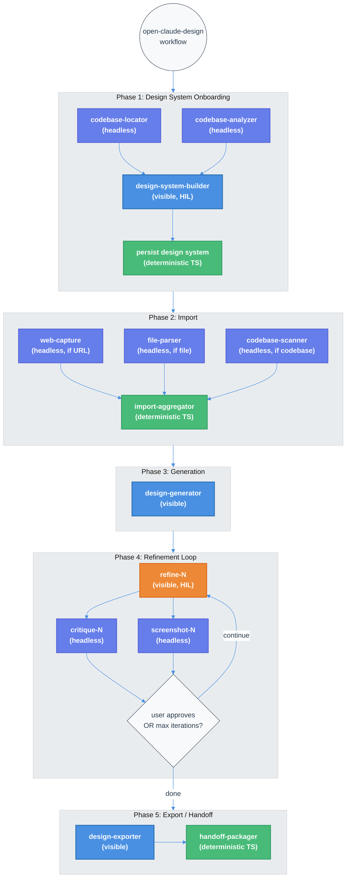

# Open Claude Design — Technical Design Document / RFC

| Document Metadata      | Details                                                                        |
| ---------------------- | ------------------------------------------------------------------------------ |
| Author(s)              | flora131                                                                       |
| Status                 | Draft (WIP)                                                                    |
| Team / Owner           | Atomic CLI                                                                     |
| Created / Last Updated | 2026-04-17                                                                     |

## 1. Executive Summary

This RFC proposes adding `open-claude-design` as a built-in workflow in the Atomic CLI, replicating Anthropic's Claude Design product (launched April 17, 2026) using the existing workflow SDK. Claude Design is a 6-phase AI-powered design tool — design system onboarding, import, generation, refinement, collaboration, and export/handoff. The open-source replica maps these phases to the Atomic SDK's `defineWorkflow().for<"claude">().run().compile()` pattern, leveraging existing skills (`impeccable`, `critique`, `shape`, `playwright-cli`, `extract`, `audit`) and agent types (`orchestrator`, `reviewer`, `worker`, `codebase-locator`, `codebase-analyzer`). Approximately 70% of required capabilities already exist in the codebase; the remaining 30% consists of new prompt templates, a design system persistence layer, a web capture helper, and a handoff bundle packager. The workflow follows proven patterns from `ralph` (iterative review-debug loop) and `deep-research-codebase` (parallel specialist fan-out).

**Research citations:**
- [research/docs/2026-04-17-open-claude-design.md](../research/docs/2026-04-17-open-claude-design.md) — Primary SDK mapping research
- [research/docs/2026-04-17-claude-design-product-analysis.md](../research/docs/2026-04-17-claude-design-product-analysis.md) — Product analysis
- [research/web/2026-04-17-claude-design-anthropic-labs.md](../research/web/2026-04-17-claude-design-anthropic-labs.md) — Raw source collection

---

## 2. Context and Motivation

### 2.1 Current State

The Atomic CLI ships two built-in workflows:

| Workflow | Pattern | Purpose |
|---|---|---|
| `ralph` | Bounded iterative loop (plan → orchestrate → review → debug) | Autonomous code implementation with quality gates |
| `deep-research-codebase` | Parallel specialist fan-out (scout → partition → aggregate) | Codebase research and documentation |

Both use the workflow SDK at `src/sdk/workflows/builtin/<name>/<agent>/index.ts` with the `defineWorkflow().for<A>().run().compile()` builder pattern. The SDK supports visible stages (tmux windows for human-in-the-loop interaction), headless stages (in-process Agent SDK calls), and parallel execution via `Promise.all()`.

The codebase also contains a comprehensive suite of design-focused skills in `.agents/skills/`:
- **Core design:** `impeccable` (UI/UX design system), `critique` (design critique methodology), `shape` (UX/UI planning), `layout` (grid/spacing/hierarchy)
- **Enhancement:** `delight`, `polish`, `animate`, `adapt`, `colorize`, `typeset`, `clarify`, `harden`
- **Validation:** `audit` (accessibility/performance), `normalize` (design system alignment), `extract` (component/token extraction)
- **Browser automation:** `playwright-cli` (navigation, screenshots, DOM inspection, visual validation)

These skills are currently available for ad-hoc use but are not orchestrated into a cohesive design workflow.

### 2.2 The Problem

- **No design workflow exists.** Users who want to create, iterate on, and export visual designs must manually invoke individual skills in separate sessions. There is no automated pipeline from design system onboarding through generation, refinement, and handoff.
- **Claude Design is closed-source.** Anthropic's Claude Design (launched April 17, 2026) provides a 6-phase design workflow, but only via the proprietary claude.ai/design web interface. CLI/TUI users and teams using Atomic CLI have no equivalent.
- **Existing skills are underutilized.** The ~15 design-related skills represent substantial investment but lack a workflow to compose them into a production-grade design pipeline.
- **No design-to-code handoff.** Teams cannot package design intent, tokens, and component specs into a bundle that feeds directly into a coding workflow like `ralph`.

**Reference:** Claude Design's official workflow is documented in [research/docs/2026-04-17-claude-design-product-analysis.md](../research/docs/2026-04-17-claude-design-product-analysis.md), with the 6-phase flow: Onboarding → Import → Generate → Refine → Collaborate → Export/Handoff.

---

## 3. Goals and Non-Goals

### 3.1 Functional Goals

- [ ] **G1:** Implement a built-in workflow `open-claude-design` that orchestrates design creation through 5 phases: Design System Onboarding → Import → Generation → Refinement → Export/Handoff
- [ ] **G2:** Reuse existing skills (`impeccable`, `critique`, `shape`, `layout`, `extract`, `normalize`, `audit`, `playwright-cli`, `clarify`) as composable building blocks within the workflow
- [ ] **G3:** Support design system extraction from existing codebases (CSS, Tailwind, component libraries) with human-in-the-loop approval
- [ ] **G4:** Support multiple input modalities: text prompts, file references, codebase references, and live URL capture via `playwright-cli`
- [ ] **G5:** Generate interactive HTML/CSS/JS prototypes, wireframes, and design artifacts with design system context applied
- [ ] **G6:** Implement a bounded refinement loop (modeled on Ralph's review-debug pattern) with parallel critique and visual validation
- [ ] **G7:** Export designs as standalone HTML, and produce a Claude Code handoff bundle (design + intent + tokens + component specs)
- [ ] **G8:** Implement the Claude provider (`claude/index.ts`) as the primary target, following the established multi-provider directory structure

### 3.2 Non-Goals (Out of Scope)

- [ ] **NG1:** Multi-user real-time collaboration (Phase 5 of Claude Design) — this is a web UI feature not replicable in CLI/TUI context
- [ ] **NG2:** Claude-generated adjustment sliders / drawing annotations — web UI interactive controls; the TUI adaptation uses conversational refinement
- [ ] **NG3:** Canva export integration — requires Canva API partnership; standalone HTML and handoff bundle are sufficient
- [ ] **NG4:** PDF/PPTX export — while skills exist, these are enhancement-tier features for a later phase
- [ ] **NG5:** Copilot and OpenCode provider implementations — scaffold the directory structure but defer implementation to a follow-up
- [ ] **NG6:** Frontier design (voice/video/3D/shaders) — requires specialized model capabilities beyond current scope
- [ ] **NG7:** MCP connector integrations (Figma, Slack, Notion, Linear) — defer to future phases when MCP infrastructure is more mature

---

## 4. Proposed Solution (High-Level Design)

### 4.1 System Architecture Diagram



### 4.2 Architectural Pattern

**Hybrid: Fan-out + Bounded Iterative Loop**

The workflow combines two proven patterns from the existing codebase:

1. **Fan-out** (from `deep-research-codebase`): Phases 1-2 use parallel headless stages to gather context (codebase analysis, web capture, file parsing) before converging into visible interactive stages.

2. **Bounded iterative loop** (from `ralph`): Phase 4 implements a refinement loop with parallel validation (critique + screenshot) that repeats until the user approves or `MAX_REFINEMENTS` is reached.

**Reference:** The research document identifies this hybrid approach at [research/docs/2026-04-17-open-claude-design.md, Part 3-4](../research/docs/2026-04-17-open-claude-design.md), mapping each Claude Design phase to specific SDK primitives.

### 4.3 Key Components

| Component | Responsibility | Skills / Agent Types | Justification |
|---|---|---|---|
| Design System Builder | Extract tokens from codebase, present to user for approval | `extract`, `normalize`, `colorize`, `typeset` + `codebase-locator`, `codebase-analyzer` | Reuses existing analysis agents and design extraction skills |
| Import Handler | Parse text/file/URL inputs into structured context | `playwright-cli`, `liteparse` | Playwright captures live URLs; liteparse handles DOCX/PPTX/XLSX |
| Design Generator | Generate first version (HTML/CSS/JS) with design system context | `impeccable`, `shape`, `layout`, `delight` | Core design skills compose into generation prompt |
| Refinement Loop | Iterative feedback with parallel validation | `critique`, `audit`, `polish`, `playwright-cli` + `reviewer` agent | Ralph's dual-reviewer pattern adapted for design critique |
| Export/Handoff | Package output as HTML and Claude Code handoff bundle | `extract`, custom handoff helper | Deterministic TS packaging (no LLM call needed) |

---

## 5. Detailed Design

### 5.1 Directory Structure

Following the established built-in workflow pattern (Claude-only for initial implementation):

```
src/sdk/workflows/builtin/open-claude-design/
├── claude/index.ts              ← Primary workflow definition (Claude provider only)
└── helpers/
    ├── prompts.ts               ← All prompt builder functions
    ├── design-system.ts         ← Design system extraction, persistence, loading
    ├── web-capture.ts           ← URL → screenshot + DOM structure helper
    ├── validation.ts            ← Critique output parsing, exit condition logic
    ├── export.ts                ← HTML export helpers
    └── handoff.ts               ← Claude Code handoff bundle packager
```

**New agent definitions** (`.claude/agents/`) — hybrid approach, only for creative phases:

```
.claude/agents/
├── design-system-builder.md     ← Design system extraction and proposal agent (new)
├── design-generator.md          ← First version generation agent (new)
└── design-refiner.md            ← Refinement iteration agent (new)
```

**Reused existing agents** (no changes needed):
- `codebase-locator` — Find CSS/Tailwind/design files during onboarding
- `codebase-analyzer` — Extract tokens from design files, analyze codebase references
- `reviewer` — Structured design critique during refinement validation
- `codebase-online-researcher` — Web capture via playwright, screenshot validation

**Output directory structure** (timestamped per run):

```
.open-claude-design/
├── design-system.json           ← Persisted design system (reused across runs)
├── output-2026-04-17T14-30-00/  ← Timestamped output directory
│   ├── index.html               ← Generated design
│   ├── styles.css
│   └── script.js
└── export-2026-04-17T14-30-00/  ← Timestamped export directory
    └── handoff/
        ├── design/              ← Copy of generated files
        ├── design-system.json
        ├── design-intent.md
        ├── component-specs.md
        ├── interaction-specs.md
        ├── accessibility-notes.md
        └── handoff-prompt.md
```

### 5.2 Workflow Inputs

```typescript
export default defineWorkflow({
  name: "open-claude-design",
  description: "AI-powered design workflow: design system → generate → refine → export/handoff",
  inputs: [
    {
      name: "prompt",
      type: "text",
      required: true,
      description: "Design request — what to create",
    },
    {
      name: "reference",
      type: "text",
      required: false,
      description: "URL, file path, or codebase path for import context",
    },
    {
      name: "output-type",
      type: "enum",
      required: false,
      values: ["prototype", "wireframe", "mockup", "landing-page"],
      default: "prototype",
      description: "Type of design output to generate",
    },
    {
      name: "design-system",
      type: "text",
      required: false,
      description: "Path to existing design system JSON — skips automatic onboarding if provided (e.g., from a previous run)",
    },
  ],
})
  .for<"claude">()
  .run(async (ctx) => { /* ... */ })
  .compile();
```

### 5.3 Workflow Orchestration (Claude Provider)

The complete orchestration flow in `claude/index.ts`:

```
                    ┌─→ codebase-locator (headless)
                    │
  design-system ────┤─→ codebase-analyzer (headless)
  (visible, HIL)    │
                    └─→ persist design system (deterministic TS)
         │
         ▼
         ┌─→ web-capture (headless, if URL)
         │
  import ┤─→ file-parser (headless, if file)
         │
         └─→ codebase-scanner (headless, if codebase ref)
         │
         ▼ (deterministic aggregation)
         │
  generator (visible) ─── applies design system + import context
         │
         ▼
  ┌────────────────────────────────────────────────┐
  │  Refinement Loop (bounded, MAX_REFINEMENTS=8)  │
  │                                                │
  │  refine-{i} (visible, HIL)                     │
  │       │                                        │
  │       ├─→ critique-{i} (headless)              │
  │       └─→ screenshot-{i} (headless)            │
  │       │                                        │
  │  (loop until user signals done or max reached) │
  └────────────────────────────────────────────────┘
         │
         ▼
  export (visible) ─→ HTML output + handoff bundle
```

### 5.4 Phase 1: Design System Onboarding (Automatic)

**Purpose:** Automatically read the user's codebase, extract design tokens (colors, typography, spacing, components), and use the `impeccable` skill to set up design principles (`.impeccable.md`). The user approves or refines the proposed design system via `AskUserQuestion` — no manual input required to start.

**Skip condition:** If `ctx.inputs["design-system"]` is provided and the file exists, load it directly and skip to Phase 2.

**How it works (from the user's perspective):**
1. The workflow automatically reads the codebase and design files — no user action needed
2. It proposes a design system (colors, typography, components) using `impeccable` + `extract` skills
3. The user is prompted via `AskUserQuestion` to approve or request changes to each design element
4. The approved design system is persisted and automatically applied to all subsequent phases

This mirrors Claude Design's onboarding: *"During onboarding, Claude builds a design system for your team by reading your codebase and design files. Every project after that uses your colors, typography, and components automatically."*

**Implementation:**

```typescript
// Phase 1: Design System Onboarding (automatic)
let designSystem: DesignSystemContext;

if (ctx.inputs["design-system"]) {
  // Load existing design system
  designSystem = await loadDesignSystem(ctx.inputs["design-system"]);
} else {
  // Step 1a: Parallel codebase analysis (headless, fully automatic)
  const [locatorResult, analyzerResult] = await Promise.all([
    ctx.stage(
      { name: "ds-locator", headless: true, description: "Locate design files" },
      {}, {},
      async (s) => {
        const result = await s.session.query(
          buildDesignSystemLocatorPrompt(root),
          { agent: "codebase-locator", ...SUBAGENT_OPTS },
        );
        s.save(s.sessionId);
        return extractAssistantText(result, 0);
      },
    ),
    ctx.stage(
      { name: "ds-analyzer", headless: true, description: "Analyze design tokens" },
      {}, {},
      async (s) => {
        const result = await s.session.query(
          buildDesignSystemAnalyzerPrompt(root),
          { agent: "codebase-analyzer", ...SUBAGENT_OPTS },
        );
        s.save(s.sessionId);
        return extractAssistantText(result, 0);
      },
    ),
  ]);

  // Step 1b: Visible HIL stage — uses impeccable skill to propose design system,
  //          then prompts user via AskUserQuestion for approval at each decision point
  //          (color palette, typography, spacing, component library)
  const dsBuilder = await ctx.stage(
    { name: "design-system-builder", description: "Build design system" },
    { chatFlags: ["--agent", "design-system-builder", ...SKIP_PERMS] },
    {},
    async (s) => {
      const result = await s.session.query(
        buildDesignSystemBuilderPrompt({
          locatorOutput: locatorResult.result,
          analyzerOutput: analyzerResult.result,
        }),
      );
      s.save(s.sessionId);
      return extractAssistantText(result, 0);
    },
  );

  // Step 1c: Deterministic persistence — write design system + .impeccable.md
  designSystem = await persistDesignSystem(dsBuilder.result, designSystemPath);
}
```

**Skills activated in agent prompts:**
- `impeccable` — **Core**: sets up design principles in `.impeccable.md` (color, contrast, craft, interaction, motion, responsive, spatial, typography, UX writing)
- `extract` — component and token extraction from CSS/Tailwind/styled-components
- `normalize` — align tokens to a consistent naming scheme
- `colorize` — validate and propose color palettes
- `typeset` — typography hierarchy and font selection

**Design system persistence format:**

```json
{
  "version": 1,
  "name": "Project Design System",
  "colors": {
    "primary": "#4a90e2",
    "secondary": "#667eea",
    "background": "#f8f9fa",
    "text": "#2c3e50"
  },
  "typography": {
    "fontFamily": { "heading": "Inter", "body": "Inter" },
    "scale": { "h1": "2.25rem", "h2": "1.875rem", "body": "1rem", "small": "0.875rem" }
  },
  "spacing": { "xs": "0.25rem", "sm": "0.5rem", "md": "1rem", "lg": "1.5rem", "xl": "2rem" },
  "components": [
    { "name": "Button", "variants": ["primary", "secondary", "ghost"], "source": "src/components/Button.tsx" }
  ],
  "source": { "framework": "tailwind", "configPath": "tailwind.config.ts" }
}
```

**Note on `.impeccable.md`:** The `design-system-builder` agent uses the `impeccable` skill to generate/update the project's `.impeccable.md` file alongside the design system JSON. This establishes design principles (color philosophy, typography rationale, spacing rhythm, interaction patterns) that are automatically loaded by all subsequent stages via the `impeccable` skill.

**Reference:** Claude Design's onboarding stores a "representation" of the design system, not raw files ([research/docs/2026-04-17-claude-design-product-analysis.md, Phase 1](../research/docs/2026-04-17-claude-design-product-analysis.md)). Our JSON persistence + `.impeccable.md` mirrors this approach.

### 5.5 Phase 2: Import

**Purpose:** Parse user-provided reference inputs (URLs, files, codebase paths) into structured context for the generator.

**Implementation:**

```typescript
// Phase 2: Import — parallel input parsing
const reference = ctx.inputs.reference ?? "";
const importContext: ImportContext = { prompt: ctx.inputs.prompt ?? "", reference: "", designSystem };

if (reference) {
  if (isUrl(reference)) {
    // Web capture via playwright-cli
    const capture = await ctx.stage(
      { name: "web-capture", headless: true, description: "Capture website" },
      {}, {},
      async (s) => {
        const result = await s.session.query(
          buildWebCapturePrompt(reference),
          { agent: "codebase-online-researcher", ...SUBAGENT_OPTS },
        );
        s.save(s.sessionId);
        return extractAssistantText(result, 0);
      },
    );
    importContext.reference = capture.result;
  } else if (isFilePath(reference)) {
    // File parsing (images processed by model vision, docs by liteparse)
    const fileParse = await ctx.stage(
      { name: "file-parser", headless: true, description: "Parse reference file" },
      {}, {},
      async (s) => {
        const result = await s.session.query(
          buildFileParsePrompt(reference),
          { agent: "codebase-analyzer", ...SUBAGENT_OPTS },
        );
        s.save(s.sessionId);
        return extractAssistantText(result, 0);
      },
    );
    importContext.reference = fileParse.result;
  } else {
    // Codebase path reference
    const codeScan = await ctx.stage(
      { name: "codebase-scanner", headless: true, description: "Scan codebase reference" },
      {}, {},
      async (s) => {
        const result = await s.session.query(
          buildCodebaseScanPrompt(reference, root),
          { agent: "codebase-analyzer", ...SUBAGENT_OPTS },
        );
        s.save(s.sessionId);
        return extractAssistantText(result, 0);
      },
    );
    importContext.reference = codeScan.result;
  }
}
```

**Web capture helper** (`helpers/web-capture.ts`):

The `buildWebCapturePrompt(url)` function instructs the `codebase-online-researcher` agent to use `playwright-cli` to:
1. Navigate to the URL
2. Take a full-page screenshot
3. Extract the page's DOM structure (headings, navigation, layout sections)
4. Extract computed CSS values (colors, fonts, spacing) from key elements
5. Return a structured summary with the screenshot path and extracted design elements

**Reference:** Claude Design's web capture tool "grabs elements directly from a live website so prototypes look like the real product" ([research/web/2026-04-17-claude-design-anthropic-labs.md, Phase 2](../research/web/2026-04-17-claude-design-anthropic-labs.md)).

### 5.6 Phase 3: Generation

**Purpose:** Generate the first version of the design artifact (HTML/CSS/JS) using the design system context and import inputs.

**Implementation:**

```typescript
// Phase 3: Generation — visible stage with design skills
const outputType = ctx.inputs["output-type"] ?? "prototype";
const designDir = path.join(root, ".open-claude-design", "output");

const generator = await ctx.stage(
  { name: "design-generator", description: "Generate first version" },
  { chatFlags: ["--agent", "design-generator", ...SKIP_PERMS] },
  {},
  async (s) => {
    const result = await s.session.query(
      buildGeneratorPrompt({
        prompt: importContext.prompt,
        reference: importContext.reference,
        designSystem,
        outputType,
        designDir,
      }),
    );
    s.save(s.sessionId);
    return extractAssistantText(result, 0);
  },
);
```

**Generator prompt composition** (`helpers/prompts.ts: buildGeneratorPrompt()`):

The prompt injects:
1. The design system JSON as structured context
2. The aggregated import context (web capture, file parse, or codebase scan output)
3. The user's original prompt
4. The requested output type (prototype/wireframe/mockup/landing-page)
5. The output directory path
6. Skill activations: `impeccable`, `shape`, `layout`, `colorize`, `typeset`, `delight`

The generator agent writes HTML/CSS/JS files to `designDir` and returns a summary of what was created.

**Skills activated in the `design-generator` agent definition:**
- `impeccable` — Core UI/UX design principles (color, contrast, craft, interaction, motion, responsive, spatial, typography, UX writing)
- `shape` — Structured discovery interview → design brief → implementation
- `layout` — Grid systems, spacing, visual hierarchy
- `colorize` — Strategic color application
- `typeset` — Typography hierarchy and readability
- `delight` — Micro-interactions and personality

### 5.7 Phase 4: Refinement Loop

**Purpose:** Iterative design improvement with parallel validation, modeled on Ralph's review-debug loop.

**Implementation:**

```typescript
// Phase 4: Refinement Loop
const MAX_REFINEMENTS = 8;

for (let iteration = 1; iteration <= MAX_REFINEMENTS; iteration++) {
  // Step 4a: Visible refinement stage — user provides feedback
  const refine = await ctx.stage(
    { name: `refine-${iteration}`, description: `Refinement round ${iteration}` },
    { chatFlags: ["--agent", "design-refiner", ...SKIP_PERMS] },
    {},
    async (s) => {
      const result = await s.session.query(
        buildRefinePrompt({
          prompt: importContext.prompt,
          designDir,
          designSystem,
          iteration,
        }),
      );
      s.save(s.sessionId);
      return extractAssistantText(result, 0);
    },
  );

  // Step 4b: Check for user "done" signal
  if (isRefinementComplete(refine.result)) break;

  // Step 4c: Parallel validation (critique + screenshot)
  const [critiqueResult, screenshotResult] = await Promise.all([
    ctx.stage(
      { name: `critique-${iteration}`, headless: true, description: "Design critique" },
      {}, {},
      async (s) => {
        const result = await s.session.query(
          buildCritiquePrompt(designDir, designSystem),
          { agent: "reviewer", ...SUBAGENT_OPTS },
        );
        s.save(s.sessionId);
        return extractAssistantText(result, 0);
      },
    ),
    ctx.stage(
      { name: `screenshot-${iteration}`, headless: true, description: "Visual validation" },
      {}, {},
      async (s) => {
        const result = await s.session.query(
          buildScreenshotValidationPrompt(designDir),
          { agent: "codebase-online-researcher", ...SUBAGENT_OPTS },
        );
        s.save(s.sessionId);
        return extractAssistantText(result, 0);
      },
    ),
  ]);

  // Step 4d: Parse validation results — feed back into next iteration
  const validationSummary = mergeValidationResults(
    critiqueResult.result,
    screenshotResult.result,
  );

  // If validation passes with no critical findings, suggest completion to user
  if (isValidationClean(validationSummary)) {
    // Next iteration's refine prompt will indicate validation passed
  }
}
```

**Critique prompt composition** (`helpers/prompts.ts: buildCritiquePrompt()`):

Leverages the `critique` skill's framework (aligned with Claude Design's `/critique` plugin command):
1. **First Impression (2s):** Eye movement, emotional reaction, clarity of purpose
2. **Usability:** Goal accomplishment, navigation, interactive elements
3. **Visual Hierarchy:** Reading order, emphasis, whitespace, typography
4. **Consistency:** Design system adherence, spacing, colors, behavior
5. **Accessibility:** Color contrast, touch targets, readability

Output: Structured findings with severity ratings (Critical/Moderate/Minor).

**Reference:** The critique framework mirrors Claude Design's plugin commands documented at [research/docs/2026-04-17-claude-design-product-analysis.md, Critique Framework](../research/docs/2026-04-17-claude-design-product-analysis.md).

**Screenshot validation** (`helpers/prompts.ts: buildScreenshotValidationPrompt()`):

Uses `playwright-cli` to:
1. Open the generated HTML in a headless browser
2. Take screenshots at multiple viewport sizes (mobile 375px, tablet 768px, desktop 1440px)
3. Model visually inspects screenshots for rendering issues, layout breaks, visual consistency
4. Returns structured findings about visual quality

**Exit condition (via `AskUserQuestion`):**

The refinement loop exits when the user explicitly approves via the `AskUserQuestion` tool. After each refinement iteration + validation pass, the workflow prompts the user:

```typescript
// After validation completes, prompt user for explicit approval
const userDecision = await askUserQuestion({
  questions: [{
    question: "How would you like to proceed with the design?",
    header: "Refinement",
    options: [
      { label: "Approve and export", description: "Design looks good — proceed to export and handoff" },
      { label: "Continue refining", description: "I have more feedback — start another refinement round" },
      { label: "Start over", description: "Discard current version and regenerate from scratch" },
    ],
    multiSelect: false,
  }],
});
```

The loop exits when:
1. The user selects "Approve and export" via `AskUserQuestion` — explicit, unambiguous signal
2. `MAX_REFINEMENTS` (8) iterations are exhausted — safety bound

### 5.8 Phase 5: Export and Handoff (Automatic)

**Purpose:** Automatically package the final design as standalone HTML and a complete Claude Code handoff bundle. No user configuration needed — the workflow always produces the full bundle.

**Implementation:**

```typescript
// Phase 5: Export and Handoff (fully automatic)
const finalPath = path.join(root, ".open-claude-design", "export");

// Step 5a: Visible export stage — generates specs and intent docs from workflow context
const exporter = await ctx.stage(
  { name: "export", description: "Export design" },
  { chatFlags: ["--agent", "design-exporter", ...SKIP_PERMS] },
  {},
  async (s) => {
    const result = await s.session.query(
      buildExportPrompt({ designDir, finalPath, designSystem }),
    );
    s.save(s.sessionId);
    return extractAssistantText(result, 0);
  },
);

// Step 5b: Deterministic handoff bundle packaging (no LLM call)
// Always produces the full bundle — design files, intent, specs, prompt
await packageHandoffBundle({
  designDir,
  finalPath,
  designSystem,
  exporterNotes: exporter.result,
});
```

**Handoff bundle structure** (`helpers/handoff.ts`):

```
.open-claude-design/export/handoff/
├── design/                     ← Generated HTML/CSS/JS (copied from designDir)
├── design-system.json          ← Design tokens, colors, typography
├── design-intent.md            ← Reasoning behind design decisions (extracted from generator + refiner transcripts)
├── component-specs.md          ← Component specifications (name, variants, props, states)
├── interaction-specs.md        ← Interaction documentation (hover, click, transitions, edge cases)
├── accessibility-notes.md      ← Accessibility audit findings and compliance notes
└── handoff-prompt.md           ← Ready-to-use prompt for Claude Code / ralph workflow
```

The `handoff-prompt.md` is a self-contained prompt that can be fed directly to `ralph` or Claude Code:

```markdown
# Design Handoff — [Project Name]

## Context
[Extracted design intent and rationale]

## Design System
[Reference to design-system.json]

## Components to Implement
[List of components with specs]

## Instructions
Implement this design as production code, following the design system tokens
and component specifications in this bundle. Refer to design-intent.md for
the reasoning behind design decisions.
```

**Reference:** Brilliant's testimonial confirms the value: "Including design intent in Claude Code handoffs has made the jump from prototype to production seamless" ([research/docs/2026-04-17-claude-design-product-analysis.md, Phase 6](../research/docs/2026-04-17-claude-design-product-analysis.md)).

### 5.9 Prompt Builders Summary

All prompt builders live in `helpers/prompts.ts`, following Ralph's pattern:

| Function | Purpose | Skills Injected | Reference Pattern |
|---|---|---|---|
| `buildDesignSystemLocatorPrompt(root)` | Find CSS/Tailwind/design files in codebase | — | `deep-research: buildLocatorPrompt()` |
| `buildDesignSystemAnalyzerPrompt(root)` | Extract tokens from design files | `extract`, `normalize` | `deep-research: buildAnalyzerPrompt()` |
| `buildDesignSystemBuilderPrompt(context)` | Present design system for HIL approval | `colorize`, `typeset` | `ralph: buildPlannerPrompt()` |
| `buildWebCapturePrompt(url)` | Capture URL via playwright | `playwright-cli` | Custom |
| `buildFileParsePrompt(filePath)` | Parse reference file | `liteparse` | Custom |
| `buildCodebaseScanPrompt(path, root)` | Scan codebase reference path | — | `deep-research: buildLocatorPrompt()` |
| `buildGeneratorPrompt(context)` | Generate first version with full context | `impeccable`, `shape`, `layout`, `delight` | Custom |
| `buildRefinePrompt(context)` | Refinement iteration with validation feedback | `impeccable`, `critique`, `polish`, `clarify` | `ralph: buildOrchestratorPrompt()` |
| `buildCritiquePrompt(designDir, ds)` | Structured design critique | `critique`, `audit` | `ralph: buildReviewPrompt()` |
| `buildScreenshotValidationPrompt(dir)` | Visual validation via playwright | `playwright-cli` | Custom |
| `buildExportPrompt(context)` | Export in requested format | `extract` | Custom |

### 5.10 Constants and Shared Configuration

```typescript
// Constants (following ralph and deep-research patterns)
const MAX_REFINEMENTS = 8;
const DESIGN_OUTPUT_DIR = ".open-claude-design/output";
const DESIGN_SYSTEM_FILENAME = "design-system.json";
const HANDOFF_DIR = ".open-claude-design/export/handoff";

const SKIP_PERMS = [
  "--allow-dangerously-skip-permissions",
  "--dangerously-skip-permissions",
] as const;

const SUBAGENT_OPTS = {
  permissionMode: "bypassPermissions",
  allowDangerouslySkipPermissions: true,
} as const;
```

### 5.11 Agent Definitions (Hybrid Approach)

Three new agent definitions for creative phases, plus reuse of existing agents for analysis/validation:

**New agents (`.claude/agents/`):**

**`design-system-builder.md`**
- Role: Use `impeccable` skill to propose design principles and present extracted design tokens for user approval
- Tools: Read, Write, Glob, Grep, AskUserQuestion
- Skills: `impeccable`, `extract`, `normalize`, `colorize`, `typeset`
- Behavior: Automatically analyze codebase analysis output, propose design system elements (colors, typography, spacing, components), use `AskUserQuestion` to prompt user for approval at each decision point, write approved system to JSON and generate/update `.impeccable.md`

**`design-generator.md`**
- Role: Generate HTML/CSS/JS design artifacts from prompt + design system context
- Tools: Read, Write, Bash (for serving/previewing)
- Skills: `impeccable`, `shape`, `layout`, `colorize`, `typeset`, `delight`
- Behavior: Write production-quality HTML/CSS/JS to the timestamped output directory; apply design system tokens from `.open-claude-design/design-system.json`; support prototype/wireframe/mockup/landing-page output types

**`design-refiner.md`**
- Role: Accept user feedback and refine generated designs iteratively
- Tools: Read, Write, Edit, Bash
- Skills: `impeccable`, `critique`, `polish`, `adapt`, `clarify`, `harden`
- Behavior: Read validation feedback (critique + screenshot), present findings to user, implement requested changes

**Reused existing agents (no modifications needed):**

| Agent | Phase Used | Purpose |
|---|---|---|
| `codebase-locator` | Phase 1 (headless) | Find CSS/Tailwind/design files in codebase |
| `codebase-analyzer` | Phase 1, 2 (headless) | Extract tokens from design files; parse codebase references |
| `reviewer` | Phase 4 (headless) | Structured design critique with severity ratings |
| `codebase-online-researcher` | Phase 2, 4 (headless) | Web capture via playwright; screenshot validation |

---

## 6. Alternatives Considered

| Option | Pros | Cons | Reason for Rejection |
|---|---|---|---|
| **A: Single-stage monolith** — One visible stage handles everything | Simple implementation, minimal coordination | No parallel validation, poor separation of concerns, unmaintainable prompts | Does not leverage the workflow SDK's stage orchestration; prompts would exceed context limits |
| **B: Pure headless pipeline** — All stages headless, batch-mode | Fast execution, no user interaction delays | No human-in-the-loop; design is inherently iterative and subjective | Design requires user judgment at key points (system approval, refinement, export choice) |
| **C: Plugin commands only** — Expose `/critique`, `/design-system`, etc. as standalone skills | Minimal new code, each command is independent | No orchestrated workflow; user must manually chain commands | Misses the core value proposition of an end-to-end design pipeline |
| **D: Hybrid (Selected)** — Fan-out + bounded loop with visible HIL stages | Leverages proven patterns (ralph + deep-research), parallel validation, human-in-the-loop at key decision points | More complex orchestration, multiple agent definitions needed | **Selected:** Best balance of automation and user control; matches Claude Design's natural creative flow |

---

## 7. Cross-Cutting Concerns

### 7.1 Security and Privacy

- **No data upload:** Design system representations are stored locally in `.open-claude-design/`. Source code is never uploaded to external servers.
- **File permissions:** Headless stages use `bypassPermissions` (consistent with `ralph` and `deep-research-codebase` patterns). Visible stages use CLI permission flags.
- **Web capture:** The `playwright-cli` web capture only accesses URLs explicitly provided by the user. No automated crawling.
- **Sensitive files:** The handoff bundle should not include `.env`, credentials, or other sensitive files. The export helper explicitly filters these.

### 7.2 Observability Strategy

- **Stage naming:** All stages follow the `<phase>-<iteration>` convention for clear graph visualization in the TUI.
- **Transcripts:** Every stage calls `s.save(s.sessionId)` — transcripts are readable via `ctx.transcript()` for debugging and audit.
- **Scratch files:** The design system and handoff bundle persist to disk, providing a durable record of the workflow's output.
- **Graph topology:** The `GraphFrontierTracker` auto-infers the workflow DAG from `ctx.stage()` and `Promise.all()` patterns, rendering it in the TUI graph panel.

### 7.3 Scalability and Context Management

- **Bounded refinement:** `MAX_REFINEMENTS = 8` caps iteration count, preventing runaway loops.
- **File-based handoff:** Following `deep-research-codebase`'s pattern, inter-stage data is passed as TypeScript return values (strings), not inlined transcripts. The handoff bundle uses files on disk, keeping aggregator context bounded.
- **Prompt sizing:** Each prompt builder includes only the context relevant to its stage (design system, import context, or validation findings), never the full workflow history.

---

## 8. Migration, Rollout, and Testing

### 8.1 Deployment Strategy

- [ ] **Phase 1:** Implement Claude provider only (`claude/index.ts`), stub Copilot/OpenCode providers
- [ ] **Phase 2:** Create custom agent definitions and prompt builders
- [ ] **Phase 3:** Implement helpers (design-system, web-capture, validation, export, handoff)
- [ ] **Phase 4:** End-to-end integration testing with sample projects
- [ ] **Phase 5:** Add Copilot and OpenCode providers (follow-up)

### 8.2 Test Plan

- **Unit Tests:**
  - `helpers/design-system.ts` — JSON serialization/deserialization, token extraction, validation
  - `helpers/validation.ts` — Critique output parsing, `isRefinementComplete()`, `isValidationClean()`
  - `helpers/handoff.ts` — Bundle structure generation, file filtering
  - `helpers/web-capture.ts` — URL detection (`isUrl()`), prompt construction
  - `helpers/prompts.ts` — Each prompt builder returns non-empty strings with expected sections

- **Integration Tests:**
  - Full workflow execution with a sample project (e.g., a Tailwind-based React app)
  - Design system extraction from a known codebase produces expected tokens
  - Web capture of a known URL produces structured output
  - Refinement loop exits correctly on user completion signal
  - Handoff bundle structure matches expected format

- **End-to-End Tests:**
  - Run `atomic workflow -n open-claude-design -a claude "Create a landing page for a SaaS product"` against a sample repo
  - Verify design system JSON is persisted
  - Verify HTML output renders correctly (playwright screenshot validation)
  - Verify handoff bundle contains all required files

---

## 9. Open Questions / Unresolved Issues

### Resolved

- [x] **Q1: Design system persistence location** — **Resolved: `.open-claude-design/design-system.json`** in the project root. Colocated with output/export dirs. Easy to gitignore or commit.
- [x] **Q2: Refinement exit condition** — **Resolved: Explicit user signal via `AskUserQuestion`**. After each refinement + validation pass, the workflow prompts the user with "Approve and export" / "Continue refining" / "Start over". Unambiguous, no keyword detection.
- [x] **Q3: Screenshot validation approach** — **Resolved: Playwright screenshot + model critique**. Use `playwright-cli` to render HTML at 3 viewports (375px, 768px, 1440px), take screenshots, feed to model for visual critique. Catches rendering bugs, layout breaks, and responsive issues.
- [x] **Q4: Handoff bundle contents** — **Resolved: Always generate full bundle automatically**. The workflow produces the complete handoff (design files + design-intent.md + component-specs.md + interaction-specs.md + accessibility-notes.md + handoff-prompt.md) as its natural output. No user configuration needed.

- [x] **Q5: Custom agents vs. skill-only prompts** — **Resolved: Hybrid approach**. Create new dedicated agents for the creative phases (`design-system-builder`, `design-generator`, `design-refiner`) where existing agents don't fit well. Reuse existing agents for analysis and validation (`codebase-locator`, `codebase-analyzer`, `reviewer`, `codebase-online-researcher`). Minimizes new files while keeping specialized behavior where it matters.
- [x] **Q6: Multi-provider scope** — **Resolved: Claude-only, no stubs**. Ship only `claude/index.ts`. Add Copilot/OpenCode providers when there is demand. Keeps the initial PR focused.
- [x] **Q7: Output directory lifecycle** — **Resolved: Timestamped directories**. Each run creates `.open-claude-design/output-<timestamp>/`. Preserves history, allows comparing iterations, no risk of losing previous work.
