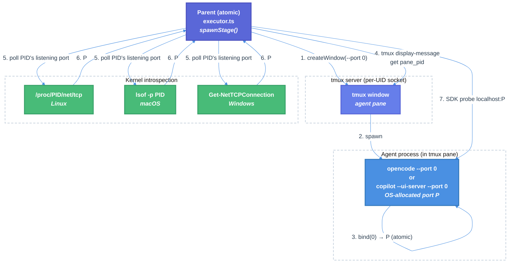

# Cross-UID TCP Port Race Fix for OpenCode and Copilot Workflows — Technical Design Document

| Document Metadata      | Details                                                        |
| ---------------------- | -------------------------------------------------------------- |
| Author(s)              | Norin Lavaee                                                   |
| Status                 | Draft (WIP)                                                    |
| Team / Owner           | Atomic CLI                                                     |
| Created / Last Updated | 2026-04-30                                                     |

## 1. Executive Summary

Atomic workflows that use OpenCode or Copilot agents intermittently fail when **two different Linux users on the same VM run `atomic workflow` concurrently**. Symptom: the workflow gets stuck on its first stage with no error state, and attaching to the stage's tmux pane shows nothing — no agent visible. This is caused by two compounding bugs in `src/sdk/runtime/executor.ts`: (1) a TOCTOU race in `getRandomPort()` where the parent picks a port and the kernel can hand the same port to another atomic instance before the child binds, and (2) a silent fall-through in `waitForServer()` that returns a known-broken URL instead of throwing on probe timeout.

This spec proposes a two-part fix: pass `--port 0` to OpenCode and Copilot (the OS atomically allocates a free port inside the child's `bind()` syscall, eliminating the race), and discover the bound port via **per-PID kernel introspection** — reading `/proc/<pid>/net/tcp` on Linux, `lsof` on macOS, and `Get-NetTCPConnection` on Windows — rather than parsing the agent's stdout banner. `waitForServer` is rewritten to discover the port and probe the SDK; on failure it throws a real `Error` so the workflow surfaces a `sessionError` instead of hanging silently. The fix is scoped to the workflow execution path and does not affect chat (which already runs the agent CLI raw with no port).

## 2. Context and Motivation

### 2.1 Current State

Atomic workflows spawn each stage's agent in a dedicated tmux window on the per-UID atomic socket (`/tmp/tmux-$UID/atomic`). For OpenCode and Copilot, the agent CLI is invoked with `--port <N>` (or `--ui-server --port <N>` for Copilot) so a TUI server listens on a TCP port. The parent atomic process then connects to `localhost:<N>` via the SDK's `cliUrl` / `baseUrl` option to inject prompts, read messages, etc.

Port allocation lives in `src/sdk/runtime/executor.ts:173-189` (`getRandomPort`):

```ts
async function getRandomPort(): Promise<number> {
  const net = await import("node:net");
  const MAX_RETRIES = 3;
  let lastPort = 0;
  for (let attempt = 0; attempt < MAX_RETRIES; attempt++) {
    const port = await new Promise<number>((resolve, reject) => {
      const server = net.createServer();
      server.listen(0, () => {
        const addr = server.address();
        const p = typeof addr === "object" && addr ? addr.port : 0;
        // ... resolve(p) and close()
      });
    });
    // ... return port
  }
}
```

The flow:
1. Parent calls `net.createServer().listen(0)` → kernel hands it free port P.
2. Parent calls `server.close()` → P is returned to the global free pool.
3. Parent spawns the agent CLI with `--port P` inside a tmux window.
4. Agent CLI calls `bind(P)` — but between (2) and (4), any other process on the VM can grab P.

`waitForServer` (lines 329-366) then probes the agent's port with the SDK and either succeeds, or — on timeout — falls through:

```ts
async function waitForServer(agent, port, paneId): Promise<string> {
  // ... wait for tmux pane content to render ...
  if (agent === "copilot") {
    while (Date.now() < deadline) {
      try { /* probe */; return serverUrl; } catch { await Bun.sleep(1_000); }
    }
    // No throw on timeout — falls through.
  }
  // For OpenCode, give it extra time after TUI renders
  await Bun.sleep(3_000);
  return serverUrl;  // ← always returns, even on probe failure
}
```

**Why chat is unaffected**: `src/commands/cli/chat/index.ts` runs the agent CLI raw — no `--port`, no `--ui-server` — so chat never opens a TCP port and cannot race.

**Why Claude is unaffected**: `buildPaneCommand` for Claude returns just a shell (`process.env.SHELL || "sh"`) — no port allocated. `waitForServer` returns `""` for claude immediately at line 334. The Claude Agent SDK uses UDS (Linux/macOS) and named pipes (Windows) per-user-home internally. Confirmed by the Claude Code maintainers: SDK uses `/tmp/claude-{uid}` and `~/.claude/`, no TCP fallback path.

### 2.2 The Problem

**Cross-UID conflict surface**: Different Linux users on the same VM have isolated tmux sockets at `/tmp/tmux-<UID>/atomic`, but **TCP ports are kernel-global**. When two atomic instances run concurrently as different UIDs:

1. **Bind race (most common failure)**: User A's parent picks port P, closes the probe socket, spawns the agent. User B's parent simultaneously picks port P (the kernel's ephemeral allocator can re-hand it after the close). Whichever agent's `bind()` runs second gets `EADDRINUSE` and exits. Tmux's pane dies. The orchestrator's `waitForServer` polls a port that has no live server.
2. **Cross-user probe (worse failure)**: User A's parent picks P; User B's agent is already listening on P. User A's `CopilotClient({cliUrl:"localhost:P"})` connects to User B's server, sees a healthy `listSessions()` response, returns success. User A then submits work to a session-handle that lives in User B's process.

**Silent stick**: `waitForServer`'s fall-through means failures from (1) above don't error — `serverUrl` is returned, the SDK's JSON-RPC handshake hangs without a timeout, no `sessionError` is recorded, the session shows `running` in `state.json` indefinitely.

**Observed symptom**: workflow stuck on first stage with no error; attaching to the stage shows no pane content (the agent process exited; tmux torn the window down).

### 2.3 Why Now

Multi-user shared dev VMs (e.g., remote pair-programming environments) are an increasingly common atomic deployment. The race is reproducible whenever two users run a workflow within the same ~10 second window. The fix unblocks reliable concurrent use.

## 3. Goals and Non-Goals

### 3.1 Functional Goals

- [ ] OpenCode and Copilot workflow stages must succeed when two different Linux users run atomic concurrently on the same VM.
- [ ] Failures during agent startup (any cause) must surface as a real `sessionError` and not silently hang the workflow.
- [ ] The fix must work on Linux, macOS, and Windows (atomic supports all three platforms; see `requiredMuxBinaryCandidatesForPlatform()` in `src/lib/spawn.ts`).
- [ ] The fix must not require new runtime npm dependencies.
- [ ] The fix must not break the existing chat path or the Claude workflow path.

### 3.2 Non-Goals (Out of Scope)

- [ ] We will NOT migrate Claude to a different transport. Claude already uses UDS / named pipes via the Claude Agent SDK and is cross-UID safe.
- [ ] We will NOT add identity verification (auth tokens) to detect connections to another user's server. The `--port 0` fix removes the race entirely, so the cross-user probe scenario becomes statistically impossible. Token-based identity verification is deferred to a follow-up if observed cross-user incidents persist.
- [ ] We will NOT investigate the separate "Claude visible-mode no pane" symptom. Reporter-conflated; needs its own debugger pass.
- [ ] We will NOT change the SDK protocol or the way headless stages communicate (headless OpenCode already uses `port: 0` per `executor.ts:1358`).
- [ ] We will NOT pre-bind in the parent and pass file descriptors to the child. OpenCode and Copilot CLIs do not implement systemd `LISTEN_FDS` socket activation, so this is impossible without upstream changes.

## 4. Proposed Solution (High-Level Design)

### 4.1 System Architecture Diagram



### 4.2 Architectural Pattern

**Late port discovery via OS introspection.** Rather than the parent reserving a port and informing the child (which has an inherent TOCTOU race), the child does the allocation atomically inside its own `bind()`, and the parent discovers the result by querying the kernel about the child's listening sockets. This pattern is used by cloud-init, container runtimes that watch for service readiness, and tools like `ss --processes`. It mirrors how Chrome's DevTools port is discovered (Chrome writes a `DevToolsActivePort` file; we use the kernel's process socket table because OpenCode and Copilot don't write such a file).

### 4.3 Key Components

| Component                       | Responsibility                                    | Technology                            | Justification                                                                                  |
| ------------------------------- | ------------------------------------------------- | ------------------------------------- | ---------------------------------------------------------------------------------------------- |
| `port-discovery.ts` (new)       | Resolve the listening TCP port for a given PID    | Bun.spawnSync + native `/proc` parsing | Cross-platform; no new dependency; survives banner format changes                              |
| `waitForServer` (rewritten)     | Discover port from PID, probe SDK, throw on failure | Existing module                       | Eliminates silent fall-through; uses port-discovery helper                                     |
| `buildPaneCommand` (modified)   | Emit `--port 0` instead of `--port <preallocated>` | Existing module                       | Lets OS allocate atomically inside child's bind() — no TOCTOU window                           |
| `tmux.getPanePid` (new helper)  | Retrieve the PID of the agent process in a pane   | tmux `display-message #{pane_pid}`     | Already-known tmux primitive; centralizes the call                                             |

## 5. Detailed Design

### 5.1 Module API: `src/sdk/runtime/port-discovery.ts` (new file)

Exposes a single function. No state. No singletons.

```ts
/**
 * Discover the TCP port that a given process is listening on.
 *
 * Polls the kernel's per-process socket table at ~500ms intervals until
 * a listening port is found or the timeout elapses. Returns null on
 * timeout (caller is responsible for throwing if that's an error).
 *
 * Implementation per platform:
 *   - Linux: parses /proc/<pid>/net/tcp (and /proc/<pid>/net/tcp6) directly,
 *     filtering for state == 0x0A (LISTEN). No external binary required.
 *   - macOS: shells out to `lsof -nP -iTCP -sTCP:LISTEN -a -p <pid>` and
 *     parses the output. lsof is preinstalled on all supported macOS versions.
 *   - Windows: shells out to PowerShell `Get-NetTCPConnection -OwningProcess
 *     <pid> -State Listen | Select-Object LocalPort | ConvertTo-Json` and
 *     parses the JSON. Available on Windows 8+ / Server 2012+.
 *
 * If multiple listening ports exist for the PID, returns the first one
 * bound to 127.0.0.1 / ::1 / 0.0.0.0 / ::. (Not relevant for OpenCode and
 * Copilot — they bind exactly one TCP port — but the helper is generic.)
 */
export async function getListeningPortForPid(
  pid: number,
  options?: { timeoutMs?: number; pollIntervalMs?: number },
): Promise<number | null>;
```

**Linux `/proc` parser specifics**: `/proc/<pid>/net/tcp` lines have the format `sl local_address rem_address st ... uid ... inode ...`. Local addresses are `HHHHHHHH:PPPP` (hex). State `0A` = LISTEN. The PID-to-inode mapping is in `/proc/<pid>/fd/*` (each fd has a `socket:[<inode>]` symlink target). We cross-reference: read all listening sockets in `/proc/net/tcp` and `/proc/net/tcp6`, then check which inode is owned by the target PID via `/proc/<pid>/fd/`. This avoids needing the `ss` or `netstat` binary.

**Bun-specific note**: Bun's `Bun.spawnSync` is used for shell-outs (macOS/Windows) — already used elsewhere in the codebase (e.g., `tmux.ts:125`). For Linux `/proc` parsing, use Bun's built-in `Bun.file()` and standard string parsing.

**Windows fallback**: The primary Windows path uses PowerShell `Get-NetTCPConnection` (Windows 8+/Server 2012+). On older Windows or when PowerShell is unavailable, the helper falls back to `netstat -ano | findstr <pid>` and parses the tabular output. Both parsers live in `port-discovery.ts`; the helper attempts PowerShell first and silently falls back on non-zero exit or "not recognized" stderr.

**Pane PID resolution (open implementation detail)**: tmux's `#{pane_pid}` returns the PID of the foreground process in the pane. For `tmux new-window -d -t <session> -n <name> -- <command>`, tmux execs the command directly without a wrapper shell, so `pane_pid` should be the agent. **However**, this is a Phase 1 verification step before committing to the implementation — start a tmux pane with `copilot --ui-server --port 0` and confirm `pane_pid` matches the copilot process via `ps`. If a wrapper shell is involved on any platform, `getListeningPortForPid` walks the PID's children to find the listening process.

### 5.2 Changes: `src/sdk/runtime/executor.ts`

#### 5.2.1 Delete `getRandomPort` (lines 173-189)

Unused after the change.

#### 5.2.2 Modify `buildPaneCommand` (lines 283-327)

Drop the `port: number` parameter — no longer needed. Emit `"--port", "0"` for both `copilot` and `opencode`. (Keeping `--port 0` explicit is clearer than omitting `--port` and depending on default behavior; user already confirmed both treat it identically.)

```ts
function buildPaneCommand(
  agent: AgentType,
  overrides: ProviderOverrides = {},
  extraChatFlags: string[] = [],
): { command: string; envVars: Record<string, string> } {
  // ... same defaults extraction ...
  switch (agent) {
    case "copilot":
      return {
        command: [cmd, "--ui-server", "--port", "0", ...chatFlags, ...extraChatFlags].join(" "),
        envVars,
      };
    case "opencode":
      return {
        command: [cmd, "--port", "0", ...chatFlags].join(" "),
        envVars,
      };
    case "claude":
      return {
        command: process.env.SHELL || (process.platform === "win32" ? "pwsh" : "sh"),
        envVars,
      };
    default:
      return assertNever(agent);
  }
}
```

#### 5.2.3 Rewrite `waitForServer` (lines 329-366)

New signature: takes `agent` and `paneId`, returns the server URL or **throws**.

```ts
async function waitForServer(
  agent: AgentType,
  paneId: string,
): Promise<string> {
  if (agent === "claude") return "";

  const deadline = Date.now() + SERVER_WAIT_TIMEOUT_MS;

  // 1. Wait for the agent process to start and the TUI to render.
  while (Date.now() < deadline) {
    const content = tmux.capturePane(paneId);
    const lines = content.split("\n").filter((l) => l.trim().length > 0);
    if (lines.length >= 3) break;
    await Bun.sleep(1_000);
  }

  // 2. Discover the listening port via the agent's PID.
  const panePid = tmux.getPanePid(paneId);
  if (!panePid) {
    throw new Error(`failed to resolve agent PID for pane ${paneId}`);
  }
  const remainingMs = Math.max(0, deadline - Date.now());
  const port = await getListeningPortForPid(panePid, { timeoutMs: remainingMs });
  if (port === null) {
    throw new Error(
      `agent (${agent}) did not bind a TCP port within ${SERVER_WAIT_TIMEOUT_MS}ms ` +
      `(pane ${paneId}, pid ${panePid})`,
    );
  }
  const serverUrl = `localhost:${port}`;

  // 3. Verify the SDK can actually connect.
  if (agent === "copilot") {
    const { CopilotClient } = await import("@github/copilot-sdk");
    while (Date.now() < deadline) {
      try {
        const probe = new CopilotClient({ cliUrl: serverUrl });
        await probe.start();
        await probe.listSessions();
        await probe.stop();
        return serverUrl;
      } catch {
        await Bun.sleep(1_000);
      }
    }
    throw new Error(
      `copilot SDK probe did not respond at ${serverUrl} within ${SERVER_WAIT_TIMEOUT_MS}ms`,
    );
  }

  // OpenCode: short settle delay, then return.
  await Bun.sleep(1_000);
  return serverUrl;
}
```

The key change: every failure path throws. The `if (agent === "copilot")` block no longer falls through silently. OpenCode no longer relies on a fixed 3-second sleep after the TUI renders — the port-discovery polling already proves the server is bound.

#### 5.2.4 Modify the spawn site (line 1534+)

Remove the `getRandomPort()` call and the `port` parameter from `buildPaneCommand` and `waitForServer`:

```ts
// Before (lines 1534-1567):
const port = await getRandomPort();
const { command: paneCmd, envVars: paneEnvVars } = buildPaneCommand(
  shared.agent, port, shared.providerOverrides, shared.extraChatFlags,
);
// ... isHeadless branch ...
paneId = tmux.createWindow(...);
serverUrl = await waitForServer(shared.agent, port, paneId);

// After:
const { command: paneCmd, envVars: paneEnvVars } = buildPaneCommand(
  shared.agent, shared.providerOverrides, shared.extraChatFlags,
);
// ... isHeadless branch ...
paneId = tmux.createWindow(...);
serverUrl = await waitForServer(shared.agent, paneId);
```

The `port` variable in the metadata write (referenced by the `tasks.jsonl` log) needs to be derived from `serverUrl` after `waitForServer` returns. Search for places where `port` is logged or persisted and adjust accordingly.

### 5.3 Changes: `src/sdk/runtime/tmux.ts`

Add a single helper:

```ts
/**
 * Get the PID of the foreground process in a tmux pane.
 * Returns null if the pane no longer exists or the query fails.
 *
 * Note: this is the pane's "current" process — typically the agent
 * itself when the pane was created with the agent as the initial command.
 * If tmux exec'd a wrapper shell that then exec'd the agent, the PID
 * will refer to the same process (exec replaces in-place).
 */
export function getPanePid(paneId: string): number | null {
  const result = tmuxRun(["display-message", "-t", paneId, "-p", "#{pane_pid}"]);
  if (!result.ok) return null;
  const pid = Number(result.stdout.trim());
  return Number.isFinite(pid) && pid > 0 ? pid : null;
}
```

Place after `parseSessionEnvValue` and before `getCurrentSession`, near the other pane-introspection helpers.

### 5.4 Algorithms and State Management

#### 5.4.1 Polling loop

Inside `getListeningPortForPid`:

```
deadline = Date.now() + timeoutMs
while Date.now() < deadline:
  port = readListeningPortForPid(pid)   // platform-specific
  if port !== null: return port
  if !isProcessAlive(pid): return null  // child exited; no point waiting
  await sleep(pollIntervalMs)
return null  // timeout
```

The `isProcessAlive(pid)` check fast-fails if the agent died before binding (e.g., crashed at startup, missing config, etc.). On Linux this is `existsSync(`/proc/${pid}`)`; on macOS/Windows we rely on the platform tool returning empty (and the timeout as backstop).

#### 5.4.2 Concurrency safety

The race we are eliminating happens *across* atomic processes (different users on the same VM). Within a single atomic process, port discovery is naturally serialized per stage by the existing executor logic (each stage's spawn is awaited). No new locking is introduced.

## 6. Alternatives Considered

| Option                                                | Pros                                                                | Cons                                                                                                    | Reason for Rejection                                                              |
| ----------------------------------------------------- | ------------------------------------------------------------------- | ------------------------------------------------------------------------------------------------------- | --------------------------------------------------------------------------------- |
| A. Retry on `EADDRINUSE`                              | Simple; pure cross-platform retry loop                              | Still has a race window per attempt; doesn't handle "connected to another user's server" case          | `--port 0` eliminates the race entirely without retries                           |
| B. Banner regex parsing                               | Cross-platform with no shell-outs                                   | Fragile to upstream banner format changes; needs per-agent regex                                        | Kernel introspection is more durable; banner format is upstream-controlled        |
| C. UDS / named pipes for OpenCode and Copilot         | Permanently eliminates port issues; cross-UID safe                  | OpenCode and Copilot CLIs are TCP-only; would require upstream SDK changes                              | Upstream changes are out of our control; deferred indefinitely                    |
| D. Pre-bind in parent, pass listening fd to child     | True race-free: parent allocates atomically                         | Requires agent CLI to support inheriting a listening fd (systemd-style); OpenCode and Copilot don't     | Impossible without upstream changes                                               |
| E. Identity tokens via env var (Claude SDK style)     | Defends against cross-user wrong-server connect even if race remains | Requires SDK support for arbitrary auth; OpenCode and Copilot SDKs don't expose this                    | `--port 0` removes the race so identity tokens become a low-priority safety net    |
| F. Port range partitioning by UID                     | No code changes to agents                                           | Only shifts the problem; UIDs collide modulo, range exhaustion possible                                 | Not actually robust                                                               |
| G. Lock file + atomic O_EXCL port reservation         | Mimics Claude's `computer-use-lock.json` pattern                    | Still has TOCTOU between unlock and bind; fundamentally doesn't solve the kernel-global port problem    | Doesn't solve the race                                                            |
| **H. `--port 0` + kernel introspection (selected)**   | Robust, cross-platform, no agent changes, no banner parsing          | Per-platform code paths for `/proc` / lsof / PowerShell                                                  | **Selected** — best robustness/cost ratio                                          |

## 7. Cross-Cutting Concerns

### 7.1 Security and Privacy

- `lsof` and PowerShell `Get-NetTCPConnection` only need to introspect processes the user already owns. No elevated privileges required.
- `/proc/<pid>/net/tcp` is readable by the owning UID without elevated privileges on standard Linux distros.
- No new network surface is exposed. The agent CLI was already binding a TCP port; we now let the OS pick the number rather than the parent.
- No new secrets are written to disk.

### 7.2 Observability Strategy

- `waitForServer` failures now produce specific error messages (`"agent ... did not bind a TCP port within Xms"` vs `"copilot SDK probe did not respond ..."`) — these flow to the existing `sessionError` path and `state.json`.
- The discovered port should be logged in the existing `tasks.jsonl` entry for each stage (replacing the previously preallocated port). Field name `port` is preserved for compatibility with downstream tooling.
- No new metrics needed for the initial implementation; if cross-user incidents persist, add a counter for `port_discovery_timeout` at that point.

### 7.3 Scalability and Capacity Planning

- Polling overhead is negligible: a single read of `/proc/<pid>/net/tcp` (Linux) or one `lsof` invocation (macOS) per ~500ms during the brief startup window. Bounded by `SERVER_WAIT_TIMEOUT_MS`.
- The fix actually *reduces* startup latency in the common case: the existing OpenCode path always sleeps a fixed 3 seconds at line 364; the new path returns as soon as the port is detected (typically <500ms after the agent prints its first line of output).
- No persistent resource leaks. The existing tmux window lifecycle is unchanged; the only new transient state is the polling loop, which terminates on success, timeout, or child-exited.

## 8. Migration, Rollout, and Testing

### 8.1 Deployment Strategy

- Phase 1: **Verify pane PID assumption** — start a tmux pane with `copilot --ui-server --port 0` (also `opencode --port 0`) on Linux/macOS/Windows and confirm `tmux display-message -p '#{pane_pid}'` returns the agent's PID directly. Document the result in the implementation PR. If a wrapper shell is involved, switch `getListeningPortForPid` to walk children (one extra branch).
- Phase 2: Land `port-discovery.ts` (with primary platform paths + Windows netstat fallback), `getPanePid`, and unit tests. No behavior change yet.
- Phase 3: Land the `executor.ts` changes (`buildPaneCommand`, `waitForServer`, spawn site, delete `getRandomPort`). Single PR — these changes are interdependent.
- Phase 4: Verify in pre-release on each platform (Linux, macOS, Windows) before bumping the released version. Concurrent-multi-user smoke test on Linux is required to confirm the original bug is fixed.

There is no rollback feature flag — the change is structural and reversible only via revert. Acceptable because:
- The fix is backward-compatible on the SDK side (servers still listen on `localhost:<port>` and respond to existing probes).
- Failure modes are louder, not quieter (timeout throws instead of silent stick).

### 8.2 Data Migration Plan

None. No persisted schema or on-disk format changes. The `tasks.jsonl` and `state.json` schemas are unchanged; the `port` field continues to record the port the stage used (now discovered post-bind rather than preallocated).

### 8.3 Test Plan

#### Unit Tests (`src/sdk/runtime/port-discovery.test.ts`)

- Linux `/proc` parser: synthetic `/proc/<pid>/net/tcp` content, verify hex-port decoding, LISTEN state filtering, and inode-to-PID mapping.
- macOS lsof parser: synthetic `lsof` output, verify port extraction.
- Windows PowerShell parser: synthetic JSON output, verify `LocalPort` extraction (single result and array).
- Polling loop: mock platform-resolver, verify it returns on first non-null read, returns null on timeout, returns null when target PID exits.
- `getListeningPortForPid` with a real `net.createServer()` bound to `127.0.0.1:0` and `process.pid` — end-to-end on the test runner's host platform.

#### Unit Tests (`src/sdk/runtime/executor.test.ts` — extend existing)

- `buildPaneCommand("copilot")` emits `... --ui-server --port 0 ...`.
- `buildPaneCommand("opencode")` emits `... --port 0 ...`.
- `buildPaneCommand("claude")` emits just the shell — unchanged.
- `waitForServer("claude", paneId)` returns `""` immediately.
- `waitForServer("copilot", paneId)` throws when port discovery times out (mock `tmux.getPanePid` and `getListeningPortForPid`).
- `waitForServer("copilot", paneId)` throws when SDK probe fails (mock `CopilotClient`).
- `waitForServer("copilot", paneId)` returns `localhost:<P>` on success.

#### Integration Tests (manual for now; CI parity check optional)

- On Linux: run two atomic workflows concurrently as the same user (simulates the cross-user race; same kernel port table). Verify both succeed.
- On macOS: same as above.
- On Windows: same as above using PowerShell + WSL or two terminal sessions.

#### Regression Tests

- Existing `chat` integration: chat sessions must continue to launch without modification (chat doesn't use the port path).
- Existing Claude workflow stages: no behavior change.
- Existing headless OpenCode stages: continue to work via `createOpencode({ port: 0 })` (`executor.ts:1358`) — unchanged.

### 8.4 Verification Steps Before Marking Implemented

1. `bun test` passes (existing + new tests).
2. `bun lint` passes.
3. `bun typecheck` passes.
4. Manual: run a `deep-research-codebase` workflow on each platform; verify `tasks.jsonl` shows discovered ports and the workflow completes.
5. Manual: launch two atomic workflows concurrently on Linux; verify both succeed.

## 9. Open Questions / Unresolved Issues

- [x] **Q1** *(resolved — investigate first)*: Pre-implementation, run a quick test: start a tmux pane with `sleep 100` (or directly with `copilot --ui-server --port 0`), check `pane_pid` vs the actual agent PID via `ps --ppid`. If tmux execs the command directly, `pane_pid` is the agent. If a wrapper shell is involved, `port-discovery.ts` walks the PID's children and uses the listening one. Decide and document the chosen approach during Phase 1 (port-discovery module landing).
- [x] **Q2** *(resolved — split timeouts)*: Use **15s for port discovery** (the kernel sees the bind almost immediately; if it doesn't appear within 15s the agent is broken) and **60s for the SDK probe** (handshake can be slow on cold-start). Implementation: introduce two constants `PORT_DISCOVERY_TIMEOUT_MS = 15_000` and `SERVER_PROBE_TIMEOUT_MS = 60_000`. The combined deadline for `waitForServer` is the sum of both phases.
- [x] **Q3** *(resolved — netstat fallback)*: Use `Get-NetTCPConnection` as the primary Windows path (Windows 8+/Server 2012+). Fall back to `netstat -ano | findstr <pid>` for older Windows. Implementation: try PowerShell first; on non-zero exit or "not recognized" error, fall back to netstat. Both parsers live in `port-discovery.ts`.
- [x] **Q4** *(resolved — keep `port` unchanged)*: `tasks.jsonl` continues to record `port: <number>`. The discovered port is written to the same field after `waitForServer` returns. No schema change; downstream tooling unaffected.
- [x] **Q5** *(resolved — defer telemetry)*: No metrics/logs for slow port discovery in the initial PR. Revisit only if cross-user incidents persist after the fix lands.

## References

- Existing research: [`research/docs/2026-01-31-github-copilot-sdk-research.md`](../research/docs/2026-01-31-github-copilot-sdk-research.md) — confirms `copilot --server --port 0` is supported and the SDK's `cliUrl` connection mode.
- Existing research: [`research/docs/2026-03-01-opencode-tui-concurrency-bottlenecks.md`](../research/docs/2026-03-01-opencode-tui-concurrency-bottlenecks.md) — confirms OpenCode uses HTTP-on-TCP when `--port` is specified.
- Claude Code maintainer response (in conversation history) — confirms Claude SDK is cross-UID safe via `/tmp/claude-{uid}` and `~/.claude/`, has no TCP fallback.
- Source: `src/sdk/runtime/executor.ts:173-189` (`getRandomPort` — to be deleted).
- Source: `src/sdk/runtime/executor.ts:283-327` (`buildPaneCommand` — to be modified).
- Source: `src/sdk/runtime/executor.ts:329-366` (`waitForServer` — to be rewritten).
- Source: `src/sdk/runtime/executor.ts:1534+` (spawn site — to be modified).
- Source: `src/sdk/runtime/tmux.ts:185-219` (`createSession`) and `277-297` (`createWindow`) — pane creation primitives.
- Source: `src/commands/cli/chat/index.ts` — chat path that bypasses the port logic.
