# atomic 2.0: daemonized runtime, JSON-RPC control surface, tmux-free

| Document Metadata      | Details                                                                        |
| ---------------------- | ------------------------------------------------------------------------------ |
| Author(s)              | alexlavaee                                                                     |
| Status                 | Draft (WIP)                                                                    |
| Team / Owner           | atomic                                                                         |
| Created                | 2026-05-09                                                                     |
| Last Updated           | 2026-05-09                                                                     |
| Source Research        | [`research/docs/2026-05-09-ui-server-architecture.md`](../research/docs/2026-05-09-ui-server-architecture.md) |
| Branch                 | `fix/issue-898-opentui-runtime-plugin`                                         |
| Wire protocol          | JSON-RPC 2.0 with LSP `Content-Length` framing via `vscode-jsonrpc`            |
| Process model          | Per-user singleton daemon, **no tmux**, OpenTUI-native multi-pane              |
| Scope                  | Major version bump (atomic 2.0) — breaking change relative to 1.x runtime      |

---

## 1. Executive Summary

This RFC proposes **atomic 2.0**: a fundamental restructuring of the atomic runtime. The atomic CLI becomes a **per-user singleton daemon** (`atomic --ui-server`) that exposes the entire workflow control surface — discovery, dispatch, lifecycle, panel state — as one JSON-RPC 2.0 protocol over LSP-framed sockets. The SDK (`@bastani/atomic-sdk`) becomes a thin client that auto-spawns and connects to the daemon; the atomic CLI binary ships **with the SDK** via platform-binary `optionalDependencies` (the same pattern Claude Agent SDK uses for the `claude` binary).

The current tmux dependency is **removed entirely**. Workflow agent processes (Claude Code, Copilot CLI, OpenCode) become PTY-attached subprocess clients of the daemon, supervised by daemon-owned `bun-pty` allocators. The workflow panel detaches from any orchestrator pane process and becomes a daemon-state view that any subscribed client can render natively in OpenTUI. The four hidden argv subcommands (`_orchestrator-entry`, `_emit-workflow-meta`, `_atomic-run`, `_cc-debounce`) all disappear — replaced by RPC methods on the daemon. Boot context flows over RPC, not env vars. Detach/reattach become first-class JSON-RPC concepts (client disconnects, daemon retains state, another client connects). Multi-attach works for free.

This is a major version increment. The migration is non-incremental: 1.x and 2.0 cannot coexist on the same machine without isolation. The payoff is structural — atomic becomes self-contained (Bun + OpenTUI only, zero external runtime deps), SDK-only users get auto-install through the daemon, the protocol surface is unified end-to-end, and Windows behavior is no longer hostage to the third-party psmux fork.

---

## 2. Context and Motivation

### 2.1 Current State (the 1.x tmux runtime)

The 1.x architecture spreads workflow control across three layers:

1. **In-process** — `OrchestratorPanel` (OpenTUI React tree) inside the orchestrator pane, owning `process.stdout`, mutated by imperative `PanelStore` calls ([`orchestrator-panel.tsx:108-111`](../packages/atomic-sdk/src/components/orchestrator-panel.tsx)).
2. **On-disk** — `~/.atomic/sessions/<runId>/status.json`, atomically rename-written on every store mutation ([`status-writer.ts:140-153`](../packages/atomic-sdk/src/runtime/status-writer.ts)).
3. **SDK primitive functions** — ten functions in [`primitives/sessions.ts`](../packages/atomic-sdk/src/primitives/sessions.ts), each shelling out to tmux subprocesses or reading disk on demand.

Process supervision goes through tmux: each workflow run creates a `tmux new-session -L atomic`, each stage gets its own `new-window`, agent CLIs run inside those windows with their own PTYs allocated by tmux. Hidden argv subcommands (`_orchestrator-entry`, `_atomic-run`, `_emit-workflow-meta`, `_cc-debounce`) bridge between tmux's shell-argv invocation model and atomic's logic. ([Research §3-§7](../research/docs/2026-05-09-ui-server-architecture.md))

### 2.2 The Problem

**Hidden architectural debt.** The four hidden subcommands exist because tmux speaks shell argv, not RPC. Every "how does atomic talk to itself?" question lands at "go look at the argv contract." The contracts are scattered across `executor.ts:780`, `tmux.ts:262`, `claude-stop-hook.ts`, `claude-inflight-hook.ts`.

**Tmux-imposed costs:**

- **Cross-platform fragility.** tmux is Linux/macOS-native; Windows runs psmux, a third-party fork. The publish pipeline ships separate Windows binaries because of this. `auto-sync.ts:106,110` and `lib/spawn.ts:497` exist solely to install/upgrade tmux variants per platform.
- **`_cc-debounce`** exists because tmux hooks fundamentally exec shell commands; we cannot debounce Claude Code redraws via in-process logic without a tmux-shell-out callback.
- **Single-attach assumption** baked into the panel. tmux multiplexes the PTY but the React reconciler is single-instance; multiple clients cannot render the panel concurrently.
- **`attachSession` is blocking** ([`sessions.ts:188`](../packages/atomic-sdk/src/primitives/sessions.ts)) — `Bun.spawnSync` with inherited stdio, so it cannot be served from any RPC handler without freezing the event loop.
- **Detach/reattach** is a tmux concept; consumers without tmux access (CI, IDE plugins, headless cloud runners) cannot observe a running workflow without scraping `status.json`.

**SDK-only users miss auto-install.** `runWorkflow` self-execs into an SDK-bundled dispatcher that does *not* run `auto-sync.ts`. SDK-only users hit `MissingDependencyError` if tmux is missing — they install it manually. Claude Agent SDK doesn't have this problem because it ships the `claude` binary as a platform-package.

**Programmatic control is poll+exec.** Today, observing a running workflow means calling `getSessionStatus(id)` repeatedly (one disk read per call). There is no push channel. IDE plugins, dashboards, CI scripts all have to poll.

### 2.3 Why now

The architectural pattern — long-running per-user daemon, JSON-RPC over LSP framing, PTY-managed agent subprocess clients, no tmux — is established and well-understood. The Claude Agent SDK ships platform binaries as `optionalDependencies`. `vscode-jsonrpc` is the LSP ecosystem standard for the wire format. PTY libraries for Bun matured to production-ready in 2025. OpenTUI already supports the layout primitives needed for multi-pane rendering. Every dependency we need exists; what's missing is the integration.

Atomic shipping this now consolidates the four scattered IPC surfaces (in-process panel, on-disk status, SDK primitives, hidden argv contracts) into one. It removes a dependency that costs more than it earns. And it lets the SDK consumer experience match what Claude Agent SDK has had since 0.1.

---

## 3. Goals and Non-Goals

### 3.1 Functional Goals

- [ ] `atomic --ui-server` starts a per-user singleton daemon. Subsequent invocations on the same user discover the running daemon via `~/.atomic/daemon.endpoint.json` and exit cleanly with the discovered endpoint info.
- [ ] SDK auto-spawns / auto-discovers the daemon. `runWorkflow({...})` becomes a JSON-RPC client call.
- [ ] `@bastani/atomic-sdk` declares all platform variants of `@bastani/atomic` as `optionalDependencies`. SDK-only users get the binary automatically.
- [ ] All workflow lifecycle goes through JSON-RPC: discovery (`workflow/list`), dispatch (`workflow/start`), inspection (`run/list`, `run/status`, `run/transcript`), control (`run/stop`, `run/setForeground`), refresh (`workflow/refresh`).
- [ ] Live panel state pushed via `panel/update` notifications. Multi-client subscription supported.
- [ ] **tmux dependency removed entirely.** `packages/atomic-sdk/src/runtime/tmux.ts`, `attached-footer.ts`, `lib/spawn.ts:ensureTmuxInstalled`, the auto-sync tmux installer, and the psmux Windows pipeline all delete.
- [ ] **Zero hidden subcommands.** No `_orchestrator-entry`, `_emit-workflow-meta`, `_atomic-run`, `_cc-debounce` in the CLI. Internal-only argv flags (e.g. `--render-pane=<runId>` for the OpenTUI panel client) are documented as part of the public CLI surface.
- [ ] Process supervision moves into the daemon. Agent CLIs (Claude Code, Copilot CLI, OpenCode) spawn as `bun-pty`-allocated PTY subprocess clients of the daemon.
- [ ] OpenTUI panel becomes a daemon-protocol client. State flows from daemon → panel via `panel/update`. Input flows from panel → daemon via `pane/sendInput`.
- [ ] Detach/reattach: client disposes connection → daemon retains state → another client connects → fresh `panel/get` + new subscription. No daemon-side change required for either side of the cycle.
- [ ] Multi-attach: N clients subscribe to the same run; each renders independently in their own OpenTUI process.
- [ ] Identical cross-platform behavior. The daemon's process supervisor is the same on Linux, macOS, and Windows. No psmux. No platform-specific tmux quirks.
- [ ] Boot context for spawned panel clients flows over RPC, not env vars. Panel client receives `--daemon-endpoint=<port>` + `--token=<token>` + `--run-id=<id>` argv flags (public CLI surface).
- [ ] Wire-protocol versioning via `packages/atomic-sdk/sdk-protocol-version.json` + a `protocol/getVersion` RPC.
- [ ] Tests exercise the JSON-RPC dispatcher via in-memory `MessageConnection` pairs (no real socket); integration tests exercise the daemon end-to-end with a fake project tree.

### 3.2 Non-Goals (Out of Scope for atomic 2.0)

- [ ] **Cross-host attach.** Daemon binds to `127.0.0.1` only. No `0.0.0.0`, no TLS, no remote auth. Cloud-runner integrations must SSH-port-forward.
- [ ] **Multi-user daemon.** One daemon per user. Multi-user machines run one daemon per UID.
- [ ] **Backward compatibility with running 1.x sessions.** Atomic 2.0 cannot reattach to a tmux session created by atomic 1.x. Users must let 1.x sessions complete before upgrading.
- [ ] **Migration of `~/.atomic/sessions/<runId>/` from 1.x.** 2.0's daemon registry initializes empty. 1.x session artifacts on disk are ignored (operators can `rm -rf` them).
- [ ] **An IDE plugin or web dashboard.** Those are downstream consumers of the protocol, not in this RFC's scope. A minimal Bun `examples/ui-server-client/` is the only reference client that ships.
- [ ] **Browser-side renderer.** OpenTUI is terminal-only. Browser dashboards must use the JSON-RPC protocol over a separate transport (HTTP gateway is a future direction).
- [ ] **A `_cc-debounce` analog.** Without tmux hooks, the redraw signal arrives directly from the agent SDK. No debouncing primitive needed.

---

## 4. Proposed Solution (High-Level Design)

### 4.1 System Architecture

```mermaid
%%{init: {'theme':'base', 'themeVariables': { 'primaryColor':'#f8f9fa','primaryTextColor':'#2c3e50','primaryBorderColor':'#4a5568','lineColor':'#4a90e2','secondaryColor':'#ffffff','tertiaryColor':'#e9ecef','background':'#f5f7fa','mainBkg':'#f8f9fa','nodeBorder':'#4a5568','clusterBkg':'#ffffff','clusterBorder':'#cbd5e0','edgeLabelBackground':'#ffffff'}}}%%

flowchart TB
    classDef daemon fill:#4a90e2,stroke:#357abd,stroke-width:2.5px,color:#fff,font-weight:600
    classDef client fill:#5a67d8,stroke:#4c51bf,stroke-width:2.5px,color:#fff,font-weight:600
    classDef agent fill:#48bb78,stroke:#38a169,stroke-width:2.5px,color:#fff,font-weight:600
    classDef disk fill:#718096,stroke:#4a5568,stroke-width:2.5px,color:#fff,font-weight:600

    subgraph Daemon["atomic --ui-server (per-user singleton)"]
        direction TB
        Server["JSON-RPC server<br>net.Server + vscode-jsonrpc"]:::daemon
        Registry["Workflow registry<br>(in-memory)"]:::daemon
        Supervisor["Process supervisor<br>(bun-pty allocator)"]:::daemon
        StateCore["PanelStore × N runs<br>(daemon-resident)"]:::daemon
        DiskWriter["status.json<br>persistence"]:::daemon

        Server --> Registry
        Server --> Supervisor
        Server --> StateCore
        StateCore --> DiskWriter
    end

    subgraph Agents["Agent subprocess clients"]
        direction TB
        Claude["claude<br>(PTY)"]:::agent
        Copilot["copilot<br>(PTY)"]:::agent
        OpenCode["opencode<br>(PTY)"]:::agent
    end

    Supervisor -.->|"bun-pty<br>spawn + supervise"| Claude
    Supervisor -.->|"bun-pty<br>spawn + supervise"| Copilot
    Supervisor -.->|"bun-pty<br>spawn + supervise"| OpenCode

    subgraph Clients["JSON-RPC clients (any subset)"]
        direction TB
        TuiPanel["atomic workflow ...<br>OpenTUI panel client"]:::client
        SdkApp["SDK consumer<br>(bun run my-app.ts)"]:::client
        IDE["IDE plugin<br>(future)"]:::client
        CI["CI dashboard<br>(future)"]:::client
    end

    EndpointFile[("~/.atomic/<br>daemon.endpoint.json")]:::disk
    Server -.->|"discovery"| EndpointFile

    Server <-->|"TCP loopback<br>LSP frames"| TuiPanel
    Server <-->|"TCP loopback<br>LSP frames"| SdkApp
    Server <-->|"TCP loopback<br>LSP frames"| IDE
    Server <-->|"TCP loopback<br>LSP frames"| CI

    style Daemon fill:#ffffff,stroke:#cbd5e0,stroke-width:2px,stroke-dasharray:8 4
    style Agents fill:#ffffff,stroke:#cbd5e0,stroke-width:2px,stroke-dasharray:8 4
    style Clients fill:#ffffff,stroke:#cbd5e0,stroke-width:2px,stroke-dasharray:8 4
```



The daemon is the single source of truth for all workflow state. Clients subscribe; the daemon broadcasts. Agents are children of the daemon, not peers.

### 4.2 Architectural Pattern

**Daemon-with-clients over JSON-RPC.**

- **Daemon state.** Every running workflow's `PanelStore` lives in the daemon's memory. The disk writer (`status.json`) is a daemon-side persistence shadow, not the canonical state.
- **Process supervisor.** The daemon owns every agent subprocess. Each gets a PTY via `bun-pty`. The daemon reads from each PTY into a per-stage scrollback buffer and forwards client-supplied input. Subprocess death → daemon emits `panel/update` → all subscribers see the transition.
- **Clients are renderers.** The OpenTUI panel that the user sees when they type `atomic workflow` is a client of the daemon — same protocol as any IDE plugin or CI script. There is no privileged "owns the orchestrator" client.
- **No tmux.** Multi-pane visualization happens inside the OpenTUI client's render tree. Detach/reattach is "client disconnects, daemon retains state, new client connects." Cross-platform behavior is defined entirely by `bun-pty` + OpenTUI, both of which are Bun-native.

### 4.3 Key Components

| Component | Responsibility | New / Modified |
| --- | --- | --- |
| `atomic --ui-server` daemon | Long-lived per-user process. Owns registry, supervisor, state core, JSON-RPC server. Spawned via `Bun.spawn` from the SDK on first `runWorkflow` call if not already running; may also be started manually for inspection. | Major modification of `packages/atomic/src/cli.ts` |
| `Daemon` class | The runtime singleton. `start()`, `stop()`, `addClient(socket)`, internal `dispatchTo(client, method, params)`. | New, `packages/atomic-sdk/src/runtime/daemon.ts` |
| JSON-RPC server | `net.createServer` + per-connection `MessageConnection`. Same wire format as established LSP servers. | New, `packages/atomic-sdk/src/runtime/ui-server.ts` |
| Workflow registry | Reads `~/.atomic/settings.json` + project `.atomic/settings.json` at boot. Imports each registered Mode 1 workflow file. Caches `WorkflowDefinition` objects. Hot-reload on `workflow/refresh`. | Adapted from existing `packages/atomic-sdk/src/registry.ts` and `custom-workflows.ts` |
| Process supervisor | Spawns and supervises agent subprocesses via `bun-pty`. Owns PTY fds, scrollback buffers, signal forwarding, death detection. | New, `packages/atomic-sdk/src/runtime/supervisor.ts` |
| `PanelStore` (daemon-resident) | Same data shape as today, but lives in the daemon. Each run gets one store. Mutations broadcast to subscribers. | Adapted from `packages/atomic-sdk/src/components/orchestrator-panel-store.ts` |
| Method handlers | One per RPC method. Wrappers around supervisor / registry / store calls. Wire-format validation via Zod. | New, `packages/atomic-sdk/src/runtime/ui-protocol/methods.ts` |
| `runWorkflow` (SDK client) | Resolves daemon endpoint, opens `MessageConnection`, sends `workflow/start`, returns. | Major rewrite of `packages/atomic-sdk/src/primitives/run.ts` |
| OpenTUI panel client | Standalone process spawned by `atomic workflow ...`. Subscribes to `panel/update`. Renders the graph. Handles keyboard, forwards to daemon. | Major rewrite of `packages/atomic-sdk/src/components/orchestrator-panel.tsx` |
| PTY widget | New OpenTUI component that renders an agent stage's PTY scrollback inline in the panel. Forwards input on focus. | New, `packages/atomic-sdk/src/components/pty-pane.tsx` |
| `vscode-jsonrpc` direct dep | Promote from transitive (via `@github/copilot-sdk`) to direct dep of `@bastani/atomic-sdk`. Pin to `^8.2.1`. | Modification, `packages/atomic-sdk/package.json` |
| `bun-pty` direct dep | New dep on a Bun-native PTY library (`bun-pty`); `node-pty` fallback if a target platform proves unstable. | Modification, `packages/atomic-sdk/package.json` |
| Platform-binary `optionalDependencies` | `@bastani/atomic-sdk` declares every variant of `@bastani/atomic-${platform}-${arch}` as optional. Mirrors the publish-script logic at `packages/atomic/script/publish.ts:43`. | Modification, both `package.json`s |
| Reference client | Minimal Bun script using `vscode-jsonrpc/node` over TCP loopback. Connects → `connect` → `panel/subscribe` → log 5 events → exit. | New, `examples/ui-server-client/` |

---

## 5. Detailed Design

### 5.1 JSON-RPC Method Surface

The wire protocol is **JSON-RPC 2.0 with LSP `Content-Length` framing**. `vscode-jsonrpc/node`'s `createMessageConnection(new StreamMessageReader(socket), new StreamMessageWriter(socket))` adapts each accepted `net.Socket`.

#### 5.1.1 Method namespaces

- `protocol/*` — server identity, capabilities, telemetry forwarding
- `workflow/*` — discovery and dispatch (replaces hidden commands)
- `run/*` — running workflow inspection and control
- `pane/*` — input forwarding to active agent panes
- `panel/*` — live state and pub/sub
- `agent/*` — direct agent subprocess management (advanced; mostly internal)

#### 5.1.2 Methods

| Method | Params | Result | Replaces |
| --- | --- | --- | --- |
| `protocol/getVersion` | `{}` | `{ protocolVersion: string, sdkVersion: string, atomicVersion: string }` | — |
| `connect` | `{ token?: string, clientName: string }` | `{ ok: true }` | — |
| `protocol/sendTelemetry` | `{ event: string, payload?: object }` | `{ ok: true }` | — |
| `workflow/list` | `{}` | `WorkflowDescriptor[]` | `_emit-workflow-meta` + `bunx <path>` invocations |
| `workflow/refresh` | `{}` | `{ count: number, broken: BrokenEntry[] }` | `atomic workflow refresh` |
| `workflow/start` | `{ source: string, workflowName: string, agent: AgentType, inputs: Record<string, unknown> }` | `{ runId: string, attachable: true }` | `_atomic-run`, `_orchestrator-entry`, the entire tmux launcher script flow |
| `run/list` | `{ scope?: "active" \| "completed" \| "all" }` | `RunInfo[]` | `tmux list-sessions` + `listSessions()` primitive |
| `run/get` | `{ runId: string }` | `RunInfo \| null` | `getSession()` primitive |
| `run/status` | `{ runId: string }` | `WorkflowStatusSnapshot \| null` | `getSessionStatus()` |
| `run/transcript` | `{ runId: string, sessionName: string }` | `SavedMessage[]` | `getSessionTranscript()` |
| `run/stop` | `{ runId: string }` | `{ ok: true }` | `stopSession()` + `tmux kill-session` |
| `run/getAttachInfo` | `{ runId: string }` | `{ subscriptionId: string, foregroundStage: string \| null }` | `attachSession()` (which was blocking) |
| `run/setForeground` | `{ runId: string, stageName?: string }` | `{ ok: true }` | tmux `select-window` |
| `pane/sendInput` | `{ runId: string, stageName: string, data: string }` | `{ ok: true }` | manual tmux pane keystroke forwarding |
| `pane/getScrollback` | `{ runId: string, stageName: string, fromOffset?: number }` | `{ data: string, headOffset: number }` | tmux pane history |
| `panel/get` | `{ runId: string }` | `WorkflowStatusSnapshot` | — |
| `panel/subscribe` | `{ runId?: string }` | `{ subscriptionId: string }` | — |
| `panel/unsubscribe` | `{ subscriptionId: string }` | `{ ok: true }` | — |
| `agent/spawn` | `{ runId: string, stageName: string, agent: AgentType, args: string[], env?: Record<string, string> }` | `{ pid: number, scrollbackBytes: 0 }` | tmux `new-window` + agent CLI invocation |
| `agent/kill` | `{ pid: number, signal?: "SIGTERM" \| "SIGKILL" }` | `{ ok: true }` | `tmux kill-window` |

#### 5.1.3 Notifications (server → client)

| Notification | Params | Trigger |
| --- | --- | --- |
| `panel/update` | `{ runId: string, snapshot: WorkflowStatusSnapshot }` | every `PanelStore` mutation, debounced via `queueMicrotask` |
| `panel/foregroundChange` | `{ runId: string, stageName: string \| null }` | `run/setForeground` |
| `pane/output` | `{ runId: string, stageName: string, data: string, offset: number }` | each PTY read from a subscribed stage's subprocess |
| `pane/exit` | `{ runId: string, stageName: string, exitCode: number, signal?: string }` | agent subprocess exit |
| `run/started` | `{ runId: string, workflowName: string, agent: AgentType }` | `workflow/start` ack, before any stage spawns |
| `run/ended` | `{ runId: string, overall: WorkflowOverallStatus, fatalError?: string }` | last stage completes or fatal error |
| `server/closing` | `{ reason: "shutdown" \| "fatal" }` | daemon shutdown sequence begins |

#### 5.1.4 Error codes

Standard JSON-RPC reserves `-32700`..`-32603`. Atomic-specific codes live in `-32000`..`-32099`:

| Code | Symbol | Cause |
| --- | --- | --- |
| `-32001` | `AUTHENTICATION_REQUIRED` | request before successful `connect` (when token required) |
| `-32002` | `RUN_NOT_FOUND` | unknown `runId` |
| `-32003` | `WORKFLOW_NOT_FOUND` | unknown workflow alias in `workflow/start` |
| `-32004` | `INVALID_WORKFLOW` | source file imports cleanly but exports nothing usable |
| `-32005` | `WORKFLOW_NOT_COMPILED` | `WorkflowDefinition` missing `.compile()` step |
| `-32006` | `INCOMPATIBLE_SDK` | workflow's `minSDKVersion` exceeds daemon's SDK |
| `-32007` | `STAGE_NOT_FOUND` | `runId` exists but `stageName` doesn't |
| `-32008` | `MISSING_DEPENDENCY` | required external dep (Claude CLI binary, Copilot CLI binary) isn't on PATH; `data: { dependency: string }` |
| `-32009` | `PTY_FAILED` | PTY allocation or spawn failure |
| `-32010` | `RATE_LIMITED` | reserved for future |

#### 5.1.5 Connection lifecycle

1. Client opens `net.connect({ host: "127.0.0.1", port })`.
2. Server's `net.createServer` accepts; attaches `MessageConnection` via `createMessageConnection(new StreamMessageReader(socket), new StreamMessageWriter(socket))`; calls `conn.listen()`.
3. Connection starts unauthenticated. Only `protocol/getVersion` and `connect` succeed.
4. Client calls `connect({ token, clientName })`. Token is compared against `process.env.ATOMIC_UI_SERVER_TOKEN` with `timingSafeEqual`. If env var unset, the daemon logged a warning at start and accepts any value. `clientName` is mandatory.
5. After `connect`, client calls any method.
6. Daemon shutdown: emits `server/closing` to every connection, waits 100ms for buffered writes, calls `MessageConnection.dispose()` per connection, then `net.Server.close()`.

### 5.2 Daemon Lifecycle and Discovery

**Singleton enforcement.** At `daemon.start()`:
1. Read `~/.atomic/daemon.endpoint.json` if it exists.
2. If present, attempt `net.connect` on the listed `port`. If connect succeeds and `protocol/getVersion` returns sanely, exit with the existing endpoint info — another daemon is already running.
3. If connect fails (ECONNREFUSED, EHOSTUNREACH, parse error), the file is stale; unlink it and proceed.
4. Bind `net.createServer().listen(0, "127.0.0.1")` (kernel-assigned port).
5. Generate `connectionToken` if `ATOMIC_UI_SERVER_TOKEN` is unset (or use the env-supplied value).
6. Write `~/.atomic/daemon.endpoint.json` with mode `0o600`:
   ```jsonc
   {
     "port": 53247,
     "host": "127.0.0.1",
     "pid": 4711,
     "startedAt": "2026-05-09T19:52:28.000Z",
     "atomicVersion": "2.0.0",
     "protocolVersion": "1.0.0"
   }
   ```
7. Trap SIGTERM, SIGINT, and SIGHUP. On any of these: emit `server/closing` to every client, drain (100ms), unlink the endpoint file, exit cleanly.
8. Trap unhandled exceptions; log to `~/.atomic/daemon.log`; emit `server/closing` with `reason: "fatal"`; exit 1.

**SDK auto-spawn.** `runWorkflow({...})` resolution path:
1. Try to read `~/.atomic/daemon.endpoint.json`. If present, attempt connection.
2. If absent or unreachable: spawn `Bun.spawn([atomicBinaryPath, "--ui-server"], { stdio: ["ignore", "ignore", "ignore"], detached: true })`.
3. Poll `~/.atomic/daemon.endpoint.json` every 50ms for up to 5s; return `MissingDependencyError` after timeout.
4. Connect, send `connect({ token, clientName: "@bastani/atomic-sdk" })`, return the `MessageConnection`.

**Token sourcing for SDK.** The SDK reads `process.env.ATOMIC_UI_SERVER_TOKEN`. If set in the SDK consumer's env, it is forwarded to the spawned daemon via `Bun.spawn({ env: process.env })`. If unset, the daemon spawns without auth (loopback-only — same trust model as a local dev server).

**`atomicBinaryPath` resolution.**
1. `process.env.ATOMIC_BINARY` (override).
2. `require.resolve(\`@bastani/atomic-${platform}-${arch}/bin/atomic\`)` — the bundled platform binary.
3. `Bun.which("atomic")` — globally-installed CLI on PATH.
4. Fail with `MissingDependencyError("@bastani/atomic")`.

### 5.3 Process Supervisor (replaces tmux)

The supervisor is the heart of the architectural change. It owns every agent subprocess via `bun-pty` and exposes them to the daemon's RPC layer.

**Per-stage state:**

```ts
interface SupervisedStage {
  runId: string;
  stageName: string;
  agent: AgentType;
  pty: import("bun-pty").IPty;        // PTY handle: write(), kill(), onData, onExit
  scrollback: RingBuffer;              // bounded byte buffer (default 4 MiB)
  scrollbackHead: number;              // monotonically increasing offset
  outputSubscribers: Set<MessageConnection>;  // clients receiving pane/output
  startedAt: number;
  endedAt: number | null;
  exitCode: number | null;
}
```

**Spawn flow** (called from inside a workflow stage's callback via the daemon-resident `WorkflowContext`):

```ts
const pty = bunPty.spawn(agentBinary, args, {
  name: "xterm-256color",
  cols: 120, rows: 40,
  cwd: projectRoot,
  env: { ...process.env, ...stageEnv },
});
pty.onData((data) => {
  this.scrollback.append(data);
  this.scrollbackHead += data.length;
  for (const sub of this.outputSubscribers) {
    void sub.sendNotification("pane/output", {
      runId, stageName, data, offset: this.scrollbackHead,
    });
  }
});
pty.onExit(({ exitCode, signal }) => {
  this.endedAt = Date.now();
  this.exitCode = exitCode;
  this.broadcast("pane/exit", { runId, stageName, exitCode, signal });
  this.panelStore.sessionEnded(stageName, exitCode === 0 ? "complete" : "error");
});
```

**Input forwarding** (`pane/sendInput`): supervisor calls `pty.write(data)`. No buffering on the daemon side — the PTY's kernel buffer handles backpressure.

**Resize**: future. v2.0 ships fixed cols/rows; resize ergonomics are a post-v2.0 polish.

**Death detection**: `pty.onExit` is the source of truth. No timer-based liveness check.

### 5.4 OpenTUI Panel as Daemon Client

The panel deployment changes fundamentally. Today the panel runs in-process inside the orchestrator pane. In 2.0, the panel runs as a separate process: a Bun client of the daemon.

**When the user types `atomic workflow ...`:**
1. CLI ensures daemon is running (`Daemon.ensureStarted()` — idempotent).
2. CLI calls `workflow/start({...})`, gets `runId`.
3. CLI mounts a panel client: `await PanelClient.mount({ daemonEndpoint, token, runId })`.
4. Panel client connects, subscribes to `panel/update` for the runId, calls `panel/get` for initial state, mounts the OpenTUI tree.
5. Panel client owns the user's terminal stdout/stdin until it returns.
6. On Ctrl+C / `q`: panel disconnects, returns. The daemon retains the run.

**When the user later runs `atomic workflow attach <runId>`:**
1. Connect to daemon, mount a fresh panel client subscribing to that runId.
2. No daemon-side change — the run continued running while no panel was attached.

**PTY widget.** A new OpenTUI component renders an agent stage's scrollback. On focus, keystrokes get forwarded to `pane/sendInput`. Component lifecycle:
- Mount: subscribe to `pane/output` for `(runId, stageName)`. Call `pane/getScrollback` for the initial buffer.
- Output handler: append `data` at `offset`, scroll to bottom unless user scrolled up.
- Input handler: `pane/sendInput({ data: keystroke })`.
- Unmount: dispose the subscription.

The panel's outer layout uses OpenTUI's existing graph rendering for the workflow shape, with each `NodeCard` linking to a focusable `PtyPane` for that stage's live agent output.

**No `attached-footer.ts`.** The footer status surface was a tmux `set-option`-based cross-pane signal. With everything in one OpenTUI process, in-tree state replaces it.

### 5.5 Detach / Reattach

Implemented at the connection layer.

**Detach** = panel client closes its connection. Daemon's `panel/subscribe` cleanup removes the subscriber from the broadcast set. The run continues.

**Reattach** = new panel client connects, subscribes, calls `panel/get` for the current snapshot, calls `pane/getScrollback` for any stages it wants to render history of. Multiple reattaches simultaneously: all subscribe; all receive notifications.

**Background runs:** `atomic workflow ... -d` becomes a panel client that calls `workflow/start` and returns immediately without mounting. The run continues; no panel is attached. The user can `atomic workflow attach <runId>` later.

### 5.6 SDK as Thin Client

`runWorkflow({ workflow, inputs })` becomes:

```ts
export async function runWorkflow<W extends WorkflowDefinition>(
  options: RunWorkflowOptions<W>,
): Promise<RunWorkflowResult> {
  const conn = await connectToDaemon();   // §5.2 auto-spawn
  const { runId } = await conn.sendRequest("workflow/start", {
    source: getSource(options.workflow),
    workflowName: getName(options.workflow),
    agent: getAgent(options.workflow),
    inputs: validateInputs(options.workflow, options.inputs),
  });
  if (!options.detach) {
    // optional: subscribe and wait for run/ended
    // ... or hand back conn for the caller to drive
  }
  return { runId, daemon: conn };
}
```

`hostLocalWorkflows([wf])` is **deleted from the SDK surface**. The hidden-command-dispatch role goes away entirely. SDK consumers `import` their workflow modules normally and pass the `WorkflowDefinition` to `runWorkflow`; the daemon also imports them when receiving `workflow/start`. Existing 1.x workflow files that call `hostLocalWorkflows([wf])` at the top level **break at import time** under 2.0 — the migration guide instructs authors to remove the call and `export default workflow`.

### 5.7 Hidden Commands — All Removed

| Old | Status in 2.0 | Replacement |
| --- | --- | --- |
| `_orchestrator-entry` | **Deleted.** | Daemon imports the workflow file and runs `definition.run(ctx)` in its own event loop. |
| `_emit-workflow-meta` | **Deleted.** | Daemon imports each registered workflow at boot; `workflow/list` returns the cached metadata. |
| `_atomic-run` | **Deleted.** | `workflow/start` is the dispatch path. |
| `_cc-debounce` | **Deleted.** | No tmux hooks. Claude Code redraws happen at the OpenTUI client side; coalescing is a render-time concern, handled per the existing 60ms pulse pattern in `session-graph-panel.tsx:128-135`. |

**Surviving documented argv flags** (these are user-facing CLI options, not hidden subcommands):
- `atomic --ui-server` — start the daemon.
- `atomic workflow --render-pane=<runId>` — internal, used by the CLI when mounting a panel client. Documented in `--help` output.
- `atomic workflow attach <runId>` — public command for reattaching.

### 5.8 File-by-file changes

#### New files

```
packages/atomic-sdk/sdk-protocol-version.json
packages/atomic-sdk/src/runtime/daemon.ts                         (~400 lines)
packages/atomic-sdk/src/runtime/ui-server.ts                      (~280 lines)
packages/atomic-sdk/src/runtime/ui-server-transport.ts            (~80 lines)
packages/atomic-sdk/src/runtime/supervisor.ts                     (~500 lines)
packages/atomic-sdk/src/runtime/registry.ts                       (~200 lines)
packages/atomic-sdk/src/runtime/run-state.ts                      (~250 lines)
packages/atomic-sdk/src/runtime/ui-protocol/methods.ts            (~600 lines)
packages/atomic-sdk/src/runtime/ui-protocol/schemas.ts            (~250 lines, zod)
packages/atomic-sdk/src/runtime/ui-protocol/errors.ts             (~80 lines)
packages/atomic-sdk/src/components/pty-pane.tsx                   (~300 lines)
packages/atomic-sdk/src/components/panel-client.tsx               (~400 lines)
packages/atomic-sdk/src/runtime/ui-server.test.ts                 (~500 lines)
packages/atomic-sdk/src/runtime/ui-server.integration.test.ts    (~600 lines)
packages/atomic-sdk/src/runtime/supervisor.test.ts                (~400 lines)
packages/atomic-sdk/docs/ui-server.md                             (operator + protocol reference)
packages/atomic-sdk/docs/migration-1x-to-2.md                     (user migration guide)
examples/ui-server-client/                                         (reference Bun client)
```

#### Major rewrites

- **`packages/atomic-sdk/src/runtime/executor.ts`** (~2500 LOC today) — large parts retire. The launcher script logic, tmux session creation, the `_orchestrator-entry` env-var contract, the panel subscription wiring all delete. What remains: `definition.run(ctx)` invocation, `WorkflowContext` construction, stage spawn coordination — but moved into the daemon's run-state module.
- **`packages/atomic-sdk/src/primitives/sessions.ts`** — every primitive's body changes. They become thin RPC clients. `SessionPrimitiveDeps` DI seam survives but `defaultDeps` now wraps `MessageConnection` calls.
- **`packages/atomic-sdk/src/primitives/run.ts`** (`runWorkflow`) — full rewrite per §5.6.
- **`packages/atomic-sdk/src/components/orchestrator-panel.tsx`** — large parts retire. The class becomes a thin wrapper around `panel-client.tsx`.

#### Deletions

```
packages/atomic-sdk/src/runtime/tmux.ts                           (~800 lines)
packages/atomic-sdk/src/runtime/attached-footer.ts                (~200 lines)
packages/atomic-sdk/src/runtime/orchestrator-entry.ts             (~200 lines)
packages/atomic-sdk/src/runtime/cc-debounce.ts                    (~150 lines)
packages/atomic-sdk/src/lib/self-exec.ts                          (~270 lines, replaced by daemon discovery)
packages/atomic-sdk/src/lib/spawn.ts:ensureTmuxInstalled          (function-level, ~200 lines)
packages/atomic/src/services/system/auto-sync.ts                  (tmux/psmux installer flow)
packages/atomic-sdk/src/tui/                                      (entire dir — was the attached-footer machinery)
```

#### Modifications

- **`packages/atomic-sdk/package.json`**:
  - Add `"vscode-jsonrpc": "^8.2.1"` and a Bun-PTY dep to `dependencies`.
  - Add `"@bastani/atomic-${platform}-${arch}"` for every target as `optionalDependencies` (mirror `packages/atomic/script/publish.ts:43`).
  - Add `./sdk-protocol-version.json` and `./runtime/daemon` to `exports`.
  - Add the protocol JSON to `files`.
- **`packages/atomic/src/cli.ts`**: add the `--ui-server` flag at the top level. When set, the binary runs the daemon main loop instead of parsing further commands.
- **`packages/atomic/src/commands/cli/workflow.ts`**: every subcommand becomes a JSON-RPC client wrapper. The `dispatch()` function calls `workflow/start` instead of self-execing.
- **`packages/atomic/script/publish.ts`**: continue producing platform binaries; ensure `@bastani/atomic-sdk`'s `optionalDependencies` are populated dynamically from the same `TARGETS` table.
- **`README.md`**: rewrite the "Workflow panel", "Containerized execution", "Managing sessions", and "Commands reference" sections to remove tmux references.
- **`.agents/skills/workflow-creator/`**: rewrite `references/running-workflows.md` and `references/agent-setup-recipe.md` to describe the daemon model. Drop tmux mentions.

---

## 6. Alternatives Considered

| Option | Pros | Cons | Reason for Rejection |
| --- | --- | --- | --- |
| **Selected** — daemon + tmux removal + zero hidden commands | Unified protocol surface; self-contained runtime; cross-platform parity; SDK auto-install for free; multi-attach for free; sets up future cloud / IDE integrations | Major version bump; substantial rewrite; PTY library is a new dep; OpenTUI must mature its terminal-emulator surface | **Selected.** The architectural payoff justifies the rewrite cost; the dependencies all exist; clean cutover is easier than a forever-deprecation. |
| Keep tmux, add `--ui-server` only (the v1 of the prior draft) | Minimal scope; ships in weeks; backward compatible | `_cc-debounce` and the other hidden commands stay; tmux dep stays; SDK self-exec parity gap with Claude Agent SDK persists; cross-platform fragility continues | Rejected. Lands a thin RPC veneer over a runtime that still has the structural problems we wanted to solve. |
| Daemon over Unix socket | UID-scoped via filesystem permissions; no port collision | Unsupported by the established design pattern; Windows Unix-socket support is uneven; no token discovery story for non-PATH'd clients | Rejected. TCP loopback is the established pattern. |
| Hand-rolled JSON-RPC over Bun WebSocket | Bun-native; one fewer dep | ~200 LOC of dispatcher to maintain; non-standard framing; clients need atomic-specific code | Rejected. `vscode-jsonrpc` is the cost-effective choice. |
| `node-pty` instead of `bun-pty` | Older, more battle-tested | Native bindings; prebuilt-multiarch package required for distribution; Bun compatibility quirks | Rejected as default. Keep as fallback if `bun-pty` proves unstable on a target platform. |
| Adopt `vscode-jsonrpc` as wire only, keep tmux for process supervision | Smallest dep delta | Doesn't unify the architecture; hidden commands stay | Rejected. Half-measure. |
| Refuse stdio support entirely | Smaller protocol surface | Loses parity with the established design; closes off embedded-SDK use cases | Rejected. Stdio is supported at the `UIServer` API level (the daemon binds to stdio when `--stdio` flag is given for non-singleton uses like CI containers). |

---

## 7. Cross-Cutting Concerns

### 7.1 Security and Privacy

- **Loopback-only TCP bind.** Daemon binds `127.0.0.1`. No `--host` override in v1.
- **Token authentication.** `connect({ token })` matched against `ATOMIC_UI_SERVER_TOKEN` via `timingSafeEqual`. If env var unset, the daemon logs a warning and accepts any token (matches the established design's permissive default for loopback).
- **Token sourcing.** The SDK auto-spawn flow generates a 32-byte random token if `ATOMIC_UI_SERVER_TOKEN` isn't already set in the consumer's env, and exports it for both itself and the spawned daemon. Tokens are not logged.
- **Threat model:**
  - Remote attackers → blocked by `127.0.0.1` bind.
  - Other local users on a multi-user machine → blocked by token (if set). Operators who want strong isolation always set the env var.
  - Same-UID processes → can read each other's `/proc/<pid>/environ`; this is the same trust boundary as `0o600` files.
  - Replay across runs → tokens are per-daemon-lifetime; daemon restart generates a fresh token.
- **Data sensitivity.** Workflow transcripts may contain user prompts and agent outputs with secrets. The data is already on disk under `~/.atomic/sessions/<runId>/<stage>/messages.json` (1.x) or in the daemon's per-stage scrollback (2.0); JSON-RPC exposure on a token-authenticated loopback connection doesn't increase the attack surface.
- **Permission scope.** Every authenticated client has full method access. v1 has no per-client / per-method ACL.

### 7.2 Observability Strategy

- **Logs**: daemon writes to `~/.atomic/daemon.log`. Connection open/close, method names (not params), and errors logged.
- **Telemetry**: server-emitted events at lifecycle boundaries:
  - `daemon_started` — `{ pid, atomicVersion, protocolVersion }`
  - `daemon_stopped` — `{ uptimeMs, totalRuns, totalConnections, totalMethodCalls }`
  - `run_started` / `run_ended` — per workflow run
- **Client-driven telemetry**: `protocol/sendTelemetry({ event, payload })` lets clients append events with `clientName` + `ts` stamped on. Same JSONL sink.
- **Debug**: `ATOMIC_UI_SERVER_DEBUG=1` enables per-method param logging (with secrets redacted).

### 7.3 Scalability and Capacity Planning

- **Connection count**: not capped by application; OS fd limit applies. Consistent with established JSON-RPC server practice.
- **Concurrent runs**: daemon supports N runs; each run allocates one Bun event-loop coroutine + N PTYs. Memory dominated by per-stage scrollback (default 4 MiB × stages). 100 concurrent runs at typical workflow size: ~2 GiB. Reasonable for a developer machine; CI may want lower scrollback caps.
- **PTY data throughput**: `bun-pty` async reads; daemon broadcasts to subscribers. Bottleneck is the slowest client. v1 uses non-blocking writes; backpressure on a slow client → close that client (`bufferedAmount > 1 MiB` → `dispose()`).
- **`workflow/list`**: O(N) over the in-memory registry, served from cache. No subprocess fork.

---

## 8. Migration, Rollout, and Testing

### 8.1 Rollout

**Hard cutover. No feature flags. No backward-compat shims. No coexistence with 1.x.**

`atomic 2.0.0` is a major version bump that breaks every prior contract: tmux-based sessions, hidden subcommands, the self-exec dispatcher, `hostLocalWorkflows`, every primitive's underlying transport. Users upgrade by accepting the break — there is no transitional mode where 1.x behavior is preserved behind a flag.

**Implementation sequencing on the development branch:**

The work is staged for engineering tractability, not for user-facing rollout. Pre-release semver (`2.0.0-alpha.N`, `2.0.0-beta.N`, `2.0.0-rc.N`) tracks integration milestones during development; **only `2.0.0` is published to the `latest` dist-tag**. Pre-releases publish to `next` for development testing.

| Sequence | Work landed | Pre-release tag |
| --- | --- | --- |
| 1 | `atomic --ui-server` daemon mode + read-side JSON-RPC methods (`workflow/list`, `workflow/refresh`, `run/*`, `panel/*`, `protocol/*`). SDK auto-spawn + connect. | `2.0.0-alpha.1` |
| 2 | `bun-pty` dep + `Supervisor` class. Provider migration off tmux: OpenCode → Copilot → Claude. Each provider migrated deletes its tmux-specific helper code. | `2.0.0-alpha.2..N` |
| 3 | `panel-client.tsx` + `pty-pane.tsx` OpenTUI widget. `OrchestratorPanel` detaches from the orchestrator pane process. `atomic workflow ...` mounts the panel client. `atomic workflow attach <runId>` for reattach. | `2.0.0-beta.1` |
| 4 | Hidden subcommands deleted: `_orchestrator-entry`, `_emit-workflow-meta`, `_atomic-run`, `_cc-debounce`. `runtime/orchestrator-entry.ts`, `runtime/cc-debounce.ts`, `runtime/self-exec.ts` files removed. Boot context flows over RPC end-to-end. | `2.0.0-beta.2` |
| 5 | `runtime/tmux.ts`, `runtime/attached-footer.ts`, `tui/` deleted. `lib/spawn.ts:ensureTmuxInstalled` and `auto-sync.ts` tmux flow deleted. `hostLocalWorkflows` removed from SDK exports. CI matrix loses the tmux-version axis. | `2.0.0-rc.1` |
| 6 | Migration guide written. README, workflow-creator skill, every example rewritten. Final QA. Ship to `latest`. | **`2.0.0`** |

**No `ATOMIC_DAEMON_MODE` env var, no `--use-tmux` escape hatch, no dual-runtime mode.** Each pre-release is internally consistent — at any point on the development branch, the runtime is exactly what that pre-release tag describes, not a runtime configurable into either mode.

**Migration is a clean cutover for users:**
- Workflow source files calling `hostLocalWorkflows([wf])` at the top level break at import time. Migration guide instructs `export default workflow` instead.
- Running 1.x tmux sessions are not migrated. Users let them complete or `tmux kill-server -L atomic` before upgrading.
- 1.x on-disk artifacts under `~/.atomic/sessions/<runId>/` are ignored by 2.0; operators can `rm -rf` them.
- 1.x `settings.json` workflow registrations work as-is — the schema is unchanged; only the dispatch path differs.

### 8.2 Test Plan

#### 8.2.1 Unit tests

For each method handler, paired `MessageConnection`s over `Duplex` streams (no real socket):

```ts
import { Duplex } from "node:stream";
import { createMessageConnection, StreamMessageReader, StreamMessageWriter } from "vscode-jsonrpc/node";

function pair(): [MessageConnection, MessageConnection] {
  const a = new Duplex({ read() {}, write(c, _e, cb) { b.push(c); cb(); } });
  const b = new Duplex({ read() {}, write(c, _e, cb) { a.push(c); cb(); } });
  return [
    createMessageConnection(new StreamMessageReader(a), new StreamMessageWriter(a)),
    createMessageConnection(new StreamMessageReader(b), new StreamMessageWriter(b)),
  ];
}
```

For each method: positive path, every documented error case, schema validation failure → `-32602`.

For `panel/subscribe`: subscribe → mutate fake `PanelStore` → assert notification arrives. Subscribe twice → idempotent. Disconnect with subscription active → no leak.

For supervisor: spawn fake PTY against a `cat`-like process, verify scrollback growth, output broadcast to subscribers, exit propagation.

For daemon-singleton enforcement: spawn first daemon, write endpoint file. Spawn second daemon → reads file → connects → exits with the existing endpoint info.

#### 8.2.2 Integration tests

Real `net.createServer` over loopback + real PTY against a fake `cat`-like agent process. Exercise:

- TCP connect + `connect` with valid token → success.
- TCP connect + `connect` with invalid token → `AUTHENTICATION_REQUIRED` + connection close.
- Empty `ATOMIC_UI_SERVER_TOKEN` → server warns; any token accepted.
- `workflow/list` → returns expected count from a fake registry.
- `workflow/start` → spawns a fake stage; `panel/update` notifications arrive; `pane/output` notifications arrive when the fake agent prints.
- Detach (close client) → daemon retains state. Reconnect → `panel/get` returns fresh state.
- Multi-attach: two clients subscribed; both receive every notification.
- `run/stop` → SIGTERM to PTYs; subprocess dies; `pane/exit` notification fires.
- Daemon SIGTERM → `server/closing` to all clients; clean exit.

#### 8.2.3 Cross-platform CI

Test matrix: Linux x64, macOS arm64, Windows x64. PTY behavior is the highest-risk axis — Windows ConPTY support must be exercised end-to-end on every commit.

#### 8.2.4 Migration test

Build a fake atomic 1.x sessions directory; start atomic 2.0; verify the daemon ignores it cleanly and starts a fresh registry. Verify the migration guide's documented steps work.

### 8.3 Documentation Plan

- `packages/atomic-sdk/docs/ui-server.md` — protocol reference (every method, error code, notification).
- `packages/atomic-sdk/docs/architecture.md` — high-level system diagram + component responsibilities (replaces the many references to tmux).
- `packages/atomic-sdk/docs/migration-1x-to-2.md` — what changed, how to upgrade, what's deprecated.
- README rewrite for "Workflow panel", "Managing sessions", "Containerized execution", "Commands reference".
- `.agents/skills/workflow-creator/` rewrites of `running-workflows.md` and `agent-setup-recipe.md`.

---

## 9. Open Questions / Unresolved Issues

All architecturally-load-bearing decisions have been made:

- [x] **Process model.** Daemon + JSON-RPC + no tmux. Confirmed.
- [x] **Daemon scope.** Per-user singleton over TCP loopback. Mirrors the established pattern.
- [x] **Wire layer.** `vscode-jsonrpc` over LSP `Content-Length` framing. Confirmed.
- [x] **Auth.** TCP via `ATOMIC_UI_SERVER_TOKEN` env var + `connect({ token, clientName })`; permissive default with warning if unset.
- [x] **PTY library.** `bun-pty` primary; `node-pty` fallback if a target platform proves unstable.
- [x] **Hidden commands.** All removed.
- [x] **Boot context.** Over RPC, not env vars.
- [x] **Detach/reattach.** Connection-layer, not tmux-layer.
- [x] **Multi-attach.** First-class; daemon broadcasts to N subscribers.

The following are implementation-detail decisions resolved during Phase 1:

- [ ] **Default scrollback cap.** Spec proposes 4 MiB per stage. Confirm during Phase 1; lower for memory-constrained CI.
- [ ] **Daemon idle timeout.** Should the daemon auto-shutdown after N minutes with no clients and no active runs? Pro: clean lifecycle on dev machines. Con: re-spawn cost. Default proposal: no auto-shutdown — daemon runs until SIGTERM or user logout.
- [ ] **Workflow file hot-reload.** When a registered workflow file changes on disk, `workflow/refresh` re-imports. Should the daemon also auto-watch and refresh? Default proposal: no — explicit refresh only, to avoid surprise re-imports while a run is mid-flight.
- [ ] **PTY library Windows behavior.** Verify ConPTY support is solid for our agent CLIs. If not, fall back to `node-pty` on Windows only.

These are not blocking; the Phase 1 implementer resolves them with measurements.
