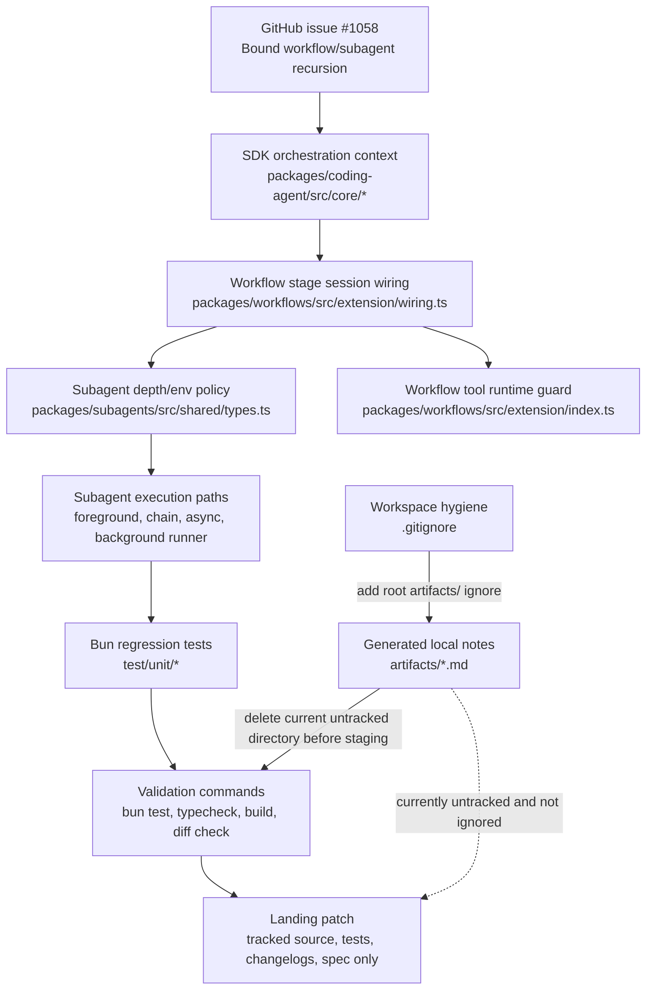

# Atomic Issue #1058 Iteration 5 Technical Design Document / RFC

| Document Metadata      | Details                                                     |
| ---------------------- | ----------------------------------------------------------- |
| Author(s)              | Norin Lavaee                                                |
| Status                 | Draft (WIP) — Iteration 5 reviewer cleanup                  |
| Team / Owner           | Atomic workflows / subagents / coding-agent SDK maintainers |
| Created / Last Updated | 2026-05-27                                                  |

## 1. Executive Summary

GitHub issue [flora131/atomic#1058](https://github.com/flora131/atomic/issues/1058) asks Atomic to prevent recursive orchestration:

- top-level workflows can run normally;
- workflow stages cannot invoke the `workflow` tool;
- workflow stages may invoke `subagent`;
- subagents spawned by workflow stages cannot spawn additional subagents;
- guard failures must include clear messages:
  - `workflows cannot invoke workflows`;
  - `sub-agents inside workflow stages cannot spawn nested sub-agents`.

Current repository evidence shows the functional implementation is in place and validated:

- SDK/session orchestration context exists in `packages/coding-agent/src/core/extensions/types.ts:312-323`, `packages/coding-agent/src/core/sdk.ts:107`, `packages/coding-agent/src/core/agent-session.ts:216,335,370`, and `packages/coding-agent/src/core/extensions/runner.ts:620-622`.
- Workflow stage sessions add workflow-stage context and exclude the `workflow` tool in `packages/workflows/src/extension/wiring.ts:239-260`.
- Workflow tool execution blocks workflow-stage calls through SDK context or `ATOMIC_WORKFLOW_STAGE_SUBAGENT_GUARD=1` in `packages/workflows/src/extension/index.ts:940-972`.
- Subagent depth/env policy is centralized in `packages/subagents/src/shared/types.ts:763-827`.
- Foreground, background, chain, async, and child-process subagent paths propagate `workflowStageSubagentGuard`, including the single clarify-to-background path in `packages/subagents/src/runs/foreground/subagent-executor.ts:1932-2003`.
- The previous iteration’s `mock.module()` test-isolation issue is resolved: `test/unit/subagents-foreground-guard-propagation.test.ts:101-113` now uses scoped `spyOn(...)`, restores spies at `test/unit/subagents-foreground-guard-propagation.test.ts:228-232`, and `rg -n "mock\\.module" test/unit/subagents-foreground-guard-propagation.test.ts` returns no matches.

Iteration 5 should address the only remaining review finding: untracked generated `artifacts/` files are still present and not ignored. Reviewer-a found no functional issues. Reviewer-b’s P3 finding is valid: `git status --short` reports `?? artifacts/`, `git ls-files --others --exclude-standard` lists 11 files under `artifacts/`, and `.gitignore:194-202` ignores `build/`, `.atomic/todos`, and `issues.md` but not root `artifacts/`.

The iteration 5 design is therefore a small repository-hygiene fix: prevent generated review/debug artifacts from being included in the landing patch by adding a root `artifacts/` ignore rule and removing the current untracked `artifacts/` directory from the worktree before staging.

## 2. Context and Motivation

### 2.1 Current State

Issue evidence from:

```sh
gh issue view 1058 --repo flora131/atomic --json number,title,state,body,url,comments
```

confirms the issue is open and requires bounded workflow/subagent recursion, clear failure messages, and reuse or mirroring of existing subagent nesting-depth guardrails.

Current implementation evidence:

- `package.json` declares Bun `1.3.14`, `bun run test:unit`, and `bun run typecheck`.
- `packages/coding-agent/src/core/extensions/types.ts:312-323` defines `WorkflowStageOrchestrationContext`.
- `packages/workflows/src/extension/wiring.ts:239-260` marks workflow stage sessions and appends `"workflow"` to `excludedTools`.
- `packages/workflows/src/extension/index.ts:940-972` blocks workflow tool execution in workflow-stage contexts.
- `packages/subagents/src/shared/types.ts:763-827` defines workflow-stage guard detection, max-depth resolution, workflow-specific error text, and env propagation.
- `packages/subagents/src/runs/foreground/execution.ts:206-212` and `packages/subagents/src/runs/background/subagent-runner.ts:218-229` propagate depth and workflow-stage guard env to child processes.
- `packages/subagents/src/runs/background/async-execution.ts:174-179` still exports the real `writeAsyncRunnerConfig(...)`, which is imported by `test/unit/subagents-async-config.test.ts:5-17`.

Current test evidence from this RFC investigation:

```sh
AGENT=1 bun test test/unit/subagents-foreground-guard-propagation.test.ts test/unit/subagents-async-config.test.ts
# 5 pass, 0 fail

AGENT=1 bun run test:unit
# 1618 pass, 0 fail

bun run typecheck
# exit 0

cd packages/coding-agent && bun run build
# exit 0

git diff --check
# exit 0
```

Current worktree evidence:

```sh
git status --short
# shows ?? artifacts/

git ls-files --others --exclude-standard
# lists 11 files under artifacts/
```

`git check-ignore -v artifacts/analysis-guard-propagation.md` produces no output, confirming these files are not ignored.

### 2.2 The Problem

The functional issue #1058 patch is correct, but the worktree is not clean enough to land safely. The untracked root `artifacts/` directory contains generated iteration/debug notes such as:

- `artifacts/analysis-guard-propagation.md`
- `artifacts/iteration4-final-validation.md`
- `artifacts/iteration4-test-isolation-analysis.md`
- `artifacts/test-patterns-guard-propagation.md`

Because root `artifacts/` is not ignored, a normal `git add .` would stage stale non-product files unrelated to the feature. This directly matches reviewer-b’s P3 finding: generated review artifacts would pollute the patch.

This is not a product behavior issue and should not change the workflow/subagent guard semantics. It is a repository hygiene and rollout issue.

## 3. Goals and Non-Goals

### 3.1 Functional Goals

1. Preserve the issue #1058 behavior already implemented:
   - workflow stages cannot invoke `workflow`;
   - workflow-stage child subagents cannot spawn nested subagents;
   - valid top-level workflows and valid stage-level subagent calls still work.
2. Address reviewer-a explicitly: no additional functional changes are required because reviewer-a reported no findings and validated the patch.
3. Address reviewer-b explicitly: prevent untracked `artifacts/` files from being staged or landed.
4. Add a durable ignore rule for root `artifacts/` near existing workspace-generated ignores in `.gitignore`.
5. Remove the current untracked `artifacts/` directory before staging so `git status --short` no longer shows `?? artifacts/`.
6. Keep the new issue #1058 tests staged/tracked:
   - `test/unit/subagents-depth-guard.test.ts`;
   - `test/unit/subagents-foreground-guard-propagation.test.ts`.
7. Keep changelog entries under `[Unreleased]` in:
   - `packages/coding-agent/CHANGELOG.md`;
   - `packages/subagents/CHANGELOG.md`;
   - `packages/workflows/CHANGELOG.md`.
8. Re-run Bun validation after hygiene cleanup.

### 3.2 Non-Goals (Out of Scope)

1. Do not redesign workflow scheduling, persistence, stage DAG execution, pause/resume, graph rendering, or workflow store schemas.
2. Do not change the accepted workflow/subagent recursion semantics for issue #1058.
3. Do not change default global subagent nesting behavior outside workflow-stage contexts.
4. Do not remove valid workflow-stage `subagent` usage.
5. Do not introduce Jest, Vitest, Node/npm/yarn/pnpm workflows, or any non-Bun test infrastructure.
6. Do not add generated `artifacts/` notes to package changelogs or release notes.
7. Do not use CI/test ordering as a workaround for repository pollution.
8. Do not treat `ATOMIC_WORKFLOW_STAGE_SUBAGENT_GUARD` as a security boundary; it remains an internal orchestration marker.

## 4. Proposed Solution (High-Level Design)

### 4.1 System Architecture Diagram



### 4.2 Architectural Pattern

The issue #1058 implementation uses **policy propagation through typed session context plus child-process environment markers**:

- `orchestrationContext` carries workflow-stage policy inside one Atomic session.
- `excludedTools` hides `workflow` from workflow-stage sessions.
- `ATOMIC_WORKFLOW_STAGE_SUBAGENT_GUARD` carries workflow-stage policy across child-process boundaries.
- `maxSubagentDepth: 1` and `workflowStageSubagentGuard: true` bound workflow-stage subagent fanout.

Iteration 5 does not change this architecture. It adds **repository hygiene as a release gate**:

- generated review/debug files are treated as local artifacts, not source;
- `.gitignore` prevents future accidental staging;
- the current untracked `artifacts/` directory is removed before commit;
- validation confirms tests and typecheck still pass after cleanup.

### 4.3 Key Components

| Component | Responsibility | Technology Stack | Justification |
| --------- | -------------- | ---------------- | ------------- |
| `packages/coding-agent/src/core/extensions/types.ts` | Defines workflow-stage orchestration context | TypeScript SDK types | Typed in-process policy for workflow stages |
| `packages/workflows/src/extension/wiring.ts` | Creates workflow-stage session options and excludes `workflow` | TypeScript, Atomic SDK | First defense against recursive workflow tool access |
| `packages/workflows/src/extension/index.ts` | Blocks workflow tool execution from workflow-stage context/env marker | TypeScript extension tool | Runtime guard for direct and child-process calls |
| `packages/subagents/src/shared/types.ts` | Defines depth env vars, guard env var, max-depth policy, and workflow-specific nested-subagent error | TypeScript pure helpers | Centralizes subagent recursion policy |
| `packages/subagents/src/runs/foreground/subagent-executor.ts` | Routes single, chain, parallel, clarify, foreground, and async subagent paths | TypeScript subagent executor | Main issue #1058 propagation surface |
| `packages/subagents/src/runs/background/async-execution.ts` | Starts async runs and exports `writeAsyncRunnerConfig` | TypeScript background runner | Must remain real for async config permission tests |
| `test/unit/subagents-depth-guard.test.ts` | Tests workflow-stage depth policy and error message | `bun:test` | Direct regression coverage for subagent nesting guard |
| `test/unit/subagents-foreground-guard-propagation.test.ts` | Tests guard propagation through foreground and async paths | `bun:test`, scoped `spyOn` | Covers paths missed by pure helper tests without leaking `mock.module()` |
| `.gitignore` | Defines generated files excluded from Git | Git ignore rules | Must ignore root `artifacts/` to prevent reviewer artifact pollution |
| `artifacts/` | Local generated iteration/debug notes | Markdown scratch files | Should not be staged or landed |

## 5. Detailed Design

### 5.1 API Interfaces

No new public API changes are proposed for iteration 5.

The issue #1058 implementation already introduces the internal orchestration context surface:

```ts
export interface WorkflowStageOrchestrationContext {
  readonly kind: "workflow-stage";
  readonly workflowRunId: string;
  readonly workflowStageId: string;
  readonly workflowStageName: string;
  readonly constraints: {
    readonly disableWorkflowTool: true;
    readonly maxSubagentDepth: 1;
  };
}
```

This is wired through SDK/session/extension interfaces and consumed by workflows and subagents. Iteration 5 only changes repository hygiene:

```gitignore
# Generated workflow/review artifacts
artifacts/
```

The ignore rule should be added near existing generated-workspace ignores in `.gitignore:194-202`.

### 5.2 Data Model / Schema

No persisted runtime schema changes are required.

Existing session/runtime-only fields remain:

- `CreateAgentSessionOptions.orchestrationContext?: OrchestrationContext`
- `AgentSessionConfig.orchestrationContext?: OrchestrationContext`
- `ExtensionContext.orchestrationContext?: OrchestrationContext`

Existing env vars remain:

- `ATOMIC_SUBAGENT_DEPTH`
- `ATOMIC_SUBAGENT_MAX_DEPTH`
- `ATOMIC_WORKFLOW_STAGE_SUBAGENT_GUARD`

Iteration 5 adds no workflow store fields, no async runner config fields, no package manifest fields, and no migration metadata.

Git ignore state changes:

- root `artifacts/` becomes ignored;
- current generated `artifacts/*.md` files are deleted from the working tree or left ignored locally, but they must not appear in the staged patch.

### 5.3 Algorithms and State Management

Production guard algorithm remains unchanged:

1. Workflow stage creation attaches `orchestrationContext.kind = "workflow-stage"` with `constraints.maxSubagentDepth = 1`.
2. Workflow stage session creation appends `"workflow"` to `excludedTools`.
3. Workflow tool execution rejects calls when:
   - `ctx.orchestrationContext?.kind === "workflow-stage"`, or
   - `ATOMIC_WORKFLOW_STAGE_SUBAGENT_GUARD=1`.
4. Subagent execution resolves workflow-stage max depth to `1`.
5. Workflow-stage child subagents receive `workflowStageSubagentGuard: true`.
6. Child process env propagation emits `ATOMIC_WORKFLOW_STAGE_SUBAGENT_GUARD=1`.
7. Nested subagent attempts fail with `sub-agents inside workflow stages cannot spawn nested sub-agents`.

Iteration 5 hygiene algorithm:

1. Confirm `artifacts/` is untracked and not ignored:
   ```sh
   git status --short
   git ls-files --others --exclude-standard
   git check-ignore -v artifacts/analysis-guard-propagation.md || true
   ```
2. Add `artifacts/` to `.gitignore`.
3. Remove the current local `artifacts/` directory:
   ```sh
   rm -rf artifacts
   ```
4. Confirm generated artifacts no longer appear as untracked files:
   ```sh
   git status --short
   git ls-files --others --exclude-standard
   ```
5. Stage only intended source, test, changelog, `.gitignore`, and spec files.
6. Re-run validation.

## 6. Alternatives Considered

| Option | Pros | Cons | Reason for Rejection |
| ------ | ---- | ---- | -------------------- |
| Do nothing with `artifacts/` | No extra work | Reviewer-b finding remains valid; `git add .` can stage stale debug notes | Rejected because it leaves repository pollution risk |
| Delete `artifacts/` only | Smallest worktree change; removes current pollution | Future workflow/debug runs can recreate the same unignored directory | Rejected as incomplete durable hygiene |
| Add `artifacts/` to `.gitignore` only | Prevents accidental staging through normal Git commands | Leaves local generated files in the working tree; reviewers may still see local clutter if using untracked-all commands | Acceptable fallback, but weaker than ignore-plus-delete |
| Add `artifacts/` to `.gitignore` and delete current directory | Fixes current review finding and prevents recurrence | Adds a small repo-wide ignore rule | Preferred: durable, low-risk, and directly addresses reviewer-b |
| Move artifacts into `specs/` or commit them as supporting evidence | Preserves investigation history | Pollutes product history with scratchpad/reviewer notes unrelated to shipped behavior | Rejected; artifacts are not release documentation |
| Add a broad ignore such as `*.md` under root scratch paths | Prevents many accidental notes | Too broad; could hide intended specs/docs | Rejected; use the narrow `artifacts/` rule |

## 7. Cross-Cutting Concerns

### 7.1 Security and Privacy

The issue #1058 guard reduces runaway orchestration risk by bounding recursive workflow and subagent execution.

Iteration 5 has no runtime security impact. It improves repository hygiene by preventing generated debug notes from landing. This also reduces the chance of accidentally committing local validation details, paths, or sensitive scratch content.

The real async config permission test remains important: `test/unit/subagents-async-config.test.ts:5-17` imports `writeAsyncRunnerConfig(...)`, and `packages/subagents/src/runs/background/async-execution.ts:174-179` writes config files with mode `0o600`.

### 7.2 Observability Strategy

No new telemetry or production logging is required.

Observable validation remains test-based:

- workflow recursion errors include `workflows cannot invoke workflows`;
- nested workflow-stage subagent errors include `sub-agents inside workflow stages cannot spawn nested sub-agents`;
- guard propagation is covered by `test/unit/subagents-foreground-guard-propagation.test.ts`;
- hygiene is observable through:
  - `git status --short`;
  - `git ls-files --others --exclude-standard`;
  - `git check-ignore -v artifacts/<file>`;
  - `git diff --check`.

### 7.3 Scalability and Capacity Planning

The production guard remains constant-time context/env checking and reduces worst-case orchestration fanout.

Iteration 5 does not affect runtime capacity. The `.gitignore` addition reduces review and staging overhead by excluding generated local scratch artifacts. Test runtime remains within the observed profile:

- `AGENT=1 bun run test:unit`: 1618 tests in ~4.37s;
- `bun run typecheck`: successful;
- `packages/coding-agent` build: successful.

## 8. Migration, Rollout, and Testing

### 8.1 Deployment Strategy

1. Keep all functional issue #1058 code intact.
2. Add root `artifacts/` to `.gitignore`.
3. Delete the current untracked `artifacts/` directory from the worktree.
4. Ensure newly added regression tests remain included:
   - `test/unit/subagents-depth-guard.test.ts`;
   - `test/unit/subagents-foreground-guard-propagation.test.ts`.
5. Stage only intended files:
   - package changelogs;
   - SDK/session orchestration context files;
   - workflow guard/wiring files;
   - subagent depth/execution files;
   - unit tests;
   - `.gitignore`;
   - this RFC/spec file if the workflow requires committing specs.
6. Confirm no `artifacts/` entries are staged:
   ```sh
   git diff --cached --name-only | rg '^artifacts/' && exit 1 || true
   ```

### 8.2 Data Migration Plan

No data migration is required.

Existing workflow runs, session files, async runner config files, subagent artifacts, and status directories remain compatible. The root `artifacts/` directory in this worktree is local scratch output, not persisted product data.

### 8.3 Test Plan

Run the following after hygiene cleanup:

```sh
AGENT=1 bun test \
  test/unit/subagents-depth-guard.test.ts \
  test/unit/subagents-foreground-guard-propagation.test.ts \
  test/unit/slash-dispatch.test.ts \
  test/unit/wiring-adapters.test.ts
```

```sh
AGENT=1 bun test \
  test/unit/subagents-foreground-guard-propagation.test.ts \
  test/unit/subagents-async-config.test.ts
```

```sh
AGENT=1 bun run test:unit
```

```sh
bun run typecheck
```

```sh
cd packages/coding-agent && bun run build
```

```sh
git diff --check
git status --short
git ls-files --others --exclude-standard
git diff --cached --name-only | rg '^artifacts/' && exit 1 || true
```

Acceptance criteria for iteration 5:

- all Bun tests/typecheck/build commands pass;
- `git status --short` does not show `?? artifacts/`;
- `git diff --cached --name-only` contains no `artifacts/` paths;
- `.gitignore` includes a narrow root `artifacts/` ignore rule;
- issue #1058 tests and changelogs remain present.

## 9. Open Questions / Unresolved Issues

1. Should root `artifacts/` be a permanent ignored workspace convention for all future workflow/review runs, or should generated agent artifacts be redirected under an already ignored Atomic-specific directory? `[OWNER: repository maintainers]`

2. Should the workflow runner or subagent harness default generated review notes to `.atomic/` or another ignored path to avoid requiring repo-specific `artifacts/` rules? `[OWNER: subagents/workflows maintainers]`

3. Should CI include a guard that fails when staged files include root `artifacts/` paths? `[OWNER: CI maintainers]`

4. Should future issue workflow specs be committed under `specs/` or treated as local planning artifacts unless explicitly requested? `[OWNER: product/engineering leads]`

5. Should `createSubagentExecutor(...)` eventually grow explicit dependency injection seams for execution functions so new tests do not need `spyOn(...)` against module exports? `[OWNER: subagents maintainers]`
