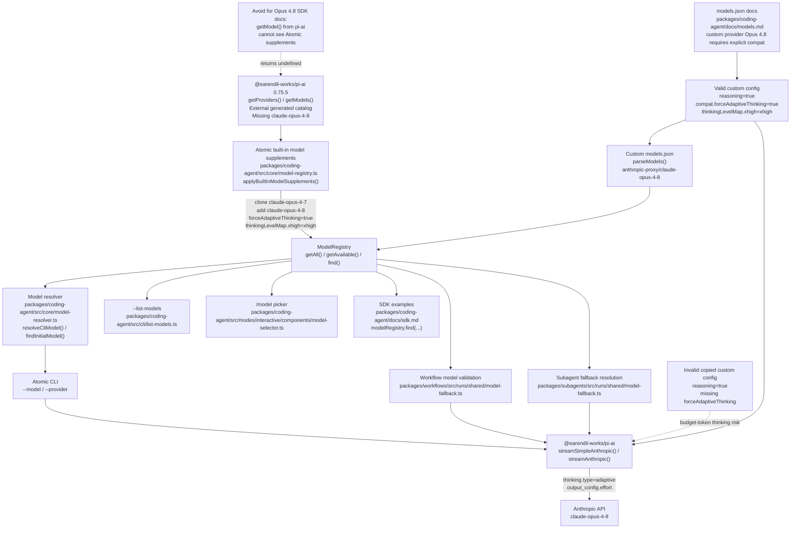

# Atomic Claude Opus 4.8 Support Technical Design Document / RFC

| Document Metadata      | Details                                                                                  |
| ---------------------- | ---------------------------------------------------------------------------------------- |
| Author(s)              | Alex Lavaee                                                                              |
| Status                 | In Review (RFC)                                                                          |
| Team / Owner           | Atomic maintainers / `@bastani/atomic`, `@bastani/workflows`, `@bastani/subagents`       |
| Created / Last Updated | 2026-05-28 / 2026-05-28                                                                  |

## 1. Executive Summary

Implement GitHub issue [flora131/atomic#1097](https://github.com/flora131/atomic/issues/1097) by adding first-class Anthropic Claude Opus 4.8 support to Atomic’s model registry, model resolution, workflow validation, subagent fallback chains, and user-facing documentation.

The intended upstream behavior is informed by [earendil-works/pi#3284](https://github.com/earendil-works/pi/pull/3284), which fixes Anthropic adaptive-thinking detection for newer Claude Opus/Sonnet 4.x models. Atomic cannot directly port that exact patch into `packages/ai/src/providers/anthropic.ts` because this monorepo consumes provider streaming from `@earendil-works/pi-ai` (`packages/coding-agent/package.json` depends on `@earendil-works/pi-ai@^0.75.5`). In this pinned dependency, the Anthropic provider chooses adaptive thinking based on model metadata, specifically `model.compat?.forceAdaptiveThinking === true`, rather than the upstream regex from PR #3284.

The Atomic implementation should therefore:

1. Add a runtime model-registry supplement for `anthropic/claude-opus-4-8` by cloning `anthropic/claude-opus-4-7` metadata in `packages/coding-agent/src/core/model-registry.ts`.
2. Preserve adaptive-thinking behavior through `compat.forceAdaptiveThinking: true` and `thinkingLevelMap.xhigh: "xhigh"` so `@earendil-works/pi-ai` sends Anthropic adaptive-thinking payloads instead of budget-token thinking.
3. Make Anthropic’s default model `claude-opus-4-8` in `packages/coding-agent/src/core/model-resolver.ts`.
4. Keep workflow and subagent fallback chains provider-specific: prefer Anthropic Opus 4.8 where the chain means “latest Anthropic Opus,” while retaining existing GitHub Copilot `claude-opus-4.7` fallbacks until Copilot Opus 4.8 support is confirmed.
5. Update SDK and model-configuration docs so user examples resolve Opus 4.8 through Atomic’s `ModelRegistry` and include required adaptive-thinking metadata for custom Anthropic-compatible providers.
6. Add focused tests for registry supplementation, CLI model resolution, workflow validation, subagent fallback normalization, and documentation regressions.
7. Validate with Bun-only commands per `AGENTS.md`.

Iteration 3 explicitly addresses the supplied prior review findings:

- **reviewer-a:** The provided finding excerpt points at `ModelRegistry.loadBuiltInModels(...)` in `packages/coding-agent/src/core/model-registry.ts`. No textual defect was included. Repository inspection confirms the intended architecture: `applyBuiltInModelSupplements(...)` runs before provider/model overrides, allowing user overrides to apply after the Opus 4.8 supplement. This ordering remains part of the design and should be preserved.
- **reviewer-b:** `packages/coding-agent/docs/models.md` changed an Anthropic-compatible custom-provider example to `claude-opus-4-8` without adding `compat.forceAdaptiveThinking` or `thinkingLevelMap.xhigh`. That example defines a custom provider/model through `parseModels(...)`, so it does **not** inherit the built-in `anthropic/claude-opus-4-8` supplement metadata. Users copying it would send budget-based thinking for Opus 4.8 under the default `medium` thinking level. Iteration 3 must fix this documentation example or avoid using Opus 4.8 in that custom-model snippet. The preferred fix is to keep Opus 4.8 and add the required metadata.

## 2. Context and Motivation

### 2.1 Current State

Investigation was performed in the issue worktree `/home/alexlavaee/Documents/projects/github_work/atomic-1097`. Repository metadata gathered during this RFC pass:

- `git config user.name`: `Alex Lavaee`
- `date '+%Y-%m-%d'`: `2026-05-28`
- `git status --short` shows candidate changes in `packages/coding-agent`, `packages/workflows`, `packages/subagents`, root unit tests, and the untracked RFC/spec file.
- The main checkout must remain untouched; all work belongs in the issue worktree.

Relevant current architecture and evidence:

- `packages/coding-agent/package.json` depends on:
  - `@earendil-works/pi-agent-core`
  - `@earendil-works/pi-ai`
  - `@earendil-works/pi-tui`
  at `^0.75.5`.
- `@earendil-works/pi-ai` currently does not expose Opus 4.8 through its generated catalog:
  ```sh
  bun -e 'import { getModel } from "@earendil-works/pi-ai"; console.log(getModel("anthropic", "claude-opus-4-8") ? "pi-ai-found" : "pi-ai-missing")'
  # pi-ai-missing
  ```
- The Atomic registry supplement in the candidate worktree does resolve Opus 4.8:
  ```sh
  bun -e 'import { AuthStorage, ModelRegistry } from "./packages/coding-agent/src/index.ts"; const r = ModelRegistry.inMemory(AuthStorage.inMemory()); const m = r.find("anthropic", "claude-opus-4-8"); console.log(m ? `${m.provider}/${m.id} ${m.name} adaptive=${m.compat?.forceAdaptiveThinking ?? false} xhigh=${m.thinkingLevelMap?.xhigh ?? "none"}` : "missing")'
  # anthropic/claude-opus-4-8 Claude Opus 4.8 adaptive=true xhigh=xhigh
  ```

Core files and symbols:

- `packages/coding-agent/src/core/model-registry.ts`
  - Defines `AnthropicMessagesCompatSchema.forceAdaptiveThinking`.
  - Defines `ModelDefinitionSchema.thinkingLevelMap` and `ModelOverrideSchema.thinkingLevelMap`.
  - Candidate implementation defines:
    - `ANTHROPIC_OPUS_4_7_MODEL_ID = "claude-opus-4-7"`
    - `ANTHROPIC_OPUS_4_8_MODEL_ID = "claude-opus-4-8"`
    - `BUILT_IN_MODEL_SUPPLEMENTS`
    - `applyBuiltInModelSupplements(...)`
  - `ModelRegistry.loadBuiltInModels(...)` currently calls `applyBuiltInModelSupplements(...)` before provider-level and per-model overrides.
  - `ModelRegistry.mergeCustomModels(...)` merges custom models after built-ins, with custom provider+id entries winning conflicts.
  - `parseModels(...)` constructs custom provider models from `models.json`; custom providers do not inherit built-in Anthropic supplement metadata.

- `packages/coding-agent/src/core/model-resolver.ts`
  - Candidate implementation sets `defaultModelPerProvider.anthropic = "claude-opus-4-8"`.
  - `resolveCliModel(...)`, `parseModelPattern(...)`, and `findInitialModel(...)` consume `ModelRegistry.getAll()` and can resolve provider-qualified models and thinking suffixes such as `anthropic/claude-opus-4-8:xhigh`.

- Listing and UI surfaces:
  - `packages/coding-agent/src/cli/list-models.ts` lists `modelRegistry.getAvailable()`.
  - `packages/coding-agent/src/modes/interactive/components/model-selector.ts` uses registry-backed availability for `/model`.
  - These surfaces will display Opus 4.8 if it is present in `ModelRegistry`.

- Workflow and subagent fallback:
  - `packages/workflows/src/runs/shared/model-fallback.ts`
    - `buildModelCandidates(...)`
    - `buildModelCandidateIds(...)`
    - `validateWorkflowModels(...)`
    - `WorkflowModelValidationError`
  - `packages/subagents/src/runs/shared/model-fallback.ts`
    - `resolveModelCandidate(...)`
    - `buildModelCandidates(...)`
    - `currentModelFullId(...)`
  - Candidate tests already include Opus 4.8 in:
    - `test/unit/model-fallback.test.ts`
    - `test/unit/subagents-model-fallback.test.ts`

- SDK docs:
  - `packages/coding-agent/docs/sdk.md` currently uses `ModelRegistry.find("anthropic", "claude-opus-4-8")` at the inspected model examples, which is correct because Atomic supplements are only visible through `ModelRegistry`.
  - The prior SDK-docs problem from iteration 2 is therefore resolved in the current worktree and should be protected from regression.

- Model configuration docs:
  - `packages/coding-agent/docs/models.md` contains an “Anthropic Messages Compatibility” custom-provider example using:
    ```json
    {
      "id": "claude-opus-4-8",
      "reasoning": true,
      "input": ["text", "image"]
    }
    ```
  - This is currently incorrect for a custom `anthropic-messages` provider because it omits `compat.forceAdaptiveThinking` and `thinkingLevelMap.xhigh`.
  - `parseModels(...)` only merges `providerConfig.compat` and `modelDef.compat` from the custom config; it does not apply `BUILT_IN_MODEL_SUPPLEMENTS` to custom providers such as `anthropic-proxy`.

Upstream reference:

- PR [earendil-works/pi#3284](https://github.com/earendil-works/pi/pull/3284) changed upstream Pi’s Anthropic provider to classify Opus/Sonnet 4.x minor versions `>= 6` as adaptive-thinking capable.
- Upstream accepted examples include `opus-4-6`, `opus-4.6`, `opus-4-7`, `sonnet-4-6`, `sonnet-4.7`, and `sonnet-4-10`.
- Upstream rejected examples include `opus-4-5`, `sonnet-4-3`, and `haiku-4-6`.
- Atomic’s equivalent behavior is metadata-driven in the pinned `@earendil-works/pi-ai`: adaptive models use `thinking: { type: "adaptive" }` and `output_config.effort`; non-adaptive reasoning models use budget-token thinking.

### 2.2 The Problem

Atomic’s pinned external model catalog includes `claude-opus-4-7` but not `claude-opus-4-8`. Without an Atomic-owned supplement:

- `--model anthropic/claude-opus-4-8` is not a first-class registry-backed model.
- Bare model resolution such as `--model claude-opus-4-8` cannot be reliable.
- `/model` and `--list-models` cannot display Opus 4.8 because both depend on `ModelRegistry.getAvailable()`.
- Workflow validation rejects `anthropic/claude-opus-4-8` when the catalog is available and missing that ID.
- Subagent fallback normalization cannot turn bare `claude-opus-4-8` into `anthropic/claude-opus-4-8`.
- Builtin workflow/subagent fallback chains still prefer Opus 4.7 when they intend to target the latest Anthropic Opus.
- If Opus 4.8 is added without adaptive-thinking metadata, the Anthropic provider can take the budget-based thinking path that upstream PR #3284 was designed to avoid.

Iteration 3 adds one specific documentation correctness problem:

- The custom Anthropic-compatible provider example in `packages/coding-agent/docs/models.md` uses Opus 4.8 but lacks `compat.forceAdaptiveThinking: true`.
- It also lacks `thinkingLevelMap: { "xhigh": "xhigh" }`, so copied configs do not preserve Opus-specific `xhigh` effort behavior.
- Because this is a custom provider (`anthropic-proxy`) rather than the built-in `anthropic` provider, the built-in supplement for `anthropic/claude-opus-4-8` does not apply.
- Users copying the example can create invalid Opus 4.8 runtime requests when reasoning is enabled.

## 3. Goals and Non-Goals

### 3.1 Functional Goals

1. Add first-class Anthropic Opus 4.8 support using canonical model ID `claude-opus-4-8` and full reference `anthropic/claude-opus-4-8`.
2. Expose Opus 4.8 through:
   - `ModelRegistry.getAll()`
   - `ModelRegistry.getAvailable()`
   - `ModelRegistry.find()`
   - `/model`
   - `--list-models`
3. Preserve upstream PR #3284’s adaptive-thinking intent by ensuring built-in Opus 4.8 has:
   - `reasoning: true`
   - `compat.forceAdaptiveThinking: true`
   - `thinkingLevelMap.xhigh: "xhigh"`
4. Keep the supplement idempotent: if a future `@earendil-works/pi-ai` catalog ships `claude-opus-4-8`, Atomic should not duplicate or override that upstream model.
5. Update `defaultModelPerProvider.anthropic` to `claude-opus-4-8`.
6. Ensure CLI model resolution accepts:
   - `--model anthropic/claude-opus-4-8`
   - `--provider anthropic --model claude-opus-4-8`
   - `--model anthropic/claude-opus-4-8:xhigh`
   - bare `claude-opus-4-8` when resolver semantics make it unambiguous.
7. Ensure workflow model validation accepts `anthropic/claude-opus-4-8` when it is present in the model catalog.
8. Ensure subagent fallback resolution can normalize bare `claude-opus-4-8` to `anthropic/claude-opus-4-8` when Anthropic is preferred or unambiguous.
9. Update Atomic-owned bundled workflow/subagent latest-Opus fallback chains where maintainers intend to prefer the latest Anthropic Opus.
10. Update documentation and changelogs that list or recommend current Claude Opus models.
11. Keep SDK examples using `ModelRegistry.find(...)` for Opus 4.8 rather than `getModel(...)` from `@earendil-works/pi-ai`.
12. Fix the `packages/coding-agent/docs/models.md` Anthropic-compatible custom-provider example by either:
    - adding model-level `compat.forceAdaptiveThinking: true` and `thinkingLevelMap.xhigh: "xhigh"` to the Opus 4.8 custom model, or
    - reverting that example to a model that does not require adaptive-thinking metadata.
13. Document `forceAdaptiveThinking` in the Anthropic compatibility field table so users understand why the Opus 4.8 custom-provider example needs it.
14. Add focused tests and documentation checks before/with implementation, then validate with Bun-based commands.

### 3.2 Non-Goals (Out of Scope)

- Do not publish a release, create a tag, or run the release workflow in this iteration.
- Do not edit generated files in `node_modules` or vendor/fork `@earendil-works/pi-ai`.
- Do not introduce a build step, `dist/`, `outDir`, or bundling for raw TypeScript companion packages such as `packages/workflows`.
- Do not broadly rewrite model resolution, auth storage, provider SDK integrations, workflow execution, or subagent orchestration.
- Do not invent unverified Opus 4.8 IDs for providers whose public naming is not confirmed, especially Bedrock, GitHub Copilot, Cloudflare AI Gateway, Vercel AI Gateway, and OpenRouter variants.
- Do not remove existing Opus 4.7 support or existing Copilot Opus 4.7 fallbacks.
- Do not add new telemetry, databases, settings schemas, or persistence migrations.
- Do not use Node/npm/npx/yarn/pnpm development commands; use Bun per `AGENTS.md`.
- Do not make custom provider configs automatically infer adaptive-thinking support from model ID in this iteration; require explicit metadata in docs/config examples unless the model is a built-in registry supplement.

## 4. Proposed Solution (High-Level Design)

Use Atomic’s `ModelRegistry` as the authoritative facade for model availability. Add an Atomic-owned built-in model supplement layer that augments `@earendil-works/pi-ai` generated catalogs at registry load time.

The supplement layer should:

1. Run inside `ModelRegistry.loadBuiltInModels(...)`, before provider-level overrides and per-model overrides.
2. For each configured supplement:
   - Skip if the target model already exists.
   - Find a known base model, currently `anthropic/claude-opus-4-7`.
   - Clone the base model.
   - Override only the target model ID, model name, reasoning flag, and required compatibility metadata.
   - Preserve inherited cost/context/input/max-token metadata until official upstream metadata exists.
3. Apply provider-level and per-model overrides after supplementing so user `models.json` can still route Opus 4.8 through proxies or customize metadata.
4. Merge custom user models afterward so a custom `anthropic/claude-opus-4-8` definition still wins on provider+id conflict.

Documentation must distinguish two lookup/configuration paths:

- **Built-in Anthropic provider:** `anthropic/claude-opus-4-8` is supplied by `ModelRegistry` and carries the Atomic supplement metadata.
- **Custom Anthropic-compatible providers:** Opus 4.8 must include explicit custom-model metadata because `parseModels(...)` builds a new model for the custom provider and does not apply the built-in `anthropic` supplement.

For `packages/coding-agent/docs/models.md`, keep the custom-provider Opus 4.8 example only if it includes:

```json
{
  "id": "claude-opus-4-8",
  "reasoning": true,
  "thinkingLevelMap": {
    "xhigh": "xhigh"
  },
  "input": ["text", "image"],
  "compat": {
    "forceAdaptiveThinking": true
  }
}
```

Provider-level compatibility fields such as `supportsEagerToolInputStreaming` and `supportsLongCacheRetention` may remain at provider level. `forceAdaptiveThinking` should be model-level in the example because adaptive-thinking behavior is model-specific.

### 4.1 System Architecture Diagram



### 4.2 Architectural Pattern

Use an Adapter/Facade pattern:

- **Adapter:** Atomic adapts the external pi-ai model catalog by adding missing Atomic-required built-in models at runtime.
- **Facade:** `ModelRegistry` remains the authoritative model catalog consumed by CLI, TUI, workflows, subagents, SDK sessions, and extensions.
- **Forward-compatible shim:** The supplement is idempotent and becomes a no-op when the upstream pi-ai catalog eventually includes Opus 4.8.
- **Explicit custom-provider metadata:** Custom provider docs/configs remain explicit rather than relying on hidden inference. This keeps `models.json` behavior predictable and avoids guessing provider support from arbitrary model IDs.

This avoids scattering hardcoded Opus 4.8 exceptions across CLI parsing, workflow validation, subagent configs, and documentation. It also aligns with existing separation of concerns: external provider streaming remains in `@earendil-works/pi-ai`, while Atomic-owned model availability and custom model merging remain in `ModelRegistry`.

### 4.3 Key Components

| Component | Responsibility | Technology Stack | Justification |
| --------- | -------------- | ---------------- | ------------- |
| `packages/coding-agent/src/core/model-registry.ts` | Load built-in/custom models, apply overrides, expose registry APIs, resolve auth and headers. | TypeScript, TypeBox, `@earendil-works/pi-ai` | Central model facade already consumed by CLI, TUI, SDK, workflows, and extensions. |
| `BUILT_IN_MODEL_SUPPLEMENTS` / `applyBuiltInModelSupplements(...)` | Add missing built-in entries such as `anthropic/claude-opus-4-8` by cloning known base metadata. | TypeScript | Keeps supplement logic centralized, idempotent, and removable after upstream support. |
| `parseModels(...)` in `model-registry.ts` | Build custom provider models from `models.json`. | TypeScript | Explains why custom providers must explicitly include Opus 4.8 adaptive-thinking metadata. |
| `packages/coding-agent/src/core/model-resolver.ts` | Resolve CLI model references, thinking suffixes, provider defaults, and initial model selection. | TypeScript | Needs Anthropic default update and resolver coverage for `claude-opus-4-8:xhigh`. |
| `packages/coding-agent/src/cli/list-models.ts` | Display available models. | TypeScript CLI | Automatically benefits from registry supplement via `getAvailable()`. |
| `packages/coding-agent/src/modes/interactive/components/model-selector.ts` | Interactive `/model` picker. | TypeScript, TUI components | Automatically benefits from registry supplement via `getAvailable()`. |
| `packages/workflows/src/runs/shared/model-fallback.ts` | Validate and build workflow model candidates. | Raw TypeScript, Bun tests | Must accept Opus 4.8 once exposed by the model catalog. |
| `packages/subagents/src/runs/shared/model-fallback.ts` | Normalize subagent primary/fallback/current model candidates. | Raw TypeScript, Bun tests | Must normalize bare Opus 4.8 against available model info. |
| Bundled workflow/subagent definitions | Configure default model/fallback chains. | TypeScript workflow definitions, Markdown frontmatter | Hardcoded latest-Opus references should move to Anthropic Opus 4.8 while retaining Copilot Opus 4.7 fallbacks. |
| `packages/coding-agent/docs/sdk.md` | Show SDK consumers how to select models. | Markdown | Must use `ModelRegistry.find(...)` for Atomic-supplemented models; external `getModel(...)` is insufficient. |
| `packages/coding-agent/docs/models.md` | Show `models.json` custom provider configuration. | Markdown | Must not publish a custom Opus 4.8 example that lacks `forceAdaptiveThinking` and `thinkingLevelMap`. |
| Changelogs | Communicate model support and fallback-chain updates. | Markdown | Required by repo changelog policy for packages with user-visible changes. |

## 5. Detailed Design

### 5.1 API Interfaces

No new public CLI flags, SDK methods, tool schemas, or config file formats are required.

The primary supported built-in user-facing identifier is:

| Provider | Model ID | Full reference | Support mechanism |
| -------- | -------- | -------------- | ----------------- |
| `anthropic` | `claude-opus-4-8` | `anthropic/claude-opus-4-8` | Atomic `ModelRegistry` supplement cloned from `claude-opus-4-7`. |

Internal supplement shape should remain private to `model-registry.ts` unless it grows beyond one or two entries:

```ts
interface BuiltInModelSupplement {
  provider: KnownProvider;
  baseModelId: string;
  targetModelId: string;
  targetName: string;
  reasoning: boolean;
  compat?: ModelOverride["compat"];
  thinkingLevelMap: NonNullable<Model<Api>["thinkingLevelMap"]>;
}
```

Required Anthropic supplement:

```ts
{
  provider: "anthropic",
  baseModelId: "claude-opus-4-7",
  targetModelId: "claude-opus-4-8",
  targetName: "Claude Opus 4.8",
  reasoning: true,
  compat: { forceAdaptiveThinking: true },
  thinkingLevelMap: { xhigh: "xhigh" },
}
```

SDK documentation should continue to use:

```ts
import { AuthStorage, ModelRegistry } from "@bastani/atomic";

const authStorage = AuthStorage.create();
const modelRegistry = ModelRegistry.create(authStorage);

const opus = modelRegistry.find("anthropic", "claude-opus-4-8");
if (!opus) throw new Error("Model not found");
```

SDK documentation must not reintroduce:

```ts
import { getModel } from "@earendil-works/pi-ai";

const opus = getModel("anthropic", "claude-opus-4-8"); // returns undefined with pi-ai 0.75.5
```

For `models.json`, custom Anthropic-compatible providers that use Opus 4.8 should document an explicit model definition:

```json
{
  "providers": {
    "anthropic-proxy": {
      "baseUrl": "https://proxy.example.com",
      "api": "anthropic-messages",
      "apiKey": "ANTHROPIC_PROXY_KEY",
      "compat": {
        "supportsEagerToolInputStreaming": false,
        "supportsLongCacheRetention": true
      },
      "models": [
        {
          "id": "claude-opus-4-8",
          "reasoning": true,
          "thinkingLevelMap": {
            "xhigh": "xhigh"
          },
          "input": ["text", "image"],
          "compat": {
            "forceAdaptiveThinking": true
          }
        }
      ]
    }
  }
}
```

### 5.2 Data Model / Schema

No persistent data migration or schema migration is required.

Atomic already supports the relevant schema fields in `packages/coding-agent/src/core/model-registry.ts`:

- `ModelDefinitionSchema.thinkingLevelMap`
- `ModelDefinitionSchema.compat`
- `ModelOverrideSchema.thinkingLevelMap`
- `ModelOverrideSchema.compat`
- `AnthropicMessagesCompatSchema.forceAdaptiveThinking`

Supplemented built-in Opus 4.8 should inherit these fields from Opus 4.7 unless official upstream metadata differs:

- `api`
- `provider`
- `baseUrl`
- `input`
- `cost`
- `contextWindow`
- `maxTokens`
- existing compatibility fields

Supplemented built-in Opus 4.8 must explicitly set or preserve:

- `id: "claude-opus-4-8"`
- `name: "Claude Opus 4.8"`
- `reasoning: true`
- `compat.forceAdaptiveThinking: true`
- `thinkingLevelMap.xhigh: "xhigh"`

Custom model docs must make clear that custom `models.json` entries do not inherit built-in supplements. For custom Anthropic-compatible Opus 4.8 models, users must provide:

- `reasoning: true`
- `compat.forceAdaptiveThinking: true`
- `thinkingLevelMap.xhigh: "xhigh"` when they want `xhigh` to map to Anthropic’s Opus-compatible effort value.

The built-in supplement must be idempotent by provider+id. If `getModels("anthropic")` later includes `claude-opus-4-8`, Atomic should skip the supplement rather than replacing upstream metadata.

### 5.3 Algorithms and State Management

Built-in model load algorithm:

1. `ModelRegistry.loadModels()` loads custom model config and overrides from configured `models.json` paths.
2. `ModelRegistry.loadBuiltInModels(...)` iterates providers from `getProviders()`.
3. For each provider, read external built-in models from `getModels(provider as KnownProvider)`.
4. Call `applyBuiltInModelSupplements(provider, models)`:
   - Ignore supplements for other providers.
   - Skip if `targetModelId` already exists.
   - Find `baseModelId`.
   - If the base model is absent, skip rather than fabricating incomplete metadata.
   - Clone the base model and merge supplement metadata.
5. Apply provider-level `baseUrl` and `compat` overrides to all built-ins, including supplements.
6. Apply per-model overrides to all built-ins, including supplements.
7. Merge custom user models after built-ins so custom provider+id entries win.

Custom model load algorithm:

1. `parseModels(...)` iterates configured providers in `models.json`.
2. For each custom model:
   - Resolve `api`, `baseUrl`, `reasoning`, `thinkingLevelMap`, and `compat` from provider/model configuration.
   - Merge `providerConfig.compat` with `modelDef.compat`.
   - Do **not** apply built-in model supplements.
3. Therefore a custom `anthropic-proxy` model with ID `claude-opus-4-8` only gets `forceAdaptiveThinking` if the config explicitly supplies it.

CLI resolution after supplementation:

1. `resolveCliModel(...)` reads `modelRegistry.getAll()`.
2. `anthropic/claude-opus-4-8` resolves as an exact provider-qualified model.
3. `claude-opus-4-8` resolves as a bare ID if unambiguous.
4. `anthropic/claude-opus-4-8:xhigh` is parsed via `parseModelPattern(...)`, preserving `thinkingLevel: "xhigh"`.
5. Existing fallback cloning for unknown provider-qualified IDs remains a fallback path, not the primary Opus 4.8 support mechanism.

Workflow/subagent behavior:

- Workflows accept Opus 4.8 through the model catalog passed into `validateWorkflowModels(...)`.
- Subagents normalize bare `claude-opus-4-8` through `resolveModelCandidate(...)` when available model info includes `anthropic/claude-opus-4-8`.
- Builtin latest-Opus fallback chains should prefer `anthropic/claude-opus-4-8` and retain `github-copilot/claude-opus-4.7` because Copilot Opus 4.8 support is not confirmed.

Adaptive-thinking behavior:

- `@earendil-works/pi-ai` checks `model.compat?.forceAdaptiveThinking === true` in `streamSimpleAnthropic(...)`.
- For adaptive models, it maps the requested thinking level to an `effort` value using `model.thinkingLevelMap` when present.
- In `buildParams(...)`, adaptive models emit `params.thinking = { type: "adaptive", display }` and set `params.output_config.effort`.
- If `forceAdaptiveThinking` is absent, reasoning-enabled Anthropic models can fall back to `thinking: { type: "enabled", budget_tokens: ... }`, which is the class of request PR #3284 intended to avoid for newer Opus/Sonnet models.

Documentation state management:

- `packages/coding-agent/docs/sdk.md` should keep using `ModelRegistry.find(...)`.
- `packages/coding-agent/docs/models.md` must either include complete adaptive metadata in the Opus 4.8 custom-provider example or avoid Opus 4.8 there.
- Add a short compatibility table row for `forceAdaptiveThinking` to prevent future drift.

## 6. Alternatives Considered

| Option | Pros | Cons | Reason for Rejection |
| ------ | ---- | ---- | -------------------- |
| Wait for a future `@earendil-works/pi-ai` release containing Opus 4.8 | Least local code; upstream owns official metadata | Current pinned package `0.75.5` does not include Opus 4.8; issue remains unresolved | Rejected because Atomic needs timely first-class support. |
| Patch `node_modules/@earendil-works/pi-ai` or generated package artifacts | Quick local proof of concept | Not source-controlled, not reproducible, lost on install, violates maintainability expectations | Rejected because changes must be durable source changes in the monorepo. |
| Add ad hoc Opus 4.8 special cases in CLI, workflow, and subagent validators | Small targeted patches per surface | Duplicates model logic; still fails `/model`, `--list-models`, SDK registry lookup, and docs consistency | Rejected because `ModelRegistry` is the existing model facade. |
| Rely only on provider-qualified unknown-model fallback in `resolveCliModel(...)` | Minimal implementation | Does not support bare model IDs, registry discovery, picker/listing, workflow validation, or SDK docs | Rejected because it fails issue acceptance criteria. |
| Auto-generate all future `claude-opus-4-x` IDs with a regex | Mirrors upstream PR’s generalized version detection | Risks exposing unsupported/incorrect models, costs, context windows, and provider-specific names | Rejected in favor of explicit supplements plus idempotency. |
| Vendor/fork `@earendil-works/pi-ai` into Atomic | Full control over provider internals and generated catalogs | Large maintenance burden and divergence from upstream pi package layout | Rejected as disproportionate for one model catalog gap. |
| Keep SDK docs using `getModel(...)` and rely on a future pi-ai update | Simpler docs | Currently wrong; `getModel("anthropic", "claude-opus-4-8")` returns `undefined` | Rejected. Current docs correctly use `ModelRegistry.find(...)`; preserve this. |
| Keep `docs/models.md` custom-provider example on Opus 4.8 without adaptive metadata | Shortest docs diff | Produces invalid or fragile copied configs for reasoning-enabled Opus 4.8 custom providers | Rejected by reviewer-b. Add `forceAdaptiveThinking`/`thinkingLevelMap` or revert the example model ID. |
| Revert the `docs/models.md` custom-provider example back to Opus 4.7 | Avoids documenting Opus 4.8 custom-provider adaptive metadata | Misses an opportunity to teach the correct Opus 4.8 custom-provider config; less aligned with issue #1097 docs goal | Acceptable fallback, but not preferred. Preferred fix is to keep Opus 4.8 with complete metadata. |
| Infer `forceAdaptiveThinking` automatically in `parseModels(...)` for custom Opus/Sonnet 4.6+ IDs | Reduces config burden; closer to upstream PR regex behavior | Hidden behavior for custom providers, potential false positives, and broader code risk late in iteration | Deferred. Document explicit metadata for this issue. |

## 7. Cross-Cutting Concerns

### 7.1 Security and Privacy

No new credentials, auth scopes, storage files, or request headers are introduced. Opus 4.8 uses the same Anthropic authentication path as existing Anthropic models:

- `AuthStorage` remains responsible for API keys/OAuth tokens.
- `ModelRegistry.getApiKeyAndHeaders(...)` remains the request-auth resolution path.
- Provider-level `baseUrl`, `headers`, and `compat` overrides continue to apply uniformly.

Privacy considerations:

- Updating builtin workflow/subagent fallback chains may route prompts to Anthropic Opus 4.8 where previous chains routed to Anthropic Opus 4.7, but this stays within existing explicit provider fallback behavior.
- Existing GitHub Copilot Opus 4.7 fallbacks should be retained rather than replaced with unconfirmed Copilot Opus 4.8 IDs.
- Custom-provider docs should clearly show that users control proxy `baseUrl` and `apiKey`; no new data leaves Atomic outside existing model/provider selection behavior.
- No new telemetry should be added for Opus 4.8 selection.

### 7.2 Observability Strategy

Use existing observability surfaces:

- CLI resolver errors and warnings identify provider/model references.
- `--list-models` displays registry-backed model availability, reasoning, image support, context, and output metadata.
- Workflow validation errors already report unavailable or ambiguous model IDs via `WorkflowModelValidationError`.
- Subagent fallback notes already show attempted model candidates and retry notes where applicable.
- Docs validation (`bun --cwd packages/coding-agent run docs:check`) catches broken links, while targeted grep/script checks catch Opus 4.8 documentation regressions.

No new metrics or logs are required. Validation should focus on tests and command output confirming that Opus 4.8 resolves through `ModelRegistry` and that docs no longer publish invalid Opus 4.8 examples.

### 7.3 Scalability and Capacity Planning

The supplement list is tiny and processed during registry loading/refresh. Complexity remains linear in provider model count. There is no request fanout, persistent background task, database migration, or cache invalidation change.

Capacity considerations are metadata correctness concerns:

- Until official upstream metadata is available, Opus 4.8 should inherit Opus 4.7 cost/context/max-token metadata.
- If official Anthropic metadata differs, update the supplement and tests in a follow-up.
- The idempotent skip behavior limits long-term maintenance cost when upstream pi-ai eventually ships Opus 4.8.
- Custom-provider docs should avoid suggesting that every Anthropic-compatible backend supports Opus 4.8; examples should be framed as proxy configuration for backends that actually expose that model ID.

## 8. Migration, Rollout, and Testing

### 8.1 Deployment Strategy

This is a source-level package update shipped with the next Atomic release from the issue worktree. The main checkout must remain untouched.

Recommended rollout for iteration 3:

1. Keep the Atomic model-registry supplement in `packages/coding-agent/src/core/model-registry.ts`.
2. Keep `defaultModelPerProvider.anthropic = "claude-opus-4-8"` in `packages/coding-agent/src/core/model-resolver.ts`.
3. Keep focused tests in:
   - `packages/coding-agent/test/model-registry.test.ts`
   - `packages/coding-agent/test/model-resolver.test.ts`
   - `test/unit/model-fallback.test.ts`
   - `test/unit/subagents-model-fallback.test.ts`
4. Keep latest-Opus fallback-chain updates in bundled workflow/subagent definitions where maintainers intend latest Anthropic Opus behavior.
5. Preserve the iteration-2 SDK docs fix in `packages/coding-agent/docs/sdk.md`:
   - Use `modelRegistry.find("anthropic", "claude-opus-4-8")`.
   - Do not reintroduce `getModel("anthropic", "claude-opus-4-8")`.
6. Fix the iteration-3 reviewer-b docs defect in `packages/coding-agent/docs/models.md`:
   - Add model-level `compat.forceAdaptiveThinking: true` to the custom `claude-opus-4-8` model example.
   - Add `thinkingLevelMap: { "xhigh": "xhigh" }`.
   - Add a compatibility table row explaining `forceAdaptiveThinking`.
   - Optionally add a note that built-in Anthropic Opus 4.8 receives this metadata from `ModelRegistry`, while custom providers must define it explicitly.
7. Keep changelog entries under `[Unreleased]` in affected package changelogs.
8. Re-run focused validation and typecheck using Bun commands only.

### 8.2 Data Migration Plan

No data migration is required.

Existing sessions and settings that reference Opus 4.7 remain valid. New sessions can select Opus 4.8 once the registry supplement is present. Existing user `models.json` files do not need changes unless users independently define a custom Anthropic-compatible Opus 4.8 model and want correct adaptive-thinking behavior. If a user already defines a custom `anthropic/claude-opus-4-8`, existing custom-model merge semantics should keep the user model authoritative over the built-in supplement.

For custom providers such as `anthropic-proxy`, docs should recommend users add:

```json
"compat": {
  "forceAdaptiveThinking": true
},
"thinkingLevelMap": {
  "xhigh": "xhigh"
}
```

to Opus 4.8 model definitions when reasoning is enabled.

### 8.3 Test Plan

Use TDD for implementation changes and focused regression tests for the documentation review finding.

Required test coverage:

1. `packages/coding-agent/test/model-registry.test.ts`
   - `ModelRegistry.find("anthropic", "claude-opus-4-8")` returns a model.
   - Name is `Claude Opus 4.8`.
   - Metadata is cloned from Opus 4.7 where expected.
   - `reasoning === true`.
   - `compat.forceAdaptiveThinking === true`.
   - `thinkingLevelMap.xhigh === "xhigh"`.
   - Provider-level and per-model overrides apply after supplementation.

2. `packages/coding-agent/test/model-resolver.test.ts`
   - `defaultModelPerProvider.anthropic === "claude-opus-4-8"`.
   - `resolveCliModel(...)` resolves `anthropic/claude-opus-4-8:xhigh`.
   - Thinking level suffix is preserved as `xhigh`.
   - Existing provider-qualified model resolution and unknown provider fallback behavior are not regressed.

3. `test/unit/model-fallback.test.ts`
   - Workflow model catalog containing `anthropic/claude-opus-4-8` validates successfully.
   - Candidate building deduplicates `anthropic/claude-opus-4-8` when it appears as both primary and fallback.
   - Existing Copilot Opus 4.7 fallback remains valid.

4. `test/unit/subagents-model-fallback.test.ts`
   - Bare `claude-opus-4-8` normalizes to `anthropic/claude-opus-4-8` when Anthropic is preferred.
   - Existing current-model append and dedupe behavior remain unchanged.

5. SDK docs regression checks:
   - Search `packages/coding-agent/docs/sdk.md` for `getModel("anthropic", "claude-opus-4-8")`; it should not exist.
   - Confirm SDK examples use `modelRegistry.find("anthropic", "claude-opus-4-8")`.
   - Optional semantic check:
     ```sh
     bun -e 'import { getModel } from "@earendil-works/pi-ai"; if (getModel("anthropic", "claude-opus-4-8")) process.exit(1)'
     bun -e 'import { AuthStorage, ModelRegistry } from "./packages/coding-agent/src/index.ts"; const m = ModelRegistry.inMemory(AuthStorage.inMemory()).find("anthropic", "claude-opus-4-8"); if (!m || m.compat?.forceAdaptiveThinking !== true || m.thinkingLevelMap?.xhigh !== "xhigh") process.exit(1)'
     ```

6. `packages/coding-agent/docs/models.md` regression checks for reviewer-b:
   - The `Anthropic Messages Compatibility` custom-provider example must not show Opus 4.8 with only:
     ```json
     {
       "id": "claude-opus-4-8",
       "reasoning": true,
       "input": ["text", "image"]
     }
     ```
   - The example should include:
     - `"forceAdaptiveThinking": true`
     - `"thinkingLevelMap": { "xhigh": "xhigh" }`
   - The compatibility field table should document `forceAdaptiveThinking`.
   - A lightweight grep check is acceptable:
     ```sh
     rg -n '"id": "claude-opus-4-8"|"forceAdaptiveThinking"|"thinkingLevelMap"' packages/coding-agent/docs/models.md
     ```

Recommended validation commands:

```sh
bun --cwd packages/coding-agent run test -- test/model-registry.test.ts test/model-resolver.test.ts
bun test test/unit/model-fallback.test.ts test/unit/subagents-model-fallback.test.ts
bun run typecheck
bun --cwd packages/coding-agent run docs:check
rg -n 'getModel\("anthropic", "claude-opus-4-8"\)' packages/coding-agent/docs/sdk.md && exit 1 || true
rg -n '"forceAdaptiveThinking": true|"thinkingLevelMap"|"id": "claude-opus-4-8"' packages/coding-agent/docs/models.md
```

If debugging is needed, follow `AGENTS.md`: create `issues.md`, consult the debugger subagent, track unresolved failures, and delete `issues.md` once resolved.

## 9. Open Questions / Unresolved Issues

1. [OWNER: Atomic maintainers] Should `packages/coding-agent/docs/models.md` keep Opus 4.8 in the custom Anthropic-compatible provider example, or revert the example to Opus 4.7?
   - Recommendation: keep Opus 4.8 and add complete `forceAdaptiveThinking` and `thinkingLevelMap` metadata so the docs teach the correct custom-provider configuration.

2. [OWNER: Atomic maintainers] Should `packages/coding-agent/docs/models.md` include a short note explaining that built-in model supplements do not apply to custom providers parsed from `models.json`?
   - Recommendation: yes. This directly addresses reviewer-b’s concern and prevents future custom-model copy/paste bugs.

3. [OWNER: provider/model owner] What is the authoritative official Anthropic Opus 4.8 metadata for cost, context window, max output tokens, and `xhigh` effort?
   - Current design clones Opus 4.7 metadata and sets `thinkingLevelMap.xhigh: "xhigh"` based on current Opus 4.7 behavior.

4. [OWNER: provider/model owner] Should Atomic add Opus 4.8 supplements for GitHub Copilot, Cloudflare AI Gateway, Vercel AI Gateway, OpenRouter, or Bedrock?
   - Recommendation: not in this iteration unless provider IDs are confirmed. Retain existing Copilot Opus 4.7 fallbacks.

5. [OWNER: Atomic maintainers] Should SDK docs examples avoid external `getModel(...)` entirely and consistently teach `ModelRegistry.find(...)`?
   - This would prevent future documentation drift when Atomic supplements or custom models are involved, but it is broader than issue #1097.

6. [OWNER: Atomic maintainers] Should `parseModels(...)` eventually infer `forceAdaptiveThinking` for custom Anthropic Opus/Sonnet 4.6+ model IDs using the same pattern as upstream PR #3284?
   - Recommendation: defer. Explicit metadata in `models.json` is safer for this iteration; inference can be considered separately with dedicated tests.

7. [OWNER: release manager] Should changelog attribution include issue `[#1097](https://github.com/flora131/atomic/issues/1097)` on every affected package entry?
   - Current repo guidance prefers issue attribution for internal changes; adding the issue link would improve traceability.

8. [OWNER: Atomic maintainers] Should the supplement layer be removed immediately after a future `@earendil-works/pi-ai` release includes Opus 4.8, or left as an idempotent no-op for one release cycle?
   - Recommendation: leave it until a dependency-sync PR confirms equivalent upstream metadata, then remove with tests adjusted to assert upstream presence.
