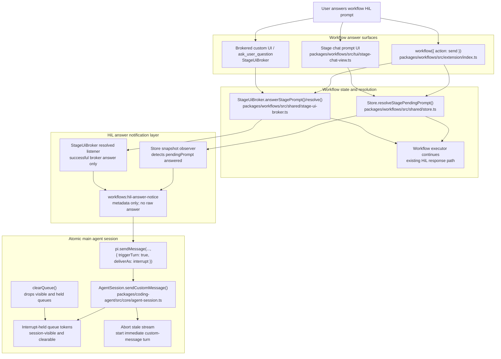

# Workflow HiL Answer Immediate Interrupt Technical Design Document / RFC

| Document Metadata      | Details          |
| ---------------------- | ---------------- |
| Author(s)              | Alex Lavaee      |
| Status                 | In Review (RFC)  |
| Team / Owner           | Atomic CLI / Workflows |
| Created / Last Updated | 2026-05-30       |

## 1. Executive Summary

GitHub issue [flora131/atomic#1137](https://github.com/flora131/atomic/issues/1137) requests that when a workflow human-in-the-loop (HiL) prompt is answered, the active agent is notified immediately via an interrupt-style delivery path instead of a queued steer message. The desired behavior is explicit: the agent must learn that the pending HiL request has already been answered, must not re-ask the same question, and must not wait until the next tool-call boundary.

Repository inspection shows that the current branch already contains an iteration-1 implementation:

- `CustomMessageDelivery` includes `"interrupt"` in `packages/coding-agent/src/core/extensions/types.ts:85`.
- `AgentSession.sendCustomMessage()` routes `{ triggerTurn: true, deliverAs: "interrupt" }` to `_sendInterruptCustomMessage()` in `packages/coding-agent/src/core/agent-session.ts:1399-1423`.
- Workflow answer notifications are implemented in `packages/workflows/src/extension/hil-answer-notifications.ts`, sending `workflows:hil-answer-notice` with `{ triggerTurn: true, deliverAs: "interrupt" }` at `packages/workflows/src/extension/hil-answer-notifications.ts:128-157`.
- Brokered prompt resolution listeners were added to `StageUiBroker` in `packages/workflows/src/shared/stage-ui-broker.ts:25-32`, `102-120`, and `210-226`.
- Tests and docs were added/updated in:
  - `test/unit/workflow-hil-answer-notifications.test.ts`;
  - `test/unit/stage-ui-broker.test.ts`;
  - `packages/coding-agent/test/agent-session-concurrent.test.ts`;
  - `packages/workflows/README.md:30-45`;
  - `packages/coding-agent/docs/extensions.md:1282-1301`.

Iteration 2 must preserve that design while addressing reviewer-b’s P2 finding: `_sendInterruptCustomMessage()` currently drains queued steer/follow-up messages into a local variable, then restores them after the interrupt turn. If the user clears queued messages while the interrupt turn is running, `clearQueue()` cannot see or clear the locally held messages, so stale input can be re-enqueued later. This RFC updates the design to make interrupt-held queues session-visible and clearable, with tests covering `clearQueue()` during an interrupt.

## 2. Context and Motivation

### 2.1 Current State

Issue #1137 describes the problem:

- Steering can wait until the next tool call.
- A HiL answer should interrupt immediately because it resolves an active blocker.
- The agent should not continue stale streaming or ask the same question again after the user has answered.

Current code evidence:

- Workflow command `send` resolves stage HiL answers in `packages/workflows/src/extension/index.ts:1299-1390`.
- Simple prompt-node HiL answers use `Store.resolveStagePendingPrompt()` in `packages/workflows/src/shared/store.ts:547-585`.
- Brokered structured prompts use `StageUiBroker.answerStagePrompt()` / `resolve()` in `packages/workflows/src/shared/stage-ui-broker.ts:83-93` and `210-226`.
- Existing lifecycle notices for workflow completed/failed/awaiting-input remain steer-based in `packages/workflows/src/extension/lifecycle-notifications.ts:145-158`, with regression coverage in `test/unit/workflow-lifecycle-notifications.test.ts:436-446`.
- `AgentSession.clearQueue()` clears visible session queues and pi-agent-core queues in `packages/coding-agent/src/core/agent-session.ts:1520-1527`.
- The iteration-1 interrupt path drains pi-agent-core queues at `packages/coding-agent/src/core/agent-session.ts:1436-1463` and restores them at `packages/coding-agent/src/core/agent-session.ts:1466-1472`.

Prior design context:

- `specs/2026-04-14-hil-detection-ui-surfacing.md:128-139` defines `awaiting_input → running` as the correct state transition when a user responds to HiL.
- `specs/2026-03-25-workflow-interrupt-stage-advancement-fix.md` and `specs/2026-03-25-workflow-interrupt-resume-session-preservation.md` cover workflow stage pause/resume semantics. This RFC does not reuse those mechanisms because issue #1137 concerns notifying the main chat agent, not pausing/resuming a workflow stage.
- `AGENTS.md` requires Bun-only validation and no release/publish flow for this task.

### 2.2 The Problem

The core issue is timing and stale context:

1. A workflow stage asks for HiL input.
2. The user answers through `workflow send`, stage chat, or brokered UI.
3. The workflow receives the answer through the existing response path.
4. The main agent may still be streaming stale text and may re-ask the same HiL question unless interrupted immediately.

The iteration-1 implementation addresses this by adding `deliverAs: "interrupt"` and `workflows:hil-answer-notice`.

However, reviewer-b identified a queue-consistency bug in the new interrupt path:

- `_sendInterruptCustomMessage()` drains queued messages into a local `queuedMessages` variable at `packages/coding-agent/src/core/agent-session.ts:1438`.
- `clearQueue()` at `packages/coding-agent/src/core/agent-session.ts:1520-1527` clears only `AgentSession` arrays and currently visible pi-agent-core queues.
- While the interrupt turn is running, locally held drained messages are invisible to `clearQueue()`.
- `_sendInterruptCustomMessage()` restores those held messages at `packages/coding-agent/src/core/agent-session.ts:1446`, reintroducing stale queued input the user attempted to clear.

Iteration 2 must make “clear queued messages” authoritative even during interrupt-held queue preservation.

## 3. Goals and Non-Goals

### 3.1 Functional Goals

- Emit an immediate interrupt-delivered custom message whenever a workflow stage HiL prompt is successfully answered.
- The interrupt message must tell the agent:
  - the pending HiL request has already been answered;
  - the same question should not be asked again;
  - workflow/run/stage/prompt metadata when available.
- Preserve existing steer-based behavior for workflow completed, failed, and awaiting-input lifecycle notices.
- Cover both HiL implementations:
  - simple `PendingPrompt` prompts resolved through `Store.resolveStagePendingPrompt()`;
  - brokered `StageInputRequest` prompts resolved through `StageUiBroker`.
- Keep raw HiL answers out of the interrupt payload by default.
- Ensure interrupt-held steer/follow-up queues remain clearable:
  - if the user calls `clearQueue()` during an interrupt turn, held queued messages must not be restored afterward;
  - if the user does not clear the queue, pre-existing queued messages should remain preserved.
- Add/update tests for streaming interrupt delivery, simple HiL answer notices, brokered HiL answer notices, lifecycle steer regressions, and the reviewer-b stale-queue scenario.
- Use Bun-only validation commands.

### 3.2 Non-Goals (Out of Scope)

- Do not publish, release, or create tags.
- Do not redesign workflow HiL UI or add new prompt kinds.
- Do not change durable workflow prompt-answer storage semantics.
- Do not include raw user answers in interrupt messages unless a later product decision explicitly accepts that privacy trade-off.
- Do not replace existing workflow lifecycle steer notices with interrupts.
- Do not change workflow pause/resume run-control semantics.
- Do not require upstream changes to `@earendil-works/pi-agent-core`.
- Do not solve broader queued-message scheduling policy beyond making interrupt-held queues honor `clearQueue()`.

## 4. Proposed Solution (High-Level Design)

### 4.1 System Architecture Diagram



### 4.2 Architectural Pattern

Use an observer plus priority-delivery pattern:

- Workflow prompt resolution remains the source of truth.
- A workflow notification layer observes successful prompt answers and sends one deduplicated `workflows:hil-answer-notice`.
- Atomic’s extension `sendMessage` API exposes `deliverAs: "interrupt"` for urgent custom messages.
- `AgentSession` owns interrupt mechanics: abort the stale stream, wait for idle, then prompt with the custom message.
- Queued steer/follow-up preservation is handled by `AgentSession`, but interrupt-held queues must be represented as session-owned state, not hidden local variables, so `clearQueue()` can clear them.

### 4.3 Key Components

| Component | Responsibility | Technology Stack | Justification |
| --------- | -------------- | ---------------- | ------------- |
| `AgentSession.sendCustomMessage()` | Route extension custom messages by delivery mode, including `"interrupt"` | TypeScript, pi-agent-core wrapper | Central in-repo session layer that can abort streams and prompt immediately. |
| Interrupt-held queue state in `AgentSession` | Preserve queued steer/follow-up messages across abort while allowing `clearQueue()` to discard them | TypeScript private state | Fixes reviewer-b stale restoration bug. |
| `AgentSession.clearQueue()` | Clear visible queues, pi-agent-core queues, and any interrupt-held queues | TypeScript | User intent to clear queued messages must be authoritative. |
| `CustomMessageDelivery` type | Public extension delivery union: `"steer" \| "followUp" \| "nextTurn" \| "interrupt"` | TypeScript interfaces | Keeps extension API explicit and type-safe. |
| `hil-answer-notifications.ts` | Detect successful HiL answers and emit interrupt notices | `packages/workflows` TypeScript | Avoids duplicating notification logic across UI surfaces. |
| `StageUiBroker.onStagePromptResolved()` | Notify only successful brokered prompt answers | TypeScript listener set | Store diffs cannot distinguish broker resolve from reject/abort cleanup. |
| `workflows:hil-answer-notice` renderer | Display metadata-only answer notice in chat transcript | Existing custom message renderer API | Makes interrupt events visible/debuggable without exposing raw answers. |
| Bun tests | Lock interrupt, queue, workflow notification, and lifecycle regression behavior | `bun:test`, coding-agent package test script via `bun run` | Required by repo guidance and issue acceptance criteria. |

## 5. Detailed Design

### 5.1 API Interfaces

The extension custom-message delivery API should remain:

```ts
export type CustomMessageDelivery =
  | "steer"
  | "followUp"
  | "nextTurn"
  | "interrupt";
```

Concrete surfaces:

- `packages/coding-agent/src/core/extensions/types.ts:85`
- `packages/coding-agent/src/core/extensions/types.ts:1224-1227`
- `packages/workflows/src/extension/index.ts:316-327`
- `packages/coding-agent/docs/extensions.md:1282-1301`

`deliverAs: "interrupt"` contract:

- With `triggerTurn: true` while streaming:
  1. hold existing queued steer/follow-up messages so the aborting run cannot consume them;
  2. abort the active run;
  3. wait for idle;
  4. start a new custom-message turn immediately;
  5. restore held queues only if they were not cleared while held.
- With `triggerTurn: true` while idle: behave like an immediate triggered custom-message prompt.
- Without `triggerTurn: true`: do not interrupt; retain existing non-trigger custom-message behavior.

Workflow notice details:

```ts
interface WorkflowHilAnswerNoticeDetails {
  readonly kind: "hil_answered";
  readonly scope: "stage";
  readonly runId: string;
  readonly workflowName: string;
  readonly stageId: string;
  readonly stageName?: string;
  readonly promptId?: string;
  readonly promptKind?: "input" | "confirm" | "select" | "editor" | "ask_user_question" | "readiness_gate";
  readonly answeredAt: number;
  readonly answerAvailable: true;
  readonly answerIncluded: false;
}
```

### 5.2 Data Model / Schema

No durable data migration is required.

Existing state used by the design:

- `StageSnapshot.pendingPrompt?: PendingPrompt` for simple HiL prompts in `packages/workflows/src/shared/store-types.ts`.
- `StageSnapshot.inputRequest?: StageInputRequest` for brokered prompts in `packages/workflows/src/shared/store-types.ts`.
- `StageSnapshot.promptAnswerState?: "available" | "unavailable" | "ambiguous"` and `promptFootprint?: PendingPrompt` for snapshot-safe answer metadata.
- Private prompt-answer ledger in `Store`, populated by `resolveStagePendingPrompt()` in `packages/workflows/src/shared/store.ts:547-585`.

Additive in-memory state:

```ts
interface HeldInterruptQueues {
  readonly id: number;
  readonly queues: DrainedAgentQueues;
  cleared: boolean;
  restored: boolean;
}
```

`AgentSession` should hold active tokens in a private set, for example:

```ts
private readonly _interruptHeldQueues = new Set<HeldInterruptQueues>();
```

This is not persisted and exists only while an interrupt custom-message turn is in flight.

### 5.3 Algorithms and State Management

#### 5.3.1 HiL answer notification algorithm

Implemented by `installWorkflowHilAnswerNotifications()` in `packages/workflows/src/extension/hil-answer-notifications.ts`.

Simple prompt observer:

1. Seed `previousSnapshot = store.snapshot()`.
2. Subscribe to `store.subscribe()`.
3. For each prior stage with `pendingPrompt`:
   - find the matching current stage;
   - require current `pendingPrompt === undefined`;
   - require current `promptAnswerState === "available"`;
   - emit one `hil_answered` notice.
4. Dedupe by `runId + stageId + promptKind + promptId`.
5. Send:

```ts
sendMessage(
  {
    customType: "workflows:hil-answer-notice",
    content,
    display: true,
    details,
  },
  { triggerTurn: true, deliverAs: "interrupt" },
);
```

Brokered prompt listener:

1. `StageUiBroker.resolve()` captures the current `StageInputRequest`.
2. It clears store/broker pending state.
3. It emits `StagePromptResolvedEvent` only for successful resolution.
4. `StageUiBroker.reject()` must not emit the resolved event.
5. The HiL answer notifier sends the same interrupt notice.

#### 5.3.2 Interrupt delivery algorithm with clearable held queues

Current problematic flow:

```ts
const queuedMessages = this.isStreaming
  ? this._drainQueuedAgentMessages()
  : emptyDrainedAgentQueues();

await this.agent.prompt(message);
this._restoreQueuedAgentMessages(queuedMessages);
```

Iteration-2 flow:

```ts
private async _sendInterruptCustomMessage<T>(message: CustomMessage<T>): Promise<void> {
  this.abortRetry();

  const held = this.isStreaming
    ? this._holdQueuedAgentMessagesForInterrupt()
    : undefined;

  try {
    if (this.isStreaming) {
      this.agent.abort();
      await this.agent.waitForIdle();
    }

    await this.agent.prompt(message);
  } finally {
    if (held !== undefined) {
      this._restoreHeldInterruptQueuesIfStillValid(held);
      this._interruptHeldQueues.delete(held);
    }
  }
}
```

Queue hold helper:

```ts
private _holdQueuedAgentMessagesForInterrupt(): HeldInterruptQueues {
  const held = {
    id: this._nextHeldInterruptQueueId++,
    queues: this._drainQueuedAgentMessages(),
    cleared: false,
    restored: false,
  };
  this._interruptHeldQueues.add(held);
  return held;
}
```

`clearQueue()` must clear held queues too:

```ts
clearQueue(): { steering: string[]; followUp: string[] } {
  const steering = [...this._steeringMessages];
  const followUp = [...this._followUpMessages];

  this._steeringMessages = [];
  this._followUpMessages = [];

  this.agent.clearAllQueues();

  for (const held of this._interruptHeldQueues) {
    held.cleared = true;
  }

  this._emitQueueUpdate();
  return { steering, followUp };
}
```

Restore helper:

```ts
private _restoreHeldInterruptQueuesIfStillValid(held: HeldInterruptQueues): void {
  if (held.cleared || held.restored) return;
  this._restoreQueuedAgentMessages(held.queues);
  held.restored = true;
}
```

Required invariants:

- Interrupt itself must not call `clearAllQueues()` because that would erase user-authored queued messages without user intent.
- `clearQueue()` must discard held queues, visible queues, and current pi-agent-core queues.
- If `clearQueue()` runs during an interrupt, no held messages may be restored afterward.
- If no clear happens, held messages may be restored after the interrupt turn.
- Restoring held queues must not repopulate `_steeringMessages` / `_followUpMessages`; those arrays were never drained by the interrupt path and remain the source of UI queue display unless `clearQueue()` emptied them.

#### 5.3.3 Existing behavior preservation

Lifecycle notifications remain steer-based:

```ts
{ triggerTurn: true, deliverAs: "steer" }
```

This is covered by `test/unit/workflow-lifecycle-notifications.test.ts:436-446`.

HiL answer notifications are separate from lifecycle notification configuration. Disabling `workflowNotifications` should not silently disable the issue #1137 interrupt behavior unless product later decides to add a dedicated configuration flag.

#### 5.3.4 Prior review findings

- reviewer-a found no blocking issues. Their validation coverage remains useful but does not supersede reviewer-b’s queue bug.
- reviewer-b’s P2 finding is accepted. The RFC explicitly changes the design so interrupt-held queues are no longer hidden in a local variable and are cleared by `clearQueue()`.

## 6. Alternatives Considered

| Option | Pros | Cons | Reason for Rejection |
| ------ | ---- | ---- | -------------------- |
| Reuse steer delivery for HiL answers | Minimal code; consistent with lifecycle notices | Waits for next tool-call/agent-loop boundary; stale stream can continue | Rejected because issue #1137 explicitly requires immediate interruption. |
| Emit answer notices only from `workflow send` | Simple call-site implementation | Misses stage chat, custom UI answers, and future direct store/broker resolution paths | Rejected because the behavior should apply whenever a HiL prompt is answered. |
| Include raw HiL answer in interrupt payload | Agent immediately sees the actual answer | Leaks potentially sensitive answers into main chat/model context; breaks snapshot privacy pattern | Rejected for this iteration; metadata-only notice is safer. |
| Clear all queued messages automatically on interrupt | Avoids restore complexity | Drops user-authored queued steer/follow-up messages without explicit user intent | Rejected as data loss. |
| Keep iteration-1 local drain/restore implementation | Smallest change; preserves queues through abort | `clearQueue()` cannot clear locally held messages, causing stale input restoration | Rejected due reviewer-b P2 bug. |
| Leave queues in pi-agent-core during abort | Avoids private held-queue state | The aborting run may consume queued messages before the interrupt prompt starts | Rejected because the interrupt notice must have priority and stale turn must stop cleanly. |
| Add native `Agent.interrupt(message)` to `@earendil-works/pi-agent-core` | Clean lower-level primitive | External dependency coordination; larger scope | Deferred. Wrapper-level `AgentSession` implementation is sufficient for this issue. |

## 7. Cross-Cutting Concerns

### 7.1 Security and Privacy

- `workflows:hil-answer-notice` must not include raw HiL answers.
- The notice may include run id, workflow name, stage id/name, prompt id, prompt kind, and `answerAvailable: true`.
- Existing store design keeps raw answers in the private prompt-answer ledger, not serialized snapshots.
- `test/unit/workflow-hil-answer-notifications.test.ts` already asserts answer strings such as `swordfish` and `Blue` are absent from content/details.
- No new network calls, credentials, or external services are introduced.

### 7.2 Observability Strategy

- The interrupt event is visible in chat history as `customType: "workflows:hil-answer-notice"`.
- The details payload supports correlation with workflow status by run/stage/prompt identifiers.
- `hil-answer-notifications.ts` logs send failures only when `ATOMIC_WORKFLOW_DEBUG=1`, matching the lifecycle-notification style.
- Queue behavior remains observable through existing `queue_update` events emitted by `AgentSession`.
- New queue tests should assert both:
  - no stale queue restoration after `clearQueue()` during interrupt;
  - queue preservation when no clear occurs.

### 7.3 Scalability and Capacity Planning

- Store diffing remains O(number of runs × stages) per store update, matching the existing lifecycle notification pattern.
- HiL answer dedupe state is a session-local `Set` bounded by answered prompts in one chat session.
- Interrupt-held queue tokens are short-lived and bounded by concurrent interrupt sends.
- Interrupting a stale stream should reduce wasted provider output.
- Broker listener dispatch is synchronous and must remain best-effort; listener failure must not block prompt resolution.

## 8. Migration, Rollout, and Testing

### 8.1 Deployment Strategy

- Continue implementation on the existing branch/worktree requested by the task: `../atomic-issue-1137`.
- Do not publish, release, or create a tag.
- Keep changelog entries under:
  - `packages/workflows/CHANGELOG.md`;
  - `packages/coding-agent/CHANGELOG.md`.
- Keep documentation updates in:
  - `packages/workflows/README.md`;
  - `packages/coding-agent/docs/extensions.md`.
- Commit and push the branch; create or update a PR if appropriate after validation.

### 8.2 Data Migration Plan

No persistent data migration is needed.

All changes are additive or in-memory:

- `deliverAs: "interrupt"` type/API extension;
- metadata-only custom message type;
- store/broker observers;
- session-local held queue tokens;
- tests and docs.

Existing workflow snapshots, session entries, and prompt-answer ledgers remain compatible.

### 8.3 Test Plan

Required tests:

1. `test/unit/workflow-hil-answer-notifications.test.ts`
   - simple `PendingPrompt` answer emits one `workflows:hil-answer-notice`;
   - brokered `StageInputRequest` answer emits one notice;
   - delivery options are `{ triggerTurn: true, deliverAs: "interrupt" }`;
   - raw answer is absent from content/details;
   - duplicate store updates do not duplicate notices.

2. `test/unit/stage-ui-broker.test.ts`
   - `answerStagePrompt()` notifies resolved listeners once;
   - abort/reject does not notify resolved listeners;
   - listener unsubscribe works.

3. `test/unit/workflow-lifecycle-notifications.test.ts`
   - completed/failed/awaiting-input lifecycle notices remain steer-delivered.

4. `packages/coding-agent/test/agent-session-concurrent.test.ts`
   - interrupt custom messages abort a streaming turn and start a new custom-message turn immediately;
   - interrupt delivery does not call `agent.clearAllQueues()` by itself;
   - pre-existing queued messages remain preserved when the user does not clear them;
   - new regression: if `session.clearQueue()` is called while `_sendInterruptCustomMessage()` is awaiting the interrupt turn, held queues are marked cleared and are not restored afterward;
   - after the regression scenario, `pendingMessageCount === 0` and `agent.hasQueuedMessages() === false`.

Recommended validation commands, Bun-only:

```sh
bun test test/unit/workflow-hil-answer-notifications.test.ts
bun test test/unit/stage-ui-broker.test.ts test/unit/workflow-lifecycle-notifications.test.ts
bun run test:unit
bun --cwd packages/coding-agent run test -- agent-session-concurrent.test.ts
bun --cwd packages/coding-agent run docs:check
bun --cwd packages/coding-agent run build
bun run typecheck
```

## 9. Open Questions / Unresolved Issues

- [OWNER: Atomic CLI] Should `deliverAs: "interrupt"` be documented as a stable public extension API for third-party extensions, or marked experimental/internal for now?
- [OWNER: Atomic CLI] After restoring preserved queues post-interrupt, should `AgentSession` kick `agent.continue()` automatically, or leave restored queues pending until the next natural continuation? Current iteration should avoid changing this policy unless tests prove it necessary.
- [OWNER: Workflows] Should HiL-answer interrupts be configurable independently from `workflowNotifications`, or always enabled when `pi.sendMessage` is available?
- [OWNER: Product] Should future iterations ever include raw HiL answers in interrupt payloads for low-sensitivity prompt kinds, or should metadata-only remain the permanent policy?
- [OWNER: QA] What provider-specific aborted-stream artifacts are acceptable in chat history after interrupt delivery?
- [OWNER: Atomic CLI] If `@earendil-works/pi-agent-core` later adds a native interrupt primitive, should `AgentSession` replace abort+prompt composition with that primitive?
