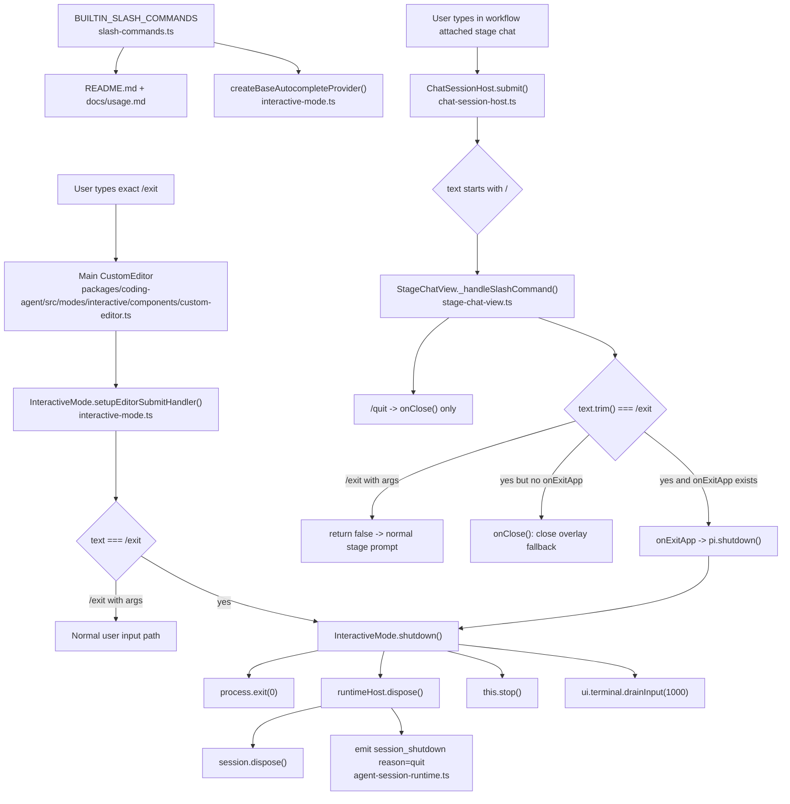

# Atomic CLI `/exit` Slash Command Technical Design Document / RFC

| Document Metadata      | Details         |
| ---------------------- | --------------- |
| Author(s)              | Norin Lavaee    |
| Status                 | In Review (RFC) |
| Team / Owner           | Atomic CLI      |
| Created / Last Updated | 2026-06-02      |

## 1. Executive Summary

Implement GitHub issue [bastani-inc/atomic#1200](https://github.com/bastani-inc/atomic/issues/1200): add a documented `/exit` slash command that cleanly exits Atomic CLI sessions on macOS, Linux, and Windows while preserving all existing exit paths.

Repository investigation confirms Atomic already has a clean shutdown lifecycle:

- Main interactive `/quit` dispatch in `packages/coding-agent/src/modes/interactive/interactive-mode.ts:3215`.
- Main shutdown implementation in `InteractiveMode.shutdown()` at `packages/coding-agent/src/modes/interactive/interactive-mode.ts:3936-3949`.
- Runtime cleanup and `session_shutdown` hook emission in `AgentSessionRuntime.dispose()` at `packages/coding-agent/src/core/agent-session-runtime.ts:378-385`.
- Extension-triggered graceful shutdown through `ExtensionContext.shutdown()` in `packages/coding-agent/src/core/extensions/types.ts:373-374` and `ExtensionRunner.shutdown()` in `packages/coding-agent/src/core/extensions/runner.ts:583-586`.

The implementation should add `/exit` as an alias that reuses the existing `/quit` graceful shutdown path, appears in autocomplete and docs, and works in attached workflow stage chats through the existing extension shutdown hook.

Iteration 2 explicitly addresses the unresolved review findings from `/tmp/atomic-ralph-run-qKlUvB/review-round-1.json`:

1. Stage-chat `/exit` must be exact-only. Inputs such as `/exit now` and `/exit 1` must not exit Atomic; they must fall through to normal stage-chat submission, matching main interactive behavior tested in `packages/coding-agent/test/interactive-mode-status.test.ts:278-286`.
2. Generated root workflow reports (`analysis-report.md`, `implementation-report.md`, `preflight-report.md`, `validation-report.md`) must not be included in the final repository delta.

## 2. Context and Motivation

### 2.1 Current State

Issue metadata fetched with:

```sh
gh issue view 1200 --repo bastani-inc/atomic --json title,state,labels,body,createdAt,url
```

Issue #1200 is open, labeled `enhancement`, and requires:

- Add `/exit` as a recognized slash command.
- Exit promptly while allowing normal cleanup/shutdown hooks to run.
- Work consistently on macOS, Linux, and Windows.
- Behave consistently across Atomic instances/session types where slash commands are supported.
- Document `/exit`.
- Add automated tests where practical.
- Preserve existing exit behavior.

Current code evidence:

- Built-in slash command metadata lives in `packages/coding-agent/src/core/slash-commands.ts:27-56`.
- Main autocomplete is built from `BUILTIN_SLASH_COMMANDS` in `InteractiveMode.createBaseAutocompleteProvider()` at `packages/coding-agent/src/modes/interactive/interactive-mode.ts:585-592`.
- Extension commands conflicting with built-ins are filtered through `BUILTIN_SLASH_COMMAND_NAMES` at `packages/coding-agent/src/modes/interactive/interactive-mode.ts:263-265` and `packages/coding-agent/src/modes/interactive/interactive-mode.ts:650-660`.
- Main editor submit routing handles exact `/quit` through `InteractiveMode.setupEditorSubmitHandler()` at `packages/coding-agent/src/modes/interactive/interactive-mode.ts:3215-3218`.
- Clean shutdown is centralized in `InteractiveMode.shutdown()` at `packages/coding-agent/src/modes/interactive/interactive-mode.ts:3936-3949`.
- `AgentSessionRuntime.dispose()` emits `session_shutdown` with reason `"quit"` before disposing the session at `packages/coding-agent/src/core/agent-session-runtime.ts:378-385`.
- Attached workflow stage chat delegates slash-prefixed input through `ChatSessionHost.submit()` at `packages/coding-agent/src/modes/interactive/components/chat-session-host.ts:509-517`.
- Workflow stage chat currently parses slash commands with `const [command, ...rest] = text.trim().split(/\s+/);` in `packages/workflows/src/tui/stage-chat-view.ts:637-638`.
- Workflow stage chat recognizes `/quit` and `/exit` in `packages/workflows/src/tui/stage-chat-view.ts:648-657`.
- Workflow app-exit callback wiring is present through:
  - `StageChatViewOpts.onExitApp` in `packages/workflows/src/tui/stage-chat-view.ts:113`
  - `WorkflowAttachPaneOpts.onExitApp` in `packages/workflows/src/tui/workflow-attach-pane.ts:73`
  - `BuildGraphOverlayAdapterOpts.onExitApp` in `packages/workflows/src/tui/overlay-adapter.ts:119`
  - `buildGraphOverlayAdapter(..., { onExitApp: typeof pi.shutdown === "function" ? ... })` in `packages/workflows/src/extension/index.ts:2303`
- User-facing slash command docs are in:
  - `packages/coding-agent/docs/usage.md`
  - `packages/coding-agent/README.md`

Prior art:

- `specs/2026-01-31-tui-command-autocomplete-system.md` documents the product goal of discoverable slash commands, although some paths in that older RFC predate the current `packages/coding-agent/src/...` structure.
- `packages/coding-agent/docs/rpc.md` documents RPC mode as JSONL command-based and distinguishes prompt/extension command behavior from interactive TUI built-ins, so `/exit` should remain an interactive slash command rather than a new RPC command.
- Historical changelog entries in `packages/coding-agent/CHANGELOG.md` mention upstream `/exit` removal and prior `/quit`/`/exit` behavior, but issue #1200 requires reintroducing `/exit` for Atomic.

### 2.2 The Problem

Atomic users currently need to know `/quit`, `Ctrl+D`, double `Ctrl+C`, or platform/terminal-specific ways to end an interactive session. `/exit` is a conventional and discoverable command for shell, REPL, and CLI users.

The implementation must avoid two regressions:

1. **Destructive argument-bearing stage command:** Review round 1 found that workflow stage chat switches only on the first whitespace-delimited token. Therefore `/exit now` currently matches `/exit` and can shut down the host from an input that main interactive mode treats as ordinary text. This inconsistency is unacceptable for a destructive command.
2. **Generated artifact pollution:** Review round 1 found generated one-off root reports (`analysis-report.md`, `implementation-report.md`, `preflight-report.md`, `validation-report.md`) in the working tree. These are not source, tests, docs, or release notes and must not be merged.

## 3. Goals and Non-Goals

### 3.1 Functional Goals

- Add `/exit` to `BUILTIN_SLASH_COMMANDS` in `packages/coding-agent/src/core/slash-commands.ts`.
- Make `/exit` appear in main TUI slash autocomplete through `InteractiveMode.createBaseAutocompleteProvider()`.
- Make exact `/exit` in the main interactive editor call the same graceful shutdown path as `/quit`.
- Ensure `/exit` causes `runtimeHost.dispose()` and extension `session_shutdown` hooks to run before process exit.
- Preserve `/quit`, `Ctrl+D`, double `Ctrl+C`, signal handling, and extension `ctx.shutdown()` behavior.
- Document `/exit` wherever built-in slash commands are listed:
  - `packages/coding-agent/docs/usage.md`
  - `packages/coding-agent/README.md`
- Align workflow attached-stage chat so exact `/exit` requests app shutdown when the host exposes `ExtensionContext.shutdown()`.
- Require exact matching for stage-chat `/exit`: `/exit now`, `/exit 1`, and any other argument-bearing form must return `false` from `_handleSlashCommand()` so `ChatSessionHost.submit()` sends it as normal stage-chat text.
- Add automated tests for:
  - `/exit` exists in built-in slash command metadata.
  - `/exit` appears in autocomplete.
  - conflicting extension `/exit` commands are hidden consistently with other built-ins.
  - main interactive exact `/exit` dispatches to graceful shutdown.
  - main interactive `/exit <args>` is normal input.
  - workflow stage exact `/exit` calls `onExitApp` when available.
  - workflow stage `/exit <args>` does not call `onExitApp` and falls through to normal prompt submission.
  - workflow stage `/exit` falls back to `onClose()` only when no app-exit hook is available.
  - workflow stage `/quit` remains overlay-close only.
- Remove generated root run reports from the final commit.

### 3.2 Non-Goals (Out of Scope)

- Do not add a top-level CLI flag or subcommand named `exit`.
- Do not change print mode, RPC mode, or SDK `AgentSession.prompt("/exit")` behavior.
- Do not remove, rename, or deprecate `/quit`.
- Do not alter exit codes for existing shutdown mechanisms.
- Do not add `/exit <code>`, `/exit now`, or any argument-bearing `/exit` semantics.
- Do not redesign the slash command parser or command registry.
- Do not add new telemetry for exit events.
- Do not change workflow `/quit` semantics; current attached-stage `/quit` closes the overlay.
- Do not commit generated workflow run reports from the repository root.

## 4. Proposed Solution (High-Level Design)

### 4.1 System Architecture Diagram



### 4.2 Architectural Pattern

This is an incremental alias-and-dispatch change that reuses the existing command list, autocomplete provider, and shutdown lifecycle.

Key design decisions:

- Treat `/exit` as a built-in interactive command, not as an extension command or RPC command.
- Reuse the existing `/quit` graceful shutdown path rather than introducing a second shutdown implementation.
- Keep main interactive command handling in `InteractiveMode.setupEditorSubmitHandler()` because existing TUI-only built-ins are handled there.
- Preserve exact-only semantics for destructive exit behavior. Main mode already checks `text === "/exit"`; workflow stage chat must do the same before calling `onExitApp`.
- Thread app-exit behavior into workflow stage chat through an optional callback (`onExitApp`) supplied by the extension host, avoiding a direct dependency from `packages/workflows` on `InteractiveMode`.
- Keep `/quit` in attached workflow stage chat as overlay-close only to preserve existing behavior.

### 4.3 Key Components

| Component | Responsibility | Technology Stack | Justification |
| --------- | -------------- | ---------------- | ------------- |
| `packages/coding-agent/src/core/slash-commands.ts` | Declare `/exit` as built-in slash command metadata | TypeScript, Bun runtime | Existing source of truth for built-in command autocomplete metadata |
| `InteractiveMode.setupEditorSubmitHandler()` in `packages/coding-agent/src/modes/interactive/interactive-mode.ts` | Dispatch exact `/exit` to graceful shutdown | TypeScript, pi-tui editor callback | Existing routing path for `/quit` and TUI-only commands |
| `InteractiveMode.shutdown()` in `packages/coding-agent/src/modes/interactive/interactive-mode.ts` | Stop TUI, dispose runtime, exit process | TypeScript process lifecycle APIs | Existing cross-platform clean shutdown path |
| `AgentSessionRuntime.dispose()` in `packages/coding-agent/src/core/agent-session-runtime.ts` | Emit `session_shutdown` and dispose active session | TypeScript extension runtime | Ensures extension cleanup hooks run |
| `ChatSessionHost.submit()` in `packages/coding-agent/src/modes/interactive/components/chat-session-host.ts` | Delegates slash-prefixed stage-chat input and falls through when unhandled | TypeScript shared TUI chat host | Enables `/exit <args>` to become normal prompt text when `_handleSlashCommand()` returns `false` |
| `StageChatView._handleSlashCommand()` in `packages/workflows/src/tui/stage-chat-view.ts` | Handle workflow attached-stage slash commands | TypeScript workflow TUI | Must make stage `/exit` exact-only and route clean app shutdown through `onExitApp` |
| `workflow-attach-pane.ts`, `overlay-adapter.ts`, `extension/index.ts` | Thread optional `onExitApp` callback from `pi.shutdown()` to stage chat | TypeScript extension integration | Avoids tight coupling and reuses `ExtensionContext.shutdown()` |
| `packages/coding-agent/docs/usage.md` and `packages/coding-agent/README.md` | Document `/exit` in slash command lists | Markdown | Required by issue acceptance criteria |
| `test/unit/*` and `packages/coding-agent/test/*` | Validate metadata, autocomplete, exact matching, shutdown dispatch, and workflow behavior | Bun test runner | Required by acceptance criteria and review findings |

## 5. Detailed Design

### 5.1 API Interfaces

No new public CLI flags, SDK methods, settings keys, or persisted APIs are added.

Internal/interface changes:

1. Built-in slash command metadata:

```ts
// packages/coding-agent/src/core/slash-commands.ts
{ name: "exit", description: `Exit ${APP_NAME}` },
{ name: "quit", description: `Quit ${APP_NAME}` },
```

2. Main interactive submit routing remains exact-only:

```ts
// packages/coding-agent/src/modes/interactive/interactive-mode.ts
if (text === "/quit" || text === "/exit") {
  this.editor.setText("");
  await this.shutdown();
  return;
}
```

3. Workflow option threading:

```ts
// packages/workflows/src/tui/stage-chat-view.ts
export interface StageChatViewOpts {
  onExitApp?: () => void;
}
```

```ts
// packages/workflows/src/tui/workflow-attach-pane.ts
interface WorkflowAttachPaneOpts {
  onExitApp?: () => void;
}
```

```ts
// packages/workflows/src/tui/overlay-adapter.ts
export interface BuildGraphOverlayAdapterOpts {
  onExitApp?: () => void;
}
```

```ts
// packages/workflows/src/extension/index.ts
onExitApp: typeof pi.shutdown === "function"
  ? () => { void pi.shutdown?.(); }
  : undefined
```

4. Workflow stage command handling must reject argument-bearing `/exit`:

```ts
// packages/workflows/src/tui/stage-chat-view.ts
private async _handleSlashCommand(text: string): Promise<boolean> {
  const trimmed = text.trim();
  const [command, ...rest] = trimmed.split(/\s+/);

  switch (command) {
    case "/compact": {
      const handle = this._liveHandle();
      if (!handle) return false;
      await handle.ensureAttached();
      if (!handle.agentSession) return false;
      await handle.agentSession.compact(rest.join(" ") || undefined);
      return true;
    }
    case "/quit":
      this.onClose();
      return true;
    case "/exit":
      if (rest.length > 0) return false;
      if (this.onExitApp) {
        this.onExitApp();
      } else {
        this.onClose();
      }
      return true;
    default:
      return false;
  }
}
```

The critical iteration-2 rule is `if (rest.length > 0) return false;` for `/exit`. Because `ChatSessionHost.submit()` only clears the editor and stops submission when `handled === true` (`packages/coding-agent/src/modes/interactive/components/chat-session-host.ts:511-517`), returning `false` makes `/exit now` proceed as normal stage-chat text.

### 5.2 Data Model / Schema

No persisted data model, database schema, session transcript schema, settings schema, keybinding schema, or workflow persistence schema changes are required.

In-memory metadata changes:

- `BUILTIN_SLASH_COMMANDS` gains one object for `exit`.
- `BUILTIN_SLASH_COMMAND_NAMES`, derived in `InteractiveMode` from `BUILTIN_SLASH_COMMANDS`, reserves `exit` as a built-in command name.
- Workflow TUI option interfaces gain optional `onExitApp?: () => void`.
- No serialized workflow run or session data changes.

Compatibility implication:

- Extensions that register a command named `exit` may no longer surface as `/exit` in main interactive autocomplete because built-in command names are filtered by `BUILTIN_SLASH_COMMAND_NAMES`. This matches current conflict behavior for other built-ins, including contextually hidden commands such as `/fast`.

### 5.3 Algorithms and State Management

Main interactive `/exit` algorithm:

1. User submits editor text.
2. `InteractiveMode.setupEditorSubmitHandler()` trims text.
3. If text is exactly `/exit`, clear the editor.
4. Call `await this.shutdown()`.
5. `shutdown()`:
   - exits early when `isShuttingDown` is already true
   - sets `isShuttingDown`
   - unregisters signal handlers
   - drains terminal input through `ui.terminal.drainInput(1000)`
   - stops the TUI
   - awaits `runtimeHost.dispose()`
   - exits with code `0`
6. `AgentSessionRuntime.dispose()` emits `session_shutdown` with reason `"quit"` and disposes the session.

Main interactive `/exit <args>` algorithm:

1. User submits `/exit now` or another argument-bearing form.
2. `text === "/exit"` is false.
3. Input continues through normal prompt handling.
4. Existing test coverage in `packages/coding-agent/test/interactive-mode-status.test.ts:278-286` verifies shutdown is not called and input is added to history.

Workflow attached-stage exact `/exit` algorithm:

1. `ChatSessionHost.submit()` receives stage-chat text.
2. If text starts with `/`, it calls `StageChatView._handleSlashCommand(text)`.
3. `_handleSlashCommand()` trims and splits input.
4. If command is `/exit` and `rest.length === 0`:
   - call `onExitApp()` when available
   - otherwise call `onClose()` as degraded-host fallback
   - return `true`
5. Host clears editor because the command was handled.

Workflow attached-stage `/exit <args>` algorithm:

1. `ChatSessionHost.submit()` receives text such as `/exit now`.
2. `_handleSlashCommand()` sees command `/exit` and `rest.length > 0`.
3. `_handleSlashCommand()` returns `false`.
4. `ChatSessionHost.submit()` continues to normal prompt submission.
5. `onExitApp()` and `onClose()` are not called for this input.

Cross-platform behavior:

- `/exit` uses the same JavaScript shutdown path as `/quit`.
- No platform-specific signals, shell shortcuts, or terminal key encodings are introduced.
- Existing Windows behavior remains untouched because `InteractiveMode.shutdown()` and `process.exit(0)` are already platform-neutral.

## 6. Alternatives Considered

| Option | Pros | Cons | Reason for Rejection |
| ------ | ---- | ---- | -------------------- |
| Add `/exit` only to `InteractiveMode.setupEditorSubmitHandler()` | Smallest change; satisfies direct main CLI exit | Not discoverable in autocomplete; does not reserve built-in name; incomplete docs/help behavior | Rejected because issue #1200 requires `/exit` to be documented wherever slash commands/help are listed |
| Add `/exit` to built-ins and main dispatch only | Low risk for main TUI; reuses existing shutdown | Leaves attached workflow stage chat inconsistent, where `/exit` may close an overlay or behave differently | Rejected because issue #1200 asks for consistent behavior where slash commands are supported |
| Let stage-chat `/exit` match first token and ignore arguments | Simple implementation; matches current `_handleSlashCommand()` parsing style | Review round 1 showed this makes `/exit now` and `/exit 1` destructively shut down Atomic, unlike main mode | Rejected because destructive exit must be exact-only |
| Implement `/exit` inside `AgentSession.prompt()` | Would centralize slash-command handling for programmatic prompts | `AgentSession` has no direct process-exit authority; would surprise SDK/RPC/print-mode callers; conflicts with interactive-only command boundaries | Rejected to preserve current mode separation |
| Introduce a generic command alias registry | Cleaner future alias support | Larger refactor for one alias; touches parser, autocomplete, extension conflict handling, and tests unnecessarily | Rejected for MVP scope |
| Make workflow `/exit` always close only the stage overlay | Preserves prior local behavior | Contradicts issue #1200’s requirement to exit the Atomic CLI cleanly | Rejected unless product explicitly redefines `/exit` in embedded contexts |

## 7. Cross-Cutting Concerns

### 7.1 Security and Privacy

- `/exit` does not read files, write user data, call network APIs, or mutate configuration.
- `/exit` must not bypass cleanup hooks; it must use `InteractiveMode.shutdown()` or `ExtensionContext.shutdown()`.
- No sensitive data should be logged.
- Exact-only stage-chat matching reduces accidental or malicious shutdown from messages that merely begin with `/exit `.
- The TUI must be stopped through the existing cleanup path to avoid leaving the terminal in raw mode or with broken cursor state.

### 7.2 Observability Strategy

No new telemetry is proposed.

Existing observable behavior remains sufficient:

- Clean `/exit` exits with code `0`.
- `session_shutdown` fires with reason `"quit"`.
- Tests can spy on `shutdown()`, `onExitApp()`, `onClose()`, and normal prompt submission.
- If future debug logging is desired, it should use existing debug logging conventions rather than printing user-visible chat output.

### 7.3 Scalability and Capacity Planning

This change has negligible runtime and memory impact:

- One additional command object in `BUILTIN_SLASH_COMMANDS`.
- Autocomplete still scans a small in-memory command list.
- Shutdown remains O(number of registered extension shutdown handlers), unchanged from `/quit`.
- Workflow stage-chat argument checking is constant-time for normal command inputs after the existing split.

## 8. Migration, Rollout, and Testing

### 8.1 Deployment Strategy

- Implement with no feature flag because `/exit` is additive.
- Add `packages/coding-agent/CHANGELOG.md` entry under `## [Unreleased]` → `### Added`.
- Delete generated root reports before merge:
  - `analysis-report.md`
  - `implementation-report.md`
  - `preflight-report.md`
  - `validation-report.md`
- Ship in the next Atomic release.
- Existing users can continue using `/quit`, `Ctrl+D`, and double `Ctrl+C`.

Compatibility note:

- Built-in reservation of `exit` may hide extension commands named `exit` from main interactive autocomplete. This is consistent with existing built-in conflict behavior.

### 8.2 Data Migration Plan

No data migration is required.

No changes to:

- session files
- settings files
- keybindings files
- workflow persistence files
- extension package manifests
- RPC protocol payloads

### 8.3 Test Plan

Automated tests:

- `test/unit/slash-commands.test.ts`
  - assert `BUILTIN_SLASH_COMMANDS` contains `name: "exit"`
  - assert description is `Exit ${APP_NAME}`
- `packages/coding-agent/test/interactive-mode-status.test.ts`
  - assert exact `/exit` and `/quit` call graceful shutdown
  - assert `/exit now` does not call shutdown and is submitted as normal input
  - assert autocomplete for `/ex` shows built-in `exit`
  - assert conflicting extension command named `exit` is hidden while non-conflicting commands remain visible
- `test/unit/stage-chat-view.test.ts`
  - assert exact `/exit` calls `onExitApp` when available
  - assert exact `/exit` falls back to `onClose` when no app shutdown hook exists
  - assert `/exit now` and `/exit 1` do not call `onExitApp` or `onClose` and fall through to normal stage prompt submission
  - assert `/quit` still closes only the overlay
- `test/unit/workflow-attach-pane.test.ts`
  - assert attached stage chat exact `/exit` reaches the app shutdown hook
  - add coverage that attached stage chat `/exit now` does not reach the app shutdown hook
- Docs checks:
  - verify `/exit` is present in `packages/coding-agent/docs/usage.md`
  - verify `/exit` is present in `packages/coding-agent/README.md`
- Repository hygiene:
  - verify generated root reports are absent before commit with `git status --short`

Validation commands:

```sh
bun test test/unit/slash-commands.test.ts test/unit/stage-chat-view.test.ts test/unit/workflow-attach-pane.test.ts
cd packages/coding-agent && bun run test interactive-mode-status.test.ts
bun run typecheck
```

Manual validation:

- macOS Terminal or iTerm2: launch `atomic`, type exact `/exit`, verify process exits and terminal state is restored.
- Linux terminal: launch `atomic`, type exact `/exit`, verify process exits and cleanup hooks run.
- Windows Terminal: launch `atomic`, type exact `/exit`, verify process exits without relying on POSIX signals or `Ctrl+D`.
- Workflow attached-stage chat: type exact `/exit`, verify Atomic exits when host shutdown is available.
- Workflow attached-stage chat: type `/exit now`, verify Atomic does not exit and the text is treated as normal stage input.

## 9. Open Questions / Unresolved Issues

1. Should workflow attached-stage `/quit` remain “close overlay” while exact `/exit` means “exit Atomic CLI”? Proposed answer: yes, to preserve existing behavior. `[OWNER: Atomic product]`
2. In older or degraded workflow hosts without `ExtensionContext.shutdown()`, is falling back to `onClose()` acceptable for exact `/exit`, or should the command show an explicit warning? Proposed answer: fallback to close for compatibility. `[OWNER: Atomic CLI]`
3. Should docs use `Atomic`, `pi`, or `APP_NAME` wording consistently in slash command descriptions? Current evidence shows `packages/coding-agent/docs/usage.md` says “Exit Atomic” while `packages/coding-agent/README.md` says “Exit pi”. `[OWNER: docs]`
4. Should `packages/coding-agent/docs/rpc.md` explicitly state that `/exit` is interactive-only? Proposed answer: optional but useful if users attempt `/exit` over RPC. `[OWNER: docs]`
