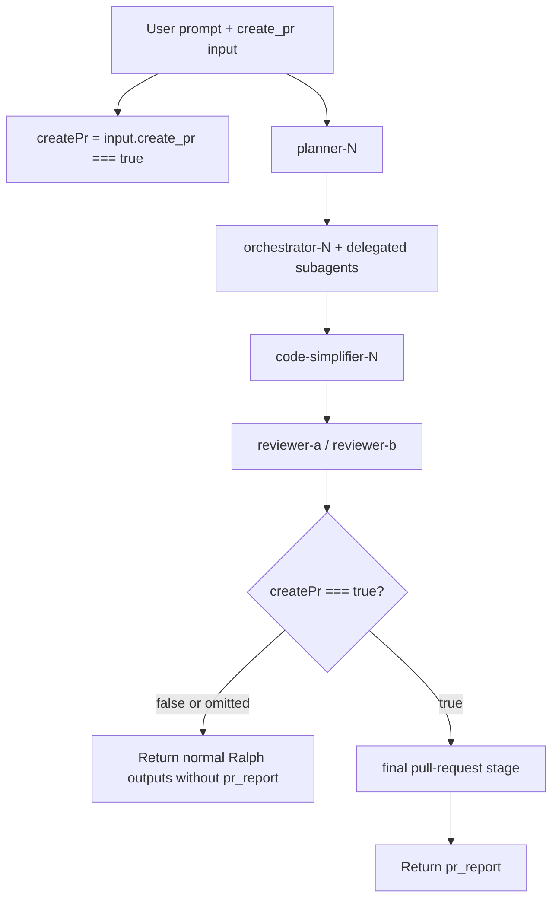

# Atomic Workflows Ralph `create_pr` Flag Technical Design Document / RFC

| Document Metadata      | Details                              |
| ---------------------- | ------------------------------------ |
| Author(s)              | Alex Lavaee                          |
| Status                 | Updated after review                 |
| Team / Owner           | Atomic Workflows / Ralph maintainers |
| Created / Last Updated | 2026-06-05 / 2026-06-05              |

## 1. Executive Summary

Implement GitHub issue #1255 by making Ralph pull-request creation opt-in through a `create_pr` boolean workflow input. The input defaults to `false`; Ralph runs the final `pull-request` stage only when `create_pr === true`.

A follow-up review clarified that disabled runs should not emit a skipped `pr_report`. Ralph should simply omit `pr_report` unless the final `pull-request` stage runs. Ralph's own PR-creation instructions should live in that final stage rather than being threaded through planner, orchestrator, simplifier, or reviewer prompts.

## 2. Context and Motivation

Before this change, `packages/workflows/builtin/ralph.ts` always reached a final `ctx.task("pull-request", ...)` stage. The first implementation gated that final stage with `create_pr`, but also returned a deterministic skipped `pr_report` when disabled and added a pre-final pull-request policy prompt.

The revised behavior is simpler:

- Pre-final stages do normal Ralph planning, orchestration, simplification, and review.
- The final `pull-request` stage runs only when `create_pr === true`.
- If that final stage runs, its prompt prioritizes any explicit pull-request request in the original task and chooses provider-appropriate tooling from the detected source-control/review provider.
- If that final stage does not run, there is no `pr_report`.

## 3. Goals and Non-Goals

### 3.1 Functional Goals

1. Expose `create_pr` in Ralph workflow inputs.
   - Type: boolean.
   - Default: `false`.
   - Strict opt-in: only `create_pr === true` runs the final stage.
2. Remove pre-final pull-request policy prompt sections.
3. Omit `pr_report` when `create_pr` is omitted or `false`.
4. Preserve `pr_report` when `create_pr=true` by returning the final `pull-request` stage report.
5. In the final `pull-request` stage prompt, tell the release engineer to treat an explicit pull-request request in the original task as the highest-priority instruction for that final stage and to use provider-appropriate creation tooling based on the detected source-control/review provider.
6. Update docs, changelogs, and tests to describe and verify the behavior.

### 3.2 Non-Goals

- Do not redesign Ralph's plan/orchestrate/simplify/review loop.
- Do not change final `pull-request` stage GitHub credential checks, branch creation, PR creation, or implementation-note comment behavior.
- Do not add global configuration for PR creation.
- Do not add command-level sandboxing or a universal `gh` denylist in this issue.
- Do not create real pull requests in tests.

## 4. Proposed Solution

Keep Ralph's runtime gate small and explicit. Do not add prompt-sanitization heuristics. Do not inject a pre-final pull-request policy into earlier stages.



## 5. Detailed Design

### 5.1 Input and Output Contract

Ralph input schema includes:

```ts
.input("create_pr", Type.Boolean({
  default: false,
  description:
    "Whether to run the final pull-request creation stage. Defaults to false; prompt text alone does not opt in. Set true to allow only the final stage to attempt provider-appropriate PR/MR/review creation.",
}))
```

`RalphWorkflowResult.pr_report` is optional. The returned object includes `pr_report` only when the final `pull-request` stage ran.

### 5.2 Final Stage Prompt

The final `pull-request` stage retains the original task context and adds one explicit priority rule:

```text
If the original task explicitly asked for pull-request creation, treat that as the highest-priority instruction for this final stage.
```

This instruction belongs only to the final `pull-request` stage prompt. The final prompt also tells the release engineer to detect the source-control/review provider from remotes, hosting URLs, available CLI authentication, and repository metadata, then use the matching tool, such as GitHub `gh pr create`, Azure DevOps/Azure Repos `az repos pr create`, GitLab `glab mr create`, Bitbucket's configured workflow, or Sapling/Phabricator `sl`/Phabricator/Differential tooling.

### 5.3 Runtime Gate

```ts
let finalPrReport: string | undefined;

if (createPr === true) {
  const prResult = await ctx.task("pull-request", { ... });
  finalPrReport = prResult.text;
}

return {
  result,
  plan,
  plan_path,
  implementation_notes_path,
  ...(finalPrReport === undefined ? {} : { pr_report: finalPrReport }),
  approved,
  iterations_completed,
  review_report,
  ...(reviewReportPath === undefined ? {} : { review_report_path: reviewReportPath }),
};
```

## 6. Alternatives Considered

| Option | Pros | Cons | Decision |
| ------ | ---- | ---- | -------- |
| Keep pre-final policy prompts | Explicitly tells workers about the final-stage policy | Mentions pull-request handling before the final stage | Rejected |
| Sanitize the raw prompt before pre-final stages | Attempts to remove final-stage wording automatically | Brittle natural-language heuristic and unnecessary for expected usage | Rejected |
| Gate only the final stage and omit disabled `pr_report` | Simple, preserves safe default, avoids pre-final PR policy prompt text | Does not attempt to rewrite user wording | Selected |
| Add command-level sandboxing | Strongest enforcement | Larger platform change outside issue scope | Deferred |

## 7. Cross-Cutting Concerns

### 7.1 Security and Privacy

Default behavior no longer starts the final `pull-request` stage and no longer generates a `pr_report`. When users explicitly pass `create_pr=true`, the final stage may inspect provider credentials and attempt provider-appropriate PR/MR/review creation, preserving the existing release-engineer behavior while broadening it beyond GitHub-only repositories.

### 7.2 Observability Strategy

Unit tests assert:

- `pull-request` is not invoked when `create_pr` is omitted or `false`.
- `pr_report` is absent when disabled.
- Ralph no longer injects a pre-final `pull_request_policy` prompt section.
- The final `pull-request` stage includes the priority instruction for explicit user pull-request requests and provider-specific tooling guidance.
- The final `pull-request` stage emits `pr_report` when `create_pr=true`.

### 7.3 Scalability and Capacity Planning

Skipping the final stage by default reduces one model call and avoids GitHub credential checks. No additional runtime infrastructure is required.

## 8. Migration, Rollout, and Testing

Validation plan:

```sh
bun test test/unit/builtin-workflows.test.ts --filter ralph
bun test test/unit/atomic-guide-command.test.ts
bun test test/integration/workflow-package-typing.test.ts
bun run typecheck
git diff --check origin/main
```

Users who want Ralph to attempt PR creation must pass `create_pr=true`. Existing default runs now complete without `pr_report`.

## 9. Open Questions / Unresolved Issues

1. Should a future platform-level policy prevent PR-related shell commands when `create_pr` is false? `[OWNER: workflow platform maintainers]`
2. Should future workflow docs add more examples showing `create_pr=true` as a separate input instead of embedding PR intent into the task prompt? `[OWNER: docs maintainers]`
