# Preserve HIL Editor Drafts Across Stage Detach Technical Design Document / RFC

| Document Metadata      | Details                                                                      |
| ---------------------- | ---------------------------------------------------------------------------- |
| Author(s)              | Norin Lavaee                                                                 |
| Status                 | In Review (RFC)                                                              |
| Team / Owner           | Atomic Workflows / TUI Runtime; Coding Agent TUI Runtime; MCP Runtime        |
| Created / Last Updated | 2026-06-04 / 2026-06-04                                                      |

## 1. Executive Summary

GitHub issue [bastani-inc/atomic#1179](https://github.com/bastani-inc/atomic/issues/1179), currently open and labeled `enhancement`, requests that edits made inside a workflow HIL editor stage survive detaching from that stage and are restored when the user returns or resumes the stage.

The core #1179 design is a live-only, store-owned stage prompt draft ledger keyed by `(runId, stageId, promptId)`. `StageChatView` mirrors `input`/`editor` prompt text into the ledger, snapshots the current text before `Ctrl+D` detach, hydrates newly-created prompt editors from the ledger, and clears drafts when the prompt/run/stage lifecycle ends. This keeps raw draft content out of `StoreSnapshot`, `StageSnapshot`, `promptFootprint`, lifecycle notifications, status output, and persisted session metadata.

Repository inspection for iteration 3 shows the HIL draft ledger, `CustomMessageComponent` renderer guard, workflow stage-session `session_shutdown`, and MCP stale-context cancellation safeguards are already present in the working tree. The latest review artifact `/tmp/atomic-ralph-run-rvwwGJ/review-round-2.json` identifies two still-unresolved P2 renderer regressions introduced by the now-correct host guard:

1. `packages/workflows/src/tui/inline-form-overlay.ts:110` returns a bare string for the inline-form “snapshot lost” tombstone, so the guarded host drops it and displays only generic fallback content.
2. `packages/workflows/src/extension/index.ts:3759-3763` registers `workflow.run.start` / `workflow.run.end` renderers that return raw strings, so the host ignores the intended banner/summary renderer and falls back to generic custom-message rendering.

Iteration 3 therefore preserves the #1179 draft-ledger design and narrows the remaining scope to making workflow-owned message renderers satisfy the host renderer contract by returning renderable components, not strings.

## 2. Context and Motivation

### 2.1 Current State

Issue #1179 states:

- User edits made inside the HIL editor are currently lost/reset after detaching from a stage.
- Returning to or resuming the stage should restore the most recent editor contents.
- Existing detach behavior should continue for users who have not edited.
- Tests should cover detach-after-edit persistence for the HIL editor stage.

Detached/background workflow HIL routes `ctx.ui.*` through executor-owned prompt nodes:

- `packages/workflows/src/runs/background/runner.ts:121-128` sets `usePromptNodesForUi: opts.executionMode !== "non_interactive"`.
- `packages/workflows/src/runs/foreground/executor.ts:289-297` builds a `PendingPrompt` with `id`, `kind`, `message`, optional `choices`, optional `initial`, and `createdAt`.
- `packages/workflows/src/runs/foreground/executor.ts:2376-2384` records stage-local prompts through `activeStore.recordStagePendingPrompt(...)` and waits through `awaitStagePendingPrompt(...)`.
- `packages/workflows/src/runs/foreground/executor.ts:2460-2462` gives executor-owned prompt nodes precedence when enabled.

The serializable prompt model intentionally has no draft field:

- `packages/workflows/src/shared/store-types.ts:25-45` defines `PromptKind` and `PendingPrompt`.
- `packages/workflows/src/shared/store-types.ts:136-139` documents snapshot-safe prompt answer and prompt-footprint metadata.
- `packages/workflows/src/shared/store.ts:275-278` snapshots only JSON-cloned `{ runs, notices, version }`.

The current working tree already contains the intended #1179 live-only draft ledger:

- `packages/workflows/src/shared/store.ts:253` adds `_stagePromptDrafts`.
- `packages/workflows/src/shared/store.ts:300-317` keys drafts by JSON-encoded `(runId, stageId, promptId)` and accepts only matching active `input` / `editor` prompts.
- `packages/workflows/src/shared/store.ts:637-647`, `:703-715`, and `:960-978` clear drafts on prompt resolution and store clear.
- `packages/workflows/src/tui/stage-chat-view.ts:522-548` seeds prompt state and host editors from `_seedPromptText(prompt)`.
- `packages/workflows/src/tui/stage-chat-view.ts:551-556` mirrors editor changes into the store.
- `packages/workflows/src/tui/stage-chat-view.ts:1237-1249` reads/writes draft text and falls back to `prompt.initial`.
- `packages/workflows/src/tui/stage-chat-view.ts:1343-1347` snapshots the current prompt draft before `Ctrl+D` detach.

The current working tree also contains the host renderer guard and lifecycle/MCP safeguards from earlier review rounds:

- `packages/coding-agent/src/core/extensions/types.ts:1113-1117` defines host `MessageRenderer<T>` as returning `Component | undefined`.
- `packages/coding-agent/src/modes/interactive/components/custom-message.ts:8-10` adds `isRenderableComponent`.
- `packages/coding-agent/src/modes/interactive/components/custom-message.ts:63-70` mounts only values with a `render()` method.
- `packages/workflows/src/runs/foreground/stage-runner.ts:207-228` emits `session_shutdown` before disposing stage sessions when an extension runner supports the event.
- `packages/mcp/index.ts:15-33`, `:133-185`, and `:224-233` detect stale extension contexts and treat stale deferred MCP initialization as cancellation.

The latest review round is not contesting the draft ledger. It reports remaining workflow-owned renderer contract violations:

| Latest Review Finding | Current Evidence | Iteration-3 Response |
| --------------------- | ---------------- | -------------------- |
| `[P2] Return a renderable tombstone component` / `[P2] Preserve the lost-snapshot tombstone` | `packages/workflows/src/tui/inline-form-overlay.ts:82` permits `string | CardComponent | undefined`; `:107-110` returns a bare string when the live form store no longer has `formId`; `CustomMessageComponent` drops non-components at `packages/coding-agent/src/modes/interactive/components/custom-message.ts:63-77`. | Return a small width-safe `CardComponent` for the tombstone path so `(snapshot lost)` renders through the custom renderer. |
| `[P2] Return components from lifecycle renderers` | `packages/workflows/src/extension/index.ts:169-174` allows string renderer results locally; `:3759-3763` registers `workflow.run.start` and `workflow.run.end` renderers that return `renderRunBanner(...)` / `renderRunSummary(...)` strings from `packages/workflows/src/extension/renderers.ts:60-88`; integration tests still expect strings at `test/integration/mock-extension-api.test.ts:167-171` and `:788-812`. | Wrap run-level lifecycle text in a renderable component, update tests to render via `.render(width)`, and preferably narrow internal workflow renderer result types where practical. |

Prior relevant design material and docs:

- `specs/2026-05-08-workflow-pane-offload-and-resume.md` favors lightweight resume/offload metadata over retaining live panes.
- `research/docs/2026-03-25-workflow-interrupt-resume-bugs.md` identifies unconditional session destruction as a recurring workflow failure mode.
- `research/docs/2026-05-12-extension-runs-workflows-test-surfaces.md` maps workflows extension runtime surfaces, including `src/extension`, `src/runs`, renderer registration, HIL, foreground/background execution, and tests.
- `research/docs/2026-05-12-pi-extension-integrations-ui.md` documents workflows integration with persistence, status, MCP, subagents, and `session_start` / `session_shutdown`.
- `packages/coding-agent/docs/extensions.md:465-472` states `session_shutdown` fires before an extension runtime is torn down and carries reasons including `"quit"`.
- `specs/2026-06-02-implement-the-issue-https-github-com-bastani-inc-atomic-issues-1200.md` documents the main runtime precedent that graceful shutdown emits `session_shutdown` before disposal.

### 2.2 The Problem

For #1179, the original failure mode is:

1. A workflow stage records an `editor` `PendingPrompt`.
2. `StageChatView` constructs a prompt editor seeded from `PendingPrompt.initial`.
3. The user edits the text.
4. The user presses `Ctrl+D`.
5. `WorkflowAttachPane` disposes the current `StageChatView` and returns to graph mode.
6. Re-attaching constructs a new `StageChatView`, which previously seeded from unchanged `PendingPrompt.initial`, losing unsaved edits.

The current branch’s draft-ledger changes address that user-facing HIL bug. The remaining iteration-3 problem is renderer-contract correctness after the host guard:

- `CustomMessageComponent` is now correctly defensive: only values with `render()` are mounted.
- Workflow-owned renderers still have local types and call sites that allow/return raw strings.
- Those strings no longer crash the TUI, but they are silently discarded and replaced by generic default custom-message rendering.
- Users lose intended UI content: the inline-form `(snapshot lost)` tombstone disappears after resume/process restart, and `workflow.run.start` / `workflow.run.end` banners are not rendered by their registered custom renderer.

The branch is therefore not ready until workflow-owned message renderers return renderable components for all intended custom surfaces.

## 3. Goals and Non-Goals

### 3.1 Functional Goals

1. Preserve the latest user-edited HIL `editor` text when detaching from a workflow stage via `Ctrl+D`.
2. Restore preserved editor text when the user re-attaches to or resumes the same pending stage prompt.
3. Keep detach semantics unchanged: detaching must not resolve, cancel, or default-answer the pending prompt.
4. Preserve unchanged `PendingPrompt.initial` behavior when the user has not edited.
5. Support `input` prompts through the same draft path because `input` and `editor` share `PromptCardState.rawText` and host-editor setup in `StageChatView`.
6. Clear preserved drafts when the prompt resolves, is cancelled/defaulted, the stage/run ends, the run is removed, or the store is cleared.
7. Keep raw draft content out of `StoreSnapshot`, `StageSnapshot`, `promptFootprint`, persistence, lifecycle notifications, status output, and HIL answer notifications.
8. Keep the host `CustomMessageComponent` runtime guard: invalid truthy renderer results must fall back safely instead of being mounted as TUI children.
9. Return a renderable component from the inline-form missing-state tombstone path so `(snapshot lost)` is visible after resume/process restart.
10. Return renderable components from `workflow.run.start` and `workflow.run.end` renderers so lifecycle banner/summary text is displayed by the custom renderer.
11. Update renderer tests that currently assert string returns to assert component returns and rendered text.
12. Retain stage-session `session_shutdown` before disposal and MCP stale-context cancellation behavior already present in the working tree.
13. Use Bun-based validation per repository policy: targeted `bun test ...`, `bun run typecheck`, and broader unit/integration validation.

### 3.2 Non-Goals (Out of Scope)

1. Do not persist unsaved HIL editor drafts across Atomic process restarts or store/session boundaries in this iteration.
2. Do not preserve cursor position, scroll position, focused submit button state, editor mode, selection range, or editor undo history; preserve text content only.
3. Do not expose drafts in snapshots, status rendering, logs, or persistence.
4. Do not redesign `PendingPrompt`, `promptFootprint`, workflow status output, `/workflow send`, or final answer storage semantics.
5. Do not change `confirm` or `select` prompt draft behavior.
6. Do not change executor routing from stage-local prompt nodes back to `pi.ui` modal dialogs.
7. Do not teach the host `CustomMessageComponent` to render arbitrary string renderer outputs in this iteration; the host contract remains component-or-fallback.
8. Do not remove the host renderer guard to make workflow string renderers work.
9. Do not redesign the public message-renderer API beyond internal workflow type tightening needed to prevent the reviewed regressions.
10. Do not replace run-level lifecycle banners with rich graph cards; only preserve the current compact text output through a component wrapper.
11. Do not perform a broad MCP startup refactor beyond preserving the current stale-context cancellation behavior.
12. Do not publish, release, or tag packages as part of this enhancement.

## 4. Proposed Solution (High-Level Design)

The solution has four coordinated workstreams:

1. **#1179 live-only draft preservation:** Keep the store-owned draft ledger and `StageChatView` hydration/mirroring path.
2. **Host renderer hardening:** Keep `CustomMessageComponent` validation so invalid extension output cannot crash the TUI.
3. **Workflow renderer contract conformance:** Convert workflow-owned custom message renderers that currently return strings into renderable components.
4. **Lifecycle safety retention:** Keep stage-session shutdown and MCP stale-context safeguards that protect adjacent extension runtimes.

### 4.1 System Architecture Diagram

```mermaid
flowchart TD
    User["User edits HIL editor/input prompt"] --> StageChatView["StageChatView<br/>packages/workflows/src/tui/stage-chat-view.ts"]

    Executor["Foreground executor ctx.ui.editor/input<br/>packages/workflows/src/runs/foreground/executor.ts"] --> StorePrompt["Store StageSnapshot.pendingPrompt<br/>packages/workflows/src/shared/store.ts"]
    StorePrompt --> StageChatView

    StageChatView -->|onChange + Ctrl+D snapshot| DraftLedger["Live-only _stagePromptDrafts<br/>key: runId + stageId + promptId<br/>packages/workflows/src/shared/store.ts"]
    DraftLedger -->|hydrate on attach| StageChatView
    StageChatView -->|Ctrl+D| AttachPane["WorkflowAttachPane detach<br/>packages/workflows/src/tui/workflow-attach-pane.ts"]
    AttachPane -->|dispose view; keep prompt pending| GraphMode["Workflow graph mode"]
    GraphMode -->|Enter / reconnect| AttachPane
    StageChatView -->|submit restored text| ResolvePrompt["resolveStagePendingPrompt(...)<br/>clears pending prompt + draft"]

    subgraph RendererBoundary["Custom message renderer boundary"]
      RunRenderers["workflow.run.start/end renderers<br/>packages/workflows/src/extension/index.ts"] --> TextComponent["text render component<br/>wraps renderRunBanner/renderRunSummary"]
      InlineRenderer["registerInlineFormRenderer<br/>packages/workflows/src/tui/inline-form-overlay.ts"] --> TombstoneComponent["snapshot-lost CardComponent<br/>render(width): string[]"]
      TextComponent --> CustomMessage["CustomMessageComponent<br/>packages/coding-agent/src/modes/interactive/components/custom-message.ts"]
      TombstoneComponent --> CustomMessage
      ThirdPartyInvalid["Third-party invalid renderer output<br/>string/plain object/etc."] --> CustomMessage
      CustomMessage --> Guard{"has render()?"}
      Guard -->|yes| MountChild["addChild(component)"]
      Guard -->|no| DefaultBox["Default boxed Markdown fallback"]
    end

    subgraph StageSessionLifecycle["Workflow stage session lifecycle"]
      StageHandle["StageControlHandle.dispose / model fallback replacement"] --> DisposeStage["disposeStageSession(current)<br/>packages/workflows/src/runs/foreground/stage-runner.ts"]
      DisposeStage -->|if extensionRunner has handler| SessionShutdown["emit session_shutdown reason=quit"]
      SessionShutdown --> McpShutdown["MCP session_shutdown handler<br/>packages/mcp/index.ts"]
      DisposeStage --> AlwaysDispose["current.dispose() always runs"]
    end

    subgraph McpDeferredInit["MCP deferred initialization"]
      McpStart["mcpAdapter session_start"] --> AsyncGap["deferred async import / startup gap"]
      AsyncGap --> ContextProbe["isContextActive(ctx)"]
      ContextProbe -->|active| InitializeMcp["initializeMcp(pi, ctx)"]
      ContextProbe -->|stale| CancelInit["stale init cancellation"]
      InitializeMcp --> PostProbe["post-start generation/promise/context check"]
      PostProbe -->|stale| CleanupState["shutdown stale state"]
      PostProbe -->|active| McpReady["state = nextState; register tools"]
    end
```



### 4.2 Architectural Pattern

The proposed architecture combines three patterns:

1. **Live-only state ledger + view hydration**
   - Store owns workflow prompt identity and lifecycle.
   - `PendingPrompt.initial` remains the immutable original seed.
   - `_stagePromptDrafts` stores the latest mutable text while the prompt is unresolved.
   - New `StageChatView` instances hydrate from the draft ledger before falling back to `initial`.

2. **Component-only renderer boundary**
   - The host renderer contract is `Component | undefined`, as defined in `packages/coding-agent/src/core/extensions/types.ts:1113-1117`.
   - `CustomMessageComponent` validates runtime output structurally before mounting.
   - Workflow-owned renderers must adapt text into components instead of relying on raw string returns.
   - Invalid third-party output remains a safe fallback path, not a supported primary rendering mechanism.

3. **Lifecycle event discipline before resource invalidation**
   - Stage sessions that replay `session_start` must receive `session_shutdown` before disposal.
   - MCP relies on lifecycle generation and shutdown hooks to cancel deferred initialization and clean resources.
   - Direct disposal remains a fallback for test stubs or sessions without extension runners.

### 4.3 Key Components

| Component | Responsibility | Technology Stack | Justification |
| --------- | -------------- | ---------------- | ------------- |
| `PendingPrompt` (`packages/workflows/src/shared/store-types.ts`) | Continue representing the snapshot-safe HIL prompt descriptor with original `initial` only | TypeScript interfaces | Avoids exposing raw drafts through snapshots, status, persistence, or notifications |
| `_stagePromptDrafts` (`packages/workflows/src/shared/store.ts`) | Store latest live-only draft text for active `input`/`editor` stage prompts | TypeScript `Map` | Matches private `_stagePromptAnswers` privacy model and survives TUI view disposal |
| `StageChatView` (`packages/workflows/src/tui/stage-chat-view.ts`) | Persist prompt text changes, snapshot before detach, hydrate editor/prompt-card state from drafts | pi-tui `EditorComponent`, TypeScript | This is where prompt text is created, edited, submitted, and detached |
| `WorkflowAttachPane` (`packages/workflows/src/tui/workflow-attach-pane.ts`) | Preserve attach/detach lifecycle while fresh `StageChatView`s hydrate from store drafts | TypeScript TUI component | No detach redesign is needed; safe disposal remains the lifecycle model |
| `CustomMessageComponent` (`packages/coding-agent/src/modes/interactive/components/custom-message.ts`) | Validate renderer output before mounting custom TUI children | pi-tui `Component`, TypeScript type guard | Prevents invalid extension output from crashing `Container.render()` |
| Run lifecycle renderer wrappers (`packages/workflows/src/extension/index.ts`) | Return renderable components for `workflow.run.start` and `workflow.run.end` text | TypeScript component adapter | Directly addresses latest review finding that string renderers are dropped |
| Inline-form tombstone component (`packages/workflows/src/tui/inline-form-overlay.ts`) | Render `(snapshot lost)` when a persisted form message references missing live form state | Width-safe `CardComponent` | Directly addresses latest review finding that the tombstone disappears after resume/restart |
| `disposeStageSession` (`packages/workflows/src/runs/foreground/stage-runner.ts`) | Emit `session_shutdown` before disposing real stage sessions, with safe fallback for stubs | Structural extension-runner detection | Restores extension cleanup lifecycle for MCP and other session-scoped extensions |
| `mcpAdapter` stale-context guards (`packages/mcp/index.ts`) | Treat invalidated captured `pi`/`ctx` during deferred init as cancellation | TypeScript, Atomic extension lifecycle | Prevents spurious MCP initialization failures after stale context disposal |
| Regression tests | Prove draft preservation and renderer/lifecycle/MCP safeguards | `bun:test` + `node:assert/strict` | Current review explicitly requires tests for both HIL drafts and renderer contract regressions |

## 5. Detailed Design

### 5.1 API Interfaces

#### Store draft APIs

Keep the additive optional methods already present on `Store` so structural test stores remain safe:

```ts
recordStagePromptDraft?(
  runId: string,
  stageId: string,
  promptId: string,
  text: string,
): boolean;

getStagePromptDraft?(
  runId: string,
  stageId: string,
  promptId: string,
): string | undefined;

clearStagePromptDraft?(
  runId: string,
  stageId: string,
  promptId: string,
): boolean;
```

Behavior contract:

- Draft writes succeed only when the run, stage, and matching active pending prompt exist.
- Draft writes apply only to `kind: "input"` and `kind: "editor"`.
- Empty string is a valid draft and must be distinguishable from no draft.
- Draft writes do not notify subscribers or increment `StoreSnapshot.version`.
- `getStagePromptDraft(...)` returns `undefined` if the prompt is no longer active or no draft exists.
- `clearStagePromptDraft(...)` removes one draft record.
- `createStore()` must implement the methods.
- TUI code must use optional chaining for compatibility with narrow fakes.

#### `StageChatView` draft helpers

Keep draft behavior localized behind private helpers:

```ts
private _isDraftablePrompt(prompt: PendingPrompt): boolean;
private _promptDraft(prompt: PendingPrompt): string | undefined;
private _persistPromptDraft(prompt: PendingPrompt, text: string): void;
private _seedPromptText(prompt: PendingPrompt): string;
private _persistCurrentPromptDraftBeforeDetach(): void;
```

Seed priority:

1. Current mounted editor text when snapshotting before detach.
2. Current `PromptCardState.rawText` when no host editor is mounted.
3. Store draft for `(runId, stageId, prompt.id)`.
4. `prompt.initial ?? ""`.

#### Custom renderer validation

Keep the host runtime guard:

```ts
function isRenderableComponent(value: unknown): value is Component {
  return (
    typeof value === "object" &&
    value !== null &&
    typeof (value as { readonly render?: unknown }).render === "function"
  );
}
```

`CustomMessageComponent.rebuild()` must continue to mount renderer results only when `isRenderableComponent(component)` is true. Any string, boolean, object without `render`, or other invalid truthy value falls through to default boxed Markdown rendering.

#### Workflow-owned message renderer components

Workflow-owned renderers should align with the host contract:

```ts
export interface PiMessageRenderComponent {
  render(width: number): string[];
  invalidate?: () => void;
}

export type PiMessageRendererResult = PiMessageRenderComponent | undefined;
```

If narrowing `PiMessageRendererResult` in `packages/workflows/src/extension/index.ts` causes unrelated churn, the minimum iteration-3 requirement is still that the reviewed renderer registrations return components. However, narrowing the internal type is preferred because the current `string | PiMessageRenderComponent | undefined` type at `packages/workflows/src/extension/index.ts:169` allowed the latest regressions.

A small helper should adapt text renderers to components:

```ts
function messageTextRenderComponent(
  renderText: (width: number) => string,
): PiMessageRenderComponent {
  return {
    render(width: number): string[] {
      return renderText(Math.max(1, Math.floor(width))).split("\n");
    },
    invalidate() {
      /* immutable text component */
    },
  };
}
```

Run-level lifecycle registration should wrap current text renderers:

```ts
pi.registerMessageRenderer("workflow.run.start", (payload) =>
  messageTextRenderComponent((width) =>
    fitMessageLine(renderRunBanner(payload as RunStartPayload), width),
  ),
);

pi.registerMessageRenderer("workflow.run.end", (payload) =>
  messageTextRenderComponent((width) =>
    fitMessageLine(renderRunSummary(payload as RunEndPayload), width),
  ),
);
```

`fitMessageLine(...)` should use existing width-safe helpers such as `truncateToWidth` from `packages/workflows/src/tui/text-helpers.ts` to avoid returning a line wider than the host render width.

#### Inline-form tombstone component

Change the missing-state path in `registerInlineFormRenderer(...)` from a string return to a `CardComponent`:

```ts
function staticCard(text: string): CardComponent {
  return {
    render(width: number): string[] {
      return wrapPlainText(text, Math.max(1, Math.floor(width)));
    },
    invalidate() {
      /* immutable tombstone */
    },
  };
}
```

Then:

```ts
if (!state) {
  return staticCard(`  ${message.content ?? "workflow form"}  ·  (snapshot lost)`);
}
```

The live form path remains reactive and continues to call `renderInlineCard({ width, state: getForm(formId) ?? state, theme })`.

#### Stage session shutdown helper

Keep the existing internal structural helper in `packages/workflows/src/runs/foreground/stage-runner.ts`:

```ts
type StageSessionExtensionRunner = {
  hasHandlers(eventType: "session_shutdown"): boolean;
  emit(event: { readonly type: "session_shutdown"; readonly reason: "quit" }): Promise<unknown> | unknown;
};

async function disposeStageSession(
  current: StageSessionRuntime | undefined,
): Promise<void>;
```

Contract:

- If `current` is undefined, no-op.
- If `current.extensionRunner` has `hasHandlers` and `emit`, check `hasHandlers("session_shutdown")`.
- If a shutdown handler exists, emit `{ type: "session_shutdown", reason: "quit" }`.
- If shutdown probing or emit throws, log and continue.
- Always call `current.dispose()` after the shutdown attempt.

#### MCP stale-context helpers

Keep the existing MCP stale-context helpers in `packages/mcp/index.ts`:

```ts
const STALE_EXTENSION_CONTEXT_MARKER = "extension ctx is stale";

function isStaleExtensionContextError(error: unknown): boolean;
function isContextActive(ctx: ExtensionContext): boolean;
```

Use them to continue suppressing stale-context deferred-init failures as cancellation, not as `MCP initialization failed`.

### 5.2 Data Model / Schema

No persisted schema migration is required.

`PendingPrompt` remains unchanged:

```ts
export interface PendingPrompt {
  readonly id: string;
  readonly kind: PromptKind;
  readonly message: string;
  readonly choices?: readonly string[];
  readonly initial?: string;
  readonly createdAt: number;
}
```

The live-only draft ledger remains private to `createStore()`:

```ts
interface StagePromptDraftRecord {
  readonly runId: string;
  readonly text: string;
}
```

The key encodes the full tuple:

```ts
function stagePromptDraftKey(
  runId: string,
  stageId: string,
  promptId: string,
): string {
  return JSON.stringify([runId, stageId, promptId]);
}
```

Snapshot invariants:

- Drafts are not included in `StoreSnapshot`.
- Drafts are not included in `StageSnapshot.pendingPrompt`.
- Drafts are not included in `StageSnapshot.promptFootprint`.
- Drafts are not included in persistence entries, notices, HIL answer notifications, or lifecycle notifications.

Renderer fixes add no serialized data:

- Inline-form custom message payload remains `{ details: { formId } }`.
- The tombstone component renders from existing `message.content`.
- Run-level lifecycle payload shapes remain `RunStartPayload` and `RunEndPayload`.
- Changing renderer return values from strings to components is an in-memory rendering contract change only.

Changelog updates should remain under `## [Unreleased]`:

- `packages/workflows/CHANGELOG.md`: #1179 HIL draft preservation, stage-session shutdown, and renderer component/tombstone fix.
- `packages/coding-agent/CHANGELOG.md`: custom-message renderer guard.
- `packages/mcp/CHANGELOG.md`: stale-context MCP initialization cancellation.

### 5.3 Algorithms and State Management

#### HIL draft lifecycle

1. Executor records a stage-local `PendingPrompt`.
2. `StageChatView._syncPromptState(prompt)` creates `PromptCardState`.
3. If prompt kind is `input` or `editor`, seed `rawText` from store draft when present; otherwise use `prompt.initial ?? ""`.
4. Host editor setup calls `editor.setText(_seedPromptText(prompt))`.
5. Host editor `onChange` updates `promptState.rawText`, caret, and `recordStagePromptDraft(...)`.
6. Prompt-card fallback calls `handlePromptCardInput(...)`; after text-changing no-op actions, mirror `state.rawText` into the draft ledger.
7. On `Ctrl+D` while a prompt is active, call `_persistCurrentPromptDraftBeforeDetach()` before `onDetach()`.
8. `WorkflowAttachPane` disposes the old `StageChatView` and returns to graph mode without resolving the prompt.
9. Re-attaching constructs a new `StageChatView`, which hydrates from the draft ledger.
10. Submitting resolves the prompt through `resolveStagePendingPrompt(...)`.
11. `resolveStagePendingPrompt(...)` clears the matching draft before clearing `stage.pendingPrompt`.
12. Stage/run end, run removal, and store clear purge drafts.

State invariants:

- A draft belongs to a specific prompt id, not just a stage.
- Draft text never supersedes final answer storage.
- Detach does not mutate stage status; the stage remains `awaiting_input`.
- Draft writes are live-only and do not notify subscribers.

#### Workflow renderer lifecycle

1. `CustomMessageComponent.rebuild()` removes previous custom component and default box.
2. If a custom renderer exists, call it inside the existing try/catch.
3. If the returned value has `render()`, mount it.
4. If the returned value is invalid, ignore it and fall through to default boxed Markdown.
5. Workflow-owned renderers must therefore return components for intended custom UI.
6. `workflow.run.start` and `workflow.run.end` registrations wrap `renderRunBanner(...)` and `renderRunSummary(...)` in a component.
7. Inline-form missing-state rendering returns a tombstone component instead of a string.
8. Tests render the returned component through `.render(width)` and assert the expected text is present.

#### Stage session disposal

1. `disposeCurrentSession()` captures the current session and clears local references/listeners.
2. Call `disposeStageSession(current)`.
3. `disposeStageSession` emits `session_shutdown` when supported.
4. Regardless of shutdown success/failure, call `current.dispose()`.
5. `InternalStageContext.__dispose()` uses the same helper.
6. Model fallback replacement and final live-handle disposal share lifecycle behavior.

#### MCP stale-context cancellation

1. `session_start` increments `lifecycleGeneration`, clears state, and begins cached startup registration.
2. If cached registration touches stale `ctx`, return without logging a startup failure.
3. Deferred initialization shuts down previous state and OAuth.
4. Before async boundaries that use captured `pi`/`ctx`, check both generation and `isContextActive(ctx)`.
5. If context is stale before startup, throw `Stale MCP session initialization cancelled before startup`.
6. After `initializeMcp`, check generation, promise identity, and context liveness.
7. If stale after startup, shut down the newly-created state and throw `Stale MCP session initialization cancelled after startup`.
8. Promise catch suppresses both stale cancellation messages and stale-context errors.
9. `session_shutdown` continues to increment generation, clear state, and shut down state/OAuth.

## 6. Alternatives Considered

| Option | Pros | Cons | Reason for Rejection |
| ------ | ---- | ---- | -------------------- |
| Keep status quo for #1179 | No implementation work | Loses user edits on detach; fails issue #1179 acceptance criteria | Rejected because it is the reported bug |
| Add `draft?: string` to `PendingPrompt` / `StageSnapshot` | Simple hydration from existing snapshots | Exposes raw unsaved user content through status, notifications, prompt footprints, JSON snapshots, and possible persistence | Rejected due privacy and snapshot-contract risk |
| Mutate `PendingPrompt.initial` on detach | Minimal API surface | Destroys distinction between original seed and user draft; leaks through snapshots; only saves on detach | Rejected as semantically incorrect |
| Keep `StageChatView` alive while detached | Preserves text, cursor, scroll, and editor mode | Conflicts with current `WorkflowAttachPane` disposal lifecycle; risks stale TUI handles/subscriptions | Rejected because detach should remain safe disposal |
| Persist drafts to disk/session entries | Survives process restart | Larger privacy/retention surface; requires separate retention policy and migration | Rejected for v1; live detach/reattach is the issue scope |
| Teach host `CustomMessageComponent` to render string renderer returns | Would make current workflow string renderers visible without touching each renderer | Broadens host runtime contract beyond `MessageRenderer<T> => Component | undefined`; risks treating invalid third-party output as supported UI; weakens the boundary fixed by earlier review | Rejected for iteration 3; workflow-owned renderers should comply with the host contract |
| Remove the host renderer guard | Restores old behavior for some string paths | Reintroduces crash class where truthy non-components are mounted and `child.render` is missing | Rejected because the guard is required defensive runtime validation |
| Return components from workflow-owned renderers while keeping host guard | Solves latest review findings, preserves host safety, aligns workflow renderers with `Component | undefined` contract | Requires small wrapper/helper changes and test updates | Selected because it satisfies review-round-2 findings with bounded scope |
| Tighten all workflow renderer local types to disallow `string` | Prevents recurrence at compile time | May expose unrelated test/type churn in areas not touched by #1179 | Preferred when low-churn; if deferred, reviewed renderer paths still must return components and tests must enforce it |
| Continue direct stage-session `dispose()` | Simple older behavior | Skips `session_shutdown`; leaks per-session extension resources; MCP lifecycle generation may not advance | Rejected; current working tree already implements the safer helper |
| Only use MCP `lifecycleGeneration` for stale init | Already simple | Captured `pi`/`ctx` can become stale without generation changing when direct dispose invalidates the runner | Rejected; current working tree already probes context liveness |

## 7. Cross-Cutting Concerns

### 7.1 Security and Privacy

Unsaved HIL editor text may contain credentials, prompts, code, or other sensitive material.

Required safeguards:

- Drafts remain live-only in process memory.
- Drafts are excluded from `StoreSnapshot`, `StageSnapshot`, `promptFootprint`, persistence, status output, lifecycle notifications, and logs.
- Tests must assert draft text is absent from `JSON.stringify(store.snapshot())`.
- Drafts are cleared promptly on prompt resolution, stage/run termination, run removal, and store clear.
- Renderer validation treats extension output as untrusted runtime data.
- Workflow renderer component wrappers must not log renderer payloads or draft/prompt text.
- Inline-form tombstone rendering should use already-stored custom-message content and should not attempt to recover missing live form field values after restart.
- MCP stale-context handling must avoid logging stale captured context failures as scary initialization errors.

Residual privacy risk: draft text remains in memory after detach until prompt cleanup. This is acceptable for this iteration because the mounted editor already holds the same text while attached, and process-restart persistence is explicitly out of scope.

### 7.2 Observability Strategy

Avoid logging raw draft content or renderer payload bodies.

Recommended observability:

- Unit tests for draft preservation and snapshot exclusion.
- Unit tests for draft cleanup paths.
- Unit tests that a string custom renderer falls back instead of crashing.
- Unit tests that workflow-owned reviewed renderers return components and render expected text.
- Unit tests that inline-form missing-state tombstone renders `(snapshot lost)` through a component.
- Unit tests that stage-session shutdown emit precedes dispose.
- Unit tests that MCP stale-context init does not log `MCP initialization failed`.
- Allow logging of `atomic-workflows: stage session_shutdown handler failed` without including user prompt/draft content.

No telemetry is required for draft writes because they can occur on every keystroke and would be noisy.

### 7.3 Scalability and Capacity Planning

Capacity impact is bounded:

- At most one draft record per active stage prompt id.
- Memory cost is `O(total unresolved draft text length)`.
- Draft writes do not notify subscribers or redraw the graph on every keystroke.
- Run cleanup scans `_stagePromptDrafts` by run id; pending HIL prompts per run are expected to be small.
- Renderer validation is a constant-time structural check.
- Text-render component wrappers allocate one small object per custom message renderer invocation.
- Width-safe tombstone rendering is proportional to the tombstone text length, not form size.
- Stage-session shutdown adds one extension event emit only during session disposal/replacement.
- MCP liveness probes are cheap property reads and run only during session startup/deferred initialization.

## 8. Migration, Rollout, and Testing

### 8.1 Deployment Strategy

Implementation should land as additive raw TypeScript changes in the monorepo. Do not add a build step, `dist/`, `outDir`, or package bundling changes.

Rollout sequence:

1. Preserve the existing #1179 draft-ledger changes in `packages/workflows/src/shared/store.ts`.
2. Preserve `StageChatView` draft hydration/persistence and `WorkflowAttachPane` attach/detach lifecycle.
3. Preserve `CustomMessageComponent` renderer output validation in `packages/coding-agent/src/modes/interactive/components/custom-message.ts`.
4. Change `packages/workflows/src/tui/inline-form-overlay.ts` so the missing-form tombstone path returns a `CardComponent`, not a string.
5. Change `packages/workflows/src/extension/index.ts` so `workflow.run.start` and `workflow.run.end` registered renderers return renderable text components.
6. Prefer narrowing workflow-local renderer result types to remove `string` from internal renderer contracts after reviewed paths are converted.
7. Update `test/integration/mock-extension-api.test.ts` expectations from string renderer output to component render output.
8. Add or update inline-form tests so a missing form state renders `(snapshot lost)` through a component and through `CustomMessageComponent`.
9. Keep `disposeStageSession(...)` in `packages/workflows/src/runs/foreground/stage-runner.ts`.
10. Keep stale-context MCP guards in `packages/mcp/index.ts`.
11. Update changelogs under `## [Unreleased]`.
12. Run targeted Bun tests, `bun run typecheck`, and broader unit/integration validation before review.

### 8.2 Data Migration Plan

No data migration is required.

Serialized shapes remain unchanged:

- `PendingPrompt`
- `StageSnapshot`
- `RunSnapshot`
- `StoreSnapshot`
- Workflow persistence entries
- MCP configuration
- Inline-form custom message `details`
- Run lifecycle persistence payloads

Existing runs without draft records seed from `prompt.initial` exactly as before. Existing persisted inline-form messages with missing live form state become more informative because the renderer now shows the existing tombstone text through a component.

### 8.3 Test Plan

Targeted tests to keep/add for #1179:

```sh
bun test test/unit/store-pending-prompt.test.ts
bun test test/unit/stage-chat-view.test.ts
bun test test/unit/workflow-attach-pane.test.ts
bun test test/unit/background-runner-hil.test.ts
```

Required #1179 assertions:

- Drafts record and retrieve for matching active `input`/`editor` prompts.
- Draft writes reject unknown, stale, and non-text prompts.
- Empty-string drafts are preserved.
- Draft text is absent from `store.snapshot()`.
- Drafts clear on prompt resolve, stage end, run end, `removeRun`, and `clear`.
- Host editor detach/reattach restores the edited text.
- Prompt-card fallback detach/reattach restores text.
- Detach does not resolve the pending prompt.
- Submitting after reattach resolves with the restored edited text.

Targeted tests for latest review-round-2 findings:

```sh
bun test test/unit/custom-message-renderer-guard.test.ts
bun test test/unit/inline-form.test.ts
bun test test/integration/mock-extension-api.test.ts
```

Required renderer assertions:

- A custom renderer returning a string or invalid object does not get mounted as a TUI child and does not crash rendering.
- Valid component renderers still mount.
- Inline-form missing-state renderer returns an object with `render(width)`.
- Rendering that object includes `(snapshot lost)`.
- Rendering a missing-state inline-form message through `CustomMessageComponent` includes `(snapshot lost)`, not only the default custom-message label.
- `workflow.run.start` renderer returns a component whose `render(80)` output includes workflow name, run id, and input count.
- `workflow.run.end` renderer returns a component whose `render(80)` output includes success/failure marker and run id.
- Integration helper `expectStringRendererOutput(...)` is removed or replaced with `expectComponentRendererText(...)`.

Targeted tests to retain for lifecycle/MCP safeguards:

```sh
bun test test/unit/stage-runner-session-shutdown.test.ts
bun test test/unit/mcp-stale-context-init.test.ts
bun test test/unit/workflow-lifecycle-notifications.test.ts
bun test test/unit/workflow-hil-answer-notifications.test.ts
```

Required lifecycle/MCP assertions:

- Stage sessions with an extension runner emit `session_shutdown` before `dispose`.
- Stage sessions without extension runners still dispose.
- A throwing `session_shutdown` handler is logged and does not prevent disposal.
- MCP deferred init treats stale captured contexts as cancellation and does not log `MCP initialization failed`.
- MCP proxy/direct-tool startup behavior remains intact for active contexts.

Final validation:

```sh
bun run typecheck
bun run test:unit
bun run test:integration
git diff --check
```

## 9. Open Questions / Unresolved Issues

1. `[OWNER: workflows team]` Does “resuming the stage” in issue #1179 require recovery after an Atomic process restart, or only live detach/re-attach while the store remains in memory? This RFC scopes to live detach/re-attach only.

2. `[OWNER: security/privacy]` Is live-only retention of unsaved HIL editor text acceptable for the duration of an unresolved prompt, or should drafts have an explicit TTL/redaction policy?

3. `[OWNER: workflows API]` Should the optional store draft APIs remain on the internal `Store` interface, or should they be hidden behind a narrower draft-capable helper type?

4. `[OWNER: product]` Should `input` prompts officially receive the same draft-preservation guarantee as `editor` prompts? The implementation supports both because they share the same text path, but issue #1179 explicitly names HIL editor stages.

5. `[OWNER: TUI team]` Should future work preserve caret, scroll offset, focused submit state, editor mode, or selection range across detach? This RFC preserves content only.

6. `[OWNER: coding-agent runtime]` Should a future host compatibility layer intentionally render string returns from third-party message renderers as Markdown, or should the strict `Component | undefined` contract remain the only supported path?

7. `[OWNER: workflows TUI]` Should workflow-local renderer result types be narrowed in this iteration for all renderer modules, including `chat-surface-message.ts`, or only for the reviewed `extension/index.ts` and `inline-form-overlay.ts` paths?

8. `[OWNER: workflows design]` Should `workflow.run.start` and `workflow.run.end` eventually use richer workflow notice cards instead of compact text components? Iteration 3 preserves existing compact text.

9. `[OWNER: extension runtime]` Is `{ reason: "quit" }` the correct `session_shutdown` reason for workflow stage-session disposal, including model fallback replacement, or should stage sessions use a more specific shutdown reason in a future typed event?

10. `[OWNER: MCP/runtime]` Is substring matching `"extension ctx is stale"` stable enough for MCP stale-context detection, or should the extension runtime expose a typed stale-context error or `ctx.isActive()` probe in a future API?
