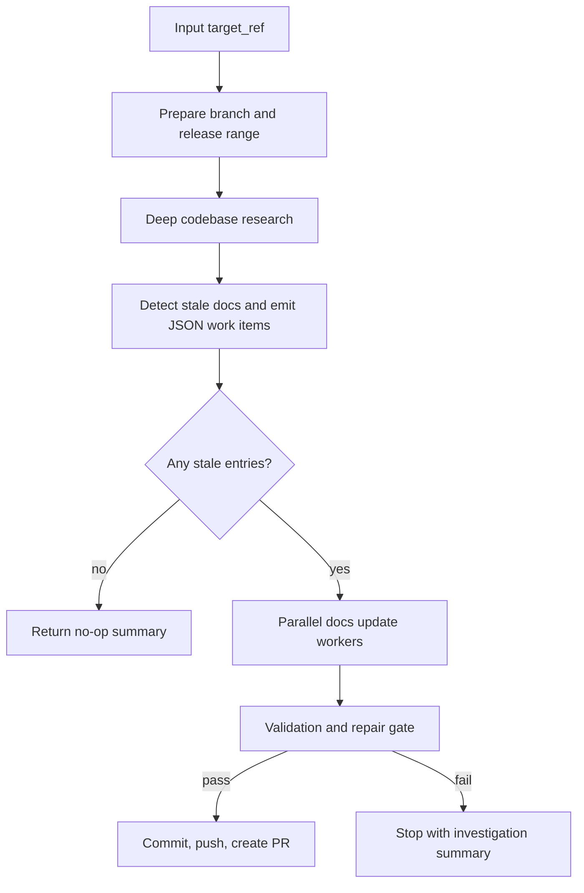

# Release Docs Workflow Technical Design

| Document Metadata | Details |
| --- | --- |
| Author(s) | Norin Lavaee |
| Status | Approved for implementation |
| Team / Owner | Atomic developers |
| Created / Last Updated | 2026-06-07 |

## 1. Executive Summary

Create a project workflow at `.atomic/workflows/release-docs.ts` named `release-docs` that automates release documentation refreshes for Atomic developers. The workflow accepts a required `target_ref`, infers the release version from that ref, creates/switches to `docs/release-docs-<release-version>`, finds the latest non-prerelease release tag as the baseline, researches code changes between baseline and target, identifies stale docs under `packages/coding-agent/docs`, updates stale docs via parallel artifact-backed stages, validates docs with the repository's Mintlify/docs checks, then commits, pushes, and opens a PR only after validation passes.

## 2. Context and Motivation

Release prep currently requires developers to manually connect code changes, changelog/release tags, and hosted docs. The repo already has documented release docs checks in `docs/ci.md`: `cd packages/coding-agent && bun run docs:check`, `cd packages/coding-agent/docs && bunx --bun mintlify@latest validate`, and `cd packages/coding-agent/docs && bunx --bun mintlify@latest broken-links`. The workflow should package this repeatable process into a headless, inspectable Atomic workflow.

## 3. Goals and Non-Goals

### Goals

- Create a reusable workflow named `release-docs` under `.atomic/workflows`.
- Require `target_ref` and infer the release version from it.
- Use the latest stable semver tag (`MAJOR.MINOR.PATCH`, no prereleases) as the baseline.
- Create/switch to `docs/release-docs-<release-version>` before edits.
- Use research-codebase style codebase research to document the baseline-to-target changes.
- Detect stale docs only under `packages/coding-agent/docs`.
- Fan out independent docs update tasks in parallel.
- Run and repair docs validation issues before PR creation.
- Commit, push, and create a GitHub PR targeting `main` only when validation passes and docs changed.

### Non-Goals

- Do not publish releases or push release tags.
- Do not update changelogs or package versions.
- Do not prompt for human input during the workflow run.
- Do not open an empty/no-op PR when no docs changes are needed.
- Do not edit docs outside `packages/coding-agent/docs` unless validation fixes require generated references in the same docs tree.

## 4. Proposed Solution

### 4.1 Starter Pattern

Use **fan-out-and-synthesize** for stale-doc updates, followed by **adversarial verification** through a validation/repair gate.



### 4.2 Key Components

| Component | Responsibility |
| --- | --- |
| Deterministic helpers | Fetch tags, find latest stable baseline tag, infer release version, create/switch branch, parse stale-doc JSON. |
| `deep-research-codebase` child workflow | Research the code delta and write a reusable research artifact. |
| Stale-doc detector stage | Inspect docs and research, then produce grouped JSON update tasks with non-overlapping owning docs files. |
| Parallel update stages | Apply doc edits for independent stale-doc groups. |
| Validation/repair stage | Discover/run repo docs checks and fix failures until all pass or investigation is required. |
| PR stage | Commit, push, and create/update the PR against `main` after validation passes and docs changed. |

### 4.3 Door Set at a Glance

- `prepare_release_docs_branch` ⚠
- `research_release_changes`
- `identify_stale_docs`
- `update_stale_docs_in_parallel` ⚠
- `validate_release_docs`
- `open_release_docs_pr` ⚠

## 5. Detailed Design

### 5.1 Entrypoint Contracts

```ts
release_docs(target_ref: string): ReleaseDocsResult
```

Guarantee: refreshes Atomic release docs for a target ref and opens a PR only after docs validation passes.

Failures/refusals:
- Refuses to run when `target_ref` does not contain an inferable semver.
- Refuses to run when no stable baseline tag exists.
- Refuses to edit on a dirty working tree before branch preparation.
- Refuses PR creation when validation cannot be made green.
- Refuses concurrent docs file conflicts by grouping stale entries by owning docs files before fan-out.

### 5.2 Branch and Version Rules

- `target_ref` is required.
- Infer the first semver from `target_ref`; strip prerelease/build metadata for the release branch version.
  - Example: `0.8.26-alpha.1` → release version `0.8.26`.
- Branch name: `docs/release-docs-<release-version>`.
- Baseline tag: latest tag matching `^[0-9]+\.[0-9]+\.[0-9]+$`, excluding prerelease tags.

### 5.3 Artifacts

Use `.atomic/workflows/runs/release-docs/<release-version>/` for durable handoffs:

- `release-metadata.json`
- `stale-doc-tasks.json`
- `stale-doc-tasks.md`
- `updates/*.md`
- `validation.md`
- `pr.md`

### 5.4 Validation Gate

The validation stage discovers checks from repo docs/scripts, with known commands from `docs/ci.md` as the default contract:

```sh
cd packages/coding-agent && bun run docs:check
cd packages/coding-agent/docs && bunx --bun mintlify@latest validate
cd packages/coding-agent/docs && bunx --bun mintlify@latest broken-links
```

It must fix docs validation failures and rerun checks. If repeated failures remain, the workflow stops before commit/push/PR and returns an investigation summary.

## 6. Alternatives Considered

| Option | Pros | Cons | Decision |
| --- | --- | --- | --- |
| Zero-input workflow using `HEAD` | Fully headless by default | Cannot target a prerelease/ref explicitly | Rejected by user; use required `target_ref`. |
| Always compare to `origin/main` | Simple | Wrong for prerelease/tag-specific release prep | Rejected. |
| Create branch after research | Avoids branch churn | Research/edit stages can leak onto the caller branch | Rejected; branch first. |
| Single docs update worker | Avoids conflicts | Slower and less isolated | Rejected; use grouped parallel workers. |

## 7. Test Plan

- Reload workflows with `workflow({ action: "reload" })`.
- Inspect inputs for `release-docs` and confirm `target_ref` is required.
- Run repository typecheck if workflow file is included by local tooling; otherwise rely on workflow discovery/reload diagnostics.
- Do not execute the full workflow during implementation because it intentionally creates branches, edits docs, pushes, and opens a PR.

## 8. Backwards Compatibility

This is a new project-only developer workflow. It does not change Atomic runtime APIs, package exports, or existing workflow definitions.

## 9. Open Questions / Resolved Decisions

- Workflow name: `release-docs`.
- Branch timing: create branch first.
- Diff baseline: latest non-prerelease release tag.
- Diff target: required `target_ref` input.
- Release version: infer from `target_ref`.
- Branch name: `docs/release-docs-<release-version>`.
- Mintlify command: discover from repo scripts/docs, defaulting to CI-documented commands.
- Validation failure policy: repair failures before commit/PR; stop with investigation summary if still failing.
- PR base: `main`.
- No-op policy: skip commit/push/PR and return a no-op summary when there are no docs changes.
