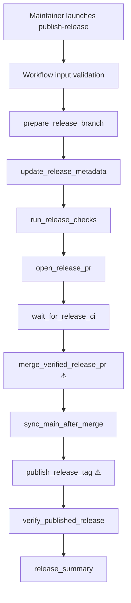

# Publish Release Workflow Technical Design Document / RFC

| Document Metadata      | Details |
| ---------------------- | ------- |
| Author(s)              | Norin Lavaee |
| Status                 | Approved for implementation |
| Team / Owner           | Atomic maintainers |
| Created / Last Updated | 2026-06-10 |

## 1. Executive Summary

This RFC proposes a project-local Atomic workflow named `publish-release` under `.atomic/workflows/publish-release.ts` to automate the repo's documented release/prerelease process. It accepts a required `target_version`, a required `release_kind` (`release` or `prerelease`), starts from the maintainer's current source branch/commit, creates `release/<version>` or `prerelease/<version>` from that exact current HEAD, and uses tracked stages to prepare changelogs/version bumps, validate with Bun typecheck and unit tests, open and merge a GitHub PR to `main`, tag the merged commit, push the tag, monitor publishing, and summarize the release. The two dangerous doors are `merge_verified_release_pr` and `publish_release_tag`; they funnel irreversible remote effects through named workflow stages with explicit success/failure handling.

## 2. Context and Motivation

### 2.1 Current State

The release process is documented in `AGENTS.md` and currently depends on an agent or maintainer manually executing the sequence. The repo already supports project-local workflows from `.atomic/workflows/*.{ts,js,mjs,cjs}` and local workflow files import `defineWorkflow` and `Type` from `@bastani/workflows`.

Relevant current constraints:

- Release flow is tag-driven: branch/PR merge does not publish; pushing a version tag does.
- Version bumping must use `bun run scripts/bump-version.ts <version>` followed by `bun install`.
- Changelog updates must be under each package `CHANGELOG.md` `## [Unreleased]` section.
- Development commands must use Bun except npm publish itself inside CI.
- Workflow definitions must export `defineWorkflow(...).compile()` and declare all outputs explicitly.

### 2.2 The Problem

Manual release execution is long, stateful, and contains remote side effects. The risky operations are spread across chat instructions rather than a reusable, inspectable workflow graph. Failures in CI or publish monitoring require structured handoff back to the maintainer instead of silent partial progress.

## 3. Goals and Non-Goals

### 3.1 Functional Goals

- Provide a workflow named `publish-release` discoverable from `.atomic/workflows`.
- Require `target_version` and `release_kind` up front.
- Validate release versions:
  - `release`: `MAJOR.MINOR.PATCH`
  - `prerelease`: `MAJOR.MINOR.PATCH-alpha.REVISION`
- Create branch `release/<version>` or `prerelease/<version>` from the exact current HEAD/source commit, not by resetting to `main` first.
- Update changelogs and versions according to `AGENTS.md`.
- Run `bun run typecheck` and `bun run test:unit` before PR creation.
- Create a PR from the release/prerelease branch to `main`, wait for CI, enable auto-merge / merge when checks pass.
- Keep the release/prerelease branch after merge.
- After merge, switch to `main`, pull `origin/main`, tag `<version>`, push tag, and monitor publish action.
- Return a compact result with status, version, kind, PR reference, tag, and summary.

### 3.2 Non-Goals

- Do not publish directly from the local machine.
- Do not support arbitrary prerelease labels beyond `alpha`.
- Do not introduce new release scripts or build steps.
- Do not modify workflow discovery/runtime internals.
- Do not bypass CI, force-push tags, or merge on failing checks.

### 3.3 Backwards Compatibility

This is an additive project-local workflow. It must not change existing package APIs, workflow SDK behavior, release scripts, CI configuration, or discovery semantics. Existing `.atomic/workflows` contract/HIL fixtures remain untouched.

## 4. Proposed Solution (High-Level Design)

### 4.1 System Architecture Diagram



### 4.2 Architectural Pattern

Selected starter pattern: **Classify-and-act + loop until done + adversarial verification**.

- Classify-and-act: `release_kind` selects branch prefix and version regex.
- Loop until done: CI and publish monitoring are bounded wait/check stages that continue until success/failure evidence exists.
- Adversarial verification: local validation and CI/publish status stages verify the generated release state before dangerous doors proceed.

### 4.3 Key Components

| Component | Responsibility | Implementation |
| --------- | -------------- | -------------- |
| Workflow definition | Declares inputs/outputs and tracked stages | `.atomic/workflows/publish-release.ts` |
| Agent stages | Execute git/Bun/gh release work with tool access | `ctx.task(...)` prompts |
| Human/runtime failure handling | Ask user only when checks fail or publish fails | Stage prompt uses available UI/tooling; workflow remains inspectable |
| Output contract | Expose release status and references | Declared `.output(...)` keys |

### 4.4 The Door Set at a Glance

`launch_publish_release`, `validate_release_request`, `prepare_release_branch`, `update_release_metadata`, `run_release_checks`, `open_release_pr`, `wait_for_release_ci`, `merge_verified_release_pr` ⚠, `sync_main_after_merge`, `publish_release_tag` ⚠, `verify_published_release`, `summarize_release`.

## 5. Detailed Design

### 5.1 The Doors (Entrypoint Contracts)

```ts
type ReleaseKind = "release" | "prerelease";
type ReleaseStatus = "completed" | "blocked" | "failed";

launch_publish_release(input: { target_version: string; release_kind: ReleaseKind }): ReleaseRun
// Guarantee: starts exactly one tracked release workflow for the supplied version.

validate_release_request(input): ValidReleaseRequest | VersionFormatError
// Guarantee: returns typed release metadata only when kind and version format agree.

merge_verified_release_pr(pr: ReleasePr): MergedReleasePr | CiFailure
// Guarantee: merges only a PR whose required checks have passed. IRREVERSIBLE remote effect.

publish_release_tag(merged: MergedReleasePr): PublishedTag | TagFailure
// Guarantee: pushes the version tag that triggers CI publishing. IRREVERSIBLE remote effect.
```

| Door | Joint | One-sentence guarantee | Refusals | Chokepoint |
| ---- | ----- | ---------------------- | -------- | ---------- |
| `validate_release_request` | Release request validity | Produces validated release metadata. | Wrong release/prerelease format; leading `v`; invalid alpha revision. | Input airlock |
| `merge_verified_release_pr` ⚠ | Merge release PR | Merges only verified release changes. | Failing CI; missing PR; wrong branch; gh auth failure. | Sole merge door |
| `publish_release_tag` ⚠ | Publish release tag | Pushes the tag that starts publishing. | Missing main sync; existing tag; failed merge; git push failure. | Sole publish trigger |
| `verify_published_release` | Release completion evidence | Reports publish outcome from GitHub Actions. | Failed action; timed out/unknown status. | Final verification gate |

### 5.2 Workflow Inputs

```ts
.input("target_version", Type.String({ description: "Version to publish, without a leading v." }))
.input("release_kind", Type.Union([Type.Literal("release"), Type.Literal("prerelease")], { description: "Release type; must match target_version format." }))
```

The workflow should fail early when:

- `release_kind === "release"` and `target_version` does not match `^\d+\.\d+\.\d+$`.
- `release_kind === "prerelease"` and `target_version` does not match `^\d+\.\d+\.\d+-alpha\.[1-9]\d*$`.
- `target_version` starts with `v`.

### 5.3 Workflow Outputs

```ts
.output("status", Type.Union([Type.Literal("completed"), Type.Literal("blocked"), Type.Literal("failed")]))
.output("target_version", Type.String())
.output("release_kind", Type.Union([Type.Literal("release"), Type.Literal("prerelease")]))
.output("branch", Type.String())
.output("pr_url", Type.Optional(Type.String()))
.output("tag", Type.Optional(Type.String()))
.output("summary", Type.String())
```

### 5.4 Stage Plan

1. `validate-release-request` — deterministic TypeScript validation in the workflow body.
2. `prepare-release-branch-and-metadata` — toolful stage that:
   - inspects git state and records source branch/source SHA,
   - creates `release/<version>` or `prerelease/<version>` from the exact current HEAD/source commit,
   - updates relevant changelogs under `## [Unreleased]`,
   - runs `bun run scripts/bump-version.ts <version>` and `bun install`,
   - commits changes.
3. `run-release-checks` — toolful stage that runs `bun run typecheck` and `bun run test:unit`.
4. `open-release-pr` — toolful stage that pushes branch and creates/reuses a PR targeting `main` with `gh`, verifying PR base/head/SHA with `gh pr view --json`.
5. `wait-for-release-ci-and-merge` — toolful stage that waits for checks and merges/automerge when checks pass, does not delete the release/prerelease branch, and reports actionable failure details if checks fail.
6. Deterministic merge verification in the workflow body — runs `gh pr view <pr-url-or-branch> --json state,mergedAt,mergeCommit,baseRefName,headRefName,headRefOid,url` and `git ls-remote --heads origin <release-branch>`; GitHub state, not an LLM status marker, is the source of truth before tagging.
7. `tag-and-monitor-publish` — toolful stage that syncs main, creates/pushes tag, and monitors release/publish action.
8. Workflow returns summary outputs.

Large command output should stay in stage transcripts/artifacts, while the final returned `summary` stays compact.

## 6. Alternatives Considered

| Option | Pros | Cons | Decision |
| ------ | ---- | ---- | -------- |
| One giant stage | Simple file | Harder to inspect, recover, and attach to precise failure points | Rejected |
| Deterministic shell script | Repeatable | Loses workflow graph/HIL/status benefits and needs exact gh/CI scripting | Rejected |
| Multi-stage workflow with toolful agents | Inspectable, resumable, aligns with Atomic workflow model | Depends on agent/tool competence for command adaptation | Selected |

## 7. Cross-Cutting Concerns

- **Security:** The workflow relies on local git and `gh` credentials; it must not fabricate success when auth is missing.
- **Irreversibility:** Merging and tag pushing are separate honest doors; after the merge stage, the workflow body performs a deterministic GitHub verification so a formatting error in an agent response cannot block after a successful merge.
- **Failure behavior:** CI/publish failures produce `blocked`/`failed` summaries with evidence rather than continuing.
- **Concurrency:** The workflow should refuse dirty or conflicting git state unless the stage can safely commit existing release changes as intended.
- **Bun compliance:** All local validation/version/dependency commands use Bun.
- **Evidence:** Stage responses should prefer programmatically verifiable `git`/`gh` evidence such as source SHAs, PR JSON fields, check status, remote branch presence, tag SHA, and Actions run URLs over prose assertions.

## 8. Test Plan

- Typecheck the new workflow with `bun run typecheck`.
- Reload workflow discovery with the workflow tool.
- Inspect workflow inputs with `workflow({ action: "inputs", workflow: "publish-release" })`.
- Review prompt contents to confirm they capture source HEAD before branch creation, create the release/prerelease branch from that exact HEAD, target PRs to `main`, retain the release/prerelease branch after merge, and request compact `git`/`gh` evidence.
- Perform safe negative validation by running with a mismatched version/kind and confirming early failure, e.g. prerelease kind with `1.2.3`.
- Do not run a real happy-path release as validation unless explicitly authorized because it can push branches/tags and trigger publishing.

## 9. Open Questions / Unresolved Issues

Resolved before implementation:

- Workflow name: `publish-release`.
- Authority: fully autonomous after required inputs; pause/report only on failures or missing credentials.
- Inputs: require both `target_version` and `release_kind`.
- Local validation: run `bun run typecheck` and `bun run test:unit` before PR creation.
