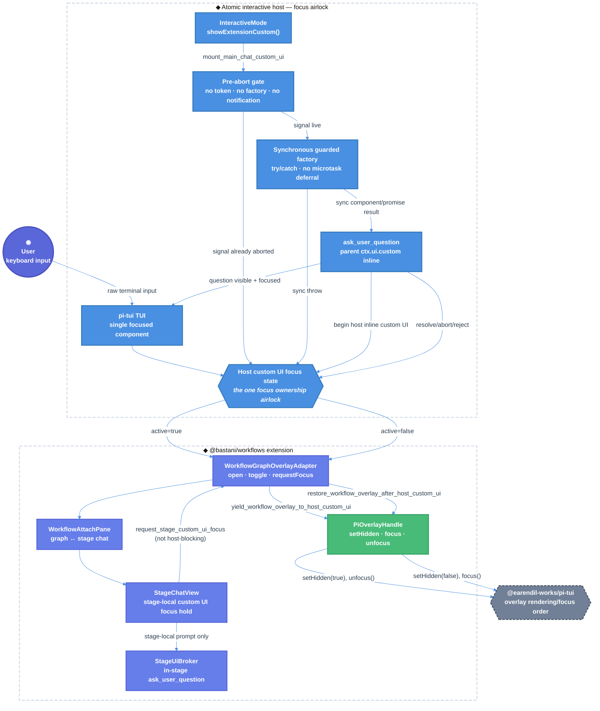
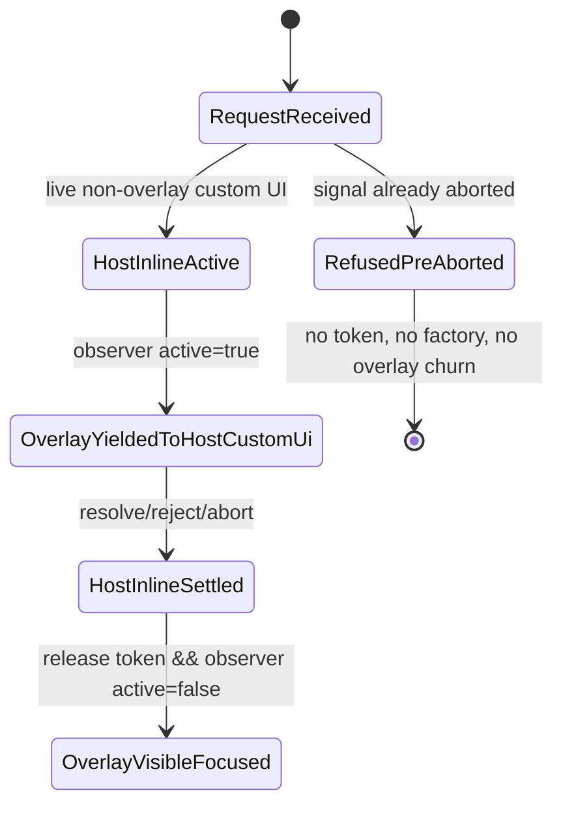

# Atomic Workflow Overlay Focus Arbitration Technical Design Document / RFC

| Document Metadata      | Details                                     |
| ---------------------- | ------------------------------------------- |
| Author(s)              | Norin Lavaee                                |
| Status                 | Draft (WIP)                                 |
| Team / Owner           | Atomic CLI / Workflows UI                   |
| Created / Last Updated | 2026-06-12 / 2026-06-12 (Iteration 5 of 10) |

## 1. Executive Summary

GitHub issue [bastani-inc/atomic#1353](https://github.com/bastani-inc/atomic/issues/1353) reports that the full-screen workflow graph overlay can freeze when the parent main-chat agent opens `ask_user_question`. The root cause is focus contention: the workflow overlay reclaims focus through `WorkflowGraphOverlayAdapter.requestFocus()` and `StageChatView`’s focus-hold timer while the parent question mounts as an inline `ctx.ui.custom()` replacement in `InteractiveMode.showExtensionCustom()`.

This RFC proposes a backward-compatible focus arbitration seam between the Atomic interactive host and the workflows overlay. When a host-owned inline custom UI is active, the workflow overlay yields with `setHidden(true)` + `unfocus()` and later restores with `setHidden(false)` + `focus()`.

Iteration 5 incorporates review round 4: pre-aborted `ctx.ui.custom(..., { signal })` calls must not acquire the host inline focus token. The selected design checks `signal.aborted` before `beginHostInlineCustomUi()`, then invokes the factory synchronously inside `try/catch` and wraps only the returned value in `Promise.resolve(...)`.

## 2. Context and Motivation

### 2.1 Current State

The current working tree contains most of the focus arbitration architecture:

- **Host custom UI state:** `packages/coding-agent/src/core/extensions/types.ts:153-186` defines optional `HostCustomUiState`, `getHostCustomUiState()`, and `onHostCustomUiStateChange()` APIs.
- **Interactive host state:** `packages/coding-agent/src/modes/interactive/interactive-mode.ts:2540-2552` tracks `blockingInlineCustomUiDepth` and releases state idempotently.
- **Parent custom UI mount path:** `InteractiveMode.showExtensionCustom()` mounts inline custom UI in `packages/coding-agent/src/modes/interactive/interactive-mode.ts:2966-3068`.
- **Current remaining regression:** `showExtensionCustom()` currently initializes `releaseHostInlineCustomUi` with `beginHostInlineCustomUi()` at `packages/coding-agent/src/modes/interactive/interactive-mode.ts:2970-2972`, before checking `options.signal.aborted` at `packages/coding-agent/src/modes/interactive/interactive-mode.ts:3020-3023`.
- **Workflow overlay observer path:** `packages/workflows/src/tui/overlay-adapter.ts:183-188` observes host custom UI active/inactive notifications and calls yield/restore.
- **False churn risk:** A pre-aborted parent custom UI currently emits an active/inactive pair for a UI that will never mount, causing `yieldToHostCustomUi()` at `packages/workflows/src/tui/overlay-adapter.ts:155-163` and `restoreAfterHostCustomUi()` at `packages/workflows/src/tui/overlay-adapter.ts:166-174`.
- **Workflow overlay mount path:** `packages/workflows/src/tui/overlay-adapter.ts:122` builds `WorkflowGraphOverlayAdapter`, which relies on synchronous overlay factory side effects for same-turn no-remount.
- **Stage-local prompt path:** Workflow-stage `ctx.ui.custom()` remains brokered into the attached stage chat through `StageUiBroker` and `StageChatView._showCustomUi()`.
- **Repository hygiene:** Current `git status --short` no longer shows the root generated `*-report.md` artifacts flagged in review round 1.

**Focus doors:**

- `showExtensionCustom()` is the host-owned inline custom UI door.
- `beginHostInlineCustomUi()` / its release closure are the host focus ownership token door.
- `WorkflowGraphOverlayAdapter` is the workflow overlay yield/restore door.
- `StageUiBroker` and `StageChatView` remain the stage-local HIL door and must not be treated as parent host-blocking UI.

### 2.2 The Problem

- **User Impact:** With the workflow graph overlay open, a parent-session `ask_user_question` can make the TUI appear frozen. Keyboard input no longer reaches the graph, and the structured question cannot be reached or answered.
- **Product Impact:** Workflows become unreliable during clarification flows, especially when a long-running workflow is open while the parent agent asks a planning or scope question.
- **Technical Debt:** Focus ownership must be arbitrated at a single host-owned boundary instead of scattered across `InteractiveMode.showExtensionCustom()`, `WorkflowGraphOverlayAdapter`, `WorkflowAttachPane`, and `StageChatView`.
- **Review Round 4 Regression:** Pre-aborted custom UI calls acquire and release host focus state despite never mounting a component, causing false overlay hide/restore churn.

### 2.3 Review Findings Addressed

| Review Round | Finding | Required Resolution |
| ------------ | ------- | ------------------- |
| Round 1 | `[P2] Remove generated review artifacts from the tree` | Resolved; keep root generated reports absent before landing. |
| Round 1 | `[P2] Release host custom UI state on sync factory throws` | Keep cleanup guarantee. |
| Round 2 | Reviewer A findings | No findings. |
| Round 2 | Reviewer B findings | Reviewer infrastructure failure only; superseded by valid later reviews. |
| Round 3 | `[P2] Preserve synchronous custom UI factory invocation` | Use immediate `try/catch` plus `Promise.resolve(factoryResult)`. |
| Round 3 | `[P2] Keep custom UI factories synchronous` | Do not defer factory invocation into a microtask. |
| Round 4 | `[P2] Don’t acquire host focus for pre-aborted custom UI` | Check `options.signal.aborted` before `beginHostInlineCustomUi()` and assert no host state notifications for pre-aborted calls. |

### Compatibility Posture

Breaking changes are disallowed. `@bastani/atomic` is a published package with documented extension UI APIs, and workflow users depend on current `/workflow`, `ctx.ui.custom()`, `ask_user_question`, and stage-local HIL behavior.

## 3. Goals and Non-Goals

### 3.1 Functional Goals

- [ ] When the workflow overlay is visible and the parent main-chat agent opens `ask_user_question`, the parent question must be visible and answerable.
- [ ] The workflow overlay must not become input-dead, permanently hidden, or remounted as scrollback noise.
- [ ] The overlay must yield non-destructively with `OverlayHandle.setHidden(true)` / `unfocus()` and restore with `setHidden(false)` / `focus()` only when appropriate.
- [ ] Overlay focus reassertion paths must no-op while a host-owned blocking inline custom UI is active.
- [ ] Host inline custom UI state must always be released on resolve, reject, abort, async factory rejection, and synchronous factory throw.
- [ ] Pre-aborted custom UI calls must not acquire host inline custom UI state or emit active/inactive host state notifications.
- [ ] Custom UI factories must be invoked synchronously in the same call stack as `ctx.ui.custom()` unless the signal is already aborted.
- [ ] `WorkflowGraphOverlayAdapter.open()` called twice in the same turn must not remount duplicate graph overlays.
- [ ] Immediate abort after `ctx.ui.custom()` returns must not allow a previously uninvoked factory to run later.
- [ ] Stage-local workflow prompts must continue to mount inside the attached workflow stage chat and retain existing #1120 focus fixes.
- [ ] Existing `/workflow connect`, F2 overlay open, graph navigation, Ctrl+D hide/detach, and `workflow send` behavior must remain unchanged.
- [ ] Generated root report artifacts must remain out of the repository tree before landing.
- [ ] Validation must use Bun commands only.

### 3.2 Non-Goals (Out of Scope)

- [ ] Do not redesign `ask_user_question` question schemas, answer envelopes, or tool semantics.
- [ ] Do not convert every `ask_user_question` dialog into an overlay.
- [ ] Do not add nested workflow graph overlays; workflow `ctx.ui.custom({ overlay: true })` remains unsupported in the graph viewer.
- [ ] Do not change workflow execution, stage scheduling, HIL persistence, or `/workflow send` answer coercion.
- [ ] Do not introduce a public breaking change to `ExtensionUIContext.custom()`, `OverlayHandle`, or workflow APIs.
- [ ] Do not solve general multi-overlay stacking for arbitrary third-party extensions beyond this host-inline-custom-UI conflict.
- [ ] Do not keep internal orchestration reports in the repository root.
- [ ] Do not publish, release, or submit a PR in this stage.

## 4. Proposed Solution (High-Level Design)

### 4.1 System Architecture Diagram



### 4.2 Architectural Pattern

Use a **single focus-owner arbitration pattern** plus **synchronous factory preservation**:

- The Atomic host owns the global truth of “a blocking inline custom UI is active.”
- Pre-aborted custom UI requests exit before acquiring host focus ownership.
- Workflow overlays observe host state and yield/restore themselves through their existing `OverlayHandle`.
- Stage-local workflow custom UI remains local to `StageUiBroker` and `StageChatView`.
- Parent inline custom UI factories run synchronously, with synchronous throws caught explicitly.

### 4.3 Key Components

| Component | Responsibility | Technology Stack | Justification |
| --------- | -------------- | ---------------- | ------------- |
| `InteractiveMode.showExtensionCustom()` | Mounts extension custom UI and preserves lifecycle ordering | TypeScript, `@earendil-works/pi-tui` | Must remain the host-side focus and factory lifecycle chokepoint. |
| `beginHostInlineCustomUi()` | Creates the host focus ownership token | TypeScript closure | Must only run for live non-overlay custom UI requests. |
| `ExtensionUIContext` | Optional host custom UI state observer API | TypeScript interfaces | Additive/backward-compatible seam for first-party overlays. |
| `WorkflowGraphOverlayAdapter` | Owns workflow overlay handle and focus restoration | TypeScript, workflows TUI | Relies on accurate host state and synchronous overlay factory side effects. |
| `WorkflowAttachPane` | Swaps graph/stage-chat interiors and records visibility | TypeScript component | Existing `setVisible()` integrates with yielding. |
| `StageChatView` | Keeps stage-local prompts focusable in the overlay | TypeScript component | Must preserve existing #1120 mid-turn stage prompt behavior. |
| `ask_user_question` | Parent/session structured question tool | TypeScript tool | Reuses host `ctx.ui.custom()`; no tool schema or answer format changes. |
| Repository hygiene gate | Keeps generated orchestration reports out of commits | Git status / artifact policy | Prevents internal review artifacts from being committed. |

### 4.4 The Door Set at a Glance (Stranger-Across-Time View)

`open_workflow_overlay`, `hide_workflow_overlay`, `close_workflow_overlay`, `request_workflow_overlay_focus`, `mount_main_chat_custom_ui`, `refuse_pre_aborted_custom_ui`, `construct_custom_ui_component_synchronously`, `begin_host_inline_custom_ui`, `release_host_inline_custom_ui`, `yield_workflow_overlay_to_host_custom_ui`, `resolve_main_chat_question`, `restore_workflow_overlay_after_host_custom_ui`, `mount_stage_custom_ui`, `answer_stage_custom_ui`

No door guards an irreversible runtime effect; this change controls UI focus and visibility only.

## 5. Detailed Design

### 5.1 The Doors (Entrypoint Contracts)

```ts
mount_main_chat_custom_ui<T>(
  factory: CustomUiFactory<T>,
  options?: CustomUiOptions,
): Promise<T>
// Guarantee: mounts a host-owned custom UI and releases host focus ownership on every exit.
// Failures: Aborted | FactoryThrewSynchronously | FactoryRejected | ComponentDisposed | UiUnavailable
// Refusals: overlay custom UI does not become a blocking inline custom UI.
```

```ts
refuse_pre_aborted_custom_ui(
  signal?: AbortSignal,
): Result<void, Aborted>
// Guarantee: rejects an already-aborted custom UI request before host focus state changes.
// Failures: Aborted
// Refusals: cannot invoke factory, acquire host token, or notify host state listeners.
```

```ts
construct_custom_ui_component_synchronously<T>(
  factory: CustomUiFactory<T>,
  done: (result: T) => void,
): CustomUiComponent | Promise<CustomUiComponent>
// Guarantee: invokes the factory before ctx.ui.custom() returns.
// Failures: FactoryThrewSynchronously
// Refusals: factory invocation cannot be deferred into a microtask.
```

```ts
begin_host_inline_custom_ui(): ReleaseHostInlineCustomUi
// Guarantee: marks a live parent inline custom UI as the current focus owner.
// Failures: none; nested calls increment depth.
// Refusals: cannot be called for pre-aborted requests.
```

```ts
release_host_inline_custom_ui(release: ReleaseHostInlineCustomUi): void
// Guarantee: releases exactly one host inline custom UI ownership claim.
// Failures: none; duplicate release is a no-op.
// Refusals: depth cannot become negative.
```

```ts
on_host_custom_ui_state_change(
  listener: (state: HostCustomUiState) => void,
): Unsubscribe
// Guarantee: notifies observers when host inline custom UI active/inactive state changes.
// Failures: ListenerThrows is swallowed without breaking UI cleanup.
// Refusals: observer receives only state, not prompt data.
```

```ts
yield_workflow_overlay_to_host_custom_ui(): void
// Guarantee: hides a visible workflow overlay without resolving or remounting it.
// Failures: OverlayNotMounted | OverlayAlreadyHidden | HandleUnavailable
// Refusals: does not cancel workflow runs, brokered prompts, or stage chat state.
```

```ts
restore_workflow_overlay_after_host_custom_ui(): void
// Guarantee: restores only the workflow overlay that this host custom UI yield hid.
// Failures: OverlayClosed | HostCustomUiStillActive | UserHiddenOverlay
// Refusals: does not reopen overlays the user explicitly hid or closed.
```

```ts
request_workflow_overlay_focus(): void
// Guarantee: focuses the visible workflow overlay only when host focus is not blocked.
// Failures: OverlayNotMounted | OverlayHidden | HostInlineCustomUiActive
// Refusals: cannot steal focus from a parent inline custom UI.
```

```ts
mount_stage_custom_ui(request: StageCustomUiRequest): Promise<void>
// Guarantee: mounts a stage-owned custom UI inside the attached workflow stage chat.
// Failures: MissingTuiHost | OverlayModeUnsupported | BrokerRejected | Aborted
// Refusals: stage-local custom UI cannot create a nested overlay.
```

**Per-door audit:**

| Door | (1) Joint | (2) One sentence, no "and" | (3) Honest name | (5) Every exit | (6) Refusals real | (7) Trust transition | (8) One chokepoint |
| ---- | --------- | -------------------------- | --------------- | -------------- | ----------------- | -------------------- | ------------------ |
| `mount_main_chat_custom_ui` | ✅ host modal mount | ✅ mounts a host-owned custom UI | ✅ | abort/reject/resolve/factory throw | ✅ overlay mode excluded from blocking state | ✅ host focus airlock | ✅ parent inline custom UI door |
| `refuse_pre_aborted_custom_ui` | ✅ abort gate | ✅ rejects before host state changes | ✅ | aborted / proceed | ✅ no token, factory, notification | ✅ host focus airlock | ✅ pre-abort chokepoint |
| `construct_custom_ui_component_synchronously` | ✅ factory construction | ✅ invokes factory before return | ✅ | sync throw / returned value | ✅ no microtask deferral | n/a | ✅ factory timing door |
| `begin_host_inline_custom_ui` | ✅ focus ownership claim | ✅ marks live inline UI as focus owner | ✅ | release / nested depth | ✅ pre-aborted requests excluded | ✅ focus ownership airlock | ✅ active-state source |
| `release_host_inline_custom_ui` | ✅ focus ownership release | ✅ releases one active claim | ✅ | duplicate release no-op | ✅ depth clamped at zero | ✅ focus ownership airlock | ✅ cleanup chokepoint |
| `yield_workflow_overlay_to_host_custom_ui` | ✅ focus handoff | ✅ hides workflow overlay without resolving it | ✅ | mounted/hidden/no-handle | ✅ cannot cancel workflow | n/a | ✅ overlay yield chokepoint |
| `restore_workflow_overlay_after_host_custom_ui` | ✅ focus restoration | ✅ restores only auto-yielded overlay | ✅ | closed/still-active/user-hidden | ✅ no reopen of user-hidden overlay | n/a | ✅ overlay restore chokepoint |
| `request_workflow_overlay_focus` | ✅ focus request | ✅ focuses overlay only when allowed | ✅ | hidden/focused/host-blocked | ✅ host block prevents focus steal | n/a | ✅ all overlay re-focus paths use it |
| `mount_stage_custom_ui` | ✅ stage-local HIL mount | ✅ mounts stage UI inside attached chat | ✅ | missing host/unsupported overlay/abort | ✅ nested overlay rejected | n/a | ✅ stage broker path |

### 5.2 API Interfaces — The Same Doors on the Wire

This feature has no HTTP/gRPC wire surface. The “wire” is the TUI and extension API surface.

```ts
// Parent main-chat structured question.
ask_user_question(params)
  -> ctx.ui.custom<QuestionnaireResult>(factory, { signal })
  -> refuse_pre_aborted_custom_ui
  -> mount_main_chat_custom_ui
```

```ts
// Workflow overlay entrypoints.
F2
/workflow connect <run-id>
workflow({ action: "connect" })
  -> GraphOverlayPort.open(runId, ctx)
  -> open_workflow_overlay
```

```ts
type HostCustomUiState = {
  blockingInlineCustomUiDepth: number;
  blockingInlineCustomUiActive: boolean;
};

type HostCustomUiStateListener = (state: HostCustomUiState) => void;

interface ExtensionUIContext {
  getHostCustomUiState?(): HostCustomUiState;
  onHostCustomUiStateChange?(
    listener: HostCustomUiStateListener,
  ): () => void;
}
```

Required `showExtensionCustom()` lifecycle ordering:

```ts
let releaseHostInlineCustomUi: (() => void) | undefined;

const releaseHostCustomUi = () => {
  releaseHostInlineCustomUi?.();
};

if (options?.signal?.aborted) {
  rejectAndClose(options.signal.reason ?? new Error("Extension custom UI aborted"));
  return;
}

options?.signal?.addEventListener("abort", abortCustomUi, { once: true });

if (!isOverlay) {
  releaseHostInlineCustomUi = this.beginHostInlineCustomUi();
}

let factoryResult:
  | (Component & { dispose?(): void })
  | Promise<Component & { dispose?(): void }>;

try {
  factoryResult = factory(this.ui, theme, this.keybindings, close);
} catch (error) {
  rejectAndClose(error);
  return;
}

Promise.resolve(factoryResult)
  .then((component) => {
    if (closed) {
      component.dispose?.();
      return;
    }

    if (!isOverlay) {
      editorContainer.clear();
      editorContainer.addChild(component);
      ui.setFocus(component);
      mounted = true;
      ui.requestRender();
      return;
    }

    const handle = ui.showOverlay(component, resolveOptions());
    mounted = true;
    options?.onHandle?.(handle);
  })
  .catch((error) => {
    rejectAndClose(error);
  });
```

Explicitly forbidden patterns:

```ts
// Do not use this: it defers factory side effects past ctx.ui.custom() return.
Promise.resolve().then(() => factory(this.ui, theme, this.keybindings, close));

// Do not do this: it emits false host active/inactive for pre-aborted UI.
const release = this.beginHostInlineCustomUi();
if (options?.signal?.aborted) abortCustomUi();
```

Existing hosts that do not implement the optional observer methods continue to compile and run. Workflows must treat absence as `blockingInlineCustomUiActive === false`.

### 5.3 Data Model / Schema

No persistent database schema is required. The change adds ephemeral in-memory UI state.

| State | Owner | Type | Constraints | Description |
| ----- | ----- | ---- | ----------- | ----------- |
| `blockingInlineCustomUiDepth` | `InteractiveMode` | `number` | integer, `>= 0` | Count of active non-overlay host custom UI mounts. |
| `hostCustomUiStateListeners` | `InteractiveMode` | `Set<HostCustomUiStateListener>` | listeners removed on unsubscribe | Broadcasts active/inactive changes to extension overlays. |
| `releaseHostInlineCustomUi` | `showExtensionCustom()` | `(() => void) \| undefined` | assigned only after pre-abort check; idempotent release | Releases the active host custom UI claim. |
| `closed` | `showExtensionCustom()` | `boolean` | monotonic false → true | Ensures resolve/reject/abort/sync-throw cleanup runs once. |
| `mounted` | `showExtensionCustom()` | `boolean` | true only after UI is mounted | Avoids restoring editor for a factory that never mounted. |
| `factoryResult` | `showExtensionCustom()` | `Component \| Promise<Component>` | assigned synchronously or routes throw to cleanup | Preserves factory side effects before `ctx.ui.custom()` returns. |
| `overlayYieldedToHostCustomUi` | `WorkflowGraphOverlayAdapter` | `boolean` | true only when this adapter hid the overlay | Prevents restoring overlays hidden by the user. |
| `currentHandle` | `WorkflowGraphOverlayAdapter` | `PiOverlayHandle \| null` | null after close | Existing overlay control handle for `setHidden`, `focus`, `unfocus`, `hide`. |
| `currentView.visible` | `WorkflowAttachPane` | `boolean` | synced through `setVisible()` | Keeps stage attached state/status tags consistent with overlay visibility. |

### 5.4 Algorithms and State Management

**Host inline custom UI lifecycle**

1. `showExtensionCustom()` determines `isOverlay = options?.overlay ?? false`.
2. If the abort signal is already aborted, reject through the normal cleanup path before:
   - acquiring `beginHostInlineCustomUi()`;
   - registering host active state;
   - notifying host custom UI listeners;
   - invoking the factory.
3. Register the abort listener only after the pre-abort check.
4. For non-overlay custom UI, use `beginHostInlineCustomUi()` to mark the host as owning focus.
5. Invoke the custom UI factory synchronously inside `try/catch`.
6. If the factory throws synchronously, call `rejectAndClose(error)` and return.
7. Wrap the returned component or promise with `Promise.resolve(factoryResult)`.
8. Mount the component and call `ui.setFocus(component)` as today.
9. On resolve, reject, abort, async factory rejection, or synchronous factory throw:
   - remove abort listener;
   - restore the editor only if `mounted === true`;
   - dispose the component if present;
   - release host inline custom UI state if acquired;
   - resolve/reject the promise exactly once.

**Workflow overlay yield**

1. On observer `active=true`, `WorkflowGraphOverlayAdapter` checks:
   - mounted;
   - `currentHandle !== null`;
   - not already hidden;
   - not already yielded.
2. If visible, call:
   - `currentView?.setVisible(false)`;
   - `setMouseScrollTracking(false)`;
   - `currentHandle.setHidden(true)`;
   - `currentHandle.unfocus()`;
   - set `overlayYieldedToHostCustomUi = true`.

**Workflow overlay restore**

1. On observer `active=false`, only restore if `overlayYieldedToHostCustomUi === true`.
2. If still mounted and handle exists:
   - `currentView?.setVisible(true)`;
   - `setMouseScrollTracking(currentView?.wantsMouseScrollTracking() ?? true)`;
   - `currentHandle.setHidden(false)`;
   - `currentHandle.focus()`;
   - request render.
3. Clear the yielded flag.
4. If the overlay was closed or explicitly hidden by user action, skip restore.

**Focus request guard**

Every workflow auto-focus path must consult the host block predicate before calling `focus()`:

- `refocusVisibleOverlayForAwaitingInput()` in `packages/workflows/src/tui/overlay-adapter.ts`.
- `requestFocus` in `packages/workflows/src/tui/overlay-adapter.ts`.
- mounted-hidden reopen/toggle paths where a host inline custom UI is active.

**Repository hygiene**

1. Root generated reports must remain absent:
   - `analysis-report.md`
   - `bun-preflight-report.md`
   - `implementation-report.md`
   - `locator-report.md`
   - `preflight-report.md`
   - `validation-report.md`
2. Future generated reports should be written to `/tmp`, `.atomic/workflows/runs/`, or another ignored artifact directory.
3. `git status --short` must not show untracked root orchestration reports.

**State machine**



## 6. Alternatives Considered

| Option | Pros | Cons | Reason for Rejection |
| ------ | ---- | ---- | -------------------- |
| **A: Guard overlay `requestFocus()` only** | Smallest code change | Full-screen overlay can still cover the parent inline question | Rejected because it fixes focus stealing but not visibility. |
| **B: Render parent `ask_user_question` above the workflow overlay** | Keeps workflow overlay visible | Changes global `ask_user_question` behavior and requires z-order guarantees | Rejected as broader and riskier. |
| **C: Disable or queue parent `ask_user_question` while workflow overlay is open** | Avoids simultaneous surfaces | Blocks legitimate parent clarification flows | Rejected because the question should remain answerable. |
| **D: Host observer + non-destructive overlay yield/restore (Selected)** | Uses existing `setHidden`/`unfocus`, preserves overlay state | Adds an optional focus-state observer seam | Selected because it solves focus and visibility with bounded scope. |
| **E: Defer factory through `Promise.resolve().then(...)`** | Routes sync throws into promise rejection | Breaks same-turn overlay no-remount and creates abort-before-microtask side effects | Rejected by review round 3. |
| **F: Immediate factory `try/catch` + `Promise.resolve(factoryResult)` (Selected)** | Preserves synchronous factory contract and catches sync throws | Slightly more verbose implementation | Selected because it satisfies both round 1 and round 3 findings. |
| **G: Acquire host focus token before checking pre-abort** | Simple cleanup path | Emits false active/inactive state and causes overlay yield/restore churn for cancelled UI | Rejected by review round 4. |
| **H: Ignore generated report files until PR time** | No code work | High risk of accidentally committing internal artifacts | Rejected by review round 1. |

## 7. Cross-Cutting Concerns

### 7.1 Security and Privacy

- The focus airlock exposes only boolean/depth state, never question text, option labels, answers, or component internals.
- `ask_user_question` result envelopes and workflow HIL answer handling remain unchanged.
- No new network calls, files, tokens, or persistence are introduced.
- Listener failures must not prevent cleanup.
- Existing non-interactive/headless policies remain intact.

### 7.2 Reliability

- Host inline custom UI token release must be idempotent.
- Pre-aborted requests must not acquire or release a token.
- Synchronous custom UI factory throws, async rejections, aborts, and normal resolutions must share one cleanup path.
- Custom UI factory invocation must stay synchronous to preserve overlay no-remount guards.
- User-hidden overlays must not be restored by host custom UI deactivation.
- Workflow overlay state must not be remounted or committed to scrollback during yield/restore.

### 7.3 Accessibility and UX

- Parent questions should be visually reachable immediately when opened.
- Cancelled pre-aborted questions must not produce visible overlay flicker or unexpected graph focus.
- Restored workflow overlays should return to the same graph/stage-chat state without scrollback duplication.
- Keyboard focus after question close should land on the workflow overlay if it was visible before the question; otherwise it should remain on the editor/default host focus.
- Stage-local workflow questions must continue to show inside the attached stage chat.

### 7.4 Repository Hygiene

- Generated reports from agent orchestration are not product artifacts and must not live at repo root when the implementation lands.
- If such reports are useful during development, they should be written under `/tmp` or an ignored run/artifact directory.
- Validation must include a `git status --short` check for unexpected untracked generated reports.

## Backwards Compatibility

Breaking changes are disallowed.

Compatibility-sensitive surfaces that must be preserved:

- `ExtensionUIContext.custom<T>(factory, options?)` signature in `packages/coding-agent/src/core/extensions/types.ts`.
- The synchronous custom UI factory invocation timing of `ctx.ui.custom()`.
- Pre-aborted `ctx.ui.custom()` calls must reject without mounting, focusing, or emitting host custom UI state.
- `OverlayHandle` methods and semantics documented in `packages/coding-agent/docs/tui.md`.
- `ask_user_question` tool parameters, validation, abort behavior, loader visibility behavior, and response envelope.
- Workflow `ctx.ui.custom()` broker behavior, including rejection of nested `overlay: true`.
- `/workflow` commands, F2 shortcut behavior, graph overlay toggle/hide semantics, and `workflow send`.
- Existing tests around #1120, #1137, #1141, #1148, and #1261.

The host custom UI observer remains optional and additive. Older/minimal UI contexts that only implement `custom` must continue to work. Workflows must feature-detect observer methods and default to current behavior if unavailable.

## 8. Test Plan

- **Unit Tests:**
  - Verify synchronous non-overlay custom UI factory throws release host state.
  - Verify asynchronous non-overlay custom UI factory rejection releases host state.
  - Verify the custom UI factory runs synchronously before `showExtensionCustom()` / `ctx.ui.custom()` returns.
  - Verify a pre-aborted signal does not invoke the factory.
  - Add/strengthen the pre-aborted signal test to assert no host custom UI state listener events are emitted.
  - Verify immediate abort after `ctx.ui.custom()` returns does not cause an uninvoked factory to run later.
  - Keep existing `ask_user_question` abort signal and loader restore tests passing.

- **Integration Tests:**
  - Verify visible graph overlay yields/restores around host inline custom UI.
  - Verify a user-hidden overlay is not restored by host inactive.
  - Verify store-update refocus is suppressed while host inline UI is active.
  - Verify stage-chat focus hold is suppressed while host inline UI is active.
  - Add a pre-aborted host custom UI / visible overlay regression: assert no `setHidden(true)`, `setHidden(false)`, `unfocus()`, or `focus()` calls occur.
  - Verify same-turn no-remount: call `adapter.open("run-1")` and `adapter.open("run-2")` in the same turn through the real/synchronous host custom path and assert only one `ctx.ui.custom` mount occurs.
  - Existing tests around visible retarget focus (#1120), toggle `setHidden`, Ctrl+D hide, and full-screen overlay mount must continue to pass.

- **Repository Hygiene Tests / Checks:**
  - Confirm root generated reports are absent.
  - Run `git status --short` and confirm no untracked root report files remain.
  - Run `git diff --check origin/main`.

- **Validation Commands:**
  1. `bun test test/integration/overlay-entrypoints.test.ts`
  2. `bun test test/unit/stage-chat-view.test.ts`
  3. `bun test packages/coding-agent/test/interactive-mode-status.test.ts`
  4. `bun test packages/coding-agent/test/ask-user-question-tool.test.ts`
  5. `bun run typecheck`
  6. `git diff --check origin/main`
  7. `git status --short`

- **Manual Verification:**
  1. Start an interactive Atomic session.
  2. Start a background workflow and open the graph overlay with F2 or `/workflow connect <run-id>`.
  3. Trigger a parent main-chat `ask_user_question`.
  4. Expected: workflow overlay yields or is hidden, the question is visible and answerable, and after answering the overlay returns focused and navigable.
  5. Repeat with a deliberately broken extension custom UI factory that throws synchronously.
  6. Expected: no stuck `blockingInlineCustomUiActive` state; workflow overlay focus behavior recovers.
  7. Trigger a pre-aborted parent question while the workflow overlay is visible.
  8. Expected: no overlay hide/show flicker and no unexpected focus change.
  9. Trigger two overlay opens in the same command turn.
  10. Expected: no duplicate overlay remount and no scrollback pollution.

- **Fuzz / Property Tests:**
  - Randomize host custom UI active/inactive events with overlay open/hide/close calls and assert:
    - overlay handle calls never remount;
    - hidden depth never becomes negative;
    - `focus()` is never called while host active=true;
    - user-hidden overlays are not restored by host inactive=false transitions;
    - pre-aborted requests emit zero host state events;
    - sync/async factory failures always leave host custom UI depth at zero;
    - no factory side effect occurs after cancellation unless the factory already ran synchronously before cancellation.

## 9. Open Questions / Unresolved Issues

- [ ] Should `getHostCustomUiState()` / `onHostCustomUiStateChange()` be documented as a supported public extension API or described as an advanced host capability for first-party overlays? `[OWNER: Atomic CLI maintainers]`
- [ ] If multiple extension overlays are visible, should all capturing overlays yield to a parent inline custom UI, or only the workflow graph overlay? `[OWNER: TUI/platform team]`
- [ ] What should happen if the user presses F2 or `/workflow connect` while a parent `ask_user_question` is active? `[OWNER: workflows team]`
- [ ] Should restore focus return to the workflow overlay if the workflow run ended while the parent question was open? `[OWNER: workflows team]`
- [ ] Should `.gitignore` gain a dedicated ignored artifact directory for future agent-generated reports, or should orchestration always write such reports outside the repo? `[OWNER: repo maintainers]`
