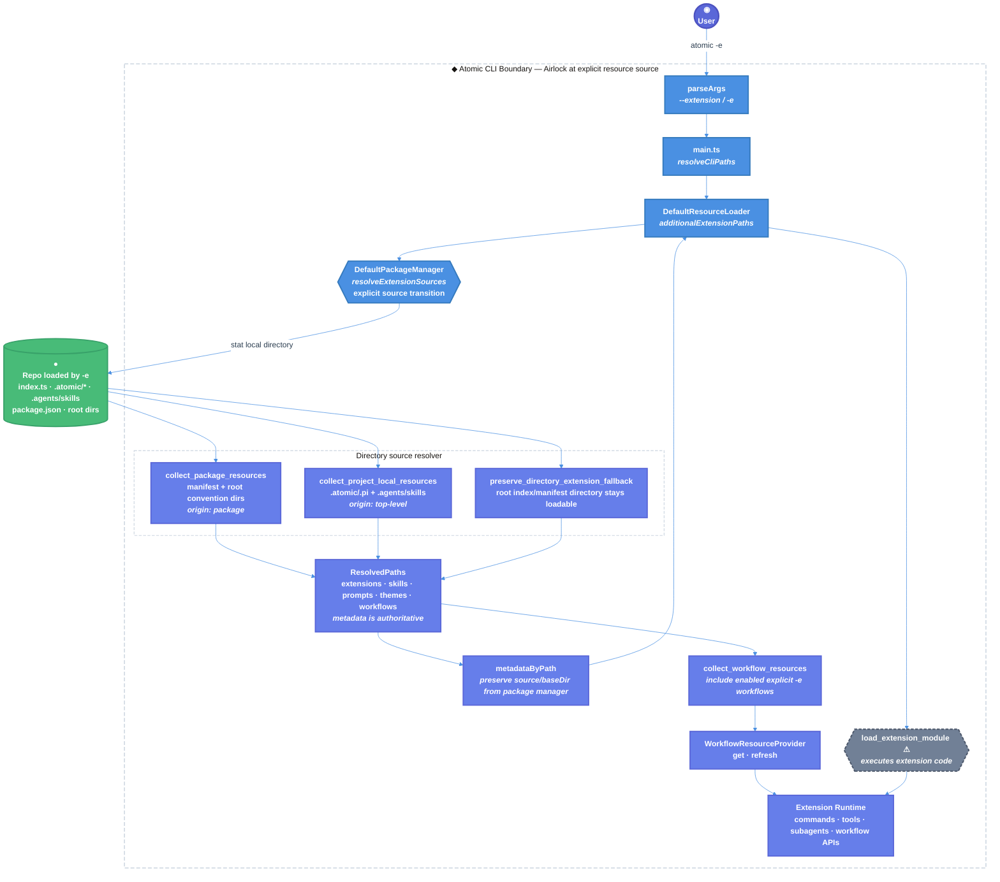

# Atomic `-e` Project-Local Resource Discovery Technical Design Document / RFC

| Document Metadata      | Details                                                                 |
| ---------------------- | ----------------------------------------------------------------------- |
| Author(s)              | Norin Lavaee                                                            |
| Status                 | Draft (WIP)                                                             |
| Team / Owner           | Atomic Coding Agent Core / Resource Discovery                           |
| Created / Last Updated | 2026-06-12 / 2026-06-12                                                 |
| Compatibility Posture  | Backward-compatible bug fix; no public API removals or breaking changes |

## 1. Executive Summary

GitHub issue [bastani-inc/atomic#1354](https://github.com/bastani-inc/atomic/issues/1354) reports that `atomic -e <REPO_PATH>` treats a repository strictly as a package source and misses that repo’s project-local resources under `.atomic/*` and `.agents/skills`. The same resources load when Atomic runs with that repo as `cwd`, so users borrowing another checkout’s agent setup through `-e` silently lose skills, extension-registered tools/subagents, prompts, themes, and workflows.

This RFC proposes four coordinated fixes. First, local directory sources resolved by `DefaultPackageManager.resolveExtensionSources()` should collect both package resources and project-local resources through a new `collect_project_local_resources` door. Second, workflows discovered from explicit `-e` project-local dirs must be forwarded by `DefaultResourceLoader.collectWorkflowResources()` even though their metadata remains `origin: "top-level"`. Third, project-local resource discovery must not suppress the legacy local-directory extension fallback when the source directory itself is loadable as an extension, such as a root `index.ts`. Fourth, `DefaultResourceLoader` must preserve package-manager provenance for borrowed `-e` resources instead of restamping them as generic `source: "cli"`.

The dangerous code-execution doors remain few: extension entrypoints still execute only through `load_extension_module` ⚠, and workflow files are exposed only through the existing `WorkflowResourceProvider`.

## 2. Context and Motivation

PRD / issue source: [GitHub issue #1354](https://github.com/bastani-inc/atomic/issues/1354).

Review findings addressed:

- **Review round 1 — [P2] Include project-local `-e` workflows in loader results.** The package-manager change discovers `.atomic/.pi` workflows from `-e <dir>`, but marks them `origin: "top-level"`. `DefaultResourceLoader.collectWorkflowResources()` includes only `origin: "package"` workflows, so `loader.getWorkflowResources()` and `/workflow` miss borrowed project-local workflows. This RFC resolves the finding by keeping honest `top-level` provenance and changing only explicit-CLI workflow aggregation.
- **Review round 2 — [P2] Preserve extension-directory fallback when local resources exist.** The in-progress condition skips adding a local directory extension fallback whenever any `.atomic` / `.pi` / `.agents` resource exists. A previously valid `atomic -e ./my-ext` directory with `./my-ext/index.ts` and `.atomic/skills/foo/SKILL.md` would load the skill but silently drop the extension. This RFC resolves the finding by decoupling project-local resource collection from the “directory itself is an extension” fallback.
- **Review round 3 — [P2] Keep borrowed `-e` resource provenance.** `DefaultPackageManager` returns project-local borrowed resources with useful metadata such as `source: <repo>`, `scope: "temporary"`, `origin: "top-level"`, and `baseDir: <repo>/.atomic`, but `DefaultResourceLoader.reload()` currently overwrites CLI extension/skill metadata with `{ source: "cli", scope: "temporary", origin: "top-level" }`. This RFC resolves the finding by treating `ResolvedResource.metadata` from `cliExtensionPaths` as authoritative.

Relevant prior art:

- `packages/coding-agent/docs/packages.md:48-52` documents `--extension` / `-e` as a temporary package-loading path.
- `packages/coding-agent/docs/packages.md:116-167` documents package local paths, manifests, and root convention directories.
- `packages/coding-agent/docs/skills.md:24-39` documents project `.atomic/skills`, legacy `.pi/skills`, and `.agents/skills` discovery.
- `packages/coding-agent/docs/security.md:5-29` documents project trust and the fact that explicit CLI `-e` extensions load before trust resolution.
- `specs/2026-02-14-mcp-project-level-config-discovery-fix.md` and `specs/2026-02-09-skill-loading-from-configs-and-ui.md` establish the pattern that project-local convention paths should be honored consistently across user-facing discovery entrypoints.

### 2.1 Current State

- **CLI entrypoint:** `packages/coding-agent/src/cli/args.ts:158` parses `--extension` / `-e` into `parsed.extensions`.
- **Path normalization:** `packages/coding-agent/src/main.ts:468` resolves local CLI paths; `main.ts:633` computes `resolvedExtensionPaths`; `main.ts:688` passes them to `DefaultResourceLoader` as `additionalExtensionPaths`.
- **Resource loader:** `packages/coding-agent/src/core/resource-loader.ts:608-621` calls `DefaultPackageManager.resolveExtensionSources(additionalExtensionPaths, { temporary: true })`.
- **Package-source resolver:** `packages/coding-agent/src/core/package-manager.ts:997-1005` treats those sources as temporary package sources.
- **Directory handling:** `package-manager.ts:1345-1375` calls `collectPackageResources()` and the in-progress `collectProjectLocalResources()` for a local directory source.
- **Project-local collection:** `package-manager.ts:2184-2257` collects `.atomic/.pi` resources and `.agents/skills` for a supplied source root. It intentionally sets `origin: "top-level"` at `package-manager.ts:2191`.
- **Extension-directory fallback regression:** the in-progress condition at `package-manager.ts:1374-1375` suppresses the legacy directory fallback when `collectProjectLocalResources()` returns true, even if `resolveExtensionEntries()` would recognize a root `index.ts`, `index.js`, or manifest-declared extension entry at `package-manager.ts:559-586`.
- **Workflow forwarding gap:** `resource-loader.ts:625-639` exposes workflow resources only when `metadata.origin === "package"`, so `-e` project-local workflows are discovered by the package manager but dropped by the loader.
- **Provenance overwrite gap:** `resource-loader.ts:466-472` currently stamps `cliExtensionPaths.extensions` and `cliExtensionPaths.skills` as `{ source: "cli", scope: "temporary", origin: "top-level" }` before `getEnabledPaths()` can record the metadata returned by the package manager. Loaded `Skill.sourceInfo` and `Extension.sourceInfo` then lose the borrowed repo path and `baseDir`.
- **SourceInfo propagation:** `resource-loader.ts:735-746` applies source info to extensions and their commands/tools; `resource-loader.ts:666-732` uses the same metadata lookup path for skills, prompts, and themes.
- **Config dir compatibility:** `packages/coding-agent/src/config.ts:487-490` defines `.atomic` plus legacy `.pi`; `config.ts:627-644` exposes `getProjectConfigDirs(cwd)`.

A read-only reproduction of the original bug showed local cwd discovery and `-e` discovery diverging:

```json
{
  "local": {
    "skills": [
      ".atomic/skills/local-skill/SKILL.md",
      ".agents/skills/agents-skill/SKILL.md"
    ],
    "extensions": [
      ".atomic/extensions/myext/index.ts"
    ]
  },
  "viaE": {
    "skills": [
      "skills/pkg-skill/SKILL.md"
    ],
    "extensions": []
  }
}
```

**Leaking doors today:**

- `resolveExtensionSources(...)` sounds like it resolves extension sources, but it actually resolves package resources and is the only `-e` path.
- `collectPackageResources(...)` honestly handles package resources, but without a project-local companion it makes repo/project intent leak into package-only mechanics.
- `collectWorkflowResources(...)` currently compresses “workflow resources visible to `/workflow`” into “package-origin workflows only,” which is dishonest for explicit `-e` project-local workflows.
- The in-progress `if (!packageResources && !projectLocalResources)` condition treats “found a skill/prompt/theme/workflow” as “do not load the root extension,” which conflates separate doors.
- The hardcoded `source: "cli"` metadata path collapses multiple borrowed repositories into indistinguishable resources.

### 2.2 The Problem

- **User Impact:** A repo’s custom skills, extension-registered tools/subagents, prompts, themes, and workflows appear when running Atomic inside the repo but disappear when the same repo is loaded with `atomic -e <REPO_PATH>`.
- **Extension Impact:** A valid extension directory loaded by `-e` can silently disappear if the same directory also contains `.atomic`, `.pi`, or `.agents` project-local resources.
- **Workflow Impact:** Even after project-local files are collected by the package manager, `.atomic/workflows/*.ts` and `.pi/workflows/*.ts` from an explicit `-e` repo remain invisible to `/workflow` unless loader workflow forwarding changes.
- **Provenance Impact:** Borrowed skills/extensions can load but appear as generic `cli` resources without `baseDir`, making multiple `-e` repos indistinguishable and preventing accurate resource attribution.
- **Business Impact:** The `-e` workflow looks broken or unreliable for users trying to borrow another checkout’s Atomic configuration without changing directories.
- **Technical Debt:** Discovery semantics are split across “package root,” “project root,” “directory extension fallback,” “workflow resources,” and “source provenance” doors. These joints need separate conditions instead of one package-resource boolean or generic CLI label controlling all behavior.

## 3. Goals and Non-Goals

### 3.1 Functional Goals

- [ ] `atomic -e <local-directory>` discovers `<dir>/.atomic/extensions`, `<dir>/.atomic/skills`, `<dir>/.atomic/prompts`, `<dir>/.atomic/themes`, and `<dir>/.atomic/workflows`.
- [ ] Legacy `<dir>/.pi/*` project resource directories remain supported through `getProjectConfigDirs(dir)`.
- [ ] `atomic -e <local-directory>` discovers `<dir>/.agents/skills` using the same nested `SKILL.md` rules as normal project discovery.
- [ ] Existing package discovery remains intact: `package.json` `atomic` / legacy `pi` manifest entries and root convention dirs still load.
- [ ] Project-local resources collected from package/CLI directory sources keep honest `origin: "top-level"` provenance.
- [ ] A local directory source that is itself loadable as an extension remains loadable even when project-local resources are also discovered.
- [ ] A directory with only project-local resources and no loadable root extension entrypoint does not get added as a bogus extension fallback solely because project-local resources exist.
- [ ] `DefaultResourceLoader.getWorkflowResources()` includes enabled workflow resources from explicit `-e` sources, including `origin: "top-level"` `.atomic/.pi` workflows.
- [ ] `ExtensionAPI.getWorkflowResources()` and `ExtensionAPI.refreshWorkflowResources()` expose borrowed `.atomic/.pi` workflows from explicit `-e` repos.
- [ ] Loaded borrowed `Skill.sourceInfo`, `PromptTemplate.sourceInfo`, `Theme.sourceInfo`, `Extension.sourceInfo`, command `sourceInfo`, and tool `sourceInfo` preserve `ResolvedResource.metadata` from the package manager.
- [ ] Borrowed `-e` project-local resources remain attributable to the actual source directory, not a synthetic `source: "cli"` label.
- [ ] `.atomic/extensions` loaded via `-e` can register tools and subagents through the existing extension runtime; tools/subagents are not introduced as standalone resource types.
- [ ] `DefaultPackageManager.resolveExtensionSources([repo], { temporary: true })` returns project-local resources in `ResolvedPaths`.
- [ ] `DefaultResourceLoader` propagates source metadata so loaded resources remain attributable to the explicit `-e` source.
- [ ] `--no-extensions`, `--no-skills`, `--no-prompt-templates`, and `--no-themes` retain current explicit-CLI behavior: explicit `-e` resources remain additive.
- [ ] Add regression tests for package manager resolution, directory extension fallback preservation, resource-loader workflow forwarding, and borrowed-resource provenance using Bun.

### 3.2 Non-Goals (Out of Scope)

- [ ] Do not add standalone `tools/` or `subagents/` resource types; tools/subagents continue to come from loaded extensions.
- [ ] Do not change `package.json` manifest schema or remove root convention package dirs.
- [ ] Do not remove legacy `pi` manifest or `.pi` directory compatibility.
- [ ] Do not introduce a sandbox or a new security boundary for extension or workflow execution.
- [ ] Do not change npm/git package installation, update, or clone behavior in this iteration.
- [ ] Do not make `-e` persist packages or mutate user/project settings.
- [ ] Do not broaden loader workflow forwarding for all top-level settings/project workflows unless they came from explicit `-e` sources.
- [ ] Do not rewrite extension loading or change whether fallback resources are represented as the directory path versus the resolved `index.ts`.
- [ ] Do not replace `SourceInfo` or `PathMetadata` with a new provenance model.
- [ ] Do not implement UI changes beyond any existing diagnostics.
- [ ] Do not publish, release, or submit a PR in this RFC stage.

## Backwards Compatibility

Atomic is a published package with real downstream users, so this work must preserve backward compatibility.

Compatibility-sensitive surfaces to preserve:

- CLI: `atomic -e ./file.ts`, `atomic -e ./extension-dir`, `atomic -e ./package-dir`, `atomic -e npm:...`, and `atomic -e git:...`.
- Directory extension fallback behavior: a local directory source with root `index.ts`, root `index.js`, or manifest-declared extension entries remains loadable.
- Public/internal APIs used by tests and extensions: `DefaultPackageManager.resolveExtensionSources()`, `DefaultResourceLoaderOptions.additionalExtensionPaths`, `ResolvedPaths`, `ResolvedResource`, `PathMetadata`, and `SourceInfo`.
- Package layouts: `package.json` `atomic` / `pi` manifests and root `extensions/`, `skills/`, `prompts/`, `themes/`, `workflows/`.
- Workflow extension contract: `DefaultResourceLoader.getWorkflowResources()`, `ExtensionAPI.getWorkflowResources()`, and `ExtensionAPI.refreshWorkflowResources()`.
- Legacy config: `.pi` and `pi` manifest keys.
- Resource disabling semantics and current `--no-*` behavior for explicitly supplied CLI paths.

The proposed change is additive for explicit local directory sources: resources that already loaded continue to load. Package-origin resources should retain precedence over project-local resources collected from package sources, matching the current `resourcePrecedenceRank()` intent where package resources rank ahead of project-local resources collected from package sources. Workflow provenance must not be falsified to preserve compatibility with resource attribution and future policy decisions. Existing `source: "cli"` fallback behavior may remain only for truly synthetic CLI resources that have no package-manager metadata; it must not overwrite `ResolvedResource.metadata`.

## 4. Proposed Solution (High-Level Design)

### 4.1 System Architecture Diagram



### 4.2 Architectural Pattern

Adopt a **unified local directory-source discovery adapter** inside the package manager, paired with **explicit-source workflow forwarding** and **metadata-preserving resource loading** inside the resource loader:

- A directory source can expose package resources.
- The same directory source can expose project-local resources.
- The same directory source can remain a root extension fallback if it is loadable as an extension.
- These outcomes are additive and represented in the existing `ResolvedPaths` model.
- `ResolvedResource.metadata` is the authoritative provenance carrier across package-manager and resource-loader boundaries.
- Workflow resources from explicit `-e` sources are forwarded if enabled, regardless of `origin`.
- Configured and builtin workflow resources continue to use the existing package-origin filter.
- Extension execution remains centralized in the existing resource loader / extension loader path.

This avoids creating a second CLI-specific resolver, keeps resource provenance honest, and fixes all review findings without broadening all top-level workflow semantics.

### 4.3 Key Components

| Component | Responsibility | Technology Stack | Justification |
| --- | --- | --- | --- |
| `parseArgs` | Parse `--extension` / `-e` into repeatable source values | TypeScript, Bun runtime | Existing CLI door in `packages/coding-agent/src/cli/args.ts:158` |
| `resolveCliPaths` | Resolve local CLI paths against startup cwd | TypeScript | Existing path normalization in `packages/coding-agent/src/main.ts:468` |
| `DefaultResourceLoader` | Merge settings, CLI, builtin package resources and load final resources | TypeScript | Existing orchestration point in `packages/coding-agent/src/core/resource-loader.ts` |
| `DefaultPackageManager.resolveExtensionSources` | Resolve explicit extension/package sources into `ResolvedPaths` | TypeScript | Existing `-e` resolver in `package-manager.ts:997-1005` |
| `collectPackageResources` | Collect package manifest/root convention resources | TypeScript | Preserve existing package behavior in `package-manager.ts:2116-2165` |
| `collectProjectLocalResources` | Collect `.atomic`/`.pi` project dirs and `.agents/skills` for a supplied root | TypeScript | Missing parity door for issue #1354; currently located at `package-manager.ts:2184` |
| `resolveExtensionEntries` | Detect whether a directory has manifest, `index.ts`, or `index.js` extension entrypoints | TypeScript | Existing entrypoint detector at `package-manager.ts:559-586`; use it to preserve fallback |
| `metadataByPath` population | Carry package-manager `PathMetadata` to loaded `SourceInfo` | TypeScript | Must not overwrite borrowed resources with generic `source: "cli"` |
| `collectWorkflowResources` | Expose workflow resources to the workflows extension | TypeScript | Must include enabled explicit `-e` workflows, not only package-origin workflows |
| `collectAuto*Entries` helpers | Reuse current file discovery rules for extensions, skills, prompts, themes, workflows | TypeScript | Prevents divergent skill and extension semantics |
| `SourceInfo` / `PathMetadata` | Preserve resource provenance and scope | TypeScript | Existing attribution model in `packages/coding-agent/src/core/source-info.ts` |
| Regression tests | Lock package-manager discovery, extension fallback preservation, workflow forwarding, and provenance | `bun:test` / current test runner setup | Required to prevent recurrence |

### 4.4 The Door Set at a Glance (Stranger-Across-Time View)

`parse_extension_flag`, `resolve_cli_paths`, `resolve_extension_sources`, `collect_package_resources`, `collect_project_local_resources`, `preserve_directory_extension_fallback`, `preserve_borrowed_resource_provenance`, `forward_explicit_workflow_resources`, `load_extension_module` ⚠, `register_extension_tools` ⚠, `load_skill_definitions`, `load_prompt_templates`, `provide_workflow_resources` ⚠

## 5. Detailed Design

### 5.1 The Doors (Entrypoint Contracts)

```ts
resolve_extension_sources(
  sources: readonly ExtensionSource[],
  scope: "temporary" | "project" | "user",
): Result<ResolvedPaths, SourceResolutionError>
// Guarantee: expands explicit extension/package sources into enabled resource paths.
// SourceResolutionError = MissingLocalSource | InstallFailed | InvalidPackageSource

collect_package_resources(
  package_root: DirectoryPath,
  accumulator: ResourceAccumulator,
  filter: PackageFilter | undefined,
  metadata: PathMetadata,
): CollectionResult
// Guarantee: collects package manifest and root convention resources without inspecting project-local config dirs.
// CollectionResult = { found: boolean }

collect_project_local_resources(
  source_root: DirectoryPath,
  accumulator: ResourceAccumulator,
  filter: PackageFilter | undefined,
  metadata: PathMetadata,
): CollectionResult
// Guarantee: collects project-local resources for a directory explicitly supplied as a source.
// CollectionResult = { found: boolean }

preserve_directory_extension_fallback(
  source_root: DirectoryPath,
  package_resources_found: boolean,
  project_local_resources_found: boolean,
): ExtensionFallbackDecision
// Guarantee: keeps a loadable directory extension visible even when project-local resources were collected.
// ExtensionFallbackDecision = AddDirectoryExtension | DoNotAddDirectoryExtension

preserve_borrowed_resource_provenance(
  resources: readonly ResolvedResource[],
  metadata_by_path: MetadataByPath,
): MetadataByPath
// Guarantee: records package-manager metadata for borrowed resources without overwriting it with a generic CLI label.

forward_explicit_workflow_resources(
  cli_workflows: readonly ResolvedResource[],
  configured_workflows: readonly ResolvedResource[],
  builtin_workflows: readonly ResolvedResource[],
): ResolvedResource[]
// Guarantee: exposes every enabled explicit-source workflow while preserving package-only workflow forwarding elsewhere.

load_extension_module(
  entrypoint: ExtensionEntrypoint,
  source_info: SourceInfo,
): Result<LoadedExtension, ExtensionLoadError>
// Guarantee: executes one extension entrypoint under the existing extension runtime. DANGEROUS.
// ExtensionLoadError = MissingEntrypoint | ImportFailed | InvalidDefaultExport | RuntimeRegistrationError

provide_workflow_resources(
  resources: readonly ResolvedResource[],
): WorkflowResourceProvider
// Guarantee: gives the workflows extension the current workflow resource list.
// The provider may cause workflow definitions to be imported later by the workflows extension. DANGEROUS.
```

Refusals enforced by the design:

- A directory with no package resources and no project-local resources remains eligible for the existing directory fallback.
- A directory with project-local resources and a root extension entrypoint remains eligible for the existing directory fallback.
- A directory with project-local resources but no root extension entrypoint is not added as a bogus extension solely because project-local resources exist.
- `.agents/skills` root `.md` files remain ignored because the helper reuses `collectAutoSkillEntries(..., "agents")`.
- `.atomic/skills` root `.md` files remain allowed because the helper reuses `collectAutoSkillEntries(..., "pi")`.
- No standalone tools/subagents paths are accepted; only extension entrypoints can register tools/subagents.
- Legacy `.pi` is included only through `getProjectConfigDirs(source_root)`, not through ad hoc string duplication.
- Project-local `.atomic/.pi` workflow metadata is not relabeled to `origin: "package"` just to pass the loader filter.
- Top-level configured workflow resources outside explicit `-e` sources are not newly exposed by this fix.
- Borrowed resources with package-manager metadata are not restamped as `source: "cli"`.

**Per-door audit (run the rubric):**

| Door | (1) Joint | (2) One sentence, no "and" | (3) Honest name | (5) Every exit | (6) Refusals real | (7) Trust transition | (8) One chokepoint |
| --- | --- | --- | --- | --- | --- | --- | --- |
| `resolve_extension_sources` | ✅ explicit source resolution | ✅ “expands explicit sources into resource paths” | ⚠ name is legacy but documented | missing local path → empty/diagnostic; install failure → error | source type parsed before collection | ✅ explicit `-e` source enters resource graph here | n/a |
| `collect_package_resources` | ✅ package resource joint | ✅ “collects package resources” | ✅ | manifest, convention dirs, or none | does not scan `.atomic`/`.agents` | n/a | n/a |
| `collect_project_local_resources` | ✅ project-local resource joint | ✅ “collects project-local resources” | ✅ | config dirs, agents skills, or none | no tools/subagents resource type | n/a | n/a |
| `preserve_directory_extension_fallback` | ✅ extension-directory joint | ✅ “keeps loadable directories visible” | ✅ | add directory; skip directory | requires entrypoint when project-local resources exist | n/a | ✅ fallback decision centralized |
| `preserve_borrowed_resource_provenance` | ✅ provenance joint | ✅ “records package-manager metadata” | ✅ | metadata kept; fallback only when absent | cannot collapse borrowed repos into `cli` | n/a | ✅ source attribution happens here |
| `forward_explicit_workflow_resources` | ✅ workflow visibility joint | ✅ “exposes enabled explicit workflows” | ✅ | enabled CLI workflows included; disabled skipped | configured top-level workflows stay excluded | n/a | ✅ workflow resource visibility is here |
| `load_extension_module` ⚠ | ✅ executable extension joint | ✅ “executes one extension entrypoint” | ✅ danger explicit | import/load/register errors surfaced | only extension entrypoints execute code | ✅ code execution after source resolution | ✅ extension code execution remains here |
| `provide_workflow_resources` ⚠ | ✅ workflow resource joint | ✅ “gives workflows extension resources” | ✅ | stale state refreshed via provider | only loader-selected resources are visible | n/a | ✅ workflow exposure remains here |
| `register_extension_tools` ⚠ | ✅ runtime registration joint | ✅ “registers tool definitions from loaded extensions” | ✅ | invalid definitions rejected by existing runtime | no registration without loaded extension | n/a | ✅ tools/subagents come through extensions |

### 5.2 API Interfaces — The Same Doors on the Wire

Atomic has a CLI and TypeScript API surface rather than HTTP routes. The wire-level doors are:

```bash
# Explicit temporary source loading
atomic -e /path/to/repo
atomic --extension /path/to/repo

# Existing explicit-resource behavior remains
atomic --no-extensions -e /path/to/repo
atomic --no-skills -e /path/to/repo

# Local package settings continue to use package manager resolution
atomic install /path/to/package
atomic install ./relative-package
```

TypeScript entrypoints:

```ts
new DefaultResourceLoader({
  cwd,
  agentDir,
  additionalExtensionPaths: [repoPath],
});

await new DefaultPackageManager({
  cwd,
  agentDir,
  settingsManager,
}).resolveExtensionSources([repoPath], { temporary: true });
```

Workflow-facing API doors:

```ts
const loader = new DefaultResourceLoader({
  cwd,
  agentDir,
  additionalExtensionPaths: [repoPath],
});

await loader.reload();
loader.getWorkflowResources();

pi.getWorkflowResources();
await pi.refreshWorkflowResources();
```

Provenance-facing API expectations:

```ts
const skill = loader.getSkills().skills.find((s) => s.name === "borrowed");
skill?.sourceInfo?.source; // repoPath, not "cli"
skill?.sourceInfo?.scope;  // "temporary"
skill?.sourceInfo?.origin; // "top-level" for .atomic/.pi/.agents
skill?.sourceInfo?.baseDir; // repoPath/.atomic, repoPath/.pi, or repoPath/.agents
```

Honest exits:

- Missing explicit local path: existing extension path error in `DefaultResourceLoader`.
- Directory with package resources only: unchanged package resources.
- Directory with project-local resources only and no root extension entrypoint: project-local resources resolved; no fallback directory extension entry.
- Directory with project-local resources and a root `index.ts` / `index.js` / extension manifest: project-local resources resolved; the root directory extension fallback is preserved.
- Directory with both package and project-local resources: union of package and project-local resources, deduped by canonical path.
- Explicit `-e` project-local workflow: present in `loader.getWorkflowResources()` if enabled.
- Explicit `-e` project-local skill/extension/prompt/theme: loaded resource source info retains package-manager metadata.
- Configured top-level non-package workflow: unchanged unless already exposed by existing behavior.
- Extension import failure: existing `extensionsResult.errors` path.

### 5.3 Data Model / Schema

Existing models remain sufficient, but their semantics must be explicit.

**Interface:** `ResolvedPaths`

| Field | Type | Description |
| --- | --- | --- |
| `extensions` | `ResolvedResource[]` | Extension files or extension directory entrypoints |
| `skills` | `ResolvedResource[]` | Skill markdown files / skill directories normalized by loader |
| `prompts` | `ResolvedResource[]` | Prompt markdown files |
| `themes` | `ResolvedResource[]` | Theme JSON files |
| `workflows` | `ResolvedResource[]` | Workflow SDK files |

**Interface:** `ResolvedResource`

| Field | Type | Description |
| --- | --- | --- |
| `path` | `string` | Absolute or resolved local resource path |
| `enabled` | `boolean` | Whether settings/filter rules enable this resource |
| `metadata` | `PathMetadata` | Provenance used for ordering and `SourceInfo` |

**Interface:** `PathMetadata`

| Field | Type | Description |
| --- | --- | --- |
| `source` | `string` | Original package/CLI source string |
| `scope` | `"user" \| "project" \| "temporary"` | Scope; `-e` remains `temporary` |
| `origin` | `"package" \| "top-level"` | Package manifest/root convention vs top-level/project-local resource |
| `baseDir` | `string \| undefined` | Base directory for relative filters/provenance |

**Provenance semantics for this fix:**

| Resource Source | Expected Loaded `SourceInfo.source` | Expected `scope` | Expected `origin` | Expected `baseDir` |
| --- | --- | --- | --- | --- |
| `-e <repo>/.atomic/skills/foo/SKILL.md` | `<repo>` | `temporary` | `top-level` | `<repo>/.atomic` |
| `-e <repo>/.pi/skills/foo/SKILL.md` | `<repo>` | `temporary` | `top-level` | `<repo>/.pi` |
| `-e <repo>/.agents/skills/foo/SKILL.md` | `<repo>` | `temporary` | `top-level` | `<repo>/.agents` |
| `-e <repo>/.atomic/extensions/ext/index.ts` | `<repo>` | `temporary` | `top-level` | `<repo>/.atomic` |
| `-e <repo>/skills/foo/SKILL.md` | `<repo>` | `temporary` | `package` | `<repo>` |
| `-e <repo>/extensions/ext.ts` | `<repo>` | `temporary` | `package` | `<repo>` |
| fallback `-e <repo>` directory extension | `<repo>` | `temporary` | `package` | `<repo>` |
| synthetic inline extension | existing synthetic source | `temporary` | `top-level` | unchanged |

**Origin semantics for workflow forwarding:**

| Resource Source | `scope` | `origin` | Loader Workflow Forwarding |
| --- | --- | --- | --- |
| `-e <dir>/package.json atomic.workflows` | `temporary` | `package` | Included |
| `-e <dir>/workflows/*.ts` | `temporary` | `package` | Included |
| `-e <dir>/.atomic/workflows/*.ts` | `temporary` | `top-level` | Included by explicit-CLI workflow rule |
| `-e <dir>/.pi/workflows/*.ts` | `temporary` | `top-level` | Included by explicit-CLI workflow rule |
| configured package workflows | `user` / `project` | `package` | Included |
| builtin package workflows | `temporary` | `package` | Included |
| non-CLI top-level workflow resources | `user` / `project` | `top-level` | Unchanged; not newly included |

**Directory-source fallback semantics:**

| Directory Contents | Package Resources Found? | Project-Local Resources Found? | Add Directory as Extension Fallback? |
| --- | --- | --- | --- |
| `index.ts` only | No | No | Yes; preserve existing behavior |
| `.atomic/skills/foo/SKILL.md` only | No | Yes | No; avoid bogus extension |
| `index.ts` + `.atomic/skills/foo/SKILL.md` | No | Yes | Yes; review round 2 fix |
| `extensions/pkg.ts` only | Yes | No | No; package convention resource already found |
| `extensions/pkg.ts` + `.atomic/skills/foo/SKILL.md` | Yes | Yes | No; package resources remain authoritative |
| `package.json` with `atomic.extensions` | Yes | Either | No; manifest resources already found |

**Directory schema for a local source root:**

| Path | Resource Type | Collector |
| --- | --- | --- |
| `<root>/package.json` `atomic` / `pi` | All package resource types | `collectPackageResources` |
| `<root>/index.ts`, `<root>/index.js` | Directory extension fallback | `resolveExtensionEntries` / existing fallback |
| `<root>/extensions` | Package extensions | `collectResourceFiles(..., "extensions")` |
| `<root>/skills` | Package skills | `collectResourceFiles(..., "skills")` |
| `<root>/prompts` | Package prompts | `collectResourceFiles(..., "prompts")` |
| `<root>/themes` | Package themes | `collectResourceFiles(..., "themes")` |
| `<root>/workflows`, `<root>/workflow` | Package workflows | `collectResourceFiles(..., "workflows")` |
| `<root>/.atomic/extensions`, `<root>/.pi/extensions` | Project-local extensions | `collectAutoExtensionEntries` |
| `<root>/.atomic/skills`, `<root>/.pi/skills` | Project-local skills | `collectAutoSkillEntries(..., "pi")` |
| `<root>/.atomic/prompts`, `<root>/.pi/prompts` | Project-local prompts | `collectAutoPromptEntries` |
| `<root>/.atomic/themes`, `<root>/.pi/themes` | Project-local themes | `collectAutoThemeEntries` |
| `<root>/.atomic/workflows`, `<root>/.pi/workflows` | Project-local workflows | `collectResourceFiles(..., "workflows")` |
| `<root>/.agents/skills` | Agent Skills standard project skills | `collectAutoSkillEntries(..., "agents")` |

### 5.4 Algorithms and State Management

**Algorithm: local directory source resolution**

1. `resolveLocalExtensionSource()` resolves the source against the relevant base dir.
2. If the source is a file, preserve current behavior: add it as an extension.
3. If the source is a directory:
   1. Build `packageMetadata` with `baseDir: resolved`.
   2. Call `collectPackageResources(resolved, accumulator, filter, packageMetadata)`.
   3. Call `collectProjectLocalResources(resolved, accumulator, filter, packageMetadata)`.
   4. If package resources were not found, decide the directory-extension fallback independently from project-local resource discovery:
      - add the directory fallback when no project-local resources were found, preserving prior behavior;
      - add the directory fallback when project-local resources were found and `resolveExtensionEntries(resolved)` confirms the directory itself is loadable;
      - skip the directory fallback when project-local resources were found and the directory itself has no root extension entrypoint.
4. Return `ResolvedPaths` through the existing `toResolvedPaths()` canonical dedupe and precedence sorting.
5. Preserve package-resource precedence over project-local resources collected from package sources.

Concrete fallback shape:

```ts
const directoryHasExtensionEntrypoint = resolveExtensionEntries(resolved) !== null;
const shouldAddDirectoryExtensionFallback =
  !packageResources && (!projectLocalResources || directoryHasExtensionEntrypoint);

if (shouldAddDirectoryExtensionFallback) {
  this.addResource(accumulator.extensions, resolved, packageMetadata, true);
}
```

This resolves review round 2 because `.atomic` / `.pi` / `.agents` discovery no longer suppresses a root `index.ts` extension directory.

**Algorithm: `collectProjectLocalResources(source_root, ...)`**

1. Compute project config dirs with `getProjectConfigDirs(source_root)`, preserving `.atomic` then legacy `.pi`.
2. Build `projectMetadata` by copying source metadata and setting `origin: "top-level"`.
3. For each config dir:
   - collect `extensions` from `<configDir>/extensions`;
   - collect `skills` from `<configDir>/skills` using mode `"pi"`;
   - collect `prompts` from `<configDir>/prompts`;
   - collect `themes` from `<configDir>/themes`;
   - collect `workflows` from `<configDir>/workflows`.
4. Collect `<source_root>/.agents/skills` using mode `"agents"`.
5. Apply any package filters relative to `source_root`, matching package-source filter semantics.
6. Add resources with the same `scope` as the source (`temporary` for `-e`) and source provenance pointing at the original source string.
7. Return `found: true` if any resource path was added.

**Algorithm: metadata preservation in `DefaultResourceLoader.reload()`**

`ResolvedResource.metadata` from `DefaultPackageManager` must populate `metadataByPath` for every resource type, including CLI `-e` resources. Do not preempt it with hardcoded CLI metadata.

Current broken shape:

```ts
for (const r of cliExtensionPaths.extensions) {
  if (!metadataByPath.has(r.path)) {
    metadataByPath.set(r.path, { source: "cli", scope: "temporary", origin: "top-level" });
  }
}
for (const r of cliExtensionPaths.skills) {
  if (!metadataByPath.has(r.path)) {
    metadataByPath.set(r.path, { source: "cli", scope: "temporary", origin: "top-level" });
  }
}
```

Corrected shape:

```ts
// Prefer the package-manager metadata that already records the borrowed source.
const cliEnabledExtensions = getEnabledPaths(cliExtensionPaths.extensions);
const cliEnabledSkillResources = getEnabledResources(cliExtensionPaths.skills);
const cliEnabledSkills = cliEnabledSkillResources.map(mapSkillPath);
const cliEnabledPrompts = getEnabledPaths(cliExtensionPaths.prompts);
const cliEnabledThemes = getEnabledPaths(cliExtensionPaths.themes);
```

If a dedicated loop is kept for readability, it must use `r.metadata`:

```ts
for (const r of [...cliExtensionPaths.extensions, ...cliExtensionPaths.skills]) {
  if (!metadataByPath.has(r.path)) {
    metadataByPath.set(r.path, r.metadata);
  }
}
```

This resolves review round 3 because loaded resources later call:

- `applyExtensionSourceInfo()` for extensions, commands, and tools;
- `updateSkillsFromPaths()` for skills;
- `updatePromptsFromPaths()` for prompts;
- `updateThemesFromPaths()` for themes;

and all of those resolve against `metadataByPath`.

**Algorithm: `collectWorkflowResources(...)` after review fix**

Do not relabel project-local workflows as package resources. Instead, split workflow forwarding by source class:

```ts
private enabledWorkflowResources(resources: ResolvedResource[]): ResolvedResource[] {
  return resources.filter((resource) => resource.enabled);
}

private enabledPackageWorkflowResources(resources: ResolvedResource[]): ResolvedResource[] {
  return resources.filter((resource) => resource.enabled && resource.metadata.origin === "package");
}

private collectWorkflowResources(
  resolvedPaths: ResolvedPaths,
  cliExtensionPaths: ResolvedPaths,
  builtinPackagePaths: ResolvedPaths,
): ResolvedResource[] {
  return [
    ...this.enabledWorkflowResources(cliExtensionPaths.workflows),
    ...this.enabledPackageWorkflowResources(resolvedPaths.workflows),
    ...this.enabledPackageWorkflowResources(builtinPackagePaths.workflows),
  ];
}
```

This resolves review round 1 because:

- `cliExtensionPaths.workflows` is the explicit `-e` door.
- Explicit-source `.atomic/.pi` workflows remain `origin: "top-level"`.
- `DefaultResourceLoader.getWorkflowResources()` includes them.
- `ExtensionAPI.getWorkflowResources()` and `refreshWorkflowResources()` include them through the existing provider.
- Non-CLI top-level workflow exposure does not broaden.

**State management:**

- No persistent state is added.
- No settings files are modified.
- No new cache is required.
- Existing `ResourceAccumulator` maps and canonical path dedupe remain the source of truth.
- `metadataByPath` remains an in-memory per-reload provenance index.
- `DefaultResourceLoader.workflowResources` remains the in-memory workflow resource state.
- `refreshWorkflowResources()` must recompute with the same explicit-CLI workflow rule as `reload()`.

## 6. Alternatives Considered

| Option | Pros | Cons | Reason for Rejection |
| --- | --- | --- | --- |
| A: Keep status quo and require root package dirs or manifest entries | Zero code change; current package semantics remain simple | Does not fix the issue; project-local resources stay silent no-ops under `-e` | Fails user expectation and issue #1354 |
| B: Tell users to duplicate `.atomic/*` resources into root `skills/`, `extensions/`, etc. | Works today; no resolver changes | Creates duplicated resources, divergent local vs `-e` behavior, and confusing docs | Pushes implementation leakage onto users |
| C: For `-e <dir>`, instantiate a full `DefaultPackageManager` with `cwd = dir` | Maximum parity with normal cwd discovery | Risks loading the target repo’s settings/packages/context behavior unintentionally; introduces recursion/trust ambiguity | Too broad for a targeted bug fix |
| D: Add `collect_project_local_resources` to local directory source resolution | Surgical; reuses existing collectors; preserves package resources; fixes most reported local-dir gaps | Does not by itself expose workflows; can suppress directory fallback if used in the fallback condition | Necessary but insufficient after reviews |
| E: Mark `.atomic/.pi` workflows from `-e` as `origin: "package"` | Smallest local code change to pass loader filter | Lies about provenance; changes precedence; makes project-local resources look like package resources | Rejected because the dishonest metadata is the wrong door |
| F: Include all enabled top-level workflows from all sources | Simple loader logic | Broadens workflow exposure for settings/project resources beyond the issue | Rejected as larger than the bug fix |
| G: Suppress directory fallback whenever project-local resources exist | Avoids bogus extension fallback for project-local-only dirs | Drops valid `index.ts` extension directories that also carry `.atomic` resources | Rejected by review round 2 |
| H: Always add directory fallback when package resources are absent | Preserves legacy fallback | Reintroduces bogus extension entries for project-local-only directories | Rejected because it fails the project-local-only refusal |
| I: Keep hardcoded `source: "cli"` metadata for all additional extension paths | Simple and historically sufficient for single extension files | Loses borrowed repo provenance and base dirs; multiple `-e` repos become indistinguishable | Rejected by review round 3 |
| J: Add `collect_project_local_resources`, explicit-source workflow forwarding, entrypoint-aware fallback preservation, and metadata-preserving loader plumbing (Selected) | Fixes all reported resources; keeps provenance honest; preserves valid root extension directories; avoids bogus project-local-only fallbacks | Requires targeted package-manager and resource-loader tests | Selected as the smallest correct boundary change |
| K: Add a new CLI flag, e.g. `--project-extension <dir>` | Avoids changing `-e` semantics | Adds another door for users to learn; leaves existing `-e` surprising | Rejected because `-e <repo>` already expresses explicit user intent |

## 7. Cross-Cutting Concerns

### 7.1 Security and Privacy

- **The trust transition is explicit:** `atomic -e <dir>` is already an explicit user-selected source. This proposal treats `.atomic/*` and `.agents/skills` inside that explicit directory as part of the same temporary source.
- **The dangerous doors remain singular:** extension code execution still occurs only through `load_extension_module`; workflow resources are exposed only through `WorkflowResourceProvider` and loaded by the existing workflows extension path.
- **No sandbox is implied:** this does not change Atomic’s documented security posture in `packages/coding-agent/docs/security.md`; extensions and workflow files still run with the user’s process permissions when executed/imported by existing loaders.
- **No new PII or telemetry:** resource discovery reads local file paths and package manifests only.
- **Provenance must remain visible:** `SourceInfo` should identify resources as coming from the explicit source path, with `scope: "temporary"` for CLI `-e`.
- **Review round 1 mitigation:** keeping project-local workflows as `origin: "top-level"` avoids disguising project-local code as package code while still making explicit `-e` workflows visible.
- **Review round 2 mitigation:** project-local resources must not decide whether a root extension directory is loadable; the fallback decision must check the directory extension entrypoint joint.
- **Review round 3 mitigation:** borrowed resources must not be collapsed into a generic `cli` source; source attribution is part of the security and audit surface.
- **Project trust ambiguity:** current project trust gates the active `cwd`, while `-e` sources are explicit CLI inputs. Whether a separate trust prompt should ever apply to `-e` targets remains an open question; iteration 4 should preserve current explicit-CLI behavior.

## 8. Test Plan

- **Unit Tests:**
  - Add/keep `packages/coding-agent/test/package-manager.test.ts` coverage that `resolveExtensionSources([repo], { temporary: true })` discovers:
    - `.atomic/skills/<name>/SKILL.md`;
    - `.agents/skills/<name>/SKILL.md`;
    - `.atomic/extensions/<name>/index.ts`;
    - `.atomic/prompts/*.md`;
    - `.atomic/themes/*.json`;
    - `.atomic/workflows/*.ts`;
    - legacy `.pi/*` equivalents.
  - Assert root package convention resources still resolve in the same test fixture.
  - Assert project-local resources collected from package sources keep `origin: "top-level"`.
  - Assert package resources keep `origin: "package"`.
  - Assert package resources precede project-local resources for package-source collision ordering.
  - Assert a directory with only project-local resources does not fall back to adding the directory itself as an extension entrypoint.
  - Add a review-round-2 regression test:
    - fixture contains `<repo>/index.ts`;
    - fixture also contains `<repo>/.atomic/skills/local/SKILL.md`;
    - `resolveExtensionSources([repo], { temporary: true })` returns the skill and an enabled extension resource whose path is the directory itself.
  - Add analogous coverage for `index.js` or manifest-declared root extension entries if practical.
  - Assert `.agents/skills` root `.md` files remain ignored.

- **End-to-End Tests:**
  - Add `DefaultResourceLoader` coverage with `additionalExtensionPaths: [repo]` proving loaded skills/prompts/themes/extensions include project-local resources from the `-e` repo.
  - Add a loader extension fallback test for review round 2:
    - fixture contains `<repo>/index.ts` registering a simple command or tool;
    - fixture contains `<repo>/.atomic/skills/local/SKILL.md`;
    - `await loader.reload()`;
    - assert the extension loads and the skill loads.
  - Add a loader workflow test for review round 1:
    - fixture files: `<repo>/.atomic/workflows/atomic.ts` and `<repo>/.pi/workflows/legacy.ts`;
    - `await loader.reload()`;
    - assert `loader.getWorkflowResources()` contains both files;
    - assert both resources retain `metadata.origin === "top-level"` and `metadata.scope === "temporary"`.
  - Add a loader provenance test for review round 3:
    - fixture contains `<repo>/.atomic/skills/local/SKILL.md`;
    - fixture contains `<repo>/.atomic/extensions/ext/index.ts`;
    - `await loader.reload()`;
    - assert loaded skill `sourceInfo.source === repo`, `scope === "temporary"`, `origin === "top-level"`, `baseDir === join(repo, ".atomic")`;
    - assert loaded extension, command, and/or tool `sourceInfo.source === repo`, not `"cli"`.
  - Add an extension factory test capturing `pi.getWorkflowResources()` and `pi.refreshWorkflowResources()` to prove extension-visible workflow resources include borrowed `.atomic/.pi` workflows.

- **Integration Tests:**
  - Verify `--no-skills` plus explicit `-e repo` still loads explicit `-e` skills, matching current CLI additive behavior.
  - Verify `--no-extensions` plus explicit `-e repo` still loads explicit `-e` extensions, matching existing `resource-loader.ts` behavior.
  - Verify source metadata for CLI resources remains `scope: "temporary"` and source-attributable to the CLI path.
  - Verify package-manager discovery alone is not considered sufficient: loader workflow resource and loader provenance tests must pass.
  - Verify directory fallback behavior through `DefaultResourceLoader`, not just `DefaultPackageManager`, because the user-visible regression is extension tools/commands disappearing.

- **Fuzz / Property Tests:**
  - Generate local directory fixtures with random subsets of package dirs, root `index.ts`, `.atomic` dirs, `.pi` dirs, and `.agents/skills`; assert resource collection never throws and canonical duplicate paths appear at most once.
  - Add malformed `package.json`, missing dirs, symlinks, and ignored files to ensure existing “ignore errors and continue” collector behavior is preserved.
  - Include random workflow subsets to assert explicit `-e` enabled workflows always reach `getWorkflowResources()`.
  - Include random combinations of two or more borrowed repos to assert loaded `SourceInfo.source` distinguishes them.

- **Interactive Verification:**

  ```bash
  tmp="$(mktemp -d)"
  repo="$tmp/repo"
  elsewhere="$tmp/elsewhere"
  agent="$tmp/agent"

  mkdir -p \
    "$repo/.atomic/skills/local-skill" \
    "$repo/.atomic/extensions/borrowed-ext" \
    "$repo/.atomic/workflows" \
    "$repo/.pi/workflows" \
    "$repo/.agents/skills/agents-skill" \
    "$elsewhere" \
    "$agent"

  printf '%s\n' 'export default function(pi) { pi.registerCommand("hello", { description: "Hello", handler: async () => {} }); }' \
    > "$repo/index.ts"
  printf '%s\n' 'export default function(pi) { pi.registerCommand("borrowed", { description: "Borrowed", handler: async () => {} }); }' \
    > "$repo/.atomic/extensions/borrowed-ext/index.ts"
  printf '%s\n' '---' 'name: local-skill' 'description: local' '---' \
    > "$repo/.atomic/skills/local-skill/SKILL.md"
  printf '%s\n' 'export default {}' \
    > "$repo/.atomic/workflows/atomic.ts"
  printf '%s\n' 'export default {}' \
    > "$repo/.pi/workflows/legacy.ts"
  printf '%s\n' '---' 'name: agents-skill' 'description: agents' '---' \
    > "$repo/.agents/skills/agents-skill/SKILL.md"

  bun --silent - <<'TS' "$repo" "$elsewhere" "$agent"
  import { DefaultPackageManager } from "./packages/coding-agent/src/core/package-manager.ts";
  import { DefaultResourceLoader } from "./packages/coding-agent/src/core/resource-loader.ts";
  import { SettingsManager } from "./packages/coding-agent/src/core/settings-manager.ts";

  const [repo, elsewhere, agentDir] = process.argv.slice(2);
  const settingsManager = SettingsManager.inMemory();

  const viaE = await new DefaultPackageManager({
    cwd: elsewhere!,
    agentDir: agentDir!,
    settingsManager,
  }).resolveExtensionSources([repo!], { temporary: true });

  const loader = new DefaultResourceLoader({
    cwd: elsewhere!,
    agentDir: agentDir!,
    settingsManager: SettingsManager.inMemory(),
    additionalExtensionPaths: [repo!],
  });
  await loader.reload();

  const rel = (p: string) => p === repo ? "." : p.replace(repo! + "/", "");
  const localSkill = loader.getSkills().skills.find((skill) => skill.name === "local-skill");
  console.log(JSON.stringify({
    packageManager: {
      skills: viaE.skills.map((r) => rel(r.path)).sort(),
      extensions: viaE.extensions.map((r) => rel(r.path)).sort(),
      workflows: viaE.workflows.map((r) => ({
        path: rel(r.path),
        origin: r.metadata.origin,
        scope: r.metadata.scope,
        source: r.metadata.source,
        baseDir: r.metadata.baseDir ? rel(r.metadata.baseDir) : undefined,
      })).sort((a, b) => a.path.localeCompare(b.path)),
    },
    loader: {
      extensionSources: loader.getExtensions().extensions.map((extension) => extension.sourceInfo),
      localSkillSourceInfo: localSkill?.sourceInfo,
      skillNames: loader.getSkills().skills.map((s) => s.name).sort(),
      workflows: loader.getWorkflowResources().map((r) => ({
        path: rel(r.path),
        origin: r.metadata.origin,
        scope: r.metadata.scope,
      })).sort((a, b) => a.path.localeCompare(b.path)),
    },
  }, null, 2));
  TS
  ```

  Pass condition after implementation: output includes package-manager extensions for `"."` and `.atomic/extensions/borrowed-ext/index.ts`, skills `.atomic/skills/local-skill/SKILL.md` and `.agents/skills/agents-skill/SKILL.md`, loader skill name `local-skill`, loader workflows `.atomic/workflows/atomic.ts` plus `.pi/workflows/legacy.ts` with `origin: "top-level"` and `scope: "temporary"`, and `localSkillSourceInfo.source` equal to the repo path rather than `"cli"`.

  Focused validation commands:

  ```bash
  bun test packages/coding-agent/test/package-manager.test.ts
  bun test packages/coding-agent/test/resource-loader.test.ts
  bun run typecheck
  ```

## 9. Open Questions / Unresolved Issues

- [ ] Should `-e` target directories ever require their own project-trust decision, or is explicit CLI source selection sufficient? `[OWNER: security / CLI maintainers]`
- [ ] Should npm/git package sources also honor `.atomic/*` and `.agents/skills` after clone/install, or should this fix stay limited to local directory sources? `[OWNER: package manager maintainers]`
- [ ] Should docs describe `-e <dir>` as loading “package and project-local resources” instead of only “extension/package” resources? `[OWNER: docs maintainers]`
- [ ] Should a future RFC intentionally expose non-CLI top-level workflow resources through `DefaultResourceLoader.collectWorkflowResources()`, or should workflow visibility remain package/explicit-source-only? `[OWNER: workflows extension maintainers]`
