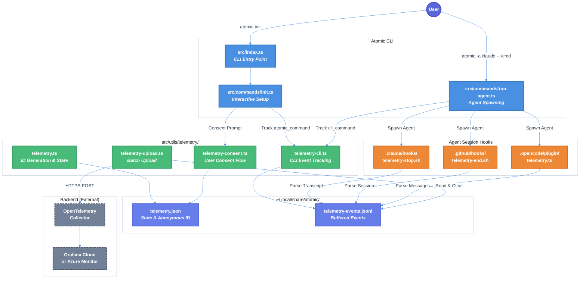

# Anonymous Telemetry Implementation Technical Design Document

| Document Metadata      | Details                                                |
| ---------------------- | ------------------------------------------------------ |
| Author(s)              | flora131                                               |
| Status                 | Draft (WIP)                                            |
| Team / Owner           | flora131/atomic                                        |
| Created / Last Updated | 2026-01-21                                             |

## 1. Executive Summary

This RFC proposes implementing privacy-preserving anonymous telemetry for Atomic CLI that tracks command usage patterns without collecting any personally identifiable information. The system uses a **triple collection strategy**: (1) Atomic CLI commands (`init`, `update`, `uninstall` + selected agent type), (2) Slash command tracking via CLI invocation (`atomic -a <agent> -- /command`), and (3) Session hooks that parse agent transcripts to extract command names. All telemetry is buffered locally in JSONL format before batch upload to an OpenTelemetry Collector backend. Users maintain full control via multiple opt-out mechanisms and explicit consent is required before any data collection.

**Research Reference:** [research/docs/2026-01-21-anonymous-telemetry-implementation.md](../research/docs/2026-01-21-anonymous-telemetry-implementation.md)

## 2. Context and Motivation

### 2.1 Current State

Atomic CLI currently has **no telemetry, user identification, or analytics** of any kind:
- No UUID generation or anonymous ID tracking
- No usage metrics collection
- No external analytics services integrated
- No session management beyond agent spawning

**Architecture:** The CLI spawns AI coding agents (Claude Code, OpenCode, GitHub Copilot CLI) and provides slash commands like `/research-codebase` and `/create-spec`. Users interact via both the CLI directly and within agent sessions.

**Limitations:**
- No visibility into which features are actually used
- No data to prioritize development efforts
- No understanding of user workflows or common patterns
- Unable to measure adoption of new features

### 2.2 The Problem

- **Product Impact:** Cannot make data-driven decisions about feature prioritization
- **User Impact:** Features users actually need may not get development attention
- **Business Impact:** Unable to demonstrate adoption or growth metrics
- **Technical Debt:** No infrastructure for future observability needs

## 3. Goals and Non-Goals

### 3.1 Functional Goals

- [ ] Generate anonymous UUID at install time, stored in `~/.local/share/atomic/telemetry.json`
- [ ] Track Atomic CLI command usage (`init`, `update`, `uninstall`) with selected agent type
- [ ] Track slash commands passed via CLI (`atomic -a <agent> -- /research-codebase`)
- [ ] Track slash commands used within agent sessions via hook transcript parsing
- [ ] Buffer events locally in JSONL format before batch upload
- [ ] Provide multiple opt-out mechanisms (env var, CLI command, config file)
- [ ] Request explicit user consent before enabling telemetry (GDPR compliance)
- [ ] Rotate anonymous ID monthly for additional privacy
- [ ] Support all three platforms: macOS, Linux, Windows

### 3.2 Non-Goals (Out of Scope)

- [ ] We will NOT collect user prompts or arguments passed to commands
- [ ] We will NOT collect file paths, working directories, or repository names
- [ ] We will NOT collect IP addresses or any network identifiers
- [ ] We will NOT collect error messages, stack traces, or code content
- [ ] We will NOT implement real-time streaming (batch upload only)
- [ ] We will NOT build a telemetry dashboard (backend visualization is out of scope)
- [ ] We will NOT collect data without explicit user consent

## 4. Proposed Solution (High-Level Design)

### 4.1 System Architecture Diagram



### 4.2 Architectural Pattern

We adopt a **Local-First Buffered Telemetry with Spawned Upload** pattern (following Homebrew and Salesforce CLI best practices):
1. All events are written to a local JSONL file first (zero network blocking)
2. On CLI exit, a **detached background process** is spawned to upload buffered events
3. Session hooks also spawn upload processes when sessions end (captures direct agent usage)
4. Failed uploads are automatically retried on next CLI/hook run
5. Users can inspect and delete local logs at any time

**Industry Precedent:** This pattern is used by Homebrew (fire-and-forget spawn), Salesforce CLI (spawned process on exit), and Vercel CLI (async local storage).

### 4.3 Key Components

| Component | Responsibility | Technology | Justification |
|-----------|----------------|------------|---------------|
| `telemetry.ts` | Anonymous ID generation, state management, opt-out checking | TypeScript | Core module, must be fast and reliable |
| `telemetry-cli.ts` | Track CLI and slash command events | TypeScript | Integrates with existing CLI entry points |
| `telemetry-upload.ts` | Batch upload to OTEL collector | TypeScript + fetch | No external dependencies, uses native fetch |
| `telemetry-consent.ts` | First-run consent prompt | @clack/prompts | Consistent with existing CLI UX |
| Session hooks | Parse agent transcripts for commands | Bash (Claude/Copilot), TypeScript (OpenCode) | Platform-specific integration |
| OTEL Collector | Receive, batch, export telemetry | Docker container or cloud service | Industry standard, vendor-agnostic |

## 5. Detailed Design

### 5.1 Anonymous ID Generation and Storage

**File Location:** `~/.local/share/atomic/telemetry.json` (binary installs)

**Schema:**
```typescript
interface TelemetryState {
  enabled: boolean;           // Master toggle
  consentGiven: boolean;      // Has user explicitly consented?
  anonymousId: string;        // UUID v4
  createdAt: string;          // ISO 8601 timestamp
  rotatedAt: string;          // Last ID rotation timestamp
}
```

**Example:**
```json
{
  "enabled": true,
  "consentGiven": true,
  "anonymousId": "a1b2c3d4-e5f6-7890-abcd-ef1234567890",
  "createdAt": "2026-01-21T10:00:00Z",
  "rotatedAt": "2026-01-01T00:00:00Z"
}
```

**Privacy Features:**
- UUID v4 generated using `crypto.randomUUID()` (cryptographically secure)
- ID rotated monthly (first of each month) for additional privacy
- No correlation possible between monthly periods
- File stored in user-controlled directory, easily deletable

**Reference:** [Research Section 4: Anonymous ID Implementation](../research/docs/2026-01-21-anonymous-telemetry-implementation.md#4-recommended-anonymous-id-implementation)

### 5.2 Opt-Out Mechanisms

Multiple opt-out methods following industry standards (VS Code, npm, Yarn):

| Method | Priority | Usage |
|--------|----------|-------|
| CI Environment | Highest | Auto-detected via `ci-info` package |
| Environment Variable | High | `ATOMIC_TELEMETRY=0` or `DO_NOT_TRACK=1` |
| CLI Command | Normal | `atomic config set telemetry false` |
| Config File | Normal | Edit `telemetry.json`: `"enabled": false` |

**CI Detection:** Telemetry is automatically disabled in CI environments (GitHub Actions, GitLab CI, Jenkins, CircleCI, etc.) using the [`ci-info`](https://www.npmjs.com/package/ci-info) package. This follows the pattern used by Yarn which never runs telemetry in CI by default.

**Checking Logic (evaluated in order):**
```typescript
import ci from 'ci-info';

function isTelemetryEnabled(): boolean {
  // 1. CI environment (highest priority - auto-disable)
  if (ci.isCI) {
    return false;
  }

  // 2. Environment variable
  if (process.env.ATOMIC_TELEMETRY === '0' ||
      process.env.ATOMIC_TELEMETRY === 'false' ||
      process.env.DO_NOT_TRACK === '1') {
    return false;
  }

  // 3. Config file
  const state = readTelemetryState();
  if (!state) return false;

  return state.enabled && state.consentGiven;
}
```

### 5.3 Triple Collection Strategy

#### 5.3.1 Atomic CLI Command Tracking

**Trigger:** When user runs `atomic init`, `atomic update`, `atomic uninstall`

**Integration Point:** `src/index.ts:198-230` (command routing switch)

**Event Schema:**
```typescript
interface AtomicCommandEvent {
  anonymousId: string;
  eventId: string;           // UUID per event
  eventType: 'atomic_command';
  timestamp: string;         // ISO 8601
  command: 'init' | 'update' | 'uninstall' | 'run';
  agentType: 'claude' | 'opencode' | 'copilot' | null;
  success: boolean;
  platform: 'darwin' | 'linux' | 'win32';
  atomicVersion: string;
  source: 'cli';
}
```

**Example Event:**
```json
{
  "anonymousId": "a1b2c3d4-...",
  "eventId": "evt-1111-2222-...",
  "eventType": "atomic_command",
  "timestamp": "2026-01-21T10:00:00Z",
  "command": "init",
  "agentType": "claude",
  "success": true,
  "platform": "darwin",
  "atomicVersion": "0.1.0",
  "source": "cli"
}
```

#### 5.3.2 Slash Command CLI Tracking

**Trigger:** When user runs `atomic -a <agent> -- /research-codebase src/`

**Integration Point:** `src/commands/run-agent.ts:58-129` (before `Bun.spawn()`)

**Event Schema:**
```typescript
interface CliCommandEvent {
  anonymousId: string;
  eventId: string;
  eventType: 'cli_command';
  timestamp: string;
  agentType: 'claude' | 'opencode' | 'copilot';
  commands: string[];        // e.g., ["/research-codebase"]
  commandCount: number;
  platform: 'darwin' | 'linux' | 'win32';
  atomicVersion: string;
  source: 'cli';
}
```

**Command Extraction Logic:**
```typescript
const ATOMIC_COMMANDS = [
  "/research-codebase",
  "/create-spec",
  "/create-feature-list",
  "/implement-feature",
  "/commit",
  "/create-gh-pr",
  "/explain-code",
  "/ralph-loop",
  "/ralph:ralph-loop",
  "/cancel-ralph",
  "/ralph:cancel-ralph",
  "/ralph-help",
  "/ralph:help",
];

function extractCommandsFromArgs(args: string[]): string[] {
  const commands: string[] = [];
  for (const arg of args) {
    for (const cmd of ATOMIC_COMMANDS) {
      if (arg === cmd || arg.startsWith(cmd + ' ')) {
        commands.push(cmd);
        break;
      }
    }
  }
  return [...new Set(commands)]; // Deduplicate
}
```

**Reference:** [Research Section 2: CLI Entry Points](../research/docs/2026-01-21-anonymous-telemetry-implementation.md#2-cli-entry-points-for-telemetry-integration)

#### 5.3.3 Agent Session Hook Tracking

**Trigger:** When an agent session ends (Stop/sessionEnd hook fires)

**Event Schema:**
```typescript
interface AgentSessionEvent {
  anonymousId: string;
  sessionId: string;         // UUID per session
  eventType: 'agent_session';
  timestamp: string;         // Session end time
  sessionStartedAt: string;  // Session start time
  agentType: 'claude' | 'opencode' | 'copilot';
  commands: string[];        // Commands extracted from transcript
  commandCount: number;
  platform: 'darwin' | 'linux' | 'win32';
  atomicVersion: string;
  source: 'session_hook';
}
```

**Platform-Specific Implementation:**

| Platform | Hook Type | Transcript Access | Implementation |
|----------|-----------|-------------------|----------------|
| Claude Code | `Stop` shell hook | `transcript_path` via stdin JSON | `.claude/hooks/telemetry-stop.sh` |
| Copilot CLI | `sessionEnd` shell hook | Limited (session metadata only) | `.github/hooks/telemetry-end.sh` |
| OpenCode | TypeScript plugin | `client.session.messages()` SDK | `.opencode/plugin/telemetry.ts` |

**Hook Upload Responsibility:** Session hooks are responsible for both:
1. Writing `agent_session` events to `telemetry-events.jsonl`
2. Spawning the upload process (ensures telemetry is uploaded even when users bypass `atomic` CLI)

This is critical because users who run agents directly (e.g., `claude` instead of `atomic -a claude`) would never trigger CLI-based uploads. The hooks ensure their telemetry still gets uploaded.

**Reference:** [Research Section 6: Hook Integration](../research/docs/2026-01-21-anonymous-telemetry-implementation.md#6-hook-integration-for-agent-session-tracking)

### 5.4 Local Event Buffering

**File:** `~/.local/share/atomic/telemetry-events.jsonl`

**Format:** JSON Lines (one event per line, newline-delimited)

**Example:**
```jsonl
{"anonymousId":"a1b2c3d4-...","eventId":"evt-1111-...","eventType":"atomic_command","timestamp":"2026-01-21T10:00:00Z","command":"init","agentType":"claude","success":true,"platform":"darwin","atomicVersion":"0.1.0","source":"cli"}
{"anonymousId":"a1b2c3d4-...","eventId":"evt-2222-...","eventType":"cli_command","timestamp":"2026-01-21T10:05:00Z","agentType":"claude","commands":["/research-codebase"],"commandCount":1,"platform":"darwin","atomicVersion":"0.1.0","source":"cli"}
{"anonymousId":"a1b2c3d4-...","sessionId":"sess-3333-...","eventType":"agent_session","sessionStartedAt":"2026-01-21T10:05:00Z","timestamp":"2026-01-21T10:30:00Z","agentType":"claude","commands":["/create-spec","/commit"],"commandCount":2,"platform":"darwin","atomicVersion":"0.1.0","source":"session_hook"}
```

**Benefits:**
- Append-only writes (no read-modify-write, safe for concurrent access)
- Human-readable format for inspection
- Trivial to clear: `rm ~/.local/share/atomic/telemetry-events.jsonl`
- No external dependencies for parsing

### 5.5 Batch Upload Implementation

**Pattern: Spawned Process on Exit (Zero Latency)**

Following the industry-standard pattern used by Homebrew and Salesforce CLI, we spawn a **detached background process** to upload telemetry. This ensures:
- Zero latency impact on CLI commands (main process exits immediately)
- Reliable delivery (upload happens after command completes)
- Works for both CLI invocations and session hooks

**Upload Triggers:**
1. **CLI Exit:** After any `atomic` command completes, spawn upload process
2. **Session Hook Exit:** After session hooks write events, spawn upload process

This ensures telemetry is uploaded regardless of how users interact with Atomic (via CLI or direct agent usage).

**Hidden Upload Command:**

Add a hidden `--upload-telemetry` flag to the `atomic` binary (following Azure CLI pattern):

```bash
# Not shown in help, used internally by spawned processes
atomic --upload-telemetry
```

**Spawning Logic (CLI):**
```typescript
import { spawn } from 'child_process';

function spawnTelemetryUpload(): void {
  // Don't spawn if telemetry disabled
  if (!isTelemetryEnabled()) return;

  // Spawn detached process that outlives parent
  const child = spawn(process.execPath, [process.argv[1], '--upload-telemetry'], {
    detached: true,
    stdio: 'ignore',
    env: { ...process.env, ATOMIC_TELEMETRY_UPLOAD: '1' }, // Prevent recursive spawns
  });

  // Unref allows parent to exit independently
  child.unref();
}

// Call at CLI exit (in src/index.ts after command completes)
process.on('beforeExit', () => {
  if (!process.env.ATOMIC_TELEMETRY_UPLOAD) {
    spawnTelemetryUpload();
  }
});
```

**Spawning Logic (Bash Hooks):**
```bash
#!/bin/bash
# .claude/hooks/telemetry-stop.sh

# ... (event writing logic) ...

# Spawn upload in background, detached from terminal
nohup atomic --upload-telemetry > /dev/null 2>&1 &
```

**Spawning Logic (TypeScript Plugin - OpenCode):**
```typescript
// .opencode/plugin/telemetry.ts
import { spawn } from 'child_process';

function spawnTelemetryUpload(): void {
  const child = spawn('atomic', ['--upload-telemetry'], {
    detached: true,
    stdio: 'ignore',
  });
  child.unref();
}
```

**Upload Handler (`--upload-telemetry`):**
```typescript
async function handleTelemetryUpload(): Promise<void> {
  const logPath = join(getBinaryDataDir(), 'telemetry-events.jsonl');

  if (!existsSync(logPath)) return;

  const content = readFileSync(logPath, 'utf-8');
  const events = content
    .split('\n')
    .filter(line => line.trim())
    .map(line => {
      try {
        return JSON.parse(line);
      } catch {
        return null; // Skip corrupt lines
      }
    })
    .filter(Boolean);

  if (events.length === 0) return;

  try {
    const response = await fetch(OTEL_ENDPOINT, {
      method: 'POST',
      headers: { 'Content-Type': 'application/json' },
      body: JSON.stringify({ events }),
      signal: AbortSignal.timeout(3000), // 3s timeout (Homebrew uses 3s)
    });

    if (response.ok) {
      unlinkSync(logPath); // Clear on success
    }
  } catch {
    // Fail silently, retry on next spawn
  }
}
```

**Why This Pattern:**

| Aspect | Benefit |
|--------|---------|
| **Zero Latency** | Main process exits immediately, upload happens in background |
| **Reliable Delivery** | Events buffered locally, retried on each CLI/hook run |
| **Works Offline** | Local buffer persists, uploads when network available |
| **Covers Bypass Scenario** | Session hooks spawn uploads even without `atomic` CLI usage |
| **Simple Implementation** | Reuses existing binary, no daemon or cron needed |
| **Industry Proven** | Same pattern as Homebrew (10M+ users), Salesforce CLI |

### 5.6 First-Run Consent Prompt

**Trigger:** First run of `atomic init` when `telemetry.json` doesn't exist

**UI Flow:**
```
┌─────────────────────────────────────────────────────────────┐
│                                                             │
│  Atomic collects anonymous usage data to improve the        │
│  product.                                                   │
│                                                             │
│  What we collect:                                           │
│    • Command names (e.g., "init", "/research-codebase")     │
│    • Agent type (e.g., "claude", "copilot")                │
│    • Success/failure status                                 │
│                                                             │
│  What we NEVER collect:                                     │
│    • Your prompts or file contents                         │
│    • File paths or project names                           │
│    • IP addresses or personal information                  │
│                                                             │
│  You can opt out anytime with: ATOMIC_TELEMETRY=0          │
│                                                             │
│  ? Help improve Atomic by enabling anonymous telemetry?     │
│    ○ Yes                                                    │
│    ○ No                                                     │
│                                                             │
└─────────────────────────────────────────────────────────────┘
```

**Implementation:**
```typescript
async function promptTelemetryConsent(): Promise<boolean> {
  const consent = await confirm({
    message: 'Help improve Atomic by enabling anonymous telemetry?',
    initialValue: true,
  });

  return consent === true;
}
```

### 5.7 Data NOT Collected

**Privacy Guarantee:** The following data types are NEVER collected:

| Category | Examples | Why Excluded |
|----------|----------|--------------|
| User Prompts | "Fix the bug in auth", "Add unit tests" | Contains user intent and context |
| Command Arguments | `src/utils/`, `--force` | May reveal project structure |
| File Paths | `/Users/john/projects/secret-project/` | Reveals identity and project names |
| File Contents | Source code, configs | Proprietary information |
| IP Addresses | `192.168.1.1`, `2001:db8::1` | Network identifier |
| Usernames | `john_doe`, `admin@corp.com` | Direct PII |
| Error Messages | Stack traces, exception text | May contain paths/code |
| Repository Names | `secret-internal-tool` | Project identification |
| Full Transcripts | Agent conversation history | Contains all of the above |

## 6. Alternatives Considered

| Option | Pros | Cons | Reason for Rejection |
|--------|------|------|---------------------|
| **No Telemetry** | Zero privacy risk, no implementation cost | No product insights, blind development | Unable to prioritize features effectively |
| **Third-Party Analytics (PostHog/Amplitude)** | Rich dashboards, easy setup | Vendor dependency, potential PII leakage, cost | Privacy concerns, adds external dependency |
| **Real-Time Streaming** | Immediate visibility | Network blocking, higher failure rate | Latency-sensitive CLI, poor offline experience |
| **Server-Side Session Tracking** | Complete session data | Requires backend changes, collects too much | Overkill for command usage metrics |
| **OpenTelemetry + Batch Upload (Selected)** | Industry standard, privacy-preserving, vendor-agnostic | Requires OTEL collector setup | **Selected:** Best balance of privacy, flexibility, and industry alignment |

## 7. Cross-Cutting Concerns

### 7.1 Security and Privacy

- **Data Minimization:** Only command names and metadata, never content
- **Anonymous ID:** UUID v4 with monthly rotation, no device fingerprinting
- **Local First:** All data buffered locally, user can inspect/delete
- **Opt-Out:** Multiple methods with environment variable taking highest priority
- **Consent:** Explicit opt-in required (GDPR compliant)
- **Transport:** HTTPS only for batch uploads
- **No PII:** Design ensures no personally identifiable information collected

### 7.2 Observability Strategy

- **Metrics to Track:**
  - `atomic_command_count` by command type, agent type, success status
  - `slash_command_count` by command name, agent type
  - `session_duration_seconds` histogram
  - `upload_success_rate` percentage

- **Dashboards (Backend):**
  - Daily/weekly active users (anonymous ID count)
  - Command usage distribution
  - Agent type popularity
  - Feature adoption trends

### 7.3 Scalability and Capacity Planning

- **Estimated Volume:** ~1,000 users × 10 events/day = 10,000 events/day
- **Event Size:** ~200 bytes/event JSON
- **Daily Data:** ~2 MB/day uncompressed
- **Monthly Data:** ~60 MB/month
- **Backend Requirement:** Minimal, well within free tiers

### 7.4 Failure Modes

| Failure | Behavior | Recovery |
|---------|----------|----------|
| Local write fails | Fail silently, continue CLI operation | Event lost (acceptable) |
| Upload fails | Retain local file, retry next run | Automatic retry |
| Network timeout | 5s timeout, fail silently | No user impact |
| Corrupt JSONL | Skip invalid lines during upload | Partial data preserved |
| Consent file missing | Assume telemetry disabled | Prompt on next init |

## 8. Migration, Rollout, and Testing

### 8.1 Deployment Strategy

- [ ] **Phase 1:** Ship telemetry module with `enabled: false` default (code in place, no collection)
- [ ] **Phase 2:** Enable consent prompt in `atomic init`, begin collecting for consenting users
- [ ] **Phase 3:** Set up OTEL Collector and backend (Grafana Cloud recommended)
- [ ] **Phase 4:** Enable batch upload, verify data flow
- [ ] **Phase 5:** Build dashboards and begin analysis

### 8.2 Data Migration Plan

Not applicable - this is a new feature with no existing telemetry data.

### 8.3 Test Plan

#### Unit Tests

- [ ] `telemetry.ts`: ID generation, state persistence, opt-out logic
- [ ] `telemetry-cli.ts`: Event creation, command extraction, JSONL formatting
- [ ] `telemetry-upload.ts`: Batch reading, HTTP mocking, error handling
- [ ] `telemetry-consent.ts`: Prompt rendering, state updates

#### Integration Tests

- [ ] Full flow: init → consent → event → local file
- [ ] CLI tracking: `atomic -a claude -- /research-codebase` creates event
- [ ] Opt-out respected: `ATOMIC_TELEMETRY=0` prevents all collection
- [ ] Upload simulation: mock server receives correctly formatted batch

#### End-to-End Tests

- [ ] Binary installation creates data directory
- [ ] First-run consent prompt appears
- [ ] Events accumulate in JSONL file
- [ ] Session hooks fire and create events (per platform)

## 9. Open Questions / Unresolved Issues

- [ ] **Consent Timing:** Should consent be requested during `atomic init` or on first `atomic --agent` run? (Recommendation: `atomic init` for cleaner UX)

- [ ] **npm Installation:** For npm-installed Atomic, should telemetry state be global (`~/.local/share/atomic/`) or per-project? (Recommendation: Global for consistency)

- [x] **Batch Upload Trigger:** ~~When should batch upload happen?~~ **RESOLVED:** Use spawned-process-on-exit pattern (see Section 5.5). Upload is triggered by:
  1. CLI exit (spawns `atomic --upload-telemetry` in background)
  2. Session hook exit (hooks spawn upload process)

  This follows Homebrew/Salesforce CLI best practices and ensures telemetry uploads regardless of whether users use `atomic` CLI or run agents directly.

- [ ] **Retention Policy:** How long should local telemetry logs be retained before auto-deletion? (Recommendation: 30 days)

- [ ] **Copilot CLI Transcript Access:** Can we access Copilot CLI session transcripts for command extraction? (Requires investigation)

- [ ] **Backend Selection:** Grafana Cloud vs Azure Monitor vs self-hosted? (Recommendation: Grafana Cloud for free tier and OTEL native support)

- [ ] **Deduplication:** Same command tracked via CLI and session hook - how to handle? (Recommendation: Keep both, differentiate by `source` field)

## 10. Implementation Checklist

### Phase 1: Foundation
- [ ] Create `src/utils/telemetry/telemetry.ts` with anonymous ID generation
- [ ] Create `src/utils/telemetry/index.ts` for module exports
- [ ] Implement opt-in/opt-out checking logic (including `ci-info` CI detection)
- [ ] Add `telemetry.json` schema and persistence
- [ ] Define shared `ATOMIC_COMMANDS` constant
- [ ] Update install scripts to create data directory
- [ ] Add `ci-info` package dependency

### Phase 2: Atomic CLI Command Tracking
- [ ] Create `src/utils/telemetry/telemetry-cli.ts` with `trackAtomicCommand()` function
- [ ] Integrate tracking into `src/index.ts` for `init`, `update`, `uninstall` commands
- [ ] Track which agent type is selected in `src/commands/init.ts`
- [ ] Log `atomic_command` events to `telemetry-events.jsonl`
- [ ] Write unit tests for command tracking

### Phase 3: Slash Command CLI Tracking
- [ ] Add `trackCliInvocation()` function to `telemetry-cli.ts`
- [ ] Integrate tracking into `src/commands/run-agent.ts` before `Bun.spawn()`
- [ ] Implement command extraction from CLI args
- [ ] Log `cli_command` events to `telemetry-events.jsonl`
- [ ] Write unit tests for slash command extraction

### Phase 4: Agent Session Tracking (Hooks)
- [ ] Create `.claude/hooks/telemetry-stop.sh` for Claude Code
- [ ] Create `.github/hooks/telemetry-end.sh` for Copilot CLI
- [ ] Create `.opencode/plugin/telemetry.ts` for OpenCode
- [ ] Register hooks in respective configuration files
- [ ] Log `agent_session` events to `telemetry-events.jsonl`
- [ ] Add spawned upload trigger to each hook (call `atomic --upload-telemetry`)
- [ ] Write integration tests for each platform

### Phase 5: User Consent
- [ ] Create `src/utils/telemetry/telemetry-consent.ts`
- [ ] Add consent prompt to `src/commands/init.ts` first-run flow
- [ ] Implement `atomic config set telemetry <true|false>` command
- [ ] Update README.md with telemetry documentation
- [ ] Write tests for consent flow

### Phase 6: Backend Integration
- [ ] Create `src/utils/telemetry/telemetry-upload.ts`
- [ ] Implement hidden `--upload-telemetry` CLI flag handler
- [ ] Implement `spawnTelemetryUpload()` function for detached background upload
- [ ] Add `beforeExit` hook in `src/index.ts` to spawn upload on CLI exit
- [ ] Set up OpenTelemetry Collector (Docker or cloud)
- [ ] Configure Grafana Cloud or Azure Monitor as backend
- [ ] Implement batch upload with 3s timeout (Homebrew pattern)
- [ ] Write integration tests with mock server
- [ ] Monitor initial data flow and validate events

## 11. Code References

| File | Line(s) | Description |
|------|---------|-------------|
| `research/docs/2026-01-21-anonymous-telemetry-implementation.md` | 1-1623 | Full research document |
| `src/index.ts` | 87-243 | Main CLI entry point for tracking |
| `src/commands/run-agent.ts` | 58-129 | Agent execution for CLI tracking |
| `src/commands/init.ts` | N/A | Consent prompt integration point |
| `src/utils/config-path.ts` | 54-64 | `getBinaryDataDir()` for storage path |
| `install.sh` | 11-12 | DATA_DIR definition |
| `install.ps1` | 16-17 | Windows DATA_DIR definition |
| `.claude/hooks/hooks.json` | N/A | Claude Code hook registration |
| `.github/hooks/hooks.json` | N/A | Copilot CLI hook registration |
| `.opencode/opencode.json` | N/A | OpenCode plugin registration |
