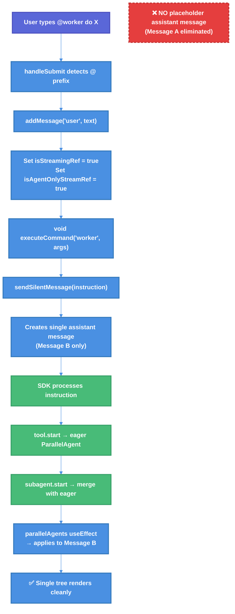

# @ Command Duplicate Sub-Agent Tree Fix — Technical Design Document

| Document Metadata      | Details                                       |
| ---------------------- | --------------------------------------------- |
| Author(s)              | lavaman131                                    |
| Status                 | Draft (WIP)                                   |
| Team / Owner           | Atomic CLI                                    |
| Created / Last Updated | 2026-02-25                                    |

## 1. Executive Summary

When users invoke sub-agents via `@` commands (e.g., `@worker do X`), the sub-agent tree briefly renders twice then collapses — a visible UI glitch. The root cause is a **dual assistant message creation pattern**: the `@` handler creates a placeholder message (Message A) for immediate UI feedback, then `sendSilentMessage` creates a second message (Message B) for the actual SDK stream. Due to React's asynchronous state batching, both messages coexist transiently, each rendering its own agent tree. The proposed fix **eliminates the placeholder message** and unifies the `@` command pathway to use a single assistant message — matching the natural language pathway's clean single-message flow. This is a ~30-line surgical change across 1-2 files.

## 2. Context and Motivation

### 2.1 Current State

The Atomic CLI TUI renders sub-agent trees (showing spawned agents, their status, and results) when users invoke agents. There are two pathways to invoke agents:

1. **Natural Language Pathway** — User types "use the worker agent to do X" → SDK streams response → single assistant message → single agent tree (works correctly)
2. **@ Command Pathway** — User types `@worker do X` → creates placeholder assistant message → `executeCommand` → `sendSilentMessage` creates second assistant message → dual agent tree (broken)

**Architecture (Current):**

```
┌──────────────────────────────────────────────────────────────┐
│                    @ COMMAND PATHWAY                         │
│                                                              │
│  User types "@worker do X"                                   │
│       ↓                                                      │
│  handleSubmit detects "@" prefix                             │
│       ↓                                                      │
│  Creates user message + placeholder assistant (Message A)    │
│  Sets isAgentOnlyStreamRef = true                            │
│       ↓                                                      │
│  void executeCommand("worker", "do X")  ← fire-and-forget   │
│       ↓                                                      │
│  agent-commands.ts → sendSilentMessage(instruction)          │
│       ↓                                                      │
│  sendSilentMessage:                                          │
│    1. Tries to remove Message A (async React setState)       │
│    2. Creates Message B (new assistant message)              │
│    3. Sets isAgentOnlyStreamRef = false                      │
│    4. Calls onSendMessage → SDK                              │
│       ↓                                                      │
│  ⚠️ TRANSIENT STATE: Both Message A & B may exist briefly   │
│       ↓                                                      │
│  SDK processes instruction → LLM calls Task tool             │
│       ↓                                                      │
│  tool.start → eager ParallelAgent created                    │
│  subagent.start → merge with eager agent                     │
│       ↓                                                      │
│  parallelAgents useEffect → applies to Message B             │
│       ↓                                                      │
│  deduplicateAgents() at render → collapses duplicates        │
└──────────────────────────────────────────────────────────────┘
```

**Limitations:**
- Dual message creation causes transient duplicate tree rendering
- `streamingMessageIdRef` mutates mid-flow (Message A → Message B), creating a targeting window for misapplied agents
- `isAgentOnlyStreamRef` flag toggles (`true` → `false`), causing inconsistent finalization guard behavior
- Fire-and-forget `void executeCommand()` provides no coordination between placeholder setup and real message creation

> **Ref:** [research/docs/2026-02-25-at-command-duplicate-subagent-tree.md](../research/docs/2026-02-25-at-command-duplicate-subagent-tree.md) — Root cause analysis identifying 5 contributing factors to the race condition.

### 2.2 The Problem

- **User Impact:** When invoking `@worker`, `@debugger`, or other agent commands, users see a brief flash of two identical agent trees that then collapse into one. This is visually jarring and suggests instability.
- **Technical Debt:** The dual-message pattern is unique to the `@` command pathway and diverges from the clean single-message architecture used by natural language invocation. The system relies on 4 layers of deduplication (eager merge, pipeline grouping, render-time dedup, shadow detection) to paper over a creation bug.
- **Precedent:** An identical dual-path rendering issue was previously fixed for skill loading indicators (Issue #205), where the solution was to **eliminate one rendering path** rather than trying to coordinate both.

> **Ref:** [research/tickets/2026-02-15-205-skill-loading-indicator-duplicate.md](../research/tickets/2026-02-15-205-skill-loading-indicator-duplicate.md) — Prior art showing the "eliminate one path" fix strategy.

## 3. Goals and Non-Goals

### 3.1 Functional Goals

- [ ] Eliminate the transient duplicate sub-agent tree rendering when using `@` commands
- [ ] Unify the `@` command pathway to use a single assistant message, matching the natural language pathway
- [ ] Preserve immediate streaming state feedback (spinner/loading indicator) when `@` commands are submitted
- [ ] Maintain SDK parity across OpenCode, Claude, and Copilot agent dispatch
- [ ] Ensure queued `@` mentions (during active streaming) continue to work correctly via `dispatchQueuedMessage`

### 3.2 Non-Goals (Out of Scope)

- [ ] We will NOT refactor `sendSilentMessage` broadly — only adjust its behavior for the `@` command pathway
- [ ] We will NOT change the natural language agent invocation pathway (it already works correctly)
- [ ] We will NOT modify the deduplication layers (they serve as defense-in-depth and should remain)
- [ ] We will NOT change the SDK event pipeline (`tool.start`/`subagent.start` handling in `index.ts`)
- [ ] We will NOT address the broader parts-based rendering migration (tracked separately in `specs/chat-system-parts-based-rendering.md`)

## 4. Proposed Solution (High-Level Design)

### 4.1 System Architecture Diagram (After Fix)



### 4.2 Architectural Pattern

**Single-Message Unification** — Eliminate the placeholder assistant message (Message A) from the `@` command pathway so that `sendSilentMessage` is the sole creator of the assistant message. This aligns the `@` command pathway with the natural language pathway's single-message flow.

This follows the established **"eliminate one rendering path"** pattern used for the skill loading indicator duplicate fix (Issue #205).

> **Ref:** [specs/skill-loading-indicator-duplicate-fix.md](./skill-loading-indicator-duplicate-fix.md) — Established the precedent of filtering/eliminating dual rendering paths.

### 4.3 Key Components

| Component | Responsibility | Change Required | Justification |
| --- | --- | --- | --- |
| `chat.tsx` @ handler (5632-5678) | Detects and dispatches `@` commands | Remove placeholder message creation (lines 5665-5673) | Root cause of dual-message pattern |
| `chat.tsx` `sendSilentMessage` (3466-3520) | Creates streaming message for silent commands | Ensure it sets streaming state correctly when no placeholder exists | Must be sole message creator |
| `chat.tsx` `dispatchQueuedMessage` (3177-3210) | Processes queued `@` mentions after streaming ends | Verify no placeholder creation in this path | Same race condition possible if queued path creates placeholders |
| Deduplication layers | Defense-in-depth for agent duplicates | No change (preserve) | Continues to guard against other sources of duplicates |

## 5. Detailed Design

### 5.1 Fix 1: Remove Placeholder Message Creation from @ Handler

**File:** `src/ui/chat.tsx` — `handleSubmit` function, lines ~5651-5678

**Before (current code):**
```typescript
emitMessageSubmitTelemetry({ queued: false, hasAgentMentions: true });
addMessage("user", trimmedValue);

// Create a streaming assistant message immediately so the parallel
// agents tree view renders right away instead of waiting for the
// next user message.
const assistantMsg = createMessage("assistant", "", true);
streamingMessageIdRef.current = assistantMsg.id;
isAgentOnlyStreamRef.current = true;
isStreamingRef.current = true;
streamingStartRef.current = Date.now();
resetThinkingSourceTracking();
setIsStreaming(true);
resetTodoItemsForNewStream();
setMessagesWindowed((prev) => [...prev, assistantMsg]);

for (const mention of atMentions) {
  void executeCommand(mention.agentName, mention.args, "mention");
}
return;
```

**After (proposed):**
```typescript
emitMessageSubmitTelemetry({ queued: false, hasAgentMentions: true });
addMessage("user", trimmedValue);

// Set streaming state so the UI shows a loading indicator while
// sendSilentMessage creates the actual assistant message.
isStreamingRef.current = true;
streamingStartRef.current = Date.now();
setIsStreaming(true);

for (const mention of atMentions) {
  void executeCommand(mention.agentName, mention.args, "mention");
}
return;
```

**What changed:**
- **Removed:** `createMessage("assistant", "", true)` — no more placeholder Message A
- **Removed:** `streamingMessageIdRef.current = assistantMsg.id` — ref will be set by `sendSilentMessage`
- **Removed:** `setMessagesWindowed((prev) => [...prev, assistantMsg])` — no more adding placeholder to state
- **Removed:** `resetThinkingSourceTracking()` and `resetTodoItemsForNewStream()` — `sendSilentMessage` already handles these
- **Removed:** `isAgentOnlyStreamRef.current = true` — `sendSilentMessage` handles all streaming state setup (per Q1 resolution)
- **Kept:** `isStreamingRef = true` and `setIsStreaming(true)` — immediate streaming state for UI feedback
- **Kept:** `streamingStartRef` — timing for telemetry

**Rationale:** The placeholder message's stated purpose (per the comment at line 5660) was to make "the parallel agents tree view renders right away." However, this creates the dual-message race condition. Instead, setting `isStreamingRef = true` provides immediate UI feedback (loading spinner), and `sendSilentMessage` creates the single assistant message where the agent tree will render. The `isAgentOnlyStreamRef` flag is not set here — `sendSilentMessage` manages it internally.

### 5.2 Fix 2: Adjust `sendSilentMessage` Placeholder Cleanup Logic

**File:** `src/ui/chat.tsx` — `sendSilentMessage` function, lines ~3474-3489

**Before (current code):**
```typescript
// Finalize any previous streaming message before starting a new one.
// This prevents duplicate "Generating..." spinners when sendSilentMessage
// is called from an @mention handler that already created a placeholder.
const prevStreamingId = streamingMessageIdRef.current;
if (prevStreamingId) {
  setMessagesWindowed((prev: ChatMessage[]) =>
    prev.map((msg: ChatMessage) =>
      msg.id === prevStreamingId && msg.streaming
        ? { ...finalizeStreamingReasoningInMessage(msg), streaming: false }
        : msg
    ).filter((msg: ChatMessage) =>
      !(msg.id === prevStreamingId && !msg.content.trim())
    )
  );
}
```

**After (proposed):**
```typescript
// Finalize any previous streaming message before starting a new one.
const prevStreamingId = streamingMessageIdRef.current;
if (prevStreamingId) {
  setMessagesWindowed((prev: ChatMessage[]) =>
    prev.map((msg: ChatMessage) =>
      msg.id === prevStreamingId && msg.streaming
        ? { ...finalizeStreamingReasoningInMessage(msg), streaming: false }
        : msg
    ).filter((msg: ChatMessage) =>
      !(msg.id === prevStreamingId && !msg.content.trim())
    )
  );
}
```

**What changed:** The cleanup logic is **preserved as-is** for defensive safety. Even though Fix 1 eliminates the placeholder, this code still handles edge cases where a previous streaming message exists (e.g., rapid re-invocation). The comment is updated to remove the @mention-specific reference since that path no longer creates placeholders.

> **Note:** The comment update is minor. The key insight is that this cleanup path becomes a **no-op** for the `@` command flow since `streamingMessageIdRef.current` will be `null`/`undefined` when no placeholder was created. It remains active for other `sendSilentMessage` callers.

### 5.3 Fix 3: Verify `dispatchQueuedMessage` Path

**File:** `src/ui/chat.tsx` — `dispatchQueuedMessage` function, lines ~3177-3210

This function processes queued `@` mentions that were enqueued during active streaming. It needs to be verified that it does **not** create a placeholder message before calling `executeCommand`.

**Expected behavior:** `dispatchQueuedMessage` calls `executeCommand` for each queued mention, which in turn calls `sendSilentMessage`. Since `sendSilentMessage` creates the assistant message, no placeholder is needed in `dispatchQueuedMessage` either.

**Action:** Verify and confirm this path does not create a placeholder. If it does, apply the same removal as Fix 1.

### 5.4 State Flow After Fix

```
T0: User submits "@worker do X"
T1: User message added, streaming state set (NO assistant message created)
T2: executeCommand fires → sendSilentMessage called
T3: sendSilentMessage creates Message B (single assistant message)
T4: sendSilentMessage calls onSendMessage → SDK
T5: SDK emits tool.start → eager agent created
T6: parallelAgents useEffect fires, targets Message B
T7: React renders — single message, single tree ✅
T8: SDK emits subagent.start → merge completes
T9: Next render — clean, no duplicates ✅
```

**Eliminated race condition:** No more transient window where two messages coexist. `streamingMessageIdRef` is set once (by `sendSilentMessage`) and never changes.

## 6. Alternatives Considered

| Option | Pros | Cons | Reason for Rejection |
| --- | --- | --- | --- |
| **Option A: Synchronize placeholder cleanup** — Make `sendSilentMessage`'s cleanup of Message A synchronous using `flushSync` | Eliminates race without removing placeholder | `flushSync` is a React escape hatch with performance implications; doesn't fix the architectural divergence | Forces React to synchronously apply state — anti-pattern that can cause layout thrashing and breaks concurrent mode |
| **Option B: Reuse placeholder message** — Instead of creating Message B, have `sendSilentMessage` reuse Message A by updating its ID/state | Single message throughout | Complex coordination; requires `sendSilentMessage` to detect and reuse existing placeholder; changes `sendSilentMessage` semantics for all callers | Increases coupling between `@` handler and `sendSilentMessage`; makes `sendSilentMessage` aware of caller context |
| **Option C: Eliminate placeholder (Selected)** | Single message; matches natural language pathway; minimal change; follows Issue #205 precedent | Brief gap between user submit and agent tree rendering (until `sendSilentMessage` creates Message B) | **Selected:** Simplest fix; aligns architectures; streaming state provides loading feedback during the gap |
| **Option D: Bypass `sendSilentMessage` entirely** — Have `@` handler call `spawnSubagent` bridge directly | Direct SDK invocation; no intermediate message | Requires significant refactoring of agent command dispatch; different execution model than SDK expects | Too invasive; changes how agents are spawned at a fundamental level |

## 7. Cross-Cutting Concerns

### 7.1 SDK Parity

The fix applies uniformly across all three SDKs:
- **Claude/Copilot:** `sendSilentMessage(instruction)` creates the single message → SDK receives instruction → LLM calls Task tool → agent lifecycle events fire
- **OpenCode:** `sendSilentMessage(task, { agent: name })` creates the single message → SDK receives structured dispatch → agent lifecycle events fire

No SDK-specific branching needed. The `sendSilentMessage` function already handles SDK differences internally.

> **Ref:** [research/docs/2026-02-23-258-background-agents-sdk-event-pipeline.md](../research/docs/2026-02-23-258-background-agents-sdk-event-pipeline.md) — Documents per-SDK event emission patterns.

### 7.2 Backward Compatibility

- The `isAgentOnlyStreamRef` flag is no longer set in the `@` handler (per Q1 resolution). `sendSilentMessage` manages it internally, setting it based on context. This simplifies the flag lifecycle and eliminates the `true` → `false` toggle race.
- `sendSilentMessage` creates the sole assistant message — no placeholder to clean up
- Deduplication layers remain untouched (defense-in-depth preserved)
- Queued message processing (`dispatchQueuedMessage`) follows the same `executeCommand` → `sendSilentMessage` path

### 7.3 Performance

- **Improvement:** One fewer React state update per `@` command invocation (no `setMessagesWindowed` for placeholder)
- **Improvement:** No more transient re-renders caused by placeholder cleanup
- **Negligible delay:** The gap between user submit and `sendSilentMessage`'s message creation is minimal (synchronous `executeCommand` dispatch)

### 7.4 Observability

- Existing telemetry (`emitMessageSubmitTelemetry`) is preserved and unaffected
- The `streamingStartRef` timestamp is still set in the `@` handler for accurate timing

### 7.5 UI Feedback Gap

When the placeholder is removed, there is a brief period between the user pressing Enter and `sendSilentMessage` creating the assistant message. During this gap:
- `isStreamingRef.current = true` and `setIsStreaming(true)` are set immediately
- The UI should show a streaming/loading indicator based on these flags
- The actual agent tree appears when `sendSilentMessage` creates the message and SDK events fire

This gap is comparable to the natural language pathway (user sends message → SDK streams response → tree appears).

## 8. Migration, Rollout, and Testing

### 8.1 Deployment Strategy

- [ ] **Phase 1:** Implement Fix 1 (remove placeholder) and Fix 2 (preserve cleanup logic). Verify Fix 3 (dispatchQueuedMessage path).
- [ ] **Phase 2:** Manual E2E testing across all three SDKs (OpenCode, Claude, Copilot) with `@` command invocations.
- [ ] **Phase 3:** Verify queued `@` mentions work (submit `@worker` during active streaming).
- [ ] **Phase 4:** Verify natural language pathway remains unaffected.

### 8.2 Test Plan

**Manual Tests:**

| Test Case | Steps | Expected Result |
| --- | --- | --- |
| Basic `@` command | Type `@worker do X`, press Enter | Single agent tree renders; no duplicate flash |
| Multiple `@` mentions | Type `@worker do X @debugger do Y` | Each agent tree renders once; no duplicates |
| Queued `@` mention | While streaming, type `@worker do X` | Message queued; after stream ends, single tree renders |
| Natural language agent | Type "use the worker agent to do X" | Single agent tree (unchanged behavior) |
| Rapid `@` commands | Submit `@worker` twice quickly | Each invocation produces single tree |
| `@` with background agent | Type `@worker do X` with background mode | Background agent footer renders correctly |

**Automated Tests:**
- Unit test for `parseAtMentions` — unchanged, existing tests should pass
- Integration test verifying `sendSilentMessage` creates exactly one assistant message
- Verify `setMessagesWindowed` is called once per `@` command (not twice)

### 8.3 Regression Checks

- [ ] Verify streaming state is set immediately on `@` submit (loading indicator visible)
- [ ] Verify `isAgentOnlyStreamRef` flag lifecycle is correct (`true` → `false` transition via `sendSilentMessage`)
- [ ] Verify finalization guards in `parts/guards.ts` still function correctly
- [ ] Verify deduplication layers still catch edge cases (they should have nothing to deduplicate for `@` commands, but should still work for other sources)

## 9. Open Questions / Unresolved Issues (Resolved)

- [x] **Q1: Should we remove the `isAgentOnlyStreamRef = true` line from the `@` handler?**
  **Decision:** Yes — remove it. Let `sendSilentMessage` handle all streaming state setup. The `@` handler should only set `isStreamingRef` and `setIsStreaming` for immediate UI feedback. The `isAgentOnlyStreamRef` flag defaults to `false` and `sendSilentMessage` manages it internally. This simplifies the `@` handler and eliminates the flag toggle race.

- [x] **Q2: Is the brief UI feedback gap (between Enter and `sendSilentMessage`'s message creation) acceptable?**
  **Decision:** Yes — the gap is acceptable. It matches the natural language pathway's behavior where users see a spinner until the SDK stream begins. No additional loading indicator is needed.

- [x] **Q3: Should we add a test specifically for the "no duplicate messages" invariant?**
  **Decision:** Yes — add a unit test that mocks `setMessagesWindowed` and asserts it's called with exactly one assistant message per `@` command invocation. This prevents regression.

- [x] **Q4: Is the `dispatchQueuedMessage` path also affected?**
  **Decision:** Yes — investigate and fix in this same spec. The `dispatchQueuedMessage` path uses the same fire-and-forget `executeCommand` pattern. If it creates a placeholder assistant message, apply the same removal.

## 10. Research References

| Document | Relevance |
| --- | --- |
| [research/docs/2026-02-25-at-command-duplicate-subagent-tree.md](../research/docs/2026-02-25-at-command-duplicate-subagent-tree.md) | **Primary research** — Root cause analysis, 5-factor race condition, comparison table, deduplication layer analysis |
| [research/tickets/2026-02-15-205-skill-loading-indicator-duplicate.md](../research/tickets/2026-02-15-205-skill-loading-indicator-duplicate.md) | **Precedent** — Identical dual-path rendering issue fixed by eliminating one path |
| [research/docs/2026-02-23-258-background-agents-sdk-event-pipeline.md](../research/docs/2026-02-23-258-background-agents-sdk-event-pipeline.md) | 6-stage pipeline architecture; per-SDK correlation analysis |
| [research/docs/2026-02-16-sub-agent-tree-inline-state-lifecycle-research.md](../research/docs/2026-02-16-sub-agent-tree-inline-state-lifecycle-research.md) | Premature lifecycle finalization at 4+ code sites |
| [research/docs/2026-02-15-sub-agent-tree-status-lifecycle-sdk-parity.md](../research/docs/2026-02-15-sub-agent-tree-status-lifecycle-sdk-parity.md) | Two-path agent creation (eager + subagent.start) and SDK parity |
| [research/docs/2026-02-15-subagent-premature-completion-investigation.md](../research/docs/2026-02-15-subagent-premature-completion-investigation.md) | Root cause of `tool.complete` unconditionally finalizing status |
| [research/docs/2026-02-06-at-mention-dropdown-research.md](../research/docs/2026-02-06-at-mention-dropdown-research.md) | @ mention dropdown implementation context |
| [specs/skill-loading-indicator-duplicate-fix.md](./skill-loading-indicator-duplicate-fix.md) | Precedent spec — "eliminate one rendering path" pattern |
| [specs/background-agents-sdk-pipeline-fix.md](./background-agents-sdk-pipeline-fix.md) | SDK pipeline fix patterns (session trust, multi-field check) |
| [specs/sub-agent-tree-inline-state-lifecycle-fix.md](./sub-agent-tree-inline-state-lifecycle-fix.md) | Flag-gated state transition pattern for agent lifecycle |
| [specs/chat-system-parts-based-rendering.md](./chat-system-parts-based-rendering.md) | Parts-based rendering architecture (future direction) |
