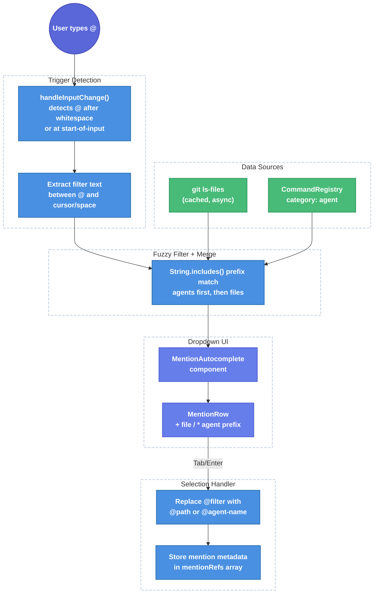

# `@` Mention Dropdown for File Context and Agent Invocation

| Document Metadata      | Details     |
| ---------------------- | ----------- |
| Author(s)              | Developer   |
| Status                 | Draft (WIP) |
| Team / Owner           | Atomic TUI  |
| Created / Last Updated | 2026-02-06  |

## 1. Executive Summary

This RFC proposes adding an `@` mention dropdown to the Atomic TUI chat interface, enabling users to reference files, directories, and sub-agents inline within their prompts. Currently, users must use slash commands (`/codebase-analyzer`, `/debugger`) to invoke agents and have no way to attach file context from the input field. The proposed `@` mention system mirrors Claude Code and OpenCode's UX: typing `@` triggers a fuzzy-filtered dropdown showing project files and available agents, with Tab/Enter selection inserting the reference as plain text. This unifies file context loading and agent invocation into a single, discoverable interaction pattern alongside the existing `/` command autocomplete.

> **Primary Research**: [research/docs/2026-02-06-at-mention-dropdown-research.md](../research/docs/2026-02-06-at-mention-dropdown-research.md)

## 2. Context and Motivation

### 2.1 Current State

The Atomic TUI has a mature **slash command autocomplete** system (`src/ui/components/autocomplete.tsx`, `src/ui/chat.tsx:1449-1486`) that provides:

- `/` prefix detection in the input handler
- Fuzzy prefix search via `CommandRegistry.search()` (`src/ui/commands/registry.ts:294`)
- Dropdown rendering with keyboard navigation (Up/Down/Tab/Enter/Escape)
- Category-sorted results (workflow > skill > agent > builtin > custom)

However, there is **no `@` mention capability**. The research confirms:

> "Searches across the entire `src/` directory found **zero** references to: `@` character handling in input components, file picker or file context loading logic, agent selection UI beyond slash commands, 'mention', 'suggestion', or 'completion' concepts beyond `/` commands."
>
> — [research/docs/2026-02-06-at-mention-dropdown-research.md, Section 3.1](../research/docs/2026-02-06-at-mention-dropdown-research.md)

**Architecture**: The TUI uses React + `@opentui/react` (wrapping OpenTUI's Zig-backed core). The `TextareaRenderable` ref (`src/ui/chat.tsx:1409`) provides `plainText`, `insertText()`, `gotoBufferHome()`, `gotoBufferEnd()`, `deleteChar()`, but no `cursorOffset`, `getTextRange()`, or `deleteRange()` methods needed by OpenCode's extmark-based approach.

**Agent system**: Agents are defined as `AgentDefinition` objects (`src/ui/commands/agent-commands.ts:178-228`) with name, description, tools, model, and prompt. They are registered as slash commands via `createAgentCommand()` and stored in the global `CommandRegistry`. Both builtin agents (7 defined in `BUILTIN_AGENTS`) and disk-discovered agents from `.claude/agents/`, `.opencode/agents/`, `.github/agents/`, `.atomic/agents/` directories are supported.

### 2.2 The Problem

- **No file context from input**: Users cannot attach files to prompts without manually typing full paths or using separate tools. Claude Code and OpenCode both solve this with `@file.ts` syntax.
- **Agent discoverability**: Agents are only accessible via `/agent-name` slash commands. The `@` pattern provides a more natural inline invocation: `look at @src/cli.ts and @debugger fix the import error`.
- **No directory navigation**: Users cannot browse project files from the input field.
- **Competitive parity gap**: Both Claude Code (since v0.2.75) and OpenCode implement `@` mentions as a core interaction pattern. The Atomic TUI lacks this expected feature.

## 3. Goals and Non-Goals

### 3.1 Functional Goals

- [ ] Typing `@` triggers a dropdown showing project files and agents, filtered by text after `@`
- [ ] `@` triggers at start-of-input or after whitespace (guard against false triggers like `user@email`)
- [ ] Files are sourced from `git ls-files` (respects `.gitignore`, fast, no node_modules)
- [ ] Agents are sourced from the existing `CommandRegistry` (category: `"agent"`)
- [ ] Dropdown supports keyboard navigation (Up/Down/Tab/Enter/Escape) matching existing `/` autocomplete UX
- [ ] Tab on a file inserts `@path/to/file.ts` and closes dropdown
- [ ] Tab on a directory appends `/` and keeps dropdown open showing directory contents
- [ ] Tab on an agent inserts `@agent-name` and closes dropdown
- [ ] Multiple `@` references can coexist in a single prompt
- [ ] `@` works at any cursor position (mid-sentence)
- [ ] Selected items carry structured metadata (file path or agent name) for the send handler to consume
- [ ] Visual distinction between file entries (`+` prefix) and agent entries (`*` prefix) in dropdown

### 3.2 Non-Goals (Out of Scope)

- [ ] **No extmark/pill system**: OpenTUI's React integration does not expose `ExtmarksController`. We will use plain text insertion (Claude Code's approach), not atomic cursor-skipping pills (OpenCode's approach).
- [ ] **No frecency scoring**: Adds persistence complexity. File ordering will use simple alphabetical sort with directory-depth weighting. Can be added later.
- [ ] **No line range syntax** (`@file.ts#10-20`): Defer to a follow-up. Plain file references first.
- [ ] **No MCP resource integration**: MCP resources in the dropdown depend on the MCP tool calling fix (see [specs/mcp-tool-calling-opentui.md](./mcp-tool-calling-opentui.md)). Defer until MCP is working.
- [ ] **No absolute path navigation** (`@/`): Only project-relative paths.
- [ ] **No mouse support**: The existing TUI has no mouse interaction patterns. Keyboard-only.
- [ ] **No file content preview**: The dropdown shows path names only, no file previews.

## 4. Proposed Solution (High-Level Design)

### 4.1 System Architecture Diagram



### 4.2 Architectural Pattern

**Parallel autocomplete system**: The `@` mention system operates alongside the existing `/` slash command autocomplete as a second, independent trigger-filter-select pipeline sharing the same architectural pattern. Both use the same keyboard navigation utilities (`navigateUp`, `navigateDown` from `src/ui/components/autocomplete.tsx:249-265`) but maintain separate state and rendering.

This follows the approach described in the research:

> "The Atomic TUI has a fully implemented `/` command autocomplete that provides the complete architectural pattern for `@` mentions."
>
> — [research/docs/2026-02-06-at-mention-dropdown-research.md, Section 3.2](../research/docs/2026-02-06-at-mention-dropdown-research.md)

### 4.3 Key Components

| Component             | Responsibility                                 | File                                               | Justification                                                                                                                                                |
| --------------------- | ---------------------------------------------- | -------------------------------------------------- | ------------------------------------------------------------------------------------------------------------------------------------------------------------ |
| `MentionAutocomplete` | Dropdown rendering for `@` mentions            | `src/ui/components/mention-autocomplete.tsx` (new) | Separate from `Autocomplete` since it has different item types (files vs agents vs commands), different row layout (icon prefix), and different data sources |
| Mention state fields  | Track `@` trigger position, filter, visibility | `src/ui/chat.tsx` (extend `WorkflowChatState`)     | Follows existing pattern for `/` autocomplete state                                                                                                          |
| `@` trigger detection | Detect `@` in input, extract filter            | `src/ui/chat.tsx` (extend `handleInputChange`)     | Integrates into existing input monitoring                                                                                                                    |
| File provider         | Cached `git ls-files` results                  | `src/ui/utils/file-provider.ts` (new)              | Isolated async file listing with caching                                                                                                                     |
| Mention metadata      | Track structured references for send           | `src/ui/chat.tsx` (new state)                      | Maps inserted text to file/agent metadata                                                                                                                    |

## 5. Detailed Design

### 5.1 Mention State (extend `WorkflowChatState`)

Add to `WorkflowChatState` in `src/ui/chat.tsx:328-336`:

```typescript
// @ Mention autocomplete state
/** Whether the @ mention dropdown is visible */
showMentionAutocomplete: boolean;
/** Character index of the @ trigger in the input text */
mentionTriggerIndex: number;
/** Current filter text after @ (e.g., "src/cl" for "@src/cl") */
mentionFilter: string;
/** Index of the currently selected mention suggestion */
selectedMentionIndex: number;
```

Default values (add to `defaultWorkflowChatState`):

```typescript
showMentionAutocomplete: false,
mentionTriggerIndex: -1,
mentionFilter: "",
selectedMentionIndex: 0,
```

### 5.2 Mention Metadata Tracking

Track `@` references as structured data so the send handler can distinguish file context from agent invocations:

```typescript
/** A resolved @ mention reference. */
export interface MentionRef {
  /** Type of mention */
  type: "file" | "directory" | "agent";
  /** Display text inserted into the input (e.g., "@src/cli.ts") */
  displayText: string;
  /** Resolved value (file path for files, agent name for agents) */
  value: string;
}
```

Store as `mentionRefs: MentionRef[]` in component state (via `useRef` to avoid re-renders). Updated on selection, cleared on submit.

### 5.3 Trigger Detection (extend `handleInputChange`)

Modify `handleInputChange` in `src/ui/chat.tsx:1449-1486` to detect `@` triggers:

```typescript
const handleInputChange = useCallback((value: string) => {
  // --- Existing "/" detection (unchanged) ---
  if (value.startsWith("/")) {
    // ... existing slash command logic ...
    return; // Slash commands take priority
  }

  // --- New "@" detection ---
  // Find the last "@" before the cursor that is preceded by whitespace or at start
  const lastAtIndex = value.lastIndexOf("@");
  if (lastAtIndex !== -1) {
    const charBefore = lastAtIndex === 0 ? undefined : value[lastAtIndex - 1];
    const canTrigger = charBefore === undefined || /\s/.test(charBefore);

    if (canTrigger) {
      // Extract filter text: everything after "@" to end of input (or next whitespace)
      const afterAt = value.slice(lastAtIndex + 1);
      const spaceInFilter = afterAt.indexOf(" ");

      if (spaceInFilter === -1) {
        // No space yet - show/update mention autocomplete
        updateWorkflowState({
          showMentionAutocomplete: true,
          mentionTriggerIndex: lastAtIndex,
          mentionFilter: afterAt,
          selectedMentionIndex: 0,
        });
        return;
      }
    }
  }

  // Hide mention autocomplete if no valid @ trigger
  if (workflowState.showMentionAutocomplete) {
    updateWorkflowState({
      showMentionAutocomplete: false,
      mentionTriggerIndex: -1,
      mentionFilter: "",
      selectedMentionIndex: 0,
    });
  }

  // --- Existing non-slash cleanup (unchanged) ---
  if (workflowState.showAutocomplete || workflowState.argumentHint) {
    updateWorkflowState({
      showAutocomplete: false,
      autocompleteInput: "",
      selectedSuggestionIndex: 0,
      argumentHint: "",
    });
  }
}, [/* deps */]);
```

This follows the dual-path detection pattern from OpenCode:

> "OpenCode uses **two detection paths** for robustness: `onKeyDown` for immediate trigger on `@` keypress, and `onInput` for re-detection after text changes (handles backspace, paste)."
>
> — [research/docs/2026-02-06-at-mention-dropdown-research.md, Section 2.3](../research/docs/2026-02-06-at-mention-dropdown-research.md)

We simplify to a single path (`onInput` via `handleInputChange`) since the existing slash command system already uses this approach successfully and the `setTimeout`-based monitoring at `src/ui/chat.tsx:2019-2022` ensures timely updates.

### 5.4 File Provider (`src/ui/utils/file-provider.ts`)

```typescript
/**
 * Cached file listing provider using git ls-files.
 * Returns project-relative file paths, respecting .gitignore.
 */

/** Cache entry for file listings */
interface FileCache {
  files: string[];
  timestamp: number;
}

const CACHE_TTL_MS = 30_000; // 30 second cache
let cache: FileCache | null = null;

/**
 * Get project files via git ls-files.
 * Results are cached for CACHE_TTL_MS to avoid repeated subprocess calls.
 *
 * @returns Array of project-relative file paths
 */
export async function getProjectFiles(): Promise<string[]> {
  const now = Date.now();
  if (cache && now - cache.timestamp < CACHE_TTL_MS) {
    return cache.files;
  }

  try {
    const proc = Bun.spawn(["git", "ls-files"], {
      stdout: "pipe",
      stderr: "pipe",
    });
    const output = await new Response(proc.stdout).text();
    const files = output.trim().split("\n").filter(Boolean);
    cache = { files, timestamp: now };
    return files;
  } catch {
    return cache?.files ?? [];
  }
}

/**
 * Invalidate the file cache.
 * Call after file operations that may change the file list.
 */
export function invalidateFileCache(): void {
  cache = null;
}

/**
 * Filter files by prefix match.
 *
 * @param files - Full file list
 * @param query - Filter query (e.g., "src/cl")
 * @param limit - Maximum results to return
 * @returns Filtered and sorted file paths
 */
export function filterFiles(
  files: string[],
  query: string,
  limit: number = 10
): string[] {
  if (!query) {
    // No filter: return top-level entries (files and directories)
    return getTopLevelEntries(files, limit);
  }

  const lowerQuery = query.toLowerCase();
  const matches = files
    .filter((f) => f.toLowerCase().includes(lowerQuery))
    .sort((a, b) => {
      // Prefer prefix matches
      const aPrefix = a.toLowerCase().startsWith(lowerQuery);
      const bPrefix = b.toLowerCase().startsWith(lowerQuery);
      if (aPrefix && !bPrefix) return -1;
      if (bPrefix && !aPrefix) return 1;
      // Then by depth (fewer slashes = higher)
      const aDepth = a.split("/").length;
      const bDepth = b.split("/").length;
      if (aDepth !== bDepth) return aDepth - bDepth;
      // Then alphabetically
      return a.localeCompare(b);
    });

  return matches.slice(0, limit);
}

/**
 * Get unique top-level entries (files and directories).
 */
function getTopLevelEntries(files: string[], limit: number): string[] {
  const seen = new Set<string>();
  const entries: string[] = [];

  for (const file of files) {
    const slashIdx = file.indexOf("/");
    const entry = slashIdx === -1 ? file : file.slice(0, slashIdx + 1);
    if (!seen.has(entry)) {
      seen.add(entry);
      entries.push(entry);
      if (entries.length >= limit) break;
    }
  }

  return entries;
}
```

**Why `git ls-files`?** The research identifies several options:

> "File search backend: Options include: (a) native glob/readdir traversal, (b) git-indexed file listing (git ls-files), (c) a custom SDK endpoint, (d) ripgrep-based search."
>
> — [research/docs/2026-02-06-at-mention-dropdown-research.md, Open Questions #2](../research/docs/2026-02-06-at-mention-dropdown-research.md)

`git ls-files` is chosen because: (1) it automatically respects `.gitignore`, excluding `node_modules/`, build artifacts, etc.; (2) it's fast (operates on git's index, not filesystem); (3) no additional dependencies; (4) Bun's `Bun.spawn()` makes async subprocess calls straightforward.

### 5.5 Mention Option Types

```typescript
/** A single item in the @ mention dropdown. */
export interface MentionOption {
  /** Display text shown in dropdown (e.g., "src/cli.ts", "debugger (agent)") */
  display: string;
  /** Type for icon prefix: "file", "directory", or "agent" */
  type: "file" | "directory" | "agent";
  /** Text to insert into the input on selection (e.g., "@src/cli.ts") */
  insertText: string;
  /** Description text (for agents: the agent description) */
  description?: string;
  /** Structured metadata for the send handler */
  ref: MentionRef;
}
```

### 5.6 Building the Options List

In `ChatApp`, combine agents and files into a unified options list:

```typescript
// Agents from registry (synchronous)
const agentOptions: MentionOption[] = useMemo(() => {
  return globalRegistry
    .all()
    .filter((cmd) => cmd.category === "agent")
    .map((cmd) => ({
      display: `${cmd.name} (agent)`,
      type: "agent" as const,
      insertText: `@${cmd.name}`,
      description: cmd.description,
      ref: { type: "agent" as const, displayText: `@${cmd.name}`, value: cmd.name },
    }));
}, []);

// Files from git ls-files (async, triggered by filter changes)
const [fileOptions, setFileOptions] = useState<MentionOption[]>([]);

useEffect(() => {
  if (!workflowState.showMentionAutocomplete) return;

  getProjectFiles().then((files) => {
    const filtered = filterFiles(files, workflowState.mentionFilter);
    setFileOptions(
      filtered.map((f) => {
        const isDir = f.endsWith("/");
        return {
          display: f,
          type: isDir ? ("directory" as const) : ("file" as const),
          insertText: `@${f}`,
          description: undefined,
          ref: {
            type: isDir ? ("directory" as const) : ("file" as const),
            displayText: `@${f}`,
            value: f,
          },
        };
      })
    );
  });
}, [workflowState.showMentionAutocomplete, workflowState.mentionFilter]);

// Combined: agents first (filtered), then files
const mentionOptions: MentionOption[] = useMemo(() => {
  const filter = workflowState.mentionFilter.toLowerCase();
  const filteredAgents = filter
    ? agentOptions.filter(
        (a) =>
          a.ref.value.toLowerCase().includes(filter) ||
          (a.description?.toLowerCase().includes(filter) ?? false)
      )
    : agentOptions;

  return [...filteredAgents, ...fileOptions].slice(0, 10);
}, [agentOptions, fileOptions, workflowState.mentionFilter]);
```

This mirrors OpenCode's approach of combining agents, files, and resources:

> "Combined options: when `@` is active, agents first, then files, then MCP resources."
>
> — [research/docs/2026-02-06-at-mention-dropdown-research.md, Section 2.5](../research/docs/2026-02-06-at-mention-dropdown-research.md)

### 5.7 `MentionAutocomplete` Component (`src/ui/components/mention-autocomplete.tsx`)

New file, modeled after `src/ui/components/autocomplete.tsx:146-234`:

```typescript
export interface MentionAutocompleteProps {
  /** Mention options to display */
  options: MentionOption[];
  /** Whether the dropdown is visible */
  visible: boolean;
  /** Index of the currently selected option */
  selectedIndex: number;
  /** Callback when an option is selected */
  onSelect: (option: MentionOption) => void;
  /** Callback to update the selected index */
  onIndexChange: (index: number) => void;
  /** Maximum items to display (default: 8) */
  maxItems?: number;
}
```

**Row rendering**: Each row displays an icon prefix and option text:

| Type      | Icon | Example Display                                            |
| --------- | ---- | ---------------------------------------------------------- |
| File      | `+`  | `+ src/cli.ts`                                             |
| Directory | `+`  | `+ src/ui/`                                                |
| Agent     | `*`  | `* debugger (agent) -- Debugging specialist for errors...` |

This matches Claude Code's visual convention:

> "Two item categories appear in the dropdown, each with a distinct prefix icon: `+` for file or directory, `*` for agent."
>
> — [research/docs/2026-02-06-at-mention-dropdown-research.md, Section 1.2](../research/docs/2026-02-06-at-mention-dropdown-research.md)

The component structure mirrors the existing `Autocomplete` component: a `<box>` wrapper containing a `<scrollbox>` with mapped `MentionRow` children, using the same theme colors and selected-state styling.

### 5.8 Keyboard Navigation (extend `useKeyboard` handler)

Add to the keyboard handler in `src/ui/chat.tsx:1850-2049`, following the same pattern as existing autocomplete keys:

| Key    | Condition                                       | Action                                                                        |
| ------ | ----------------------------------------------- | ----------------------------------------------------------------------------- |
| Escape | `showMentionAutocomplete`                       | Hide mention dropdown                                                         |
| Up     | `showMentionAutocomplete && options.length > 0` | Navigate up (circular)                                                        |
| Down   | `showMentionAutocomplete && options.length > 0` | Navigate down (circular)                                                      |
| Tab    | `showMentionAutocomplete && options.length > 0` | Select: file → insert `@path`; directory → drill down; agent → insert `@name` |
| Enter  | `showMentionAutocomplete && options.length > 0` | Select current item (same as Tab for files/agents)                            |

**Priority ordering**: Mention autocomplete checks should come **after** existing slash autocomplete checks and **before** queue editing checks, since `@` can appear anywhere in input (not just at start).

**Directory drill-down**: When Tab is pressed on a directory entry:

```typescript
if (selectedOption.type === "directory") {
  // Don't close dropdown - update filter to show directory contents
  updateWorkflowState({
    mentionFilter: selectedOption.ref.value, // e.g., "src/"
    selectedMentionIndex: 0,
  });
  return;
}
```

This mirrors Claude Code and OpenCode behavior:

> "Directory selection (Tab): Appends `/` and keeps dropdown open showing directory contents."
>
> — [research/docs/2026-02-06-at-mention-dropdown-research.md, Section 1.5](../research/docs/2026-02-06-at-mention-dropdown-research.md)

### 5.9 Selection Handler

When an item is selected via Tab or Enter:

```typescript
const handleMentionSelect = useCallback((option: MentionOption) => {
  const textarea = textareaRef.current;
  if (!textarea) return;

  // Directory drill-down (handled in keyboard handler)
  if (option.type === "directory") return;

  // Get current text and replace @filter with the selected reference
  const currentText = textarea.plainText ?? "";
  const triggerIndex = workflowState.mentionTriggerIndex;
  const filterEnd = triggerIndex + 1 + workflowState.mentionFilter.length;

  // Build replacement text
  const before = currentText.slice(0, triggerIndex);
  const after = currentText.slice(filterEnd);
  const insertion = option.insertText + " "; // trailing space

  // Replace textarea content
  textarea.gotoBufferHome();
  textarea.gotoBufferEnd({ select: true });
  textarea.deleteChar();
  textarea.insertText(before + insertion + after);

  // Track the mention reference
  mentionRefsRef.current.push(option.ref);

  // Hide dropdown
  updateWorkflowState({
    showMentionAutocomplete: false,
    mentionTriggerIndex: -1,
    mentionFilter: "",
    selectedMentionIndex: 0,
  });
}, [workflowState.mentionTriggerIndex, workflowState.mentionFilter, updateWorkflowState]);
```

### 5.10 Send Handler Integration

Modify the send/submit handler to consume `mentionRefs` and enrich the message:

- **File mentions**: Read file content and prepend as context (e.g., `[File: src/cli.ts]\n\`\`\`\n...content...\n\`\`\``)
- **Agent mentions**: Extract agent name from mentions, resolve the `AgentDefinition`, and prepend the agent's system prompt to the message

The exact integration depends on the SDK being used (Claude, OpenCode, Copilot) and whether file content is sent as part of the user message or as a separate context attachment. The initial implementation will inline file content as markdown code blocks in the user message, which works universally across all SDK backends.

### 5.11 Rendering Position

The mention dropdown renders in the same position as the existing slash command autocomplete: **below the input area**, inside the main scrollbox. This maintains consistency:

> "The Atomic TUI's existing slash command autocomplete renders below. Consistency with the existing pattern suggests below."
>
> — [research/docs/2026-02-06-at-mention-dropdown-research.md, Open Questions #4](../research/docs/2026-02-06-at-mention-dropdown-research.md)

```tsx
{/* Existing slash command autocomplete */}
{workflowState.showAutocomplete && (
  <box>
    <Autocomplete ... />
  </box>
)}

{/* New @ mention autocomplete */}
{workflowState.showMentionAutocomplete && (
  <box>
    <MentionAutocomplete
      options={mentionOptions}
      visible={workflowState.showMentionAutocomplete}
      selectedIndex={workflowState.selectedMentionIndex}
      onSelect={handleMentionSelect}
      onIndexChange={(idx) => updateWorkflowState({ selectedMentionIndex: idx })}
    />
  </box>
)}
```

Only one dropdown can be visible at a time since `/` commands only trigger at the start of input and `@` never appears at position 0 with a `/` prefix.

## 6. Alternatives Considered

| Option                                          | Pros                                               | Cons                                                                                                         | Reason for Rejection                                                                                                 |
| ----------------------------------------------- | -------------------------------------------------- | ------------------------------------------------------------------------------------------------------------ | -------------------------------------------------------------------------------------------------------------------- |
| **A: Extend existing `Autocomplete` component** | Reuses existing code, single component             | Mixes two different data types (commands vs files+agents), different row layouts, different trigger logic    | Violates single responsibility; the trigger and data source differences are significant enough to warrant separation |
| **B: OpenCode's extmark pill system**           | Atomic mentions that cursor skips over, cleaner UX | Requires `ExtmarksController` access from `@opentui/react`, which may not be exposed; significant complexity | Research confirms OpenTUI's React bindings don't expose extmarks; plain text approach is proven by Claude Code       |
| **C: Modal file picker dialog**                 | Clear separation of concerns, familiar UI pattern  | Interrupts typing flow, can't chain multiple mentions inline                                                 | Breaks the inline mention UX that users expect from Claude Code / OpenCode                                           |
| **D: Unified `/` and `@` in one trigger**       | Simpler state management                           | Conflates two semantically different operations (execute command vs reference context)                       | `/` means "do something now"; `@` means "reference this in my message" -- different intents                          |

## 7. Cross-Cutting Concerns

### 7.1 Performance

- **File listing**: `git ls-files` is cached for 30 seconds. For a project with 10,000 files, `git ls-files` completes in ~10ms (operates on git index, not filesystem). The JavaScript filter step is O(n) string matching, negligible for <=10,000 entries.
- **Render performance**: The dropdown renders at most 8 visible items (configurable `maxItems`). The scrollbox handles overflow, matching the existing autocomplete pattern.
- **No re-renders on typing**: Filter updates only trigger state changes when the `@` mention autocomplete is active.

### 7.2 Interaction with Existing Features

- **Slash commands**: `/` autocomplete and `@` mention autocomplete are mutually exclusive. `/` triggers only at input start; `@` triggers after whitespace or at start. They cannot conflict.
- **Queue editing**: `@` mention detection should be disabled during queue editing mode (`isEditingQueue`) to prevent interference.
- **Streaming**: `@` mention dropdown should be hidden during streaming (same as slash autocomplete).
- **Dialogs**: `@` mention should not trigger when `activeQuestion` or `showModelSelector` dialogs are open (same as existing keyboard bypass at `src/ui/chat.tsx:1855-1858`).

### 7.3 Accessibility

- Keyboard-only navigation (Up/Down/Tab/Enter/Escape) -- same as existing autocomplete
- Selected item uses accent color for visual indication
- Screen readers: TUI environment, not applicable

## 8. Migration, Rollout, and Testing

### 8.1 Deployment Strategy

No migration needed. This is a new feature with no impact on existing functionality. The `@` character currently has no special handling anywhere in the input system.

### 8.2 Test Plan

#### Unit Tests

- **Trigger detection**: Test `@` trigger at start of input, after space, after newline; verify no trigger mid-word (`user@example`), after `/` prefix
- **Filter extraction**: Test filter text extraction for various inputs (`@`, `@src`, `@src/cli`, `@debugger`)
- **File provider**: Test `filterFiles()` with various queries, verify prefix match priority, depth sorting, limit enforcement
- **`getTopLevelEntries()`**: Test deduplication of directory entries
- **Option building**: Test agent options from registry, combined options ordering (agents first)
- **Selection handler**: Test text replacement for files, agents, and directories; verify trailing space insertion; verify mentionRef tracking
- **Keyboard navigation**: Test Up/Down circular wrapping, Tab selection, Enter selection, Escape dismissal

#### Integration Tests

- **Multi-mention**: Verify multiple `@` references in a single input produce correct mentionRefs array
- **Directory drill-down**: Verify Tab on directory updates filter and keeps dropdown open
- **Send with mentions**: Verify file content is inlined and agent prompt is prepended on submission

#### End-to-End Tests

- **Full flow**: Type `@src/cli.ts` → Tab → verify insertion → type message → Enter → verify file context sent
- **Agent flow**: Type `@debugger` → Tab → verify insertion → type issue description → Enter → verify agent invocation
- **Mixed flow**: Type `look at @src/cli.ts and @package.json` → verify both files attached

## 9. Implementation Order

The implementation should be done in this order due to dependencies:

1. **File provider** (`src/ui/utils/file-provider.ts`): New file, no dependencies. Provides `getProjectFiles()`, `filterFiles()`, `invalidateFileCache()`.

2. **Types and state** (`src/ui/chat.tsx`): Add `MentionRef`, `MentionOption` types. Extend `WorkflowChatState` and `defaultWorkflowChatState` with mention fields.

3. **Trigger detection** (`src/ui/chat.tsx`): Extend `handleInputChange` to detect `@` triggers and extract filter text.

4. **`MentionAutocomplete` component** (`src/ui/components/mention-autocomplete.tsx`): New component, depends on `MentionOption` type.

5. **Options building** (`src/ui/chat.tsx`): Add `agentOptions` memo, `fileOptions` state with async effect, `mentionOptions` combined memo.

6. **Keyboard navigation** (`src/ui/chat.tsx`): Extend the `useKeyboard` handler for Escape/Up/Down/Tab/Enter when mention autocomplete is active.

7. **Selection handler** (`src/ui/chat.tsx`): Implement `handleMentionSelect` with text replacement and mentionRef tracking.

8. **Rendering** (`src/ui/chat.tsx`): Add `<MentionAutocomplete>` to the JSX below the existing `<Autocomplete>`.

9. **Send integration** (`src/ui/chat.tsx`): Modify the submit handler to consume `mentionRefs` and enrich the message with file content / agent context.

10. **Tests**: Unit tests for file provider, trigger detection, option building, selection. Integration tests for multi-mention and send flow.

## 10. Open Questions / Unresolved Issues

- [ ] **TextareaRenderable cursor position**: The current `TextareaRenderable` ref exposes `plainText` and `insertText()` but the research notes it does not expose `cursorOffset`. The selection handler currently replaces the entire textarea content. If `cursorOffset` becomes available, the replacement logic can be made more precise (only replacing the `@filter` portion without reconstructing the full string). Investigate `@opentui/react` for cursor position API.

- [ ] **Async file loading UX**: The first `@` keystroke triggers an async `git ls-files` call. If results take >100ms, the dropdown may flash. Consider showing a loading indicator or pre-loading the file list on component mount.

- [ ] **File content size limits**: When inlining file content on send, large files could exceed context limits. Should there be a max file size (e.g., 2000 lines, matching Claude Code's limit at v1.0.53)? Should truncated content include a warning?

- [ ] **Agent invocation semantics**: The research asks:
  > "When `@agent-name` is selected, what exactly should happen? (a) Insert text and let the user add a message before submitting, (b) immediately invoke the agent with the remaining prompt text, (c) open a sub-session with the agent."
  >
  > — [research/docs/2026-02-06-at-mention-dropdown-research.md, Open Questions #5](../research/docs/2026-02-06-at-mention-dropdown-research.md)

  This spec chooses **(a)**: insert text and let the user compose the full message. The send handler interprets `@agent-name` references in the submitted text. This matches Claude Code's behavior and allows combining agent invocation with file context in a single prompt.

- [ ] **ExtmarksController availability**: If future `@opentui/react` versions expose `ExtmarksController`, the mention system could be upgraded from plain text to visual pills. This would be a non-breaking enhancement.
