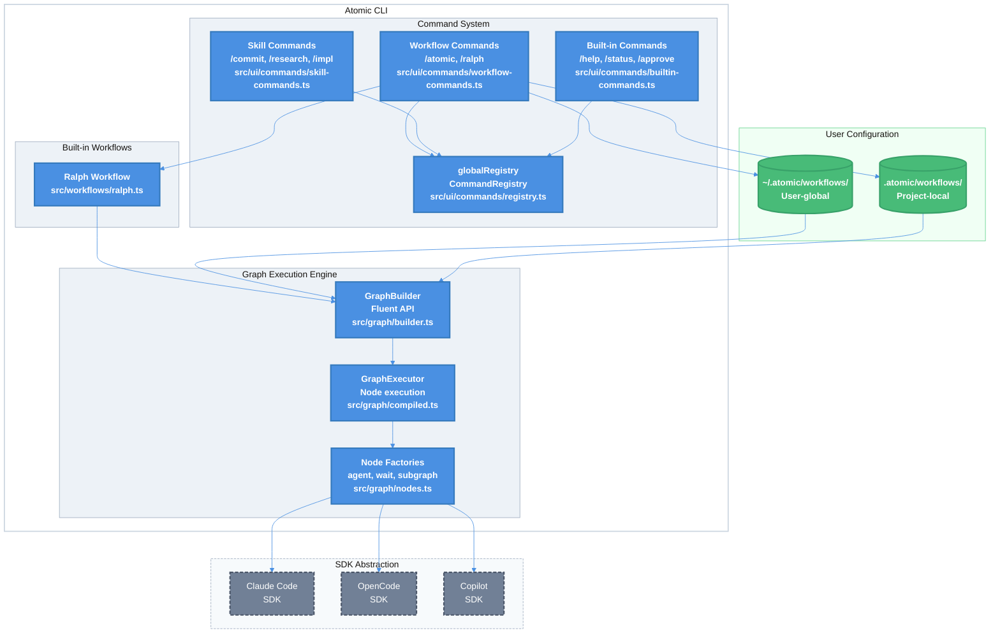

# Atomic Built-in Workflows and Commands Technical Design Document

| Document Metadata      | Details         |
| ---------------------- | --------------- |
| Author(s)              | Developer       |
| Status                 | Draft (WIP)     |
| Team / Owner           | flora131/atomic |
| Created / Last Updated | 2026-02-02      |

## 1. Executive Summary

This RFC proposes consolidating all slash commands, skills, and workflows as built-in to Atomic, eliminating per-agent configuration directory dependencies. The goal is to:

1. **Unify command registration** - Remove dependency on `.claude/`, `.opencode/`, `.github/` directories for command/skill definitions
2. **Make Ralph a built-in workflow** - Migrate Ralph from hook-based to graph-based execution as the primary built-in workflow
3. **Support configurable custom workflows** - Enable user-defined workflows from `.atomic/workflows/` and `~/.atomic/workflows/`
4. **Enable recursive workflow references** - Support subgraph nodes for workflow composition
5. **No tool approval flow** - All tools execute automatically without permission prompts (except `AskUserQuestion` for explicit HITL)
6. **Built-in sub-agent invocation** - Register sub-agents from `.claude/agents/`, `.opencode/agents/`, `.github/agents/` with slash command invocation

**Impact:** This consolidation reduces configuration complexity, eliminates agent-specific command duplication, and provides a unified workflow system that works consistently across all supported AI backends (Claude Code, OpenCode, GitHub Copilot).

### 1.1 Key Design Decisions

**No Tool Approval Flow:**

- All tool calls execute automatically without user permission prompts
- The ONLY exception is `AskUserQuestion` which explicitly pauses for human input
- This is achieved via `permissionMode: 'bypassPermissions'` in Claude SDK, `permission: { default: 'allow' }` in OpenCode, and `--allow-all` mode in Copilot SDK
- Rationale: Atomic workflows are designed for autonomous execution; permission prompts break flow and prevent overnight runs

**No `/approve` or `/status` Commands:**

- Removed: `/approve`, `/reject`, `/status` commands
- Spec approval happens BEFORE workflow execution, not during
- Users review and approve specs manually in the research directory before running `/ralph`
- Progress is tracked via `research/progress.txt` and `research/feature-list.json`, not interactive commands

**Research Reference:** [research/docs/2026-02-02-atomic-builtin-workflows-research.md](../research/docs/2026-02-02-atomic-builtin-workflows-research.md)

## 2. Context and Motivation

### 2.1 Current State

The Atomic CLI currently manages commands and skills across multiple configuration directories (this is being replaced):

```
┌─────────────────────────────────────────────────────────────────────┐
│              CURRENT IMPLEMENTATION (Being Replaced)                 │
├─────────────────────────────────────────────────────────────────────┤
│                                                                      │
│  ┌─────────────────┐  ┌─────────────────┐  ┌─────────────────┐     │
│  │ .claude/        │  │ .github/        │  │ .opencode/      │     │
│  │                 │  │                 │  │                 │     │
│  │ commands/*.md   │  │ commands/*.md   │  │ agents/*.toml   │     │
│  │ settings.json   │  │ hooks.json      │  │ command/*.md    │     │
│  │                 │  │                 │  │                 │     │
│  └────────┬────────┘  └────────┬────────┘  └────────┬────────┘     │
│           │                    │                    │               │
│           ▼                    ▼                    ▼               │
│  ┌─────────────────────────────────────────────────────────────┐   │
│  │           SKILL SEARCH PATHS (skill-commands.ts:126-133)     │   │
│  │                                                              │   │
│  │  • .claude/commands/*.md                                     │   │
│  │  • .opencode/command/*.md                                    │   │
│  │  • .github/commands/*.md                                     │   │
│  │                                                              │   │
│  │  Skills loaded from disk at runtime (REMOVING THIS)          │   │
│  └─────────────────────────────────────────────────────────────┘   │
│                                                                      │
│  NOTE: These directories will remain in the Atomic repo for         │
│  local development only. Production CLI uses built-in commands.     │
└─────────────────────────────────────────────────────────────────────┘
```

**Current Component Locations:**
| Component | File | Key Lines |
| ----------------- | -------------------------------------- | --------------------------------------------------- |
| Built-in Commands | `src/ui/commands/builtin-commands.ts` | 379-409 |
| Skill Commands | `src/ui/commands/skill-commands.ts` | 49-116 (definitions), 126-133 (search paths) |
| Workflow Commands | `src/ui/commands/workflow-commands.ts` | 313-332 (builtin workflows), 149-154 (search paths) |
| Command Registry | `src/ui/commands/registry.ts` | 140-317 (CommandRegistry class) |
| Ralph Config | `src/config/ralph.ts` | 237-239 (feature flag) |

**Research Reference:** [research/docs/2026-02-02-atomic-builtin-workflows-research.md](../research/docs/2026-02-02-atomic-builtin-workflows-research.md) - Section 3: Command/Skill Registration Architecture

### 2.2 The Problem

**Duplication Issues:**

1. Skills must be defined in each agent's config directory (`.claude/`, `.opencode/`, `.github/`)
2. Changes to a skill require updating multiple files across directories
3. Users must configure each agent separately even though skills are identical

**Architecture Limitations:**

1. Skill loading searches agent-specific paths, creating tight coupling
2. Ralph uses hook-based execution with global state (conflicts in parallel sessions)
3. No unified workflow system - commands and workflows are separate concepts
4. Recursive workflows (workflows calling other workflows) not supported

**User Impact:**

- Confusing configuration: "Where do I put my custom command?"
- Inconsistent behavior if agent directories have different skill versions
- Cannot easily share workflows between projects

## 3. Goals and Non-Goals

### 3.1 Functional Goals

- [ ] **G1**: All slash commands and skills are built-in to Atomic (no per-agent directory dependency)
- [ ] **G2**: Ralph is a built-in workflow using graph-based execution only
- [ ] **G3**: Custom workflows can be loaded from `.atomic/workflows/` (local) and `~/.atomic/workflows/` (global); all skills are built-in (no custom skills at runtime)
- [ ] **G4**: Workflows can reference other workflows via subgraph nodes (recursive composition)
- [ ] **G5**: AskUserQuestion is the ONLY tool requiring human input; all other tools auto-execute
- [ ] **G6**: Session isolation for parallel workflow executions
- [ ] **G7**: Built-in sub-agents discovered from `.claude/agents/`, `.opencode/agents/`, `.github/agents/` directories
- [ ] **G8**: Sub-agents invocable via slash commands (e.g., `/codebase-analyzer "analyze X"`)

### 3.2 Non-Goals (Out of Scope)

- [ ] **NG1**: We will NOT remove the per-agent config directories from the Atomic repository (they're used for local development with Claude Code, OpenCode, and Copilot)
- [ ] **NG2**: We will NOT support YAML/JSON workflow definitions in this version (TypeScript only)
- [ ] **NG3**: We will NOT implement tool approval prompts - all tools auto-execute (except AskUserQuestion)
- [ ] **NG4**: We will NOT implement remote workflow registries or package management
- [ ] **NG5**: We will NOT implement hooks as an explicit Atomic module - hooks are passthrough to underlying SDKs (see Section 3.4)
- [ ] **NG6**: We will NOT implement `/approve`, `/reject`, or `/status` commands - spec approval is manual before workflow start

### 3.3 Command Sources

**Production Atomic CLI:**
The Atomic CLI uses **built-in commands exclusively**. All skills, commands, and workflows are embedded in the CLI binary/package:

1. **Built-in commands** - `/help`, `/clear` (UI controls only)
2. **Built-in skills** (from README.md):
   - `/research-codebase` - Analyze codebase and document findings
   - `/create-spec` - Generate technical specification from research
   - `/create-feature-list` - Break spec into implementable tasks
   - `/implement-feature` - Implement next feature from list
   - `/commit` - Create conventional commit
   - `/create-gh-pr` - Push and create pull request
   - `/explain-code` - Explain code section in detail
3. **Built-in workflows**:
   - `/ralph` - Autonomous implementation workflow (graph-based, SDK-native)
4. **Built-in sub-agents** (invocable via slash commands):
   - `/codebase-analyzer` - Analyze implementation details
   - `/codebase-locator` - Locate files and components
   - `/codebase-pattern-finder` - Find similar implementations
   - `/codebase-online-researcher` - Research using web sources
   - `/codebase-research-analyzer` - Deep dive on research topics
   - `/codebase-research-locator` - Discover research documents
   - `/debugger` - Debug errors and test failures
5. **Custom workflows** - Loaded from `.atomic/workflows/` (local) and `~/.atomic/workflows/` (global)

**Removed Commands:**

- ~~`/atomic`~~ - Replaced by `/ralph`
- ~~`/ralph:ralph-loop`~~ - Hook-based, replaced by SDK-native `/ralph`
- ~~`/ralph:cancel-ralph`~~ - Hook-based, no longer needed
- ~~`/ralph:ralph-help`~~ - Hook-based, help integrated into `/help`
- ~~`/approve`~~ - Spec approval is manual before workflow start
- ~~`/reject`~~ - Spec rejection is manual before workflow start
- ~~`/status`~~ - Progress tracked via `research/progress.txt`

**Development Only:**
The per-agent directories (`.claude/`, `.opencode/`, `.github/`) in the Atomic repository are for **local development of the Atomic CLI itself**. They are NOT searched at runtime by users of the CLI.

```
┌─────────────────────────────────────────────────────────────┐
│                    ATOMIC CLI (Production)                   │
│                                                              │
│  ┌──────────────┐  ┌──────────────┐  ┌──────────────┐       │
│  │ Built-in     │  │ Built-in     │  │ Built-in     │       │
│  │ Commands     │  │ Skills       │  │ Workflows    │       │
│  │ (embedded)   │  │ (embedded)   │  │ (embedded)   │       │
│  └──────────────┘  └──────────────┘  └──────────────┘       │
│                                                              │
│  Custom workflows only: .atomic/workflows/                   │
└─────────────────────────────────────────────────────────────┘

┌─────────────────────────────────────────────────────────────┐
│              ATOMIC DEVELOPMENT (This Repo Only)             │
│                                                              │
│  .claude/commands/   - For Claude Code during development   │
│  .opencode/command/  - For OpenCode during development      │
│  .github/commands/   - For Copilot during development       │
│                                                              │
│  These are NOT used by the production CLI                    │
└─────────────────────────────────────────────────────────────┘
```

### 3.4 Hooks: SDK Passthrough (Not an Atomic Module)

Hooks are **not** an explicit module in the Atomic CLI. Instead, hooks are implicitly supported through the underlying agent SDK:

- **Claude Code SDK**: If the user has hooks configured in `.claude/settings.json` or `.claude/hooks.json`, they work automatically
- **OpenCode SDK**: If the SDK supports hooks, they work automatically
- **GitHub Copilot SDK**: If the SDK supports hooks, they work automatically

**Implementation Guidance:**

- Remove any explicit hooks module from `src/` in Atomic CLI
- Do not parse, validate, or process hook configurations in Atomic code
- Let the underlying SDK handle all hook execution natively
- Atomic's role is to invoke the SDK; the SDK handles its own hooks

This approach ensures:

1. No duplication of hook logic between Atomic and SDKs
2. Users get the full hook capabilities of their chosen SDK
3. Atomic remains a thin orchestration layer

## 4. Proposed Solution (High-Level Design)

### 4.1 System Architecture Diagram



### 4.2 Architectural Pattern

We adopt a **Registry + Factory + Graph** pattern:

1. **Registry Pattern**: `CommandRegistry` at `src/ui/commands/registry.ts:140-317` provides centralized command lookup
2. **Factory Pattern**: Node factories (`agentNode`, `waitNode`, `subgraphNode`) at `src/graph/nodes.ts` create typed graph nodes
3. **Graph Pattern**: Pregel-based execution engine at `src/graph/compiled.ts:202-588` orchestrates workflow execution

### 4.3 Key Components

| Component          | Responsibility                 | File Location                          | Key Changes                        |
| ------------------ | ------------------------------ | -------------------------------------- | ---------------------------------- |
| Built-in Skills    | Define all skills as constants | `src/ui/commands/skill-commands.ts`    | Remove disk loading, embed prompts |
| Built-in Workflows | Ralph workflow                 | `src/workflows/ralph.ts`               | Remove hook-based mode, SDK-native |
| Workflow Loader    | Load custom `.ts` workflows    | `src/ui/commands/workflow-commands.ts` | Add subgraph resolution            |
| Subgraph Node      | Compose workflows              | `src/graph/nodes.ts:846-941`           | Enable recursive references        |
| Wait Node          | HITL support (AskUserQuestion) | `src/graph/nodes.ts:675-710`           | Only for explicit user questions   |
| Clear Context Node | Reset context window           | `src/graph/nodes.ts`                   | Clear context at loop boundaries   |
| Sub-agent Registry | Discover and register agents   | `src/ui/commands/agent-commands.ts`    | New file for agent slash commands  |
| Permission Bypass  | Auto-approve all tools         | `src/sdk/*-client.ts`                  | Configure SDK permission modes     |

## 5. Detailed Design

### 5.1 Phase 1: Built-in Skills and Commands

#### 5.1.1 Skill Definition Changes

**Current Implementation** (from research, Section 3):

```typescript
// src/ui/commands/skill-commands.ts:126-133
const SKILL_SEARCH_PATHS = [
  ".claude/commands", // Claude Code commands
  ".opencode/command", // OpenCode commands
  ".github/commands", // GitHub Copilot commands
];
```

**Proposed Implementation**:

```typescript
// src/ui/commands/skill-commands.ts (new structure)

export interface BuiltinSkill {
  name: string;
  description: string;
  aliases?: string[];
  prompt: string; // Embedded prompt content
  hidden?: boolean;
}

export const BUILTIN_SKILLS: BuiltinSkill[] = [
  {
    name: "commit",
    description:
      "Create well-formatted commits with conventional commit format",
    aliases: ["ci"],
    prompt: `Create a well-formatted commit: $ARGUMENTS

Follow these steps:
1. Run \`git status\` to see changes
2. Run \`git diff --staged\` to see staged changes
3. Analyze changes and create commit message
...`,
  },
  {
    name: "research-codebase",
    description: "Document codebase as-is with research directory",
    aliases: ["research"],
    prompt: `Research and document the codebase: $ARGUMENTS
...`,
  },
  // ... additional built-in skills
];
```

#### 5.1.2 Skill Registration

**Current** (`src/ui/commands/skill-commands.ts:206-244`):

- Loads skill prompt from disk via `loadSkillPrompt()`
- Falls back to sending raw slash command if not found

**Proposed**:

```typescript
// src/ui/commands/skill-commands.ts

export function registerBuiltinSkills(): void {
  for (const skill of BUILTIN_SKILLS) {
    const command: CommandDefinition = {
      name: skill.name,
      description: skill.description,
      category: "skill",
      aliases: skill.aliases,
      hidden: skill.hidden,
      execute: (args, context) => {
        const expandedPrompt = skill.prompt.replace(
          /\$ARGUMENTS/g,
          args || "[no arguments provided]",
        );
        context.sendMessage(expandedPrompt);
        return { success: true };
      },
    };

    if (!globalRegistry.has(command.name)) {
      globalRegistry.register(command);
    }
  }
}
```

#### 5.1.3 No Custom Skills at Runtime

The production Atomic CLI does **not** load custom skills from disk. All skills are built-in:

```typescript
// src/ui/commands/skill-commands.ts

// Skills are registered at build time, not loaded from disk
export function registerBuiltinSkills(): void {
  for (const skill of BUILTIN_SKILLS) {
    globalRegistry.register(createSkillCommand(skill));
  }
}

// No CUSTOM_SKILL_SEARCH_PATHS - per-agent directories are development-only
```

**Rationale:**

- Consistent behavior across all installations
- No configuration drift between users
- Skills are tested and versioned with the CLI
- Users who need custom commands can use custom workflows instead

### 5.2 Phase 2: Built-in Sub-Agents with Slash Command Invocation

#### 5.2.1 Sub-Agent Discovery

Sub-agents are discovered from the following directories (in priority order):

1. **Built-in agents** - Embedded in Atomic CLI (highest priority)
2. **Project agents** - `.claude/agents/`, `.opencode/agents/`, `.github/agents/`
3. **User global agents** - `~/.claude/agents/`, `~/.opencode/agents/`, `~/.copilot/agents/`
4. **Custom agents** - `.atomic/agents/` (local) and `~/.atomic/agents/` (global)

```typescript
// src/ui/commands/agent-commands.ts

export const AGENT_DISCOVERY_PATHS = [
  // Project-local agents (per SDK)
  ".claude/agents",
  ".opencode/agents",
  ".github/agents",
  // Unified Atomic agents
  ".atomic/agents",
];

export const GLOBAL_AGENT_PATHS = [
  // User-global agents (per SDK)
  "~/.claude/agents",
  "~/.opencode/agents",
  "~/.copilot/agents",
  // Unified Atomic agents
  "~/.atomic/agents",
];
```

#### 5.2.2 Agent Definition Format

Agents use a unified markdown format with YAML frontmatter:

```typescript
// src/ui/commands/agent-commands.ts

export interface AgentDefinition {
  name: string; // Unique identifier, becomes slash command
  description: string; // When to use this agent
  tools?: string[]; // Allowed tools (inherits all if omitted)
  model?: string; // Model override (sonnet, opus, haiku)
  prompt: string; // System prompt content
  source: "builtin" | "project" | "user" | "atomic";
}

// Frontmatter schema (normalized across SDKs)
interface AgentFrontmatter {
  name: string; // Claude: name, OpenCode: filename, Copilot: name
  description: string; // All SDKs
  tools?: string[] | Record<string, boolean>; // Claude: array, OpenCode: object
  model?: string; // Claude: sonnet|opus|haiku, OpenCode: provider/model
  mode?: string; // OpenCode only: "subagent" | "primary"
}
```

#### 5.2.3 Built-in Agents

The following agents are embedded in Atomic CLI:

```typescript
// src/ui/commands/agent-commands.ts

export const BUILTIN_AGENTS: AgentDefinition[] = [
  {
    name: "codebase-analyzer",
    description:
      "Analyzes codebase implementation details. Call when you need to find detailed information about specific components.",
    tools: ["Glob", "Grep", "NotebookRead", "Read", "LS", "Bash"],
    model: "opus",
    prompt: `You are a specialist at understanding HOW code works...`,
    source: "builtin",
  },
  {
    name: "codebase-locator",
    description:
      "Locates files, directories, and components relevant to a feature or task. A 'Super Grep/Glob/LS tool'.",
    tools: ["Glob", "Grep", "NotebookRead", "Read", "LS", "Bash"],
    model: "haiku",
    prompt: `You are an expert at finding things in codebases...`,
    source: "builtin",
  },
  {
    name: "codebase-pattern-finder",
    description:
      "Finds similar implementations, usage examples, or existing patterns that can be modeled after.",
    tools: ["Glob", "Grep", "NotebookRead", "Read", "LS", "Bash"],
    model: "sonnet",
    prompt: `You find concrete code examples based on patterns...`,
    source: "builtin",
  },
  {
    name: "codebase-online-researcher",
    description:
      "Researches questions using web sources for modern, online-only information.",
    tools: [
      "Glob",
      "Grep",
      "Read",
      "LS",
      "WebFetch",
      "WebSearch",
      "mcp__deepwiki__ask_question",
    ],
    model: "sonnet",
    prompt: `You research questions using web sources...`,
    source: "builtin",
  },
  {
    name: "codebase-research-analyzer",
    description: "Deep dive on research topics in the research/ directory.",
    tools: ["Read", "Grep", "Glob", "LS", "Bash"],
    model: "sonnet",
    prompt: `You analyze research documents...`,
    source: "builtin",
  },
  {
    name: "codebase-research-locator",
    description:
      "Discovers relevant documents in research/ directory for metadata storage.",
    tools: ["Read", "Grep", "Glob", "LS", "Bash"],
    model: "haiku",
    prompt: `You find research documents...`,
    source: "builtin",
  },
  {
    name: "debugger",
    description:
      "Debugging specialist for errors, test failures, and unexpected behavior.",
    tools: [
      "Bash",
      "Task",
      "AskUserQuestion",
      "Edit",
      "Glob",
      "Grep",
      "Read",
      "Write",
      "WebFetch",
      "WebSearch",
    ],
    model: "sonnet",
    prompt: `You are a debugging specialist...`,
    source: "builtin",
  },
];
```

#### 5.2.4 Agent Slash Command Registration

Agents are registered as slash commands, allowing direct invocation:

```typescript
// src/ui/commands/agent-commands.ts

export function registerAgentCommands(): void {
  // Load all agents (builtin + discovered)
  const agents = [...BUILTIN_AGENTS, ...(await discoverAgents())];

  for (const agent of agents) {
    const command: CommandDefinition = {
      name: agent.name,
      description: agent.description,
      category: "agent",
      hidden: false,
      execute: async (args, context) => {
        // Spawn subagent with the given prompt
        const result = await context.spawnSubagent({
          name: agent.name,
          prompt: args || "[no arguments provided]",
          systemPrompt: agent.prompt,
          tools: agent.tools,
          model: agent.model,
          permissionMode: "bypassPermissions", // Auto-approve all tools
        });
        return { success: true, message: result };
      },
    };

    if (!globalRegistry.has(command.name)) {
      globalRegistry.register(command);
    }
  }
}
```

**Usage Examples:**

```bash
# Invoke codebase-analyzer with a prompt
/codebase-analyzer "Analyze the authentication flow in src/auth/"

# Invoke debugger for an error
/debugger "Fix the TypeError in src/utils/parser.ts:45"

# Invoke pattern-finder
/codebase-pattern-finder "Find examples of form validation"
```

### 5.3 Phase 3: No Tool Approval Flow

#### 5.3.1 Permission Mode Configuration

All SDKs are configured to bypass tool approval:

**Claude Agent SDK:**

```typescript
// src/sdk/claude-client.ts

const session = await createSession({
  prompt: taskPrompt,
  options: {
    permissionMode: "bypassPermissions",
    allowDangerouslySkipPermissions: true,
    // AskUserQuestion is the ONLY tool that pauses
  },
});
```

**OpenCode SDK:**

```typescript
// src/sdk/opencode-client.ts

const session = await opencode.createSession({
  agent: agentConfig,
  permission: {
    default: "allow", // Auto-approve all tools
    // No 'ask' rules - everything allowed
  },
});
```

**Copilot SDK:**

```typescript
// src/sdk/copilot-client.ts

const session = await client.createSession({
  customAgents: [...],
  // No PermissionHandler registered = --allow-all mode
  // All tools execute without prompts
});
```

#### 5.3.2 AskUserQuestion: The Exception

`AskUserQuestion` is the ONLY tool that pauses for human input:

```typescript
// src/graph/nodes.ts

export function askUserNode<TState extends WorkflowState>(
  name: string,
  options: AskUserOptions,
): NodeDefinition<TState> {
  return {
    id: name,
    type: "ask_user",
    execute: async (state, context) => {
      // This is the ONLY tool that pauses execution
      context.emit("human_input_required", {
        requestId: crypto.randomUUID(),
        question: options.question,
        options: options.options,
      });

      return {
        ...state,
        __waitingForInput: true,
        __waitNodeId: name,
      };
    },
  };
}
```

**When AskUserQuestion is used:**

1. Explicit questions to the user during workflow design
2. NOT for tool approvals (those are auto-approved)
3. NOT for spec review (done before workflow starts)

### 5.4 Phase 4: Built-in Ralph Workflow (No In-Workflow Approval)

#### 5.4.1 Remove Hook-Based Mode

**Current** (`src/config/ralph.ts:237-239`):

```typescript
export function isGraphEngineEnabled(): boolean {
  return process.env[RALPH_ENV_VARS.ATOMIC_USE_GRAPH_ENGINE] === "true";
}
```

**Proposed**: Remove feature flag, always use graph engine:

```typescript
// src/config/ralph.ts

// Remove isGraphEngineEnabled() function
// Graph engine is now the only execution mode

export const RALPH_CONFIG = {
  maxIterations: 100,
  checkpointing: true,
  // No autoApproveSpec - spec approval is manual before workflow starts
};
```

#### 5.4.2 Ralph as Built-in Workflow (No Wait Nodes for Approval)

**Key Design Change:** The workflow does NOT include wait nodes for spec approval. Spec approval is done BEFORE the workflow starts:

1. User runs `/research-codebase` → reviews research doc manually
2. User runs `/create-spec` → reviews spec manually
3. User runs `/create-feature-list` → reviews feature list manually
4. **Only then** user runs `/atomic` or `/ralph:ralph-loop` to start autonomous execution

**Proposed** (`src/ui/commands/workflow-commands.ts`):

```typescript
const BUILTIN_WORKFLOW_DEFINITIONS: WorkflowMetadata[] = [
  {
    name: "ralph",
    description: "Start the Ralph autonomous implementation workflow",
    // No aliases - just /ralph
    createWorkflow: (config) => createRalphWorkflow(config),
  },
];
```

**Note:** The workflow is invoked as `/ralph` only. The old `/atomic` and `/ralph:*` hook-based commands are removed.

**Context Window Management:** The workflow clears the context window at the start of each loop iteration to:

1. Prevent context window overflow during long-running workflows
2. Ensure each feature implementation starts with a fresh context
3. Reduce token costs by not carrying forward stale conversation history

The `clearContextNode` is placed at the beginning of loops (not the end) so the agent starts each iteration with maximum available context for the task at hand.

```typescript
// src/workflows/ralph.ts

export function createRalphWorkflow(
  config: RalphWorkflowConfig = {},
): CompiledGraph<RalphWorkflowState> {
  const sessionId = generateSessionId();

  // IMPORTANT: No wait nodes for approval - spec is approved before workflow starts
  // The workflow assumes feature-list.json and spec already exist and are approved

  return graph<RalphWorkflowState>()
    .start(
      // Verify prerequisites exist (spec, feature-list)
      agentNode("verify-prerequisites", {
        prompt: VERIFY_PREREQUISITES_PROMPT,
        sessionId,
      }),
    )
    .loop(
      // Clear context at the start of each loop iteration to prevent context window overflow
      clearContextNode("clear-before-feature"),
      agentNode("implement-feature", {
        prompt: IMPLEMENT_FEATURE_PROMPT,
        sessionId,
      }),
      {
        until: (state) => state.allFeaturesPassing,
        maxIterations: config.maxIterations ?? 100,
      },
    )
    .then(agentNode("create-pr", { prompt: CREATE_PR_PROMPT, sessionId }))
    .end()
    .compile({
      checkpointing: config.checkpointing ?? true,
      checkpointDir: config.checkpointDir ?? "research/checkpoints",
    });
}
```

**Note:** There is NO `.if()/.else()/.endif()` for spec approval. The workflow runs straight through:

1. Verify prerequisites (spec + feature-list exist) - OR run without feature-list
2. Loop through features until all pass
3. Create PR

#### 5.4.3 Custom Ralph Nodes with Session Scoping

Ralph workflows use custom node factories that handle session isolation and feature-list checking. Multiple Ralph sessions can run concurrently on the same branch. Each session stores all its artifacts in a dedicated folder.

**Session Directory Structure:**

```
.ralph/
└── sessions/
    ├── {session-id}/              # Each session has its own folder
    │   ├── session.json           # Session state and metadata
    │   ├── feature-list.json      # Copy of features (if using feature-list)
    │   ├── progress.txt           # Session-specific progress
    │   ├── checkpoints/           # Workflow checkpoints
    │   │   ├── node-001.json
    │   │   └── ...
    │   ├── research/              # Session research artifacts
    │   │   └── ...
    │   └── logs/                  # Session logs
    │       ├── agent-calls.jsonl
    │       └── errors.log
    └── {another-session-id}/
        └── ...
```

**Session ID Generation:**

Session IDs are always **random UUIDs** to prevent naming conflicts:

- Format: `xxxxxxxx-xxxx-xxxx-xxxx-xxxxxxxxxxxx` (standard UUID v4)
- Generated automatically when `/ralph` is invoked
- Displayed at session start for reference

```bash
# Start new session (UUID auto-generated)
/ralph
# Output: Started Ralph session: a1b2c3d4-e5f6-7890-abcd-ef1234567890

# Yolo mode (UUID auto-generated)
/ralph --yolo "Fix the login bug"
# Output: Started Ralph session: f9e8d7c6-b5a4-3210-fedc-ba0987654321

# Resume existing session by UUID
/ralph --resume a1b2c3d4-e5f6-7890-abcd-ef1234567890
```

**Stopping Ralph Execution:**

Ralph can be stopped gracefully with a single keypress:

- **Ctrl+C** - Stop execution, save checkpoint
- **Esc** - Stop execution, save checkpoint

Both actions:

1. Interrupt the current agent call
2. Save session state to `.ralph/sessions/{id}/session.json`
3. Save checkpoint for potential resumption
4. Mark session status as `'paused'`
5. Display session ID for later resumption

**Session State Schema:**

```typescript
// src/workflows/ralph-session.ts

export interface RalphSession {
  // Identity
  sessionId: string; // Unique session identifier
  sessionDir: string; // Path to .ralph/sessions/{sessionId}/

  // Timestamps
  createdAt: string; // ISO timestamp
  lastUpdated: string; // ISO timestamp

  // Configuration
  yolo: boolean; // true = no feature-list, false = uses feature-list
  maxIterations: number; // Configured max iterations
  sourceFeatureListPath?: string; // Original feature-list.json path (if not yolo)

  // Feature tracking (session-scoped copy)
  features: RalphFeature[]; // Features for this session
  currentFeatureIndex: number; // Current feature being implemented
  completedFeatures: string[]; // Feature IDs completed

  // Progress
  iteration: number; // Current loop iteration
  status: "running" | "paused" | "completed" | "failed";

  // Output
  prUrl?: string; // Created PR URL (if any)
  prBranch?: string; // Branch name for PR
}

export interface RalphFeature {
  id: string;
  name: string;
  description: string;
  acceptanceCriteria?: string[];
  status: "pending" | "in_progress" | "passing" | "failing";
  implementedAt?: string; // ISO timestamp when completed
  error?: string; // Error message if failing
}
```

**Session Artifacts:**

| Artifact      | Path                     | Description                                        |
| ------------- | ------------------------ | -------------------------------------------------- |
| Session state | `session.json`           | Current session metadata and progress              |
| Feature list  | `feature-list.json`      | Session's copy of features (immutable after start) |
| Progress      | `progress.txt`           | Human-readable progress summary                    |
| Checkpoints   | `checkpoints/*.json`     | Workflow state checkpoints for resumption          |
| Research      | `research/`              | Any research docs generated during session         |
| Logs          | `logs/agent-calls.jsonl` | All agent calls and responses                      |
| Errors        | `logs/errors.log`        | Error logs for debugging                           |

**Custom Node Factories:**

```typescript
// src/graph/nodes/ralph-nodes.ts

import { NodeDefinition, WorkflowState } from "../types";
import {
  readFeatureList,
  updateFeatureList,
  createSession,
  loadSession,
} from "../utils/ralph-session";

/**
 * Node that initializes a Ralph session.
 * - Default: Copies features from research/feature-list.json into session
 * - With --yolo: Runs without a feature list (freestyle mode)
 * - Session ID is always a random UUID (prevents naming conflicts)
 */
export function initRalphSessionNode<TState extends RalphWorkflowState>(
  name: string,
  options: {
    featureListPath?: string; // Default: 'research/feature-list.json'
    yolo?: boolean; // true = no feature-list (default: false)
    resumeSessionId?: string; // Optional: UUID of session to resume
  } = {},
): NodeDefinition<TState> {
  return {
    id: name,
    type: "ralph_init",
    execute: async (state, context) => {
      // Always use UUID - either resume existing or generate new
      const sessionId = options.resumeSessionId || crypto.randomUUID();
      const sessionDir = `.ralph/sessions/${sessionId}`;

      console.log(`Started Ralph session: ${sessionId}`);

      // Check if session already exists (resume case)
      const existingSession = await loadSessionIfExists(sessionDir);
      if (existingSession) {
        console.log(`Resuming existing session: ${sessionId}`);
        return {
          ...state,
          ralphSessionId: sessionId,
          ralphSessionDir: sessionDir,
          yolo: existingSession.yolo,
          features: existingSession.features,
          currentFeatureIndex: existingSession.currentFeatureIndex,
          iteration: existingSession.iteration,
        };
      }

      // Create new session directory structure
      await context.mkdir(sessionDir);
      await context.mkdir(`${sessionDir}/checkpoints`);
      await context.mkdir(`${sessionDir}/research`);
      await context.mkdir(`${sessionDir}/logs`);

      const yolo = options.yolo ?? false;
      const sourceFeatureListPath =
        options.featureListPath || "research/feature-list.json";

      // Create session
      const session: RalphSession = {
        sessionId,
        sessionDir,
        createdAt: new Date().toISOString(),
        lastUpdated: new Date().toISOString(),
        yolo,
        maxIterations: state.config?.maxIterations ?? 100,
        features: [],
        currentFeatureIndex: 0,
        completedFeatures: [],
        iteration: 0,
        status: "running",
      };

      // If NOT yolo, copy features into session
      if (!yolo) {
        session.sourceFeatureListPath = sourceFeatureListPath;
        const featureList = await readFeatureList(sourceFeatureListPath);

        // Copy features into session (session owns its own copy)
        session.features = featureList.features.map((f) => ({
          ...f,
          status: "pending" as const,
        }));

        // Save session's copy of feature-list
        await context.writeFile(
          `${sessionDir}/feature-list.json`,
          JSON.stringify({ features: session.features }, null, 2),
        );
      }

      // Initialize progress.txt
      await context.writeFile(
        `${sessionDir}/progress.txt`,
        `# Ralph Session: ${sessionId}\n` +
          `Created: ${session.createdAt}\n` +
          `Mode: ${yolo ? "yolo (freestyle)" : "feature-list"}\n` +
          `Features: ${session.features.length}\n\n` +
          `## Progress\n`,
      );

      // Save session state
      await context.writeFile(
        `${sessionDir}/session.json`,
        JSON.stringify(session, null, 2),
      );

      return {
        ...state,
        ralphSessionId: sessionId,
        ralphSessionDir: sessionDir,
        yolo,
        features: session.features,
        currentFeatureIndex: 0,
        iteration: 0,
      };
    },
  };
}

/**
 * Node that implements the next feature from the session's feature list.
 * In yolo mode, this node expects a task prompt from the user.
 * All artifacts are saved to the session directory.
 */
export function implementFeatureNode<TState extends RalphWorkflowState>(
  name: string,
  options: {
    prompt?: string; // Used in yolo mode
  } = {},
): NodeDefinition<TState> {
  return {
    id: name,
    type: "ralph_implement",
    execute: async (state, context) => {
      const sessionDir = state.ralphSessionDir;
      const session = await loadSession(`${sessionDir}/session.json`);

      if (!session.yolo) {
        // Feature-list mode: Get next feature to implement
        const nextFeature = session.features.find(
          (f) => f.status === "pending",
        );

        if (!nextFeature) {
          // All features complete
          return {
            ...state,
            allFeaturesPassing: true,
          };
        }

        // Mark as in_progress
        nextFeature.status = "in_progress";
        await saveSession(sessionDir, session);

        // Log the agent call
        await appendLog(sessionDir, "agent-calls", {
          timestamp: new Date().toISOString(),
          feature: nextFeature.id,
          action: "implement",
        });

        // Execute agent to implement feature
        const result = await context.runAgent({
          prompt: IMPLEMENT_FEATURE_PROMPT.replace(
            "$FEATURE",
            JSON.stringify(nextFeature),
          ),
          permissionMode: "bypassPermissions",
        });

        // Check if feature is now passing (tests pass, etc.)
        const isPassing = await checkFeaturePassing(nextFeature, context);
        nextFeature.status = isPassing ? "passing" : "failing";
        nextFeature.implementedAt = new Date().toISOString();

        if (isPassing) {
          session.completedFeatures.push(nextFeature.id);
        } else {
          nextFeature.error = result.error || "Feature tests not passing";
        }

        session.iteration++;
        session.lastUpdated = new Date().toISOString();
        await saveSession(sessionDir, session);

        // Update session's feature-list.json
        await context.writeFile(
          `${sessionDir}/feature-list.json`,
          JSON.stringify({ features: session.features }, null, 2),
        );

        // Update progress.txt
        await appendProgress(sessionDir, nextFeature, isPassing);

        return {
          ...state,
          currentFeature: nextFeature,
          iteration: session.iteration,
          allFeaturesPassing: session.features.every(
            (f) => f.status === "passing",
          ),
        };
      } else {
        // Yolo mode - use provided prompt (required for yolo)
        const userPrompt = options.prompt || state.userPrompt;

        if (!userPrompt) {
          throw new Error(
            'Yolo mode requires a prompt. Use: /ralph --yolo "your task"',
          );
        }

        // Append completion promise instruction to the prompt
        // This allows the agent to signal when the task is complete
        const COMPLETION_INSTRUCTION = `

<EXTREMELY_IMPORTANT>When you believe you have successfully completed the user request output: COMPLETE.</EXTREMELY_IMPORTANT>`;

        const promptWithCompletion = userPrompt + COMPLETION_INSTRUCTION;

        // Log the agent call
        await appendLog(sessionDir, "agent-calls", {
          timestamp: new Date().toISOString(),
          action: "yolo",
          prompt: userPrompt, // Log original prompt without instruction
        });

        // Execute the task
        const result = await context.runAgent({
          prompt: promptWithCompletion,
          permissionMode: "bypassPermissions",
        });

        // Check if agent signaled completion
        const isComplete =
          result.output?.includes("COMPLETE") ||
          result.text?.includes("COMPLETE");

        session.iteration++;
        session.lastUpdated = new Date().toISOString();

        if (isComplete) {
          session.status = "completed";
        }

        await saveSession(sessionDir, session);

        // Update progress.txt
        const statusEmoji = isComplete ? "✓ COMPLETE" : "→";
        await context.appendFile(
          `${sessionDir}/progress.txt`,
          `\n[${new Date().toISOString()}] ${statusEmoji} Iteration ${session.iteration}: ${userPrompt.slice(0, 50)}...\n`,
        );

        return {
          ...state,
          iteration: session.iteration,
          lastResult: result,
          yoloComplete: isComplete, // Signal completion for loop exit
        };
      }
    },
  };
}

/**
 * Node that checks if workflow should continue or exit.
 * Exit conditions:
 * - Feature-list mode: all features passing
 * - Yolo mode: agent outputs "COMPLETE" (completion promise)
 * - Both modes: max iterations reached (if maxIterations > 0)
 */
export function checkCompletionNode<TState extends RalphWorkflowState>(
  name: string,
): NodeDefinition<TState> {
  return {
    id: name,
    type: "ralph_check",
    execute: async (state, context) => {
      const sessionDir = state.ralphSessionDir;
      const session = await loadSession(`${sessionDir}/session.json`);

      // Check max iterations (0 = infinite)
      const maxReached =
        session.maxIterations > 0 && session.iteration >= session.maxIterations;

      if (session.yolo) {
        // Yolo mode: check for completion promise or max iterations
        const isComplete = state.yoloComplete || session.status === "completed";

        if (isComplete) {
          console.log("Task completed! Agent signaled COMPLETE.");
        } else if (maxReached) {
          console.log(`Max iterations (${session.maxIterations}) reached.`);
        }

        return {
          ...state,
          yoloComplete: isComplete,
          maxIterationsReached: maxReached,
          shouldContinue: !isComplete && !maxReached,
        };
      }

      // Feature-list mode: check if all features pass
      const allPassing = session.features.every((f) => f.status === "passing");

      // Update session status
      if (allPassing) {
        session.status = "completed";
        await saveSession(sessionDir, session);
        console.log("All features passing!");
      } else if (maxReached) {
        console.log(`Max iterations (${session.maxIterations}) reached.`);
      }

      return {
        ...state,
        allFeaturesPassing: allPassing,
        maxIterationsReached: maxReached,
        shouldContinue: !allPassing && !maxReached,
      };
    },
  };
}

/**
 * Node that creates a PR with all changes from the session.
 * PR metadata is saved to the session directory.
 */
export function createPRNode<TState extends RalphWorkflowState>(
  name: string,
  options: {
    baseBranch?: string;
    titleTemplate?: string;
  } = {},
): NodeDefinition<TState> {
  return {
    id: name,
    type: "ralph_pr",
    execute: async (state, context) => {
      const sessionDir = state.ralphSessionDir;
      const session = await loadSession(`${sessionDir}/session.json`);

      const result = await context.runAgent({
        prompt: CREATE_PR_PROMPT.replace(
          "$COMPLETED_FEATURES",
          JSON.stringify(session.completedFeatures),
        ).replace("$SESSION_ID", session.sessionId),
        permissionMode: "bypassPermissions",
      });

      session.prUrl = result.prUrl;
      session.prBranch = result.branch;
      session.status = "completed";
      session.lastUpdated = new Date().toISOString();
      await saveSession(sessionDir, session);

      // Final progress update
      await context.appendFile(
        `${sessionDir}/progress.txt`,
        `\n## Completed\n` +
          `PR: ${result.prUrl}\n` +
          `Branch: ${result.branch}\n` +
          `Completed at: ${session.lastUpdated}\n`,
      );

      return {
        ...state,
        prUrl: result.prUrl,
        prBranch: result.branch,
      };
    },
  };
}
```

**Example: Ralph Workflow with Custom Nodes:**

```typescript
// src/workflows/ralph.ts

import { graph } from "../graph/builder";
import {
  initRalphSessionNode,
  implementFeatureNode,
  checkCompletionNode,
  createPRNode,
} from "../graph/nodes/ralph-nodes";
import { clearContextNode } from "../graph/nodes";

export function createRalphWorkflow(config: RalphWorkflowConfig = {}) {
  return graph<RalphWorkflowState>()
    .start(
      initRalphSessionNode("init-session", {
        resumeSessionId: config.resumeSessionId, // Optional: UUID to resume
        yolo: config.yolo ?? false, // Default: uses feature-list
        featureListPath: config.featureListPath,
      }),
    )
    .loop(
      clearContextNode("clear-before-feature"),
      implementFeatureNode("implement-feature"),
      checkCompletionNode("check-completion"),
      {
        until: (state) => !state.shouldContinue,
        maxIterations: config.maxIterations ?? 100,
      },
    )
    .then(
      createPRNode("create-pr", {
        baseBranch: config.baseBranch,
      }),
    )
    .end()
    .compile({
      checkpointing: config.checkpointing ?? true,
      // Checkpoints saved to session directory (set dynamically in initRalphSessionNode)
      checkpointDir: (state) => `${state.ralphSessionDir}/checkpoints`,
    });
}

// Helper: Session management utilities
export async function loadSessionIfExists(
  sessionDir: string,
): Promise<RalphSession | null> {
  try {
    const content = await fs.readFile(`${sessionDir}/session.json`, "utf-8");
    return JSON.parse(content);
  } catch {
    return null;
  }
}

export async function loadSession(sessionPath: string): Promise<RalphSession> {
  const content = await fs.readFile(sessionPath, "utf-8");
  return JSON.parse(content);
}

export async function saveSession(
  sessionDir: string,
  session: RalphSession,
): Promise<void> {
  session.lastUpdated = new Date().toISOString();
  await fs.writeFile(
    `${sessionDir}/session.json`,
    JSON.stringify(session, null, 2),
  );
}

export async function appendLog(
  sessionDir: string,
  logName: string,
  entry: Record<string, unknown>,
): Promise<void> {
  await fs.appendFile(
    `${sessionDir}/logs/${logName}.jsonl`,
    JSON.stringify(entry) + "\n",
  );
}

export async function appendProgress(
  sessionDir: string,
  feature: RalphFeature,
  passed: boolean,
): Promise<void> {
  const status = passed ? "✓" : "✗";
  await fs.appendFile(
    `${sessionDir}/progress.txt`,
    `[${new Date().toISOString()}] ${status} ${feature.name}\n`,
  );
}
```

**Interrupt Handling (Ctrl+C / Esc):**

Ralph execution can be stopped gracefully with a single keypress. The workflow executor handles interrupts:

```typescript
// src/workflows/ralph-executor.ts

export class RalphExecutor {
  private abortController: AbortController;
  private sessionDir: string | null = null;

  constructor() {
    this.abortController = new AbortController();
    this.setupInterruptHandlers();
  }

  private setupInterruptHandlers(): void {
    // Ctrl+C handler
    process.on("SIGINT", () => this.handleInterrupt());

    // Esc key handler (for TUI)
    if (process.stdin.isTTY) {
      process.stdin.setRawMode(true);
      process.stdin.on("data", (data) => {
        if (data[0] === 0x1b) {
          // Esc key
          this.handleInterrupt();
        }
      });
    }
  }

  private async handleInterrupt(): Promise<void> {
    console.log("\nStopping Ralph execution...");

    // Signal abort to current agent call
    this.abortController.abort();

    // Save session state as paused
    if (this.sessionDir) {
      const session = await loadSession(`${this.sessionDir}/session.json`);
      session.status = "paused";
      session.lastUpdated = new Date().toISOString();
      await saveSession(this.sessionDir, session);

      // Save checkpoint
      await this.saveCheckpoint();

      console.log(`Paused Ralph session: ${session.sessionId}`);
      console.log(`Resume with: /ralph --resume ${session.sessionId}`);
    }

    process.exit(0);
  }

  async run(
    workflow: CompiledGraph,
    config: RalphWorkflowConfig,
  ): Promise<void> {
    const result = await workflow.run({
      config,
      signal: this.abortController.signal,
    });

    // Store session dir for interrupt handling
    this.sessionDir = result.ralphSessionDir;

    // ... execution loop
  }
}
```

**Interrupt Behavior:**

| Action             | Behavior                                                   |
| ------------------ | ---------------------------------------------------------- |
| First Ctrl+C       | Graceful stop: save checkpoint, mark session as `'paused'` |
| First Esc          | Same as Ctrl+C                                             |
| During agent call  | Abort current call, save partial progress                  |
| Between iterations | Stop before next iteration starts                          |

**Session Status Values:**

| Status        | Description                                  |
| ------------- | -------------------------------------------- |
| `'running'`   | Session is actively executing                |
| `'paused'`    | Stopped by user (Ctrl+C/Esc), can be resumed |
| `'completed'` | All features implemented, PR created         |
| `'failed'`    | Unrecoverable error occurred                 |

**Concurrent Session Support:**

Multiple Ralph sessions can run concurrently because:

1. **UUID session IDs**: Random UUIDs prevent naming conflicts
2. **Session-scoped artifacts**: Each session has its own `.ralph/sessions/{uuid}/` directory
3. **Independent feature copies**: Each session gets its own copy of the feature-list
4. **No global locks**: Sessions only modify their own directory

```bash
# Terminal 1: Start first session
/ralph
# Output: Started Ralph session: a1b2c3d4-...

# Terminal 2: Start second session (concurrent)
/ralph
# Output: Started Ralph session: f9e8d7c6-...

# Both sessions run independently with their own artifacts
```

**Command Flags:**

| Flag                    | Description                                                              |
| ----------------------- | ------------------------------------------------------------------------ |
| `--yolo`                | Run without feature-list (freestyle mode). Requires a prompt argument.   |
| `--resume <uuid>`       | Resume a paused session by its UUID.                                     |
| `--max-iterations <n>`  | Maximum iterations before stopping (default: 100, 0 = infinite)          |
| `--feature-list <path>` | Custom path to feature-list.json (default: `research/feature-list.json`) |

**Yolo Mode Completion Promise:**

In `--yolo` mode, Ralph automatically appends a completion instruction to your prompt:

```
<EXTREMELY_IMPORTANT>When you believe you have successfully completed the user request output: COMPLETE.</EXTREMELY_IMPORTANT>
```

This allows the agent to signal when the task is done, enabling:

- **Infinite iterations** (`--max-iterations 0`) without getting stuck
- **Natural exit** when the agent determines the task is complete
- **No manual intervention** needed to stop the loop

**Exit Conditions:**

| Mode         | Exit When                            |
| ------------ | ------------------------------------ |
| Feature-list | All features have status `'passing'` |
| Yolo         | Agent outputs `COMPLETE` in response |
| Both         | Max iterations reached (if > 0)      |
| Both         | User presses Ctrl+C or Esc           |

**Stopping and Resuming:**

```bash
# Start a session
/ralph
# Output: Started Ralph session: a1b2c3d4-e5f6-7890-abcd-ef1234567890

# Press Ctrl+C or Esc to stop
# Output: Paused Ralph session: a1b2c3d4-e5f6-7890-abcd-ef1234567890
#         Resume with: /ralph --resume a1b2c3d4-e5f6-7890-abcd-ef1234567890

# Resume later
/ralph --resume a1b2c3d4-e5f6-7890-abcd-ef1234567890
```

**Listing Sessions:**

```bash
# List all Ralph sessions
ls .ralph/sessions/

# Check session status
cat .ralph/sessions/{uuid}/session.json | jq '.status'

# View session progress
cat .ralph/sessions/{uuid}/progress.txt

# Find paused sessions
find .ralph/sessions -name session.json -exec grep -l '"status": "paused"' {} \;
```

### 5.5 Phase 5: Configurable Custom Workflows

#### 5.5.1 Workflow File Format

**Location**: `.atomic/workflows/*.ts` or `~/.atomic/workflows/*.ts`

**Required Exports**:

```typescript
// .atomic/workflows/my-workflow.ts

import type { CompiledGraph, WorkflowState } from "@atomic/graph";
import { graph, agentNode, waitNode } from "@atomic/graph";

export const name = "my-workflow";
export const description = "A custom workflow for XYZ";
export const aliases = ["mw", "custom"];

interface MyWorkflowState extends WorkflowState {
  customField: string;
}

export default function createWorkflow(
  config?: Record<string, unknown>,
): CompiledGraph<MyWorkflowState> {
  return graph<MyWorkflowState>()
    .start(agentNode("step-1", { prompt: "Do step 1" }))
    .then(agentNode("step-2", { prompt: "Do step 2" }))
    .end()
    .compile();
}
```

#### 5.5.2 Dynamic Loading

**Enhanced** (`src/ui/commands/workflow-commands.ts`):

```typescript
export async function loadWorkflowsFromDisk(): Promise<void> {
  const discovered = await discoverWorkflowFiles();
  const loadedWorkflows = new Map<string, WorkflowMetadata>();

  for (const { path, source } of discovered) {
    try {
      const module = await import(path);

      const metadata: WorkflowMetadata = {
        name: module.name || basename(path, ".ts"),
        description: module.description || "",
        aliases: module.aliases || [],
        createWorkflow: module.default,
        defaultConfig: module.defaultConfig || {},
        source: source === "local" ? "local" : "global",
      };

      // Local workflows override global with same name
      if (!loadedWorkflows.has(metadata.name) || source === "local") {
        loadedWorkflows.set(metadata.name, metadata);
      }
    } catch (err) {
      console.warn(`Failed to load workflow from ${path}:`, err);
    }
  }

  // Register discovered workflows
  for (const metadata of loadedWorkflows.values()) {
    const command = createWorkflowCommand(metadata);
    if (!globalRegistry.has(command.name)) {
      globalRegistry.register(command);
    }
  }
}
```

### 5.6 Phase 6: Recursive Workflow Support (Subgraph Nodes)

#### 5.6.1 Subgraph Node Factory

**Current** (`src/graph/nodes.ts:846-941`):

```typescript
export function subgraphNode<TState>(
  name: string,
  subgraph: CompiledGraph<TState>,
  options?: SubgraphNodeOptions,
): GraphNode<TState> {
  return {
    name,
    type: "subgraph",
    execute: async (state, context) => {
      const result = await subgraph.run(state, context);
      return result;
    },
  };
}
```

#### 5.6.2 Workflow Reference Resolution

Enable workflows to reference other workflows by name:

```typescript
// src/ui/commands/workflow-commands.ts

const workflowRegistry = new Map<string, WorkflowMetadata>();

export function resolveWorkflowRef(
  name: string,
): CompiledGraph<WorkflowState> | null {
  const metadata = workflowRegistry.get(name);
  if (!metadata) return null;
  return metadata.createWorkflow(metadata.defaultConfig);
}

// Usage in custom workflow:
// .atomic/workflows/parent-workflow.ts
import { resolveWorkflowRef, subgraphNode } from "@atomic/workflows";

export default function createWorkflow() {
  const childWorkflow = resolveWorkflowRef("child-workflow");

  return graph()
    .start(agentNode("setup", { prompt: "Setup" }))
    .then(subgraphNode("run-child", childWorkflow!))
    .then(agentNode("cleanup", { prompt: "Cleanup" }))
    .compile();
}
```

#### 5.6.3 Circular Dependency Detection

```typescript
// src/ui/commands/workflow-commands.ts

const resolutionStack = new Set<string>();

export function resolveWorkflowRef(
  name: string,
): CompiledGraph<WorkflowState> | null {
  if (resolutionStack.has(name)) {
    throw new Error(
      `Circular workflow dependency detected: ${[...resolutionStack, name].join(" -> ")}`,
    );
  }

  resolutionStack.add(name);
  try {
    const metadata = workflowRegistry.get(name);
    if (!metadata) return null;
    return metadata.createWorkflow(metadata.defaultConfig);
  } finally {
    resolutionStack.delete(name);
  }
}
```

### 5.7 Phase 7: AskUserQuestion (The Only HITL Tool)

**Important:** AskUserQuestion is the ONLY tool that pauses for human input. This is NOT for tool approvals (those are auto-approved). This is for explicit questions that a workflow or agent needs to ask the user.

#### 5.7.1 When AskUserQuestion is Used

| Use Case                          | Example                                                          |
| --------------------------------- | ---------------------------------------------------------------- |
| Explicit workflow questions       | "Which branch should I create the PR against?"                   |
| Ambiguous requirements            | "The spec mentions 'authentication' - do you want OAuth or JWT?" |
| Design decisions during execution | "Found 3 similar patterns - which one should I follow?"          |

**NOT Used For:**

- Tool approvals (auto-approved via `bypassPermissions`)
- Spec review (done manually before workflow starts)
- Feature list approval (done manually before workflow starts)

#### 5.7.2 AskUserQuestion Node

```typescript
// src/graph/nodes.ts

export function askUserNode<TState extends WorkflowState>(
  name: string,
  options: AskUserOptions,
): NodeDefinition<TState> {
  return {
    id: name,
    type: "ask_user",
    execute: async (state, context) => {
      // This is the ONLY pause point in autonomous execution
      context.emit("human_input_required", {
        requestId: crypto.randomUUID(),
        question: options.question,
        header: options.header,
        options: options.options,
      });

      return {
        ...state,
        __waitingForInput: true,
        __waitNodeId: name,
      };
    },
  };
}
```

#### 5.7.3 UI Handler for AskUserQuestion

```typescript
// src/ui/chat.tsx

const handleAskUserQuestion = useCallback(
  (data: AskUserQuestionEventData) => {
    // Show question dialog - this is the ONLY HITL pause point
    setActiveQuestion({
      requestId: data.requestId,
      question: data.question,
      options: data.options,
      respond: (answer) => {
        // Resume workflow/agent with user's answer
        if (workflowState?.workflowActive) {
          workflowExecutor.resumeWith(data.requestId, answer);
        } else {
          // For agent questions outside workflows
          session.respond(data.requestId, answer);
        }
        setActiveQuestion(null);
      },
    });
  },
  [workflowState, workflowExecutor, session],
);
```

### 5.8 API Interfaces

#### 5.8.1 Command Definition Interface

```typescript
// src/ui/commands/registry.ts

export interface CommandDefinition {
  name: string; // Primary command name (without slash)
  description: string; // Human-readable description
  category: CommandCategory; // "builtin" | "workflow" | "skill" | "custom"
  aliases?: string[]; // Alternative names
  hidden?: boolean; // Hide from autocomplete
  execute: (
    args: string,
    context: CommandContext,
  ) => CommandResult | Promise<CommandResult>;
}

export interface CommandContext {
  session: Session | null;
  state: CommandContextState;
  addMessage: (role: string, content: string) => void;
  setStreaming: (streaming: boolean) => void;
  sendMessage: (content: string) => void;
}

export interface CommandResult {
  success: boolean;
  message?: string;
  clearMessages?: boolean;
  stateUpdate?: Partial<CommandContextState>;
}
```

#### 5.8.2 Workflow Metadata Interface

```typescript
// src/ui/commands/workflow-commands.ts

export interface WorkflowMetadata {
  name: string;
  description: string;
  aliases?: string[];
  createWorkflow: (
    config?: Record<string, unknown>,
  ) => CompiledGraph<WorkflowState>;
  defaultConfig?: Record<string, unknown>;
  source?: "builtin" | "global" | "local";
}
```

#### 5.8.3 Skill Definition Interface

```typescript
// src/ui/commands/skill-commands.ts

export interface BuiltinSkill {
  name: string;
  description: string;
  aliases?: string[];
  prompt: string;
  hidden?: boolean;
}
```

### 5.9 Data Model / Schema

#### 5.9.1 Workflow State Schema

```typescript
// src/graph/annotation.ts (RalphStateAnnotation)

export interface RalphWorkflowState extends BaseState {
  executionId: string; // Unique execution identifier
  lastUpdated: string; // ISO timestamp
  outputs: Record<string, unknown>; // Node outputs

  // Research phase
  researchDoc: string; // Generated research document

  // Spec phase
  specDoc: string; // Generated specification
  specApproved: boolean; // User approval status

  // Feature implementation
  featureList: Feature[]; // Parsed features from spec
  currentFeature: Feature | null; // Currently implementing
  allFeaturesPassing: boolean; // All features complete

  // Context management
  contextWindowUsage: ContextWindowUsage | null;

  // Iteration tracking
  iteration: number; // Current loop iteration

  // Output
  prUrl: string | null; // Created PR URL
  debugReports: DebugReport[]; // Debug output
}
```

## 6. Alternatives Considered

| Option                                             | Pros                                         | Cons                                      | Reason for Rejection                                        |
| -------------------------------------------------- | -------------------------------------------- | ----------------------------------------- | ----------------------------------------------------------- |
| **A: Keep per-agent directories**                  | No migration needed, familiar to users       | Duplication, inconsistency across agents  | Current pain points continue                                |
| **B: Centralize to `.atomic/` only**               | Single location, no duplication              | Breaks existing configs, no global skills | Too disruptive for existing users                           |
| **C: Unified `.atomic/` with fallback (Selected)** | New location, backward compatible via search | More complex search logic                 | **Selected:** Best balance of new direction + compatibility |
| **D: Remote workflow registry**                    | Share workflows across projects              | Network dependency, versioning complexity | Out of scope, future enhancement                            |

## 7. Cross-Cutting Concerns

### 7.1 Security and Privacy

- **Workflow Execution**: Workflows execute with same permissions as the underlying agent SDK
- **Custom Workflows**: User-defined workflows from disk are treated as trusted code (same as current skill loading)
- **Session Isolation**: Each workflow execution gets unique session ID preventing cross-contamination

### 7.2 Observability Strategy

- **Telemetry**: Workflow events (start, node transitions, completion) logged to existing telemetry system
- **Debug Reports**: `state.debugReports` accumulates debugging output using `Reducers.concat`
- **Progress Tracking**: `/status` command shows current workflow state, node, and iteration count

### 7.3 Scalability and Capacity Planning

- **Memory**: Workflow state kept minimal; checkpointing offloads to disk
- **Concurrency**: Multiple workflow sessions supported via session-scoped state
- **Checkpointing**: `ResearchDirSaver` at `src/graph/checkpointer.ts:419-589` handles persistence

## 8. Migration, Rollout, and Testing

### 8.1 Deployment Strategy

- [ ] **Phase 1**: Embed all skills as built-in (remove disk-based skill loading)
- [ ] **Phase 2**: Add `.atomic/workflows/` search path for custom workflows
- [ ] **Phase 3**: Remove graph engine feature flag (graph-only execution)
- [ ] **Phase 4**: Remove explicit hooks module from `src/` (hooks are SDK passthrough)
- [ ] **Phase 5**: Remove per-agent directory search paths from production code
- [ ] **Phase 6**: Document that per-agent directories are development-only

### 8.2 Data Migration Plan

**Skill Migration**:

1. **No migration needed** - All skills are now built-in to the Atomic CLI
2. Per-agent directories (`.claude/`, `.opencode/`, `.github/`) are for Atomic development only, not loaded at runtime
3. Users who had custom skills should convert them to custom workflows in `.atomic/workflows/`

**Workflow Migration**:

1. Ralph hook-based mode removed - no user action needed
2. Custom hook-based workflows need rewrite to graph format

### 8.3 Test Plan

- **Unit Tests**:
  - [ ] Command registration and lookup
  - [ ] Skill prompt expansion with `$ARGUMENTS`
  - [ ] Workflow loading from multiple search paths
  - [ ] Subgraph node execution
  - [ ] Circular dependency detection
  - [ ] Sub-agent discovery from `.claude/`, `.opencode/`, `.github/` directories
  - [ ] Agent frontmatter parsing (all SDK formats)
  - [ ] Session directory creation (`.ralph/sessions/{id}/`)
  - [ ] Session state serialization/deserialization

- **Integration Tests**:
  - [ ] Full workflow execution with mock SDK
  - [ ] AskUserQuestion node pauses and resumes correctly
  - [ ] Checkpoint save/restore to session directory
  - [ ] Context window management
  - [ ] Permission bypass configuration per SDK
  - [ ] Concurrent Ralph sessions with independent artifacts
  - [ ] Session resume with `--session <id>`

- **End-to-End Tests**:

DO NOT use `tmux` directly but instead rely on the `tmux-cli` command with your `tmux-cli` skill for usage details.

ALL OF THE FUNCTIONALIY MUST WORK IN `opencode`, `copilot`, and `claude` agent modes.

The test should be in a temp folder to build the snake game in rust

- [ ] `/ralph` command starts workflow (uses feature-list by default)
- [ ] `/ralph` generates random UUID for session ID
- [ ] `/ralph --resume <uuid>` resumes paused session
- [ ] `/ralph --yolo "task"` runs without feature-list
- [ ] `/ralph --yolo` appends completion promise instruction to prompt
- [ ] `/ralph --yolo` exits when agent outputs "COMPLETE"
- [ ] `/ralph --yolo --max-iterations 0` runs infinitely until COMPLETE
- [ ] Session artifacts saved to `.ralph/sessions/{uuid}/`
- [ ] Ctrl+C stops execution gracefully and marks session as `'paused'`
- [ ] Esc stops execution gracefully and marks session as `'paused'`
- [ ] Paused sessions can be resumed with `--resume`
- [ ] Sub-agent invocation: `/codebase-analyzer "analyze X"`
- [ ] Concurrent sessions don't interfere with each other
- [ ] All tools auto-execute (no permission prompts except AskUserQuestion)

## 9. Open Questions / Unresolved Issues

- [ ] **Q1**: Should we support JSON/YAML workflow definitions for non-TypeScript users?
- [ ] **Q2**: How should workflow versioning work for `~/.atomic/workflows/` global workflows?
- [x] **Q3**: Should custom skills support frontmatter fields like `allowed-tools` that currently exist in per-agent files?
  - **Resolved**: No custom skills at runtime. All skills are built-in. Sub-agents from discovered directories support tool restrictions.
- [x] **Q4**: How do we handle skill/workflow name conflicts between local and global definitions?
  - **Resolved**: All skills are built-in (no custom skills). For custom workflows, local project (`.atomic/workflows/`) overrides global user (`~/.atomic/workflows/`). Built-in workflows cannot be overridden.
- [x] **Q5**: How do we handle tool approval flow?
  - **Resolved**: No tool approval flow. All tools auto-execute via SDK permission bypass. Only `AskUserQuestion` pauses for human input.
- [x] **Q6**: What commands do we need for Ralph?
  - **Resolved**: Only `/ralph` command. Removed `/atomic`, `/ralph:ralph-loop`, `/ralph:cancel-ralph`, `/ralph:ralph-help` (hook-based). Ralph is now SDK-native with graph execution.
- [x] **Q7**: How do concurrent Ralph sessions work?
  - **Resolved**: Each session has its own `.ralph/sessions/{uuid}/` directory containing all artifacts. Session IDs are always random UUIDs to prevent naming conflicts. Paused sessions can be resumed with `--resume <uuid>`. Each session gets an independent copy of the feature-list.
- [x] **Q8**: How do users stop Ralph execution?
  - **Resolved**: Single Ctrl+C or Esc stops execution gracefully, saves checkpoint, marks session as `'paused'`, and displays the UUID for resumption.

## 10. Implementation Order

Based on dependencies and risk, the recommended implementation order:

1. **Phase 1: Built-in Skills** (Low risk, high value)
   - Embed all skill prompts in `skill-commands.ts`
   - Remove disk-based skill loading from production code
   - Per-agent directories (`.claude/`, `.opencode/`, `.github/`) remain in repo for development only

2. **Phase 2: Built-in Sub-Agents** (Medium risk, high value)
   - Implement agent discovery from `.claude/agents/`, `.opencode/agents/`, `.github/agents/`
   - Register sub-agents as slash commands
   - Normalize frontmatter parsing across SDK formats

3. **Phase 3: No Tool Approval** (Medium risk, high value)
   - Configure permission bypass for each SDK:
     - Claude: `permissionMode: 'bypassPermissions'`
     - OpenCode: `permission: { default: 'allow' }`
     - Copilot: No `PermissionHandler` (default allow-all)
   - Verify AskUserQuestion still works as HITL exception

4. **Phase 4: Built-in Ralph Workflow** (Medium risk, high value)
   - Remove `isGraphEngineEnabled()` feature flag
   - Implement custom Ralph nodes (`initRalphSessionNode`, `implementFeatureNode`, etc.)
   - Add session-scoped state for concurrent execution
   - Support `--yolo` flag for freestyle mode (no feature-list)

5. **Phase 5: Custom Workflows** (Low risk, medium value)
   - Add `.atomic/workflows/` search paths
   - Implement dynamic workflow loading
   - Add workflow registration to command system

6. **Phase 6: Recursive Workflows** (Medium risk, low value)
   - Implement `resolveWorkflowRef()` for subgraph composition
   - Add circular dependency detection
   - Document workflow composition patterns

## 11. File References

| Component         | File                                   | Key Lines / Exports                                                   |
| ----------------- | -------------------------------------- | --------------------------------------------------------------------- |
| Command Registry  | `src/ui/commands/registry.ts`          | CommandRegistry class, globalRegistry singleton                       |
| Built-in Commands | `src/ui/commands/builtin-commands.ts`  | /help, /clear registration                                            |
| Skill Commands    | `src/ui/commands/skill-commands.ts`    | BUILTIN_SKILLS, registerBuiltinSkills()                               |
| Agent Commands    | `src/ui/commands/agent-commands.ts`    | BUILTIN_AGENTS, registerAgentCommands(), discoverAgents()             |
| Workflow Commands | `src/ui/commands/workflow-commands.ts` | BUILTIN_WORKFLOW_DEFINITIONS, loadWorkflowsFromDisk()                 |
| Graph Builder     | `src/graph/builder.ts`                 | graph(), fluent API                                                   |
| Graph Executor    | `src/graph/compiled.ts`                | CompiledGraph.run(), execution engine                                 |
| Node Factories    | `src/graph/nodes.ts`                   | agentNode(), clearContextNode(), subgraphNode()                       |
| Ralph Nodes       | `src/graph/nodes/ralph-nodes.ts`       | initRalphSessionNode(), implementFeatureNode(), checkCompletionNode() |
| Ralph Workflow    | `src/workflows/ralph.ts`               | createRalphWorkflow()                                                 |
| Ralph Session     | `src/workflows/ralph-session.ts`       | RalphSession, loadSession(), saveSession(), appendLog()               |
| Ralph Executor    | `src/workflows/ralph-executor.ts`      | RalphExecutor, interrupt handling (Ctrl+C, Esc)                       |
| State Annotation  | `src/graph/annotation.ts`              | RalphStateAnnotation                                                  |
| HITL Handler      | `src/ui/chat.tsx`                      | handleAskUserQuestion()                                               |
| SDK Clients       | `src/sdk/*-client.ts`                  | Permission bypass configuration per SDK                               |

**Files to Remove:**

- Any explicit hooks module in `src/` - Hooks are handled natively by the underlying SDK
- `src/config/ralph.ts` `isGraphEngineEnabled()` - Graph engine is now the only mode
- Hook-based Ralph loop files - Replaced by SDK-native workflow execution
