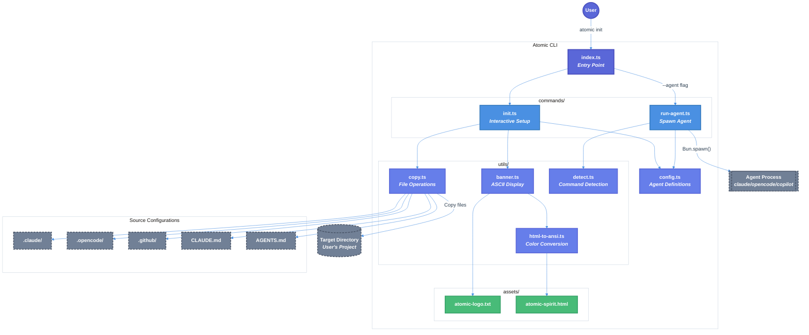

# Atomic CLI Technical Design Document

| Document Metadata      | Details                                                |
| ---------------------- | ------------------------------------------------------ |
| Author(s)              | lavaman131                                             |
| Status                 | Draft (WIP)                                            |
| Team / Owner           | flora131/atomic                                        |
| Created / Last Updated | 2026-01-18                                             |

## 1. Executive Summary

This spec defines the implementation of a CLI tool that copies AI coding agent configuration files (`.claude/`, `.opencode/`, `.github/`) from the Atomic repository into the user's current directory. The CLI displays an ASCII banner on startup, provides interactive prompts for agent selection using `@clack/prompts`, and supports optional agent spawning. Built with Bun.js and TypeScript, the tool simplifies onboarding for Claude Code, OpenCode, and GitHub Copilot CLI.

**Research Reference:** [research/docs/2026-01-18-atomic-cli-implementation.md](../research/docs/2026-01-18-atomic-cli-implementation.md)

## 2. Context and Motivation

### 2.1 Current State

The Atomic repository contains mature configurations for three AI coding assistants:
- **Claude Code** (`.claude/`) - 7 agents, 7 commands, 2 skills, settings.json
- **OpenCode** (`.opencode/`) - 7 agents, 10 commands, 2 skills, opencode.json
- **GitHub Copilot CLI** (`.github/`) - 7 agents, 10 prompts, scripts, hooks

Currently, users must manually copy these configuration folders into their projects. There is no automated tooling.

**Limitations:**
- Manual copy is error-prone (users may copy unnecessary files like `workflows/` or `node_modules/`)
- No guidance on which agent to choose
- No validation that the target agent is installed

### 2.2 The Problem

- **User Impact:** Developers waste time manually setting up agent configurations and often make mistakes
- **Business Impact:** Reduced adoption of Atomic's agent configurations
- **Technical Debt:** No standardized distribution mechanism exists

## 3. Goals and Non-Goals

### 3.1 Functional Goals

- [x] Display ASCII banner with `atomic-logo.txt` and colorized `atomic-spirit.html` side by side
- [x] Provide interactive agent selection (claude-code, opencode, copilot-cli)
- [x] Copy agent configuration folders with proper exclusions
- [x] Copy additional root-level files (`CLAUDE.md`, `AGENTS.md`) per agent
- [x] Detect if target agent command is installed (`Bun.which()`)
- [x] Support optional agent spawning after config installation
- [x] Handle graceful cancellation and error states
- [x] Support `--version` and `--help` flags

### 3.2 Non-Goals (Out of Scope)

- [ ] We will NOT implement automatic agent installation (only show install URL)
- [ ] We will NOT support config updates/syncing (copy-only, one-time operation)
- [ ] We will NOT build a web interface (CLI only)
- [ ] We will NOT publish to npm in this version (local usage first)
- [ ] We will NOT implement config merging for existing folders (overwrite only)

## 4. Proposed Solution (High-Level Design)

### 4.1 System Architecture Diagram



### 4.2 Architectural Pattern

**Command Pattern**: The CLI uses a simple command routing pattern where `index.ts` parses arguments and delegates to specific command handlers (`init.ts`, `run-agent.ts`).

**Research Reference:** Section 4 "Bun CLI Patterns" covers argument parsing with `util.parseArgs` and command detection with `Bun.which()`.

### 4.3 Key Components

| Component        | Responsibility                           | Technology Stack       | Justification                                    |
| ---------------- | ---------------------------------------- | ---------------------- | ------------------------------------------------ |
| `index.ts`       | Entry point, argument routing            | Bun, util.parseArgs    | Built-in Bun APIs, no external dependencies      |
| `config.ts`      | Agent configuration definitions          | TypeScript             | Centralized config for easy extension            |
| `init.ts`        | Interactive setup flow                   | @clack/prompts         | Beautiful CLI prompts, handles cancellation      |
| `run-agent.ts`   | Agent spawning logic                     | Bun.spawn              | Native process spawning with inherit stdio       |
| `banner.ts`      | ASCII banner display                     | Direct ANSI            | Uses pre-computed constants, no runtime parsing  |
| `generated/`     | Pre-computed ANSI constants              | Committed constants    | One-time conversion, zero runtime overhead       |
| `copy.ts`        | Platform-aware directory copying         | Bun.file, fs/promises  | Filters scripts by OS, excludes unwanted files   |
| `detect.ts`      | Command and platform detection           | Bun.which, process     | Built-in APIs for command check and OS detection |

## 5. Detailed Design

### 5.1 CLI Interface

**Command Structure:**
```
atomic                     # Same as `atomic init`
atomic init                # Interactive setup with banner
atomic --agent <name>      # Run agent directly (skip banner)
atomic --version, -v       # Show version
atomic --help, -h          # Show help
```

**Research Reference:** Section 6 "CLI User Experience Flow" defines the command structure and flow.

### 5.2 Agent Configuration Schema

```typescript
// src/config.ts

interface AgentConfig {
  name: string;              // Display name for prompts
  cmd: string;               // Command to run (e.g., "claude")
  additional_flags: string[];// Flags for spawning
  folder: string;            // Config folder relative to repo root
  install_url: string;       // Installation instructions URL
  exclude: string[];         // Paths to exclude when copying
  additional_files: string[];// Extra root files to copy
}

const AGENT_CONFIG: Record<string, AgentConfig> = {
  'claude-code': {
    name: 'Claude Code',
    cmd: 'claude',
    additional_flags: ['dangerously-skip-permissions'],
    folder: '.claude',
    install_url: 'https://docs.anthropic.com/en/docs/claude-code/setup',
    exclude: ['.DS_Store'],
    additional_files: ['CLAUDE.md'],
  },
  'opencode': {
    name: 'opencode',
    cmd: 'opencode',
    additional_flags: [],
    folder: '.opencode',
    install_url: 'https://opencode.ai',
    exclude: ['node_modules', '.gitignore', 'bun.lock', 'package.json', '.DS_Store'],
    additional_files: ['AGENTS.md'],
  },
  'copilot-cli': {
    name: 'GitHub Copilot CLI',
    cmd: 'copilot',
    additional_flags: ['--allow-all-tools', '--allow-all-paths'],
    folder: '.github',
    install_url: 'https://github.com/github/copilot-cli?tab=readme-ov-file#installation',
    exclude: ['workflows', 'dependabot.yml', '.DS_Store'],
    additional_files: ['AGENTS.md'],
  },
};
```

**Research Reference:** Section 5 "Agent Configuration Structure" provides the complete config definition.

### 5.3 Pre-computed Banner Assets

The logo and spirit ANSI art are pre-computed once and committed as constants. Since these assets never change, there's no need for build-time generation - just a one-time conversion.

```typescript
// src/generated/banner-assets.ts (committed to repo)

// Pre-computed from atomic-logo.txt
export const LOGO = `
    ___   __                  _
   /   | / /_____  ____ ___  (_)____
  / /| |/ __/ __ \\/ __ \`__ \\/ / ___/
 / ___ / /_/ /_/ / / / / / / / /__
/_/  |_\\__/\\____/_/ /_/ /_/_/\\___/
`;

// Pre-computed from atomic-spirit.html (HTML → ANSI conversion done once)
export const SPIRIT = "\x1b[38;2;255;100;50m...\x1b[0m"; // actual ANSI string
```

**Benefits:**
- **Zero dependencies**: No `node-html-parser` or any parsing library needed
- **Instant startup**: No file I/O, no parsing - just string constants
- **Committed to repo**: One-time conversion, results checked in

**Research Reference:** Section 3 "HTML to ANSI Color Conversion" covers the ANSI escape code format used in the pre-computed constants.

### 5.4 Directory Copying with Exclusions and Platform-Aware Script Filtering

```typescript
// src/utils/copy.ts

import { readdir, mkdir } from 'fs/promises';
import { join, relative } from 'path';
import { getOppositeScriptExtension } from './detect';

export async function copyDir(
  src: string,
  dest: string,
  exclude: string[] = [],
  rootSrc?: string
): Promise<void> {
  const root = rootSrc || src;
  await mkdir(dest, { recursive: true });

  const entries = await readdir(src, { withFileTypes: true });

  // Get the script extension to skip (opposite of current platform)
  const skipExtension = getOppositeScriptExtension();

  for (const entry of entries) {
    const srcPath = join(src, entry.name);
    const destPath = join(dest, entry.name);
    const relativePath = relative(root, srcPath);

    // Check exclusions (by name or relative path)
    const isExcluded = exclude.some(ex =>
      entry.name === ex || relativePath === ex || relativePath.startsWith(ex + '/')
    );

    if (isExcluded) continue;

    // Skip scripts for the opposite platform
    if (entry.name.endsWith(skipExtension)) continue;

    if (entry.isDirectory()) {
      await copyDir(srcPath, destPath, exclude, root);
    } else {
      await Bun.write(destPath, Bun.file(srcPath));
    }
  }
}

export async function copyFile(src: string, dest: string): Promise<void> {
  await Bun.write(dest, Bun.file(src));
}
```

**Platform-aware behavior:**
- On Windows: copies `.ps1` scripts, skips `.sh` scripts
- On macOS/Linux: copies `.sh` scripts, skips `.ps1` scripts

**Research Reference:** Section 4 "Bun CLI Patterns" demonstrates `Bun.file()` and `Bun.write()` for file operations.

### 5.5 Init Command Flow

```typescript
// src/commands/init.ts

import { intro, outro, select, confirm, spinner, isCancel, cancel, note } from '@clack/prompts';
import { AGENT_CONFIG } from '../config';
import { displayBanner } from '../utils/banner';
import { copyDir, copyFile } from '../utils/copy';
import { isWindows, isWslInstalled, WSL_INSTALL_URL } from '../utils/detect';
import { join } from 'path';

export async function initCommand(repoRoot: string): Promise<void> {
  // 1. Display banner (synchronous - uses pre-computed constants)
  displayBanner();

  // 2. Show intro
  intro('atomic-cli');

  // 3. Agent selection
  const agent = await select({
    message: 'Select a coding agent to configure:',
    options: Object.entries(AGENT_CONFIG).map(([key, config]) => ({
      value: key,
      label: config.name,
      hint: config.install_url.replace('https://', ''),
    })),
  });

  if (isCancel(agent)) {
    cancel('Operation cancelled.');
    process.exit(0);
  }

  const config = AGENT_CONFIG[agent as string]!;
  const targetDir = process.cwd();

  // 4. Confirm directory
  const shouldContinue = await confirm({
    message: `Install ${config.name} config to ${targetDir}?`,
    initialValue: true,
  });

  if (isCancel(shouldContinue) || !shouldContinue) {
    cancel('Operation cancelled.');
    process.exit(0);
  }

  // 5. Check for existing folder
  const destFolder = join(targetDir, config.folder);
  if (await Bun.file(destFolder).exists()) {
    const overwrite = await confirm({
      message: `${config.folder} already exists. Overwrite?`,
      active: 'Yes, overwrite',
      inactive: 'No, cancel',
    });

    if (isCancel(overwrite) || !overwrite) {
      cancel('Operation cancelled.');
      process.exit(0);
    }
  }

  // 6. Copy files with spinner
  const s = spinner();
  s.start('Copying configuration files');

  const srcFolder = join(repoRoot, config.folder);
  await copyDir(srcFolder, destFolder, config.exclude);

  // Copy additional files
  for (const file of config.additional_files) {
    const srcFile = join(repoRoot, file);
    const destFile = join(targetDir, file);
    if (await Bun.file(srcFile).exists()) {
      await copyFile(srcFile, destFile);
    }
  }

  s.stop('Configuration complete');

  // 7. Check WSL on Windows
  if (isWindows() && !isWslInstalled()) {
    note(
      `WSL is not installed. Some scripts may require WSL to run.\nInstall WSL: ${WSL_INSTALL_URL}`,
      'WARNING'
    );
  }

  // 8. Show success
  note(`Files copied to ${config.folder}/`, 'SUCCESS');
  outro("You're all set! Run your agent to get started.");
}
```

**Research Reference:** Section 1 "@clack/prompts Library" provides the API for prompts, cancellation, and spinners.

### 5.6 Agent Detection and Spawning

```typescript
// src/utils/detect.ts

export function isCommandInstalled(cmd: string): boolean {
  return Bun.which(cmd) !== null;
}

export function getCommandVersion(cmd: string): string | null {
  const cmdPath = Bun.which(cmd);
  if (!cmdPath) return null;

  const result = Bun.spawnSync({
    cmd: [cmdPath, '--version'],
    stdout: 'pipe',
    stderr: 'pipe',
  });

  return result.success ? result.stdout.toString().trim() : null;
}

export function isWindows(): boolean {
  return process.platform === 'win32';
}

export function getScriptExtension(): '.ps1' | '.sh' {
  return isWindows() ? '.ps1' : '.sh';
}

export function getOppositeScriptExtension(): '.ps1' | '.sh' {
  return isWindows() ? '.sh' : '.ps1';
}

export function isWslInstalled(): boolean {
  if (!isWindows()) return true; // Not applicable on non-Windows
  return Bun.which('wsl') !== null;
}

export const WSL_INSTALL_URL = 'https://learn.microsoft.com/en-us/windows/wsl/install';

// src/commands/run-agent.ts

import { AGENT_CONFIG } from '../config';
import { isCommandInstalled } from '../utils/detect';

export async function runAgentCommand(agentKey: string): Promise<void> {
  const config = AGENT_CONFIG[agentKey];

  if (!config) {
    console.error(`Unknown agent: ${agentKey}`);
    console.error(`Available agents: ${Object.keys(AGENT_CONFIG).join(', ')}`);
    process.exit(1);
  }

  // Check if command is installed
  if (!isCommandInstalled(config.cmd)) {
    console.error(`${config.name} is not installed.`);
    console.error(`Install at: ${config.install_url}`);
    process.exit(1);
  }

  // Spawn agent
  const proc = Bun.spawn([config.cmd, ...config.additional_flags], {
    stdin: 'inherit',
    stdout: 'inherit',
    stderr: 'inherit',
    cwd: process.cwd(),
  });

  await proc.exited;
}
```

**Research Reference:** Section 4 covers `Bun.which()`, `Bun.spawnSync()`, and `Bun.spawn()`.

### 5.7 Entry Point

```typescript
// src/index.ts
#!/usr/bin/env bun

import { parseArgs } from 'util';
import { initCommand } from './commands/init';
import { runAgentCommand } from './commands/run-agent';

const REPO_ROOT = import.meta.dir.replace('/src', '');
const VERSION = '1.0.0';

const { values, positionals } = parseArgs({
  args: Bun.argv.slice(2),
  options: {
    agent: { type: 'string', short: 'a' },
    version: { type: 'boolean', short: 'v' },
    help: { type: 'boolean', short: 'h' },
  },
  strict: false,
  allowPositionals: true,
});

async function main(): Promise<void> {
  // --version
  if (values.version) {
    console.log(`atomic v${VERSION}`);
    process.exit(0);
  }

  // --help
  if (values.help) {
    console.log(`
atomic - AI coding agent configuration installer

Usage:
  atomic              Interactive setup (same as 'atomic init')
  atomic init         Interactive setup with agent selection
  atomic --agent <n>  Run agent directly (claude-code, opencode, copilot-cli)
  atomic --version    Show version
  atomic --help       Show this help

Examples:
  atomic                    # Start interactive setup
  atomic --agent claude-code  # Run Claude Code directly
`);
    process.exit(0);
  }

  // --agent <name>
  if (values.agent) {
    await runAgentCommand(values.agent);
    return;
  }

  // Default: init command
  const command = positionals[0] || 'init';

  if (command === 'init') {
    await initCommand(REPO_ROOT);
  } else {
    console.error(`Unknown command: ${command}`);
    process.exit(1);
  }
}

main().catch((err) => {
  console.error('Error:', err.message);
  process.exit(1);
});
```

### 5.8 Banner Display

```typescript
// src/utils/banner.ts

import { LOGO, SPIRIT } from '../generated/banner-assets';

// Strip ANSI codes to calculate visible width
function stripAnsi(str: string): string {
  return str.replace(/\x1b\[[0-9;]*m/g, '');
}

export function displayBanner(): void {
  const logoLines = LOGO.split('\n');
  const spiritLines = SPIRIT.split('\n');

  // Get max width of logo for alignment
  const logoWidth = Math.max(...logoLines.map(l => stripAnsi(l).length));

  // Combine side by side
  const maxLines = Math.max(logoLines.length, spiritLines.length);
  const combined: string[] = [];

  for (let i = 0; i < maxLines; i++) {
    const logoLine = (logoLines[i] || '').padEnd(logoWidth + 4);
    const spiritLine = spiritLines[i] || '';
    combined.push(logoLine + spiritLine);
  }

  console.log(combined.join('\n'));
}
```

**Note:** The function is now synchronous since it uses pre-computed constants instead of file I/O.

**Research Reference:** Section 7 "Banner Display Implementation" provides the side-by-side layout algorithm.

## 6. Alternatives Considered

| Option                              | Pros                                | Cons                                        | Reason for Rejection                                        |
| ----------------------------------- | ----------------------------------- | ------------------------------------------- | ----------------------------------------------------------- |
| **A: figlet for logo generation**   | Dynamic text generation             | Adds dependency, existing logo is better    | Logo already exists as pre-generated ASCII art              |
| **B: chalk for ANSI colors**        | Popular, well-maintained            | Adds dependency for simple use case         | Direct ANSI escapes work fine, fewer dependencies           |
| **C: inquirer.js for prompts**      | More features, widely used          | Larger bundle, older API style              | @clack/prompts has better UX and modern API                 |
| **D: Commander.js for CLI parsing** | Mature, extensive features          | Overkill for simple CLI                     | util.parseArgs is built-in and sufficient                   |
| **E: Symlink configs instead of copy** | Saves disk space, always up-to-date | Breaks when user moves, requires repo clone | Copy is simpler and works standalone                        |

## 7. Cross-Cutting Concerns

### 7.1 Security and Privacy

- **No network requests**: CLI operates entirely locally
- **No telemetry**: No data collection
- **File permissions**: Respects existing permissions when copying
- **Input validation**: Agent names validated against AGENT_CONFIG keys

### 7.2 Observability Strategy

- **Error messages**: Clear, actionable error messages with install URLs
- **Spinner feedback**: Visual progress during file operations
- **Success confirmation**: Note component shows completion status

### 7.3 Scalability and Capacity Planning

- **Small scope**: CLI copies ~50 files max per agent
- **No persistence**: No database, no state files
- **Extensibility**: New agents can be added to AGENT_CONFIG

## 8. Migration, Rollout, and Testing

### 8.1 Deployment Strategy

1. **Phase 1**: Local development with `bun run src/index.ts`
2. **Phase 2**: Build executable with `bun build src/index.ts --compile --outfile atomic`
3. **Phase 3**: Add to package.json bin field for global installation
4. **Phase 4 (Future)**: Publish to npm as `@flora131/atomic`

### 8.2 Test Plan

#### Unit Tests

```typescript
// tests/html-to-ansi.test.ts
import { test, expect } from 'bun:test';
import { htmlToAnsi } from '../src/utils/html-to-ansi';

test('converts rgb span to ANSI', () => {
  const html = '<span style="color: rgb(255, 0, 0)">X</span>';
  const result = htmlToAnsi(html);
  expect(result).toContain('\x1b[38;2;255;0;0m');
  expect(result).toContain('X');
});

test('handles text nodes', () => {
  const html = '<div>plain text</div>';
  const result = htmlToAnsi(html);
  expect(result).toContain('plain text');
});
```

```typescript
// tests/config.test.ts
import { test, expect } from 'bun:test';
import { AGENT_CONFIG } from '../src/config';

test('all agents have required fields', () => {
  for (const [key, config] of Object.entries(AGENT_CONFIG)) {
    expect(config.name).toBeDefined();
    expect(config.cmd).toBeDefined();
    expect(config.folder).toBeDefined();
    expect(config.install_url).toMatch(/^https?:\/\//);
    expect(Array.isArray(config.exclude)).toBe(true);
    expect(Array.isArray(config.additional_files)).toBe(true);
  }
});
```

```typescript
// tests/detect.test.ts
import { test, expect } from 'bun:test';
import { isCommandInstalled } from '../src/utils/detect';

test('detects bun as installed', () => {
  expect(isCommandInstalled('bun')).toBe(true);
});

test('detects nonexistent command', () => {
  expect(isCommandInstalled('nonexistent-command-xyz')).toBe(false);
});
```

#### Integration Tests

```typescript
// tests/copy.test.ts
import { test, expect, beforeEach, afterEach } from 'bun:test';
import { copyDir } from '../src/utils/copy';
import { mkdtemp, rm } from 'fs/promises';
import { join } from 'path';
import { tmpdir } from 'os';

let tempDir: string;

beforeEach(async () => {
  tempDir = await mkdtemp(join(tmpdir(), 'atomic-test-'));
});

afterEach(async () => {
  await rm(tempDir, { recursive: true, force: true });
});

test('copies directory with exclusions', async () => {
  const src = '/path/to/test/fixtures';
  const dest = join(tempDir, 'output');

  await copyDir(src, dest, ['node_modules', '.DS_Store']);

  // Verify excluded files are not copied
  expect(await Bun.file(join(dest, 'node_modules')).exists()).toBe(false);
});
```

#### End-to-End Tests

Manual testing checklist:
- [ ] `bun run src/index.ts` displays banner and prompts
- [ ] Agent selection works with arrow keys
- [ ] Cancellation (Ctrl+C) exits gracefully
- [ ] Files are copied correctly with exclusions
- [ ] `--version` shows version
- [ ] `--help` shows usage
- [ ] `--agent claude-code` spawns agent (if installed)
- [ ] Error when agent not installed shows install URL

## 9. Open Questions / Unresolved Issues

1. **Spirit image size**: The `atomic-spirit.html` is ~300KB and generates ~5600 lines. Options:
   - [ ] Use a smaller/cropped version of the spirit image
   - [ ] Make spirit display optional via `--no-banner` flag
   - [ ] Pre-process to reduce redundancy

   **Recommendation**: Start with the full image, add `--no-banner` flag if users complain

2. **Color fallback**: What should happen on terminals without true color support?
   - [ ] Degrade to 256 colors using `rgbTo256()` conversion
   - [ ] Fall back to uncolored output
   - [ ] Detect via `COLORTERM`/`TERM` environment variables

   **Recommendation**: Detect true color support, fall back to uncolored logo only

3. **Version management**: Where should version be defined?
   - [x] Use `package.json` version field (standard approach)
   - [ ] Build-time constant injection

   **Recommendation**: Read from `package.json` at runtime

4. **Windows compatibility**: Shell scripts in `.github/scripts/` have both `.sh` and `.ps1` versions. Should the CLI handle this?
   - [ ] Copy both versions always
   - [x] Detect platform and copy appropriate scripts

   **Resolution**: CLI detects platform via `process.platform` and copies only the relevant scripts (`.ps1` on Windows, `.sh` on macOS/Linux). Additionally, on Windows, the CLI checks for WSL installation via `Bun.which('wsl')` and displays a warning with install link if WSL is not found.

## 10. Implementation File Structure

```
src/
├── index.ts              # Entry point with shebang, CLI routing
├── config.ts             # AGENT_CONFIG type and definition
├── commands/
│   ├── init.ts           # Interactive setup with @clack/prompts
│   └── run-agent.ts      # Agent spawning with Bun.spawn
├── utils/
│   ├── banner.ts         # Banner display (uses pre-computed constants)
│   ├── copy.ts           # Directory copying with exclusions
│   └── detect.ts         # Command detection (Bun.which)
└── generated/
    └── banner-assets.ts  # Pre-computed LOGO and SPIRIT constants (committed)

tests/
├── config.test.ts        # Unit tests for config validation
├── detect.test.ts        # Unit tests for command detection
└── copy.test.ts          # Integration tests for file copying
```

## 11. Dependencies

```json
{
  "name": "atomic",
  "version": "1.0.0",
  "type": "module",
  "bin": {
    "atomic": "./src/index.ts"
  },
  "dependencies": {
    "@clack/prompts": "^0.7.0"
  },
  "devDependencies": {
    "@types/bun": "latest",
    "typescript": "^5"
  }
}
```

**Note**: The CLI has minimal dependencies. Banner assets are pre-computed constants committed to the repo, eliminating any need for HTML parsing libraries.
