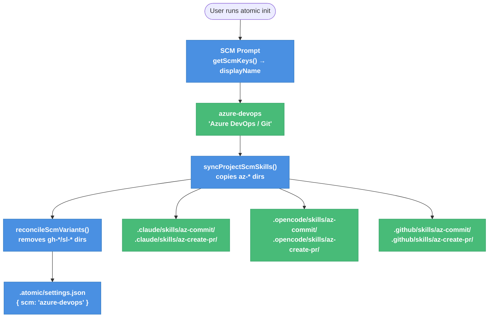

# Azure DevOps SCM Integration — Technical Design Document

| Document Metadata | Details |
| --- | --- |
| Author(s) | Pranav Sankar |
| Status | Draft (WIP) |
| Team / Owner | Atomic Core |
| Created / Last Updated | 2026-03-03 |

---

## 1. Executive Summary

Atomic currently supports two SCM backends — GitHub/Git and Sapling/Phabricator — via a prefix-based skill-directory system. The codebase explicitly anticipates a third type with the comment `// Future: | 'azure-devops'` at `src/config.ts:90`. This RFC implements that planned extension by adding `azure-devops` as a first-class `SourceControlType`, introducing two new skill pairs (`az-commit`, `az-create-pr`) for all three agent folders (Claude, OpenCode, Copilot), and making the four surgical config/type changes required to wire them into the init flow. No changes to core init logic are required; only new entries in the existing registries plus new skill files.

---

## 2. Context and Motivation

### 2.1 Current State

Atomic's SCM system has three layers:

| Layer | File | Role |
| --- | --- | --- |
| Type system | `src/config.ts:89–158` | `SourceControlType` union + `SCM_CONFIG` registry |
| Init flow | `src/commands/init.ts:53–419` | Prompt, prefix-filter skill copy, variant reconciliation |
| Skill files | `.claude/skills/{prefix}-*/`, `.opencode/skills/{prefix}-*/`, `.github/skills/{prefix}-*/` | Agent-discoverable markdown skill definitions |

During `atomic init`, the user selects an SCM type. The init flow then:
1. Copies only skill directories starting with the selected prefix (`gh-` or `sl-`) into the project's agent folders.
2. Removes skill directories starting with any *other* managed prefix.
3. Saves `{ scm: "<type>" }` to `.atomic/settings.json`.

Agents discover available commands at runtime purely by what directories exist on disk — no central registry is consulted at agent execution time.

### 2.2 The Problem

Azure DevOps is one of the most widely used enterprise source control and PR review platforms. Teams using Azure Repos have no Atomic skill support today. The codebase was designed with this gap in mind (the `Future:` comment) but the implementation was deferred. This RFC closes that gap.

**User Impact:** Teams with Azure Repos cannot use Atomic's commit or PR skills; they fall back to manual CLI usage.  
**Business Impact:** Enterprise adoption is blocked wherever GitHub is not the approved SCM platform.  
**Technical Readiness:** No architectural changes are required — the system was purpose-built for this extension.

---

## 3. Goals and Non-Goals

### 3.1 Functional Goals

- [ ] `azure-devops` is a valid `SourceControlType` recognized by `src/config.ts`.
- [ ] `atomic init` presents `azure-devops` as a selectable SCM option with a human-readable display name.
- [ ] Selecting `azure-devops` during init copies `az-commit` and `az-create-pr` skills to all three agent folders and removes `gh-*` / `sl-*` skills.
- [ ] `az-commit` enables agents to stage and commit changes using standard `git` with Conventional Commits format (mirroring `gh-commit`).
- [ ] `az-create-pr` enables agents to create or update Azure Repos pull requests using `az repos pr create` with explicit `--source-branch` and `--target-branch`.
- [ ] `az-*` skills are present in `.github/skills/` for Copilot users (Copilot has no native ADO support).
- [ ] `assets/settings.schema.json` accepts `"azure-devops"` as a valid `scm` value.
- [ ] `atomic init` warns if the `az` CLI is not configured (analogous to the Sapling `.arcconfig` warning).

### 3.2 Non-Goals (Out of Scope)

- [ ] Azure Pipelines CI/CD integration (not part of SCM skill system).
- [ ] Azure Boards / Work Item management beyond optional `--work-items` flag in `az-create-pr`.
- [ ] MCP server integration (`@azure-devops/mcp`) — may be a follow-on.
- [ ] Auto-detection of ADO repos during init (no `detectDir` heuristic needed; uses `.git` like GitHub).
- [ ] Migration of existing projects from `github`/`sapling` to `azure-devops` (user re-runs `atomic init`).
- [ ] Windows-specific CLI alias handling (unlike Sapling's `sl` / PowerShell conflict, `az` has no alias conflict).

---

## 4. Proposed Solution (High-Level Design)

### 4.1 System Architecture

The integration follows the identical pattern as GitHub and Sapling. No new layers are introduced.



### 4.2 Architectural Pattern

No pattern change. This follows the existing **Template-Directory Skill System** where SCM commands are encapsulated in per-agent SKILL.md files, selected and deployed by prefix at init time.

### 4.3 Key Components

| Component | Change | File |
| --- | --- | --- |
| `SourceControlType` | Add `"azure-devops"` to union | `src/config.ts:89` |
| `SCM_KEYS` | Add `"azure-devops"` to const array | `src/config.ts:93` |
| `SCM_CONFIG` | Add `azure-devops` entry | `src/config.ts:114` |
| `SCM_PREFIX_BY_TYPE` | Add `"azure-devops": "az-"` | `src/commands/init.ts:53` |
| `isManagedScmEntry()` | Add `name.startsWith("az-")` check | `src/commands/init.ts:62` |
| `MANAGED_SCM_SKILL_PREFIXES` | Add `"az-"` | `src/utils/atomic-global-config.ts:10` |
| `settings.schema.json` | Add `"azure-devops"` to enum | `assets/settings.schema.json:22` |
| `az-commit` skill | New skill (mirrors `gh-commit`) | 3 agent folders |
| `az-create-pr` skill | New skill (uses `az repos pr create`) | 3 agent folders |

---

## 5. Detailed Design

### 5.1 Config Changes

#### `src/config.ts`

```typescript
// Line 89 — type union
export type SourceControlType = "github" | "sapling" | "azure-devops";

// Line 93 — keys array
const SCM_KEYS = ["github", "sapling", "azure-devops"] as const;

// Line 114 — SCM_CONFIG entry (add after sapling entry)
"azure-devops": {
  name: "azure-devops",
  displayName: "Azure DevOps / Git",
  cliTool: "git",
  reviewTool: "az repos",
  reviewSystem: "azure-devops",
  detectDir: ".git",
  reviewCommandFile: "create-az-pr.md",
  requiredConfigFiles: ["~/.azure/azureProfile.json"],  // written by `az login`
},
```

#### `src/commands/init.ts`

```typescript
// Line 53 — prefix map (type must widen to include "az-")
const SCM_PREFIX_BY_TYPE: Record<SourceControlType, "gh-" | "sl-" | "az-"> = {
  github: "gh-",
  sapling: "sl-",
  "azure-devops": "az-",
};

// Line 62 — managed entry check
function isManagedScmEntry(name: string): boolean {
  return name.startsWith("gh-") || name.startsWith("sl-") || name.startsWith("az-");
}
```

The existing `requiredConfigFiles` warning pattern (lines 316–326, used for Sapling's `.arcconfig`) also handles ADO because it iterates `config.requiredConfigFiles` generically.

#### `src/utils/atomic-global-config.ts`

```typescript
// Line 10
export const MANAGED_SCM_SKILL_PREFIXES = ["gh-", "sl-", "az-"] as const;
```

#### `assets/settings.schema.json`

```json
"scm": {
  "type": "string",
  "enum": ["github", "sapling", "azure-devops"],
  "description": "Selected source control management system."
}
```

---

### 5.2 Skill Files

Six new files must be created (two skills × three agent folders).

#### `az-commit` Skill (all three agents)

`az-commit` is functionally identical to `gh-commit` — both use standard `git` for version control with no staging area differences. The only changes are:
- `name` frontmatter: `az-commit`
- Auth state query: `az account show` (instead of `gh auth status`)
- Description references Azure DevOps context

**State queries:**
```bash
!git status --porcelain
!git branch --show-current
!git diff --cached --stat
!git log --oneline -5
!az account show --query "user.name" -o tsv 2>/dev/null || echo "Not authenticated"
```

**Commit flow:** identical to `gh-commit` — auto-stage if empty, analyze diff, commit with `--message` and `--trailer "Assistant-model: <agent>"`.

#### `az-create-pr` Skill (all three agents)

`az-create-pr` diverges from `gh-create-pr` in PR mechanics. Key differences:

| Step | GitHub | Azure DevOps |
| --- | --- | --- |
| Check existing PR | `gh pr view --json number,title,body` | `az repos pr list --source-branch $(git branch --show-current) --status active` |
| Get default branch | `git rev-parse --abbrev-ref origin/HEAD` | `az repos show --query "defaultBranch" -o tsv` |
| Create PR | `gh pr create --title "..." --body "..."` | `az repos pr create --title "..." --description "..." --source-branch <X> --target-branch <Y>` |
| Update PR | `gh pr edit <id> --title "..." --body "..."` | `az repos pr update --id <id> --title "..." --description "..."` |

**State queries:**
```bash
!az account show --query "user.name" -o tsv 2>/dev/null || echo "NOT_AUTHENTICATED"
!git status --porcelain
!git branch --show-current
!az repos show --query "defaultBranch" -o tsv 2>/dev/null | sed 's|refs/heads/||'
!az repos pr list --source-branch $(git branch --show-current) --status active --query "[0].pullRequestId" -o tsv 2>/dev/null
!git log --oneline origin/main..HEAD 2>/dev/null | head -20
```

**PR creation flow:**
1. **Auth check**: If `az account show` returns `NOT_AUTHENTICATED` → print setup guide (`az extension add --name azure-devops && az login && az devops configure --defaults organization=... project=...`) and stop.
2. If no staged/committed changes → run `az-commit` skill first.
3. `git push -u origin <branch>`.
4. Analyze `git diff origin/<default>...HEAD` for PR description; scan branch name and commit messages for work item IDs (e.g., `#1234`, `AB#1234`).
5. If PR exists (ID found) → `az repos pr update --id <id> --title "..." --description "..."` (include `--work-items` if IDs found).
6. If no PR → `az repos pr create --title "..." --description "..." --source-branch <current> --target-branch <default> --draft` (include `--work-items <ids>` if IDs inferred from branch/commits).

---

### 5.3 Skill File Locations

| Skill | Claude | OpenCode | Copilot |
| --- | --- | --- | --- |
| `az-commit` | `.claude/skills/az-commit/SKILL.md` | `.opencode/skills/az-commit/SKILL.md` | `.github/skills/az-commit/SKILL.md` |
| `az-create-pr` | `.claude/skills/az-create-pr/SKILL.md` | `.opencode/skills/az-create-pr/SKILL.md` | `.github/skills/az-create-pr/SKILL.md` |

> **Copilot note:** Unlike the Sapling skills (absent from `.github/skills/`), Azure DevOps skills **must** be included in `.github/skills/` with full SKILL.md content. Copilot has no native ADO support and will not discover skills from `.claude/` or `.opencode/` folders.

---

### 5.4 Auth Warning Pattern

Following the Sapling `.arcconfig` pattern (`src/commands/init.ts:316–326`), `atomic init` will warn when the user selects `azure-devops` and `~/.azure/azureProfile.json` is absent (indicating `az login` has not been run). The warning message should direct users to:

```
az extension add --name azure-devops
az login
az devops configure --defaults organization=https://dev.azure.com/<org> project=<project>
```

This uses the existing `requiredConfigFiles` mechanism in `ScmConfig` — no new init logic needed.

---

## 6. Alternatives Considered

| Option | Pros | Cons | Reason for Rejection |
| --- | --- | --- | --- |
| Use `@azure-devops/mcp` MCP server instead of `az repos` CLI | Purpose-built for AI agents, richer API surface | Requires MCP server running, extra dependency, not a simple CLI command | Out of scope for skill-file pattern; MCP integration is a separate feature |
| Use `azure-devops-node-api` (Node.js client) | Type-safe, full ADO API access | Cannot be used from SKILL.md shell commands; requires a compiled tool | SKILL.md files execute shell commands, not TypeScript |
| Inline org/project flags on every `az repos` command | No default config required | Verbose, brittle if org/project change | Existing Sapling pattern (`.arcconfig`) shows config-file approach is preferred; `az devops configure --defaults` is equivalent |
| Skip Copilot `.github/skills/` | Fewer files to maintain | Copilot users on ADO get no skill support | Copilot has no native ADO support; must include full SKILL.md |

---

## 7. Cross-Cutting Concerns

### 7.1 Security and Privacy

- **Authentication:** Azure DevOps uses either `az login` (Azure AD interactive) or `AZURE_DEVOPS_EXT_PAT` environment variable (PAT-based). No secrets are written to SKILL.md files.
- **Threat Model:** PATs in environment variables risk exposure via shell history or process listing. SKILL.md should instruct agents to use `az account show` to verify auth rather than echoing tokens.
- **No PII in commits:** `az-commit` follows the same Conventional Commits flow as `gh-commit`; no user PII is embedded in commit messages.

### 7.2 Observability

No new telemetry points required beyond the existing `scm: "azure-devops"` value now being valid in the settings schema. The telemetry system reads `settings.json` and will automatically begin reporting the new SCM type.

### 7.3 Compatibility

- `azure-devops` uses `git` as its `cliTool` (same as `github`), so all existing git-based utilities and checks remain valid.
- The `detectDir: ".git"` value means ADO repos look identical to GitHub repos at the filesystem level — `atomic init` will not auto-detect which SCM type to use; user selection is required (consistent with the current design).

---

## 8. Migration, Rollout, and Testing

### 8.1 Deployment Strategy

- **Phase 1:** Land all config/type changes and skill files. No feature flag needed — the init prompt will simply show the new option.
- **Phase 2:** Smoke-test against a live Azure DevOps org with `az repos pr create` to validate the skill content.

### 8.2 Test Plan

- **Unit Tests:**
  - `isValidScm("azure-devops")` returns `true`.
  - `getScmConfig("azure-devops")` returns the expected `ScmConfig` shape.
  - `isManagedScmEntry("az-commit")` returns `true`; `isManagedScmEntry("az-custom")` returns `true`.
  - `MANAGED_SCM_SKILL_PREFIXES` includes `"az-"`.
  - `settings.schema.json` validates `{ scm: "azure-devops" }` without errors.

- **Integration Tests:**
  - `syncProjectScmSkills("azure-devops")` copies `az-commit` and `az-create-pr` directories into all three agent skill folders.
  - `reconcileScmVariants("azure-devops")` removes `gh-*` and `sl-*` directories, preserves user-custom directories.
  - `atomic init --scm azure-devops` (non-interactive) completes without error.

- **End-to-End Tests:**
  - Manual validation: run `atomic init`, select `azure-devops`, verify `az-commit` and `az-create-pr` directories appear in `.claude/skills/`, `.opencode/skills/`, and `.github/skills/`.
  - Run `az-commit` skill against a test branch; verify commit is created with correct trailer.
  - Run `az-create-pr` skill on a branch with commits ahead of `main`; verify `az repos pr create` is called with `--source-branch` and `--target-branch`.

---

## 9. Open Questions / Unresolved Issues

- [x] **Q1 — ADO Org Config**: **Resolved — Warn only.** `atomic init` will print a message directing users to run `az login` and `az devops configure --defaults organization=... project=...`. No stub config file is created. This is consistent with the Sapling `.arcconfig` warning pattern.
- [x] **Q2 — Auth Check in `az-create-pr`**: **Resolved — Explicit check.** The skill will run `az account show` first and print a clear setup guide (install extension + login + configure defaults) if unauthenticated, before attempting `az repos pr create`.
- [x] **Q3 — Draft PRs**: **Resolved — Draft by default.** `az repos pr create --draft` is the default, matching `gh-create-pr` behavior.
- [x] **Q4 — Work Item Linking**: **Resolved — Include as optional step.** `az-create-pr` will include `--work-items` as an optional step. The agent will infer work item IDs from branch names (e.g., `feature/1234-my-feature`) or commit messages, and include them if found.
- [x] **Q5 — `az-commit` vs `gh-commit` shared content**: **Resolved — Independent copies.** `az-commit` will be a self-contained skill file following the existing pattern. No shared base file is introduced.

---

## 10. References

- Research: `research/docs/2026-03-03-azure-devops-scm-integration.md`
- ADO CLI Reference: `research/docs/2026-03-03-azure-devops-cli-tooling.md`
- Original SCM Type Selection Spec: `specs/source-control-type-selection.md`
- Reference skill: `.claude/skills/gh-commit/SKILL.md`
- Reference skill: `.claude/skills/gh-create-pr/SKILL.md`
- Azure CLI DevOps docs: https://learn.microsoft.com/en-us/cli/azure/repos/pr
- `src/config.ts:89–158`, `src/commands/init.ts:53–64`, `src/utils/atomic-global-config.ts:10`, `assets/settings.schema.json:20–24`
