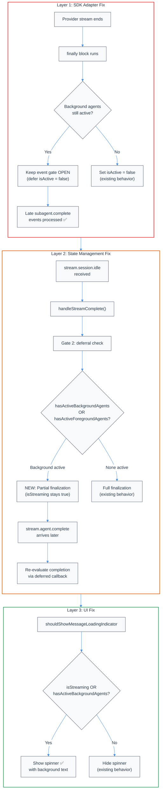

# Background Agent Spinner Premature Completion Fix

| Document Metadata      | Details                        |
| ---------------------- | ------------------------------ |
| Author(s)              | Flora                          |
| Status                 | Draft (WIP)                    |
| Team / Owner           | Atomic TUI                     |
| Created / Last Updated | 2026-03-12                     |

## 1. Executive Summary

The main UI spinner (loading indicator) stops prematurely when background agents are still running, creating a broken user experience where users must manually press Enter to continue. This is caused by three compounding issues across the adapter, state management, and UI layers: (1) SDK adapter event gates drop `subagent.complete` events after the primary stream ends, (2) the stream completion pipeline explicitly excludes background agents from deferral checks, and (3) `createStoppedStreamControlState()` unconditionally sets `isStreaming: false`. This spec proposes a layered fix across all three architectural tiers to ensure the spinner persists while background agents are active and transitions cleanly upon their completion.

**Research Reference**: [`research/docs/2026-03-12-background-agent-spinner-premature-completion.md`](../research/docs/2026-03-12-background-agent-spinner-premature-completion.md)

## 2. Context and Motivation

### 2.1 Current State

The Atomic TUI implements a 3-layer streaming architecture for background agents:

```
Layer 1: SDK Adapter (provider-specific)
  ├─ Copilot: runtime.ts → provider-router.ts → subagent-handlers.ts
  ├─ Claude:  streaming-runtime.ts → subagent-event-handlers.ts
  └─ OpenCode: (shares Claude's UI integration layer)

Layer 2: State Management (React hooks)
  ├─ use-session-subscriptions.ts (bus event → state)
  ├─ use-completion.ts (3-gate pipeline)
  ├─ use-deferred-completion.ts (deferral logic)
  ├─ use-finalized-completion.ts (terminal state)
  └─ use-background-dispatch.ts (queued flush)

Layer 3: UI Rendering
  ├─ parallel-agents-tree.tsx (agent tree)
  ├─ background-agent-footer.ts (footer bar)
  └─ loading-state.ts (spinner/indicator)
```

Background agents are designed to outlive the parent stream's natural completion boundary. The existing infrastructure includes `background` status types, color mappings, footer rendering, tree hints, and `Ctrl+F` termination — all fully implemented. However, the spinner lifecycle was never addressed by any prior spec.

**Prior Specs (Related but Incomplete)**:
- [`specs/background-agents-sdk-pipeline-fix.md`](background-agents-sdk-pipeline-fix.md) — 7 SDK pipeline fixes; mostly implemented via refactored architecture but references stale file paths (`src/ui/index.ts`, `src/ui/chat.tsx`). Does not address spinner lifecycle.
- [`specs/background-agents-ui-issue-258-parity-hardening.md`](background-agents-ui-issue-258-parity-hardening.md) — Contract-driven UI hardening; largely implemented but missing 3 test files. Does not address `shouldShowMessageLoadingIndicator`.
- [`docs/ui-design-patterns.md`](../docs/ui-design-patterns.md) — Defines visual patterns for background agents (footer, tree) but **no spinner behavior is specified**.

**Prior Research (Evolutionary Context)**:
- [`research/docs/2026-02-15-subagent-premature-completion-SUMMARY.md`](../research/docs/2026-02-15-subagent-premature-completion-SUMMARY.md) — Original root-cause discovery: `tool.complete` unconditionally finalizes background agents. Identified the unused `"background"` status type.
- [`research/docs/2026-02-15-subagent-premature-completion-fix-comparison.md`](../research/docs/2026-02-15-subagent-premature-completion-fix-comparison.md) — Concrete before/after patches at 4 fix locations (now stale paths).
- [`research/docs/2026-02-16-sub-agent-tree-inline-state-lifecycle-research.md`](../research/docs/2026-02-16-sub-agent-tree-inline-state-lifecycle-research.md) — Confirmed 8 code locations needing background-aware handling.
- [`research/docs/2026-02-23-258-background-agents-sdk-event-pipeline.md`](../research/docs/2026-02-23-258-background-agents-sdk-event-pipeline.md) — Most comprehensive; defines the 6-stage pipeline model and identifies per-SDK failure points (Claude works, OpenCode untested, Copilot fundamentally broken due to no Task tool).

### 2.2 The Problem

**User Impact**: When background agents are running, the spinner stops prematurely and the TUI appears idle/frozen. Users must manually press Enter to continue, breaking the "fire and forget" expectation of background agent mode.

**Root Cause — Three Compounding Issues**:

1. **Adapter Event Gate Drops Late Events**
   - **Copilot**: `runtime.ts:155` sets `state.isActive = false` in the `finally` block after the stream iterator exhausts. The guard at `provider-router.ts:62` then silently discards all subsequent provider events — including `subagent.complete` from background agents that finish after the primary stream.
   - **Claude**: `streaming-runtime.ts:233-234` clears `activeSubagentBackgroundById` and publishes `stream.session.idle` in its `finally` block. While Claude doesn't use a centralized `isActive` gate, the subscription cleanup can cause similar event loss.

2. **Stream Completion Pipeline Excludes Background Agents from Deferral**
   - Gate 2 in `use-completion.ts` calls `deferStreamCompletionIfNeeded()`, which uses `hasActiveForegroundAgents()` from `guards.ts:30-37`. This function explicitly checks `shouldFinalizeOnToolComplete(agent)` which returns `false` for background agents (`guards.ts:20-24`). Background agents are intentionally excluded from deferral, meaning the stream finalizes even when background agents are still active.

3. **`isStreaming` Unconditionally Set to `false`**
   - `createStoppedStreamControlState()` at `stream-continuation.ts:147-161` always returns `isStreaming: false`. While it preserves `streamingStart` when background agents remain, the spinner depends on `isStreaming` being `true`.
   - `shouldShowMessageLoadingIndicator` at `loading-state.ts:35-56` is directly gated on streaming state — once `isStreaming` is `false`, the spinner disappears regardless of background agent activity.

**Deadlock Scenario**: After `isStreaming` goes `false`, background agent updates are queued in `use-background-dispatch.ts` and ready to flush. But flushing calls `session.send()` which may trigger a new streaming loop, potentially gated behind `continueQueuedConversationRef` — creating a deadlock where updates can't flush without user interaction, but the user doesn't know to interact because the spinner stopped.

## 3. Goals and Non-Goals

### 3.1 Functional Goals

- [ ] Spinner persists while any background agent is in `running`, `pending`, or `background` status
- [ ] Spinner transitions cleanly (stops) when all background agents reach terminal states (`completed`, `error`, `interrupted`)
- [ ] `subagent.complete` events from background agents are processed even after the primary stream ends
- [ ] Loading indicator text reflects background agent activity (e.g., "Background agents running…")
- [ ] Background agent completion messages flush to the LLM without requiring user interaction (no Enter key deadlock)
- [ ] Fix applies to both Copilot and Claude adapters
- [ ] No regression in foreground agent behavior — foreground stream completion timing is unchanged
- [ ] Existing `Ctrl+F` termination flow for background agents continues to work

### 3.2 Non-Goals (Out of Scope)

- [ ] OpenCode adapter support — requires separate runtime event verification (see Open Questions)
- [ ] Copilot Task tool architecture gap — Copilot uses `customAgents` instead of a `Task` tool, causing the entire eager creation + correlation pipeline to be bypassed. This is a separate, deeper problem (see [research: 258-background-agents-sdk-event-pipeline](../research/docs/2026-02-23-258-background-agents-sdk-event-pipeline.md))
- [ ] Claude layout corrections — `ParallelAgentsTree` inside scrollbox vs. `BackgroundAgentFooter` outside scrollbox positioning is a rendering concern, not a spinner lifecycle concern
- [ ] Visual design of the background-aware spinner indicator (uses existing infrastructure; no new visual patterns)
- [ ] Adding missing contract test files referenced in `package.json:39` (`test:contracts` script)

## 4. Proposed Solution (High-Level Design)

### 4.1 Architecture Overview

The fix targets all three layers with minimal, surgical changes that leverage existing infrastructure:



### 4.2 Architectural Pattern

**Deferred Gate Pattern**: Extend the existing deferred completion mechanism (the `pendingCompleteRef` closure in `use-deferred-completion.ts`) to also defer on active background agents. This reuses the proven pattern already in place for foreground agents and running tools, maintaining architectural consistency.

### 4.3 Key Components

| Component | Responsibility | Change Type | Justification |
|-----------|---------------|-------------|---------------|
| Copilot `runtime.ts` | Defer `state.isActive = false` when background agents active | Guard addition | Prevents event gate from dropping late `subagent.complete` events |
| Copilot `provider-router.ts` | Allow background agent events through after stream ends | Guard modification | Required for event gate deferral to work |
| Claude `streaming-runtime.ts` | Preserve background agent subscriptions in `finally` block | Guard addition | Same structural fix as Copilot |
| `use-completion.ts` | Extend Gate 2 to include background agent awareness | Logic extension | Core stream lifecycle change |
| `use-deferred-completion.ts` | Defer completion when background agents are active | Predicate extension | Leverages existing deferral infrastructure |
| `guards.ts` | Add `hasActiveBackgroundAgentsForSpinner()` guard | New function | Separates background-spinner concern from finalization concern |
| `stream-continuation.ts` | Conditionally preserve `isStreaming` when background agents active | Flag logic | Prevents unconditional spinner stop |
| `loading-state.ts` | Incorporate background agent state into spinner decision | Logic extension | Direct fix for premature spinner stop |
| `use-background-dispatch.ts` | Ensure flush doesn't require user interaction | Flow verification | Prevents the Enter-key deadlock |

## 5. Detailed Design

### 5.1 Layer 1: SDK Adapter Event Gate Fix

#### 5.1.1 Copilot Adapter — Deferred `isActive` Reset

**File**: `src/services/events/adapters/providers/copilot/runtime.ts`

The `finally` block currently sets `state.isActive = false` unconditionally at line 155. Modify to defer this reset when background agents are still tracked:

```typescript
// In the finally block of startCopilotStreaming:
finally {
    cleanupCopilotOrphanedTools(state, deps.bus);
    const pendingIdleReason = state.pendingIdleReason;
    state.pendingIdleReason = null;
    if (!abortedBySignal && pendingIdleReason !== null) {
        publishCopilotBufferedEvent(state, deps.bus, {
            type: "stream.session.idle",
            // ... existing fields
        });
    }

    // NEW: Defer isActive reset if background agents are still tracked
    const hasActiveBackground = state.subagentTracker.hasActiveBackgroundAgents();
    if (hasActiveBackground) {
        state.isBackgroundOnly = true;  // new flag: stream ended, only background events allowed
    } else {
        state.isActive = false;
    }
}
```

**File**: `src/services/events/adapters/providers/copilot/provider-router.ts`

Modify the event guard to allow background agent events when in `isBackgroundOnly` mode:

```typescript
const unsubProvider = providerClient.onProviderEvent((event) => {
    if (!state.isActive && !state.isBackgroundOnly) {
        return;  // fully inactive — drop all events
    }
    if (state.isBackgroundOnly && !isBackgroundAgentEvent(event)) {
        return;  // background-only mode — drop non-background events
    }
    if (event.sessionId !== state.sessionId) {
        return;
    }
    routeCopilotProviderEvent(deps, state, event);
});
```

Add a helper to identify background agent events:

```typescript
function isBackgroundAgentEvent(event: ProviderEvent): boolean {
    return event.type === "subagent.complete" || event.type === "subagent.progress";
}
```

**File**: `src/services/events/adapters/providers/copilot/subagent-handlers.ts`

In `handleCopilotSubagentComplete`, after removing the agent from `state.subagentTracker` (line 175), check if no background agents remain and finalize the gate:

```typescript
// After existing cleanup at line 188:
if (state.isBackgroundOnly && !state.subagentTracker.hasActiveBackgroundAgents()) {
    state.isBackgroundOnly = false;
    state.isActive = false;
}
```

#### 5.1.2 Copilot Subagent Tracker Enhancement

The `subagentTracker` on the Copilot state needs a method to check for active background agents. Add:

```typescript
hasActiveBackgroundAgents(): boolean {
    return Array.from(this.agents.values()).some(
        (agent) => agent.isBackground && !agent.completed
    );
}
```

#### 5.1.3 Claude Adapter — Subscription Preservation

**File**: `src/services/events/adapters/providers/claude/streaming-runtime.ts`

The Claude adapter doesn't use a centralized `isActive` gate; instead, event routing is managed through subscription callbacks. The `finally` block should preserve subscriptions for background agent events:

```typescript
finally {
    if (abortSignal) {
        abortSignal.removeEventListener("abort", forwardExternalAbort);
    }
    if (args.getAbortController()?.signal.aborted) {
        streamCompletionReason = "aborted";
        args.publishSyntheticAgentComplete(runId, false, "...");
    }
    args.cleanupOrphanedTools(runId);

    // NEW: Only publish idle if no background agents remain
    const hasBackground = args.hasActiveBackgroundAgents();
    if (!hasBackground) {
        args.publishSessionIdle(runId, streamCompletionReason);
    } else {
        // Publish a new "partial idle" event that signals foreground completion
        // while preserving background agent awareness
        args.publishSessionPartialIdle(runId, streamCompletionReason);
    }
}
```

**File**: `src/services/events/adapters/providers/claude/tool-state.ts`

Add method to `ClaudeToolState`:

```typescript
hasActiveBackgroundAgents(): boolean {
    return Array.from(this.activeSubagentBackgroundById.entries()).some(
        ([_, isBackground]) => isBackground
    );
}
```

### 5.2 Layer 2: Stream Completion Pipeline Fix

#### 5.2.1 New Guard Function

**File**: `src/state/chat/stream/guards.ts`

Add a new guard that checks for active background agents, separate from the existing finalization guard:

```typescript
/**
 * Checks whether any background agents are still actively running.
 * Used for spinner/loading indicator lifecycle — distinct from
 * shouldFinalizeOnToolComplete which controls stream finalization.
 */
export function hasActiveBackgroundAgentsForSpinner(
    agents: readonly ParallelAgent[]
): boolean {
    return agents.some(
        (agent) =>
            isBackgroundAgent(agent)
            && (agent.status === "running"
                || agent.status === "pending"
                || agent.status === "background")
    );
}
```

Import `isBackgroundAgent` from `background-agent-footer.ts` (already exists at line 3-5).

#### 5.2.2 New Bus Event: `stream.session.partial-idle`

To distinguish between "foreground stream ended" and "all work ended", introduce a new bus event:

```typescript
// In the bus event type definitions:
type StreamSessionPartialIdle = {
    type: "stream.session.partial-idle";
    runId: string;
    completionReason: string;
    activeBackgroundAgentCount: number;
};
```

This event is emitted by adapters when the primary stream ends but background agents are still active. The existing `stream.session.idle` continues to mean "all work done."

#### 5.2.3 Session Subscription Handler for Partial Idle

**File**: `src/state/chat/stream/use-session-subscriptions.ts`

Add a handler for `stream.session.partial-idle` alongside the existing `stream.session.idle` handler:

```typescript
// Subscribe to partial idle — foreground done, background still active
bus.subscribe("stream.session.partial-idle", (event) => {
    if (event.runId !== activeRunIdRef.current) return;
    if (!isStreamingRef.current) return;

    // Finalize foreground agents but keep stream "alive" for background
    partiallyFinalizeStream({
        messageId: streamingMessageIdRef.current,
        runId: event.runId,
        activeBackgroundCount: event.activeBackgroundAgentCount,
        parallelAgentsRef,
        setParallelAgents,
    });

    // Update loading indicator text
    setBackgroundStreamingHint(
        `${event.activeBackgroundAgentCount} background agent(s) running…`
    );
});
```

#### 5.2.4 Deferral Logic Extension

**File**: `src/state/chat/stream/use-deferred-completion.ts`

Extend the deferral predicate to account for background agents. Currently (line 38-39), deferral checks only foreground agents and running tools. Add background agent awareness:

```typescript
export function deferStreamCompletionIfNeeded(context: DeferralContext): boolean {
    const hasForeground = hasActiveForegroundAgents(context.parallelAgentsRef.current);
    const hasBackground = hasActiveBackgroundAgentsForSpinner(context.parallelAgentsRef.current);
    const hasRunningTool = context.hasRunningToolRef.current;

    if (!hasForeground && !hasBackground && !hasRunningTool) {
        return false;  // nothing to defer for
    }

    // Existing foreground deferral logic...
    if (hasForeground || hasRunningTool) {
        // ... existing deferral with pendingCompleteRef and 30s timeout
    }

    // NEW: Background-only deferral
    if (hasBackground && !hasForeground && !hasRunningTool) {
        // Store deferred completion — will be invoked when last background agent completes
        context.pendingCompleteRef.current = () => {
            if (context.streamingMessageIdRef.current !== context.messageId) return;
            context.handleStreamCompleteImpl();
        };
        // No safety timeout for background agents — they have their own
        // lifecycle managed by Ctrl+F termination
        return true;
    }

    return false;
}
```

#### 5.2.5 Stream Continuation State

**File**: `src/lib/ui/stream-continuation.ts`

Modify `createStoppedStreamControlState` to accept a background agent awareness flag:

```typescript
export function createStoppedStreamControlState(
    current: StreamControlState,
    options?: StopStreamOptions,
): StreamControlState {
    const hasActiveBackground = options?.hasActiveBackgroundAgents ?? false;

    return {
        ...current,
        isStreaming: hasActiveBackground,  // CHANGED: preserve if background agents active
        streamingMessageId: hasActiveBackground ? current.streamingMessageId : null,
        streamingStart: options?.preserveStreamingStart ? current.streamingStart : null,
        hasStreamingMeta: false,
        hasRunningTool: false,
        isAgentOnlyStream: hasActiveBackground,  // mark as agent-only if background persists
        hasPendingCompletion: hasActiveBackground,
    };
}
```

Update `StopStreamOptions` interface:

```typescript
interface StopStreamOptions {
    preserveStreamingStart?: boolean;
    preserveStreamingMeta?: boolean;
    hasActiveBackgroundAgents?: boolean;  // NEW
}
```

#### 5.2.6 Finalization with Background Awareness

**File**: `src/state/chat/stream/use-finalized-completion.ts`

In `finalizeCompletedStream`, pass the background agent flag when calling `stopSharedStreamState`:

```typescript
// Lines 95-108 — shared state cleanup
const remainingBackground = getActiveBackgroundAgents(context.currentAgents);
const hasBackground = remainingBackground.length > 0;

stopSharedStreamState({
    preserveStreamingStart: hasBackground,
    preserveStreamingMeta: hasBackground,
    hasActiveBackgroundAgents: hasBackground,  // NEW: propagate to stream control state
});
```

#### 5.2.7 Background Agent Completion → Deferred Re-evaluation

**File**: `src/hooks/use-agent-subscriptions.ts`

When a background agent completes (in the `stream.agent.complete` subscription handler), check if all background agents are now done and trigger deferred completion:

```typescript
// In the stream.agent.complete handler (around lines 263-364):
// After updating agent status to completed/error:

const remainingBackground = getActiveBackgroundAgents(parallelAgentsRef.current);
if (remainingBackground.length === 0) {
    // All background agents done — trigger deferred completion
    const pendingComplete = pendingCompleteRef.current;
    if (pendingComplete) {
        pendingCompleteRef.current = null;
        pendingComplete();
    }

    // Also stop the spinner
    stopSharedStreamState({
        preserveStreamingStart: false,
        preserveStreamingMeta: false,
        hasActiveBackgroundAgents: false,
    });
}
```

### 5.3 Layer 3: UI Loading State Fix

#### 5.3.1 Spinner Decision Logic

**File**: `src/lib/ui/loading-state.ts`

Extend `shouldShowMessageLoadingIndicator` (lines 35-56) to account for background agents:

```typescript
export function shouldShowMessageLoadingIndicator(
    context: LoadingStateContext
): boolean {
    // Existing checks for normal streaming
    if (context.isStreaming) {
        return true;
    }

    // NEW: Show spinner when background agents are still active,
    // even if foreground streaming has ended
    if (context.activeBackgroundAgentCount > 0) {
        return true;
    }

    return false;
}
```

Add `activeBackgroundAgentCount` to `LoadingStateContext`:

```typescript
interface LoadingStateContext {
    isStreaming: boolean;
    // ... existing fields
    activeBackgroundAgentCount: number;  // NEW
}
```

#### 5.3.2 Loading Indicator Text

When the spinner is shown due to background agents (not foreground streaming), update the displayed text:

```typescript
export function getLoadingIndicatorText(context: LoadingStateContext): string {
    if (context.isStreaming && context.activeBackgroundAgentCount === 0) {
        return "Thinking…";  // existing default
    }
    if (context.activeBackgroundAgentCount > 0) {
        const count = context.activeBackgroundAgentCount;
        return count === 1
            ? "1 background agent running…"
            : `${count} background agents running…`;
    }
    return "";
}
```

#### 5.3.3 Completion Summary Guard

**File**: `src/lib/ui/loading-state.ts`

Extend `shouldShowCompletionSummary` (lines 69-78) to prevent premature completion display:

```typescript
export function shouldShowCompletionSummary(
    context: CompletionSummaryContext
): boolean {
    // Don't show completion while background agents are still running
    if (context.activeBackgroundAgentCount > 0) {
        return false;
    }
    // ... existing logic
}
```

### 5.4 Background Dispatch Deadlock Prevention

#### 5.4.1 Flush Predicate Update

**File**: `src/state/chat/controller/use-background-dispatch.ts`  
**File**: `src/lib/chat/background-update-flush.ts`

The `shouldStartBackgroundUpdateFlush` function at `background-update-flush.ts:7-13` currently requires `!isStreaming` as a precondition. With the new behavior where `isStreaming` stays `true` during background agent activity, this guard would prevent flushing entirely.

Update the flush predicate:

```typescript
export function shouldStartBackgroundUpdateFlush(context: FlushContext): boolean {
    if (context.isFlushInFlight) return false;
    if (!context.hasPendingUpdates) return false;

    // Allow flush when:
    // 1. Not streaming at all (existing behavior), OR
    // 2. Streaming is background-only (new: isAgentOnlyStream flag)
    if (context.isStreaming && !context.isAgentOnlyStream) return false;

    return true;
}
```

This ensures background completion messages can flush to the LLM even while `isStreaming` remains `true` for spinner purposes, because `isAgentOnlyStream` will be `true` indicating no foreground content is streaming.

### 5.5 Event Flow — Fixed Sequence

```
Provider SDK                    Adapter Layer              State Layer                    UI Layer
─────────────                  ──────────────            ──────────────                 ──────────
stream starts                  isActive = true           isStreaming = true              spinner ON
  │                              │                          │                              │
foreground work                  │ events routed            │ state updated                │ content renders
  │                              │                          │                              │
background agent spawned         │ stream.agent.start       │ agent tracked                │ tree shows "background"
  │                              │                          │                              │
foreground stream ends           │ finally block:           │                              │
  │                              │   hasBackground? YES     │                              │
  │                              │   isBackgroundOnly=true  │                              │
  │                              │                          │                              │
  │                              │ stream.session           │ handleStreamComplete()       │
  │                              │   .partial-idle          │   Gate 2: background defer   │
  │                              │                          │   pendingComplete stored     │ spinner STAYS ON ✅
  │                              │                          │   text: "1 bg agent…"        │
  │                              │                          │                              │
background agent completes       │ subagent.complete        │                              │
  │                              │   (event NOT dropped!) ✅│                              │
  │                              │ stream.agent.complete    │ agent → completed            │ tree shows green ✅
  │                              │                          │ remaining bg = 0             │
  │                              │                          │ pendingComplete()            │
  │                              │ isActive = false         │ full finalization            │ spinner OFF ✅
  │                              │                          │ isStreaming = false           │ summary shows ✅
```

## 6. Alternatives Considered

| Option | Pros | Cons | Reason for Rejection |
|--------|------|------|---------------------|
| **A: Polling timer for background agents** | Simple to implement; doesn't touch adapter layer | Introduces arbitrary delays; races with event-driven updates; battery/CPU cost | Contradicts event-driven architecture; latency unacceptable |
| **B: Keep event gate closed, re-open on background completion** | Minimal adapter change (toggle `isActive` back to `true`) | Race condition between gate close and event arrival; events lost in the gap | Events arriving during the closed-then-reopened window are permanently lost |
| **C: Separate event subscription for background agents** | Clean separation of concerns | Requires duplicating event routing logic; two subscription lifetimes to manage | Maintenance burden; violates DRY principle |
| **D: Move spinner to a separate non-streaming state (selected as partial approach)** | Spinner independence from stream lifecycle | Alone doesn't fix the dropped events at adapter layer | **Used in combination** with adapter fix — addresses Layer 3 but not Layer 1 |
| **E: Deferred `isActive` reset with `isBackgroundOnly` mode (selected)** | Surgical change; reuses existing event routing; no events lost | Slightly more complex adapter state | **Selected**: Preserves existing architecture while fixing the root cause |

## 7. Cross-Cutting Concerns

### 7.1 Security and Privacy

No security or privacy implications. All changes are internal to the streaming lifecycle and do not affect authentication, authorization, or data handling.

### 7.2 Observability Strategy

- **Logging**: Add debug-level logging when entering/exiting `isBackgroundOnly` mode in adapters, including the count of active background agents.
- **State Tracing**: Log when the spinner is kept alive due to background agents vs. foreground streaming, to aid debugging of future spinner lifecycle issues.

### 7.3 Compatibility

- **Backward Compatible**: All changes are additive. If no background agents are spawned, behavior is identical to current code (all new code paths are guarded by background agent checks).
- **SDK Version Compatibility**: The fix works with current SDK versions. No SDK API changes required — the fix is entirely in the adapter and UI layers.

### 7.4 Edge Cases

| Edge Case | Expected Behavior |
|-----------|-------------------|
| Background agent completes before stream ends | Normal flow — agent finalized during regular stream completion |
| Multiple background agents, some complete before stream ends | Spinner persists until ALL remaining background agents complete |
| User presses `Ctrl+F` during background-only phase | Existing `interruptActiveBackgroundAgents()` flow triggers; spinner stops |
| User sends new message while background agents running | New stream takes over; background agents from previous message preserved in state |
| Background agent errors | `stream.agent.complete` with `success: false` → agent marked `error` → if last bg agent, spinner stops |
| Stream aborted (`Ctrl+C`) with background agents | Existing abort path at `use-session-subscriptions.ts:172-237` already transitions background agents to `interrupted` |

## 8. Migration, Rollout, and Testing

### 8.1 Deployment Strategy

- [ ] Phase 1: Implement Layer 1 (adapter event gate) fixes for Copilot and Claude
- [ ] Phase 2: Implement Layer 2 (state management) fixes — new guard, deferral extension, partial idle event
- [ ] Phase 3: Implement Layer 3 (UI) fixes — spinner decision logic, loading text, completion summary guard
- [ ] Phase 4: Implement background dispatch deadlock prevention
- [ ] Phase 5: Integration testing and edge case verification

### 8.2 Test Plan

#### Unit Tests

| Test | Location | Description |
|------|----------|-------------|
| `guards.test.ts` | `tests/state/chat/stream/` | `hasActiveBackgroundAgentsForSpinner` returns `true` for running/pending/background agents, `false` for completed/error/interrupted |
| `stream-continuation.test.ts` | `tests/lib/ui/` | `createStoppedStreamControlState` preserves `isStreaming: true` when `hasActiveBackgroundAgents: true` |
| `loading-state.test.ts` | `tests/lib/ui/` | `shouldShowMessageLoadingIndicator` returns `true` when `activeBackgroundAgentCount > 0` even if `isStreaming: false` |
| `background-update-flush.test.ts` | `tests/lib/chat/` | `shouldStartBackgroundUpdateFlush` allows flush when `isAgentOnlyStream: true` |

#### Integration Tests

| Test | Description |
|------|-------------|
| Copilot adapter: background agent completes after stream | Verify `subagent.complete` event is NOT dropped when `isBackgroundOnly = true` |
| Claude adapter: background agent completes after stream | Verify `stream.agent.complete` bus event is published after `finally` block with partial idle |
| Full pipeline: background agent lifecycle | Spawn background agent → stream ends → spinner persists → agent completes → spinner stops → completion summary shows |
| Deadlock prevention | Background agent completes → flush triggers → no user interaction required |

#### E2E Tests

| Test | Description |
|------|-------------|
| Background agent spinner persistence | Visual verification that spinner stays visible while background agent tree shows "running" status |
| `Ctrl+F` termination during background-only phase | Verify spinner stops and agents show "interrupted" |
| Multiple background agents sequential completion | Spinner persists until last agent completes |

## 9. Open Questions / Unresolved Issues

- [x] **Q1** *(Resolved)*: Do the old (`src/ui/index.ts`) and new (`src/state/chat/stream/`) code paths both execute at runtime, or has the refactor fully superseded the old paths?
  - **Answer**: The refactor fully superseded the old paths. Only the new paths (`src/state/chat/stream/`, `src/services/events/adapters/`) execute at runtime. The old `src/ui/` paths are dead code. All stale file references in prior specs can be disregarded.
- [x] **Q2** *(Resolved)*: Does `session.send()` in `flushPendingBackgroundUpdatesToAgent()` trigger a new streaming loop, or is it a fire-and-forget operation?
  - **Answer**: `session.send()` does **not** re-enter the streaming state machine. It calls the underlying SDK directly (bypassing the adapter layer entirely), awaits the full agent turn, and discards the return value. However, the flush guard at `background-update-flush.ts:11` requires `isStreaming === false` — confirming the deadlock risk if we keep `isStreaming: true` during background agent activity. The `isAgentOnlyStream` bypass flag proposed in Section 5 is necessary to avoid this deadlock.
- [x] **Q3** *(Resolved)*: Is `continueQueuedConversationRef` gated on user input (e.g., Enter key), or does it auto-dispatch?
  - **Answer**: It auto-dispatches. `continueQueuedConversationRef.current()` fires automatically from 6 internal lifecycle paths (stream completion, interrupts, errors, etc.) with no user-input gate. The "must press Enter" symptom is purely visual — the spinner stops and no UI indicates background agents are still running, leading the user to believe nothing is happening and send a new message. The main agent then reveals background agents are still active. This confirms the fix is entirely in the spinner/loading-indicator layer, not in the queue continuation logic.
- [x] **Q4** *(Resolved)*: Does the OpenCode adapter share the same `isActive` gate pattern as Copilot, or does it follow Claude's subscription-based routing?
  - **Answer**: OpenCode shares Copilot's `isActive` gate pattern. The same `isBackgroundOnly` fix proposed for Copilot in Section 5 must be applied to the OpenCode adapter as well.
- [x] **Q5** *(Resolved)*: Is the non-selective `abortBackgroundAgents` behavior (aborts ALL background agents on `Ctrl+C`) intentional, or should it only abort the current stream's agents?
  - **Answer**: Abort ALL is intentional as a safety measure. `Ctrl+C` should continue to abort every background agent regardless of which stream spawned them. No scoping changes needed.
- [x] **Q6** *(Resolved)*: Should the `stream.session.partial-idle` event be a new bus event type, or should the existing `stream.session.idle` carry a flag like `{ backgroundAgentsRemaining: true }`?
  - **Answer**: New `stream.session.partial-idle` event type. This is more explicit, avoids ambiguity, and doesn't require existing `idle` consumers to handle a new payload shape.
- [x] **Q7** *(Resolved)*: Should there be a maximum timeout for background agent spinner persistence (e.g., 5 minutes), after which the spinner auto-stops with a warning?
  - **Answer**: No timeout. The spinner persists indefinitely until the background agent completes or the user manually aborts with `Ctrl+C`. This avoids prematurely hiding legitimate long-running agents, and the user always retains abort control.
