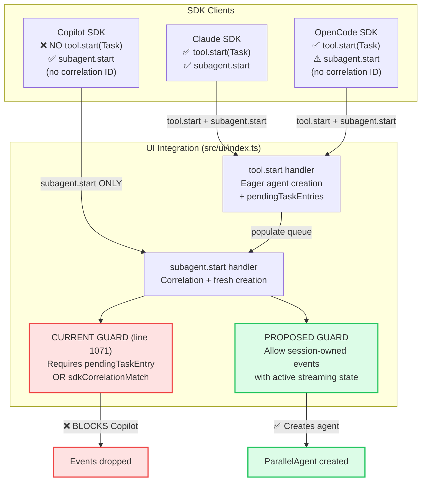

# Background Agents SDK Pipeline Fix (Issue #258) Technical Design Document / RFC

| Document Metadata      | Details                      |
| ---------------------- | ---------------------------- |
| Author(s)              | lavaman131                   |
| Status                 | Draft (WIP)                  |
| Team / Owner           | Atomic CLI TUI               |
| Created / Last Updated | 2026-02-23                   |

## 1. Executive Summary

Issue [#258](https://github.com/flora131/atomic/issues/258) reports that background agents fail to render UI for OpenCode and Copilot SDKs (no UI at all), and that Claude Agent SDK's background agent UI has incorrect chatbox/tree layout. Root cause analysis ([Research: `research/docs/2026-02-23-258-background-agents-sdk-event-pipeline.md`]) reveals a 6-stage pipeline architecture where each SDK must emit the right events in the right order for background agents to appear. **Copilot has two issues:** (1) its built-in `task` tool uses `mode: "background"` but the UI integration only checks `run_in_background` — the background flag is missed; and (2) if `tool.execution_start` doesn't fire for the `task` tool, the `subagent.start` handler's correlation guard at `src/ui/index.ts:1071` blocks the event entirely. **OpenCode** should work architecturally but needs runtime verification. **Claude's layout** works end-to-end but may need visual adjustments. This RFC proposes: adding `mode === "background"` detection, relaxing the correlation guard for session-owned events, enriching Copilot/OpenCode event data, and adding debug logging for runtime verification.

## 2. Context and Motivation

### 2.1 Current State

Background agent rendering depends on a 6-stage pipeline:

```
SDK Client events → UI Integration agent creation → ChatApp state →
synthetic parallel-agents stream events → AgentPart message parts → ParallelAgentsTree rendering
```

[Research: `research/docs/2026-02-23-258-background-agents-sdk-event-pipeline.md`, Section "Shared UI Architecture"]

The UI integration layer at `src/ui/index.ts` uses a **two-path agent creation model**:
- **Path A (Eager):** When `tool.start` fires with `toolName === "Task"`, a `ParallelAgent` is created immediately and queued in `pendingTaskEntries` (lines 641-683).
- **Path B (Correlation):** When `subagent.start` fires, the handler correlates with pending entries or SDK correlation IDs (lines 1028-1164).

Both paths must succeed for the `ParallelAgentsTree` component to render.

### 2.2 The Problem

**Copilot — No UI renders at all (two root causes):**

1. **Background detection mismatch:** Copilot's built-in `task` tool uses `mode: "background"` to indicate background execution, but the UI integration only checks `input.run_in_background === true` (at `src/ui/index.ts:644,704,1092`). Even when `tool.execution_start` fires for the `task` tool (creating an eager agent), the background flag is missed — agents render as foreground.

2. **Correlation guard blocks `subagent.start`:** If `tool.execution_start` does NOT fire for the `task` tool (SDK may handle sub-agent dispatch internally via `customAgents` config at `copilot.ts:865`), then `pendingTaskEntries` stays empty. The `subagent.start` handler's guard at `src/ui/index.ts:1071` requires `pendingTaskEntry || hasSdkCorrelationMatch` — Copilot has neither, because `sdkCorrelationToRunMap` is only populated during `tool.start` events. The `subagent.started` events (mapped at `copilot.ts:627-632`) are silently dropped.

Additionally, Copilot's `subagent.started` event data doesn't include `toolCallId` as a separate field — only `subagentId` (set to the same value). This prevents SDK correlation even if the run map were populated.

[Research: `research/docs/2026-02-23-258-background-agents-sdk-event-pipeline.md`, Section 4 "Copilot SDK — Root Cause"]

**OpenCode — No UI renders (reported):**
- OpenCode's code architecture is identical to Claude's in the UI layer.
- `subagent.start` events from `part.type === "agent"` lack `toolUseID`/`toolCallId` (only `subagentId` and `subagentType` at `opencode.ts:713-715`), so `sdkCorrelationId` resolves to `undefined`.
- The handler falls through to FIFO queue matching at line 1058-1065, which depends on `pendingTaskEntries` being populated from a prior `tool.start` with `toolName === "Task"` or `"task"`.
- If the native OpenCode SDK doesn't name its sub-agent dispatch tool "Task" (or emits events in a different order), the pipeline breaks identically to Copilot.

[Research: `research/docs/2026-02-23-258-background-agents-sdk-event-pipeline.md`, Section 3 "OpenCode SDK"]

**Claude — Layout issues:**
- `ParallelAgentsTree` renders inside `MessageBubbleParts` within the scrollbox (`chat.tsx:5807-5992`).
- `BackgroundAgentFooter` renders outside the scrollbox as a sibling at line 5996.
- Input area is inside the scrollbox (lines 5876+).
- `FooterStatus` component exists (`footer-status.tsx:99`) but is NOT mounted anywhere.
- The exact nature of the "incorrect layout" needs visual verification against issue screenshots.

[Research: `research/docs/2026-02-23-258-background-agents-sdk-event-pipeline.md`, Section 2 "Claude Agent SDK"]

## 3. Goals and Non-Goals

### 3.1 Functional Goals

- [ ] **Copilot background agents render in UI** — `subagent.start` events from Copilot create `ParallelAgent` objects and display in the tree.
- [ ] **OpenCode background agents render in UI** — `subagent.start` events from OpenCode (both `agent` and `subtask` part types) create agents reliably.
- [ ] **Claude layout matches expected design** — Tree/footer positioning matches issue #258 expectations.
- [ ] **All three SDKs show agent lifecycle** — Running → background → completed status transitions work across all providers.
- [ ] **Background agent footer appears** — Shows agent count and ctrl+f hint when background agents are active.
- [ ] **Ctrl+F termination works** — Double-press termination flow functions for all three SDKs.
- [ ] **Provider parity test coverage** — Event pipeline tests cover all three SDKs' subagent event flows.

### 3.2 Non-Goals (Out of Scope)

- [ ] We will NOT redesign the overall chat layout or scrollbox architecture.
- [ ] We will NOT modify the external SDK APIs or protocols.
- [ ] We will NOT add new keyboard shortcuts beyond clarifying existing Ctrl+F/Ctrl+O behavior.
- [ ] We will NOT implement cross-session agent management.
- [ ] We will NOT change the `ParallelAgent` type definition or stream pipeline architecture.

## 4. Proposed Solution (High-Level Design)

### 4.1 System Architecture Diagram



### 4.2 Architectural Pattern

**Session-Owned Event Trust** — For SDKs that don't use a Task tool (Copilot, potentially some OpenCode flows), allow `subagent.start` events to create agents directly when the event belongs to an owned session AND the stream is active. The existing `pendingTaskEntries` / `sdkCorrelationToRunMap` correlation remains the preferred path for SDKs that support it (Claude, OpenCode with Task tools).

### 4.3 Key Components

| Component | Change | Justification |
|-----------|--------|---------------|
| `src/ui/index.ts:1066-1071` | Relax correlation guard for session-owned events | Root cause of Copilot blockage; allows fresh agent creation path at lines 1135-1150 to execute |
| `src/sdk/clients/copilot.ts:627-632` | Enrich `subagent.started` event data with `toolCallId` | Enables future SDK correlation; provides `toolCallId` for agent tracking |
| `src/sdk/clients/opencode.ts:710-716` | Add `toolCallId` to `agent` part events | Matches `subtask` part handling; enables SDK correlation |
| `src/ui/chat.tsx:5779-5998` | Adjust layout positioning if needed | Address Claude layout issues per issue screenshots |
| Test files | Add subagent event pipeline tests for Copilot and OpenCode | Prevent regression; verify all SDKs create agents |

## 5. Detailed Design

### 5.1 Fix 1: Add `mode === "background"` Background Detection (Copilot Fix)

**File:** `src/ui/index.ts`
**Lines:** 644, 704, 1092

Copilot's `task` tool uses `mode: "background"` while Claude/OpenCode use `run_in_background: true`. The UI integration must check both.

**Change at line 644:**
```typescript
// BEFORE:
const isBackground = input.run_in_background === true;

// AFTER:
const isBackground = input.run_in_background === true || input.mode === "background";
```

**Change at line 704:**
```typescript
// BEFORE:
const isBackground = input.run_in_background === true;

// AFTER:
const isBackground = input.run_in_background === true || input.mode === "background";
```

**Change at line 1092:**
```typescript
// BEFORE:
?? (fallbackInput?.run_in_background === true);

// AFTER:
?? (fallbackInput?.run_in_background === true)
|| (fallbackInput?.mode === "background");
```

**Rationale:** This is the minimum change to support Copilot's background detection. The `run_in_background` check remains for Claude/OpenCode backward compatibility.

### 5.2 Fix 2: Relax `subagent.start` Correlation Guard (Copilot + OpenCode Fix)

**File:** `src/ui/index.ts`
**Lines:** 1066-1071

**Current code:**
```typescript
const hasSdkCorrelationMatch = sdkRunId !== undefined && sdkRunId === activeRunId;
const sessionOwned = eventBelongsToOwnedSession(event.sessionId);
if (!sessionOwned && !pendingTaskEntry && !hasSdkCorrelationMatch) return;
// Fail closed for uncorrelated events to prevent cross-run leakage,
// but allow flows with SDK correlation IDs even if no Task entry exists.
if (!pendingTaskEntry && !hasSdkCorrelationMatch) return;
```

**Problem:** Line 1071 blocks ALL events without `pendingTaskEntry` or `sdkCorrelationMatch`, regardless of session ownership. For Copilot (no Task tool) and some OpenCode flows (agent parts without correlation IDs), this blocks legitimate `subagent.start` events.

**Proposed change:**
```typescript
const hasSdkCorrelationMatch = sdkRunId !== undefined && sdkRunId === activeRunId;
const sessionOwned = eventBelongsToOwnedSession(event.sessionId);
if (!sessionOwned && !pendingTaskEntry && !hasSdkCorrelationMatch) return;
// Fail closed for uncorrelated events to prevent cross-run leakage,
// but allow flows with SDK correlation IDs even if no Task entry exists.
// Also allow session-owned events during active streaming — this supports
// SDKs like Copilot that dispatch custom agents without a Task tool.
if (!pendingTaskEntry && !hasSdkCorrelationMatch && !sessionOwned) return;
```

**Rationale:** Session ownership (`eventBelongsToOwnedSession`) already provides sufficient cross-run isolation. The streaming state guard at line 1039 (`if (!state.isStreaming) return;`) further prevents stale events. This change allows the fresh agent creation path at lines 1135-1150 to execute for Copilot and OpenCode.

### 5.3 Fix 3: Enrich Copilot `subagent.started` Event Data

**File:** `src/sdk/clients/copilot.ts`
**Lines:** 627-632

**Current code:**
```typescript
case "subagent.started":
  eventData = {
    subagentId: data.toolCallId,
    subagentType: data.agentName,
  };
  break;
```

**Proposed change:**
```typescript
case "subagent.started":
  eventData = {
    subagentId: data.toolCallId,
    subagentType: data.agentName,
    toolCallId: data.toolCallId,
    task: data.description ?? data.prompt ?? data.agentName,
  };
  break;
```

**Rationale:** Adding `toolCallId` enables SDK correlation in the UI integration layer (populates `sdkCorrelationId` at `src/ui/index.ts:1045`). Adding `task` provides meaningful display text for the agent tree instead of falling back to "Sub-agent".

### 5.4 Fix 4: Add `toolCallId` to OpenCode `agent` Part Events

**File:** `src/sdk/clients/opencode.ts`
**Lines:** 710-716

**Current code:**
```typescript
} else if (part?.type === "agent") {
  this.emitEvent("subagent.start", partSessionId, {
    subagentId: (part?.id as string) ?? "",
    subagentType: (part?.name as string) ?? "",
  });
```

**Proposed change:**
```typescript
} else if (part?.type === "agent") {
  this.emitEvent("subagent.start", partSessionId, {
    subagentId: (part?.id as string) ?? "",
    subagentType: (part?.name as string) ?? "",
    toolCallId: (part?.callID as string) ?? (part?.id as string),
  });
```

**Rationale:** Provides `toolCallId` for SDK correlation in the UI integration layer. Uses `part.callID` when available (same as tool part events), falling back to `part.id`. This matches the pattern already used by `subtask` part events (lines 717-733) which include `toolInput` with correlation data.

### 5.5 Fix 5: Claude Layout Verification and Adjustment

**File:** `src/ui/chat.tsx`
**Lines:** 5779-5998

**Current layout hierarchy:**
```
Root Box (column, 100% height)
├── AtomicHeader (flexShrink=0)
├── Chat Mode Box (column, flexGrow=1)
│   └── Scrollbox (flexGrow=1, stickyScroll)
│       ├── Messages[] → MessageBubble → MessageBubbleParts → AgentPartDisplay → ParallelAgentsTree
│       ├── Input Area (border, flexShrink=0)
│       ├── Streaming/workflow hints
│       ├── Ctrl+C warning
│       └── Ctrl+F warning
└── BackgroundAgentFooter (flexShrink=0)
```

**Assessment:** The current layout places the tree INSIDE message parts (within the scrollbox) and the footer OUTSIDE. This means:
- The tree scrolls with messages ✅ (correct — tree is contextual to the message)
- The footer stays pinned at the bottom ✅ (correct — persistent status indicator)
- The input area is inside the scrollbox ✅ (correct — allows scroll to input)

**Action needed:** Visual verification against issue #258 screenshots to determine if spacing, padding, or ordering adjustments are required. The architectural layout is sound. Specific adjustments (if any) will be determined during implementation by running the TUI and comparing against expected screenshots.

### 5.6 Fix 6: Copilot Background Flag Support

**Resolved:** Copilot's `task` tool uses `mode: "background"` — handled by Fix 1 above. When `tool.execution_start` fires with `toolName: "task"` and `arguments: { ..., mode: "background" }`, the updated background detection at line 644 (`input.mode === "background"`) will correctly set `isBackground = true`. No additional changes needed for background flag support.

### 5.7 Fix 7: Debug Logging for OpenCode Event Verification

**File:** `src/sdk/clients/opencode.ts`

Add temporary debug logging at key event emission points to verify at runtime:
- Whether `tool.start` fires with `toolName: "Task"` or `"task"` for sub-agent dispatch
- Whether `subagent.start` fires from `agent`/`subtask` part types
- What fields are present in the event data

This logging should be gated behind a debug flag or `NODE_ENV !== "production"` check. Remove after verification is complete.

### 5.8 Test Coverage Additions

**File:** `src/sdk/clients/copilot.test.ts` — Add tests for:
- `subagent.started` → `subagent.start` event mapping with enriched data
- `subagent.completed` → `subagent.complete` event mapping
- `subagent.failed` → `subagent.complete` event mapping with `success: false`

**File:** `src/sdk/clients/opencode.events.test.ts` — Add tests for:
- `part.type === "agent"` → `subagent.start` with `toolCallId`
- `part.type === "step-finish"` → `subagent.complete`

**File:** `src/ui/index.ts` or new test file — Add integration tests for:
- `subagent.start` handler creating agents without prior Task tool entry (session-owned path)
- `subagent.start` handler creating agents via FIFO queue (existing path verification)
- Correlation guard allowing session-owned events through

## 6. Alternatives Considered

| Option | Pros | Cons | Decision |
|--------|------|------|----------|
| A: Add a synthetic Task tool to Copilot SDK | Matches existing pipeline exactly | Adds complexity to Copilot client; SDK doesn't support it natively | Rejected — fighting the SDK's design |
| B: Relax guard to allow session-owned events (Selected) | Minimal change (~3 lines); works for all SDKs; preserves cross-run safety via session ownership | Slightly less strict than correlation-based gating | **Selected** — session ownership is already a trusted boundary |
| C: Create separate agent creation paths per SDK | Most explicit; no shared code risk | Duplicates logic; maintenance burden; violates unified event model | Rejected — against architecture principles |
| D: Populate `sdkCorrelationToRunMap` during `subagent.start` | Enables correlation-based matching | Map is designed for tool → agent correlation; self-correlation is circular | Rejected — misuses the correlation model |

## 7. Cross-Cutting Concerns

### 7.1 Security and Privacy

- The relaxed guard still requires session ownership (`eventBelongsToOwnedSession`) — events from unrelated sessions are still blocked at line 1068.
- Streaming state guard (`!state.isStreaming` at line 1039) prevents stale/late events from creating phantom agents.
- No sensitive data is exposed; agent names and task descriptions are already user-visible.

### 7.2 Observability Strategy

- Existing parallel agent lifecycle test (`src/ui/parallel-agent-background-lifecycle.test.ts`) validates the state machine.
- Provider parity test (`src/ui/utils/background-agent-provider-parity.test.ts`) validates cross-SDK behavior.
- Add debug logging at the guard relaxation point to track which path creates agents (Task correlation vs session-owned).

### 7.3 Scalability and Capacity Planning

- No performance impact — the guard change is a single boolean check.
- Agent creation frequency is bounded by SDK event emission rate (typically 1-10 per session).

## 8. Migration, Rollout, and Testing

### 8.1 Deployment Strategy

- [ ] Phase 1: Fix background detection — add `mode === "background"` check at 3 locations in `src/ui/index.ts`.
- [ ] Phase 2: Fix Copilot pipeline — relax correlation guard for session-owned events, enrich `subagent.started` event data with `toolCallId`, add tests.
- [ ] Phase 3: Fix OpenCode pipeline — add `toolCallId` to `agent` part events, add debug logging, verify end-to-end, add tests.
- [ ] Phase 4: Verify Claude layout — run TUI, compare against issue screenshots, adjust spacing/positioning if needed.
- [ ] Phase 5: Run full test suite and provider parity validation.

### 8.2 Data Migration Plan

- No data migration required. All changes are in-memory event processing.

### 8.3 Test Plan

- **Unit Tests:**
  - Copilot event mapping tests (`copilot.test.ts`) — verify `subagent.started` emits enriched `subagent.start` events.
  - OpenCode event mapping tests (`opencode.events.test.ts`) — verify `agent` part emits `subagent.start` with `toolCallId`.
  - Guard logic tests — verify session-owned events pass through without `pendingTaskEntry`.

- **Integration Tests:**
  - End-to-end agent creation from `subagent.start` without prior Task tool (Copilot flow).
  - End-to-end agent creation from `tool.start(Task)` + `subagent.start` (Claude/OpenCode flow).
  - Background agent footer appears when agents are active.
  - Ctrl+F termination works for agents created via session-owned path.

- **End-to-End Tests:**
  - Provider matrix: Claude ✅, OpenCode ⚠️ (verify events fire), Copilot ✅ (primary fix).
  - Visual verification: Run TUI with each SDK and verify tree/footer rendering.

## 9. Open Questions / Unresolved Issues

- [x] **OQ-1: OpenCode tool naming (Resolved):** Apply the session-owned guard fix for both Copilot AND OpenCode. This provides a robust fallback path regardless of tool naming conventions.
- [x] **OQ-2: Copilot background mode (Resolved):** Copilot's `task` tool uses `mode: "background"`. Add `input.mode === "background"` check alongside `input.run_in_background === true` in the UI integration layer (3 locations: lines 644, 704, 1092).
- [x] **OQ-3: Claude layout specifics (Resolved):** Defer layout adjustments to visual verification during implementation. The architectural layout (tree in messages, footer pinned) appears correct.
- [x] **OQ-4: OpenCode runtime verification (Resolved):** Add debug logging during implementation to verify OpenCode's actual event emission before making additional code changes.

## 10. Research References

- Primary pipeline analysis: `research/docs/2026-02-23-258-background-agents-sdk-event-pipeline.md`
- External SDK API docs: `research/docs/2026-02-23-sdk-subagent-api-research.md`
- Issue extraction: `research/docs/2026-02-23-gh-issue-258-background-agents-ui.md`
- Prior issue-to-code mapping: `research/tickets/2026-02-23-0258-background-agents-ui.md`
- Sub-agent lifecycle: `research/docs/2026-02-16-sub-agent-tree-inline-state-lifecycle-research.md`
- SDK parity baseline: `research/docs/2026-02-12-sdk-ui-standardization-research.md`
- Prior hardening spec: `specs/background-agents-ui-issue-258-parity-hardening.md`
- Prior lifecycle fix spec: `specs/sub-agent-tree-inline-state-lifecycle-fix.md`
