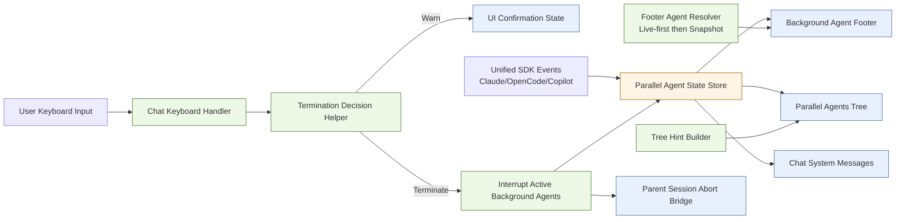
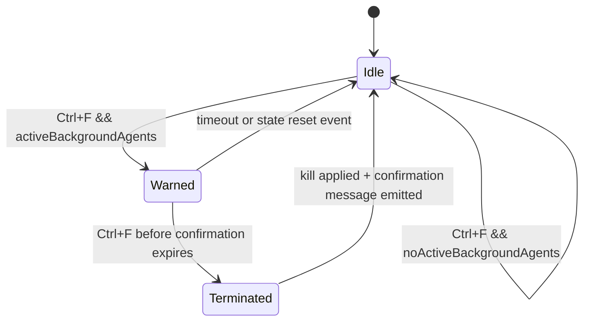

# Atomic CLI Background Agents UI Parity and Hardening (Issue #258) Technical Design Document / RFC

| Document Metadata      | Details                                 |
| ---------------------- | --------------------------------------- |
| Author(s)              | lavaman131                              |
| Status                 | Draft (WIP)                             |
| Team / Owner           | Atomic CLI TUI                          |
| Created / Last Updated | Phase-tracked document (no date anchor) |

## 1. Executive Summary

Issue `#258` reports missing background-agent UX behavior in Atomic TUI across Claude Code, OpenCode, and Copilot: footer status visibility, Ctrl+F termination confirmation flow, and tree view hint/state behavior. Existing research shows these surfaces are present in the current branch, but the expected behavior is not captured as a stable product contract and can drift across runtime paths, provider adapters, and future refactors. [Research: `research/docs/2026-02-23-gh-issue-258-background-agents-ui.md`], [Research: `research/tickets/2026-02-23-0258-background-agents-ui.md`]

This RFC proposes a contract-first hardening pass: define canonical UX rules for background-agent footer text, Ctrl+F double-press semantics, termination scope, and tree hint wording; align keyboard/state handling with that contract; and enforce parity via provider/mode test matrices and screenshot-anchored acceptance checks.

Value: this closes ambiguity between issue expectations and runtime behavior, reduces regressions in high-frequency keyboard flows, and provides a clear “done” bar for Dev and Production parity without redesigning the existing TUI architecture.

## 2. Context and Motivation

### 2.1 Current State

- The issue evidence for `#258` includes five screenshots and an explicit bug statement around footer status, Ctrl+F termination UX, and tree hints. [Research: `research/docs/2026-02-23-gh-issue-258-background-agents-ui.md`]
- Current implementation surfaces are split across dedicated modules:
    - Footer rendering uses `BackgroundAgentFooter` mounted in `ChatApp`.
    - Ctrl+F behavior uses utility-driven key detection + decision logic + interruption transforms.
    - Tree header hint text is generated by a dedicated hint builder utility.
    - Parent session handling bridges UI termination into run/session abort behavior.
      [Research: `research/tickets/2026-02-23-0258-background-agents-ui.md`]
- The same chat/UI runtime path is used by both dev (`bun run src/cli.ts`) and production (`bun build src/cli.ts --compile --outfile atomic`) entry points. [Research: `research/tickets/2026-02-23-0258-background-agents-ui.md`]
- The architecture already relies on a unified event model across SDK clients, with UI components intended to be SDK-agnostic. [Research: `research/docs/2026-02-12-sdk-ui-standardization-research.md`]

### 2.2 The Problem

- **User impact:** Behavior can appear inconsistent with issue expectations because there is no single accepted UX contract for copy, scope, and keyflow semantics.
- **Business/Product impact:** Open bug reports can remain unresolved when implementation exists but acceptance criteria are undefined or unverifiable.
- **Technical debt:** Logic is spread across keyboard handlers, utilities, and renderers; without a specification-backed test matrix, provider parity regressions can reappear.
- **Evidence gap:** Issue body expectations and code snapshot observations are not explicitly reconciled in one approved design artifact. [Research: `research/tickets/2026-02-23-0258-background-agents-ui.md`]

## 3. Goals and Non-Goals

### 3.1 Functional Goals

- [ ] Define and enforce canonical footer behavior for background agents, including count display and Ctrl+F hint presence.
- [ ] Define and enforce a deterministic Ctrl+F termination state machine (first press warning, second press kill).
- [ ] Define and enforce canonical tree header hint strings for background-running, background-complete, and default cases.
- [ ] Guarantee parity across Claude Code, OpenCode, and Copilot provider flows through shared contract tests.
- [ ] Guarantee parity between dev and production runtime paths for the background-agent UX surfaces covered by issue `#258`.
- [ ] Provide screenshot/fixture-based acceptance validation aligned to issue assets.

### 3.2 Non-Goals (Out of Scope)

- [ ] We will NOT redesign the overall chat layout, typography, or tree visualization style.
- [ ] We will NOT introduce new keyboard shortcuts beyond clarifying existing Ctrl+F/Ctrl+O semantics.
- [ ] We will NOT change provider SDK protocol contracts in this phase unless required for parity fixes.
- [ ] We will NOT add global multi-session kill behavior unless explicitly approved as scope.
- [ ] We will NOT broaden this RFC to unrelated sub-agent rendering issues outside issue `#258`.

## 4. Proposed Solution (High-Level Design)

### 4.1 System Architecture Diagram



### 4.2 Architectural Pattern

This RFC applies a **Contract-Driven UI State Machine** pattern:

- A canonical behavior contract is defined first (copy rules, keyflow, termination scope, hint precedence).
- Existing module boundaries remain in place (footer utility, termination utility, tree hint utility, chat integration).
- Provider adapters continue normalizing into the unified stream model; UI behavior is validated at the contract layer rather than per-SDK bespoke logic.

### 4.3 Key Components

| Component                               | Responsibility                                                   | Technology Stack                | Justification                                                                                                                                              |
| --------------------------------------- | ---------------------------------------------------------------- | ------------------------------- | ---------------------------------------------------------------------------------------------------------------------------------------------------------- |
| `ChatApp` keyboard branch               | Routes Ctrl+F/Ctrl+O flows and renders confirmation feedback     | TypeScript + OpenTUI components | Centralized input control point already owns lifecycle transitions. [Research: `research/tickets/2026-02-23-0258-background-agents-ui.md`]                 |
| `background-agent-termination` utils    | Key detection, double-press decisioning, interruption transforms | TypeScript utility module       | Encapsulates kill decision semantics; best place for contract-level assertions. [Research: `research/tickets/2026-02-23-0258-background-agents-ui.md`]     |
| `BackgroundAgentFooter` + resolver util | Computes displayable agents and renders footer hint/copy         | TypeScript + UI component       | Existing mounted path for issue-reported footer behavior. [Research: `research/tickets/2026-02-23-0258-background-agents-ui.md`]                           |
| `ParallelAgentsTree` + hint builder     | Computes and displays contextual tree hint text                  | TypeScript + UI component       | Existing hint generation path; natural insertion point for canonical wording rules. [Research: `research/tickets/2026-02-23-0258-background-agents-ui.md`] |
| `startChatUI` shared runtime path       | Provides dev/prod parity surface                                 | Bun CLI + shared UI entry       | Ensures behavior consistency regardless of build mode. [Research: `research/tickets/2026-02-23-0258-background-agents-ui.md`]                              |

## 5. Detailed Design

### 5.1 API Interfaces

This feature is internal to the TUI runtime; no new external HTTP API is introduced. We define internal contracts to eliminate ambiguity.

```ts
type BackgroundTerminationDecision =
    | { action: "none" }
    | { action: "warn"; message: string }
    | { action: "terminate"; message: string };

interface BackgroundFooterContract {
    showWhenAgentCountAtLeast: number;
    includeTerminateHint: boolean;
    terminateHintText: string;
    countFormat: "agents" | "tasks";
}

interface BackgroundTreeHintContract {
    whenRunning: string;
    whenComplete: string;
    defaultHint: string;
}
```

Contract enforcement points:

- `background-agent-termination` utility validates key-to-decision semantics.
- Footer resolver + footer component validate count/hint display semantics.
- Tree hint builder validates hint precedence semantics.
- Chat-level integration validates message emission and session-abort callback semantics.

### 5.2 Data Model / Schema

The core data model remains in-memory UI state; this RFC formalizes expected fields and derivations.

| State Surface                | Field                                         | Constraints                                  | Description                                            |
| ---------------------------- | --------------------------------------------- | -------------------------------------------- | ------------------------------------------------------ |
| Background termination state | `isAwaitingBackgroundTerminationConfirmation` | Boolean; true only after first Ctrl+F warn   | Governs warn vs terminate branch in double-press flow. |
| Termination timer state      | `backgroundTerminationConfirmationExpiresAt`  | Optional timestamp-like value                | Clears stale confirmation if user does not confirm.    |
| Live background agents       | `backgroundAgents[]`                          | Derived from active stream/session agents    | Primary source for footer/tree active state.           |
| Snapshot fallback agents     | `message.parallelAgents[]`                    | Used only when live list is unavailable      | Preserves footer/tree continuity post-stream updates.  |
| Tree hint text               | `buildParallelAgentsHeaderHint(...)` output   | Exactly one hint string chosen by precedence | Converts lifecycle summary to user-facing hint copy.   |

Derivation rule precedence:

1. Prefer live background agent state.
2. Fallback to message snapshots if live state is absent.
3. Resolve footer text/hints and tree hints from derived state.

[Research: `research/tickets/2026-02-23-0258-background-agents-ui.md`]

### 5.3 Algorithms and State Management

#### 5.3.1 Ctrl+F Double-Press Termination State Machine



Normative behavior:

- First Ctrl+F with active background agents emits a warning interface aligned with the single-press Ctrl+C warning pattern, and includes explicit guidance to press Ctrl+F again to terminate background agents.
- Confirmation enters an expiring armed state and auto-resets if not confirmed or if context changes.
- Second Ctrl+F within the active confirmation window interrupts all background agents in the current session scope.
- Successful termination appends a chat/system confirmation message indicating background agents were terminated.
- Parent abort callback executes after state mutation so run/session cleanup remains consistent.

#### 5.3.2 Tree Hint Precedence

- If any scoped background agents are running, use running hint text.
- If no background agents are running and at least one completed entry exists, use complete hint text.
- Otherwise use default expansion hint text.

[Research: `research/tickets/2026-02-23-0258-background-agents-ui.md`], [Research: `research/docs/2026-02-12-sdk-ui-standardization-research.md`]

#### 5.3.3 Dev/Prod and Provider Parity Contract

- Execute identical behavior assertions on shared chat runtime for:
    - Claude provider stream normalization
    - OpenCode provider stream normalization
    - Copilot provider stream normalization
- Validate on both dev and compiled production entry paths that route through `startChatUI`.

## 6. Alternatives Considered

| Option                                                             | Pros                                                                            | Cons                                                                                            | Reason for Rejection                                                                                                 |
| ------------------------------------------------------------------ | ------------------------------------------------------------------------------- | ----------------------------------------------------------------------------------------------- | -------------------------------------------------------------------------------------------------------------------- |
| Option A: Close issue as already implemented                       | Minimal engineering work                                                        | No durable acceptance contract; regressions likely; ambiguity remains                           | Rejected because issue evidence and implementation evidence are still misaligned without formal acceptance criteria. |
| Option B: Add tests only, no contract doc                          | Improves confidence quickly                                                     | Tests encode assumptions implicitly; hard to align with product expectations and copy standards | Rejected because this issue hinges on UX semantics, not just behavior mechanics.                                     |
| Option C: Contract-first hardening + parity test matrix (Selected) | Explicit acceptance criteria, durable across providers/modes, easier bug triage | Requires upfront alignment decisions (copy/scope/timing)                                        | **Selected** because it resolves both behavior and specification ambiguity.                                          |

## 7. Cross-Cutting Concerns

### 7.1 Security and Privacy

- Termination actions must be scoped to the active chat/session context only unless explicitly expanded.
- Termination should never target unrelated sessions/processes.
- User-facing confirmation copy should avoid exposing internal IDs or provider internals.

### 7.2 Observability Strategy

- Track keyboard termination flow metrics:
    - `background_termination_warn_count`
    - `background_termination_execute_count`
    - `background_termination_noop_count`
- Track parity failures in CI matrix by provider/runtime mode.
- Add structured debug logs around state transitions to simplify regression diagnosis.

### 7.3 Scalability and Capacity Planning

- Ensure footer and tree hint computation remains O(n) in number of tracked agents with no repeated full-copy transforms in hot keyboard paths.
- Ensure rapid key-repeat does not trigger duplicate termination execution.
- Preserve responsive rendering when multiple background agents stream concurrently.

## 8. Migration, Rollout, and Testing

### 8.1 Deployment Strategy

- [ ] Phase 1: Approve canonical UX contract for footer, Ctrl+F flow, hint text, and termination scope.
- [ ] Phase 2: Apply implementation alignment to existing modules without architectural rewrites.
- [ ] Phase 3: Enable contract checks in CI for provider/runtime parity.
- [ ] Phase 4: Remove temporary compatibility paths after parity is confirmed stable.

### 8.2 Data Migration Plan

- No persistent data migration is required.
- Existing in-memory state structures are sufficient; changes are behavioral/contractual.

### 8.3 Test Plan

- **Unit Tests:**
    - Termination decision logic (`none`/`warn`/`terminate`) for keypress sequences.
    - Footer resolver precedence (live vs snapshot fallback).
    - Tree hint precedence and exact copy contract.
- **Integration Tests:**
    - Chat-level Ctrl+F first/second press behavior and emitted confirmation message.
    - First Ctrl+F warning UI parity with single-press Ctrl+C warning style and instruction text.
    - Parent callback invocation after termination.
    - Ctrl+O transcript toggle behavior remains intact and non-conflicting.
- **End-to-End Tests:**
    - Provider matrix: Claude, OpenCode, Copilot.
    - Runtime matrix: dev (`bun run src/cli.ts`) and compiled binary path.
    - Screenshot parity checks against issue assets for footer/tree/confirmation surfaces.

## 9. Open Questions / Unresolved Issues

- [x] **OQ-1 Footer Surface Canonicalization (Resolved):** Runtime will continue using `BackgroundAgentFooter` as the canonical footer path for issue `#258`; `FooterStatus` consolidation is out of scope for this RFC phase.
- [x] **OQ-2 Ctrl+F Confirmation Window (Resolved):** First Ctrl+F enters an expiring armed state; confirmation auto-resets on expiry or relevant context changes.
- [x] **OQ-3 Termination Scope (Resolved):** “Terminate all background agents” applies to the current session scope only.
- [x] **OQ-4 Canonical Copy Strictness (Resolved):** For Ctrl+F flow, first press must present a Ctrl+C-like warning interface with explicit instruction to press Ctrl+F again to kill background agents; acceptance is behavior-first with required instruction semantics rather than strict full-string matching.

## 10. Research References

- Primary issue extraction: `research/docs/2026-02-23-gh-issue-258-background-agents-ui.md`
- Issue-to-code mapping: `research/tickets/2026-02-23-0258-background-agents-ui.md`
- Sub-agent lifecycle context: `research/docs/2026-02-16-sub-agent-tree-inline-state-lifecycle-research.md`
- SDK/UI parity baseline: `research/docs/2026-02-12-sdk-ui-standardization-research.md`
