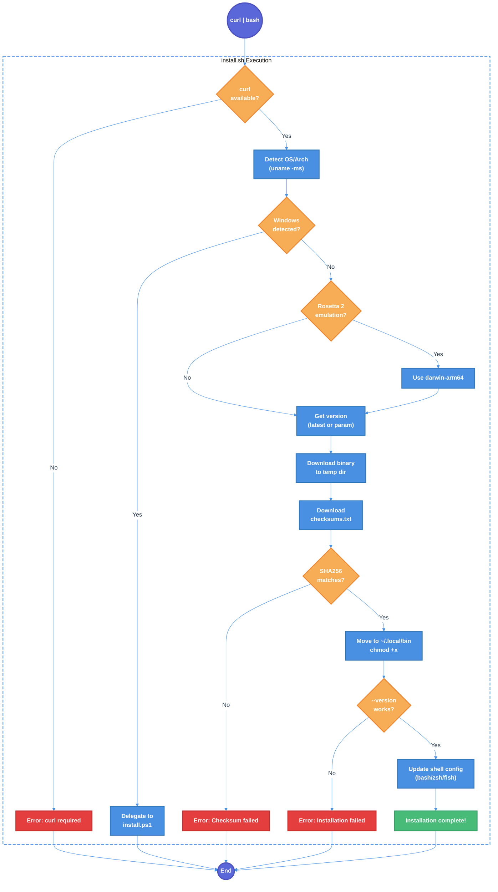

# Binary Distribution and Installer Scripts Technical Design Document

| Document Metadata      | Details         |
| ---------------------- | --------------- |
| Author(s)              | lavaman131      |
| Status                 | Draft (WIP)     |
| Team / Owner           | flora131/atomic |
| Created / Last Updated | 2026-01-21      |

## 1. Executive Summary

This RFC proposes adding shell-based installer scripts (`install.sh` and `install.ps1`) to enable one-line installation of Atomic CLI via `curl | bash` and PowerShell's `irm | iex`. The existing `publish.yml` workflow compiles binaries for five platform/architecture combinations; this spec adds Windows ARM64 support for a total of six targets. The installer scripts will detect the user's platform, download the appropriate binary from GitHub Releases, verify SHA256 checksums, install to `~/.local/bin`, and auto-configure PATH in shell configuration files.

**Installation Commands (Post-Implementation):**
```bash
# Linux/macOS
curl -fsSL https://raw.githubusercontent.com/flora131/atomic/main/install.sh | bash

# Windows PowerShell
irm https://raw.githubusercontent.com/flora131/atomic/main/install.ps1 | iex
```

**Research Reference:** [research/docs/2026-01-21-binary-distribution-installers.md](../research/docs/2026-01-21-binary-distribution-installers.md)

## 2. Context and Motivation

### 2.1 Current State

The Atomic CLI has a robust binary distribution setup via GitHub Actions:

**Binary Compilation** (`.github/workflows/publish.yml:34-51`, to be updated):
```bash
# Current: 5 platform/architecture combinations
# Proposed: 6 platform/architecture combinations (adding Windows ARM64)
bun build src/index.ts --compile --minify --target=bun-linux-x64 --outfile dist/atomic-linux-x64
bun build src/index.ts --compile --minify --target=bun-linux-arm64 --outfile dist/atomic-linux-arm64
bun build src/index.ts --compile --minify --target=bun-darwin-x64 --outfile dist/atomic-darwin-x64
bun build src/index.ts --compile --minify --target=bun-darwin-arm64 --outfile dist/atomic-darwin-arm64
bun build src/index.ts --compile --minify --target=bun-windows-x64 --outfile dist/atomic-windows-x64.exe
bun build src/index.ts --compile --minify --target=bun-windows-arm64 --outfile dist/atomic-windows-arm64.exe  # NEW
```

**Current Installation Methods** (from `README.md:19-48`):
1. npm/bun global install: `bun add -g @bastani/atomic`
2. npx/bunx one-time execution: `bunx @bastani/atomic`
3. Development: Clone repo + `bun install && bun link`

**Reference:** [research/docs/2026-01-21-binary-distribution-installers.md - "Current Build and Distribution Setup"](../research/docs/2026-01-21-binary-distribution-installers.md)

### 2.2 The Problem

- **Dependency Barrier:** Users must have Node.js/Bun installed before installing Atomic CLI
- **Version Management:** npm installations don't easily support installing specific versions from GitHub Releases
- **Cross-Platform Friction:** Different installation commands for each platform reduce accessibility
- **Standard Expectation:** Modern CLI tools (Bun, Deno, Starship, Rust) all support `curl | bash` installation

### 2.3 Current Distribution Flow

```
┌─────────────────────────────────────────────────────────────────┐
│                     GitHub Release Created                       │
└─────────────────────────────────────────────────────────────────┘
                                │
                                ▼
┌─────────────────────────────────────────────────────────────────┐
│                        publish.yml                               │
├─────────────────────────────────────────────────────────────────┤
│  ┌─────────────┐   ┌─────────────┐   ┌─────────────────────┐   │
│  │ Build Job   │──▶│ Release Job │   │ Publish npm Job     │   │
│  │ (binaries)  │   │ (assets)    │   │ (source + shebang)  │   │
│  └─────────────┘   └─────────────┘   └─────────────────────┘   │
└─────────────────────────────────────────────────────────────────┘
                                │
                                ▼
┌─────────────────────────────────────────────────────────────────┐
│                       GitHub Releases                            │
├─────────────────────────────────────────────────────────────────┤
│  atomic-linux-x64           atomic-darwin-x64                   │
│  atomic-linux-arm64         atomic-darwin-arm64                 │
│  atomic-windows-x64.exe     atomic-windows-arm64.exe            │
│  checksums.txt                                                  │
└─────────────────────────────────────────────────────────────────┘
```

**Reference:** [research/docs/2026-01-21-binary-distribution-installers.md - "Architecture Documentation"](../research/docs/2026-01-21-binary-distribution-installers.md)

## 3. Goals and Non-Goals

### 3.1 Functional Goals

- [ ] Create `install.sh` in repository root for Linux/macOS installation
- [ ] Create `install.ps1` in repository root for Windows installation
- [ ] Detect platform and architecture automatically (Linux x64/arm64, macOS x64/arm64, Windows x64/arm64)
- [ ] Add Windows ARM64 binary compilation to `publish.yml`
- [ ] Detect Rosetta 2 emulation on macOS and download native arm64 binary
- [ ] Download binary from GitHub Releases (supports `latest` and specific versions)
- [ ] Mandatory SHA256 checksum verification before installation
- [ ] Install to `~/.local/bin` (Unix) / `%USERPROFILE%\.local\bin` (Windows) by default
- [ ] Support `ATOMIC_INSTALL` environment variable to override install directory
- [ ] Auto-modify shell configuration files (bash, zsh, fish) to add binary to PATH
- [ ] Windows: Modify user-level PATH via registry (no admin required)
- [ ] Verify installation by running `atomic --version` after install
- [ ] Support version parameter: `curl ... | bash -s -- v1.0.0`
- [ ] Update README.md with new installation instructions

### 3.2 Non-Goals (Out of Scope)

- [ ] We will NOT create a custom domain for hosting install scripts (use `raw.githubusercontent.com`)
- [ ] We will NOT add Homebrew or Scoop package manager support (future enhancement)
- [ ] We will NOT require sudo/admin privileges for installation
- [ ] We will NOT modify system-wide PATH (user-level only)
- [ ] We will NOT create uninstall scripts in this version
- [ ] We will NOT add GPG signature verification (SHA256 checksums are sufficient)

## 4. Proposed Solution (High-Level Design)

### 4.1 Installation Flow Diagram



### 4.2 Architectural Pattern

**Platform-Specific Installer Scripts**

The implementation follows the standard pattern used by Bun, Deno, and Starship:
- Shell script (`install.sh`) for Unix-like systems with automatic Windows delegation
- PowerShell script (`install.ps1`) for native Windows installation
- Both scripts share the same configuration (install directory, binary naming, checksum verification)

### 4.3 Key Components

| Component       | Responsibility                    | Technology | Justification                             |
| --------------- | --------------------------------- | ---------- | ----------------------------------------- |
| `install.sh`    | Unix installation (Linux/macOS)   | Bash       | Universal availability on Unix systems    |
| `install.ps1`   | Windows installation              | PowerShell | Native Windows scripting, no dependencies |
| GitHub Releases | Binary hosting                    | GitHub     | Already configured in `publish.yml`       |
| `checksums.txt` | SHA256 checksums for verification | Plain text | Already generated by `publish.yml`        |

### 4.4 Platform Detection Matrix

| Platform            | Detection Method                               | Target Binary              |
| ------------------- | ---------------------------------------------- | -------------------------- |
| Linux x64           | `uname -s` = Linux, `uname -m` = x86_64        | `atomic-linux-x64`         |
| Linux arm64         | `uname -s` = Linux, `uname -m` = aarch64/arm64 | `atomic-linux-arm64`       |
| macOS x64           | `uname -s` = Darwin, `uname -m` = x86_64       | `atomic-darwin-x64`        |
| macOS arm64         | `uname -s` = Darwin, `uname -m` = arm64        | `atomic-darwin-arm64`      |
| macOS x64 (Rosetta) | `sysctl.proc_translated` = 1                   | `atomic-darwin-arm64`      |
| Windows x64         | `$env:PROCESSOR_ARCHITECTURE` = AMD64          | `atomic-windows-x64.exe`   |
| Windows ARM64       | `$env:PROCESSOR_ARCHITECTURE` = ARM64          | `atomic-windows-arm64.exe` |

**Reference:** [research/docs/2026-01-21-binary-distribution-installers.md - "Platform Detection Patterns"](../research/docs/2026-01-21-binary-distribution-installers.md)

### 4.5 Download URL Structure

```
# Latest release
https://github.com/flora131/atomic/releases/latest/download/atomic-{target}

# Specific version
https://github.com/flora131/atomic/releases/download/v{version}/atomic-{target}

# Checksums file
https://github.com/flora131/atomic/releases/download/v{version}/checksums.txt
```

## 5. Detailed Design

### 5.1 install.sh Script Structure

**Location:** Repository root (`/install.sh`)

**Key Functions:**

| Function                | Purpose                                                       |
| ----------------------- | ------------------------------------------------------------- |
| `detect_platform()`     | Returns target string (e.g., `linux-x64`, `darwin-arm64`)     |
| `detect_shell_config()` | Returns path to shell config file (`.bashrc`, `.zshrc`, etc.) |
| `add_to_path()`         | Appends PATH export to shell config if not present            |
| `verify_checksum()`     | Validates SHA256 hash of downloaded binary                    |
| `get_latest_version()`  | Fetches latest version tag from GitHub API                    |
| `main()`                | Orchestrates the installation flow                            |

**Error Handling:**
```bash
set -euo pipefail  # Exit on error, undefined vars, pipe failures
```

**Reference:** [research/docs/2026-01-21-binary-distribution-installers.md - "Complete Install Script Templates"](../research/docs/2026-01-21-binary-distribution-installers.md)

### 5.2 install.ps1 Script Structure

**Location:** Repository root (`/install.ps1`)

**Parameters:**
```powershell
param(
    [String]$Version = "latest",
    [String]$InstallDir = "",
    [Switch]$NoPathUpdate = $false
)
```

**Key Features:**
- Architecture detection (x64 and ARM64 supported)
- Download with curl.exe fallback to `Invoke-WebRequest`
- Registry-based PATH modification (user-level, no admin required)
- `WM_SETTINGCHANGE` broadcast for immediate PATH visibility

**Architecture Detection (PowerShell):**
```powershell
# Detect Windows architecture
$Arch = $env:PROCESSOR_ARCHITECTURE
switch ($Arch) {
    "AMD64" { $Target = "windows-x64.exe" }
    "ARM64" { $Target = "windows-arm64.exe" }
    default { throw "Unsupported architecture: $Arch" }
}
```

**Reference:** [research/docs/2026-01-21-binary-distribution-installers.md - "install.ps1 Template"](../research/docs/2026-01-21-binary-distribution-installers.md)

### 5.3 Shell Configuration Detection

| Shell | Config File                                      | PATH Syntax                            |
| ----- | ------------------------------------------------ | -------------------------------------- |
| bash  | `~/.bashrc` (or `~/.bash_profile`, `~/.profile`) | `export PATH="$HOME/.local/bin:$PATH"` |
| zsh   | `~/.zshrc`                                       | `export PATH="$HOME/.local/bin:$PATH"` |
| fish  | `~/.config/fish/config.fish`                     | `fish_add_path $HOME/.local/bin`       |

**Detection Priority:**
1. Check `$SHELL` environment variable
2. Use `basename` to determine shell type
3. Fall back to `~/.profile` for unknown shells

### 5.4 Checksum Verification

**Unix (supports both Linux and macOS):**
```bash
if command -v sha256sum >/dev/null; then
    # Linux: use sha256sum
    sha256sum -c --quiet
elif command -v shasum >/dev/null; then
    # macOS: use shasum with -a 256
    shasum -a 256 -c --quiet
fi
```

**Windows (PowerShell):**
```powershell
$ActualHash = (Get-FileHash -Path $BinaryPath -Algorithm SHA256).Hash.ToLower()
```

### 5.5 Version Parameter Support

**Unix:**
```bash
# Usage examples
curl -fsSL https://raw.githubusercontent.com/flora131/atomic/main/install.sh | bash
curl -fsSL https://raw.githubusercontent.com/flora131/atomic/main/install.sh | bash -s -- v1.0.0
curl -fsSL https://raw.githubusercontent.com/flora131/atomic/main/install.sh | bash -s -- -b /usr/local/bin
```

**Windows:**
```powershell
# Usage examples
irm https://raw.githubusercontent.com/flora131/atomic/main/install.ps1 | iex
iex "& { $(irm https://raw.githubusercontent.com/flora131/atomic/main/install.ps1) } -Version v1.0.0"
```

### 5.6 README.md Updates

**New Quick Start Section:**
```markdown
## Quick Start

### One-Line Install (Recommended)

**Linux/macOS:**
```bash
curl -fsSL https://raw.githubusercontent.com/flora131/atomic/main/install.sh | bash
```

**Windows (PowerShell):**
```powershell
irm https://raw.githubusercontent.com/flora131/atomic/main/install.ps1 | iex
```

### Alternative Methods

**npm/bun (requires Node.js/Bun):**
```bash
npm install -g @bastani/atomic
# or
bun add -g @bastani/atomic
```

## 6. Alternatives Considered

| Option                              | Pros                                         | Cons                                       | Reason for Rejection                                      |
| ----------------------------------- | -------------------------------------------- | ------------------------------------------ | --------------------------------------------------------- |
| **A: npm-only installation**        | Simple, existing infrastructure              | Requires Node.js/Bun dependency            | User friction for non-JS developers                       |
| **B: Homebrew/Scoop packages**      | Native package manager integration           | Maintenance overhead, review delays        | Can be added later, not blocking                          |
| **C: Custom domain (atomic.sh)**    | Shorter URLs, professional appearance        | DNS/hosting complexity, cost               | Unnecessary for initial release                           |
| **D: Docker-based installer**       | Cross-platform consistency                   | Requires Docker, heavyweight               | Overkill for CLI installation                             |
| **E: curl/bash scripts (Selected)** | Universal, no dependencies, standard pattern | Security concerns (mitigated by checksums) | **Selected:** Matches industry standard (Bun, Deno, Rust) |

## 7. Cross-Cutting Concerns

### 7.1 Security and Privacy

- **HTTPS-only:** All downloads use HTTPS (GitHub enforces this)
- **Checksum verification:** SHA256 checksums validated before execution
- **No admin privileges:** Installs to user directory, no sudo required
- **Transparent scripts:** Scripts hosted in main repo, auditable
- **No telemetry:** Installation does not send any analytics data

**Security Note:** While `curl | bash` has theoretical risks, the combination of:
1. HTTPS transport security
2. SHA256 checksum verification
3. Open-source script in main repo
4. Installation to user directory (sandboxed)

...provides security equivalent to npm/bun installation.

### 7.2 Backward Compatibility

- **No breaking changes:** Existing npm/bun installation continues to work
- **Additive feature:** New installation method doesn't affect existing users
- **Version compatibility:** Scripts work with all existing GitHub releases

### 7.3 Observability Strategy

- **Colored output:** Info, success, warning, error messages with distinct colors
- **Progress indicators:** Download progress shown via `curl --progress-bar`
- **Debug mode:** Scripts can support `DEBUG=1` for verbose output (future enhancement)

## 8. Migration, Rollout, and Testing

### 8.1 Deployment Strategy

1. Create `install.sh` and `install.ps1` in repository root
2. Merge to `main` branch (scripts available immediately via raw.githubusercontent.com)
3. Update README.md with new installation instructions
4. No workflow changes needed - existing `publish.yml` provides all required assets

### 8.2 Test Plan

#### Manual Testing - install.sh

| Test Case            | Platform            | Expected Result                                     |
| -------------------- | ------------------- | --------------------------------------------------- |
| Fresh install        | Linux x64           | Binary in `~/.local/bin`, PATH updated in `.bashrc` |
| Fresh install        | Linux arm64         | Binary in `~/.local/bin`, PATH updated              |
| Fresh install        | macOS x64           | Binary in `~/.local/bin`, PATH updated in `.zshrc`  |
| Fresh install        | macOS arm64         | Binary in `~/.local/bin`, PATH updated              |
| Rosetta 2 detection  | macOS x64 (on M1)   | Downloads arm64 binary, logs detection              |
| Specific version     | Any Unix            | Downloads specified version, not latest             |
| Custom install dir   | Any Unix            | Installs to `ATOMIC_INSTALL` path                   |
| Checksum mismatch    | Any Unix            | Errors with checksum failure message                |
| Missing curl         | Any Unix            | Errors with dependency message                      |
| Re-install (upgrade) | Any Unix            | Overwrites existing binary, PATH unchanged          |
| Zsh shell            | macOS               | PATH added to `.zshrc`                              |
| Fish shell           | Any Unix            | PATH added via `fish_add_path`                      |
| Windows delegation   | Git Bash on Windows | Delegates to PowerShell script                      |

#### Manual Testing - install.ps1

| Test Case            | Platform      | Expected Result                                    |
| -------------------- | ------------- | -------------------------------------------------- |
| Fresh install        | Windows x64   | Binary in `%USERPROFILE%\.local\bin`, PATH updated |
| Fresh install        | Windows ARM64 | Binary in `%USERPROFILE%\.local\bin`, PATH updated |
| Specific version     | Windows x64   | Downloads specified version                        |
| Specific version     | Windows ARM64 | Downloads specified version                        |
| Custom install dir   | Windows x64   | Installs to `ATOMIC_INSTALL` path                  |
| Checksum mismatch    | Windows x64   | Errors with checksum failure message               |
| NoPathUpdate flag    | Windows x64   | Installs binary but doesn't modify PATH            |
| Re-install (upgrade) | Windows x64   | Overwrites existing binary                         |
| Re-install (upgrade) | Windows ARM64 | Overwrites existing binary                         |
| Unsupported arch     | Windows x86   | Errors with unsupported architecture message       |

#### Automated Testing (Future Enhancement)

- [ ] GitHub Actions workflow to test installation on all platforms
- [ ] Docker-based testing for Linux distributions
- [ ] macOS matrix testing (x64 and arm64 runners)
- [ ] Windows matrix testing

## 9. Open Questions / Unresolved Issues

- [ ] **Homebrew/Scoop packages:** Should we add package manager distribution alongside curl|bash?
  - Current: Manual installation only
  - Impact: More familiar workflow for some users
  - Recommendation: Defer to future version, can be community-contributed

- [ ] **Uninstall script:** Should we provide an `uninstall.sh` / `uninstall.ps1`?
  - Current: Manual removal required
  - Impact: Minor inconvenience for users who want to remove
  - Recommendation: Defer, simple manual removal is sufficient

## 10. Implementation File Changes

| File                            | Change Type | Description                                                   |
| ------------------------------- | ----------- | ------------------------------------------------------------- |
| `install.sh`                    | Create      | Unix installer script (~200 lines)                            |
| `install.ps1`                   | Create      | Windows installer script (~160 lines)                         |
| `.github/workflows/publish.yml` | Modify      | Add Windows ARM64 binary compilation target                   |
| `README.md`                     | Modify      | Add one-line installation instructions to Quick Start section |

## 11. Implementation Checklist

### Phase 1: Core Implementation

- [ ] Update `.github/workflows/publish.yml` to add Windows ARM64 binary:
  - [ ] Add `bun build` command for `bun-windows-arm64` target
  - [ ] Output to `dist/atomic-windows-arm64.exe`

- [ ] Create `install.sh` in repository root with:
  - [ ] Platform detection (Linux x64/arm64, macOS x64/arm64)
  - [ ] Rosetta 2 detection for macOS
  - [ ] Windows delegation to PowerShell
  - [ ] Version parameter support
  - [ ] Checksum verification
  - [ ] Installation to `~/.local/bin`
  - [ ] Shell config detection (bash, zsh, fish)
  - [ ] PATH auto-modification
  - [ ] Colored output and error handling

- [ ] Create `install.ps1` in repository root with:
  - [ ] Architecture detection (x64 and ARM64)
  - [ ] Version parameter support
  - [ ] Checksum verification
  - [ ] Installation to `%USERPROFILE%\.local\bin`
  - [ ] Registry-based PATH modification
  - [ ] WM_SETTINGCHANGE broadcast
  - [ ] Colored output and error handling

### Phase 2: Documentation

- [ ] Update `README.md` Quick Start section with:
  - [ ] One-line install commands for Linux/macOS
  - [ ] One-line install command for Windows
  - [ ] Specific version installation examples
  - [ ] Custom install directory examples

### Phase 3: Testing

- [ ] Test `install.sh` on Linux x64 (Ubuntu)
- [ ] Test `install.sh` on Linux arm64 (if available)
- [ ] Test `install.sh` on macOS x64
- [ ] Test `install.sh` on macOS arm64 (Apple Silicon)
- [ ] Test Rosetta 2 detection on macOS
- [ ] Test shell config updates for bash, zsh, fish
- [ ] Test `install.ps1` on Windows x64
- [ ] Test `install.ps1` on Windows ARM64 (if available)
- [ ] Test version parameter on all platforms
- [ ] Test checksum verification failure handling
- [ ] Test `ATOMIC_INSTALL` environment variable override

## 12. Code References

### Existing Implementation (to be modified)
- `.github/workflows/publish.yml:34-51` - Binary compilation targets (add Windows ARM64)
- `.github/workflows/publish.yml:79-82` - Checksum generation (`sha256sum * > checksums.txt`)
- `.github/workflows/publish.yml:83-97` - GitHub Release upload with `softprops/action-gh-release@v2`
- `.github/workflows/publish.yml:86` - Version tag format (`v${{ steps.version.outputs.version }}`)
- `package.json:1-5` - Package name and version
- `src/version.ts:1-2` - Version export

### Documentation
- `README.md:19-48` - Current installation instructions
- `README.md:52-58` - Prerequisites section

## 13. Related Research Documents

- [research/docs/2026-01-21-binary-distribution-installers.md](../research/docs/2026-01-21-binary-distribution-installers.md) - Primary research document with complete script templates
- [research/docs/2026-01-20-cross-platform-support.md](../research/docs/2026-01-20-cross-platform-support.md) - Cross-platform considerations and Bun.which() usage
