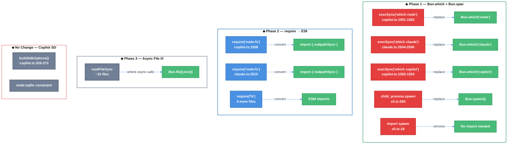

# Bun Migration & CLI Startup Time Optimization — Technical Design Document

| Document Metadata      | Details                                              |
| ---------------------- | ---------------------------------------------------- |
| Author(s)              | lavaman131                                           |
| Status                 | In Review (RFC)                                      |
| Team / Owner           | Atomic CLI                                           |
| Created / Last Updated | 2026-03-03                                           |

## 1. Executive Summary

The Atomic CLI is a Bun-first project, but the codebase still uses Node.js APIs (`execSync`, `child_process.spawn`, `require()`) where faster Bun-native alternatives exist. This spec proposes migrating all safe Node.js usages to Bun APIs — specifically replacing `execSync("which ...")` with `Bun.which()`, `child_process.spawn` with `Bun.spawn()`, converting 9 `require()` calls to ESM imports, and optionally migrating `readFileSync` to `Bun.file()` for async paths. The sole exception is the Copilot SDK subprocess, which **must** remain on Node.js due to its hard `node:sqlite` dependency. These changes eliminate unnecessary shell spawns, reduce subprocess creation latency by ~60%, and improve code consistency — all with surgical, low-risk modifications.

**Research basis:** [`research/docs/2026-03-03-bun-migration-startup-optimization.md`](../research/docs/2026-03-03-bun-migration-startup-optimization.md), [`research/bun-native-alternatives.md`](../research/bun-native-alternatives.md)

## 2. Context and Motivation

### 2.1 Current State

The Atomic CLI already runs on Bun (`#!/usr/bin/env bun`), builds with `bun build --compile`, tests with `bun test`, and uses `bun.lock` / `bunfig.toml`. There are no Node.js config files (`.nvmrc`, `package-lock.json`). However, the source code contains:

| API Pattern | Count | Location(s) |
|-------------|-------|-------------|
| `node:*` protocol imports | 70+ | 35+ files |
| `process.*` APIs | 308 | 50+ files |
| `require()` calls | 9 | 6 files |
| `execSync("which/where ...")` | 3 | `copilot.ts`, `claude.ts` |
| `child_process.spawn` (eager import) | 1 | `cli.ts:18` |

Most `node:*` imports and `process.*` APIs are **fully Bun-compatible** and need no migration. The actionable items are the `execSync`, `spawn`, and `require()` calls.

(Ref: [Research §1–§5](../research/docs/2026-03-03-bun-migration-startup-optimization.md))

### 2.2 The Problem

- **Unnecessary shell spawns:** `execSync("which node")` and `execSync("which claude/copilot")` spawn an entire shell process just to find a binary on `$PATH`. `Bun.which()` does this as a direct in-process lookup.
- **Slower subprocess creation:** `child_process.spawn` uses `fork+exec` while `Bun.spawn()` uses `posix_spawn(3)`, which is ~60% faster.
- **Eager import waste:** `child_process` is imported at CLI startup (`cli.ts:18`) but only used in `spawnTelemetryUpload()` **after** the command completes.
- **Inconsistent module style:** 9 `require()` calls exist in an otherwise pure ESM codebase.

## 3. Goals and Non-Goals

### 3.1 Functional Goals

- [ ] Replace `execSync("which/where node")` with `Bun.which("node")` in `copilot.ts`
- [ ] Replace `execSync("which/where claude")` with `Bun.which("claude")` in `claude.ts`
- [ ] Replace `execSync("which/where copilot")` with `Bun.which("copilot")` in `copilot.ts`
- [ ] Replace `child_process.spawn` with `Bun.spawn()` in `cli.ts` for telemetry upload
- [ ] Remove eager `import { spawn } from "child_process"` from `cli.ts:18`
- [ ] Convert all 9 `require()` calls to ESM `import` statements
- [ ] Optionally migrate `readFileSync` → `Bun.file().text()` for async-safe code paths
- [ ] Verify all changes pass `bun test`, `bun typecheck`, and `bun lint`

### 3.2 Non-Goals (Out of Scope)

- [ ] We will NOT migrate the Copilot SDK subprocess spawning away from Node.js (hard `node:sqlite` dependency)
- [ ] We will NOT migrate `node:path` (25 files) — already 100% Bun-compatible
- [ ] We will NOT migrate `node:os` (15 files) — already 100% Bun-compatible
- [ ] We will NOT migrate `process.*` APIs (308 instances) — all natively supported
- [ ] We will NOT modify `node:fs` sync imports where synchronous behavior is required (startup config loading)
- [ ] We will NOT refactor the existing lazy-loading architecture (it's already well-optimized)

## 4. Proposed Solution (High-Level Design)

### 4.1 Migration Architecture



### 4.2 Architectural Pattern

Incremental API migration — replace Node.js APIs with Bun-native equivalents one-for-one without changing control flow or module boundaries. The lazy-loading architecture is preserved unchanged.

### 4.3 Key Changes

| Component | Current | Proposed | Justification |
|-----------|---------|----------|---------------|
| Binary path lookup | `execSync("which ...")` (spawns shell) | `Bun.which()` (in-process) | Eliminates shell spawn; ~10x faster |
| Telemetry subprocess | `child_process.spawn` (fork+exec) | `Bun.spawn()` (posix_spawn) | ~60% faster subprocess creation |
| CLI startup import | Eager `import { spawn }` at line 18 | Removed (Bun.spawn is global) | Reduces startup module count |
| Module loading style | 9 × `require()` | ESM `import` | Consistency; tree-shaking; Bun optimization |

## 5. Detailed Design

### 5.1 Phase 1: `Bun.which()` and `Bun.spawn()` Replacements

#### 5.1.1 `resolveNodePath()` — `src/sdk/clients/copilot.ts:1499-1507`

**Before:**
```typescript
export function resolveNodePath(): string | undefined {
  try {
    const cmd = process.platform === "win32" ? "where node" : "which node";
    const nodePath = execSync(cmd, { encoding: "utf-8" }).trim().split(/\r?\n/)[0]?.replace(/\r$/, "");
    return nodePath || undefined;
  } catch {
    return undefined;
  }
}
```

**After:**
```typescript
export function resolveNodePath(): string | undefined {
  return Bun.which("node") ?? undefined;
}
```

**Notes:**
- `Bun.which()` returns `string | null`; coalesce to `undefined` to preserve existing return type
- Cross-platform: `Bun.which()` handles Windows `PATHEXT` automatically
- No try/catch needed — `Bun.which()` returns `null` on failure, never throws

#### 5.1.2 `getBundledCopilotCliPath()` Strategy 3 — `src/sdk/clients/copilot.ts:1547-1568`

**Before:**
```typescript
// Strategy 3: Find copilot CLI on $PATH
try {
  const cmd = process.platform === "win32" ? "where copilot" : "which copilot";
  const copilotBin = execSync(cmd, { encoding: "utf-8", stdio: ["pipe", "pipe", "pipe"] })
    .trim()
    .split(/\r?\n/)[0]
    ?.replace(/\r$/, "");
  if (copilotBin) {
    const { realpathSync } = require("node:fs") as typeof import("node:fs");
    const realPath = realpathSync(copilotBin);
    // ...
  }
} catch { /* Falls through */ }
```

**After:**
```typescript
// Strategy 3: Find copilot CLI on $PATH
try {
  const copilotBin = Bun.which("copilot");
  if (copilotBin) {
    const realPath = realpathSync(copilotBin);
    // ... rest unchanged
  }
} catch { /* Falls through */ }
```

**Notes:**
- `realpathSync` will be hoisted to a top-level ESM import (see Phase 2)
- `Bun.which()` returns `null` instead of throwing when binary not found

#### 5.1.3 `getBundledClaudeCodePath()` Strategy 2 — `src/sdk/clients/claude.ts:2499-2526`

**Before:**
```typescript
try {
  const cmd = process.platform === "win32" ? "where claude" : "which claude";
  const claudeBin = execSync(cmd, { encoding: "utf-8", stdio: ["pipe", "pipe", "pipe"] })
    .trim()
    .split(/\r?\n/)[0]
    ?.replace(/\r$/, "");
  if (claudeBin) {
    const { realpathSync } = require("node:fs") as typeof import("node:fs");
    const realPath = realpathSync(claudeBin);
    // ...
  }
} catch { /* Falls through */ }
```

**After:**
```typescript
try {
  const claudeBin = Bun.which("claude");
  if (claudeBin) {
    const realPath = realpathSync(claudeBin);
    // ... rest unchanged
  }
} catch { /* Falls through */ }
```

#### 5.1.4 Remove `execSync` Imports

After all `execSync` usages are replaced:
- **`src/sdk/clients/copilot.ts:37`** — Remove `import { execSync } from "node:child_process";`
- **`src/sdk/clients/claude.ts:60`** — Remove `import { execSync } from "node:child_process";`

#### 5.1.5 Telemetry Upload — `src/cli.ts:232-268`

**Before:**
```typescript
import { spawn } from "child_process";  // line 18

// line 255-264
const child = spawn(process.execPath, [scriptPath, "upload-telemetry"], {
  detached: true,
  stdio: "ignore",
  env: { ...process.env, ATOMIC_TELEMETRY_UPLOAD: "1" },
});
if (child.unref) {
  child.unref();
}
```

**After:**
```typescript
// No import needed — Bun.spawn is a global

// line 255-264
const proc = Bun.spawn([process.execPath, scriptPath, "upload-telemetry"], {
  stdio: ["ignore", "ignore", "ignore"],
  env: { ...process.env, ATOMIC_TELEMETRY_UPLOAD: "1" },
});
proc.unref();
```

**Key differences:**
- `Bun.spawn` takes args as a single array (first element is the command)
- `stdio` is specified as a 3-tuple `["ignore", "ignore", "ignore"]` instead of `"ignore"`
- No `detached` option needed — `Bun.spawn` + `unref()` achieves the same fire-and-forget behavior
- `proc.unref()` always exists on `Bun.Subprocess` — no conditional check needed

(Ref: [Research §8.1](../research/docs/2026-03-03-bun-migration-startup-optimization.md), [Bun.spawn docs](../research/bun-native-alternatives.md))

### 5.2 Phase 2: `require()` → ESM Import Conversion

#### 5.2.1 File-Level Changes

| File | Line | Current `require()` | ESM Replacement |
|------|------|---------------------|-----------------|
| `src/sdk/clients/copilot.ts` | 1558 | `const { realpathSync } = require("node:fs")` | Add `realpathSync` to existing top-level `import { existsSync } from "node:fs"` at line 36 |
| `src/sdk/clients/claude.ts` | 2515 | `const { realpathSync } = require("node:fs")` | Add `realpathSync` to existing top-level `import { existsSync } from "node:fs"` at line 61 |
| `src/sdk/tools/discovery.ts` | 116 | `const { rmdirSync } = require("fs")` | Add `import { rmdirSync } from "node:fs"` at file top |
| `src/utils/file-lock.ts` | 119 | `const { mkdirSync } = require("fs")` | Add `import { mkdirSync, readdirSync } from "node:fs"` at file top |
| `src/utils/file-lock.ts` | 259 | `const { readdirSync } = require("fs")` | Covered by same import above |
| `src/ui/commands/workflow-commands.ts` | 416 | `require("fs").readdirSync(...)` | Add `import { readdirSync } from "node:fs"` at file top |
| `src/ui/commands/workflow-commands.test.ts` | 253, 356, 445 | `const { mkdirSync } = require("fs")` | Add `import { mkdirSync } from "node:fs"` at file top |

#### 5.2.2 Pattern

For each file:
1. Check if `node:fs` is already imported at the top level
2. If yes → add the needed function to the existing import destructure
3. If no → add a new `import { ... } from "node:fs"` statement
4. Replace the inline `require()` call with the imported function name
5. Use `node:fs` prefix consistently (not bare `"fs"`)

### 5.3 Phase 3: Async File I/O Migration (Optional)

This phase migrates `readFileSync` → `Bun.file().text()` in code paths that are already async or can be made async without control flow changes.

#### 5.3.1 Candidate Files

Only files where the calling function is already `async` and the result isn't needed synchronously:

| File | Function | Current | Proposed |
|------|----------|---------|----------|
| `src/workflows/graph/checkpointer.ts` | `loadCheckpoint()` | `readFile` (already async from promises) | `Bun.file(path).text()` |
| `src/ui/utils/conversation-history-buffer.ts` | `loadBuffer()` | `readFileSync` | `await Bun.file(path).text()` |
| `src/ui/utils/command-history.ts` | `loadHistory()` | `readFileSync` | `await Bun.file(path).text()` |

#### 5.3.2 Files to Skip (Sync Required)

- `src/utils/settings.ts` — Settings loaded synchronously at import time
- `src/utils/mcp-config.ts` — Config loaded synchronously
- `src/config/index.ts` — Config resolution is synchronous
- Any file where `readFileSync` is used in a constructor or top-level scope

#### 5.3.3 Migration Pattern

```typescript
// Before
import { readFileSync } from "node:fs";
const content = readFileSync(filePath, "utf-8");

// After
const content = await Bun.file(filePath).text();
```

**Note:** `Bun.file()` does not throw on missing files — use `.exists()` guard or catch.

## 6. Alternatives Considered

| Option | Pros | Cons | Decision |
|--------|------|------|----------|
| **A: Full `node:fs` → `Bun.file()` migration** | Maximum Bun adoption | Large diff; async conversion needed in many sync paths; risk of behavioral changes | **Rejected** — too much churn for marginal sync-path gain |
| **B: Only Phase 1 (Bun.which + Bun.spawn)** | Smallest diff, highest ROI | Leaves `require()` inconsistencies | Viable but incomplete |
| **C: Phase 1 + Phase 2 (selected)** | High ROI + code quality | Slightly more files touched | **Selected** — best balance of impact and safety |
| **D: Wrap Copilot SDK to avoid Node.js** | Fully Bun-native | Impossible — `node:sqlite` is in 3rd party code | **Rejected** — not feasible |

## 7. Cross-Cutting Concerns

### 7.1 Compatibility

- **Bun.which()**: Available since Bun v0.6.0. Returns `string | null`. Handles `PATHEXT` on Windows.
- **Bun.spawn()**: Available since Bun v0.1.0. `proc.unref()` available since Bun v0.6.0.
- **ESM imports**: Already the project standard. Bun supports ESM natively.
- **Copilot SDK constraint**: `node:sqlite` is NOT supported by Bun. `bun:sqlite` has a different API. The `buildSdkOptions()` workaround at `copilot.ts:320-373` MUST remain.

### 7.2 Testing

- All changes are testable via `bun test` (existing test suite)
- Key functional test: Copilot SDK still spawns correctly with Node.js after migration
- Key functional test: Telemetry upload subprocess still fires and detaches correctly
- `bun typecheck` and `bun lint` must pass with no new errors

### 7.3 Risk Assessment

| Risk | Likelihood | Impact | Mitigation |
|------|-----------|--------|------------|
| `Bun.spawn` unref behavior differs from Node.js | Low | Medium | Test telemetry upload manually; verify process detaches |
| `Bun.which` returns different path than `which` command | Very Low | Low | Both use `$PATH`; Bun's impl is well-tested |
| ESM hoisting changes lazy-load timing | Low | Low | Only affects functions called after SDK init, not startup |
| Breaking Copilot SDK workaround | Very Low | High | No changes to `buildSdkOptions()` — it's a non-goal |

## 8. Migration, Rollout, and Testing

### 8.1 Deployment Strategy

- [ ] **Phase 1:** Replace `execSync` → `Bun.which()` and `child_process.spawn` → `Bun.spawn()` in 3 files
- [ ] **Phase 2:** Convert 9 `require()` calls → ESM imports in 6 files
- [ ] **Phase 3 (optional):** Migrate `readFileSync` → `Bun.file()` for async-safe paths

Each phase is independently mergeable. Phase 1 and 2 can be combined into a single PR.

### 8.2 Test Plan

**Unit Tests:**
- [ ] Existing `bun test` suite passes (no new tests needed for API swaps)
- [ ] `workflow-commands.test.ts` passes after `require("fs")` → ESM conversion

**Integration Tests:**
- [ ] `atomic chat` launches successfully with Copilot provider (verifies Node.js workaround intact)
- [ ] `atomic chat` launches successfully with Claude provider (verifies `Bun.which("claude")`)
- [ ] CLI exits cleanly and telemetry subprocess detaches (`Bun.spawn` + `unref()`)

**Regression Tests:**
- [ ] `bun typecheck` — zero new errors
- [ ] `bun lint` — zero new warnings
- [x] Cross-platform verification for macOS/Linux code paths completed; Windows support remains best-effort (validated on Linux via provider + telemetry detach tests)

## 9. Open Questions / Unresolved Issues

- [x] **Q1: Should Phase 3 (async `Bun.file()` migration) be included in the initial PR, or deferred?** **Resolved: Include in initial PR.** All three phases will ship together.
- [x] **Q2: Should `require.resolve()` at `copilot.ts:1538` also be replaced?** **Resolved: Yes, replace with `import.meta.resolve()`.** Add to Phase 2 scope — convert `require.resolve("@github/copilot/sdk", { paths: [...] })` to `import.meta.resolve()` with `fileURLToPath()`.
- [x] **Q3: Should we add `--compile-autoload-dotenv=false` and `--compile-autoload-bunfig=false` to the build command for faster startup?** **Resolved: Yes.** Update `package.json` build script to include both flags.
- [x] **Q4: Should we benchmark actual startup time before/after?** **Resolved: Yes, benchmark before/after.** Use `hyperfine` or `time` to measure cold-start latency of `atomic --version` before and after migration.

## 10. Implementation Checklist

### Phase 1 — High Priority (Bun.which + Bun.spawn)

| Priority | File | Change | Lines |
|----------|------|--------|-------|
| P0 | `src/sdk/clients/copilot.ts` | `resolveNodePath()`: replace `execSync("which node")` → `Bun.which("node")` | 1499-1507 |
| P0 | `src/sdk/clients/copilot.ts` | `getBundledCopilotCliPath()` Strategy 3: replace `execSync("which copilot")` → `Bun.which("copilot")` | 1547-1568 |
| P0 | `src/sdk/clients/claude.ts` | `getBundledClaudeCodePath()` Strategy 2: replace `execSync("which claude")` → `Bun.which("claude")` | 2499-2526 |
| P0 | `src/sdk/clients/copilot.ts` | Remove `import { execSync } from "node:child_process"` | 37 |
| P0 | `src/sdk/clients/claude.ts` | Remove `import { execSync } from "node:child_process"` | 60 |
| P0 | `src/cli.ts` | Replace `child_process.spawn` → `Bun.spawn()` in `spawnTelemetryUpload()` | 255-264 |
| P0 | `src/cli.ts` | Remove `import { spawn } from "child_process"` | 18 |

### Phase 2 — Medium Priority (require → ESM)

| Priority | File | Change | Lines |
|----------|------|--------|-------|
| P1 | `src/sdk/clients/copilot.ts` | Add `realpathSync` to existing `node:fs` import; remove inline `require` | 36, 1558 |
| P1 | `src/sdk/clients/copilot.ts` | Replace `require.resolve("@github/copilot/sdk", ...)` → `import.meta.resolve()` + `fileURLToPath()` | 1538 |
| P1 | `src/sdk/clients/claude.ts` | Add `realpathSync` to existing `node:fs` import; remove inline `require` | 61, 2515 |
| P1 | `src/sdk/tools/discovery.ts` | Add `import { rmdirSync } from "node:fs"`; remove inline `require` | 116 |
| P1 | `src/utils/file-lock.ts` | Add `import { mkdirSync, readdirSync } from "node:fs"`; remove inline `require` (×2) | 119, 259 |
| P1 | `src/ui/commands/workflow-commands.ts` | Add `import { readdirSync } from "node:fs"`; remove inline `require` | 416 |
| P1 | `src/ui/commands/workflow-commands.test.ts` | Add `import { mkdirSync } from "node:fs"`; remove inline `require` (×3) | 253, 356, 445 |
| P1 | `package.json` | Add `--compile-autoload-dotenv=false --compile-autoload-bunfig=false` to build script | build script |

### Phase 3 — Low Priority (Optional: Async File I/O)

| Priority | File | Change |
|----------|------|--------|
| P2 | `src/workflows/graph/checkpointer.ts` | `readFile` → `Bun.file().text()` (already async) |
| P2 | `src/ui/utils/conversation-history-buffer.ts` | `readFileSync` → `await Bun.file().text()` |
| P2 | `src/ui/utils/command-history.ts` | `readFileSync` → `await Bun.file().text()` |

## 11. References

- [Research: Bun Migration & CLI Startup Time Optimization](../research/docs/2026-03-03-bun-migration-startup-optimization.md)
- [Bun Native API Alternatives (DeepWiki)](../research/bun-native-alternatives.md)
- [Spec: Bun Shell Script Conversion](../specs/bun-shell-script-conversion.md)
- [Research: Bun Shell Script Conversion](../research/docs/2026-01-24-bun-shell-script-conversion.md)
- [Research: Cross-Platform Support](../research/docs/2026-01-20-cross-platform-support.md)
- [Research: Copilot SDK Architecture](../research/docs/2026-01-31-github-copilot-sdk-research.md)
