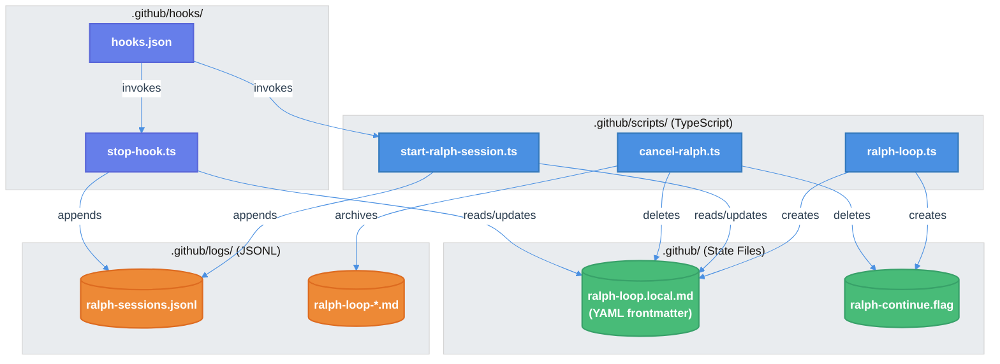

# Bun TypeScript Conversion of Shell Scripts

| Document Metadata      | Details                                      |
| ---------------------- | -------------------------------------------- |
| Author(s)              | flora131                                     |
| Status                 | Draft (WIP)                                  |
| Team / Owner           | Atomic                                       |
| Created / Last Updated | 2026-01-24                                   |

## 1. Executive Summary

This RFC proposes converting 3 bash shell scripts in `.github/scripts/` to Bun TypeScript to achieve 1:1 functional parity with improved type safety, cross-platform compatibility, and elimination of jq dependency. The conversion leverages Bun's native APIs (`Bun.$`, `Bun.file()`, `Bun.write()`, `Bun.stdin`) and follows existing TypeScript patterns established in `.claude/hooks/telemetry-stop.ts` and `.github/hooks/stop-hook.ts`. Additionally, state file format will be migrated from JSON to YAML frontmatter markdown (`.local.md`) to match conventions in `.opencode/` and `.claude/`.

## 2. Context and Motivation

### 2.1 Current State

**Architecture:** The Ralph Wiggum loop implementation uses bash shell scripts in `.github/scripts/` for session management:

| Script | Purpose | Dependencies |
|--------|---------|--------------|
| `cancel-ralph.sh` | Cancel active Ralph loop | jq, pkill |
| `setup-ralph-loop.sh` | Initialize Ralph loop state | jq |
| `start-ralph-session.sh` | Session start hook | jq |

**Reference:** [research/docs/2026-01-24-bun-shell-script-conversion.md](../research/docs/2026-01-24-bun-shell-script-conversion.md)

**Limitations:**
- **jq dependency:** All 4 scripts require jq for JSON parsing, which may not be installed on all systems
- **Platform inconsistency:** Separate `.sh` and `.ps1` files needed for Windows support
- **Type safety:** No compile-time type checking for JSON schema
- **Inconsistent naming:** Scripts use JSON state files (`.local.json`) while `.opencode/` and `.claude/` use YAML frontmatter markdown (`.local.md`)

### 2.2 The Problem

- **User Impact:** Windows users without jq installed cannot use Ralph loop functionality
- **Technical Debt:** Maintaining parallel shell/PowerShell scripts doubles maintenance burden
- **Consistency Gap:** The codebase already has TypeScript implementations for similar hooks (`.claude/hooks/telemetry-stop.ts`, `.github/hooks/stop-hook.ts`) but the setup scripts remain in bash

## 3. Goals and Non-Goals

### 3.1 Functional Goals

- [ ] Convert all 3 shell scripts to TypeScript with 1:1 functional parity
- [ ] Eliminate jq dependency by using native JSON parsing
- [ ] Migrate state file format from JSON to YAML frontmatter markdown
- [ ] Update hooks.json to reference new TypeScript scripts
- [ ] Ensure cross-platform compatibility (macOS, Linux, Windows)
- [ ] Delete obsolete shell scripts after successful conversion

### 3.2 Non-Goals (Out of Scope)

- [ ] We will NOT modify the OpenCode plugin (`ralph.ts`) - it already uses TypeScript
- [ ] We will NOT change the Ralph loop logic or completion conditions
- [ ] We will NOT create a shared utility module (inline dependencies per existing pattern)
- [ ] We will NOT compile TypeScript to standalone executables (Bun runs `.ts` directly)

## 4. Proposed Solution (High-Level Design)

### 4.1 System Architecture Diagram



### 4.2 Architectural Pattern

The conversion follows the **Inline Dependencies Pattern** established by existing TypeScript implementations in `.claude/` and `.opencode/`:

- Each script is self-contained with no external module imports beyond Node.js/Bun built-ins
- YAML frontmatter parsing uses regex (no external YAML library) — identical to `.opencode/plugin/ralph.ts:119-168`
- JSON operations use native `JSON.parse()` / `JSON.stringify()`
- State file format uses YAML frontmatter markdown (`.local.md`) — matches `.opencode/ralph-loop.local.md` convention
- Stdin parsing pattern follows `.claude/hooks/telemetry-stop.ts` and `.github/hooks/stop-hook.ts`

**Key Principle:** Implementation should be as similar as possible to existing `.claude/` and `.opencode/` patterns. When in doubt, reference these files for the canonical approach.

**Reference:** [research/docs/2026-01-24-bun-shell-script-conversion.md - Section 2](../research/docs/2026-01-24-bun-shell-script-conversion.md)

### 4.3 Key Components

| Component | Responsibility | Technology Stack | Justification |
|-----------|---------------|------------------|---------------|
| `cancel-ralph.ts` | Cancel loop, kill processes, archive state | Bun, `Bun.$`, `fs` | Replaces `cancel-ralph.sh` |
| `ralph-loop.ts` | Initialize Ralph loop state | Bun, CLI arg parsing, `fs` | Replaces `setup-ralph-loop.sh` |
| `start-ralph-session.ts` | Session start hook, increment iteration | Bun, `Bun.stdin`, `fs` | Replaces `start-ralph-session.sh` |

## 5. Detailed Design

### 5.1 File Mapping

| Original File | New File | Notes |
|---------------|----------|-------|
| `.github/scripts/cancel-ralph.sh` | `.github/scripts/cancel-ralph.ts` | Delete `.sh` after conversion |
| `.github/scripts/setup-ralph-loop.sh` | `.github/scripts/ralph-loop.ts` | Renamed for consistency; delete `.sh` |
| `.github/scripts/start-ralph-session.sh` | `.github/scripts/start-ralph-session.ts` | Delete `.sh` after conversion |
| `.github/ralph-loop.local.json` | `.github/ralph-loop.local.md` | Format migration |

**Reference:** [research/docs/2026-01-24-bun-shell-script-conversion.md - Section 3.1](../research/docs/2026-01-24-bun-shell-script-conversion.md)

### 5.2 State File Format Migration

**Current Format (JSON):**
```json
{
  "active": true,
  "iteration": 1,
  "maxIterations": 0,
  "completionPromise": null,
  "featureListPath": "research/feature-list.json",
  "prompt": "...",
  "startedAt": "2026-01-24T19:00:00Z"
}
```

**New Format (YAML frontmatter markdown):**
```yaml
---
active: true
iteration: 1
max_iterations: 0
completion_promise: null
feature_list_path: research/feature-list.json
started_at: "2026-01-24T19:00:00Z"
---

[Prompt content here]
```

**Rationale:** This matches the convention in `.opencode/ralph-loop.local.md` and `.claude/` directories. The YAML frontmatter format separates metadata from the prompt content, making the file more human-readable.

**Reference:** [research/docs/2026-01-24-bun-shell-script-conversion.md - Section 5](../research/docs/2026-01-24-bun-shell-script-conversion.md)

### 5.3 API Interfaces

#### 5.3.1 cancel-ralph.ts

**Invocation:** `bun run .github/scripts/cancel-ralph.ts`

**Behavior:**
1. Check if state file exists; if not, print "No active Ralph loop found" and attempt to kill orphaned processes
2. Read and parse state file (YAML frontmatter)
3. Archive state to `.github/logs/ralph-loop-cancelled-{timestamp}.md`
4. Delete state file and continue flag
5. Kill `copilot` and `sleep.*copilot` processes via `pkill -f`
6. Print cancellation summary

**Exit Codes:**
- `0` - Success (even if no loop was active)

#### 5.3.2 ralph-loop.ts

**Invocation:** `bun run .github/scripts/ralph-loop.ts [PROMPT...] [OPTIONS]`

**CLI Options:**
| Option | Type | Default | Description |
|--------|------|---------|-------------|
| `--max-iterations <n>` | integer | 0 (unlimited) | Maximum iterations before auto-stop |
| `--completion-promise '<text>'` | string | null | Promise phrase to detect completion |
| `--feature-list <path>` | string | `research/feature-list.json` | Path to feature list JSON |
| `-h, --help` | flag | - | Show help message |

**Behavior:**
1. Parse CLI arguments
2. Validate feature list exists (when using default prompt)
3. Create `.github/` directory if needed
4. Write state file with YAML frontmatter
5. Write continue flag with prompt content
6. Print setup summary

**Exit Codes:**
- `0` - Success
- `1` - Invalid arguments or missing feature list

#### 5.3.3 start-ralph-session.ts

**Invocation:** Called by hooks as `bun run .github/scripts/start-ralph-session.ts`

**Input (stdin):** JSON from hook system
```json
{
  "timestamp": "2026-01-24T19:00:00Z",
  "cwd": "/path/to/project",
  "source": "startup",
  "initialPrompt": "..."
}
```

**Behavior:**
1. Parse JSON input from stdin
2. Ensure `.github/logs/` directory exists
3. Append session start entry to `ralph-sessions.jsonl`
4. If Ralph loop active:
   - Print iteration status to stderr
   - If `source` is `resume` or `startup`, increment iteration and update state file

**Exit Codes:**
- `0` - Always (output ignored by hook system)

### 5.4 Conversion Patterns

The following patterns are derived from [research/docs/2026-01-24-bun-shell-script-conversion.md - Section 3](../research/docs/2026-01-24-bun-shell-script-conversion.md):

#### 5.4.1 Shell Error Handling → TypeScript

| Bash Pattern | TypeScript Equivalent |
|--------------|----------------------|
| `set -e` | try/catch blocks |
| `set -u` | TypeScript strict mode + optional chaining |
| `set -o pipefail` | async/await error propagation |
| `command \|\| true` | `.nothrow()` or empty catch |

#### 5.4.2 jq → Native JSON

| jq Command | TypeScript Equivalent |
|------------|----------------------|
| `jq -r '.field'` | `JSON.parse(input).field` |
| `jq -r '.field // empty'` | `parsed?.field \|\| ""` |
| `jq -r '.field // "default"'` | `parsed?.field ?? "default"` |
| `jq -n --arg k v '{k: $k}'` | `{ k: v }` object literal |
| `jq '. + {new: val}'` | `{ ...obj, new: val }` spread |

#### 5.4.3 File Operations

| Bash Pattern | TypeScript Equivalent |
|--------------|----------------------|
| `cat file.txt` | `await Bun.file("file.txt").text()` |
| `cat file.json \| jq .` | `await Bun.file("file.json").json()` |
| `echo "text" > file` | `await Bun.write("file", "text")` |
| `echo "text" >> file` | Read + concat + write |
| `mv temp file` | `renameSync(temp, file)` from `fs` |
| `rm -f file` | `try { unlinkSync(file) } catch {}` |
| `mkdir -p dir` | `mkdirSync(dir, { recursive: true })` |
| `[[ -f file ]]` | `existsSync(file)` |

#### 5.4.4 Process Spawning

| Bash Pattern | TypeScript Equivalent |
|--------------|----------------------|
| `pkill -f pattern` | `await Bun.$\`pkill -f pattern\`.nothrow()` |
| `cmd &>/dev/null` | `{ stdout: "ignore", stderr: "ignore" }` |

#### 5.4.5 YAML Frontmatter Parsing

**Reference:** [.opencode/plugin/ralph.ts:119-168](../.opencode/plugin/ralph.ts)

```typescript
function parseRalphState(filePath: string): RalphState | null {
  if (!existsSync(filePath)) return null;

  const content = readFileSync(filePath, "utf-8").replace(/\r\n/g, "\n");
  const match = content.match(/^---\n([\s\S]*?)\n---\n([\s\S]*)$/);
  if (!match) return null;

  const [, frontmatter, prompt] = match;

  const getValue = (key: string): string | null => {
    const m = frontmatter.match(new RegExp(`^${key}:\\s*(.*)$`, "m"));
    return m ? m[1].replace(/^["'](.*)["']$/, "$1") : null;
  };

  return {
    active: getValue("active") === "true",
    iteration: parseInt(getValue("iteration") || "1", 10),
    // ...
  };
}
```

### 5.5 hooks.json Update

**Current Configuration:**
```json
{
  "version": 1,
  "hooks": {
    "sessionStart": [
      {
        "type": "command",
        "bash": "./.github/scripts/start-ralph-session.sh",
        "powershell": "./.github/scripts/start-ralph-session.ps1",
        "cwd": ".",
        "timeoutSec": 10
      }
    ],
    "sessionEnd": [
      {
        "type": "command",
        "bash": "bun run ./.github/hooks/stop-hook.ts",
        "powershell": "bun run ./.github/hooks/stop-hook.ts",
        "cwd": ".",
        "timeoutSec": 30
      }
    ]
  }
}
```

**Updated Configuration:**
```json
{
  "version": 1,
  "hooks": {
    "sessionStart": [
      {
        "type": "command",
        "bash": "bun run ./.github/scripts/start-ralph-session.ts",
        "powershell": "bun run ./.github/scripts/start-ralph-session.ts",
        "cwd": ".",
        "timeoutSec": 10
      }
    ],
    "sessionEnd": [
      {
        "type": "command",
        "bash": "bun run ./.github/hooks/stop-hook.ts",
        "powershell": "bun run ./.github/hooks/stop-hook.ts",
        "cwd": ".",
        "timeoutSec": 30
      }
    ]
  }
}
```

**Note:** The `sessionEnd` hook already uses TypeScript. Only `sessionStart` needs to be updated.

### 5.6 Import Patterns

All scripts should use the following import pattern (established by existing TypeScript hooks):

```typescript
#!/usr/bin/env bun

// Bun-specific
import { $ } from "bun";

// Node.js fs (for sync operations)
import { existsSync, mkdirSync, unlinkSync, renameSync, readFileSync, writeFileSync } from "fs";

// Node.js path
import { dirname, join } from "path";
```

**Reference:** [.claude/hooks/telemetry-stop.ts:13-16](../.claude/hooks/telemetry-stop.ts)

### 5.7 Canonical Implementation References

When implementing each script, use these existing files as the canonical reference for patterns:

| Pattern | Reference File | Line Numbers |
|---------|---------------|--------------|
| Shebang and imports | `.claude/hooks/telemetry-stop.ts` | 1-16 |
| Stdin JSON parsing | `.github/hooks/stop-hook.ts` | 413-429 |
| YAML frontmatter parsing | `.opencode/plugin/ralph.ts` | 119-168 |
| YAML frontmatter writing | `.opencode/plugin/ralph.ts` | 170-189 |
| State file deletion | `.opencode/plugin/ralph.ts` | 191-199 |
| Feature list checking | `.opencode/plugin/ralph.ts` | 206-233 |
| Completion promise checking | `.opencode/plugin/ralph.ts` | 235-243 |
| Background process spawning | `.github/hooks/stop-hook.ts` | 552-560 |
| JSONL log appending | `.github/hooks/stop-hook.ts` | 444-446 |

**Implementation Rule:** Copy patterns directly from these reference files rather than reinventing approaches. This ensures consistency across `.claude/`, `.opencode/`, and `.github/` implementations.

## 6. Alternatives Considered

| Option | Pros | Cons | Reason for Rejection |
|--------|------|------|---------------------|
| **A: Keep Shell Scripts** | No changes needed | jq dependency, Windows issues, inconsistent with other hooks | Maintains technical debt |
| **B: Add jq as Required Dependency** | Simple fix for cross-platform | Additional install step, still no type safety | Doesn't address underlying issues |
| **C: Use Node.js Instead of Bun** | More widely installed | Slower startup, requires separate install | Codebase already uses Bun for hooks |
| **D: Bun TypeScript (Selected)** | Type safety, no jq, cross-platform, consistent with existing hooks | Bun must be installed | Best fit for existing patterns |

## 7. Cross-Cutting Concerns

### 7.1 Security and Privacy

- **No PII Handling:** Ralph loop state only contains prompt text and iteration metadata
- **Process Termination:** `pkill -f copilot` is limited to user's own processes
- **File Permissions:** State files created with default permissions (0644)

### 7.2 Observability Strategy

- **Logging:** All scripts log to `.github/logs/ralph-sessions.jsonl` in JSONL format
- **Debug Mode:** Setting `RALPH_LOG_LEVEL=DEBUG` enables verbose stderr output
- **State Archival:** Cancelled/completed loops are archived with timestamps

### 7.3 Scalability and Capacity Planning

- **Single User:** Ralph loop is designed for single-user operation
- **Storage:** Log files grow linearly with session count (~1KB per session)
- **No Bottlenecks:** Scripts are invoked individually, no concurrent access concerns

## 8. Migration, Rollout, and Testing

### 8.1 Deployment Strategy

- [ ] **Phase 1:** Create TypeScript scripts alongside existing shell scripts
- [ ] **Phase 2:** Update hooks.json to use TypeScript scripts
- [ ] **Phase 3:** Test full Ralph loop workflow (setup → iterations → cancel)
- [ ] **Phase 4:** Delete obsolete shell scripts and old JSON state files

### 8.2 Test Plan

#### Unit Tests

- [ ] YAML frontmatter parsing with various edge cases
- [ ] CLI argument parsing for ralph-loop.ts
- [ ] JSON input parsing for hook scripts
- [ ] State file read/write operations

#### Integration Tests

- [ ] Full Ralph loop lifecycle: setup → start → prompt → end → cancel
- [ ] Cross-platform execution (macOS, Linux, Windows)
- [ ] Hooks.json integration with Copilot CLI

#### End-to-End Tests

- [ ] Start Ralph loop with `bun run .github/scripts/ralph-loop.ts`
- [ ] Verify state file creation in `.github/ralph-loop.local.md`
- [ ] Run mock session with hook triggers
- [ ] Cancel with `bun run .github/scripts/cancel-ralph.ts`
- [ ] Verify cleanup and archival

### 8.3 Files to Delete After Successful Migration

**Shell Scripts:**
```
.github/scripts/cancel-ralph.sh
.github/scripts/log-ralph-prompt.sh
.github/scripts/setup-ralph-loop.sh
.github/scripts/start-ralph-session.sh
```

**Old State Files (if present):**
```
.github/ralph-loop.local.json
```

**Note:** No backwards compatibility with old JSON state files. Users must cancel any active Ralph loop before migration and start fresh with the new `.local.md` format.

## 9. Open Questions / Unresolved Issues

- [ ] **stop-hook.ts Update:** The existing `.github/hooks/stop-hook.ts` reads `.github/ralph-loop.local.json`. Should it be updated as part of this conversion?
  - **Recommendation:** Yes, update to read `.local.md` format for consistency

## 10. Implementation Checklist

### 10.1 Script Conversion

| Task | File | Priority |
|------|------|----------|
| Create `ralph-loop.ts` | `.github/scripts/ralph-loop.ts` | P0 |
| Create `start-ralph-session.ts` | `.github/scripts/start-ralph-session.ts` | P0 |
| Create `cancel-ralph.ts` | `.github/scripts/cancel-ralph.ts` | P0 |

### 10.2 Configuration Updates

| Task | File | Priority |
|------|------|----------|
| Update sessionStart hook | `.github/hooks/hooks.json` | P0 |
| Update stop-hook.ts for new state format | `.github/hooks/stop-hook.ts` | P0 |

### 10.3 Cleanup

| Task | File | Priority |
|------|------|----------|
| Delete shell scripts | `.github/scripts/*.sh` | P2 |
| Update documentation | `README.md` / `docs/` | P2 |

## 11. References

- [Research: Bun TypeScript Conversion](../research/docs/2026-01-24-bun-shell-script-conversion.md)
- [GitHub Copilot Hooks - About](https://docs.github.com/en/copilot/concepts/agents/coding-agent/about-hooks)
- [GitHub Copilot Hooks - Usage Guide](https://docs.github.com/en/copilot/how-tos/use-copilot-agents/coding-agent/use-hooks)
- [Bun Shell Documentation](https://bun.sh/docs/runtime/shell)
- [Bun File I/O Documentation](https://bun.sh/docs/runtime/file-io)
- [Existing TypeScript Hook: telemetry-stop.ts](../.claude/hooks/telemetry-stop.ts)
- [Existing TypeScript Hook: stop-hook.ts](../.github/hooks/stop-hook.ts)
- [OpenCode Ralph Plugin](../.opencode/plugin/ralph.ts)
