# Bun Test Failures Remediation

| Document Metadata      | Details                 |
| ---------------------- | ----------------------- |
| Author(s)              | Developer               |
| Status                 | Draft (WIP)             |
| Team / Owner           | Atomic CLI              |
| Created / Last Updated | 2026-02-12 / 2026-02-12 |

## 1. Executive Summary

104 of 3,268 tests (3.2%) are failing across 6 distinct error categories. In every case, source code was updated but corresponding tests were not synchronized. This spec proposes updating all 104 failing test expectations to match current source behavior across agent definitions, theme colors, tool renderer icons, Claude SDK session lifecycle, and misc UI utilities. No source code changes are required — all fixes are test-only updates. The fix restores a green test suite, unblocking CI and future development.

> **Research basis:** [`research/docs/2026-02-12-bun-test-failures-root-cause-analysis.md`](../research/docs/2026-02-12-bun-test-failures-root-cause-analysis.md)

## 2. Context and Motivation

### 2.1 Current State

- **Test suite:** 3,268 tests across 98 files, run via `bun test`
- **Pass rate:** 3,147 passing (96.3%), 104 failing (3.2%), runtime ~414s
- **Root cause:** Multiple source refactors shipped without test updates:
  - Theme palette migrated from Tailwind CSS → Catppuccin ([`src/ui/theme.tsx`](../src/ui/theme.tsx))
  - Tool renderer icons changed from emoji → Unicode symbols ([`src/ui/tools/registry.ts`](../src/ui/tools/registry.ts))
  - Claude SDK `createSession()` refactored to defer `query()` to `send()`/`stream()` ([`src/sdk/claude-client.ts`](../src/sdk/claude-client.ts))
  - Agent commands moved from `sendMessage()` to `spawnSubagent()` ([`src/ui/commands/agent-commands.ts`](../src/ui/commands/agent-commands.ts))
  - Builtin agent definitions omit `model` field despite tests expecting `"opus"` ([`src/ui/commands/agent-commands.ts`](../src/ui/commands/agent-commands.ts))
  - Command registry evolved, removing/renaming commands not reflected in tests

> **Related research:**
> - [`research/docs/2026-02-04-agent-subcommand-parity-audit.md`](../research/docs/2026-02-04-agent-subcommand-parity-audit.md) — Confirms agent model formats vary by SDK; model field is optional
> - [`research/docs/2026-02-03-command-migration-notes.md`](../research/docs/2026-02-03-command-migration-notes.md) — Documents command system migration (hooks → SDK-native)
> - [`research/docs/2026-01-31-claude-agent-sdk-research.md`](../research/docs/2026-01-31-claude-agent-sdk-research.md) — V2 SDK session pattern: separate `send()`/`stream()` instead of query-on-create
> - [`research/docs/2026-02-01-chat-tui-parity-implementation.md`](../research/docs/2026-02-01-chat-tui-parity-implementation.md) — Documents tool renderer and theme changes

### 2.2 The Problem

- **Developer Impact:** Red CI blocks PRs and erodes confidence in the test suite.
- **Technical Debt:** Stale tests mask real regressions — developers cannot distinguish new failures from known ones.
- **Velocity Impact:** Every PR requires manually triaging known-failing tests.

## 3. Goals and Non-Goals

### 3.1 Functional Goals

- [ ] All 104 failing tests pass with updated expectations matching current source behavior
- [ ] Zero test regressions — all 3,147 currently passing tests continue to pass
- [ ] Test expectations accurately reflect the intended behavior of each component

### 3.2 Non-Goals (Out of Scope)

- [ ] We will NOT refactor source code to match old test expectations (tests follow source, not vice versa)
- [ ] We will NOT add new tests — only fix existing failing ones
- [ ] We will NOT change the Catppuccin theme, Unicode icons, or SDK session lifecycle
- [ ] We will NOT resolve the open design questions (e.g., whether agents should have explicit `model` fields) — we align tests to current behavior

## 4. Proposed Solution (High-Level Design)

### 4.1 Fix Strategy Overview

All 104 failures are **test expectation mismatches** — the source is correct and intentional. The fix is updating test assertions to match current source behavior. No source code changes are needed.

```mermaid
%%{init: {'theme':'base', 'themeVariables': { 'primaryColor':'#f8f9fa','primaryTextColor':'#2c3e50','primaryBorderColor':'#4a5568','lineColor':'#4a90e2','secondaryColor':'#ffffff','tertiaryColor':'#e9ecef'}}}%%

flowchart LR
    subgraph Categories["6 Error Categories → 104 Tests"]
        direction TB
        C1["Cat 1: Agent model field\n~30 tests"]
        C2["Cat 2: sentMessages empty\n~20 tests"]
        C3["Cat 3: Theme colors\n~12 tests"]
        C4["Cat 4: Tool icons\n~8 tests"]
        C5["Cat 5: Claude SDK HITL\n~6 tests"]
        C6["Cat 6: Misc UI\n~8 tests"]
    end

    subgraph Fix["Fix Type: Test-Only Updates"]
        F1["Update model expectations\nto undefined or remove checks"]
        F2["Assert spawnSubagent called\ninstead of sentMessages"]
        F3["Update color hex values\nto Catppuccin palette"]
        F4["Update icon expectations\nto Unicode symbols"]
        F5["Call send()/stream() after\ncreateSession() in tests"]
        F6["Fix truncate, duration,\ncommand registry assertions"]
    end

    C1 --> F1
    C2 --> F2
    C3 --> F3
    C4 --> F4
    C5 --> F5
    C6 --> F6

    style Categories fill:#ffffff,stroke:#cbd5e0,stroke-width:2px
    style Fix fill:#ffffff,stroke:#cbd5e0,stroke-width:2px
```



### 4.2 Architectural Pattern

**Test Synchronization** — a one-time bulk update of stale test expectations to align with evolved source code, with no changes to production code.

### 4.3 Key Components

| Component                              | # Failing Tests | Fix Type                                                   | Risk   |
| -------------------------------------- | --------------- | ---------------------------------------------------------- | ------ |
| Agent model field                      | ~30             | Remove `model === "opus"` assertions or assert `undefined` | Low    |
| Sub-agent sentMessages                 | ~20             | Track `spawnSubagent` calls instead of `sentMessages`      | Medium |
| Theme colors                           | ~12             | Update hex values to Catppuccin palette                    | Low    |
| Tool renderer icons                    | ~8              | Update emoji → Unicode symbol expectations                 | Low    |
| Claude SDK / HITL                      | ~6              | Restructure test flow: `createSession()` → `send()`        | Medium |
| Misc UI (truncate, duration, commands) | ~8              | Various assertion fixes                                    | Low    |

## 5. Detailed Design

### 5.1 Category 1: Builtin Agent `model` Field Missing (~30 tests)

**Affected files:**
- `tests/e2e/subagent-debugger.test.ts` — 14 tests
- `tests/e2e/subagent-codebase-analyzer.test.ts` — 6 tests
- `tests/ui/commands/agent-commands.test.ts` — ~10 tests

**Source reference:** [`src/ui/commands/agent-commands.ts`](../src/ui/commands/agent-commands.ts) lines 175-225 (`AgentDefinition` interface), lines 1085-1150 (`BUILTIN_AGENTS` array — no `model` property set)

**Fix:** Remove or update all assertions that check `agent.model === "opus"`. Since the `AgentDefinition` interface defines `model` as optional (`model?: AgentModel`) and no builtin agent currently sets it, tests should either:
- Assert `agent.model === undefined`, OR
- Remove the model assertion entirely and only verify agent `name`, `systemPrompt`, and `tools`

**Example change:**
```typescript
// BEFORE (failing)
expect(agent.model).toBe("opus");

// AFTER (option A: assert undefined)
expect(agent.model).toBeUndefined();

// AFTER (option B: remove assertion)
// [delete the line]
```

> **Research context:** The [agent subcommand parity audit](../research/docs/2026-02-04-agent-subcommand-parity-audit.md) confirms model formats vary by SDK (Claude uses aliases like `"opus"`, OpenCode uses `"anthropic/claude-sonnet-4-..."`, Copilot uses `"gpt-5"`). Making model a required field on `AgentDefinition` would require knowing the active SDK at definition time, which is not feasible for builtin agents.

---

### 5.2 Category 2: Sub-agent `sentMessages` Empty (~20 tests)

**Affected files:**
- `tests/e2e/subagent-debugger.test.ts` — tests asserting `context.sentMessages.length > 0`
- `tests/e2e/subagent-codebase-analyzer.test.ts` — same pattern

**Source reference:** [`src/ui/commands/agent-commands.ts`](../src/ui/commands/agent-commands.ts) lines 1495-1532 — `createAgentCommand()` calls `void context.spawnSubagent({...})` (fire-and-forget) and returns `{ success: true }` immediately. It never calls `context.sendMessage()`.

**Fix:** Update mock contexts to track `spawnSubagent` calls. Replace `sentMessages` assertions with `spawnedSubagents` assertions.

**Example change:**
```typescript
// BEFORE (mock context)
const context = {
  sentMessages: [] as string[],
  sendMessage: (msg: string) => { context.sentMessages.push(msg); },
  spawnSubagent: async (opts: any) => ({ success: true }),
};

// AFTER (mock context with spawnSubagent tracking)
const context = {
  sentMessages: [] as string[],
  spawnedSubagents: [] as any[],
  sendMessage: (msg: string) => { context.sentMessages.push(msg); },
  spawnSubagent: async (opts: any) => {
    context.spawnedSubagents.push(opts);
    return { success: true };
  },
};

// BEFORE (assertion)
expect(context.sentMessages.length).toBeGreaterThan(0);
expect(context.sentMessages[0]).toContain("debugging");

// AFTER (assertion)
// Allow async spawnSubagent to resolve
await new Promise(resolve => setTimeout(resolve, 10));
expect(context.spawnedSubagents.length).toBeGreaterThan(0);
expect(context.spawnedSubagents[0].systemPrompt).toContain("debug");
```

**Note:** Since `spawnSubagent` is fire-and-forget (`void` keyword), tests may need a small `setTimeout` or `await Bun.sleep(0)` to allow the promise to resolve before checking the tracking array.

---

### 5.3 Category 3: Theme Color Mismatches (~12 tests)

**Affected files:**
- `tests/ui/theme.test.ts` — lines 59-155 (dark/light theme color assertions, `getMessageColor`)
- `tests/ui/components/tool-result.test.tsx` — lines 61-67 (error color assertions)

**Source reference:** [`src/ui/theme.tsx`](../src/ui/theme.tsx) lines 219-271 — theme definitions use Catppuccin palette

**Fix:** Update all hardcoded color hex values in test expectations to match the Catppuccin palette values from source.

**Complete color mapping (Dark Theme — Catppuccin Mocha):**

| Property           | Old (Tailwind) | New (Catppuccin Mocha) |
| ------------------ | -------------- | ---------------------- |
| `background`       | `black`        | `#1e1e2e`              |
| `foreground`       | `#ecf2f8`      | `#cdd6f4`              |
| `error`            | `#fb7185`      | `#f38ba8`              |
| `success`          | `#4ade80`      | `#a6e3a1`              |
| `warning`          | `#fbbf24`      | `#f9e2af`              |
| `userMessage`      | `#60a5fa`      | `#89b4fa`              |
| `assistantMessage` | `#2dd4bf`      | `#94e2d5`              |
| `systemMessage`    | `#a78bfa`      | `#cba6f7`              |
| `userBubbleBg`     | `#3f3f46`      | `#313244`              |

**Complete color mapping (Light Theme — Catppuccin Latte):**

| Property           | Old (Tailwind) | New (Catppuccin Latte) |
| ------------------ | -------------- | ---------------------- |
| `background`       | `white`        | `#eff1f5`              |
| `foreground`       | `#0f172a`      | `#4c4f69`              |
| `error`            | `#e11d48`      | `#d20f39`              |
| `success`          | `#16a34a`      | `#40a02b`              |
| `warning`          | `#d97706`      | `#df8e1d`              |
| `userMessage`      | `#2563eb`      | `#1e66f5`              |
| `assistantMessage` | `#0d9488`      | `#179299`              |
| `systemMessage`    | `#7c3aed`      | `#8839ef`              |
| `userBubbleBg`     | `#e2e8f0`      | `#e6e9ef`              |

---

### 5.4 Category 4: Tool Renderer Icon Mismatches (~8 tests)

**Affected files:**
- `tests/ui/tools/registry.test.ts` — lines 34, 134, 187, 249, 291, 331
- `tests/ui/components/tool-result.test.tsx` — lines 306, 314, 322, 330, 338, 346

**Source reference:** [`src/ui/tools/registry.ts`](../src/ui/tools/registry.ts) lines 64-465

**Fix:** Update icon expectations from emoji to Unicode symbols:

| Tool    | Old (Emoji) | New (Unicode) | Source Line |
| ------- | ----------- | ------------- | ----------- |
| Read    | `📄`         | `≡`           | line 64     |
| Bash    | `💻`         | `$`           | line 187    |
| Write   | `📝`         | `►`           | line 258    |
| Glob    | `🔍`         | `◆`           | line 314    |
| Grep    | `🔎`         | `★`           | line 402    |
| Default | `🔧`         | `▶`           | line 465    |

**Note:** Edit (`△`) already matches — no change needed.

---

### 5.5 Category 5: Claude SDK / HITL Integration (~6 tests)

**Affected files:**
- `tests/sdk/claude-client.test.ts` — 3 tests expecting `mockQuery.toHaveBeenCalled()` after `createSession()`
- `tests/sdk/ask-user-question-hitl.test.ts` — 3 tests expecting `canUseToolCallback` not null after `createSession()`

**Source reference:** [`src/sdk/claude-client.ts`](../src/sdk/claude-client.ts) lines 752-768 — `createSession()` no longer calls `query()`. Comment in source: _"Don't create an initial query here — send()/stream() each create their own query with the actual user message. Previously an empty-prompt query was spawned here, which leaked a Claude Code subprocess that was never consumed."_

**Fix for `claude-client.test.ts`:**

Tests must call `session.send()` or `session.stream()` after `createSession()` to trigger `query()`. Update the test flow:

```typescript
// BEFORE
const session = await client.createSession(config);
expect(mockQuery).toHaveBeenCalled(); // FAILS — query() not called yet

// AFTER
const session = await client.createSession(config);
expect(mockQuery).not.toHaveBeenCalled(); // Verify no premature query
await session.send("test message");
expect(mockQuery).toHaveBeenCalled(); // Now query() is triggered
```

**Fix for `ask-user-question-hitl.test.ts`:**

The `canUseTool` callback is only created inside `buildSdkOptions()` when `query()` is called. Tests must trigger a `send()`/`stream()` to capture it:

```typescript
// BEFORE
const session = await client.createSession(config);
// canUseToolCallback is null — query() never ran

// AFTER
const session = await client.createSession(config);
await session.send("test"); // Triggers query() → buildSdkOptions() → canUseTool attached
// canUseToolCallback is now set, proceed with HITL assertions
```

> **Research context:** The [Claude Agent SDK research](../research/docs/2026-01-31-claude-agent-sdk-research.md) documents the V2 SDK pattern: `createSession()` returns a session object, and `send()`/`stream()` handle query lifecycle independently.

---

### 5.6 Category 6: Misc UI Test Failures (~8 tests)

#### 5.6a `truncateText()` — 2 tests

**Affected file:** `src/ui/__tests__/task-list-indicator.test.ts` lines 89-101

**Source:** [`src/ui/utils/format.ts`](../src/ui/utils/format.ts) lines 144-147 — uses `"..."` (three dots), not `"…"` (single ellipsis)

**Fix:** Update test expectations to match `"..."` behavior:
```typescript
// BEFORE
expect(truncate("Hello, World!", 5)).toBe("Hell…");
expect(truncate("ab", 1)).toBe("…");

// AFTER
expect(truncate("Hello, World!", 5)).toBe("He...");
expect(truncate("ab", 1)).toBe("...");  // Note: edge case with negative slice
```

**Alternative (preferred):** Fix the source `truncateText()` to use `"…"` and handle edge cases properly, then keep existing test expectations. This is a judgment call — see Open Questions.

#### 5.6b `formatDuration()` — 2 tests

**Affected file:** `tests/ui/components/timestamp-display.test.tsx` lines 74-87

**Source:** [`src/ui/utils/format.ts`](../src/ui/utils/format.ts) line ~68 — uses `Math.floor()`, so 1500ms → `"1s"`, not `"1.5s"`

**Fix:** Update test expectations:
```typescript
// BEFORE
expect(buildDisplayParts(ts, 1500).text).toBe("1.5s");

// AFTER
expect(buildDisplayParts(ts, 1500).text).toBe("1s");
```

#### 5.6c Command Registration — 2 tests

**Affected file:** `tests/ui/commands/index.test.ts` line 79

**Source:** [`src/ui/commands/builtin-commands.ts`](../src/ui/commands/builtin-commands.ts) lines 551-560 — registered commands: `help`, `theme`, `clear`, `compact`, `exit`, `model`, `mcp`, `context`. No `commit`/`ci` command exists.

**Fix:** Remove assertions for non-existent commands:
```typescript
// BEFORE
expect(globalRegistry.has("ci")).toBe(true);
expect(globalRegistry.has("commit")).toBe(true);

// AFTER — remove these lines or replace with actually registered commands
expect(globalRegistry.has("help")).toBe(true);
expect(globalRegistry.has("theme")).toBe(true);
```

#### 5.6d `globalRegistry` Population — 1 test

**Affected file:** `tests/ui/index.test.ts` line 596

**Fix:** Align expected command list with actually registered commands from `builtin-commands.ts`.

## 6. Alternatives Considered

| Option                                             | Pros                                             | Cons                                                                                        | Decision                                                             |
| -------------------------------------------------- | ------------------------------------------------ | ------------------------------------------------------------------------------------------- | -------------------------------------------------------------------- |
| **A: Update tests to match source (Selected)**     | No production changes, minimal risk, fastest fix | Tests may hide unintended behavior changes                                                  | **Selected** — research confirms all source changes were intentional |
| **B: Revert source to match tests**                | Tests pass immediately                           | Undoes intentional refactors (Catppuccin theme, subprocess leak fix, spawnSubagent pattern) | Rejected — reverting would reintroduce bugs                          |
| **C: Skip/disable failing tests**                  | Instant "green" CI                               | Hides real issues, accrues more debt                                                        | Rejected — defeats the purpose of testing                            |
| **D: Hybrid (fix some source, update some tests)** | Addresses truncate/duration edge cases in source | Mixed approach adds complexity                                                              | Partially viable — see Open Questions for `truncateText()`           |

## 7. Cross-Cutting Concerns

### 7.1 Testing Strategy

- **Validation:** After all changes, run `bun test` and verify 3,268/3,268 tests pass (0 failures)
- **Regression guard:** No changes to source files — only test file modifications
- **CI:** Once merged, CI pipeline should show green on the test step

### 7.2 Risk Assessment

| Risk                                                        | Likelihood | Impact | Mitigation                                                                     |
| ----------------------------------------------------------- | ---------- | ------ | ------------------------------------------------------------------------------ |
| Incorrect test expectation update introduces false pass     | Low        | Medium | Cross-reference every change with source code at cited line numbers            |
| `spawnSubagent` timing issues in tests                      | Medium     | Low    | Use `await Bun.sleep(0)` or microtask flush to handle fire-and-forget promises |
| Source code changes between spec writing and implementation | Low        | Low    | Re-verify line numbers against `HEAD` before implementing                      |

## 8. Migration, Rollout, and Testing

### 8.1 Deployment Strategy

- [ ] Phase 1: Fix Category 3 (theme colors) and Category 4 (tool icons) — lowest risk, simple find-replace
- [ ] Phase 2: Fix Category 1 (agent model field) — straightforward assertion removal
- [ ] Phase 3: Fix Category 6 (misc UI) — small isolated fixes
- [ ] Phase 4: Fix Category 2 (sentMessages → spawnSubagent tracking) — requires mock restructuring
- [ ] Phase 5: Fix Category 5 (Claude SDK / HITL) — requires test flow restructuring
- [ ] Phase 6: Final `bun test` validation — all 3,268 tests green

### 8.2 Test Plan

- **Pre-implementation:** Run `bun test` to confirm exactly 104 failures (baseline)
- **Per-category:** Run affected test files after each category fix to confirm incremental progress
- **Post-implementation:** Full `bun test` — expect 3,268 pass, 0 fail
- **Spot checks:**
  - `bun test tests/ui/theme.test.ts` — verify all color assertions
  - `bun test tests/e2e/subagent-debugger.test.ts` — verify spawnSubagent tracking
  - `bun test tests/sdk/claude-client.test.ts` — verify session lifecycle

### 8.3 Affected Test Files (Complete List)

| File                                             | Category | Est. Changes     |
| ------------------------------------------------ | -------- | ---------------- |
| `tests/e2e/subagent-debugger.test.ts`            | 1, 2     | ~20 assertions   |
| `tests/e2e/subagent-codebase-analyzer.test.ts`   | 1, 2     | ~15 assertions   |
| `tests/ui/commands/agent-commands.test.ts`       | 1        | ~10 assertions   |
| `tests/ui/theme.test.ts`                         | 3        | ~18 color values |
| `tests/ui/components/tool-result.test.tsx`       | 3, 4     | ~10 assertions   |
| `tests/ui/tools/registry.test.ts`                | 4        | ~6 icon values   |
| `tests/sdk/claude-client.test.ts`                | 5        | ~3 test flows    |
| `tests/sdk/ask-user-question-hitl.test.ts`       | 5        | ~3 test flows    |
| `src/ui/__tests__/task-list-indicator.test.ts`   | 6a       | ~2 assertions    |
| `tests/ui/components/timestamp-display.test.tsx` | 6b       | ~2 assertions    |
| `tests/ui/commands/index.test.ts`                | 6c       | ~2 assertions    |
| `tests/ui/index.test.ts`                         | 6d       | ~1 assertion     |

## 9. Open Questions / Unresolved Issues

- [ ] **`truncateText()` behavior:** Should the source function be updated to use `"…"` (single ellipsis) and handle edge cases (e.g., `maxLength < 3`), or should tests accept `"..."` (three dots)? The single-ellipsis approach is more terminal-friendly. *Recommendation:* Fix the source to use `"…"` since it's a 3-line change that improves UX.
- [ ] **`formatDuration()` precision:** Should sub-second durations display decimal values (e.g., `"1.5s"`)? Floor-based `"1s"` is simpler but less informative. *Recommendation:* Keep `Math.floor()` — integer seconds are standard for duration display.
- [ ] **Agent `model` field intent:** Should builtin agents eventually declare their preferred model, or is dynamic model selection the long-term design? This affects whether we assert `undefined` or remove model tests entirely. Per [agent subcommand parity audit](../research/docs/2026-02-04-agent-subcommand-parity-audit.md), model formats are SDK-dependent, suggesting dynamic selection is correct.
- [ ] **"commit" / "ci" command:** Was this command intentionally removed, or is it planned? Per [command migration notes](../research/docs/2026-02-03-command-migration-notes.md), several commands were removed during the migration. The test should be removed unless the command is planned.
