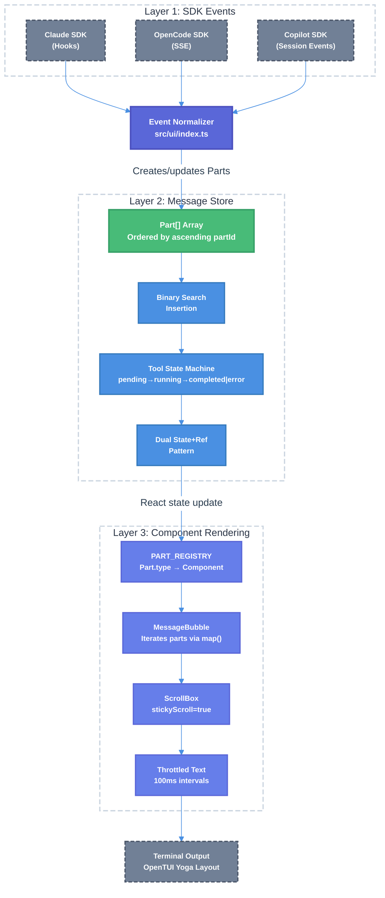

# Chat System Parts-Based Rendering Technical Design Document

| Document Metadata      | Details                          |
| ---------------------- | -------------------------------- |
| Author(s)              | Developer                        |
| Status                 | Draft (WIP)                      |
| Team / Owner           | Atomic CLI                       |
| Created / Last Updated | 2026-02-16                       |

## 1. Executive Summary

This RFC proposes replacing Atomic's offset-based content segment model (`buildContentSegments()`) with a parts-based message rendering architecture inspired by OpenCode's proven implementation. The current system captures character offsets at tool start time and uses fragile arithmetic to splice tool calls, sub-agent trees, and HITL dialogs into the message stream — causing three critical bugs: (1) sub-agent tree states prematurely marked "completed" due to 4+ unguarded finalization paths, (2) HITL prompts rendered as fixed-position overlays instead of at their chronological position, and (3) text arriving after tool calls appearing in incorrect stream order. The proposed solution introduces a `Part[]` array within each `ChatMessage`, where each part receives a monotonically increasing timestamp-encoded ID that guarantees `lexicographic sort = chronological order`. This eliminates offset arithmetic entirely, places HITL inline as tool overlays, and introduces a `shouldFinalizeOnToolComplete()` guard for correct background agent lifecycle. The migration follows a 5-phase incremental plan with feature flags for safe rollout.

**Research References:**
- [`research/docs/2026-02-16-chat-system-design-ui-research.md`](../research/docs/2026-02-16-chat-system-design-ui-research.md) — Main synthesis with consolidated findings
- [`research/docs/2026-02-16-chat-system-design-reference.md`](../research/docs/2026-02-16-chat-system-design-reference.md) — Frontend design reference with full type definitions
- [`research/docs/2026-02-16-opencode-tui-chat-architecture.md`](../research/docs/2026-02-16-opencode-tui-chat-architecture.md) — OpenCode TUI architecture deep-dive
- [`research/docs/2026-02-16-opentui-rendering-architecture.md`](../research/docs/2026-02-16-opentui-rendering-architecture.md) — OpenTUI rendering primitives
- [`research/docs/2026-02-16-atomic-chat-architecture-current.md`](../research/docs/2026-02-16-atomic-chat-architecture-current.md) — Current Atomic chat.tsx analysis
- [`research/docs/2026-02-16-opencode-deepwiki-research.md`](../research/docs/2026-02-16-opencode-deepwiki-research.md) — DeepWiki research on OpenCode
- [`research/docs/2026-02-16-opentui-deepwiki-research.md`](../research/docs/2026-02-16-opentui-deepwiki-research.md) — DeepWiki research on OpenTUI

## 2. Context and Motivation

### 2.1 Current State

**Architecture:** Atomic's TUI (`src/ui/chat.tsx`) renders chat messages by building "content segments" from raw text, tool calls, sub-agents, and task items. The core function `buildContentSegments()` ([`src/ui/chat.tsx:1287-1483`](../src/ui/chat.tsx)) captures character offsets at tool-start time and uses three-tier sorting (offset → priority → sequence) to splice non-text elements into the message stream.

**Current component tree** (from [current architecture research](../research/docs/2026-02-16-atomic-chat-architecture-current.md)):
```
ChatApp
├── AtomicHeader
├── scrollbox (stickyScroll=true, stickyStart="bottom")
│   ├── CompactionSummary (optional)
│   ├── MessageBubble[] (iterates buildContentSegments())
│   │   ├── text segments (with bullet prefix ● logic)
│   │   ├── tool segments → <ToolResult>
│   │   ├── hitl segments → <CompletedQuestionDisplay>
│   │   ├── agents segments → <ParallelAgentsTree>
│   │   └── tasks segments → inline task list
│   ├── UserQuestionDialog (FIXED-POSITION overlay)
│   ├── QueueIndicator
│   ├── InputArea (textarea + scrollbar)
│   └── Autocomplete
└── TaskListPanel (OUTSIDE scrollbox, for Ralph workflows)
```

**Segment types** (5 total): `text`, `tool`, `hitl`, `agents`, `tasks`

**Key state management patterns preserved from the current system** (from [current architecture research §7](../research/docs/2026-02-16-atomic-chat-architecture-current.md)):
- **Dual state+ref pattern**: Critical streaming state stored in both React state (renders) and refs (synchronous callbacks) to avoid stale closures
- **Generation guard**: `streamGenerationRef` incremented per stream; every callback checks `generation !== streamGenerationRef.current`
- **Deferred completion**: `pendingCompleteRef` stores `handleComplete` when sub-agents/tools still running; effect triggers when safe
- **Message windowing**: `MAX_VISIBLE_MESSAGES = 50` with epoch-based scrollbox remount

**Limitations** (from [main synthesis §3](../research/docs/2026-02-16-chat-system-design-ui-research.md)):
- Offset capture is inherently racy — `contentOffsetAtStart = msg.content.length` can be stale if content updates between tool start and capture
- Three-tier sorting (offset → priority → sequence) is fragile; same-offset-same-priority segments have undefined order
- Paragraph splitting at `\n\n` boundaries uses heuristics that fail in code blocks
- Meta-components (agents tree, HITL dialog, task list) live in separate rendering channels from text segments

### 2.2 The Problem

Three specific bugs stem from the offset-based architecture:

**Bug 1 — Sub-Agent Tree Premature Completion** (from [main synthesis §4](../research/docs/2026-02-16-chat-system-design-ui-research.md)):

Multiple finalization paths unconditionally mark agents "completed" while background tasks may still run:

| Finalization Site | Location | Current Behavior |
|---|---|---|
| `tool.complete` handler | [`src/ui/index.ts:649-664`](../src/ui/index.ts) | Unconditionally sets running/pending → completed |
| Stream finalization effect | [`src/ui/chat.tsx:2672-2680`](../src/ui/chat.tsx) | Maps **all** running → completed |
| Normal completion path | [`src/ui/chat.tsx:3335-3341`](../src/ui/chat.tsx) | Same finalization |
| Alternate completion path | [`src/ui/chat.tsx:4774-4780`](../src/ui/chat.tsx) | Same finalization |

Additionally, `background` status exists in `AgentStatus` type ([`src/ui/components/parallel-agents-tree.tsx:26`](../src/ui/components/parallel-agents-tree.tsx)) and in rendering logic, but **no runtime code ever sets `status: 'background'`**.

**Bug 2 — HITL Placement** (from [main synthesis §4](../research/docs/2026-02-16-chat-system-design-ui-research.md)):

The `UserQuestionDialog` is rendered as a **fixed-position overlay** inside the ScrollBox ([`src/ui/chat.tsx:5358-5364`](../src/ui/chat.tsx)), not at the chronological position where the question was asked. If text streams after the question, the dialog stays at the bottom rather than appearing inline with the tool that triggered it.

**Bug 3 — Stream Ordering** (from [main synthesis §4](../research/docs/2026-02-16-chat-system-design-ui-research.md)):

Text segments and meta-components live in **separate rendering channels**. Meta-components are always rendered after all segments, regardless of their chronological position. The `buildContentSegments()` function ([`src/ui/chat.tsx:1287-1483`](../src/ui/chat.tsx)) relies on character offset arithmetic that breaks when:
- Content updates race with offset capture
- Multiple tools start at the same content length
- Text arrives after tool completion but before agent completion

## 3. Goals and Non-Goals

### 3.1 Functional Goals

- [ ] Replace `buildContentSegments()` offset model with `Part[]` array ordered by timestamp-encoded IDs
- [ ] All content types (text, tool, reasoning, agents, tasks, HITL, MCP snapshot, context info, compaction) become `Part` objects in a single sorted array
- [ ] HITL prompts render inline after their `ToolPart` (not as fixed-position overlays)
- [ ] Background agents receive `"background"` status at creation and are excluded from premature finalization via `shouldFinalizeOnToolComplete()` guard
- [ ] Text naturally splits at tool boundaries — new `TextPart` created after each tool completes
- [ ] Binary search insertion maintains `Part[]` sort order incrementally (no full re-sort)
- [ ] Throttled text rendering at 100ms intervals to prevent UI thrashing during rapid deltas
- [ ] Preserve ScrollBox sticky scroll behavior (`stickyScroll=true, stickyStart="bottom"`)
- [ ] Preserve dual state+ref pattern for stale closure protection
- [ ] Preserve generation guard pattern for cross-stream state corruption prevention
- [ ] Preserve message window eviction (50 messages) with epoch-based remount
- [ ] Feature-flagged rollout: `usePartsRendering` toggle between old and new rendering

### 3.2 Non-Goals (Out of Scope)

- [ ] We will NOT migrate from React to SolidJS (OpenCode uses SolidJS; Atomic uses React via OpenTUI reconciler)
- [ ] We will NOT persist parts to a database (OpenCode uses SQLite; Atomic uses in-memory state)
- [ ] We will NOT implement SSE transport (OpenCode uses server-sent events; Atomic uses direct SDK callbacks)
- [ ] We will NOT change the Ralph TaskListPanel pinned behavior (it remains outside the scrollbox intentionally)
- [ ] We will NOT enable viewport culling (currently `false` for text selection support)
- [ ] We will NOT modify the input area, autocomplete, or header components

## 4. Proposed Solution (High-Level Design)

### 4.1 System Architecture Diagram

The parts-based architecture introduces a three-layer pipeline replacing the current `buildContentSegments()` approach (from [design reference §2](../research/docs/2026-02-16-chat-system-design-reference.md)):



**End-to-end data flow:**
```
SDK Native Event
  → src/ui/index.ts normalizes fields (tool_name→toolName, etc.)
  → Creates/updates Part in ChatMessage.parts[]
  → Binary search insertion by partId (O(log n))
  → React state update triggers re-render
  → MessageBubble iterates parts via map()
  → PART_REGISTRY[part.type] → Component
  → OpenTUI Yoga layout → terminal output
```

### 4.2 Architectural Pattern

We adopt a **Part Registry + Discriminated Union** pattern where:
- Each `ChatMessage` contains an ordered `Part[]` array instead of raw `content: string` + separate `toolCalls[]` / `parallelAgents[]` arrays
- Part IDs encode creation timestamps for automatic chronological ordering (inspired by [OpenCode's `Identifier.ascending()` at `id.ts:55-74`](../research/docs/2026-02-16-opencode-tui-chat-architecture.md))
- A `PART_REGISTRY` maps `part.type` strings to renderer components (inspired by [OpenCode's `PART_MAPPING` at `message-part.tsx:484-497`](../research/docs/2026-02-16-opencode-tui-chat-architecture.md))
- HITL prompts are overlays on `ToolPart` (linked via `toolCallId`), not separate dialogs (inspired by [OpenCode's `QuestionPrompt` at `message-part.tsx:547-665`](../research/docs/2026-02-16-opencode-tui-chat-architecture.md))

### 4.3 Key Components

| Component | Responsibility | Technology | Justification |
|---|---|---|---|
| `createPartId()` | Generate monotonic timestamp-encoded IDs | TypeScript utility | Ensures `lexicographic sort = chronological order` without explicit sequence numbers |
| `upsertPart()` | Binary search insertion maintaining sort order | TypeScript utility | O(log n) insertion; no full re-sort needed |
| `PART_REGISTRY` | Map part types to renderer components | Record<Part["type"], Component> | Extensible — new part types added by registering a renderer |
| `MessageBubble` | Render parts in order via `map()` | React component | Replaces `buildContentSegments()` segment rendering loop |
| `ToolPartDisplay` | Render tool with inline HITL overlay | React component | Moves `UserQuestionDialog` from fixed-position to inline |
| `shouldFinalizeOnToolComplete()` | Guard background agents from premature finalization | TypeScript function | Applied at all 4+ finalization paths |

## 5. Detailed Design

### 5.1 Part ID System

Part IDs encode creation timestamp for lexicographic = chronological sorting (from [design reference §3](../research/docs/2026-02-16-chat-system-design-reference.md), inspired by [OpenCode `id.ts:55-74`](../research/docs/2026-02-16-opencode-tui-chat-architecture.md)):

```typescript
let globalPartCounter = 0;

type PartId = string;

function createPartId(): PartId {
  const timestamp = Date.now();
  const counter = globalPartCounter++;
  return `part_${timestamp.toString(16).padStart(12, "0")}_${counter.toString(16).padStart(4, "0")}`;
}
```

**Format**: `part_<12-hex-timestamp>_<4-hex-counter>` (e.g., `part_0191a3b4c5d6_0001`)

**Properties**:
- Lexicographic comparison yields chronological order
- Counter ensures uniqueness within the same millisecond
- No collision between concurrent tool starts

### 5.2 Data Model / Schema

#### Part Type Definitions

All part types share a common base (from [design reference §3](../research/docs/2026-02-16-chat-system-design-reference.md)):

```typescript
interface BasePart {
  id: PartId;
  type: string;
  createdAt: string; // ISO 8601, for display only (ordering uses id)
}

interface TextPart extends BasePart {
  type: "text";
  content: string;        // Accumulated text (appended via deltas)
  isStreaming: boolean;    // True while receiving deltas
}

interface ReasoningPart extends BasePart {
  type: "reasoning";
  content: string;
  durationMs: number;
  isStreaming: boolean;
}

interface ToolPart extends BasePart {
  type: "tool";
  toolCallId: string;     // SDK-native ID for correlation
  toolName: string;
  input: Record<string, unknown>;
  output?: unknown;
  state: ToolState;       // Discriminated union (see §5.3)
  hitlResponse?: HitlResponseRecord;

  // HITL overlay fields (set when permission.requested fires)
  pendingQuestion?: {
    requestId: string;
    header: string;
    question: string;
    options: PermissionOption[];
    multiSelect: boolean;
    respond: (answer: string | string[]) => void;
  };
}

interface AgentPart extends BasePart {
  type: "agent";
  agents: ParallelAgent[];
  parentToolPartId?: PartId;
}

interface TaskListPart extends BasePart {
  type: "task-list";
  items: TaskItem[];
  expanded: boolean;
}

interface SkillLoadPart extends BasePart {
  type: "skill-load";
  skills: MessageSkillLoad[];
}

interface McpSnapshotPart extends BasePart {
  type: "mcp-snapshot";
  snapshot: McpSnapshotView;
}

interface ContextInfoPart extends BasePart {
  type: "context-info";
  info: ContextDisplayInfo;
}

interface CompactionPart extends BasePart {
  type: "compaction";
  summary: string;
}
```

#### Part Union Type

```typescript
type Part =
  | TextPart
  | ReasoningPart
  | ToolPart
  | AgentPart
  | TaskListPart
  | SkillLoadPart
  | McpSnapshotPart
  | ContextInfoPart
  | CompactionPart;
```

#### Updated ChatMessage

```typescript
interface ChatMessage {
  id: string;
  role: "user" | "assistant" | "system";
  parts: Part[];          // Ordered by part.id (ascending = chronological)
  timestamp: string;
  streaming: boolean;
  durationMs?: number;
  modelId?: string;
  wasInterrupted?: boolean;
  outputTokens?: number;
  thinkingMs?: number;
}
```

**Key changes from current `ChatMessage`** (from [design reference §3](../research/docs/2026-02-16-chat-system-design-reference.md)):

| Current Field | Replacement | Notes |
|---|---|---|
| `content: string` | `TextPart[]` within `parts` | Use `getMessageText(msg)` helper for full text |
| `toolCalls: MessageToolCall[]` | `ToolPart[]` within `parts` | State machine replaces `status` string |
| `parallelAgents: ParallelAgent[]` | `AgentPart[]` within `parts` | Grouped by parent tool |
| `taskItems: TaskItem[]` | `TaskListPart` within `parts` | Single part with all items |
| `agentsContentOffset` | **Eliminated** | Ordering via part IDs |
| `tasksContentOffset` | **Eliminated** | Ordering via part IDs |
| `skillLoads`, `mcpSnapshot`, `contextInfo` | Individual parts in `parts[]` | All content types unified |

#### Helper Function

```typescript
function getMessageText(msg: ChatMessage): string {
  return msg.parts
    .filter((p): p is TextPart => p.type === "text")
    .map(p => p.content)
    .join("");
}
```

### 5.3 Algorithms and State Management

#### Tool State Machine

Tool parts follow a discriminated union state machine with **no backward transitions** (from [design reference §6](../research/docs/2026-02-16-chat-system-design-reference.md)):

```typescript
type ToolState =
  | { status: "pending" }
  | { status: "running"; startedAt: string }
  | { status: "completed"; output: unknown; durationMs: number }
  | { status: "error"; error: string; output?: unknown }
  | { status: "interrupted"; partialOutput?: unknown };
```

```
pending ──→ running ──→ completed
                    ├──→ error
                    └──→ interrupted
```

#### Sub-Agent Lifecycle (Critical Fix)

The corrected state machine for sub-agents (from [design reference §6](../research/docs/2026-02-16-chat-system-design-reference.md)):

```
         ┌──────────┐
         │ pending   │
         └─────┬─────┘
               │ subagent.start
               ▼
         ┌──────────┐
    ┌────│ running   │────┐
    │    └──────────┘     │
    │         │           │ subagent.complete
    │  mode="background"  │ (success=true)
    │         │           ▼
    │         ▼     ┌──────────┐
    │   ┌──────────┐│completed │
    │   │background││──────────┘
    │   └─────┬────┘
    │         │ subagent.complete
    │         ▼
    │   ┌──────────┐
    │   │completed │
    │   └──────────┘
    │
    │ error / interrupt
    ▼
┌──────────┐  ┌──────────────┐
│  error   │  │ interrupted  │
└──────────┘  └──────────────┘
```

**The critical guard function** applied at all finalization paths:

```typescript
function shouldFinalizeOnToolComplete(agent: ParallelAgent): boolean {
  if (agent.background) return false;
  if (agent.status === "background") return false;
  return true;
}
```

**All 4+ finalization sites must use this guard** (from [main synthesis §4](../research/docs/2026-02-16-chat-system-design-ui-research.md)):

| Finalization Site | Required Fix |
|---|---|
| `tool.complete` handler | Guard with `shouldFinalizeOnToolComplete()` |
| Stream finalization effect | Skip agents where `background === true` |
| `handleComplete()` deferred completion | Only finalize non-background agents |
| Agent-only stream finalization | Only finalize non-background agents |

#### Binary Search Insertion

Maintains `Part[]` sort order without full re-sort (from [design reference §4](../research/docs/2026-02-16-chat-system-design-reference.md), inspired by [OpenCode `sync.tsx:281-318`](../research/docs/2026-02-16-opencode-tui-chat-architecture.md)):

```typescript
function binarySearchById(parts: Part[], targetId: PartId): number {
  let lo = 0;
  let hi = parts.length - 1;
  while (lo <= hi) {
    const mid = (lo + hi) >>> 1;
    const cmp = parts[mid].id.localeCompare(targetId);
    if (cmp === 0) return mid;
    if (cmp < 0) lo = mid + 1;
    else hi = mid - 1;
  }
  return ~lo; // Not found → insertion point as negative
}

function upsertPart(parts: Part[], newPart: Part): Part[] {
  const idx = binarySearchById(parts, newPart.id);
  if (idx >= 0) {
    // Update existing part in place
    const updated = [...parts];
    updated[idx] = newPart;
    return updated;
  }
  // Insert at correct position
  const insertIdx = ~idx;
  const updated = [...parts];
  updated.splice(insertIdx, 0, newPart);
  return updated;
}
```

#### Text Delta Accumulation

Handles text streaming with natural tool boundary splitting (from [design reference §4](../research/docs/2026-02-16-chat-system-design-reference.md)):

```typescript
function handleTextDelta(msg: ChatMessage, delta: string): ChatMessage {
  const parts = [...msg.parts];
  const lastTextIdx = findLastIndex(parts, p => p.type === "text");

  if (lastTextIdx >= 0 && (parts[lastTextIdx] as TextPart).isStreaming) {
    // Append to existing streaming TextPart
    const textPart = parts[lastTextIdx] as TextPart;
    parts[lastTextIdx] = { ...textPart, content: textPart.content + delta };
  } else {
    // Create new TextPart (text after tool completes)
    parts.push({
      id: createPartId(),
      type: "text",
      content: delta,
      isStreaming: true,
      createdAt: new Date().toISOString(),
    });
  }

  return { ...msg, parts };
}
```

**Text splitting at tool boundaries** — when a tool starts, the current TextPart is finalized (`isStreaming: false`). When text resumes after the tool, `handleTextDelta` creates a new TextPart because the last TextPart is no longer streaming. This produces the correct chronological order automatically (from [design reference §7](../research/docs/2026-02-16-chat-system-design-reference.md)):

```
parts: [
  TextPart(id=001, "Let me check..."),        // Before tool
  ToolPart(id=002, "Bash", state=completed),   // Tool call
  TextPart(id=003, "The file contains..."),    // After tool
]
```

#### Throttled Text Rendering

Performance optimization for rapid deltas (from [design reference §4](../research/docs/2026-02-16-chat-system-design-reference.md), inspired by [OpenCode's `createThrottledValue()` at 100ms](../research/docs/2026-02-16-opencode-tui-chat-architecture.md)):

```typescript
function useThrottledValue<T>(value: T, intervalMs: number = 100): T {
  const [throttled, setThrottled] = useState(value);
  const lastUpdateRef = useRef(0);
  const pendingRef = useRef<ReturnType<typeof setTimeout> | null>(null);

  useEffect(() => {
    const now = Date.now();
    const elapsed = now - lastUpdateRef.current;
    if (elapsed >= intervalMs) {
      lastUpdateRef.current = now;
      setThrottled(value);
    } else {
      if (pendingRef.current) clearTimeout(pendingRef.current);
      pendingRef.current = setTimeout(() => {
        lastUpdateRef.current = Date.now();
        setThrottled(value);
        pendingRef.current = null;
      }, intervalMs - elapsed);
    }
    return () => { if (pendingRef.current) clearTimeout(pendingRef.current); };
  }, [value, intervalMs]);

  return throttled;
}
```

### 5.4 SDK Event → Part Mapping

Each SDK event creates or updates a specific part type (from [design reference §4](../research/docs/2026-02-16-chat-system-design-reference.md)):

| SDK Event | Action | Part Type |
|---|---|---|
| `message.delta` (text) | Append to active TextPart or create new | `TextPart` |
| `message.delta` (reasoning) | Append to active ReasoningPart or create new | `ReasoningPart` |
| `tool.start` | Finalize current TextPart; create ToolPart with `state: running` | `ToolPart` |
| `tool.complete` | Update existing ToolPart → `completed` or `error` | `ToolPart` |
| `permission.requested` | Set `pendingQuestion` on matching ToolPart by `toolCallId` | `ToolPart` (overlay) |
| `subagent.start` | Find/create AgentPart, add agent to `agents[]` | `AgentPart` |
| `subagent.complete` | Update agent status within AgentPart (with `shouldFinalizeOnToolComplete()` guard) | `AgentPart` |
| `skill.invoked` | Create SkillLoadPart | `SkillLoadPart` |
| `session.idle` | Mark message `streaming: false`; finalize all streaming TextParts | — |

### 5.5 Component Rendering

#### Part Registry

Dynamic component dispatch (inspired by [OpenCode's `PART_MAPPING` at `message-part.tsx:484-497`](../research/docs/2026-02-16-opencode-tui-chat-architecture.md)):

```typescript
type PartRenderer = (props: { part: Part; isLast: boolean }) => JSX.Element;

const PART_REGISTRY: Record<Part["type"], PartRenderer> = {
  "text":         TextPartDisplay,
  "reasoning":    ReasoningPartDisplay,
  "tool":         ToolPartDisplay,
  "agent":        AgentPartDisplay,
  "task-list":    TaskListPartDisplay,
  "skill-load":   SkillLoadPartDisplay,
  "mcp-snapshot": McpSnapshotPartDisplay,
  "context-info": ContextInfoPartDisplay,
  "compaction":   CompactionPartDisplay,
};
```

#### MessageBubble with Parts Rendering

Replaces the current segment rendering loop at [`src/ui/chat.tsx:1633-1723`](../src/ui/chat.tsx) (from [design reference §5](../research/docs/2026-02-16-chat-system-design-reference.md)):

```tsx
function MessageBubble({ message }: { message: ChatMessage }) {
  return (
    <box flexDirection="column">
      <MessageHeader message={message} />

      {message.parts.map((part, index) => {
        const Renderer = PART_REGISTRY[part.type];
        if (!Renderer) return null;
        return (
          <Renderer
            key={part.id}
            part={part}
            isLast={index === message.parts.length - 1}
          />
        );
      })}

      {message.streaming && <StreamingIndicator />}
      {!message.streaming && <MessageFooter message={message} />}
    </box>
  );
}
```

#### ToolPartDisplay with Inline HITL

The key architectural change — HITL moves from fixed-position overlay to inline tool overlay (from [design reference §5](../research/docs/2026-02-16-chat-system-design-reference.md), inspired by [OpenCode `message-part.tsx:547-665`](../research/docs/2026-02-16-opencode-tui-chat-architecture.md)):

```tsx
function ToolPartDisplay({ part }: { part: ToolPart }) {
  const renderer = getToolRenderer(part.toolName);
  return (
    <box flexDirection="column">
      {/* Tool output */}
      <ToolResult
        toolName={part.toolName}
        state={part.state}
        title={renderer.title}
        content={renderer.content}
      />

      {/* Active HITL: inline question (NOT a fixed dialog) */}
      {part.pendingQuestion && (
        <UserQuestionInline
          question={part.pendingQuestion}
          onAnswer={(answer) => {
            part.pendingQuestion.respond(answer);
          }}
        />
      )}

      {/* Completed HITL: compact record */}
      {part.hitlResponse && !part.pendingQuestion && (
        <CompletedQuestionDisplay hitlResponse={part.hitlResponse} />
      )}
    </box>
  );
}
```

#### HITL Rendering Modes

| Mode | Location | Trigger | Component |
|---|---|---|---|
| Active prompt | Inline after ToolPart | `part.pendingQuestion` set | `UserQuestionInline` |
| Completed record | Inline after ToolPart | `part.hitlResponse` set | `CompletedQuestionDisplay` |

#### Agent Part with Background Support

```tsx
function AgentPartDisplay({ part }: { part: AgentPart }) {
  return (
    <box flexDirection="column" marginTop={1} marginBottom={1}>
      <ParallelAgentsTree
        agents={part.agents}
        compact={!part.agents.some(a =>
          a.status === "running" || a.status === "pending" || a.status === "background"
        )}
        maxVisible={5}
      />
    </box>
  );
}
```

### 5.6 Layout (Unchanged)

The ScrollBox configuration and overall layout remain identical (from [OpenTUI rendering research](../research/docs/2026-02-16-opentui-rendering-architecture.md) and [design reference §8](../research/docs/2026-02-16-chat-system-design-reference.md)):

```tsx
<scrollbox
  ref={scrollboxRef}
  flexGrow={1}
  stickyScroll={true}
  stickyStart="bottom"
  scrollY={true}
  scrollX={false}
  viewportCulling={false}
  paddingLeft={1}
  paddingRight={1}
  verticalScrollbarOptions={{ visible: false }}
  horizontalScrollbarOptions={{ visible: false }}
  scrollAcceleration={scrollAcceleration}
>
  {compactionSummary && <CompactionBanner />}

  {messages.map(msg => (
    <MessageBubble key={msg.id} message={msg} />
  ))}

  {/* UserQuestionDialog is NOW INLINE within ToolPartDisplay */}
  {/* No longer rendered here as a fixed-position overlay */}

  {messageQueue.count > 0 && <QueueIndicator />}
  <InputArea />
</scrollbox>

{/* Ralph task panel remains OUTSIDE scrollbox (intentional) */}
{showTaskPanel && <TaskListPanel />}
```

**Sticky scroll behavior preserved** (from [OpenTUI rendering research §2](../research/docs/2026-02-16-opentui-rendering-architecture.md)):
1. Content grows → `recalculateBarProps()` fires
2. If `stickyScroll && !_hasManualScroll` → snap to `maxScrollTop`
3. User scrolls up → `_hasManualScroll = true` → pauses auto-scroll
4. User scrolls back to bottom → `updateStickyState()` clears manual flag → resumes

### 5.7 Color Semantics

Agent and tool status colors follow the Catppuccin theme (from [design reference §10](../research/docs/2026-02-16-chat-system-design-reference.md)):

| Status | Color | Hex (Dark) | Icon |
|---|---|---|---|
| Pending | Grey (Surface1) | `#585b70` | `○` |
| Running | Blue | `#89b4fa` | `◐` (animated blink) |
| Completed | Green | `#a6e3a1` | `●` |
| Error | Red | `#f38ba8` | `✕` |
| Interrupted | Yellow | `#f9e2af` | `●` |
| Background | Grey (Overlay0) | `#6c7086` | `⧈` |

## 6. Alternatives Considered

| Option | Pros | Cons | Reason for Rejection |
|---|---|---|---|
| **A: Fix offsets in place** | Minimal code change, no migration | Fragile arithmetic remains; HITL position still wrong; paragraph splitting heuristics still break | Root cause (offset model) not addressed; bugs will recur |
| **B: SolidJS migration** (OpenCode's approach) | Direct port of proven architecture; fine-grained reactivity via `createMemo` + `<For>` | Massive migration; incompatible with OpenTUI React reconciler; high risk | Atomic uses React via OpenTUI; SolidJS migration is out of scope |
| **C: Parts-based model with React** (Selected) | Solves all three bugs; incremental migration with feature flags; preserves existing patterns (dual state+ref, generation guard) | Requires 5-phase migration; React re-render model less granular than SolidJS | **Selected**: Addresses root causes while preserving existing infrastructure. Throttled rendering compensates for React's coarser updates. |
| **D: Server-side rendering** (OpenCode's full stack) | Database persistence; SSE transport; session recovery | Massive infrastructure change; Atomic is a CLI tool, not a web app | Overkill for a CLI application with in-memory state |

## 7. Cross-Cutting Concerns

### 7.1 Performance

- **Throttled rendering**: 100ms debounce on `TextPart.content` prevents UI thrashing from rapid text deltas (from [design reference §4](../research/docs/2026-02-16-chat-system-design-reference.md))
- **Binary search insertion**: O(log n) per part update; avoids O(n log n) full sorts
- **Message windowing**: Unchanged — 50 message cap with eviction to temp file
- **Viewport culling**: Remains `false` (for text selection); can be reconsidered after parts model stabilizes

### 7.2 Backward Compatibility

- **Feature flag**: `usePartsRendering` toggle allows A/B comparison during Phase 3-4
- **Dual population**: During Phase 2, both `parts[]` and legacy fields are populated simultaneously
- **`getMessageText()` helper**: All code that reads `msg.content` migrates to use this helper
- **Existing tests**: Content segment tests in `src/ui/chat.content-segments.test.ts` continue to pass during dual-population phase

### 7.3 State Management Patterns Preserved

These patterns are **critical** and must not be altered (from [current architecture research §7-8](../research/docs/2026-02-16-atomic-chat-architecture-current.md)):

1. **Dual state+ref pattern**: Refs for synchronous access in async callbacks; state for React renders
2. **Generation guard**: `streamGenerationRef` checked in every streaming callback
3. **Deferred completion**: `pendingCompleteRef` stores `handleComplete` when agents/tools active
4. **Message window eviction**: `MAX_VISIBLE_MESSAGES = 50` with `messageWindowEpoch` remount

## 8. Migration, Rollout, and Testing

### 8.1 Deployment Strategy (5-Phase Migration)

The migration follows a phased approach with clear rollback points (from [design reference §9](../research/docs/2026-02-16-chat-system-design-reference.md)):

- [ ] **Phase 1: Introduce Part Types (Non-Breaking)**
  - Define all `Part` types alongside existing types
  - Add `parts: Part[]` to `ChatMessage` (optional, defaults to `[]`)
  - Add `createPartId()`, `binarySearchById()`, `upsertPart()` utilities
  - No rendering changes — existing `buildContentSegments()` continues to work
  - **Deliverable**: Type definitions and utility functions

- [ ] **Phase 2: Populate Parts from Events (Dual Population)**
  - Modify event handlers to create Parts alongside existing state:
    - `handleChunk` → create/update `TextPart`
    - `handleToolStart` → create `ToolPart`; finalize current `TextPart`
    - `handleToolComplete` → update `ToolPart` state
    - `handleSubagentStart` → create/update `AgentPart`
    - `handleSubagentComplete` → update agent in `AgentPart` (with `shouldFinalizeOnToolComplete()` guard)
    - `handlePermissionRequest` → set `pendingQuestion` on `ToolPart`
  - Both `parts[]` and legacy fields populated simultaneously
  - **Deliverable**: Event handlers dual-populating; integration tests comparing outputs

- [ ] **Phase 3: Build Part Renderers (Feature-Flagged)**
  - Create `PART_REGISTRY` and all individual part renderer components
  - Build `MessageBubbleParts` component that renders from `parts[]`
  - Move `UserQuestionDialog` from overlay to inline `UserQuestionInline`
  - Feature flag `usePartsRendering` toggles between old and new
  - **Deliverable**: New renderer components; feature flag for A/B comparison

- [ ] **Phase 4: Fix Sub-Agent Lifecycle**
  - Add `background` status assignment in `handleTaskToolStart` when `mode === "background"`
  - Add `shouldFinalizeOnToolComplete()` guard to all 4+ finalization paths
  - Audit and verify each finalization site
  - **Deliverable**: Background agent tests; lifecycle correctness tests

- [ ] **Phase 5: Remove Legacy Code**
  - Remove `buildContentSegments()` function
  - Remove `ContentSegment` type
  - Remove `contentOffsetAtStart` from `MessageToolCall`
  - Remove `agentsContentOffset` / `tasksContentOffset` from `ChatMessage`
  - Remove `content: string` from `ChatMessage` (replaced by `getMessageText()`)
  - Remove feature flag
  - **Deliverable**: Clean codebase; all tests passing with parts-only rendering

### 8.2 Risk Mitigations

| Risk | Mitigation |
|---|---|
| Part ordering bugs | Binary search + monotonic IDs make ordering deterministic |
| HITL position regression | HITL overlaid on ToolPart inherits its chronological position |
| Background agent premature completion | `shouldFinalizeOnToolComplete()` guard at every finalization site |
| Performance regression | Throttled text rendering (100ms); binary search O(log n) |
| Stale closure bugs | Dual state+ref pattern preserved |
| Message window eviction | Part model contained within ChatMessage; eviction logic unchanged |
| Feature flag not covering edge case | Phase 2 dual-population allows comparison tests |

### 8.3 Test Plan

**Unit Tests:**
- [ ] `createPartId()` generates monotonically increasing IDs
- [ ] `createPartId()` IDs sort lexicographically = chronologically
- [ ] `binarySearchById()` finds existing parts
- [ ] `binarySearchById()` returns correct insertion point for missing parts
- [ ] `upsertPart()` inserts new parts at correct position
- [ ] `upsertPart()` updates existing parts in place
- [ ] `handleTextDelta()` appends to streaming TextPart
- [ ] `handleTextDelta()` creates new TextPart after non-streaming TextPart
- [ ] `shouldFinalizeOnToolComplete()` returns `false` for background agents
- [ ] `shouldFinalizeOnToolComplete()` returns `true` for non-background agents
- [ ] `getMessageText()` concatenates all TextPart contents

**Integration Tests:**
- [ ] Tool start finalizes current TextPart and creates ToolPart with later ID
- [ ] Text after tool creates new TextPart with later ID than ToolPart
- [ ] HITL question overlays correct ToolPart via `toolCallId`
- [ ] Background agent retains `"background"` status through all finalization paths
- [ ] Multiple concurrent tool starts produce correctly ordered parts
- [ ] Agent grouping by `parentToolPartId` works correctly

**E2E Tests:**
- [ ] Complete message stream renders text → tool → text in correct order
- [ ] HITL prompt appears inline after tool, not at fixed position
- [ ] Background agent shows `⧈` icon and persists after stream completion
- [ ] ScrollBox remains at bottom during streaming (sticky scroll preserved)
- [ ] Message eviction at 50 messages works with parts model

## 9. Open Questions / Unresolved Issues

- [ ] **Migration scope vs. velocity**: Should the 5-phase migration be compressed into fewer phases if the feature flag provides adequate safety? Phase 1+2 could potentially merge since type definitions without population provide no value.
- [ ] **React rendering granularity**: OpenCode uses SolidJS `<For>` which only re-renders changed array indices. React's `map()` re-renders all children on state change. Should we implement a `React.memo` wrapper for each part renderer to approximate SolidJS granularity?
- [ ] **Database persistence**: OpenCode persists parts to SQLite for session recovery. Should Atomic add optional part persistence for crash recovery in long sessions?
- [ ] **Ralph task panel**: The pinned `TaskListPanel` operates outside the message stream intentionally. Should `TaskListPart` in `parts[]` serve as a duplicate inline indicator, or should the task list remain exclusively pinned?
- [ ] **Viewport culling opt-in**: With parts as discrete renderables, viewport culling could be enabled per-part-type (e.g., cull completed tools but not text). Worth investigating after Phase 5?
- [ ] **Paragraph splitting**: The current `\n\n` paragraph splitting within text segments creates visual breaks between tool calls. Should `TextPartDisplay` replicate this behavior, or should paragraphs be rendered as continuous text within each `TextPart`?
